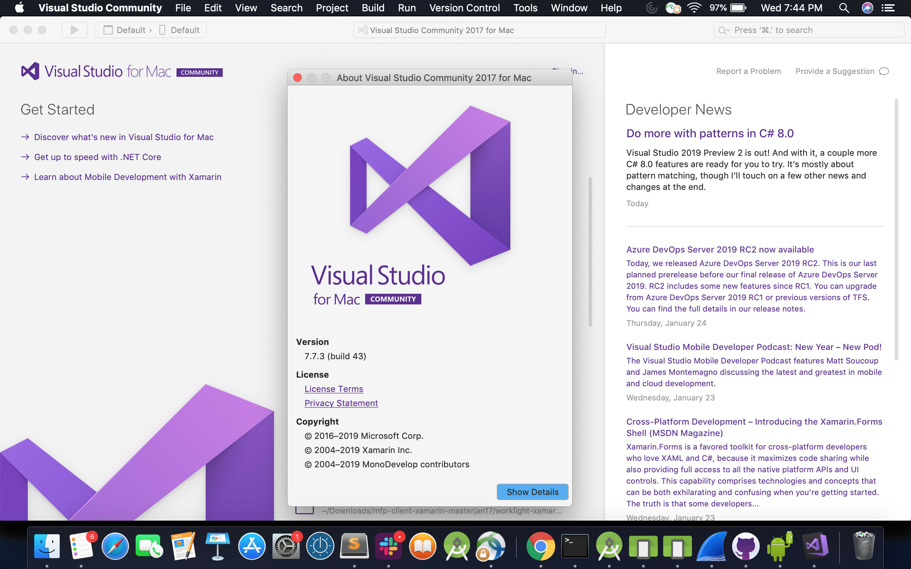

<!-- NLS_CHARSET=UTF-8 -->
## Visão Geral
{: #overview }
Esse tutorial explica as etapas que um desenvolvedor precisa seguir para poder desenvolver e testar aplicativos Xamarin C# nativos para dispositivos Android ou iOS. Essas etapas incluem a instalação do Visual Studio.

**Pré-requisito:** Conforme você configura o ambiente de desenvolvimento do Xamarin, certifique-se também de ler o tutorial [Configurando o ambiente de desenvolvimento do MobileFirst](../../development/).

### Desenvolvimento
{: #development }
Aplicativos Xamarin são desenvolvidos com o uso do [Microsoft Visual Studio](https://www.visualstudio.com/). O Visual Studio pode ser instalado no Mac OS ou no Windows.  

O Visual Studio pode ser transferido por download em [Downloads do Visual Studio](https://visualstudio.microsoft.com/downloads/)

## O que Vem a Seguir
{: #whats-next }
Agora que os ambientes de desenvolvimento do {{ site.data.keys.product_full }} e do Xamarin estão configurados, continue com a categoria [Iniciação Rápida](../../../quick-start/xamarin/) para uma experiência com o {{ site.data.keys.product }} ou com [Todos os tutoriais](../../../all-tutorials) para saber aspectos específicos de desenvolvimento do {{ site.data.keys.product }}.
