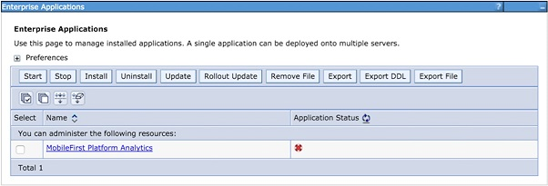
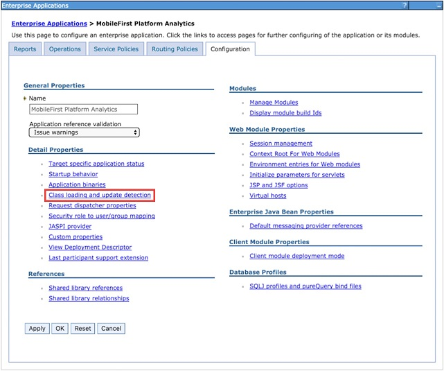
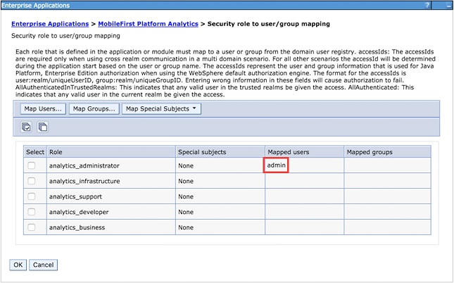
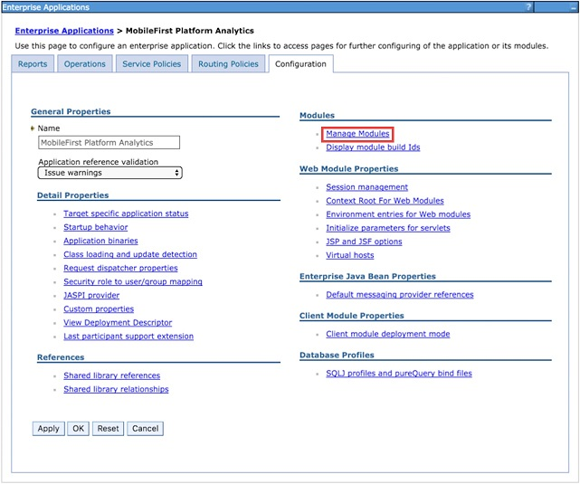

<!-- NLS_CHARSET=UTF-8 -->
## Visão Geral
{: #overview }
O {{ site.data.keys.mf_analytics_server }} é implementado e fornecido como um conjunto de dois arquivos web application archive (WAR) Java EE padrão, ou um arquivo enterprise application archive (EAR). Portanto, ele pode ser instalado em um dos seguintes servidores de aplicativos suportados: WebSphere Application Server, WebSphere Application Server Liberty ou Apache Tomcat (Somente arquivos WAR).

{{ site.data.keys.mf_analytics_server }} O usa uma biblioteca Elasticsearch integrada para o armazenamento de dados e gerenciamento de cluster. Como ele pretende ser um mecanismo de procura e consulta de memória altamente eficiente, que requer E/S de disco rápida, é preciso seguir alguns requisitos do sistema de produção. Em geral, muito provavelmente você ficará sem memória e disco (ou descobre que a E/S de disco é seu gargalo de desempenho) antes que a CPU se torne um problema. Em um ambiente em cluster, você deseja um cluster de nós rápidos, confiáveis e colocalizados.

#### Ir para
{: #jump-to }

* [Requisitos de sistema](#system-requirements)
* [Considerações de capacidade](#capacity-considerations)
* [Instalando o {{ site.data.keys.mf_analytics }} no WebSphere Application Server Liberty](#installing-mobilefirst-analytics-on-websphere-application-server-liberty)
* [Instalando o {{ site.data.keys.mf_analytics }} no Tomcat](#installing-mobilefirst-analytics-on-tomcat)
* [Instalando o {{ site.data.keys.mf_analytics }} no WebSphere Application Server](#installing-mobilefirst-analytics-on-websphere-application-server)
* [Instalando o {{ site.data.keys.mf_analytics }} com tarefas Ant](#installing-mobilefirst-analytics-with-ant-tasks)
* [Instalando o {{ site.data.keys.mf_analytics_server }} em servidores que executam versões anteriores](#installing-mobilefirst-analytics-server-on-servers-running-previous-versions)

## Requisitos de Sistema
{: #system-requirements }

### Sistemas operacionais
{: #operating-systems }
* CentOS/RHEL 6.x/7.x
* Oracle Enterprise Linux 6/7 somente com Kernel RHEL
* Ubuntu 12.04/14.04
* SLES 11/12
* OpenSuSE 13.2
* Windows Server 2012/R2
* Debian 7

### JVM
{: #jvm }
* Oracle JVM 1.7u55+
* Oracle JVM 1.8u20+
* IcedTea OpenJDK 1.7.0.55+

### Hardware
{: #hardware }
* RAM: uma quantidade maior de RAM é melhor, mas sem ultrapassar 64 GB por nó. 32 GB e 16 GB também são aceitáveis. Menos que 8 GB requer muitos nós pequenos no cluster, e 64 GB é um desperdício e problemático devido à forma que Java usa a memória para ponteiros.
* Disco: use SSDs quando possível, ou discos tradicionais de rápida rotação na configuração RAID 0 se os SSDs não forem possíveis.
* CPU: a CPU não tende a ser o gargalo de desempenho. Use sistemas com 2 a 8 núcleos.
* Rede: quando você precisar de ampliação horizontalmente, será necessário um datacenter rápido, confiável, com velocidades suportadas de 1 GbE a 10 GbE.

### Configuração de hardware
{: #hardware-configuration }
* Forneça para sua JVM metade da RAM disponível, mas não exceda 32 GB
    * Configurando a variável de ambiente **ES\_HEAP\_SIZE** como 32g.
    * Configurando as sinalizações de JVM usando -Xmx32g -Xms32g.
* Desativar troca de disco. Permitir que o sistema operacional ative e desative a troca de disco do heap reduz significativamente o desempenho.
    * Temporariamente: `sudo swapoff -a`
    * Permanentemente: edite **/etc/fstab** de acordo com a documentação do sistema operacional.
    * Se nenhuma opção for possível, configure a opção de Elasticsearch **bootstrap.mlockall: true** (esse valor é o padrão na instância integrada de Elasticsearch).
* Aumente os descritores de arquivos abertos permitidos.
    * O Linux geralmente limita um número por processo de descritores de arquivos abertos a um pequeno 1024.
    * Consulte a documentação do sistema operacional para saber como aumentar permanentemente esse valor para algo muito maior, como 64.000.
* O Elasticsearch também usa uma combinação de NioFS e MMapFS para os vários arquivos. Aumente a contagem máxima de mapas para que haja uma grande quantidade de memória virtual disponível para arquivos mapeados.
    * Temporariamente: `sysctl -w vm.max_map_count=262144`
    * Permanentemente: Modifique a configuração **vm.max\_map\_count** em seu **/etc/sysctl.conf**.
* Se você usar BSDs e Linux, certifique-se de que o planejador de E/S do sistema operacional esteja configurado como **prazo final** ou **noop**, não **cfq**.

## Considerações de capacidade
{: #capacity-considerations }
A capacidade é a única pergunta mais comum. Qual a quantidade de RAM necessária? Qual a quantidade de espaço em disco? Quantos nós? A resposta é sempre: depende.

O IBM {{ site.data.keys.mf_analytics }} Analytics oferece a oportunidade de coletar muitos tipos de eventos heterogêneos, incluindo logs de depuração SDK brutos do cliente, eventos de rede relatados pelo servidor, dados customizados e muito mais. É um sistema big data com requisitos do sistema big data.

O tipo e quantidade de dados que você escolheu coletar, e por quanto tempo você opta por mantê-los, tem um impacto significativo nos requisitos de armazenamento e desempenho geral. Como um exemplo, considere as seguintes perguntas.

* Os logs do cliente de depuração brutos são úteis depois de um mês?
* Você está usando o recurso **Alertas** no {{ site.data.keys.mf_analytics }}? Se sim, você está consultando eventos que ocorreram nos últimos minutos ou em um intervalo mais longo?
* Está usando gráficos customizados? Se sim, você está criando esses gráficos para dados integrados ou pares de chave/valor instrumentados customizados? Por quanto tempo você mantém os dados?

Os gráficos integrados no {{ site.data.keys.mf_analytics_console }} são renderizados consultando dados que o {{ site.data.keys.mf_analytics_server }} já resumiu e otimizou especificamente para a experiência do usuário do console mais rápida possível. Como são resumidos previamente e otimizados para os gráficos integrados, eles não são adequados para uso em alertas ou gráficos customizados em que o usuário do console define as consultas.

Ao consultar documentos brutos, aplicar filtros, executar agregações e solicitar que o mecanismo de consulta subjacente calcule médias e porcentagens, necessariamente o desempenho da consulta é prejudicado. É o caso de uso que requer cuidadosas considerações de capacidade. Após o desempenho da consulta ser prejudicado, é hora de decidir se você realmente deve manter dados antigos para visibilidade do console em tempo real ou limpá-los do {{ site.data.keys.mf_analytics_server }}. A visibilidade do console em tempo real realmente é útil para dados de quatro meses atrás?

### Índices, shards e nós
{: #indicies-shards-and-nodes }
O armazenamento de dados subjacente é Elasticsearch. Você deve saber um pouco sobre índices, shards e nós, e como a configuração afeta o desempenho. Grosseiramente, pode-se pensar em um índice como uma unidade lógica de dados. Um índice é mapeado de um para muitos em shards onde a chave de configuração é shards. O {{ site.data.keys.mf_analytics_server }} cria um índice separado por tipo de documento. Se sua configuração não descartar nenhum tipo de documento, você terá vários índices criados que são equivalentes ao número de tipos de documentos oferecidos pelo {{ site.data.keys.mf_analytics_server }}.

Se você configurar os shards como 1, cada índice terá somente um shard primário no qual os dados são gravados. Se você configurar os shards como 10, cada índice poderá ser balanceado para 10 shards. No entanto, mais shards têm um custo de desempenho quando você tiver apenas um nó. Esse nó agora está balanceando cada índice para 10 shards no mesmo disco físico. Somente configure shards como 10 se planejar imediatamente (ou quase imediatamente) uma ampliação para 10 nós físicos no cluster.

O mesmo princípio se aplica a **réplicas**. Configure **réplicas** como algo maior que 0 somente se você pretende imediatamente (ou quase imediatamente) uma ampliação do número de nós para corresponder à conta.  
Por exemplo, se você configurar **shards** como 4 e **réplicas** como 2, poderá aumentar para 8 nós, que é 4 * 2.

## Instalando o {{ site.data.keys.mf_analytics }} no WebSphere Application Server Liberty
{: #installing-mobilefirst-analytics-on-websphere-application-server-liberty }
Certifique-se de que já tenha o arquivo EAR do {{ site.data.keys.mf_analytics }}. Para obter informações adicionais sobre os artefatos de instalação, consulte [Instalando o {{ site.data.keys.mf_server }} em um servidor de aplicativos](../../appserver). O arquivo **analytics.ear** está localizado na pasta `<mf_server_install_dir>\analytics`. Para obter informações adicionais sobre como fazer download e instalar o WebSphere Application Server Liberty, consulte o artigo [Sobre o WebSphere Liberty](https://developer.ibm.com/wasdev/websphere-liberty/) no IBM developerWorks.

1. Crie um servidor executando o comando a seguir em sua pasta **./wlp/bin**.

   ```bash
   ./server create <serverName>
   ```

2. Instale os recursos a seguir executando o seguinte comando em sua pasta **./bin**.

   ```bash
   ./featureManager install jsp-2.2 ssl-1.0 appSecurity-1.0 localConnector-1.0
   ```

3. Inclua o arquivo **analytics.ear** na pasta `./usr/servers/<serverName>/apps` de seu Liberty Server.
4. Substitua o conteúdo da tag `<featureManager>` do arquivo `./usr/servers/<serverName>/server.xml` pelo conteúdo a seguir:

   ```xml
   <featureManager>
        <feature>jsp-2.2</feature>
        <feature>ssl-1.0</feature>
        <feature>appSecurity-1.0</feature>
        <feature>localConnector-1.0</feature>
   </featureManager>
   ```

5. Configure **analytics.ear** como um aplicativo com segurança baseada em função no arquivo **server.xml**. O exemplo a seguir cria um registro do usuário básico codificado permanentemente e designa um usuário a cada uma das diferentes funções de análise de dados.

   ```xml
   <application location="analytics.ear" name="analytics-ear" type="ear">
        <application-bnd>
            <security-role name="analytics_administrator">
                <user name="admin"/>
            </security-role>
            <security-role name="analytics_infrastructure">
                <user name="infrastructure"/>
            </security-role>
            <security-role name="analytics_support">
                <user name="support"/>
            </security-role>
            <security-role name="analytics_developer">
                <user name="developer"/>
            </security-role>
            <security-role name="analytics_business">
                <user name="business"/>
            </security-role>
        </application-bnd>
   </application>

   <basicRegistry id="worklight" realm="worklightRealm">
        <user name="business" password="demo"/>
        <user name="developer" password="demo"/>
        <user name="support" password="demo"/>
        <user name="infrastructure" password="demo"/>
        <user name="admin" password="admin"/>
   </basicRegistry>
   ```

   > Para obter informações adicionais sobre como configurar outros tipos de registro do usuário, como LDAP, consulte o tópico [Configurando um registro do usuário para Liberty](http://ibm.biz/knowctr#SSAW57_8.5.5/com.ibm.websphere.wlp.nd.iseries.doc/ae/twlp_sec_registries.html) na documentação do produto WebSphere Application Server.

6. Inicie o Liberty Server executando o seguinte comando dentro da pasta **bin**

   ```bash
   ./server start <serverName>
   ```

7. Vá para o {{ site.data.keys.mf_analytics_console }}.

   ```bash
   http://localhost:9080/analytics/console
   ```

Para obter informações adicionais sobre como administrar o WebSphere Application Server Liberty, consulte o tópico [Administrando o Liberty a partir da linha de comandos](http://ibm.biz/knowctr#SSAW57_8.5.5/com.ibm.websphere.wlp.nd.multiplatform.doc/ae/twlp_admin_script.html) na documentação do produto WebSphere Application Server.

## Instalando o {{ site.data.keys.mf_analytics }} no Tomcat
{: #installing-mobilefirst-analytics-on-tomcat }
Certifique-se de que já tenha os arquivos  {{ site.data.keys.mf_analytics }} WAR do. Para obter informações adicionais sobre os artefatos de instalação, consulte [Instalando o {{ site.data.keys.mf_server }} em um servidor de aplicativos](../../appserver). Os arquivos **analytics-ui.war** e **analytics-service.war** estão localizados na pasta **<mf_server_install_dir>\analytics**. Para obter mais informações sobre como fazer o download e instalar o Tomcat, consulte [Apache Tomcat](http://tomcat.apache.org/). Assegure-se de fazer download da versão que suporte Java 7 ou superior. Para obter mais informações sobre qual versão do Tomcat suporta Java 7, consulte [Versões do Apache Tomcat](http://tomcat.apache.org/whichversion.html).

1. Inclua os arquivos **analytics-service.war** e **analytics-ui.war** na pasta **webapps** do Tomcat.
2. Remova o comentário da seção a seguir no arquivo **conf/server.xml**, que está presente, mas comentado, em um archive Tomcat recém-transferido por download.

   ```xml
   <Valve className="org.apache.catalina.authenticator.SingleSignOn"/>
   ```

3. Declare os dois arquivos war no arquivo **conf/server.xml** e defina o registro do usuário.

   ```xml
   <Context docBase ="analytics-service" path ="/analytics-service"></Context>
   <Context docBase ="analytics" path ="/analytics"></Context>
   <Realm className ="org.apache.catalina.realm.MemoryRealm"/>
   ```

   O **MemoryRealm** reconhece os usuários que estão definidos no arquivo **conf/tomcat-users.xml**. Para obter mais informações sobre outras opções, consulte [Instruções de configuração do domínio do Apache Tomcat](http://tomcat.apache.org/tomcat-7.0-doc/realm-howto.html).

4. Inclua as seções a seguir no arquivo **conf/tomcat-users.xml** para configurar **MemoryRealm**.
    * Inclua as funções de segurança.

      ```xml
      <role rolename="analytics_administrator"/>
      <role rolename="analytics_infrastructure"/>
      <role rolename="analytics_support"/>
      <role rolename="analytics_developer"/>
      <role rolename="analytics_business"/>
      ```
    * Inclua alguns usuários com as funções desejadas.

      ```xml
      <user name="admin" password="admin" roles="analytics_administrator"/>
      <user name="support" password="demo" roles="analytics_support"/>
      <user name="business" password="demo" roles="analytics_business"/>
      <user name="developer" password="demo" roles="analytics_developer"/>
      <user name="infrastructure" password="demo" roles="analytics_infrastructure"/>
      ```    
    * Inicie seu servidor Tomcat e acesse {{ site.data.keys.mf_analytics_console }}.

      ```xml
      http://localhost:8080/analytics/console
      ```

    Para obter mais informações sobre como iniciar o servidor Tomcat, consulte o site oficial do Tomcat. Por exemplo, [Apache Tomcat 7](http://tomcat.apache.org/tomcat-7.0-doc/introduction.html) para Tomcat 7.0.

## Instalando o {{ site.data.keys.mf_analytics }} no WebSphere Application Server
{: #installing-mobilefirst-analytics-on-websphere-application-server }
Para obter informações adicionais sobre as etapas iniciais de instalação para adquirir os artefatos de instalação (arquivos JAR e EAR), consulte [Instalando o {{ site.data.keys.mf_server }} em um servidor de aplicativos](../../appserver). Os arquivos **analytics.ear**, **analytics-ui.war** e **analytics-service.war** estão localizados na pasta **<mf_server_install_dir>\analytics**.

As etapas a seguir descrevem como instalar e executar o arquivo EAR do Analytics no WebSphere Application Server. Se estiver instalando os arquivos WAR individuais no WebSphere Application Server, siga apenas as etapas de 2 a 7 no arquivo WAR **analytics-service** depois de implementar ambos os arquivos WAR. A ordem de carregamento de classes não deve ser alterada no arquivo WAR analytics-ui.

1. Implemente o arquivo EAR para o servidor de aplicativos, mas não o inicie. . Para obter informações adicionais sobre como instalar um arquivo EAR no WebSphere Application Server, consulte o tópico [Instalando arquivos de aplicativo corporativo com o console](http://ibm.biz/knowctr#SSAW57_8.5.5/com.ibm.websphere.nd.multiplatform.doc/ae/trun_app_instwiz.html) na documentação do produto WebSphere Application Server.

2. Selecione o aplicativo **MobileFirst Analytics** da lista **Aplicativos corporativos**.

    

3. Clique em **Carregamento de Classes e Detecção de Atualização**.

    

4. Configure a ordem de carregamento de classe como **pai por último**.

    

5. Clique em **Mapeamento de função de segurança para usuário/grupo** para mapear o usuário administrativo.

    

6. Clique em **Gerenciar Módulos**.

    

7. Selecione o módulo **analytics** e mude a ordem do carregador de classes para **pai por último**.

    

8. Ative a **Segurança administrativa** e a **segurança do aplicativo** no console de administração do WebSphere Application Server:
    * Efetue login no console administrativo do WebSphere Application Server.
    * No menu **Segurança > Segurança global**, certifique-se de que as opções **Ativar segurança administrativa** e **Ativar segurança do aplicativo** estejam selecionadas. Nota: a segurança do aplicativo pode ser selecionada somente depois que a **Segurança administrativa** for ativada.
    * Clique em **OK** e salve as alterações.
9. Inicie o aplicativo {{ site.data.keys.mf_analytics }} e acesse o link no navegador: `http://<hostname>:<port>/analytics/console`.

## Instalando o {{ site.data.keys.mf_analytics }} com tarefas Ant
{: #installing-mobilefirst-analytics-with-ant-tasks }
Certifique-se de que tenha os arquivos WAR e de configuração necessários: **analytics-ui.war** e **analytics-service.war**. Para obter informações adicionais sobre os artefatos de instalação, consulte [Instalando o {{ site.data.keys.mf_server }} em um servidor de aplicativos](../../appserver). Os arquivos **analytics-ui.war** e **analytics-service.war** estão localizados em **MobileFirst_Platform_Server\analytics**.

Deve-se executar a tarefa Ant no computador em que o servidor de aplicativos está instalado, ou o Network Deployment Manager para WebSphere Application Server Network Deployment. Se desejar iniciar a tarefa Ant a partir de um computador no qual o {{ site.data.keys.mf_server }} não está instalado, será preciso copiar o arquivo **<mf_server_install_dir>/MobileFirstServer/mfp-ant-deployer.jar** para esse computador.

> Nota: o item temporário **mf_server_install_dir** é o diretório onde o {{ site.data.keys.mf_server }} foi instalado.

1. Edite o script Ant que você usará posteriormente para implementar arquivos WAR do {{ site.data.keys.mf_analytics }}.
    * Revise os arquivos de configuração de amostra em [Arquivos de configuração de amostra para o {{ site.data.keys.mf_analytics }}](../../installation-reference/#sample-configuration-files-for-mobilefirst-analytics).
    * Substitua os valores de item temporário pelas propriedades no início do arquivo.

    > Nota: os seguintes caracteres especiais devem estar escapados quando forem usados nos valores dos scripts XML Ant:
    >
    > * O símbolo de dólar ($) deve ser escrito como $$, , a não ser que você explicitamente deseje referenciar uma variável Ant por meio a sintaxe ${variável}, conforme descrito na seção [Propriedades](http://ant.apache.org/manual/properties.html) do Manual do Apache Ant.
    > * O caractere e comercial (&) deve ser escrito como &amp;, a menos que você deseje referenciar explicitamente uma entidade XML.
    > * Aspas duplas (") devem ser escritas como &quot;, exceto quando estiverem dentro de uma sequência que estiver dentro de aspas simples.

2. Se você instalar um cluster de nós em vários servidores:
    * Você deve remover o comentário da propriedade **wl.analytics.masters.list** e configurar o seu valor para a lista de nome do host e da porta de transporte dos nós mestres. Por exemplo: `node1.mycompany.com:96000,node2.mycompany.com:96000`
    * Inclua o atributo **mastersList** nos elementos **elasticsearch** nas tarefas **installanalytics**, **updateanalytics** e **uninstallanalytics**.

    **Nota:** Se você instalar em um cluster no WebSphere Application Server Network Deployment, e não configurar a propriedade, a tarefa Ant irá calcular os terminais de dados para todos os membros do cluster no momento da instalação, e configurará a propriedade JNDI **masternodes** para esse valor.

3. Para implementar os arquivos WAR, execute o seguinte comando: `ant -f configure-appServer-analytics.xml install`
    É possível localizar o comando Ant em **mf_server_install_dir/shortcuts**. Isso instala um nó do {{ site.data.keys.mf_analytics }}, com o tipo padrão principal e dados no servidor, ou em cada membro de um cluster, se você instalar no WebSphere Application Server Network Deployment.
4. Salve o arquivo Ant. Você pode precisar dele posteriormente para aplicar um fix pack ou executar um upgrade.
    Se não desejar salvar as senhas, é possível substituí-las por "************" (12 estrelas) para prompt interativo.

    **Nota:** Se você incluir um nó em um cluster de {{ site.data.keys.mf_analytics }}, deverá atualizar a propriedade JNDI analytics/masternodes, para que ela contenha as portas de todos os nós principais do cluster.

## Instalando o {{ site.data.keys.mf_analytics_server }} em servidores que executam versões anteriores
{: #installing-mobilefirst-analytics-server-on-servers-running-previous-versions }
Embora não haja nenhuma opção para fazer upgrade de versões anteriores do {{ site.data.keys.mf_analytics_server }}, ao instalar o {{ site.data.keys.mf_analytics_server }} V8.0.0 em um servidor que hospedou uma versão anterior, algumas propriedades e dados de análise de dados precisam ser migrados.

Para servidores que anteriormente executavam versões anteriores do {{ site.data.keys.mf_analytics_server }}, atualize os dados de análise de dados e as propriedades JNDI.

### Migração de propriedades de servidor usadas por versões anteriores do {{ site.data.keys.mf_analytics_server }}
{: #migration-of-server-properties-used-by-previous-versions-of-mobilefirst-analytics-server }
Se você instalar o {{ site.data.keys.mf_analytics_server }} V8.0.0 em um servidor que anteriormente executava uma versão anterior do {{ site.data.keys.mf_analytics_server }}, será preciso atualizar os valores das propriedades JNDI no servidor hosting.

Alguns tipos de eventos mudaram entre versões anteriores do {{ site.data.keys.mf_analytics_server }} e a V8.0.0. Devido a esta mudança, quaisquer propriedades JNDI que foram configuradas anteriormente em seu arquivo de configuração do servidor devem ser convertidas para o novo tipo de evento.

A tabela a seguir mostra o mapeamento entre os tipos de eventos antigos e novos. Alguns tipos de eventos não mudaram.

| Tipo de evento antigo            | Novo tipo de evento         |
|---------------------------|------------------------|
| AlertDefinition	        | AlertDefinition        |
| AlertNotification	        | AlertNotification      |
| AlertRunnerNode	        | AlertRunnerNode        |
| AnalyticsConfiguration    | AnalyticsConfiguration |
| CustomCharts	            | CustomChart            |
| CustomData	            | CustomData             |
| Devices	                | Dispositivo                 |
| MfpAppLogs                | AppLog                 |
| MfpAppPushAction          | AppPushAction          |
| MfpAppSession	            | AppSession             |
| ServerLogs	            | ServerLog              |
| ServerNetworkTransactions | NetworkTransaction     |
| ServerPushNotifications   | PushNotification       |
| ServerPushSubscriptions   | PushSubscription       |
| Users	                    | User                   |
| inboundRequestURL	        | resourceURL            |
| mfpAppName	            | appName                |
| mfpAppVersion	            | appVersion             |

### Migração de dados de análise de dados
{: #analytics-data-migration }
As partes internas do {{ site.data.keys.mf_analytics_console }} foram melhoradas, o que exigiu mudança do formato no qual os dados são armazenados. Para continuar a interagir com os dados de análise de dados que já foram coletados, os dados devem ser migrados no novo formato de dados.

Ao visualizar pela primeira vez o {{ site.data.keys.mf_analytics_console }} após o upgrade para a V8.0.0, nenhuma estatística será renderizada no {{ site.data.keys.mf_analytics_console }}. Os seus dados não foram perdidos, mas eles devem ser migrados para o novo formato de dados.

Será exibido um alerta em cada página do {{ site.data.keys.mf_analytics_console }} que lembra que os documentos devem ser migrados. O texto de alerta inclui um link para a página **Migração**.

A imagem a seguir mostra um alerta de amostra da página **Visão geral** da seção **Painel**:


### Página de migração
{: #migration-page }
É possível acessar a página Migração a partir do ícone de chave inglesa no {{ site.data.keys.mf_analytics_console }}. Na página **Migração**, é possível ver quantos documentos devem ser migrados, e em quais índices eles estão armazenados. Somente uma ação está disponível: **Executar migração**.

A imagem a seguir mostra a página **Migração** quando você tiver documentos que devem ser migrados:


> **Nota:** Esse processo pode levar um longo tempo, dependendo da quantidade de dados que você possui, e ele não pode ser interrompido durante a migração.

A migração pode levar aproximadamente 3 minutos para migrar 1 milhão de documentos em um único nó com 32G de RAM, com 16G alocados para a JVM, com um processador 4-core. Os documentos que não forem migrados não serão consultados, portanto, eles não serão renderizados no {{ site.data.keys.mf_analytics_console }}.

Se a migração falhar durante o andamento, tente novamente a migração. Tentar novamente a migração não migra novamente os documentos que já foram migrados e sua integridade de dados é mantida.
