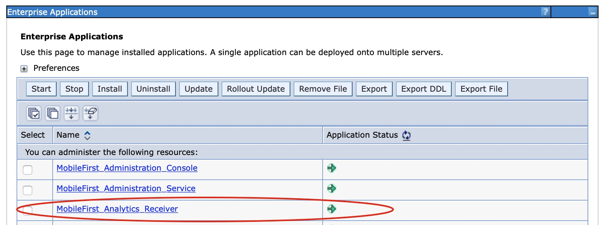

<!-- NLS_CHARSET=UTF-8 -->
## Visão Geral
{: #overview }
O {{ site.data.keys.mf_analytics_receiver_server }} é implementado e enviado como um arquivo web application archive (WAR) padrão do Java EE. Portanto, ele pode ser instalado em qualquer um dos servidores de aplicativos suportados a seguir: WebSphere Application Server, WebSphere Application Server Liberty ou Apache Tomcat (somente arquivos WAR).

#### Ir para
{: #jump-to }

* [Requisitos de sistema](#system-requirements)
* [Considerações de capacidade](#capacity-considerations)
* [Instalando o {{ site.data.keys.mf_analytics_receiver }} no WebSphere Application Server Liberty](#installing-mobilefirst-analytics-receiver-on-websphere-application-server-liberty)
* [Instalando o {{ site.data.keys.mf_analytics_receiver }} no Tomcat](#installing-mobilefirst-analytics-receiver-on-tomcat)
* [Instalando o {{ site.data.keys.mf_analytics_receiver }} no WebSphere Application Server](#installing-mobilefirst-analytics-receiver-on-websphere-application-server)
* [Instalando o {{ site.data.keys.mf_analytics_receiver }} com tarefas Ant](#installing-mobilefirst-analytics-receiver-with-ant-tasks)

## Requisitos de Sistema
{: #system-requirements }

### Sistemas operacionais
{: #operating-systems }
* CentOS/RHEL 6.x/7.x
* Oracle Enterprise Linux 6/7 somente com Kernel RHEL
* Ubuntu 12.04/14.04
* SLES 11/12
* OpenSuSE 13.2
* Windows Server 2012/R2
* Debian 7

### JVM
{: #jvm }
* Oracle JVM 1.7u55+
* Oracle JVM 1.8u20+
* IcedTea OpenJDK 1.7.0.55+

### Hardware
{: #hardware }
* RAM: uma quantidade maior de RAM é melhor, mas sem ultrapassar 64 GB por nó. 32 GB e 16 GB também são aceitáveis. Menos que 8 GB requer muitos nós pequenos no cluster, e 64 GB é um desperdício e problemático devido à forma que Java usa a memória para ponteiros.
* Disco: use SSDs quando possível, ou discos tradicionais de rápida rotação na configuração RAID 0 se os SSDs não forem possíveis.
* CPU: a CPU não tende a ser o gargalo de desempenho. Use sistemas com 2 a 8 núcleos.
* Rede: quando você precisar ampliar a escala horizontalmente, será necessário um data center rápido e confiável com velocidades suportadas de 1 GbE a 10 GbE.

### Configuração de hardware
{: #hardware-configuration }
* Dê à sua JVM um tamanho amplo para escalar a fila na memória com um tamanho de 10000 (ou seja, Xmx mínimo como 6 GB).
* Se você usar BSDs e Linux, certifique-se de que o planejador de E/S do sistema operacional esteja configurado como **prazo final** ou **noop**, não **cfq**.

## Considerações de capacidade
{: #capacity-considerations }
A capacidade é a única pergunta mais comum. Qual a quantidade de RAM necessária? Qual a quantidade de espaço em disco? Quantos nós? A resposta é sempre subjetiva.

O IBM {{ site.data.keys.mf_analytics_receiver }} não requer espaço em disco, uma vez que ele apenas recebe logs de aplicativos móveis e os encaminha para o servidor de analítica, não há armazenamento de dados de eventos.

## Instalando o {{ site.data.keys.mf_analytics_receiver }} no WebSphere Application Server Liberty
{: #installing-mobilefirst-analytics-receiver-on-websphere-application-server-liberty }
Assegure-se de que você já tenha o arquivo WAR do {{ site.data.keys.mf_analytics_receiver }}. Para obter informações adicionais sobre os artefatos de instalação, consulte [Instalando o {{ site.data.keys.mf_server }} em um servidor de aplicativos](../../prod-env/appserver). O arquivo **analytics-receiver.war** está localizado na pasta `<mf_server_install_dir>\analyticsreceiver`. Para obter informações adicionais sobre como fazer download e instalar o WebSphere Application Server Liberty, consulte o artigo [Sobre o WebSphere Liberty](https://developer.ibm.com/wasdev/websphere-liberty/) no IBM developerWorks.

1. Crie um servidor executando o comando a seguir em sua pasta `./wlp/bin`.

   ```bash
   ./server create <serverName>
   ```

2. Instale recursos executando o comando a seguir por meio de sua pasta `./bin`.

   ```bash
   ./featureManager install jsp-2.2 ssl-1.0 appSecurity-1.0 localConnector-1.0
   ```

3. Inclua o arquivo **analytics-receiver.war** na pasta `./usr/servers/<serverName>/apps` do seu Liberty Server.
4. Substitua os conteúdos da tag **<featureManager>** do arquivo `./usr/servers/<serverName>/server.xml` pelo conteúdo a seguir:

   ```xml
   <featureManager>
        <feature>jsp-2.2</feature>
        <feature>ssl-1.0</feature>
        <feature>appSecurity-1.0</feature>
        <feature>localConnector-1.0</feature>
   </featureManager>
   ```

5. Configure **analytics-receiver.war** como um aplicativo com segurança baseada em função no arquivo `server.xml`. O exemplo a seguir cria um registro do usuário básico codificado permanentemente e designa um usuário a cada uma das diferentes funções de analítica.

   ```xml
   <application id="analytics-receiver" name="analytics-receiver" location="analytics-receiver.war" type="war">
        <application-bnd>
            <security-role name="analytics_administrator">
                <user name="admin"/>
            </security-role>
            <security-role name="analytics_infrastructure">
                <user name="infrastructure"/>
            </security-role>
            <security-role name="analytics_support">
                <user name="support"/>
            </security-role>
            <security-role name="analytics_developer">
                <user name="developer"/>
            </security-role>
            <security-role name="analytics_business">
                <user name="business"/>
            </security-role>
        </application-bnd>
   </application>

   <basicRegistry id="worklight" realm="worklightRealm">
        <user name="business" password="demo"/>
        <user name="developer" password="demo"/>
        <user name="support" password="demo"/>
        <user name="infrastructure" password="demo"/>
        <user name="admin" password="admin"/>
   </basicRegistry>
   ```

   > Para obter mais informações sobre como configurar outros tipos de registro do usuário, como LDAP, consulte o tópico [Configurando um registro do usuário para Liberty](http://ibm.biz/knowctr#SSAW57_8.5.5/com.ibm.websphere.wlp.nd.iseries.doc/ae/twlp_sec_registries.html) na documentação do produto WebSphere Application Server.

6. Inicie o Liberty Server executando o seguinte comando dentro da pasta **bin**

   ```bash
   ./server start <serverName>
   ```

7. Verifique o serviço chamando a URL de funcionamento

   ```bash
   http://localhost:9080/analytics-receiver/rest/data/health
   ```

Para obter mais informações sobre a administração do WebSphere Application Server Liberty, consulte o tópico [Administrando o Liberty por meio da linha de comando](http://ibm.biz/knowctr#SSAW57_8.5.5/com.ibm.websphere.wlp.nd.multiplatform.doc/ae/twlp_admin_script.html) na documentação do produto WebSphere Application Server.

## Instalando o {{ site.data.keys.mf_analytics_receiver }} no Tomcat
{: #installing-mobilefirst-analytics-receiver-on-tomcat }
Certifique-se de que já tenha os arquivos  {{ site.data.keys.mf_analytics_receiver }} WAR do. Para obter informações adicionais sobre os artefatos de instalação, consulte [Instalando o {{ site.data.keys.mf_server }} em um servidor de aplicativos](../../prod-env/appserver). O arquivo **analytics-receiver.war** está localizado na pasta `<mf_server_install_dir>\analyticsreceiver`. Para obter mais informações sobre como fazer download e instalar o Tomcat, consulte [Apache Tomcat](http://tomcat.apache.org/). Assegure-se de fazer download da versão que suporte Java 7 ou superior. Para obter mais informações sobre qual versão do Tomcat suporta Java 7, consulte [Versões do Apache Tomcat](http://tomcat.apache.org/whichversion.html).

1. Inclua o arquivo **analytics-receiver.war** na pasta `webapps` do Tomcat.
2. Remova o comentário da seção a seguir no arquivo `conf/server.xml` que está comentado em um archive do Tomcat recentemente transferido por download.

   ```xml
   <Valve className="org.apache.catalina.authenticator.SingleSignOn"/>
   ```

3. Declare os dois arquivos war no arquivo `conf/server.xml` e defina o registro do usuário.

   ```xml
   <Context docBase ="analytics-receiver-service" path ="/analytics-receiver"></Context>
   <Realm className ="org.apache.catalina.realm.MemoryRealm"/>
   ```

   O **MemoryRealm** reconhece os usuários que estão definidos no arquivo `conf/tomcat-users.xml`. Para obter informações sobre outras opções disponíveis, consulte [Instruções de configuração da região do Apache Tomcat](http://tomcat.apache.org/tomcat-7.0-doc/realm-howto.html).

4. Inclua as seções a seguir no arquivo `conf/tomcat-users.xml` para configurar **MemoryRealm**.
    * Inclua as funções de segurança.

      ```xml
      <role rolename="analytics_administrator"/>
      <role rolename="analytics_infrastructure"/>
      <role rolename="analytics_support"/>
      <role rolename="analytics_developer"/>
      <role rolename="analytics_business"/>
      ```
    * Inclua alguns usuários com as funções desejadas.

      ```xml
      <user name="admin" password="admin" roles="analytics_administrator"/>
      <user name="support" password="demo" roles="analytics_support"/>
      <user name="business" password="demo" roles="analytics_business"/>
      <user name="developer" password="demo" roles="analytics_developer"/>
      <user name="infrastructure" password="demo" roles="analytics_infrastructure"/>
      ```    
    * Inicie o Tomcat Server e verifique o serviço chamando a URL de funcionamento.

      ```text
      http://localhost:8080/analytics-receiver/rest/data/health
      ```

    Para obter mais informações sobre como iniciar o servidor Tomcat, consulte o site oficial do Tomcat. Por exemplo, [Apache Tomcat 7](http://tomcat.apache.org/tomcat-7.0-doc/introduction.html) para Tomcat 7.0.

## Instalando o {{ site.data.keys.mf_analytics_receiver }} no WebSphere Application Server
{: #installing-mobilefirst-analytics-receiver-on-websphere-application-server }
Para obter informações sobre as etapas iniciais de instalação para aquisição dos artefatos de instalação (arquivos JAR e EAR), consulte [Instalando o {{ site.data.keys.mf_server }} em um servidor de aplicativos](../../prod-env/appserver). O arquivo **analytics-receiver.war** está localizado na pasta `<mf_server_install_dir>\analyticsreceiver`. 

As etapas a seguir descrevem como instalar e executar o arquivo EAR do Analytics no WebSphere Application Server. Se você estiver instalando os arquivos WAR individuais no WebSphere Application Server, siga somente as etapas de 2 a 7 no arquivo WAR do **analytics-receiver** após a implementação.

1. Implemente o arquivo WAR para o servidor de aplicativos, mas não inicie-o. Para obter informações sobre como instalar um arquivo EAR no WebSphere Application Server, consulte o tópico [Instalando os arquivos de aplicativo corporativo com o console](http://ibm.biz/knowctr#SSAW57_8.5.5/com.ibm.websphere.nd.multiplatform.doc/ae/trun_app_instwiz.html) na documentação do produto WebSphere Application Server.

2. Selecione o aplicativo **MobileFirst Analytics Receiver** por meio da lista **Aplicativos corporativos**.

    

3. Clique em **Carregamento de Classes e Detecção de Atualização**.

    

4. Configure a ordem de carregamento de classe como **pai por último**.

    

5. Clique em **Mapeamento de função de segurança para usuário/grupo** para mapear o usuário administrativo.

    

6. Clique em **Gerenciar Módulos**.

    

7. Selecione o módulo **analytics-receiver** e mude a ordem do carregador de classes para **pai por último**.

    

8. Ative a **Segurança administrativa** e a **segurança do aplicativo** no console de administração do WebSphere Application Server:
    * Efetue login no console administrativo do WebSphere Application Server.
    * No menu **Segurança > Segurança global**, assegure-se de que **Ativar segurança administrativa** e **Ativar segurança do aplicativo** estejam ambos selecionados.
    > **Nota**: a segurança do aplicativo pode ser selecionada somente após a ativação de **Segurança administrativa**.
    * Clique em **OK** e salve as alterações.

9. Para permitir que o serviço de Analítica seja acessado por meio da documentação do swagger, conclua as etapas a seguir:
    * Clique em **Servidores > Tipos de servidor > WebSphere Application Servers** e escolha o servidor no qual o serviço Analytics está implementado na lista de servidores.
    * Em **Infraestrutura do servidor**, clique em **Java** e, em seguida, navegue para o **gerenciamento de processo > Definição de processo > Java virtual machine > Propriedades customizadas**.
      - Configure a propriedade customizada a seguir<br/>
        **Nome da propriedade:** *com.ibm.ws.classloader.strict*<br/>
        **Valor:** *true*

10. Inicie o aplicativo {{ site.data.keys.mf_analytics_receiver }} e verifique se a URL de funcionamento está acessível no navegador: `http://<hostname>:<port>/analytics-receiver/rest/data/health`.

## Instalando o {{ site.data.keys.mf_analytics_receiver }} com tarefas Ant
{: #installing-mobilefirst-analytics-receiver-with-ant-tasks }
Assegure-se de que você tenha os arquivos WAR e de configuração necessários: **analytics-receiver.war**. Para obter informações adicionais sobre os artefatos de instalação, consulte [Instalando o {{ site.data.keys.mf_server }} em um servidor de aplicativos](../../prod-env/appserver). O arquivo **analytics-receiver.war** está localizado no `MobileFirst_Platform_Server\AnalyticsReceiver`.

Deve-se executar a tarefa Ant no computador em que o servidor de aplicativos está instalado, ou o Network Deployment Manager para WebSphere Application Server Network Deployment. Para iniciar a tarefa Ant a partir de um computador no qual o {{ site.data.keys.mf_server }} não está instalado, deve-se copiar o arquivo `\<mf_server_install_dir\>/MobileFirstServer/mfp-ant-deployer.jar` para esse computador.

> **Nota**: o **mf_server_install_dir** é o diretório no qual você instalou o {{ site.data.keys.mf_server }}.

1. Edite o script Ant que você usará mais tarde para implementar arquivos WAR do {{ site.data.keys.mf_analytics_receiver }}.
    * Revise os arquivos de configuração de amostra em [Arquivos de configuração de amostra para o {{ site.data.keys.mf_analytics_receiver }}](../../installation-reference/#sample-configuration-files-for-mobilefirst-analytics).
    * Substitua os valores de item temporário pelas propriedades no início do arquivo.

    > **Nota**: os caracteres especiais a seguir deverão ser escapados quando forem usados nos valores dos scripts XML Ant:
    >
    > * O símbolo de dólar ($) deve ser escrito como $$, a menos que você deseje referenciar explicitamente uma variável Ant por meio da sintaxe ${variable}, conforme descrito na seção [Propriedades](http://ant.apache.org/manual/properties.html) do Manual do Apache Ant.
    > * O caractere e comercial (&) deve ser escrito como &amp;, a menos que você deseje referenciar explicitamente a entidade XML.
    > * Aspas duplas (") devem ser escritas como &quot;, exceto quando estiverem dentro de uma sequência que esteja entre aspas simples.

2. Para implementar o arquivo WAR, execute o comando a seguir:
   ```bash
   ant -f configure-appServer-analytics-receiver.xml install
   ```
    É possível localizar o comando Ant em `mf_server_install_dir/shortcuts`. Isso instalará um nó do {{ site.data.keys.mf_analytics_receiver }} no servidor ou em cada membro de um cluster, se você instalar no WebSphere Application Server Network Deployment.
3. Salve o arquivo Ant. Você pode precisar dele posteriormente para aplicar um fix pack ou executar um upgrade.
    Se você não desejar salvar as senhas, será possível substituí-las por `************` (12 asteriscos) para prompt interativo.
