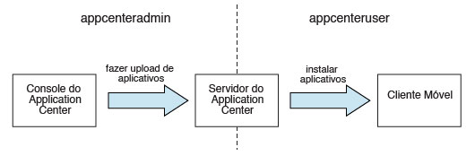
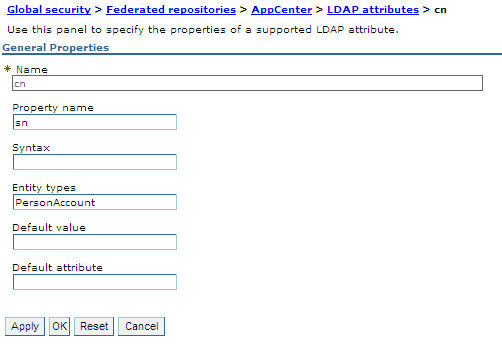
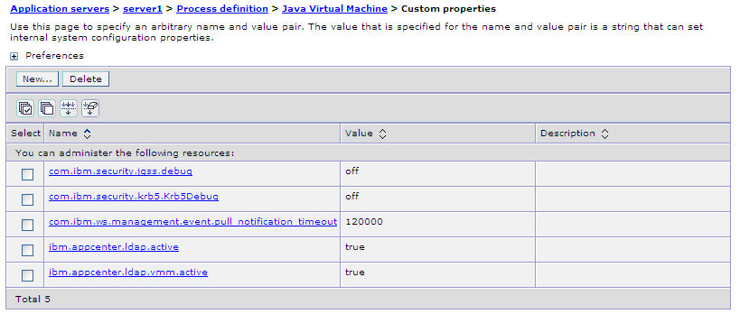
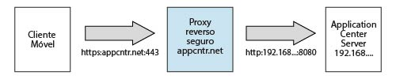

<!-- NLS_CHARSET=UTF-8 -->
## Visão Geral
{: #overview }
Você instalará o Application Center como parte da  {{ site.data.keys.mf_server }} instalação do.
É possível instalá-lo com um dos seguintes métodos:

* Instalação com o IBM Installation Manager
* Instalação com tarefas Ant
* Manual de Instalação

Opcionalmente, é possível criar o banco de dados de sua escolha antes de instalar o {{ site.data.keys.mf_server }} com o Application Center.  
Depois de ter instalado o Application Center no servidor de aplicativos da web de sua escolha, há configuração adicional a ser executada. Para obter informações adicionais, consulte Configurando o Application Center após a instalação abaixo. Se você escolheu uma configuração manual no instalador, consulte a documentação do servidor de sua preferência.

> **Nota:** Se você pretende instalar aplicativos em dispositivos iOS por meio do Application Center, primeiro deve configurar o servidor Application Center com SSL.

Para obter uma lista de arquivos e ferramentas instalados, consulte [Estrutura de distribuição do {{ site.data.keys.mf_server }}](../installation-manager/#distribution-structure-of-mobilefirst-server).

#### Ir para
{: #jump-to }

* [Instalando o Application Center com o IBM Installation Manager](#installing-application-center-with-ibm-installation-manager)
* [Instalando o Application Center com tarefas Ant](#installing-the-application-center-with-ant-tasks)
* [Instalando Manualmente o Application Center](#manually-installing-application-center)
* [Configurando o Application Center após a instalação](#configuring-application-center-after-installation)

## Instalando o Application Center com o IBM Installation Manager
{: #installing-application-center-with-ibm-installation-manager }
Com o IBM Installation Manager, é possível instalar o Application Center, criar seu banco de dados e implementá-lo em um Application Server.  
Antes de iniciar, verifique se o usuário que executa o IBM Installation Manager tem os privilégios que estão descritos em [Pré-requisitos do sistema de arquivos](../prod-env/appserver/#file-system-prerequisites).

Para instalar o IBM Application Center com o IBM Installation Manager, conclua as seguintes etapas.

1. Opcional: É possível criar manualmente bancos de dados para Application Center, conforme descrito em [Criação opcional de bancos de dados](#optional-creation-of-databases) abaixo. O IBM Installation Manager pode criar os bancos de dados do Application Center para você com as configurações padrão.
2. Execute o IBM Installation Manager, conforme descrito em [Executando o IBM Installation Manager](../installation-manager).
3. Selecione **Sim** para a questão **Instalar IBM Application Center**.

#### Ir para
{: #jump-to-1 }
* [Criação Opcional de Bancos de Dados](#optional-creation-of-databases)
* [Instalando o Application Center no WebSphere Application Server Network Deployment](#installing-application-center-in-websphere-application-server-network-deployment)
* [Concluindo a instalação](#completing-the-installation)
* [Logins e senhas padrão criados pelo IBM Installation Manager para o Application Center](#default-logins-and-passwords-created-by-ibm-installation-manager-for-the-application-center)

### Criação Opcional de Bancos de Dados
{: #optional-creation-of-databases }
Para ativar a opção de instalação do Application Center ao executar o instalador do {{ site.data.keys.mf_server }}, é necessário ter determinados direitos de acesso ao banco de dados que o autorizam para a criação de tabelas necessárias para o Application Center.

Se você tiver credenciais de administração de banco de dados suficientes, e se inserir o nome do usuário e a senha de administrador no instalador quando solicitados, o instalador poderá criar os bancos de dados para você. Caso contrário, precisará solicitar ao administrador de banco de dados para criar o banco de dados necessário para você. O banco de dados precisa ser criado antes do início do instalador do {{ site.data.keys.mf_server }}.

Os tópicos a seguir descrevem o procedimento para os sistemas de gerenciamento de banco de dados suportados.

#### Ir para
{: #jump-to-2 }

* [Criando o banco de dados DB2 para Application Center](#creating-the-db2-database-for-application-center)
* [Criando o Banco de Dados MySQL para o Application Center](#creating-the-mysql-database-for-application-center)
* [Criando o Banco de Dados Oracle para o Application Center](#creating-the-oracle-database-for-application-center)

#### Criando o banco de dados DB2 para Application Center
{: #creating-the-db2-database-for-application-center }
Durante a instalação do IBM MobileFirst Foundation, o instalador pode criar o banco de dados do Application Center para você.

O instalador pode criar o banco de dados do Application Center se você inserir o nome e a senha de uma conta do usuário no servidor de banco de dados que tem o privilégio DB2 SYSADM ou SYSCTRL, e a conta pode ser acessada por meio de SSH. Caso contrário, o administrador de banco de dados poderá criar o banco de dados do Application Center para você. Para obter informações adicionais, consulte a documentação do usuário [DB2 Solution](http://ibm.biz/knowctr#SSEPGG_9.7.0/com.ibm.db2.luw.admin.sec.doc/doc/c0055206.html).

Quando você cria o banco de dados manualmente, pode substituir o nome do banco de dados (aqui APPCNTR) e a senha pelo nome do banco de dados e senha de sua escolha.

> **Importante:** É possível nomear seu banco de dados e usuário de forma diferente, ou configurar uma senha diferente, mas certifique-se de inserir corretamente o nome do banco de dados, nome do usuário e senha apropriados na configuração do banco de dados DB2. O DB2 tem um limite de nome do banco de dados de 8 caracteres em todas as plataformas, e tem um limite de comprimento de nome do usuário e senha de 8 caracteres para sistemas UNIX e Linux, e de 30 caracteres para Windows.

1. Crie um usuário do sistema, por exemplo, chamado **wluser** em um grupo de administradores do DB2, como **DB2USERS**, usando os comandos apropriados para seu sistema operacional. Forneça uma senha, por exemplo, **wluser**, a ele. Se desejar que várias instâncias do IBM {{ site.data.keys.mf_server }} se conectem ao mesmo banco de dados, use um nome do usuário diferente para cada conexão. Cada usuário do banco de dados possui um esquema padrão separado. Para obter informações adicionais sobre usuários do banco de dados, consulte a documentação do DB2 e a documentação para seu sistema operacional.

2. Abra um processador de linha de comandos do DB2 com um usuário que tenha permissões **SYSADM** ou **SYSCTRL**:

    * Em sistemas Windows, clique em **Iniciar → IBM DB2 → Processador de Linha de Comandos**
    * Em sistemas Linux ou UNIX, navegue para **~/sqllib/bin** e insira `./db2`.
    * Insira o gerenciador de banco de dados e instruções SQL semelhantes ao seguinte exemplo para criar o banco de dados do Application Center, substituindo o nome de usuário **wluser** pelos nomes de usuário escolhidos:

      ```bash
      CREATE DATABASE APPCNTR COLLATE USING SYSTEM PAGESIZE 32768
      CONNECT TO APPCNTR
      GRANT CONNECT ON DATABASE TO USER wluser
      DISCONNECT APPCNTR
      QUIT
      ```

3. O instalador pode criar as tabelas de banco de dados e objetos para o Application Center em um esquema específico. Isso permite usar o mesmo banco de dados para o Application Center e para um projeto MobileFirst. Se a autoridade IMPLICIT\_SCHEMA for concedida ao usuário criado na etapa 1 (o padrão no script de criação de banco de dados na etapa 2), nenhuma ação adicional será necessária. Se o usuário não tiver a autoridade IMPLICIT\_SCHEMA, é preciso criar um SCHEMA para as tabelas e objetos do banco de dados do Application Center.

#### Criando o Banco de Dados MySQL para o Application Center
{: #creating-the-mysql-database-for-application-center }
Durante a instalação do MobileFirst, o instalador pode criar o banco de dados do Application Center para você.

O instalador pode criar o banco de dados para você se você inserir o nome e a senha da conta de superusuário. Para obter mais informações, consulte [Protegendo as Contas Iniciais do MySQL](http://dev.mysql.com/doc/refman/5.1/en/default-privileges.html) no servidor de banco de dados MySQL. O administrador do banco de dados também pode criar os bancos de dados para você. Ao criar manualmente o banco de dados, é possível substituir o nome do banco de dados (aqui, APPCNTR) e a senha por um nome e uma senha de banco de dados de sua preferência. Observe que os nomes de banco de dados MySQL fazem distinção entre maiúsculas e minúsculas no UNIX.

1. Inicie a ferramenta de linha de comandos de MySQL.
2. Insira os comandos a seguir:

   ```bash
   CREATE DATABASE APPCNTR CHARACTER SET utf8 COLLATE utf8_general_ci;
   GRANT ALL PRIVILEGES ON APPCNTR.* TO 'worklight'@'Worklight-host' IDENTIFIED BY 'password';
   GRANT ALL PRIVILEGES ON APPCNTR.* TO 'worklight'@'localhost' IDENTIFIED BY 'password';
   FLUSH PRIVILEGES;
   ```

   Aqui é necessário substituir **Worklight-host** pelo nome do host no qual o IBM MobileFirst Foundation é executado.

#### Criando o Banco de Dados Oracle para o Application Center
{: #creating-the-oracle-database-for-application-center }
Durante a instalação, o instalador pode criar para você o banco de dados do Application Center, exceto para o tipo de banco de dados Oracle 12c, ou o usuário e o esquema dentro de um banco de dados existente.

O instalador pode criar o banco de dados, exceto para o tipo de banco de dados Oracle 12c, ou o usuário e o esquema dentro de um banco de dados existente, se você inserir o nome e a senha do administrador do Oracle no servidor de banco de dados, e a conta pode ser acessada por meio de SSH. Caso contrário, o administrador de banco de dados poderá criar o banco de dados ou o usuário e o esquema para você. Ao criar manualmente o banco de dados ou o usuário, é possível usar nomes de banco de dados, nomes de usuário e uma senha de sua preferência. Observe que caracteres minúsculos em nomes de usuário do Oracle pode levar a problemas.

1. Se você ainda não tiver um banco de dados chamado **ORCL**, use o Oracle Database Configuration Assistant (DBCA) e siga as etapas no assistente para criar um novo banco de dados de propósitos chamado **ORCL**:
    * Use o nome do banco de dados global **ORCL\_your\_domain**, e o identificador do sistema (SID) **ORCL**.
    * Na guia **Scripts Customizados** da etapa **Conteúdo do Banco de Dados**, não execute os scripts SQL, porque você deve primeiro criar uma conta do usuário.
    * Na guia **Conjuntos de Caracteres** da etapa **Parâmetros de Inicialização**, selecione **Usar o conjunto de caracteres Unicode (AL32UTF8) e o conjunto de caracteres nacional UTF8 – Unicode 3.0 UTF-8**.
    * Conclua o procedimento, aceitando os valores padrão.
2. Crie um usuário do banco de dados usando **Oracle Database Control** ou usando o interpretador de linha de comandos **Oracle SQLPlus**.
    * Usando o **Oracle Database Control**:
        * Conecte-se como **SYSDBA**.
        * Acesse a página **Usuários**: clique em **Servidor** e, em seguida, em **Usuários**, na seção **Segurança**.
        * Crie um usuário, por exemplo, com o nome **APPCENTER**. Se desejar que várias instâncias do IBM {{ site.data.keys.mf_server }} se conectem ao mesmo banco de dados de propósito geral criado na etapa 1, use um nome do usuário diferente para cada conexão. Cada usuário do banco de dados possui um esquema padrão separado.
        * Designe os seguintes atributos:
            * Perfil: **DEFAULT**
            * Autenticação: **password**
            * Espaço de tabela padrão: **USERS**
            * Espaço de tabela temporário: **TEMP**
            * Status: **Unlocked**
            * Incluir privilégio no sistema : **CREATE SESSION**
            * Incluir privilégio no sistema : **CREATE SEQUENCE**
            * Incluir privilégio no sistema : **CREATE TABLE**
            * Incluir cota: **Unlimited for tablespace USERS**
    * Usando o interpretador da linha de comandos **Oracle SQLPlus**:  
    Os comandos no exemplo a seguir criam um usuário chamado APPCENTER para o banco de dados:

        ```bash
        CONNECT SYSTEM/<SYSTEM_password>@ORCL
        CREATE USER APPCENTER IDENTIFIED BY password DEFAULT TABLESPACE USERS QUOTA UNLIMITED ON USERS;
        GRANT CREATE SESSION, CREATE SEQUENCE, CREATE TABLE TO APPCENTER;
        DISCONNECT;
        ```

### Instalando o Application Center no WebSphere Application Server Network Deployment
{: #installing-application-center-in-websphere-application-server-network-deployment }
Para instalar o Application Center em um conjunto de servidores WebSphere Application Server Network Deployment, execute o IBM Installation Manager na máquina em que o gerenciador de implementação está em execução.

1. Quando o IBM Installation Manager solicitar que seja especificado o tipo de banco de dados, selecione qualquer opção diferente de **Apache Derby**. O IBM MobileFirst Foundation suporta o Apache Derby somente no modo integrado, e essa opção é incompatível com a implementação por meio do WebSphere Application Server Network Deployment.
2. No painel do instalador no qual é especificado o diretório de instalação do WebSphere Application Server, selecione o perfil de gerenciador de implementação.

    > **Atenção:** Não selecione um perfil do servidor de aplicativos e, em seguida, um único servidor gerenciado: isso faz o gerenciador de implementação sobrescrever a configuração do servidor, independentemente de você instalar na máquina em que o gerenciador de implementação está em execução ou em uma máquina diferente.
3. Selecione o escopo necessário dependendo de onde você deseja que o Application Center seja instalado. A seguinte tabela lista os escopos disponíveis:

    | Escopo	 | Explanação |
    |--------|-------------|
    | Célula	 | Instala o Application Center em todos os servidores de aplicativos da célula. |
    | Cluster| Instala o Application Center em todos os servidores de aplicativos do cluster especificado, |
    | Nó   | (excluindo clusters)	Instala o Application Center em todos os servidores de aplicativos do nó especificado que não estão em um cluster. |
    | Servidor | Instala o Application Center no servidor especificado, que não está em um cluster. |

4. Reinicie os servidores de destino seguindo o procedimento em [Concluindo a instalação](#completing-the-installation) abaixo.

A instalação não tem efeito fora do conjunto de servidores no escopo especificado. Os provedores JDBC e as origens de dados JDBC são definidos com o escopo especificado. As entidades que possuem um escopo da célula (os aplicativos e, para DB2, o alias de autenticação) possuem um sufixo em seu nome que as tornam exclusivas. Portanto, é possível instalar o Application Center em diferentes configurações ou mesmo em diferentes versões do Application Center, em diferentes clusters da mesma célula.

> **Nota:** Como o driver JDBC é instalado somente no conjunto especificado de servidores de aplicativos, o botão Testar conexão para as origens de dados JDBC no console de administração do WebSphere Application Server do gerenciador de implementação pode não funcionar.

Se você usar um servidor HTTP front-end, também será preciso configurar a URL pública.

### Concluindo a Instalação
{: #completing-the-installation }
Quando a instalação estiver concluída, você deverá reiniciar o servidor de aplicativos da web em determinados casos.  
O servidor de aplicativos da web deve ser reiniciado nas seguintes circunstâncias:

* Quando estiver usando o WebSphere Application Server com o DB2 como o tipo de banco de dados.
* Quando estiver usando o WebSphere Application Server e o tiver aberto sem a segurança do aplicativo ativada antes de ter instalado o IBM MobileFirst Application Center ou o {{ site.data.keys.mf_server }}.

O instalador do MobileFirst deve ativar a segurança do aplicativo do WebSphere Application Server (se ainda não estiver ativa) para instalar o Application Center. Em seguida, para que esta ativação ocorra, reiniciar o servidor de aplicativos após a instalação do {{ site.data.keys.mf_server }} concluído.

* Quando estiver usando o WebSphere Application Server Liberty ou o Apache Tomcat.
* Após o upgrade a partir de uma versão anterior do {{ site.data.keys.mf_server }}.

Se estiver usando o WebSphere Application Server Network Deployment e escolher uma instalação por meio do gerenciador de implementação:

* Você deve reiniciar os servidores que estavam em execução durante a instalação e nos quais os aplicativos da web do {{ site.data.keys.mf_server }} estão instalados.

Para reiniciar esses servidores com o console do gerenciador de implementação, selecione **Aplicativos → Tipos de aplicativos → Aplicativos corporativos WebSphere → IBM_Application\_Center\_Services → Status do aplicativo específico do destino**.

* Não é necessário reiniciar o gerenciador de implementação ou os agentes do nó.

> **Nota:** Somente o Application Center é instalado no servidor de aplicativos.

### Logins e senhas padrão criados pelo IBM Installation Manager para o Application Center
{: #default-logins-and-passwords-created-by-ibm-installation-manager-for-the-application-center }
Por padrão, o IBM Installation Manager cria os logins para o Application Center, de acordo com seu servidor de aplicativos. É possível usar esses logins para testar o Application Center.

#### WebSphere Application Server Full Profile
{: #websphere-application-server-full-profile }
O login **appcenteradmin** é criado com uma senha que é gerada e exibida durante a instalação.

Todos os usuários autenticados no domínio do aplicativo também estão autorizados a acessar a função **appcenteradmin**. Isso não é destinado a um ambiente de produção, especialmente se o WebSphere Application Server estiver configurado com um único domínio de segurança.

Para obter informações adicionais sobre como modificar esses logins, consulte [Configurando as funções de segurança Java EE no perfil completo do WebSphere Application Server](#configuring-the-java-ee-security-roles-on-websphere-application-server-full-profile).

#### perfil Liberty do WebSphere Application Server
{: #websphere-application-server-liberty-profile }
* O login demo é criado no basicRegistry com a senha demo.
* O login appcenteradmin é criado no basicRegistry com a senha admin.

Para obter informações adicionais sobre como modificar esses logins, consulte [Configurando as funções de segurança Java EE no perfil Liberty do WebSphere Application Server](#configuring-the-java-ee-security-roles-on-websphere-application-server-liberty-profile).

#### Apache Tomcat
{: #apache-tomcat }
* O login demo é criado com a senha demo.
* O login guest é criado com a senha guest.
* O login appcenteradmin é criado com a senha admin.

Para obter informações adicionais sobre como modificar esses logins, consulte [Configurando as funções de segurança Java EE no Apache Tomcat](#configuring-the-java-ee-security-roles-on-apache-tomcat).

## Instalando o Application Center com tarefas Ant
{: #installing-the-application-center-with-ant-tasks }
Saiba sobre as tarefas Ant que podem ser usadas para instalar o Application Center.

#### Ir para
{: #jump-to-3 }

* [Criando e configurando o banco de dados para o Application Center com tarefas Ant](#creating-and-configuring-the-database-for-application-center-with-ant-tasks)
* [Implementando o Application Center Console and Services com tarefas Ant](#deploying-the-application-center-console-and-services-with-ant-tasks)

### Criando e configurando o banco de dados para Application Center com tarefas Ant
{: #creating-and-configuring-the-database-for-application-center-with-ant-tasks }
Se você não criou manualmente o banco de dados, é possível usar tarefas Ant para criar e configurar seu banco de dados para o Application Center. Se seu banco de dados já existir, será possível executar somente as etapas de configuração com tarefas Ant.

Antes de iniciar, certifique-se de que um sistema de gerenciamento de banco de dados (DBMS) esteja instalado e em execução em um servidor de banco de dados, que pode estar no mesmo computador, ou em um computador diferente.

As tarefas Ant para o Application Center estão no diretório **ApplicationCenter/configuration-samples** da distribuição do {{ site.data.keys.mf_server }}.

Se você desejar iniciar a tarefa Ant a partir de um computador no qual o {{ site.data.keys.mf_server }} não estiver instalado, deverá copiar os arquivos a seguir em tal computador:

* A biblioteca **mf\_server\_install\_dir/MobileFirstServer/mfp-ant-deployer.jar**
* O diretório que contém os arquivos binários do programa aapt, do pacote platform-tools do Android SDK: **mf\_server\_install\_dir/ApplicationCenter/tools/android-sdk**
* Os arquivos de amostra Ant que estão em **mf\_server\_install\_dir/ApplicationCenter/configuration-samples**

> **Nota:** O item temporário **mf\_server\_install\_dir** representa o diretório onde foi instalado o {{ site.data.keys.mf_server }}.

Se você não criou seu banco de dados manualmente, conforme descrito em [Criação opcional de bancos de dados](#optional-creation-of-databases), siga as etapas 1 a 3 abaixo.
Se o seu banco de dados já existe, você deve criar somente as tabelas de banco de dados. Siga as etapas 4 a 7 abaixo.

1. Copie o arquivo Ant de amostra que corresponde ao seu DBMS. Os arquivos para criar um banco de dados são nomeados após o padrão a seguir:

    ```bash
    create-appcenter-database-<dbms>.xml
    ```

2. Edite o arquivo Ant e substitua os valores de item temporário pelas propriedades no início do arquivo.
3. Execute os seguintes comandos para criar o banco de dados do Application Center:

    ```bash
    ant -f create-appcenter-database-<dbms>.xml databases
    ```

    É possível localizar o comando Ant em **mf\_server\_install\_dir/shortcuts**.

    Se o banco de dados já existe, então, você deve criar somente as tabelas de banco de dados concluindo as seguintes etapas:

4. Copie o arquivo Ant de amostra que corresponde a ambos, ao seu servidor de aplicativos e ao seu DBMS. Os arquivos para configurar um banco de dados existente são nomeados após este padrão:

    ```bash
    configure-appcenter-<appServer>-<dbms>.xml
    ```

5. Edite o arquivo Ant e substitua os valores de item temporário pelas propriedades no início do arquivo.
6. Execute os comandos a seguir para configurar o banco de dados:

    ```bash
    ant -f configure-appcenter-<appServer>-<dbms>.xml databases
    ```

    É possível localizar o comando Ant em **mf\_server\_install\_dir/shortcuts**.

7. Salve o arquivo Ant. Você pode precisar dele posteriormente para aplicar um fix pack ou executar um upgrade.

Se não desejar salvar as senhas, é possível substituí-las por "************" (12 estrelas) para prompt interativo.

### Implementando o Application Center Console and Services com tarefas Ant
{: #deploying-the-application-center-console-and-services-with-ant-tasks }
Use tarefas Ant para implementar o Application Center Console and Services em um servidor de aplicativos, e configure origens de dados, propriedades e drivers de banco de dados que são usados pelo Application Center.

Antes de iniciar,

* Conclua o procedimento em [Criando e configurando o banco de dados para Application Center com tarefas Ant](#creating-and-configuring-the-database-for-application-center-with-ant-tasks).
* Deve-se executar a tarefa Ant no computador em que o servidor de aplicativos está instalado, ou o Network Deployment Manager para WebSphere Application Server Network Deployment. Se você deseja iniciar a tarefa Ant a partir de um computador no qual o {{ site.data.keys.mf_server }} não estiver instalado, deverá copiar os arquivos e diretórios a seguir em tal computador:

    * A biblioteca **mf\_server\_install\_dir/MobileFirstServer/mfp-ant-deployer.jar**
    * Os aplicativos da web (arquivos WAR e EAR) em **mf_server\_install\_dir/ApplicationCenter/console**
    * O diretório que contém os arquivos binários do programa aapt, do pacote platform-tools do Android SDK: **mf\_server\_install\_dir/ApplicationCenter/tools/android-sdk**
    * Os arquivos de amostra Ant que estão em **mf\_server\_install\_dir/ApplicationCenter/configuration-samples**

> **Nota:** O item temporário mf_server_install_dir representa o diretório onde foi instalado o {{ site.data.keys.mf_server }}.

1. Copie o arquivo Ant que corresponde a ambos, ao seu servidor de aplicativos e ao seu DBMS. Os arquivos para configurar o Application Center têm o nome do seguinte padrão:

    ```bash
    configure-appcenter-<appserver>-<dbms>.xml
    ```

2. Edite o arquivo Ant e substitua os valores de item temporário pelas propriedades no início do arquivo.
3. Execute o seguinte comando para implementar o Application Center Console and Services em um servidor de aplicativos:

    ```bash
    ant -f configure-appcenter-<appserver>-<dbms>.xml install
    ```

    É possível localizar o comando Ant em **mf\_server\_install\_dir/shortcuts**.

    > **Observação:** com esses arquivos Ant, também será possível executar as ações a seguir:
    >
    > * Desinstalar o Application Center com a **desinstalação** de destino.
    > * Atualizar o Application Center com a **atualização mínima** de destino para aplicar um fix pack.

4. Salve o arquivo Ant. Você pode precisar dele posteriormente para aplicar um fix pack ou executar um upgrade. Se não desejar salvar as senhas, é possível substituí-las por "************" (12 estrelas) para prompt interativo.
5. Se você instalou no perfil Liberty do WebSphere Application Server, ou Apache Tomcat, verifique se o programa aapt é executável para todos os usuários. Se necessário, deve-se configurar os direitos de usuário adequados. Por exemplo, em sistemas UNIX/Linux:

    ```bash
    chmod a+x mf_server_install_dir/ApplicationCenter/tools/android-sdk/*/aapt*
    ```

## Instalando Manualmente o Application Center
{: #manually-installing-application-center }
É necessária uma reconfiguração para que o {{ site.data.keys.mf_server }} use um banco de dados ou um esquema diferente daquele especificado durante a instalação. Essa reconfiguração depende do tipo de banco de dados e do tipo de servidor de aplicativos.

Em servidores de aplicativos diferentes do Apache Tomcat, é possível implementar o Application Center a partir de dois arquivos WAR ou um arquivo EAR.

> **Restrição:** Se você instalar o Application Center com o IBM Installation Manager como parte da instalação do {{ site.data.keys.mf_server }} ou manualmente, lembre-se de que "atualizações contínuas" do Application Center não são suportadas. Ou seja, não é possível instalar duas versões do Application Center (por exemplo, V5.0.6 e V6.0.0) que operem no mesmo banco de dados.

#### Ir para
{: #jump-to-4 }

* [Configurando o banco de dados DB2 manualmente para o Application Center](#configuring-the-db2-database-manually-for-application-center)
* [Configurando o Banco de Dados Apache Derby Manualmente para o Application Center](#configuring-the-apache-derby-database-manually-for-application-center)
* [Configurando o Banco de Dados MySQL Manualmente para o Application Center](#configuring-the-mysql-database-manually-for-application-center)
* [Configurando o Banco de Dados Oracle Manualmente para o Application Center](#configuring-the-oracle-database-manually-for-application-center)
* [Implementando os Arquivos WAR do Application Center e Configurando o Servidor de Aplicativos Manualmente](#deploying-the-application-center-war-files-and-configuring-the-application-server-manually)
* [Implementando o arquivo EAR do Application Center e configurando o servidor de aplicativos manualmente](#deploying-the-application-center-ear-file-and-configuring-the-application-server-manually)

### Configurando o banco de dados DB2 manualmente para o Application Center
{: #configuring-the-db2-database-manually-for-application-center }
Configure o banco de dados DB2 manualmente, criando o banco de dados, criando as tabelas de banco de dados e, em seguida, configurando o servidor de aplicativos relevante para usar essa configuração de banco de dados.

1. Crie o banco de dados. Essa etapa é descrita em [Criando o banco de dados DB2 para Application Center](#creating-the-db2-database-for-application-center).
2. Crie as tabelas no banco de dados. Essa etapa é descrita em [Configurando o banco de dados DB2 manualmente para Application Center](#setting-up-your-db2-database-manually-for-application-center).
3. Execute a configuração específica do servidor de aplicativos como mostra a lista a seguir.

#### Ir para
{: #jump-to-5 }

* [Configurando seu banco de dados DB2 manualmente para o Application Center](#setting-up-your-db2-database-manually-for-application-center)
* [Configurando o perfil Liberty para DB2 manualmente para Application Center](#configuring-liberty-profile-for-db2-manually-for-application-center)
* [Configurando o WebSphere Application Server para DB2 manualmente para Application Center](#configuring-websphere-application-server-for-db2-manually-for-application-center)
* [Configurando o Apache Tomcat para DB2 manualmente para Application Center](#configuring-apache-tomcat-for-db2-manually-for-application-center)

##### Configurando seu banco de dados DB2 manualmente para o Application Center
{: #setting-up-your-db2-database-manually-for-application-center }
Configure seu banco de dados DB2 para Application Center criando o esquema do banco de dados.

1. Crie um usuário do sistema, **worklight**, em um grupo de administradores do DB2, como **DB2USERS**, usando os comandos apropriados para seu sistema operacional. Forneça a senha **worklight** a ele. Para obter informações adicionais, consulte a documentação do DB2 e a documentação para seu sistema operacional.

> **Importante:** É possível nomear seu usuário de forma diferente, ou configurar uma senha diferente, mas certifique-se de inserir corretamente o nome do usuário e senha apropriados na configuração do banco de dados DB2. O DB2 tem um limite de comprimento de nome do usuário e senha de 8 caracteres para sistemas UNIX e Linux, e de 30 caracteres para Windows.

2. Abra um processador de linha de comandos do DB2 com um usuário que tenha permissões **SYSADM** ou **SYSCTRL**:
    * Em sistemas Windows, clique em **Iniciar → IBM DB2 → Processador de Linha de Comandos**.
    * Em sistemas Linux ou UNIX, acesse **~/sqllib/bin** e insira `./db2`.

3. Insira o seguinte gerenciador de banco de dados e instruções SQL para criar um banco de dados chamado **APPCNTR**:

   ```bash
   CREATE DATABASE APPCNTR COLLATE USING SYSTEM PAGESIZE 32768
   CONNECT TO APPCNTR
   GRANT CONNECT ON DATABASE TO USER worklight
   QUIT
   ```

4. Execute o DB2 com os seguintes comandos para criar as tabelas **APPCNTR**, em um esquema chamado **APPSCHM** (o nome do esquema pode ser mudado). Esse comando pode ser executado em um banco de dados existente que tenha um tamanho de página compatível com aquele definido na etapa 3.

   ```bash
   db2 CONNECT TO APPCNTR
   db2 SET CURRENT SCHEMA = 'APPSCHM'
   db2 -vf product_install_dir/ApplicationCenter/databases/create-appcenter-db2.sql -t
   ```

##### Configurando o perfil Liberty para DB2 manualmente para Application Center
{: #configuring-liberty-profile-for-db2-manually-for-application-center }
É possível instalar e configurar seu banco de dados DB2 manualmente para Application Center com o perfil Liberty do WebSphere Application Server.  
Conclua o procedimento de Configuração do banco de dados DB2 antes de continuar.

1. Inclua o arquivo JAR do driver JDBC DB2 em **$LIBERTY\_HOME/wlp/usr/shared/resources/db2**.

    Se esse diretório não existir, crie-o. É possível recuperar o arquivo de uma de duas maneiras:
    * Faça download dele a partir de [DB2 JDBC Driver Versions](http://www.ibm.com/support/docview.wss?uid=swg21363866).
    * Busque-o em **db2\_install\_dir/java** no diretório do servidor DB2.

2. Configure a origem de dados no arquivo **$LIBERTY_HOME/wlp/usr/servers/worklightServer/server.xml**, conforme a seguir:

   Nesse caminho, é possível substituir **worklightServer** pelo nome de seu servidor.

   ```xml
   <library id="DB2Lib">
        <fileset dir="${shared.resource.dir}/db2" includes="*.jar"/>
   </library>

   <!-- Declare o banco de dados IBM Application Center. -->
   <dataSource jndiName="jdbc/AppCenterDS" transactional="false">
      <jdbcDriver libraryRef="DB2Lib"/>
      <properties.db2.jcc databaseName="APPCNTR"  currentSchema="APPSCHM"
            serverName="db2server" portNumber="50000"
            user="worklight" password="worklight"/>
   </dataSource>
   ```

   O item temporário **worklight** após **user=** é o nome do usuário do sistema com acesso **CONNECT** ao banco de dados **APPCNTR** criado anteriormente.  

   O espaço reservado **worklight** depois de **password=** é a senha desse usuário. Se tiver definido um nome de usuário diferente ou uma senha diferente, ou ambos, substitua **worklight** de acordo. Além disso, substitua **db2server** pelo nome do host do servidor DB2 (por exemplo, **localhost**, se ele estiver no mesmo computador).

   O DB2 tem um limite de comprimento de nome do usuário e senha de 8 caracteres para sistemas UNIX e Linux, e de 30 caracteres para Windows.

3. É possível criptografar a senha do banco de dados com o programa securityUtility em **liberty\_install\_dir/bin**.

##### Configurando o WebSphere Application Server para DB2 manualmente para Application Center
{: #configuring-websphere-application-server-for-db2-manually-for-application-center }
É possível instalar e configurar seu banco de dados DB2 manualmente para Application Center com o WebSphere Application Server.

1. Determine um diretório adequado para o arquivo JAR do driver JDBC no diretório de instalação do WebSphere Application Server.
    * Para um servidor independente, é possível usar um diretório, como **was\_install\_dir/optionalLibraries/IBM/Worklight/db2**.
    * Para uma implementação em uma célula do WebSphere Application Server ND, use **was\_install\_dir/profiles/profile-name/config/cells/cell-name/Worklight/db2**.
    * Para implementação em um cluster do WebSphere Application Server ND, use **was\_install\_dir/profiles/profile-name/config/cells/cell-name/clusters/cluster-name/Worklight/db2**.
    * Para implementação em um nó do WebSphere Application Server ND, use **was\_install\_dir/profiles/profile-name/config/cells/cell-name/nodes/node-name/Worklight/db2**.
    * Para implementação em um servidor WebSphere Application Server ND, use **was\_install\_dir/profiles/profile-name/config/cells/cell-name/nodes/node-name/servers/server-name/Worklight/db2**.

    Se esse diretório não existir, crie-o.

2. Inclua o arquivo JAR do driver JDBC DB2 e seus arquivos de licença associados, se houver, no diretório determinado na etapa 1.  
    É possível recuperar o arquivo do driver em uma de duas maneiras:
    * Faça download dele a partir de [DB2 JDBC Driver Versions](http://www.ibm.com/support/docview.wss?uid=swg21363866).
    * Busque-o no diretório **db2\_install\_dir/java** no servidor DB2.

3. No console do WebSphere Application Server, clique em **Recursos → JDBC → Provedores JDBC**.  
    * Selecione o escopo apropriado na caixa de combinação **Escopo**.
    * Clique em **Novo(a)**.
    * Configure **Tipo de banco de dados** como **DB2**.
    * Configure **Tipo de provedor** como **DB2 Usando o IBM JCC Driver**.
    * Configure **Tipo de Implementação** como **Origem de dados do conjunto de conexões**.
    * Configure **Nome** como **DB2 Usando o IBM JCC Driver**.
    * Clique em **Avançar**.
    * Configure o caminho da classe para o conjunto de arquivos JAR no diretório determinado na etapa 1, substituindo **was\_install\_dir/profiles/profile-name** pela referência de variável do WebSphere Application Server `${USER_INSTALL_ROOT}`.
    * Não configure **Caminho de biblioteca nativa**.
    * Clique em **Avançar**.
    * Clique em **Término**
    * O provedor JDBC é criado.
    * Clique em **Salvar**.

4. Crie uma origem de dados para o banco de dados do Application Center:
    * Clique em **Recursos → JDBC → Origens de dados**.
    * Selecione o escopo apropriado na caixa de combinação **Escopo**.
    * Clique em **Novo** para criar uma origem de dados.
    * Configure o **Nome da origem de dados** como **Banco de Dados do Application Center**.
    * Configure **Nome JNDI** como **jdbc/AppCenterDS**.
    * Clique em **Avançar**.
    * Insira propriedades para a origem de dados, por exemplo:
        * **Tipo de Driver**: 4
        * **Nome do banco de dados**: aPPCNTR
        * **Nome do servidor**: localhost
        * **Número da porta**: 50000 (padrão)
    * Clique em **Avançar**.
    * Crie dados de autenticação JAAS-J2C, especificando o nome do usuário e senha do DB2 como suas propriedades. Se necessário, retorne ao assistente de criação de origem de dados, repetindo as etapas 4.a a 4.h.
    * Selecione o alias de autenticação criado na caixa de combinação **Alias de autenticação gerenciado por componente** (não na caixa de combinação **Alias de autenticação gerenciado por contêiner**).
    * Clique em **Avançar** e em **Concluir**.
    * Clique em **Salvar**.
    * Em **Recursos → JDBC → Origens de dados**, selecione a nova origem de dados.
    * Clique em **Propriedades da Origem de Dados do WebSphere Application Server**.
    * Selecione a caixa de seleção **Origem de dados não transacional**.
    * Clique em ** OK **.
    * Clique em **Salvar**.
    * Clique em **Propriedades customizadas para a origem de dados**, selecione a propriedade **currentSchema**, e configure o valor como o esquema usado para criar as tabelas do Application Center (APPSCHM nesse exemplo).
5. Teste a conexão da origem de dados selecionando **Origem de Dados** e clicando em **Testar Conexão**.

Deixe **Usar esta origem de dados no (CMP)** selecionada.

##### Configurando o Apache Tomcat para DB2 manualmente para Application Center
{: #configuring-apache-tomcat-for-db2-manually-for-application-center }
Se desejar instalar e configurar manualmente seu banco de dados DB2 para Application Center com o servidor Apache Tomcat, use o seguinte procedimento.  
Antes de continuar, conclua o procedimento de configuração do banco de dados DB2.

1. Inclua o arquivo JAR do driver JDBC DB2.

    É possível recuperar esse arquivo JAR de uma das seguintes maneiras:
    * Faça download dele a partir de [DB2 JDBC Driver Versions](http://www.ibm.com/support/docview.wss?uid=swg21363866).
    * Ou busque-o no diretório **db2\_install\_dir/java** no servidor DB2) em **$TOMCAT_HOME/lib**.

2. Prepare uma instrução XML que defina a origem de dados, conforme mostrado no exemplo de código a seguir.

   ```xml
   <Resource auth="Container"
            driverClassName="com.ibm.db2.jcc.DB2Driver"
            name="jdbc/AppCenterDS"
            username="worklight"
            password="password"
            type="javax.sql.DataSource"
            url="jdbc:db2://server:50000/APPCNTR:currentSchema=APPSCHM;"/>
   ```

   O parâmetro **worklight** depois de **username=** é o nome do usuário do sistema com acesso "CONNECT" ao banco de dados **APPCNTR** que você tenha criado anteriormente. O parâmetro **password** depois de **password=** é a senha desse usuário. Se você tiver definido um nome de usuário diferente, ou uma senha diferente, ou ambos, substitua essas entradas adequadamente.

   O DB2 impõe limites no comprimento de nomes de usuários e senhas.
    * Para sistemas UNIX e Linux: 8 caracteres
    * Para Windows: 30 caracteres

3. Insira esta instrução no arquivo server.xml, conforme indicado em [Configurando o Apache Tomcat para Application Center manualmente](#configuring-apache-tomcat-for-application-center-manually).

### Configurando o Banco de Dados Apache Derby Manualmente para o Application Center
{: #configuring-the-apache-derby-database-manually-for-application-center }
Configure o banco de dados Apache Derby manualmente criando o banco de dados e as tabelas de banco de dados e, em seguida, configurando o servidor de aplicativos relevante para usar essa configuração de banco de dados.

1. Crie o banco de dados e suas tabelas. Essa etapa é descrita em [Configurando o banco de dados Apache Derby manualmente para Application Center](#setting-up-your-apache-derby-database-manually-for-application-center).
2. Configure o servidor de aplicativos para usar essa configuração de banco de dados. Acesse um dos seguintes tópicos.

#### Ir para
{: #jump-to-6 }

* [Configurando o Banco de Dados Apache Derby Manualmente para o Application Center](#setting-up-your-apache-derby-database-manually-for-application-center)
* [Configurando o Liberty profile for Derby manualmente para o Application Center](#configuring-liberty-profile-for-derby-manually-for-application-center)
* [Configurando o WebSphere Application Server para Derby manualmente para Application Center](#configuring-websphere-application-server-for-derby-manually-for-application-center)
* [Configurando o Apache Tomcat para Derby Manualmente para o Application Center](#configuring-apache-tomcat-for-derby-manually-for-application-center)

##### Configurando o Banco de Dados Apache Derby Manualmente para o Application Center
{: #setting-up-your-apache-derby-database-manually-for-application-center }
Configure seu banco de dados Apache Derby para Application Center criando o esquema do banco de dados.

1. No local onde você deseja criar o banco de dados, execute **ij.bat** em sistemas Windows ou **ij.sh** em sistemas UNIX e Linux.

   > **Nota:** O programa ij faz parte do Apache Derby. Se ele ainda não estiver instalado, é possível fazer o download dele a partir de [Apache Derby: Downloads](http://db.apache.org/derby/derby_downloads).

   Para versões suportadas do Apache Derby, consulte [Requisitos do sistema](../../../product-overview/requirements).  
   O script exibe o número da versão de ij.

2. No prompt de comandos, insira os seguintes comandos:

   ```bash
   connect 'jdbc:derby:APPCNTR;user=APPCENTER;create=true';
   run '<product_install_dir>/ApplicationCenter/databases/create-appcenter-derby.sql';
   quit;
   ```

##### Configurando o Liberty profile for Derby manualmente para o Application Center
{: #configuring-liberty-profile-for-derby-manually-for-application-center }
Se desejar instalar e configurar manualmente seu banco de dados Apache Derby para Application Center com o perfil Liberty do WebSphere Application Server, use o seguinte procedimento. Conclua o procedimento de configuração do banco de dados Apache Derby antes de continuar.

Configure a origem de dados no arquivo $LIBERTY_HOME/usr/servers/worklightServer/server.xml (worklightServer pode ser substituído nesse caminho pelo nome de seu servidor), conforme a seguir:

```xml
<!-- Declare os arquivos jar para acesso Derby por meio de JDBC. -->
<library id="derbyLib">
  <fileset dir="C:/Drivers/derby" includes="derby.jar" />
</library>

<!-- Declare o banco de dados do IBM Application Center. -->
<dataSource jndiName="jdbc/AppCenterDS" transactional="false" statementCacheSize="10">
  <jdbcDriver libraryRef="derbyLib"
              javax.sql.ConnectionPoolDataSource="org.apache.derby.jdbc.EmbeddedConnectionPoolDataSource40"/>
  <properties.derby.embedded databaseName="DERBY_DATABASES_DIR/APPCNTR" user="APPCENTER"
                             shutdownDatabase="false" connectionAttributes="upgrade=true"/>
  <connectionManager connectionTimeout="180"
                     maxPoolSize="10" minPoolSize="1"
                     reapTime="180" maxIdleTime="1800"
                     agedTimeout="7200" purgePolicy="EntirePool"/>
</dataSource>
```

##### Configurando o WebSphere Application Server para Derby manualmente para Application Center
{: #configuring-websphere-application-server-for-derby-manually-for-application-center }
É possível instalar e configurar seu banco de dados Apache Derby manualmente para Application Center com o WebSphere Application Server. Conclua o procedimento de configuração do banco de dados Apache Derby antes de continuar.

1. Determine um diretório adequado para o arquivo JAR do driver JDBC no diretório de instalação do WebSphere Application Server. Se esse diretório não existir, crie-o.
    * Para um servidor independente, é possível usar um diretório, como **was\_install\_dir/optionalLibraries/IBM/Worklight/derby**.
    * Para implementação em uma célula do WebSphere Application Server ND, use **was\_install\_dir/profiles/profile-name/config/cells/cell-name/Worklight/derby**.
    * Para implementação em um cluster do WebSphere Application Server ND, use **was\_install\_dir/profiles/profile-name/config/cells/cell-name/clusters/cluster-name/Worklight/derby**.
    * Para implementação em um nó do WebSphere Application Server ND, use **was\_install\_dir/profiles/profile-name/config/cells/cell-name/nodes/node-name/Worklight/derby**.
    * Para implementação em um servidor WebSphere Application Server ND, use **was\_install\_dir/profiles/profile-name/config/cells/cell-name/nodes/node-name/servers/server-name/Worklight/derby**.
2. Inclua o arquivo JAR do **Derby** de **product\_install\_dir/ApplicationCenter/tools/lib/derby.jar** no diretório determinado na etapa 1.
3. Configure o provedor JDBC.
    * No console do WebSphere Application Server, clique em **Recursos → JDBC → Provedores JDBC**.
    * Selecione o escopo apropriado na caixa de combinação **Escopo**.
    * Clique em **Novo(a)**.
    * Configure **Tipo de banco de dados** como **Definido pelo usuário**.
    * Configure **Nome de implementação de classe** para **org.apache.derby.jdbc.EmbeddedConnectionPoolDataSource40**.
    * Configure **Nome** para **Worklight – Provedor JDBC do Derby**.
    * Configure **Descrição** para **Provedor JDBC do Derby para  Worklight**.
    * Clique em **Avançar**.
    * Configure o **Caminho da classe** para o arquivo JAR no diretório determinado na etapa 1, substituindo **was\_install\_dir/profiles/profile-name** pela referência de variável do WebSphere Application Server **${USER\_INSTALL\_ROOT}**.
    * Clique em **Término**
4. Crie a origem de dados para o **Worklight** do banco de dados.
    * No console do WebSphere Application Server, clique em **Recursos → JDBC → Origens de dados**.
    * Selecione o escopo apropriado na caixa de combinação **Escopo**.
    * Clique em **Novo(a)**.
    * Configure **Nome da origem de dados** como **Banco de dados do Application Center**.
    * Configure o nome **JNDI** como **jdbc/AppCenterDS**.
    * Clique em **Avançar**.
    * Selecione o Provedor JDBC existente que seja chamado **Worklight – Provedor JDBC do Derby**.
    * Clique em **Avançar**.
    * Clique em **Avançar**.
    * Clique em **Término**
    * Clique em **Salvar**.
    * Na tabela, clique na origem de dados do **Application Center Database** criada.
    * Em **Propriedades Adicionais**, clique em **Propriedades Customizadas**.
    * Clique em **databaseName**.
    * Configure o **Valor** para o caminho para o banco de dados **APPCNTR** criado em [Configurando seu banco de dados Apache Derby manualmente para Application Center](#setting-up-your-apache-derby-database-manually-for-application-center).
    * Clique em ** OK **.
    * Clique em **Salvar**.
    * Na parte superior da página, clique em **Banco de dados do Application Center**.
    * Sob **Propriedades Adicionais**, clique em **Propriedades da origem de dados do WebSphere Application Server**.
    * Selecione **Origem de dados não transacional**.
    * Clique em ** OK **.
    * Clique em **Salvar**.
    * Na tabela, selecione a origem de dados do **Application Center Database** criada.
    * Opcional: somente se você não estiver no console de um WebSphere Application Server Deployment Manager, clique em **testar conexão**.

##### Configurando o Apache Tomcat para Derby Manualmente para o Application Center
{: #configuring-apache-tomcat-for-derby-manually-for-application-center }
É possível instalar e configurar seu banco de dados Apache Derby manualmente para Application Center com o servidor de aplicativos Apache Tomcat. Conclua o procedimento de configuração do banco de dados Apache Derby antes de continuar.

1. Inclua o arquivo JAR **Derby** de **product\_install\_dir/ApplicationCenter/tools/lib/derby.jar** no diretório **$TOMCAT\_HOME/lib**.
2. Prepare uma instrução XML que defina a origem de dados, conforme mostrado no exemplo de código a seguir.

   ```xml
   <Resource auth="Container"
            driverClassName="org.apache.derby.jdbc.EmbeddedDriver"
            name="jdbc/AppCenterDS"
            username="APPCENTER"
            password=""
            type="javax.sql.DataSource"
            url="jdbc:derby:DERBY_DATABASES_DIR/APPCNTR"/>
   ```

3. Insira essa instrução no arquivo **server.xml**, conforme indicado em [Configurando o Apache Tomcat para Application Center manualmente](#configuring-apache-tomcat-for-application-center-manually).

### Configurando o Banco de Dados MySQL Manualmente para o Application Center
{: #configuring-the-mysql-database-manually-for-application-center }
Configure o banco de dados MySQL manualmente criando o banco de dados, criando as tabelas de banco de dados e, em seguida, configurando o servidor de aplicativos relevante para usar essa configuração de banco de dados.

1. Crie o banco de dados. Essa etapa é descrita em [Criando o banco de dados MySQL para Application Center](#creating-the-mysql-database-for-application-center).
2. Crie as tabelas no banco de dados. Essa etapa é descrita em [Configurando seu banco de dados MySQL manualmente para Application Center](#setting-up-your-mysql-database-manually-for-application-center).
3. Execute a configuração específica do servidor de aplicativos como mostra a lista a seguir.

#### Ir para
{: #jump-to-7 }

* [Configurando o Banco de Dados MySQL Manualmente para o Application Center](#setting-up-your-mysql-database-manually-for-application-center)
* [Configurando o Liberty profile for MySQL manualmente para o Application Center](#configuring-liberty-profile-for-mysql-manually-for-application-center)
* [Configurando o WebSphere Application Server para MySQL manualmente para Application Center](#configuring-websphere-application-server-for-mysql-manually-for-application-center)
* [Configurando o Apache Tomcat para MySQL Manualmente para o Application Center](#configuring-apache-tomcat-for-mysql-manually-for-application-center)

##### Configurando o Banco de Dados MySQL Manualmente para o Application Center
{: #setting-up-your-mysql-database-manually-for-application-center }
Conclua o procedimento a seguir para configurar o banco de dados MySQL.

1. Crie o esquema do banco de dados.
    * Execute um cliente da linha de comando MySQL com a opção `-u root`.
    * Insira os comandos a seguir:

   ```bash
   CREATE DATABASE APPCNTR CHARACTER SET utf8 COLLATE utf8_general_ci;
   GRANT ALL PRIVILEGES ON APPCNTR.* TO 'worklight'@'Worklight-host'IDENTIFIED BY 'worklight';
   GRANT ALL PRIVILEGES ON APPCNTR.* TO 'worklight'@'localhost' IDENTIFIED BY 'worklight';
   FLUSH PRIVILEGES;

   USE APPCNTR;
   SOURCE product_install_dir/ApplicationCenter/databases/create-appcenter-mysql.sql;
   ```

   Em que **worklight** antes do sinal de "arroba" (@) é o nome do usuário, **worklight** após `IDENTIFIED BY` é sua senha e **Worklight-host** é o nome do host no qual o IBM MobileFirst Foundation é executado.

2. Inclua a seguinte propriedade no arquivo de opções do MySQL: max_allowed_packet=256M.  
    Para obter informações adicionais sobre arquivos de opções, consulte a documentação do MySQL em MySQL.

3. Inclua a seguinte propriedade no arquivo de opções do MySQL: innodb_log_file_size = 250M  
    Para obter informações adicionais sobre a propriedade innodb_log_file_size, consulte a documentação do MySQL, seção innodb_log_file_size.

##### Configurando o Liberty profile for MySQL manualmente para o Application Center
{: #configuring-liberty-profile-for-mysql-manually-for-application-center }
Se desejar definir e configurar manualmente seu banco de dados MySQL para Application Center com o perfil Liberty do WebSphere Application Server, use o seguinte procedimento. Conclua o procedimento de configuração do banco de dados MySQL antes de continuar.

> **Nota:** O MySQL, em conjunto com o perfil Liberty do WebSphere Application Server ou o perfil completo do WebSphere Application Server, não é classificado como uma configuração suportada. Para obter informações adicionais, consulte [WebSphere Application Server Support Statement](http://www.ibm.com/support/docview.wss?uid=swg27004311). É possível usar o IBM DB2 ou outro banco de dados suportado pelo WebSphere Application Server para beneficiar-se de uma configuração que é totalmente suportada pelo Suporte IBM.

1. Inclua o arquivo JAR do driver JDBC MySQL em **$LIBERTY_HOME/wlp/usr/shared/resources/mysql**. Se esse diretório não existir, crie-o.
2. Configure a origem de dados no arquivo **$LIBERTY_HOME/usr/servers/worklightServer/server.xml** (**worklightServer** pode ser substituído nesse caminho pelo nome de seu servidor) da seguinte forma:

   ```xml
   <!-- Declare os arquivos jar para acesso MySQL por meio de JDBC. -->
   <library id="MySQLLib">
      <fileset dir="${shared.resource.dir}/mysql" includes="*.jar"/>
   </library>

   <!-- Declare o banco de dados IBM Application Center. -->
   <dataSource jndiName="jdbc/AppCenterDS" transactional="false">
      <jdbcDriver libraryRef="MySQLLib"/>
   <properties databaseName="APPCNTR"
              serverName="mysqlserver" portNumber="3306"
              user="worklight" password="worklight"/>
   </dataSource>
   ```

   Em que **worklight** após **user=** é o nome do usuário, **worklight** após **password=** é a senha desse usuário e **mysqlserver** é o nome do host do servidor MySQL (por exemplo, localhost, se estiver na mesma máquina).

3. É possível criptografar a senha do banco de dados com o programa securityUtility em `<liberty_install_dir>/bin`.

##### Configurando o WebSphere Application Server para MySQL manualmente para Application Center
{: #configuring-websphere-application-server-for-mysql-manually-for-application-center }
Se desejar definir e configurar manualmente seu banco de dados MySQL para Application Center com o WebSphere Application Server, use o seguinte procedimento. Conclua o procedimento de configuração do banco de dados MySQL antes de continuar.

> **Nota:** O MySQL, em conjunto com o perfil Liberty do WebSphere Application Server ou o perfil completo do WebSphere Application Server, não é classificado como uma configuração suportada. Para obter informações adicionais, consulte [WebSphere Application Server Support Statement](http://www.ibm.com/support/docview.wss?uid=swg27004311). Sugerimos que você use o IBM DB2 ou outro banco de dados suportado pelo WebSphere Application Server para beneficiar-se de uma configuração que é totalmente suportada pelo Suporte IBM.

1. Determine um diretório adequado para o arquivo JAR do driver JDBC no diretório de instalação do WebSphere Application Server.
    * Para um servidor independente, é possível usar um diretório, como **WAS\_INSTALL\_DIR/optionalLibraries/IBM/Worklight/mysql**.
    * Para implementação em uma célula do WebSphere Application Server ND, use **WAS\_INSTALL\_DIR/profiles/profile-name/config/cells/cell-name/Worklight/mysql**.
    * Para implementação em um cluster do WebSphere Application Server ND, use **WAS\_INSTALL\_DIR/profiles/profile-name/config/cells/cell-name/clusters/cluster-name/Worklight/mysql**.
    * Para implementação em um nó do WebSphere Application Server ND, use **WAS\_INSTALL\_DIR/profiles/profile-name/config/cells/cell-name/nodes/node-name/Worklight/mysql**.
    * Para implementação em um servidor WebSphere Application Server ND, use **WAS\_INSTALL\_DIR/profiles/profile-name/config/cells/cell-name/nodes/node-name/servers/server-name/Worklight/mysql**.

    Se esse diretório não existir, crie-o.

2. Inclua o arquivo JAR do driver JDBC de bMySQL transferido por download a partir de [Download Connector/J](http://dev.mysql.com/downloads/connector/j/) para o diretório determinado na etapa 1.
3. Configure o provedor JDBC:
    * No console do WebSphere Application Server, clique em **Recursos → JDBC → Provedores JDBC**.
    * Selecione o escopo apropriado na caixa de combinação **Escopo**.
    * Clique em **Novo(a)**.
    * Crie um **provedor JDBC** denominado **MySQL**.
    * Configure o **Tipo de banco de dados** para **Definido pelo usuário**.
    * Configure **Escopo** para **Célula**.
    * Configure **Classe de implementação** para **com.mysql.jdbc.jdbc2.optional.MysqlConnectionPoolDataSource**.
    * Configure o **Caminho de classe do banco de dados** para o **arquivo JAR** no diretório determinado na etapa 1, substituindo **WAS\_INSTALL\_DIR/profiles/profile-name** pela referência de variável do WebSphere Application Server **${USER_INSTALL_ROOT}**.
    * Salve as alterações.
4. Crie uma origem de dados para o banco de dados do IBM Application Center:
    * Clique em **Recursos → JDBC → Origens de dados**.
    * Selecione o escopo apropriado na caixa de combinação **Escopo**.
    * Clique em **Novo** para criar uma origem de dados.
    * Digite qualquer nome (por exemplo, Application Center Database).
    * Configure **Nome JNDI** como **jdbc/AppCenterDS**.
    * Use o Provedor JDBC MySQL existente, definido na etapa anterior.
    * Configure **Escopo** como **Novo**.
    * Na guia **Configuração**, selecione **Origem de dados não transacional**.
    * Clique em **Avançar** várias vezes, deixando todas as outras configurações como padrões.
    * Salve as alterações.
5. Configure as propriedades customizadas da nova origem de dados.
    * Selecione a nova origem de dados.
    * Clique em **Propriedades Personalizadas**.
    Defina as seguintes propriedades:

    ```xml
    portNumber = 3306
    relaxAutoCommit=true
    databaseName = APPCNTR
    serverName = the host name of the MySQL server
    user = the user name of the MySQL server
    password = the password associated with the user name
    ```

6. Configure as propriedades customizadas do WebSphere Application Server da nova origem de dados.
    * Em **Recursos → JDBC → Origens de dados**, selecione a **nova origem de dados**.
    * Clique em **Propriedades da Origem de Dados do WebSphere Application Server**.
    * Selecione **Origem de Dados Não Transacional**.
    * Clique em ** OK **.
    * Clique em **Salvar**.

##### Configurando o Apache Tomcat para MySQL Manualmente para o Application Center
{: #configuring-apache-tomcat-for-mysql-manually-for-application-center }
Para instalar e configurar manualmente o banco de dados MySQL para o Application Center com o servidor Apache Tomcat, use o procedimento a seguir. Conclua o procedimento de configuração do banco de dados MySQL antes de continuar.

1. Inclua o arquivo JAR Connector/J MySQL no diretório **$TOMCAT_HOME/lib**.
2. Prepare uma instrução XML que defina a origem de dados, conforme mostrado no exemplo de código a seguir. Insira esta instrução no arquivo server.xml, conforme indicado em [Configurando o Apache Tomcat para Application Center manualmente](#configuring-apache-tomcat-for-application-center-manually).

```xml
<Resource name="jdbc/AppCenterDS"
            auth="Container"
            type="javax.sql.DataSource"
            maxActive="100"
            maxIdle="30"
            maxWait="10000"
            username="worklight"
            password="worklight"
            driverClassName="com.mysql.jdbc.Driver"
            url="jdbc:mysql://server:3306/APPCNTR"/>
```

### Configurando o Banco de Dados Oracle Manualmente para o Application Center
{: #configuring-the-oracle-database-manually-for-application-center }
Configure o banco de dados Oracle manualmente criando o banco de dados, criando as tabelas de banco de dados e, em seguida, configurando o servidor de aplicativos relevante para usar essa configuração de banco de dados.

1. Crie o banco de dados. Essa etapa é descrita em [Criando o banco de dados Oracle para Application Center](#creating-the-oracle-database-for-application-center).
2. Crie as tabelas no banco de dados. Essa etapa é descrita em [Configurando seu banco de dados Oracle manualmente para Application Center](#setting-up-your-oracle-database-manually-for-application-center).
3. Execute a configuração específica do servidor de aplicativos como mostra a lista a seguir.

#### Ir para
{: #jump-to-8 }

* [Configurando o Banco de Dados Oracle Manualmente para o Application Center](#setting-up-your-oracle-database-manually-for-application-center)
* [Configurando o Liberty profile for Oracle manualmente para o Application Center](#configuring-liberty-profile-for-oracle-manually-for-application-center)
* [Configurando o WebSphere Application Server para Oracle manualmente para Application Center](#configuring-websphere-application-server-for-oracle-manually-for-application-center)
* [Configurando o Apache Tomcat para Oracle Manualmente para o Application Center](#configuring-apache-tomcat-for-oracle-manually-for-application-center)

##### Configurando o Banco de Dados Oracle Manualmente para o Application Center
{: #setting-up-your-oracle-database-manually-for-application-center }
Conclua o procedimento a seguir para configurar o banco de dados Oracle.

1. Assegure-se de que tenha pelo menos um banco de dados Oracle.

    Em muitas instalações do Oracle, o banco de dados padrão tem o SID (nome) ORCL. Para melhores resultados, especifique **Unicode (AL32UTF8)** como o conjunto de caracteres do banco de dados.

    Se a instalação do Oracle estiver em um computador UNIX ou Linux, certifique-se de que o banco de dados seja iniciado na próxima vez em que a instalação do Oracle for reiniciada. Para esse efeito, certifique-se de que a linha em /etc/oratab que corresponde ao banco de dados termine com um Y, não com um N.

2. Crie o usuário APPCENTER, usando o Oracle Database Control, ou usando o interpretador da linha de comandos Oracle SQLPlus.
    * Para criar o usuário para o banco de dados/esquema do Application Center usando o Oracle Database Control, proceda da seguinte forma:
        * Conecte-se como **SYSDBA**.
        * Acesse a página Usuários.
        * Clique em **Servidor**, em seguida, em **Usuários** na seção Segurança.
        * Crie um usuário chamado **APPCENTER** com os atributos a seguir:

      ```bash
      Profile: DEFAULT
      Authentication: password
      Default tablespace: USERS
      Temporary tablespace: TEMP
      Status: Unlocked
      Add system privilege: CREATE SESSION
      Add system privilege: CREATE SEQUENCE
      Add system privilege: CREATE TABLE
      Add quota: Unlimited for tablespace USERS
      ```
    * Para criar o usuário usando o Oracle SQLPlus, insira os seguintes comandos:

      ```bash
      CONNECT SYSTEM/<SYSTEM_password>@ORCL
      CREATE USER APPCENTER IDENTIFIED BY password DEFAULT TABLESPACE USERS QUOTA UNLIMITED ON USERS;
      GRANT CREATE SESSION, CREATE SEQUENCE, CREATE TABLE TO APPCENTER;
      DISCONNECT;
      ```

3. Crie as tabelas para o banco de dados do Application Center:
    * Usando o interpretador da linha de comandos Oracle SQLPlus, crie as tabelas para o banco de dados do Application Center executando o arquivo **create-appcenter-oracle.sql**:

   ```bash
   CONNECT APPCENTER/APPCENTER_password@ORCL
   @product_install_dir/ApplicationCenter/databases/create-appcenter-oracle.sql
   DISCONNECT;
   ```

4. Faça o download e configure o driver JDBC da Oracle:
    * Faça download do driver JDBC no website da Oracle em [Oracle: JDBC, SQLJ, Oracle JPublisher e Universal Connection Pool (UCP)](http://www.oracle.com/technetwork/database/features/jdbc/index-091264.html).
    * Assegure-se de que o driver JDBC da Oracle esteja no caminho do sistema. O arquivo do driver é **ojdbc6.jar**.

##### Configurando o Liberty profile for Oracle manualmente para o Application Center
{: #configuring-liberty-profile-for-oracle-manually-for-application-center }
É possível instalar e configurar seu banco de dados Oracle manualmente para Application Center com o perfil Liberty do WebSphere Application Server, incluindo o arquivo JAR do driver JDBC Oracle. Antes de continuar, configure o banco de dados Oracle.

1. Inclua o arquivo JAR do driver JDBC Oracle em **$LIBERTY_HOME/wlp/usr/shared/resources/oracle**. Se esse diretório não existir, crie-o.
2. Se você estiver usando o JNDI, configure as origens de dados no arquivo **$LIBERTY_HOME/wlp/usr/servers/mobileFirstServer/server.xml** conforme mostrado no exemplo de código JNDI a seguir:

   **Nota:** Nesse caminho, é possível substituir mobileFirstServer pelo nome de seu servidor.

   ```xml
   <!-- Declare os arquivos jar para acesso Oracle por meio de JDBC. -->
   <library id="OracleLib">
      <fileset dir="${shared.resource.dir}/oracle" includes="*.jar"/>
   </library>

   <!-- Declare o banco de dados IBM Application Center. -->
   <dataSource jndiName="jdbc/AppCenterDS" transactional="false">
      <jdbcDriver libraryRef="OracleLib"/>
      <properties.oracle driverType="thin"
                         serverName="oserver" portNumber="1521"
                         databaseName="ORCL"
                         user="APPCENTER" password="APPCENTER_password"/>
   </dataSource>
   ```

   Em que:
    * **APPCENTER** após **user=** é o nome do usuário,
    * **APPCENTER_password** após **password=** é a senha desse usuário e
    * **oserver** é o nome do host de seu servidor Oracle (por exemplo, localhost se ele estiver na mesma máquina).

    > **Nota:** Para obter informações adicionais sobre como conectar o servidor Liberty ao banco de dados Oracle com um nome de serviço, ou com uma URL, consulte a [documentação do WebSphere Application Server Liberty Core 8.5.5](http://www-01.ibm.com/support/knowledgecenter/SSD28V_8.5.5/com.ibm.websphere.wlp.core.doc/autodita/rwlp_metatype_core.html?cp=SSD28V_8.5.5%2F1-5-0), seção **properties.oracle**.

3. É possível criptografar a senha do banco de dados com o programa securityUtility em **liberty\_install\_dir/bin**.

##### Configurando o WebSphere Application Server para Oracle manualmente para Application Center
{: #configuring-websphere-application-server-for-oracle-manually-for-application-center }
Se desejar instalar e configurar manualmente seu banco de dados Oracle para Application Center com o WebSphere Application Server, use o seguinte procedimento. Conclua o procedimento de configuração do banco de dados Oracle antes de continuar.

1. Determine um diretório adequado para o arquivo JAR do driver JDBC no diretório de instalação do WebSphere Application Server.
    * Para um servidor independente, é possível usar um diretório, como WAS_INSTALL_DIR/optionalLibraries/IBM/Worklight/oracle.
    * Para implementação em uma célula do WebSphere Application Server ND, use **WAS\_INSTALL\_DIR/profiles/profile-name/config/cells/cell-name/Worklight/oracle**.
    * Para implementação em um cluster do WebSphere Application Server ND, use **WAS\_INSTALL\_DIR/profiles/profile-name/config/cells/cell-name/clusters/cluster-name/Worklight/oracle**.
    * Para implementação em um nó do WebSphere Application Server ND, use **WAS\_INSTALL\_DIR/profiles/profile-name/config/cells/cell-name/nodes/node-name/Worklight/oracle**.
    * Para implementação em um servidor WebSphere Application Server ND, use **WAS\_INSTALL\_DIR/profiles/profile-name/config/cells/cell-name/nodes/node-name/servers/server-name/Worklight/oracle**.

    Se esse diretório não existir, crie-o.

2. Inclua o arquivo **ojdbc6.jar** Oracle transferido por download de [JDBC e Universal Connection Pool (UCP)](http://www.oracle.com/technetwork/database/features/jdbc/index-091264.html) no diretório determinado na etapa 1.
3. Configure o provedor JDBC:
    * No console do WebSphere Application Server, clique em **Recursos → JDBC → Provedores JDBC**.
    * Selecione o escopo apropriado na caixa de combinação **Escopo**.
    * Clique em **Novo(a)**.
    * Preencha os campos **Provedor JDBC** conforme indicado na tabela a seguir:

        | Campo | Value |
        |-------|-------|
        | Databasetype | Oracle |
        | Tipo de Provedor | Driver Oracle JDBC |
        | Tipo de implementação | Origem de dados do conjunto de conexões |
        | Name | Driver Oracle JDBC |
    * Clique em **Avançar**.
    * Configure o **caminho da classe** para o arquivo JAR no diretório determinado na etapa 1, substituindo **WAS\_INSTALL\_DIR/profiles/profile-name** pela referência de variável do WebSphere Application Server **${USER_INSTALL_ROOT}**
    * Clique em **Avançar**.

    O provedor JDBC é criado.

4. Crie uma origem de dados para o banco de dados Worklight:
    * Clique em **Recursos → JDBC → Origens de dados**.
    * Selecione o escopo apropriado na caixa de combinação **Escopo**.
    * Clique em **Novo(a)**.
    * Configure **Nome da origem de dados** como **Origem de Dados do Driver JDBC Oracle**.
    * Configure o **Nome JNDI** como **jdbc/AppCenterDS**.
    * Clique em **Avançar**.
    * Clique em **Selecionar um provedor JDBC existente** e selecione **Driver JDBC Oracle** na lista.
    * Clique em **Avançar**.
    * Configure o valor da **URL** como **jdbc:oracle:thin:@oserver:1521:ORCL**, em que **oserver** é o nome do host do servidor Oracle (por exemplo, **localhost**, se ele estiver na mesma máquina).
    * Clicar em **Avançar**.
    * Clique em **Recursos → JDBC → Origens de dados → DataSource do Driver JDBC Oracle → Propriedades customizadas**.
    * Configure **oracleLogPackageName** como **oracle.jdbc.driver**.
    * Configure **user = APPCENTER**.
    * Configure **password = APPCENTER_password**.
    * Clique em **OK** e salve as alterações.
    * Em **Recursos → JDBC → Origens de dados**, selecione a nova origem de dados.
    * Clique em **Propriedades da Origem de Dados do WebSphere Application Server**.
    * Selecione a caixa de seleção **Origem de dados não transacional**.
    * Clique em ** OK **.
    * Clique em **Salvar**.

##### Configurando o Apache Tomcat para Oracle Manualmente para o Application Center
{: #configuring-apache-tomcat-for-oracle-manually-for-application-center }
Para instalar e configurar manualmente o banco de dados Oracle para o Application Center com o servidor Apache Tomcat, use o procedimento a seguir. Conclua o procedimento de configuração do banco de dados Oracle antes de continuar.

1. Inclua o arquivo JAR do driver JDBC Oracle no diretório **$TOMCAT_HOME/lib**.
2. Prepare uma instrução XML que defina a origem de dados, conforme mostrado no exemplo de código a seguir. Insira essa instrução no arquivo server.xml, conforme indicado em [Configurando o Apache Tomcat para Application Center manualmente](#configuring-apache-tomcat-for-application-center-manually)

```xml
<Resource name="jdbc/AppCenterDS"
        auth="Container"
        type="javax.sql.DataSource"
        driverClassName="oracle.jdbc.driver.OracleDriver"
        url="jdbc:oracle:thin:@oserver:1521:ORCL"
        username="APPCENTER"
        password="APPCENTER_password"/>
```

Em que **APPCENTER** após **username=** é o nome do usuário do sistema com acesso "CONNECT" ao banco de dados **APPCNTR** criado anteriormente, e **APPCENTER_password** após password= é a senha desse usuário. Se você tiver definido um nome de usuário diferente, ou uma senha diferente, ou ambos, substitua esses valores adequadamente.

### Implementando os Arquivos WAR do Application Center e Configurando o Servidor de Aplicativos Manualmente
{: #deploying-the-application-center-war-files-and-configuring-the-application-server-manually }
O procedimento para implementar manualmente os arquivos WAR do Application Center em um servidor de aplicativos depende do tipo de servidor de aplicativos que está sendo configurado.  
As instruções deste manual presumem que você esteja familiarizado com seu servidor de aplicativos.

> **Nota:** Usar o instalador do {{ site.data.keys.mf_server }} para instalar o Application Center é mais confiável do que instalar manualmente, e deve ser usado sempre que possível.

Se você preferir usar o processo manual, siga estas etapas para configurar o servidor de aplicativos para o Application Center. Deve-se implementar os arquivos appcenterconsole.war e applicationcenter.war no Application Center. Os arquivos estão localizados em **product\_install\_dir/ApplicationCenter/console**.

#### Ir para
{: #jump-to-9 }

* [Configurando o perfil Liberty para Application Center manualmente](#configuring-the-liberty-profile-for-application-center-manually)
* [Configurando o WebSphere Application Server para Application Center manualmente](#configuring-websphere-application-server-for-application-center-manually)
* [Configurando o Apache Tomcat para o Application Center Manualmente](#configuring-apache-tomcat-for-application-center-manually)

##### Configurando o perfil Liberty para Application Center manualmente
{: #configuring-the-liberty-profile-for-application-center-manually }
Para configurar o perfil Liberty do WebSphere Application Server manualmente para Application Center, deve-se modificar o arquivo **server.xml**.  
Além das modificações para os bancos de dados descritos em [Instalando manualmente o Application Center](#manually-installing-application-center), é preciso fazer as seguintes modificações no arquivo **server.xml**.

1. Assegure-se de que o elemento `<featureManager>` contém ao menos os seguintes elementos `<feature>`:

   ```xml
   <feature>jdbc-4.0</feature>
   <feature>appSecurity-2.0</feature>
   <feature>servlet-3.0</feature>
   <feature>usr:MFPDecoderFeature-1.0</feature>
   ```

2. Inclua as seguintes declarações para o Application Center:

   ```xml
   <!-- O diretório com binários do programa 'aapt' do pacote de ferramentas da plataforma Android SDK. -->
   <jndiEntry jndiName="android.aapt.dir" value="product_install_dir/ApplicationCenter/tools/android-sdk"/>
   <!-- Declare o aplicativo Application Center Console. -->
   <application id="appcenterconsole"
                 name="appcenterconsole"
                 location="appcenterconsole.war"
                 type="war">
      <application-bnd>
        <security-role name="appcenteradmin">
          <group name="appcentergroup"/>
        </security-role>
      </application-bnd>
      <classloader delegation="parentLast">
      </classloader>
   </application>

   <!-- Declare o aplicativo IBM Application Center Services. -->
   <application id="applicationcenter"
                 name="applicationcenter"
                 location="applicationcenter.war"
                 type="war">
      <application-bnd>
        <security-role name="appcenteradmin">
          <group name="appcentergroup"/>
        </security-role>
      </application-bnd>
      <classloader delegation="parentLast">           
      </classloader>
   </application>

   <!-- Declare o registro do usuário para o IBM Application Center. -->
   <basicRegistry id="applicationcenter-registry"
                   realm="ApplicationCenter">
      <!-- Os usuários definidos aqui são membros do grupo "appcentergroup",
           portanto, têm a função "appcenteradmin" e podem executar tarefas
           administrativas por meio do Application Center Console. -->
      <user name="appcenteradmin" password="admin"/>
      <user name="demo" password="demo"/>
      <group name="appcentergroup">
        <member name="appcenteradmin"/>
        <member name="demo"/>
      </group>
   </basicRegistry>
   ```

   Os grupos e usuários definidos em `basicRegistry` são logins de exemplo que podem ser usados para testar o Application Center. Da mesma forma, os grupos que são definidos no `<security-role name="appcenteradmin">` para o console do Application Center e o serviço do Application Center são exemplos. Para obter informações adicionais sobre como modificar esses grupos, consulte [Configurando as funções de segurança Java EE no perfil Liberty do WebSphere Application Server](#configuring-the-java-ee-security-roles-on-websphere-application-server-liberty-profile).

3. Se o banco de dados for Oracle, inclua o atributo **commonLibraryRef** no carregador de classes do aplicativo de serviço do Application Center.

   ```xml
   ...
   <classloader delegation="parentLast"  commonLibraryRef="OracleLib">
   ...
   ```

   O nome da referência de biblioteca (`OracleLib` neste exemplo) deve ser o ID da biblioteca que contém o arquivo JDBC JAR. Esse ID é declarado no procedimento documentado em [Configurando o perfil Liberty para Oracle manualmente para Application Center](#configuring-liberty-profile-for-oracle-manually-for-application-center).

4. Copie os arquivos WAR do Application Center para o servidor Liberty.
    * Nos sistemas UNIX e Linux:

      ```bash
      mkdir -p LIBERTY_HOME/wlp/usr/servers/server_name/apps
      cp product_install_dir/ApplicationCenter/console/*.war LIBERTY_HOME/wlp/usr/servers/server_name/apps/
      ```
    * Nos sistemas do Windows:

      ```bash
      mmkdir LIBERTY_HOME\wlp\usr\servers\server_name\apps
      copy /B product_install_dir\ApplicationCenter\console\appcenterconsole.war
      LIBERTY_HOME\wlp\usr\servers\server_name\apps\appcenterconsole.war
      copy /B product_install_dir\ApplicationCenter\console\applicationcenter.war
      LIBERTY_HOME\wlp\usr\servers\server_name\apps\applicationcenter.war
      ```

5. Copie o recurso de usuário decodificador de senha.
    * Nos sistemas UNIX e Linux:

      ```bash
      mkdir -p LIBERTY_HOME/wlp/usr/extension/lib/features
      cp product_install_dir/features/com.ibm.websphere.crypto_1.0.0.jar LIBERTY_HOME/wlp/usr/extension/lib/
      cp product_install_dir/features/MFPDecoderFeature-1.0.mf LIBERTY_HOME/wlp/usr/extension/lib/features/
      ```
    * Nos sistemas do Windows:

      ```bash
      mkdir LIBERTY_HOME\wlp\usr\extension\lib
      copy /B product_install_dir\features\com.ibm.websphere.crypto_1.0.0.jar  
      LIBERTY_HOME\wlp\usr\extension\lib\com.ibm.websphere.crypto_1.0.0.jar
      mkdir LIBERTY_HOME\wlp\usr\extension\lib\features
      copy /B product_install_dir\features\MFPDecoderFeature-1.0.mf  
      LIBERTY_HOME\wlp\usr\extension\lib\features\MFPDecoderFeature-1.0.mf
      ```

6. Inicie o servidor Liberty.

##### Configurando o WebSphere Application Server para Application Center manualmente
{: #configuring-websphere-application-server-for-application-center-manually }
Para configurar o WebSphere Application Server para Application Center manualmente, é preciso configurar variáveis, propriedades customizadas e políticas de carregamento de classe. Certifique-se de que exista um perfil do WebSphere Application Server.

1. Efetue logon no console de administração do WebSphere Application Server para o IBM MobileFirst Server.
2. Ative a segurança do aplicativo.
    * Clique em **Segurança → Segurança Global**.
    * Certifique-se de que **Ativar segurança administrativa** esteja selecionado. segurança do aplicativo pode ser ativada apenas se a segurança administrativa estiver ativada.
    * Certifique-se de que **Ativar segurança do aplicativo** esteja selecionado.
    * Clique em ** OK **.
    * Salve as alterações.

    Para obter informações adicionais, consulte [Ativando a Segurança](http://ibm.biz/knowctr#SSEQTP_7.0.0/com.ibm.websphere.base.doc/info/aes/ae/tsec_csec2.html).

3. Crie a origem de dados e o provedor JDBC do Application Center. Consulte a seção apropriada em [Instalando manualmente o Application Center](#manually-installing-application-center).
4. Instale o arquivo WAR do console do Application Center.
    * Dependendo da versão do WebSphere Application Server, clique em uma das seguintes opções:
        * **Aplicativos → Novo → Novo aplicativo corporativo**
        * **Aplicativos → Novo aplicativo → Novo aplicativo corporativo**
    * Navegue para o diretório de instalação do {{ site.data.keys.mf_server }} **mfserver\_install\_dir/ApplicationCenter/console**.
    * Selecione **appcenterconsole.war** e clique em **Avançar**.
    * Na página **Como você deseja instalar o aplicativo?** , clique em **Detalhado**e, em seguida, clique em **Avançar**.
    * Na página **Application Security Warnings)** , clique em **Continuar**.
    * Clique em **Avançar** até acessar a página "Mapear raízes de contexto para módulos da web".
    * No campo **Raiz de Contexto**, digite **/appcenterconsole**.
    * Clique em **Avançar** até acessar a página "Mapear funções de segurança para usuários ou grupos".
    * Selecione todas as funções, clique em **Mapear assuntos especiais** e selecione **Todos autenticados no domínio do aplicativo**.
    * Clique em **Next** até chegar à página Summary.
    * Clique em **Concluir** para salvar a configuração.

5. Configure as políticas do carregador de classes e, em seguida, inicie o aplicativo:
    * Clique em **Aplicativos → Tipos de aplicativos → Aplicativos corporativos do WebSphere**.
    * Na lista de aplicativos, clique em **appcenterconsole\_war**.
    * Na seção **Detalhar Propriedades**, clique no link **Carregamento de classe e detecção de atualização**.
    * Na área de janela **Ordem do Carregador de Classes**, clique em **Classes carregadas com carregador de classes local primeiro (pai por último)**.
    * Clique em ** OK **.
    * Na **seção Módulos**, clique em **Gerenciar módulos**.
    * Na lista de módulos, clique em **ApplicationCenterConsole**.
    * Na área de janela **Ordem do Carregador de Classes**, clique em **Classes carregadas com carregador de classes local primeiro (pai por último)**.
    * Clique duas vezes em **OK**.
    * Clique em **Salvar**.
    * Selecione **appcenterconsole_war** e clique em (Iniciar).

6. Instale o arquivo WAR para os serviços do Application Center.
    * Dependendo da versão do WebSphere Application Server, clique em uma das seguintes opções:
        * **Aplicativos → Novo → Novo aplicativo corporativo**
        * **Aplicativos → Novo aplicativo → Novo aplicativo corporativo**
    * Navegue para o diretório de instalação do {{ site.data.keys.mf_server }} **mfserver\_install\_dir/ApplicationCenter/console**.
    * Selecione **applicationcenter.war** e clique em **Avançar**.
    * Na página **Como você deseja instalar o aplicativo?** , clique em **Detalhado**e, em seguida, clique em **Avançar**.
    * Na página **Application Security Warnings)** , clique em **Continuar**.
    * Clique em **Avançar** até acessar a página "Mapear referências de recursos para recursos".
    * Clique em **Navegador** e selecione a origem de dados com o nome de JNDI **jdbc/AppCenterDS**.
    * Dê um clique em **Aplicar**.
    * No campo **Raiz de Contexto**, digite **/applicationcenter**.
    * Clique em **Avançar** até acessar a página "Mapear funções de segurança para usuários ou grupos".
    * Selecione **todas as funções**, clique em **Mapear assuntos especiais** e selecione **Todos autenticados no domínio do aplicativo**.
    * Clique em **Avançar** até você atingir a página **Resumo**.
    * Clique em **Concluir** para salvar a configuração.

7. Repita a etapa 5.
    * Selecione **applicationcenter.war** na lista de aplicativos nas subetapas b e k.
    * Selecione **ApplicationCenterServices** na subetapa g.

8. Revise a política do carregador de classes do servidor: dependendo da versão do WebSphere Application Server, clique em **Servidores → Tipos de servidores → Servidores de Aplicativos ou Servidores → Tipos de servidores → Servidores de aplicativos WebSphere** e, em seguida, selecione o servidor.
    * Se a política do carregador de classes estiver configurada como **Múltipla**, não faça nada.
    * Se a política do carregador de classes estiver configurada como **Única** e o **Modo de carregamento de classe** estiver configurado como **Classes carregadas com o carregador de classes local primeiro (pai por último)**, não faça nada.
    * Se a **Política do carregador de classes** estiver configurada como **Único** e **Modo de carregamento de classes** estiver configurado como **Classes carregadas com o carregador de classes-pai primeiro**, configure a **Política do carregador de classes** como **Múltiplo** e configure a **política do carregador de classes** de todos os aplicativos que não são aplicativos MobileFirst como **Classes carregadas com o carregador de classes-pai primeiro**.

9. Salve a configuração.

10. Configure uma entrada de ambiente JNDI para indicar o diretório com arquivos binários do programa aapt, do pacote platform-tools do Android SDK.
    * Determine um diretório adequado para os arquivos binários de aapt no diretório de instalação do WebSphere Application Server.
        * Para um servidor independente, é possível usar um diretório, como **WAS\_INSTALL\_DIR/optionalLibraries/IBM/mobilefirst/android-sdk**.
        * Para implementação em uma célula do WebSphere Application Server Network Deployment, use **WAS\_INSTALL\_DIR/profiles/profile-name/config/cells/cell-name/mobilefirst/android-sdk**.
        * Para implementação em um cluster do WebSphere Application Server Network Deployment, use **WAS\_INSTALL\_DIR/profiles/profile-name/config/cells/cell-name/clusters/cluster-name/mobilefirst/android-sdk**.
        * Para implementação em um nó do WebSphere Application Server Network Deployment, use **WAS\_INSTALL\_DIR/profiles/profile-name/config/cells/cell-name/nodes/node-name/mobilefirst/android-sdk**.
        * Para implementação em um servidor WebSphere Application Server Network Deployment, use **WAS\_INSTALL\_DIR/profiles/profile-name/config/cells/cell-name/nodes/node-name/servers/server-name/mobilefirst/android-sdk**.
    * Copie o diretório **product\_install\_dir/ApplicationCenter/tools/android-sdk** para o diretório determinado na Subetapa a.
    * Para o WebSphere Application Server Network Deployment, clique em **Administração do sistema → Nós**, selecione os nós e clique em **Sincronizar totalmente**.
    * Configure a entrada de ambiente (propriedade JNDI) android.aapt.dir, e configure como seu valor o diretório determinado na Subetapa a. O perfil **WAS\_INSTALL\_DIR/profiles/profile-name** é substituído pela referência de variável do WebSphere Application Server **${USER\_INSTALL\_ROOT}**.

Agora, é possível acessar o Application Center em `http://<server>:<port>/appcenterconsole`, em que o servidor é o nome do host do seu servidor e a porta é o número da porta (por padrão, 9080).

##### Configurando o Apache Tomcat para o Application Center Manualmente
{: #configuring-apache-tomcat-for-application-center-manually }
Para configurar o Apache Tomcat para o Application Center manualmente, você deve copiar os arquivos JAR e WAR para o Tomcat, incluir drivers de banco de dados, editar o arquivo **server.xml** e, em seguida, iniciar o Tomcat.

1. Inclua os drivers de banco de dados no diretório lib do Tomcat. Consulte as instruções para o DBMS apropriado em [Instalando manualmente o Application Center](#manually-installing-application-center).
2. Edite **tomcat\_install\_dir/conf/server.xml**.
    * Remova o comentário do elemento a seguir, que foi comentado inicialmente: `<Valve className="org.apache.catalina.authenticator.SingleSignOn" />`.
    * Declare o console do Application Center e aplicativos de serviços e um registro do usuário:

      ```xml
      <!-- Declare the IBM Application Center Console application. -->
      <Context path="/appcenterconsole" docBase="appcenterconsole">

          <!-- Define the AppCenter services endpoint in order for the AppCenter
               console to be able to invoke the REST service.
               You need to enable this property if the server is behind a reverse
               proxy or if the context root of the Application Center Services
               application is different from '/applicationcenter'. -->
          <!-- <Environment name="ibm.appcenter.services.endpoint"
                            value="http://proxy-host:proxy-port/applicationcenter"
                            type="java.lang.String" override="false"/>
          -->

      </Context>

      <!-- Declare the IBM Application Center Services application. -->
      <Context path="/applicationcenter" docBase="applicationcenter">
          <!-- The directory with binaries of the 'aapt' program, from
               the Android SDK's platform-tools package. -->
          <Environment name="android.aapt.dir"
                       value="product_install_dir/ApplicationCenter/tools/android-sdk"
                       type="java.lang.String" override="false"/>
          <!-- The protocol of the application resources URI.
               This property is optional. It is only needed if the protocol
               of the external and internal URI are different. -->
          <!-- <Environment name="ibm.appcenter.proxy.protocol"
                            value="http" type="java.lang.String" override="false"/>
          -->

          <!-- The host name of the application resources URI. -->
          <!-- <Environment name="ibm.appcenter.proxy.host"
                            value="proxy-host"
                            type="java.lang.String" override="false"/>
          -->

          <!-- The port of the application resources URI.
               This property is optional. -->
          <!-- <Environment name="ibm.appcenter.proxy.port"
                            value="proxy-port"
                            type="java.lang.Integer" override="false"/> -->

          <!-- Declare the IBM Application Center Services database. -->
          <!-- <Resource name="jdbc/AppCenterDS" type="javax.sql.DataSource" ... -->

      </Context>

      <!-- Declare the user registry for the IBM Application Center.
             The MemoryRealm recognizes the users defined in conf/tomcat-users.xml.
             For other choices, see Apache Tomcat's "Realm Configuration HOW-TO"
             http://tomcat.apache.org/tomcat-7.0-doc/realm-howto.html . -->
      <Realm className="org.apache.catalina.realm.MemoryRealm"/>
      ```

    Onde você preenche no elemento `<Resource>` conforme descrito em uma das seções:

    * [Configurando o Apache Tomcat para DB2 manualmente para Application Center](#configuring-apache-tomcat-for-db2-manually-for-application-center)
    * [Configurando o Apache Tomcat para Derby Manualmente para o Application Center](#configuring-apache-tomcat-for-derby-manually-for-application-center)
    * [Configurando o Apache Tomcat para MySQL Manualmente para o Application Center](#configuring-apache-tomcat-for-mysql-manually-for-application-center)
    * [Configurando o Apache Tomcat para Oracle Manualmente para o Application Center](#configuring-apache-tomcat-for-oracle-manually-for-application-center)

3. Copie os arquivos WAR do Application Center para o Tomcat.
    * Nos sistemas UNIX e Linux:

      ```bash
      cp product_install_dir/ApplicationCenter/console/*.war TOMCAT_HOME/webapps/
      ```
    * Nos sistemas do Windows:

      ```bash
      copy /B product_install_dir\ApplicationCenter\console\appcenterconsole.war tomcat_install_dir\webapps\appcenterconsole.war
      copy /B product_install_dir\ApplicationCenter\console\applicationcenter.war tomcat_install_dir\webapps\applicationcenter.war
      ```

4. Inicie o Tomcat.

### Implementando o arquivo EAR do Application Center e configurando o servidor de aplicativos manualmente
{: #deploying-the-application-center-ear-file-and-configuring-the-application-server-manually }
Como uma alternativa ao procedimento do instalador do {{ site.data.keys.mf_server }}, é possível usar um procedimento manual para implementar o arquivo EAR do Application Center e configurar o servidor de aplicativos WebSphere manualmente. As instruções deste manual presumem que você esteja familiarizado com seu servidor de aplicativos.

O procedimento para implementar o arquivo EAR do Application Center manualmente em um servidor de aplicativos depende do tipo de servidor de aplicativos. A implementação manual é suportada somente para o perfil Liberty do WebSphere Application Server e o WebSphere Application Server.

> **Dica:** É mais confiável instalar o Application Center por meio do instalador do {{ site.data.keys.mf_server }} do que manualmente. Portanto, sempre que possível, use o instalador do {{ site.data.keys.mf_server }}. No entanto, se você preferir o procedimento manual, implemente o arquivo **appcentercenter.ear**, que pode ser localizado no diretório **product\_install\_dir/ApplicationCenter/console**.

#### Configurando o perfil Liberty para Application Center manualmente
{: #configuring-the-liberty-profile-for-application-center-manually-1 }
Depois de implementar o arquivo EAR do Application Center, para configurar manualmente o perfil Liberty do WebSphere Application Server para Application Center, deve-se modificar o arquivo server.xml.

Além das modificações para os bancos de dados descritos em [Instalando manualmente o Application Center](#manually-installing-application-center), é preciso fazer as seguintes modificações no arquivo **server.xml**.

1. Assegure-se de que o elemento `<featureManager>` contém ao menos os seguintes elementos `<feature>`:

   ```xml
   <feature>jdbc-4.0</feature>
   <feature>appSecurity-2.0</feature>
   <feature>servlet-3.0</feature>
   <feature>usr:MFPDecoderFeature-1.0</feature>
   ```

2. Inclua as seguintes declarações para o Application Center:

   ```xml
   <!-- O diretório com binários do programa 'aapt' do pacote de ferramentas da plataforma Android SDK. -->
   <jndiEntry jndiName="android.aapt.dir" value="product_install_dir/ApplicationCenter/tools/android-sdk"/>

   <!-- Declare o aplicativo IBM Application Center. -->
   <application id="applicationcenter"
                 name="applicationcenter"
                 location="applicationcenter.ear"
                 type="ear">
      <application-bnd>
        <security-role name="appcenteradmin">
          <group name="appcentergroup"/>
        </security-role>
      </application-bnd>
      <classloader delegation="parentLast">           
      </classloader>
   </application>

   <!-- Declare o registro do usuário para o IBM Application Center. -->
   <basicRegistry id="applicationcenter-registry"
                   realm="ApplicationCenter">
      <!-- Os usuários definidos aqui são membros do grupo "appcentergroup",
           portanto, têm a função "appcenteradmin" e podem executar tarefas
           administrativas por meio do Application Center Console. -->
      <user name="appcenteradmin" password="admin"/>
      <user name="demo" password="demo"/>
      <group name="appcentergroup">
        <member name="appcenteradmin"/>
        <member name="demo"/>
      </group>
   </basicRegistry>
   ```

   Os grupos e usuários definidos no elemento **basicRegistry** são logins de exemplo, que podem ser usados para testar o Application Center. Da mesma forma, os grupos que são definidos no `<security-role name="appcenteradmin">` são exemplos. Para obter informações adicionais sobre como modificar esses grupos, consulte [Configurando as funções de segurança Java EE no perfil Liberty do WebSphere Application Server](#configuring-the-java-ee-security-roles-on-websphere-application-server-liberty-profile).

3. Se o banco de dados for Oracle, inclua o atributo **commonLibraryRef** no carregador de classes do aplicativo Application Center.

   ```xml
   ...
   <classloader delegation="parentLast"  commonLibraryRef="OracleLib">
   ...
   ```

   O nome da referência de biblioteca (**OracleLib** neste exemplo) deve ser o ID da biblioteca que contém o arquivo JDBC JAR. Esse ID é declarado no procedimento documentado em [Configurando o perfil Liberty para Oracle manualmente para Application Center](#configuring-liberty-profile-for-oracle-manually-for-application-center).

4. Copie os arquivos EAR do Application Center para seu servidor Liberty.
    * Nos sistemas UNIX e Linux:

       ```bash
       mkdir -p LIBERTY_HOME/wlp/usr/servers/server_name/apps
       cp product_install_dir/ApplicationCenter/console/*.ear LIBERTY_HOME/wlp/usr/servers/server_name/apps/
       ```

    * Nos sistemas do Windows:

       ```bash
       mkdir LIBERTY_HOME\wlp\usr\servers\server_name\apps
       copy /B product_install_dir\ApplicationCenter\console\applicationcenter.ear
       LIBERTY_HOME\wlp\usr\servers\server_name\apps\applicationcenter.ear
       ```

5. Copie o recurso de usuário decodificador de senha.
    * Nos sistemas UNIX e Linux:

      ```bash
      mkdir -p LIBERTY_HOME/wlp/usr/extension/lib/features
      cp product_install_dir/features/com.ibm.websphere.crypto_1.0.0.jar LIBERTY_HOME/wlp/usr/extension/lib/
      cp product_install_dir/features/MFPDecoderFeature-1.0.mf LIBERTY_HOME/wlp/usr/extension/lib/features/
      ```
    * Nos sistemas do Windows:

      ```bash
      mkdir LIBERTY_HOME\wlp\usr\extension\lib
      copy /B product_install_dir\features\com.ibm.websphere.crypto_1.0.0.jar  
      LIBERTY_HOME\wlp\usr\extension\lib\com.ibm.websphere.crypto_1.0.0.jar
      mkdir LIBERTY_HOME\wlp\usr\extension\lib\features
      copy /B product_install_dir\features\MFPDecoderFeature-1.0.mf  
      LIBERTY_HOME\wlp\usr\extension\lib\features\MFPDecoderFeature-1.0.mf
      ```

6. Inicie o servidor Liberty.

#### Configurando o WebSphere Application Server para Application Center manualmente
{: #configuring-websphere-application-server-for-application-center-manually-1 }
Depois de implementar o arquivo EAR do Application Center, para configurar manualmente o perfil do WebSphere Application Server para Application Center, deve-se configurar variáveis, propriedades customizadas e políticas do carregador de classes. Certifique-se de que exista um perfil do WebSphere Application Server.

1. Efetue logon no console de administração do WebSphere Application Server para o IBM MobileFirst Server.
2. Ative a segurança do aplicativo.
    * Clique em **Segurança → Segurança Global**.
    * Certifique-se de que **Ativar segurança administrativa** esteja selecionado. segurança do aplicativo pode ser ativada apenas se a segurança administrativa estiver ativada.
    * Certifique-se de que **Ativar segurança do aplicativo** esteja selecionado.
    * Clique em ** OK **.
    * Salve as alterações.

    Para obter informações adicionais, consulte [Ativando a Segurança](http://ibm.biz/knowctr#SSEQTP_7.0.0/com.ibm.websphere.base.doc/info/aes/ae/tsec_csec2.html).

3. Crie a origem de dados e o provedor JDBC do Application Center. Consulte a seção apropriada em [Instalando manualmente o Application Center](#manually-installing-application-center).
4. Instale o arquivo WAR do console do Application Center.
    * Dependendo da versão do WebSphere Application Server, clique em uma das seguintes opções:
        * **Aplicativos → Novo → Novo aplicativo corporativo**
        * **Aplicativos → Novo aplicativo → Novo aplicativo corporativo**
    * Navegue para o diretório de instalação do {{ site.data.keys.mf_server }} **mfserver\_install\_dir/ApplicationCenter/console**.
    * Selecione **appcenterconsole.war** e clique em **Avançar**.
    * Na página **Como você deseja instalar o aplicativo?** , clique em **Detalhado**e, em seguida, clique em **Avançar**.
    * Na página **Application Security Warnings)** , clique em **Continuar**.
    * Clique em **Avançar** até acessar a página "Mapear raízes de contexto para módulos da web".
    * No campo **Raiz de Contexto**, digite **/appcenterconsole**.
    * Clique em **Avançar** até acessar a página "Mapear funções de segurança para usuários ou grupos".
    * Selecione todas as funções, clique em **Mapear assuntos especiais** e selecione **Todos autenticados no domínio do aplicativo**.
    * Clique em **Next** até chegar à página Summary.
    * Clique em **Concluir** para salvar a configuração.

5. Configure as políticas do carregador de classes e, em seguida, inicie o aplicativo:
    * Clique em **Aplicativos → Tipos de aplicativos → Aplicativos corporativos do WebSphere**.
    * Na lista de aplicativos, clique em **AppCenterEAR**.
    * Na seção **Detalhar Propriedades**, clique no link **Carregamento de classe e detecção de atualização**.
    * Na área de janela **Ordem do Carregador de Classes**, clique em **Classes carregadas com carregador de classes local primeiro (pai por último)**.
    * Clique em ** OK **.
    * Na **seção Módulos**, clique em **Gerenciar módulos**.
    * Na lista de módulos, clique em **ApplicationCenterConsole**.
    * Na área de janela **Ordem do Carregador de Classes**, clique em **Classes carregadas com carregador de classes local primeiro (pai por último)**.
    * Clique em ** OK **.
    * Na lista de módulos, clique em **ApplicationCenterServices**.
    * Na área de janela **Ordem do Carregador de Classes**, clique em **Classes carregadas com carregador de classes local primeiro (pai por último)**.
    * Clique duas vezes em **OK**.
    * Clique em **Salvar**.
    * Selecione **appcenterconsoleEAR** e clique em **Iniciar**.
6. Revise a política do carregador de classes do servidor:

    Dependendo da versão do WebSphere Application Server, clique em **Servidores → Tipos de servidores → Servidores de Aplicativos ou Servidores → Tipos de servidores → Servidores de aplicativos WebSphere** e, em seguida, selecione o servidor.
        * Se a política do carregador de classes estiver configurada como **Múltipla**, não faça nada.
        * Se a política do carregador de classes estiver configurada como **Única** e o **Modo de carregamento de classe** estiver configurado como **Classes carregadas com o carregador de classes local primeiro (pai por último)**, não faça nada.
        * Se a **Política do carregador de classes** estiver configurada como **Único** e **Modo de carregamento de classes** estiver configurado como **Classes carregadas com o carregador de classes-pai primeiro**, configure a **Política do carregador de classes** como **Múltiplo** e configure a **política do carregador de classes** de todos os aplicativos que não são aplicativos MobileFirst como **Classes carregadas com o carregador de classes-pai primeiro**.

7. Salve a configuração.
8. Configure uma entrada do ambiente JNDI para indicar o diretório com arquivos binários do programa **aapt**, a partir do pacote **platform-tools** do SDK Android.
    * Determine um diretório adequado para os arquivos binários de aapt no diretório de instalação do WebSphere Application Server.
        * Para um servidor independente, é possível usar um diretório, como **WAS\_INSTALL\_DIR/optionalLibraries/IBM/mobilefirst/android-sdk**.
        * Para implementação em uma célula do WebSphere Application Server Network Deployment, use **WAS\_INSTALL\_DIR/profiles/profile-name/config/cells/cell-name/mobilefirst/android-sdk**.
        * Para implementação em um cluster do WebSphere Application Server Network Deployment, use **WAS\_INSTALL\_DIR/profiles/profile-name/config/cells/cell-name/clusters/cluster-name/mobilefirst/android-sdk**.
        * Para implementação em um nó do WebSphere Application Server Network Deployment, use **WAS\_INSTALL\_DIR/profiles/profile-name/config/cells/cell-name/nodes/node-name/mobilefirst/android-sdk**.
        * Para implementação em um servidor WebSphere Application Server Network Deployment, use **WAS\_INSTALL\_DIR/profiles/profile-name/config/cells/cell-name/nodes/node-name/servers/server-name/mobilefirst/android-sdk**.
    * Copie o diretório **product\_install\_dir/ApplicationCenter/tools/android-sdk** para o diretório determinado na Subetapa a.
    * Para o WebSphere Application Server Network Deployment, clique em **Administração do sistema → Nós**, selecione os nós e clique em **Sincronizar totalmente**.
    * Configure a entrada de ambiente (propriedade JNDI) **android.aapt.dir** e configure como seu valor o diretório determinado na Subetapa a. O perfil **WAS\_INSTALL\_DIR/profiles/profile-name** é substituído pela referência de variável do WebSphere Application Server **${USER\_INSTALL\_ROOT}**.

    Agora, é possível acessar o Application Center em `http://<server>:<port>/appcenterconsole`, em que o servidor é o nome do host do seu servidor e a porta é o número da porta (por padrão, 9080).

## Configurando o Application Center após a instalação
{: #configuring-application-center-after-installation }
Depois de instalar o Application Center no servidor de aplicativos da web designado, é preciso fazer a configuração adicional.

#### Ir para
{: #jump-to-10 }
* [Configurando a autenticação do usuário para Application Center](#configuring-user-authentication-for-application-center)
* [Gerenciando Usuários com o LDAP](#managing-users-with-ldap)
* [Configurando propriedades do driver JDBC DB2 no WebSphere Application Server](#configuring-properties-of-db2-jdbc-driver-in-websphere-application-server)
* [Gerenciando o tamanho do log de transações do DB2](#managing-the-db2-transaction-log-size)
* [Definindo o Terminal dos Recursos de Aplicativo](#defining-the-endpoint-of-the-application-resources)
* [Configurando o SSL (Secure Sockets Layer)](#configuring-secure-sockets-layer-ssl)
* [Propriedades JNDI para Application Center](#jndi-properties-for-application-center)
* [Configurando o WebSphere Application Server para suportar aplicativos em lojas de aplicativos públicas](#configuring-websphere-application-server-to-support-applications-in-public-app-stores)

### Configurando a autenticação do usuário para Application Center
{: #configuring-user-authentication-for-application-center }
Você configura a autenticação do usuário e escolhe um método de autenticação. O procedimento de configuração depende do servidor de aplicativos da web usado. **O Application Center requer autenticação do usuário**.

Deve-se executar alguma configuração após o instalador implementar aplicativos da web do Application Center em um servidor de aplicativos da web.
O Application Center tem duas funções de segurança Java™ Platform, Enterprise Edition (Java EE) definidas:  

* A função **appcenteruser** que representa um usuário ordinário do Application Center que pode instalar aplicativos móveis do catálogo em um dispositivo móvel pertencente a esse usuário.
* A função **appcenteradmin** que representa um usuário que pode executar tarefas administrativas por meio do console do Application Center.

Você deve mapear as funções para os conjuntos de usuários correspondentes.



Se você optar por usar um método de autenticação por meio de um repositório do usuário, como LDAP, é possível configurar o Application Center para poder usar usuários e grupos com o repositório do usuário para definir a Lista de Controle de Acesso (ACL) do Application Center. Esse procedimento é condicionado pelo tipo e versão do servidor de aplicativos da web usado. Consulte [Gerenciando usuários com o LDAP](#managing-users-with-ldap) para obter informações sobre o LDAP usado com o Application Center.

Depois de configurar a autenticação dos usuários do Application Center, que inclui a configuração do LDAP, se você planeja usá-lo, se necessário, é possível definir o terminal dos recursos de aplicativos. Você deve, então, construir o cliente móvel do Application Center. O cliente móvel é usado para instalar aplicativos em dispositivos móveis. Consulte [Preparações para Usar o Cliente Móvel](../../../appcenter/preparations/) para saber como construir o cliente móvel do Application Center.

#### Ir para
{: #jump-to-11 }
* [Configurando as funções de segurança Java EE no perfil completo do WebSphere Application Server](#configuring-the-java-ee-security-roles-on-websphere-application-server-full-profile)
* [Configurando as funções de segurança Java EE no perfil Liberty do WebSphere Application Server](#configuring-the-java-ee-security-roles-on-websphere-application-server-liberty-profile)
* [Configurando as funções de segurança Java EE no Apache Tomcat](#configuring-the-java-ee-security-roles-on-apache-tomcat)

##### Configurando as funções de segurança Java EE no perfil completo do WebSphere Application Server
{: #configuring-the-java-ee-security-roles-on-websphere-application-server-full-profile }
Configure a segurança mapeando as funções Java™ EE do Application Center para um conjunto de usuários para ambos os aplicativos da web.

Defina os conceitos básicos da configuração de usuário no console do WebSphere Application Server. O acesso ao console geralmente é por este endereço: `https://localhost:9043/ibm/console/`.

1. Selecione **Segurança → Segurança Global**.
2. Selecione **Assistente de Configuração de Segurança** para configurar os usuários.  
    É possível gerenciar contas do usuário individuais selecionando **Usuários e Grupos → Gerenciar usuários**.

3. Se você implementou arquivos WAR, mapeie as funções **appcenteruser** e **appcenteradmin** para um conjunto de usuários como a seguir:
    * Selecione **Servidores → Tipos de servidores → Servidores de aplicativos WebSphere**.
    * Selecione o servidor.
    * Na guia Configuração, selecione **Aplicativos → Aplicativos corporativos**.

        
    * Selecione **IBM\_Application\_Center\_Services**.
    * Na guia Configuração, selecione **Detalhes → Função de Segurança para Mapeamento de Usuário / Grupo**.
            
    * Execute a customização necessária.
    * Clique em ** OK **.
    * Repita as etapas para mapear as funções para o aplicativo da web do console; selecione **IBM\_Application\_Center\_Console**.
    * Clique em **Salvar** para salvar as alterações.

4. Se você implementou um arquivo EAR, mapeie as funções appcenteruser e appcenteradmin para um conjunto de usuários, conforme a seguir:
    * Selecione **Aplicativos → Tipos de aplicativos → Servidores de aplicativos WebSphere**.
    * Clique em **AppCenterEAR**.
    * Na seção** Propriedades de Detalhes**, clique em **Mapeamento de função de segurança para usuário/grupo**.
    * Customize conforme necessário.
    * Clique em ** OK **.
    * Clique em **Salvar**.    

##### Configurando as funções de segurança Java EE no perfil Liberty do WebSphere Application Server
{: #configuring-the-java-ee-security-roles-on-websphere-application-server-liberty-profile }
Configure as funções de segurança Java™ EE do Application Center e a origem de dados no arquivo **server.xml**.

Para configurar as funções de segurança, você deve editar o arquivo **server.xml**. No elemento `<application-bnd>` de cada elemento `<application>`, crie dois `<security-role>`. Um elemento `<security-role>` é para a função **appcenteruser** e o outro é para a função **appcenteradmin**. Mapeie as funções para
o nome do grupo de usuários apropriado **appcenterusergroup** ou **appcenteradmingroup**. Esses grupos são definidos por meio do elemento `<basicRegistry>`. É possível customizar esse elemento ou substituí-lo completamente por um elemento `<ldapRegistry>` ou por um elemento `<safRegistry>`.

Em seguida, para manter tempos bons de resposta com um grande número de aplicativos instalados, por exemplo, 80 aplicativos, você deve configurar um conjunto de conexões para o banco de dados do Application Center.

1. Edite o arquivo **server.xml**. Por exemplo:

   ```xml
   <security-role name="appcenteradmin">
      <group name="appcenteradmingroup"/>
   </security-role>
   <security-role name="appcenteruser">
      <group name="appcenterusergroup"/>
   </security-role>
   ```

   Deve-se incluir esse exemplo no seguinte local:  

   * Se você implementou arquivos WAR, no `<application-bnd>` de cada elemento `<application>` elemento: **appcenterconsole** e aplicativos **applicationcenter** .
   * Se você implementou arquivos WAR, no elemento `<application-bnd>` do aplicativo **applicationcenter**.

   Substitua os elementos `<security-role>` que foram criados durante a instalação para propósitos de teste.

   ```xml
   <basicRegistry id="appcenter">
      <user name="admin" password="admin"/>
      <user name="guest" password="guest"/>
      <user name="demo" password="demo"/>
      <group name="appcenterusergroup">
        <member name="guest"/>
        <member name="demo"/>
      </group>
      <group name="appcenteradmingroup">
        <member name="admin" id="admin"/>
      </group>
   </basicRegistry>
   ```

   Esse exemplo mostra uma definição de usuários e grupos no `basicRegistry` do WebSphere Application Server Liberty. Para obter informações adicionais sobre como configurar um registro do usuário para o perfil Liberty do WebSphere Application Server, consulte [Configurando um registro do usuário para o perfil Liberty](http://www-01.ibm.com/support/knowledgecenter/SSD28V_8.5.5/com.ibm.websphere.wlp.core.doc/ae/twlp_sec_registries.html).

2. Edite o arquivo **server.xml** para definir o tamanho de `AppCenterPool`.

   ```xml
   <connectionManager id="AppCenterPool" minPoolSize="10" maxPoolSize="40"/>
   ```

3. No elemento `<dataSource>`, defina uma referência para o gerenciador de conexões:

   ```xml
   <dataSource id="APPCNTR" jndiName="jdbc/AppCenterDS" connectionManagerRef="AppCenterPool">
   ...
   </dataSource>
   ```

##### Configurando as funções de segurança Java EE no Apache Tomcat
{: #configuring-the-java-ee-security-roles-on-apache-tomcat }
Deve-se configurar as funções de segurança Java™ EE para o Application Center no servidor de aplicativos da web Apache Tomcat.

1. No servidor de aplicativos da web Apache Tomcat, você configura as funções de **appcenteruser** e **appcenteradmin** no arquivo **conf/tomcat-users.xml**. A instalação cria os seguintes usuários:

   ```xml
   <user username="appcenteradmin" password="admin" roles="appcenteradmin"/>
   <user username="demo" password="demo" roles="appcenteradmin"/>
   <user username="guest" password="guest" roles="appcenteradmin"/>
   ```

2. É possível definir o conjunto de usuários conforme descrito na documentação do Apache Tomcat, [INSTRUÇÕES de Configuração do Domínio](http://tomcat.apache.org/tomcat-7.0-doc/realm-howto.html).

### Gerenciando Usuários com LDAP
{: #managing-users-with-ldap }
Use o registro Lightweight Directory Access Protocol (LDAP) para gerenciar usuários.

LDAP é uma maneira de centralizar o gerenciamento de usuários para vários aplicativos da web em um Servidor LDAP que mantém um registro de usuário. Ele pode ser usado em vez de especificar um a um os usuários para as funções de segurança **appcenteradmin** e **appcenteruser**.

Se você planeja usar um registro LDAP com o Application Center, deve-se configurar o servidor WebSphere Application Server ou Apache Tomcat para usar um registro LDAP para autenticar usuários.

Além da autenticação de usuários, configurar o Application Center para LDAP também permite usar o LDAP para definir os usuários e grupos que podem instalar aplicativos remotos por meio do Application Center. O meio de definição desses usuários e grupos é a Lista de Controle de Acesso (ACL).

Desde o IBM Worklight V6.0, use as entradas de ambiente JNDI para definir propriedades de configuração LDAP.

Usuários especialistas podem configurar os servidores de aplicativos para usar a autenticação LDAP usando os métodos documentados em liberações anteriores ao IBM Worklight V6.0.

#### Ir para
{: #jump-to-12 }
* [LDAP com WebSphere Application Server V8.x](#ldap-with-websphere-application-server-v8x)
* [LDAP com o Liberty profile](#ldap-with-liberty-profile)
* [LDAP com Apache Tomcat](#ldap-with-apache-tomcat)

##### LDAP com WebSphere Application Server V8.x
{: #ldap-with-websphere-application-server-v8x }
A autenticação LDAP é baseada na configuração de repositório federado. A configuração do gerenciamento de ACL do Application Center usa a API do Virtual Member Manager.

Você deve configurar o LDAP com base na configuração do repositório federado. O registro LDAP independente não é suportado.

Vários repositórios diferentes, LDAP e não LDAP, podem ser configurados no repositório federado.

Para obter informações sobre como configurar repositórios federados, consulte a documentação do usuário do [WebSphere Application Server V8.0](http://ibm.biz/knowctr#/SSEQTP_8.0.0/as_ditamaps/welcome_base.html) ou a documentação do usuário do [WebSphere Application Server V8.5](http://ibm.biz/knowctr#SSEQTP_8.5.5/as_ditamaps/was855_welcome_base_dist_iseries.html), dependendo de sua versão.

##### Configuração do Application Center para Gerenciamento da ACL com LDAP
{: #configuration-of-the-application-center-for-acl-management-with-ldap }
Alguns detalhes de configuração de gerenciamento de ACL são específicos para o Application Center, porque ele usa a API do Virtual Member Manager (VMM).

O Application Center faz referência a estes atributos do VMM para os usuários:

* **uid** representa o nome do login de usuário.
* **sn** representa o nome completo do usuário.
* Para grupos, o Application Center faz referência apenas ao atributo **cn** do VMM.

Se os atributos do VMM não forem idênticos no LDAP, você deverá mapeá-los para os atributos LDAP correspondentes.

* [Configurando a autenticação LDAP para WebSphere Application Server V8.x](#configuring-ldap-authentication-for-websphere-application-server-v8x)
* [Configurando o gerenciamento de ACL LDAP para WebSphere Application Server V8.x](#configuring-ldap-acl-management-for-websphere-application-server-v8x)

##### Configurando a autenticação LDAP para WebSphere Application Server V8.x
{: #configuring-ldap-authentication-for-websphere-application-server-v8x }
É possível configurar o LDAP com base na configuração de repositório federado apenas. Esse procedimento mostra como usar o LDAP para definir as funções appcenteradmin e appcenteruser no WebSphere Application Server V8.x.

1. Efetue login no console do WebSphere Application Server.
2. Selecione **Segurança → Segurança global** e verifique se a segurança administrativa e a segurança do aplicativo estão ativadas.
3. Na seção "Repositório da conta do usuário", selecione **Repositórios federados**.
4. Click **Configure**.
5. Inclua um repositório e configure-o.
    * Clique em **Incluir Entrada de Base na Região**.
    * Especifique o valor de **Nome distinto de uma entrada de base que identifique exclusivamente entradas no domínio** e clique em **Incluir Repositório**.
    * Selecione **Repositório LDAP**.
    * Forneça um nome para esse repositório e insira os valores necessários para se conectar ao servidor LDAP.
    * Em **Propriedades Adicionais**, clique em **Tipos de Entidade LDAP**.
    * Configure as propriedades **Group**, **OrgContainer** e **PersonAccount**. Esses detalhes de configuração dependem do servidor LDAP.
6. Salve a configuração, efetue logout e reinicie o servidor.
7. Se você implementou arquivos WAR, no console do WebSphere Application Server, mapeie as funções de segurança para usuários e grupos.
    * Na guia **Configuração**, selecione **Aplicativos → Aplicativos corporativos WebSphere**.
    * Selecione **IBM_Application_Center_Services**.
    * Na guia **Configuração**, selecione **Detalhes → Mapeamento de função de segurança para usuário/grupo**.
    * Para as funções **appcenteradmin** e **appcenteruser**, selecione **Mapear grupos**. Essa seleção permite selecionar usuários e grupos dentro do repositório do usuário do WebSphere, incluindo usuários e grupos LDAP. Os usuários selecionados podem acessar o Application Center como **appcenteradmin** ou **appcenteruser**. Também é possível mapear as funções para **Assuntos especiais** “Todos autenticados no domínio do aplicativo” para conceder a todos no repositório do usuário do WebSphere, incluindo todos os registrados no registro LDAP, o acesso ao Application Center.
8. Repita a etapa 7 para **IBM_Application_Center_Console**.

    Certifique-se de selecionar **IBM_Application_Center_Console** na etapa 7.b, em vez de **IBM_Application_Center_Services**.

9. Se você implementou um arquivo EAR, no console do WebSphere Application Server, mapeie as funções de segurança para usuários e grupos.
    * Clique em **Aplicativos → Tipos de aplicativos → Aplicativos corporativos WebSphere**.
    * Na lista de aplicativos, clique em **AppCenterEAR**.
    * Na seção** Propriedades de Detalhes**, clique em **Mapeamento de função de segurança para usuário/grupo**.
    * Para as funções **appcenteradmin** e **appcenteruser**, selecione **Mapear grupos** ou **Mapear usuários** para selecionar usuários ou grupos dentro do repositório do usuário do WebSphere, incluindo usuários e grupos LDAP.

    Os usuários selecionados podem acessar o Application Center como **appcenteradmin** ou **appcenteruser**. Também é possível mapear as funções para **Assuntos especiais** “Todos autenticados no domínio do aplicativo” para conceder acesso ao Application Center a todos no repositório do usuário do WebSphere, incluindo todos os registrados no registro LDAP.

10. Clique em **Salvar** para salvar as alterações.

##### Configurando o gerenciamento de ACL LDAP para WebSphere Application Server V8.x
{: #configuring-ldap-acl-management-for-websphere-application-server-v8x }
Para configurar a ACL com LDAP, defina três propriedades: **uid**, **sn** e **cn**. Essas propriedades permitem que o nome de login e o nome completo de usuários e o nome de grupos de usuários sejam identificados no Application Center. Em seguida, ative o gerenciamento da ACL com o VMM. É possível configurar o LDAP com base na configuração de repositório federado apenas.

1. Efetue login no console do WebSphere Application Server.
2. Selecione **Segurança → Segurança global**.
3. Na seção **Repositório da conta do usuário**, selecione **Configurar**.
4. Selecione a entrada do repositório LDAP.
5. Em **Propriedades adicionais**, selecione **Atributos LDAP** (WebSphere Application Server V8.0) ou **Mapeamento de nomes de propriedades de repositórios federados para atributos LDAP** (WebSphere Application Server V8.5).
6. Selecione **Incluir → Suportado**.
7. Insira estes valores de propriedade:
    * Para **Nome**, insira o atributo de login de LDAP.
    * Para o nome da **Propriedade**, insira **uid**.
    * Para **Tipos de entidade**, insira o tipo de entidade LDAP.
    * Clique em ** OK **.

    

8. Selecione **Incluir → Suportado**.
    * Para **Nome**, insira o atributo LDAP para o nome de usuário completo.
    * Para o nome da **Propriedade**, insira **sn**.
    * Para **Tipos de entidade**, insira o tipo de entidade LDAP.
    * Clique em ** OK **.

    

9. Selecione **Incluir → Suportado** para configurar um nome do grupo:
    * Para **Nome**, insira o atributo LDAP para o nome do grupo.
    * Para o nome da **Propriedade**, insira **cn**.
    * Para **Tipos de entidade**, insira o tipo de entidade LDAP.
    * Clique em ** OK **.

10. Ative o gerenciamento de ACL com LDAP:
    * Selecione **Servidores → Tipos de servidores → Servidores de aplicativos WebSphere**.
    * Selecione o servidor de aplicativos apropriado.  
        Em um ambiente em cluster, você deve configurar todos os servidores no cluster da mesma maneira.
    * Na guia **Configuração**, em **Infraestrutura do Servidor**, clique na guia **Java e Gerenciamento de Processo** e selecione **Definição de Processo**.
    * Na guia **Configuração**, em **Propriedades Adicionais**, selecione **Java Virtual Machine**,
    * Na guia **Configuração**, em **Propriedades Adicionais**, selecione **Propriedades Customizadas**.
    * Insira os pares propriedade-valor necessários no formulário. Para inserir cada par, clique em **Avançar**, insira a propriedade e seu valor e clique em **OK**.  
        Pares propriedade-valor:
        * ibm.appcenter.ldap.vmm.active = true
        * ibm.appcenter.ldap.active = true
        * ibm.appcenter.ldap.cache.expiration.seconds = delay_in_seconds
    * Insira o atraso em segundos antes de o cache LDAP expirar. Se você não inserir um valor, o valor padrão será de 86400, que é igual a 24 horas.

    As mudanças feitas a usuários e grupos no servidor LDAP se tornam visíveis no Application Center após um atraso, que é especificado por **ibm.appcenter.ldap.cache.expiration.seconds**. O Application Center mantém um cache de dados LDAP e as mudanças se tornam visíveis apenas após a expiração do cache. Por padrão, o atraso é de 24 horas. Se você não desejar aguardar até que este atraso expire após as mudanças a usuários ou grupos, poderá chamar este comando para limpar o cache de dados LDAP:

    ```xml
    acdeploytool.sh -clearLdapCache -s serverurl -c context -u user -p password
    ```

    Consulte [Usando a Ferramenta Independente para Limpar o Cache LDAP](../../../appcenter/command-line/#using-the-stand-alone-tool-to-clear-the-ldap-cache) para obter detalhes.

A figura a seguir mostra um exemplo de propriedades customizadas com as configurações corretas.



**O Que Fazer A Seguir**  

1. Salve a configuração e reinicie o servidor.
2. Para usar a API do VMM, você deve designar a função **IdMgrReader** aos usuários que executam o código do VMM, ou aos proprietários do grupo desses usuários. Deve-se designar essa função a todos os usuários e grupos que possuem **appcenteruser** ou **appcenteradminroles**.
3. No diretório **was\_home\bin**, em que **was_home** é o diretório inicial do WebSphere Application Server, execute o comando **wsadmin**.
4. Depois de conectar-se ao usuário administrativo do WebSphere Application Server, execute o seguinte comando:

    ```bash
    $AdminTask mapIdMgrGroupToRole {-roleName IdMgrReader -groupId your_LDAP_group_id}
    ```

5. Execute o mesmo comando para todos os grupos mapeados para **appcenteruser** e **appcenteradminroles**. Para usuários individuais que não são membros de grupos, execute o seguinte comando:

    ```bash
    $AdminTask mapIdMgrUserToRole {-roleName IdMgrReader -userId your_LDAP_user_id}
    ```

    É possível designar o assunto especial "Todos autenticados no domínio do aplicativo" como funções para appcenteruser e appcenteradmin. Se você optar por designar esse assunto especial, IdMgrReader deve ser configurado da seguinte forma:

    ```bash
    $AdminTask mapIdMgrGroupToRole {-roleName IdMgrReader -groupId ALLAUTHENTICATED}
    ```

6. Insira **exit** para finalizar **wsadmin**.

##### LDAP com o Liberty profile
{: #ldap-with-liberty-profile }
Use LDAP para autenticar usuários e definir os usuários e grupos que podem instalar aplicativos móveis com o Application Center usando o ambiente JNDI.

Usar LDAP com o Liberty profile requer a configuração da autenticação LDAP e o gerenciamento de ACL do LDAP.

* [Configurando a autenticação LDAP para o perfil Liberty](#configuring-ldap-authentication-for-the-liberty-profile)
* [Configurando o Gerenciamento de ACL do LDAP (Liberty profile)](#configuring-ldap-acl-management-liberty-profile)

##### Configurando a autenticação LDAP para o perfil Liberty
{: #configuring-ldap-authentication-for-the-liberty-profile }
É possível configurar a autenticação LDAP de usuários e grupos no arquivo **server.xml** definindo um registro LDAP ou, desde o perfil Liberty do WebSphere Application Server V8.5.5, um registro federado que usa vários registros LDAP. Em seguida, mapeie usuários e grupos para funções do Application Center. A configuração de mapeamento é a mesma para a autenticação LDAP e a autenticação básica.

1. Para abrir o arquivo descritor **server.xml**, insira **{server.config.dir}/server.xml**
2. Insira uma ou várias definições de registro LDAP após `<httpEndpoint>`. Exemplo para o registro LDAP:

   ```xml
   <ldapRegistry baseDN="o=ibm.com" host="employees.com" id="Employees"
                  ldapType="IBM Tivoli Directory Server" port="389" realm="AppCenterLdap"
                  recursiveSearch="true">
      <idsFilters
          groupFilter="(&amp;(cn=%v)(|(objectclass=groupOfNames)(objectclass=groupOfUniqueNames))) " id="Employees"
          userFilter="(&amp;(emailAddress=%v)(objectclass=ibmPerson))"
          groupMemberIdMap="ibm-allGroups:member;ibm-allGroups:uniqueMember"
          userIdMap="*:emailAddress"/>
   </ldapRegistry>
   ```

   Para obter informações sobre os parâmetros que são usados nesse exemplo, consulte a documentação do usuário do [WebSphere Application Server V8.5](http://ibm.biz/knowctr#SSEQTP_8.5.5/as_ditamaps/was855_welcome_base_dist_iseries.html).

3. Insira uma definição de função de segurança após cada definição do aplicativo Application Center.

   * Se você implementou arquivos WAR: **applicationcenter** e **appcenterconsole**
   * Se você implementou um arquivo EAR: **applicationcenter**

   **Nomes de grupo exclusivos no LDAP**  
   Este código de amostra mostra como usar os nomes de grupo **ldapGroupForAppcenteruser** e **ldapGroupForAppcenteradmin** quando existirem e forem exclusivos no LDAP.

   ```xml
   <application-bnd>
         <security-role name="appcenteruser" id="appcenteruser">
           <group name="ldapGroupForAppcenteruser" />
         </security-role>
         <security-role name="appcenteradmin" id="appcenteradmin">
           <group name="ldapGroupForAppcenteradmin" />
         </security-role>
   </application-bnd>
   ```

   **Nomes de grupo não exclusivos no LDAP**  
   Este código de amostra mostra como codificar o mapeamento quando os nomes de grupo não forem exclusivos no LDAP. Os grupos devem ser especificados com o atributo **access-id**. O atributo **access-id** deve referir-se ao nome do domínio usado para especificar o domínio LDAP. Nesse código de amostra, o nome da região é **AppCenterLdap**. O restante do atributo **access-id** especifica um dos grupos LDAP chamados **ldapGroup** de uma maneira que o torna exclusivo.

   ```xml
   <application-bnd>
         <security-role name="appcenteruser" id="appcenteruser">
           <group name="ldapGroup"
                  id="ldapGroup"
                  access-id="group:AppCenterLdap/CN=ldapGroup,OU=myorg,
                             DC=mydomain,DC=AD,DC=myco,DC=com"/>
         </security-role>
         ...
   </application-bnd>
   ```

   Se aplicável, use código semelhante para mapear a função **appcenteradmin**.

##### Configurando o Gerenciamento de ACL do LDAP (Liberty profile)
{: #configuring-ldap-acl-management-liberty-profile }
O gerenciamento da ACL é ativado após a configuração do LDAP e o mapeamento de usuários e grupos para funções do Application Center. Apenas o tipo simples de autenticação LDAP é suportado.

Para ser possível definir entradas de JNDI, o seguinte recurso deve ser definido no arquivo **server.xml**:

```xml
<feature>jndi-1.0</feature>
```

Inclua uma entrada para cada propriedade no `<server>` seção do arquivo **server.xml**. Essa entrada deve ter a seguinte sintaxe:

```xml
<jndiEntry jndiName="JNDI_property_name" value="property_value"/>
```

Em que:

* **JNDI\_property\_name** é o nome da propriedade que está sendo incluída.
* **property\_value** é o valor da propriedade que está sendo incluída.

| Propriedade | Descrição (Description) |
|----------|-------------|
| ibm.appcenter.ldap.active | Configure como true para ativar o LDAP; configure como false para desativar o LDAP. |
| ibm.appcenter.ldap.federated.active | Desde o perfil Liberty do WebSphere Application Server V8.5.5: configure como true para ativar o uso do registro federado; configure como false para desativar o uso do registro federado, que é a configuração padrão. |
| ibm.appcenter.ldap.connectionURL | URL de conexão LDAP. |
| ibm.appcenter.ldap.user.base | Base de procura de usuários. |
| ibm.appcenter.ldap.user.loginName | Atributo de login LDAP. |
| ibm.appcenter.ldap.user.displayName | Atributo LDAP para o nome de usuário a ser exibido, por exemplo, o nome completo de uma pessoa. |
| ibm.appcenter.ldap.group.base | Base de procura de grupos. |
| ibm.appcenter.ldap.group.name | Atributo LDAP para o nome do grupo. |
| ibm.appcenter.ldap.group.uniquemember | Atributo LDAP que identifica os membros de um grupo. |
| ibm.appcenter.ldap.user.groupmembership | Atributo LDAP que identifica os grupos aos quais um usuário pertence. |
| ibm.appcenter.ldap.group.nesting | Gerenciamento de grupos aninhados: se os grupos aninhados não forem gerenciados, configure o valor como false. |
| ibm.appcenter.ldap.user.filter |  Filtro de procura do usuário LDAP para o atributo de nome de login do usuário. Use %v como o marcador do atributo de nome de login. Essa propriedade é necessária apenas quando usuários e grupos LDAP são definidos na mesma subárvore; ou seja, quando as propriedades **ibm.appcenter.ldap.user.base** e **ibm.appcenter.ldap.group.base** têm o mesmo valor. |
| ibm.appcenter.ldap.displayName.filter | Filtro de procura do usuário LDAP para o atributo de nome de exibição do usuário. Use %v como o marcador do atributo de nome de exibição. Essa propriedade é necessária apenas quando usuários e grupos LDAP são definidos na mesma subárvore; ou seja, quando as propriedades **ibm.appcenter.ldap.user.base** e **ibm.appcenter.ldap.group.base** têm o mesmo valor. |
| ibm.appcenter.ldap.group.filter | Filtro de procura do grupo LDAP. Use %v como o marcador do atributo de grupo. Essa propriedade é necessária apenas quando usuários e grupos LDAP são definidos na mesma subárvore; ou seja, quando as propriedades **ibm.appcenter.ldap.user.base** e **ibm.appcenter.ldap.group.base** têm o mesmo valor. |
| ibm.appcenter.ldap.security.sasl | O valor do mecanismo de autenticação de segurança quando o mecanismo de autenticação SASL externo do LDAP é necessário para ligar-se ao servidor LDAP. O valor depende do servidor LDAP; geralmente é configurado como "EXTERNAL". |
| ibm.appcenter.ldap.security.binddn | Propriedade que identifica o nome distinto do usuário que tem permissão para procurar o diretório LDAP. Use essa propriedade apenas se a ligação de segurança for necessária. |
| ibm.appcenter.ldap.security.bindpwd | Propriedade que identifica a senha do usuário com permissão para procurar no diretório LDAP. Use essa propriedade apenas se a ligação de segurança for necessária. A senha pode ser codificada com a ferramenta "Liberty profile securityUtility". Execute a ferramenta e, em seguida, configure o valor dessa propriedade com a senha codificada gerada pela ferramenta. Os tipos de codificação suportados são xor e aes. Edite o arquivo server.xml do perfil Liberty para verificar se o carregador de classes está ativado para carregar o arquivo JAR que decodifica a senha. |
| ibm.appcenter.ldap.cache.expiration.seconds | atraso em segundos antes da expiração do cache LDAP. Se nenhum valor for inserido, o valor padrão será de 86400, que é igual a 24 horas. As mudanças feitas a usuários e grupos no servidor LDAP se tornam visíveis no Application Center após um atraso, que é especificado por **ibm.appcenter.ldap.cache.expiration.seconds**. O Application Center mantém um cache de dados LDAP e as mudanças apenas se tornam visíveis após a expiração do cache. Por padrão, o atraso é de 24 horas. Se não desejar esperar a expiração desse atraso após mudanças em usuários ou grupos, é possível chamar esse comando para limpar o cache de dados LDAP: `acdeploytool.sh -clearLdapCache -s serverurl -c context -u user -p password` Consulte [Usando a ferramenta independente para limpar o cache LDAP](../../../appcenter/command-line/#using-the-stand-alone-tool-to-clear-the-ldap-cache) para obter detalhes. |
| ibm.appcenter.ldap.referral | Propriedade que indica se as referências são suportadas pela API da JNDI. Se nenhum valor for fornecido, a API da JNDI não manipulará indicações de LDAP. Os valores possíveis são: {::nomarkdown}<ul><li>ignore: ignora indicações localizadas no servidor LDAP.</li><li>follow: segue automaticamente todas as indicações localizadas no servidor LDAP.</li><li>throw: faz com que ocorra uma exceção para cada indicação localizada no servidor LDAP.</li></ul>{:/} |

Consulte [Propriedades JNDI para Application Center](#jndi-properties-for-application-center) para obter uma lista completa de propriedades LDAP que podem ser configuradas.

**Exemplo de configuração de propriedades para gerenciamento de ACL com o LDAP**  
Esse exemplo mostra as configurações das propriedades no arquivo server.xml necessárias para gerenciamento da ACL com LDAP.

```xml
<jndiEntry jndiName="ibm.appcenter.ldap.active" value="true"/>
<jndiEntry jndiName="ibm.appcenter.ldap.connectionURL" value="ldap://employees.com:636"/>
<jndiEntry jndiName="ibm.appcenter.ldap.user.loginName" value="uid"/>
<jndiEntry jndiName="ibm.appcenter.ldap.user.base" value="dc=ibm,dc=com"/>
<jndiEntry jndiName="ibm.appcenter.ldap.group.base" value="dc=ibm,dc=com"/>
<jndiEntry jndiName="ibm.appcenter.ldap.user.displayName" value="sn"/>
<jndiEntry jndiName="ibm.appcenter.ldap.group.name" value="cn"/>
<jndiEntry jndiName="ibm.appcenter.ldap.group.uniquemember" value="uniqueMember"/>
<jndiEntry jndiName="ibm.appcenter.ldap.user.groupmembership" value="ibm-allGroups"/>
<jndiEntry jndiName="ibm.appcenter.ldap.cache.expiration.seconds" value="43200"/>
<jndiEntry jndiName="ibm.appcenter.ldap.security.sasl" value='"EXTERNAL"'/>
<jndiEntry jndiName="ibm.appcenter.ldap.referral" value='"follow"'/>
<jndiEntry jndiName="ibm.appcenter.ldap.user.filter" value='"(&amp;(uid=%v)(objectclass=inetOrgPerson))"'/>
<jndiEntry jndiName="ibm.appcenter.ldap.user.displayName.filter" value='"(&amp;(cn=%v)(objectclass=inetOrgPerson))"'/>
<jndiEntry jndiName="ibm.appcenter.ldap.group.filter" value='"(&amp;(cn=%v)(|(objectclass=groupOfNames)(objectclass=groupOfUniqueNames)))"'/>
```

#### LDAP com Apache Tomcat
{: #ldap-with-apache-tomcat }
Configure o servidor de aplicativos Apache Tomcat para autenticação LDAP e configure a segurança (Java™ Platform, Enterprise Edition) no arquivo web.xml do Application Center.

Para configurar o gerenciamento da ACL do Application Center, configure o LDAP para autenticação do usuário, mapeie as funções Java™ EE do Application Center para as funções LDAP, e configure as propriedades do Application Center para autenticação LDAP. Apenas o tipo simples de autenticação LDAP é suportado.

* [Configuração de autenticação LDAP (Apache Tomcat)](#configuration-of-ldap-authentication-apache-tomcat)
* [Configurando o Gerenciamento de ACL do LDAP (Apache Tomcat)](#configuring-ldap-acl-management-apache-tomcat)

##### Configuração de autenticação LDAP (Apache Tomcat)
{: #configuration-of-ldap-authentication-apache-tomcat }
Defina os usuários que podem acessar o console do Application Center e os usuários que podem efetuar login com o cliente móvel, mapeando funções Java™ Platform, Enterprise Edition para funções LDAP.

Para configurar o gerenciamento da ACL do Application Center, siga este processo:

* Configure LDAP para autenticação do usuário.
* Mapeie as funções Java Platform, Enterprise Edition (Java EE) do Application Center para as funções LDAP.
* Configure as propriedades do Application Center para autenticação LDAP.

**Restrição:** Somente o tipo simples de autenticação LDAP é suportado.

Configure o servidor Apache Tomcat para autenticação LDAP e configure a segurança (Java™ Platform, Enterprise Edition) no arquivo web.xml do aplicativo da web Application Center Services (**applicationcenter.war**) e do aplicativo da web Application Center Console (**appcenterconsole.war**).

**autenticação do usuário LDAP**  
Deve-se configurar um **JNDIRealm** no arquivo **server.xml** no `<Host>`. Para obter informações adicionais sobre como configurar um domínio, consulte o Componente Domínio no website do Apache Tomcat.

**Exemplo de Configuração no Apache Tomcat para autenticar em um servidor LDAP**  
Este exemplo mostra como configurar a autenticação do usuário em um servidor Apache Tomcat comparando com a autorização desses usuários em um servidor ativado para autenticação LDAP.

```xml
<Host appBase="webapps" autoDeploy="true" name="localhost" unpackWARs="true">
 ...
<Realm className="org.apache.catalina.realm.JNDIRealm"
       connectionURL="ldap://bluepages.ibm.com:389"
       userSubtree="true"
       userBase="ou=bluepages,o=ibm.com"
       userSearch="(emailAddress={0})"
       roleBase="ou=ibmgroups,o=ibm.com"
       roleName="cn"
       roleSubtree="true"
       roleSearch="(uniqueMember={0})"
       allRolesMode="authOnly"
       commonRole="appcenter"/>
 ...
</Host>
```

O valor de **connectionURL** é a URL do LDAP do servidor LDAP.

Os atributos **userSubtree**, **userBase** e **userSearch** definem como usar o nome fornecido ao Application Center no formulário de login (na caixa de mensagens do navegador) para corresponder a uma entrada do usuário LDAP.

No exemplo, a definição de **userSearch** especifica que o nome do usuário é usado para corresponder ao endereço de email de uma entrada do usuário LDAP.

A base ou o escopo da procura é definido pelo valor do atributo **userBase**. No LDAP, uma árvore de informações é definida; a base do usuário indica um nó nessa árvore.

Configure o valor de **userSubtree** como true; se for configurado como **false**, a procura será executada somente nos nós-filhos diretos da base do usuário. É importante que a procura penetre a subárvore e não pare no primeiro nível.

Para autenticação, você definirá apenas os atributos **userSubtree**, **userBase** e **userSearch**. O Application Center também usa funções de segurança Java EE. Portanto, deve-se mapear atributos LDAP para algumas funções Java EE. Estes atributos são usados para mapear atributos LDAP para as funções de segurança:

* **roleBase**
* **roleName**
* **roleSubtree**
* **roleSearch**

Nesse exemplo, o valor do atributo **roleSearch** corresponde a todas as entradas LDAP com um atributo **uniqueMember** cujo valor é o **Nome Distinto (DN)** do usuário autenticado.

* O atributo **roleBase** especifica um nó na árvore LDAP abaixo do qual as funções são definidas.
* O atributo **roleSubtree** indica se a procura LDAP deve procurar na subárvore inteira, cuja raiz é definida pelo valor de **roleBase** ou apenas nos nós filhos diretos.
* O atributo **roleName** define o nome do atributo LDAP.
* O atributo **allRolesMode** especifica que é possível usar o caractere asterisco (\*) como o valor de **nome da função** no arquivo **web.xml**. Esse atributo é opcional.
* O atributo **commonRole** inclui uma função que é compartilhada por todos os usuários autenticados. Esse atributo é opcional.

**Mapeando as funções Java EE do Application Center para funções LDAP**  
Depois de definir a solicitação LDAP para as funções Java EE, deve-se mudar o arquivo **web.xml** do aplicativo da web Application Center Services (**applicationcenter.war**) e do aplicativo da web Application Center Console (**appcenterconsole.war**) para mapear as funções Java EE de **appcenteradmin** e **appcenteruser** para as funções LDAP.

Esses exemplos, em que usuários LDAP possuem funções LDAP chamadas **MyLdapAdmin** e **MyLdapUser**, mostram onde e como mudar o arquivo web.xml. Substitua os nomes **MyLdapAdmin** e **MyLdapUser** pelas funções que estão definidas em seu LDAP. Modifique os seguintes arquivos:

* **tomcat\_install\_dir/webapps/appcenterconsole/WEB-INF/web.xml**
* **tomcat\_install\_dir/webapps/applicationcenter/WEB-INF/web.xml**

**O elemento security-role-ref no servlet JAX_RS**  

```xml
<servlet>
    <servlet-name>...</servlet-name>
    <servlet-class>...</servlet-class>
        <init-param>
            ...		
        </init-param>
       <load-on-startup>1</load-on-startup>
       <security-role-ref>
           <role-name>appcenteradmin</role-name>
           <role-link>MyLdapAdmin</role-link>
       </security-role-ref>
       <security-role-ref>
           <role-name>appcenteruser</role-name>
           <role-link>MyLdapUser</role-link>
       </security-role-ref>
</servlet>
```

**O elemento security-role**  

```xml
<security-role>
    <role-name>MyLdapAdmin</role-name>
</security-role>
<security-role>
    <role-name>MyLdapUser</role-name>
</security-role>
```

**O elemento auth-constraint**  
Após você editar os elementos **security-role-ref** e **security-role**, é possível usar as funções que estão definidas nos elementos **auth-constraint** para proteger os recursos da web. Edite essas funções para o elemento **appcenteradminConstraint** no arquivo **web.xml** de ambos, **appcenterconsole** e **applicationcenter** e para o elemento ** appcenteruserConstraint** no arquivo **appcenterconsole** **web.xml**.

```xml
<security-constraint>
        <display-name>appcenteradminConstraint</display-name>
        <web-resource-collection>
            ...
        </web-resource-collection>
        <auth-constraint>
            <role-name>MyLdapAdmin</role-name>
        </auth-constraint>
        <user-data-constraint>
            ...
        </user-data-constraint>
</security-constraint>
```

e a

```xml
<security-constraint>
        <display-name>appcenteruserConstraint</display-name>
        <web-resource-collection>
            ...
        </web-resource-collection>
        <auth-constraint>
            <role-name>MyLdapUser</role-name>
        </auth-constraint>
        <user-data-constraint>
            ...
        </user-data-constraint>
</security-constraint>
```

#### Configurando o Gerenciamento de ACL do LDAP (Apache Tomcat)
{: #configuring-ldap-acl-management-apache-tomcat }
Use LDAP para definir os usuários e grupos que podem instalar aplicativos remotos com o Application Center definindo as propriedades LDAP do Application Center por meio da JNDI.

Para configurar o gerenciamento de ACL do LDAP do Application Center; inclua uma entrada para cada propriedade na seção `<context>` do aplicativo IBM Application Center Services no arquivo server.xml. Essa entrada deve ter a seguinte sintaxe:

```xml
<Environment name="JNDI_property_name" value="property_value" type="java.lang.String" override="false"/>
```

Em que:

* **JNDI\_property\_name** é o nome da propriedade que está sendo incluída.
* **property\_value** é o valor da propriedade que está sendo incluída.

| Propriedade | Descrição (Description) |
|----------|-------------|
| ibm.appcenter.ldap.active | Configure como true para ativar o LDAP; configure como false para desativar o LDAP. |
| ibm.appcenter.ldap.federated.active | Desde o perfil Liberty do WebSphere Application Server V8.5.5: configure como true para ativar o uso do registro federado; configure como false para desativar o uso do registro federado, que é a configuração padrão. |
| ibm.appcenter.ldap.connectionURL | URL de conexão LDAP. |
| ibm.appcenter.ldap.user.base | Base de procura de usuários. |
| ibm.appcenter.ldap.user.loginName | Atributo de login LDAP. |
| ibm.appcenter.ldap.user.displayName | Atributo LDAP para o nome de usuário a ser exibido, por exemplo, o nome completo de uma pessoa. |
| ibm.appcenter.ldap.group.base | Base de procura de grupos. |
| ibm.appcenter.ldap.group.name | Atributo LDAP para o nome do grupo. |
| ibm.appcenter.ldap.group.uniquemember | Atributo LDAP que identifica os membros de um grupo. |
| ibm.appcenter.ldap.user.groupmembership | Atributo LDAP que identifica os grupos aos quais um usuário pertence. |
| ibm.appcenter.ldap.group.nesting | Gerenciamento de grupos aninhados: se os grupos aninhados não forem gerenciados, configure o valor como false. |
| ibm.appcenter.ldap.user.filter |  Filtro de procura do usuário LDAP para o atributo de nome de login do usuário. Use %v como o marcador do atributo de nome de login. Essa propriedade é necessária apenas quando usuários e grupos LDAP são definidos na mesma subárvore; ou seja, quando as propriedades **ibm.appcenter.ldap.user.base** e **ibm.appcenter.ldap.group.base** têm o mesmo valor. |
| ibm.appcenter.ldap.displayName.filter | Filtro de procura do usuário LDAP para o atributo de nome de exibição do usuário. Use %v como o marcador do atributo de nome de exibição. Essa propriedade é necessária apenas quando usuários e grupos LDAP são definidos na mesma subárvore; ou seja, quando as propriedades **ibm.appcenter.ldap.user.base** e **ibm.appcenter.ldap.group.base** têm o mesmo valor. |
| ibm.appcenter.ldap.group.filter | Filtro de procura do grupo LDAP. Use %v como o marcador do atributo de grupo. Essa propriedade é necessária apenas quando usuários e grupos LDAP são definidos na mesma subárvore; ou seja, quando as propriedades **ibm.appcenter.ldap.user.base** e **ibm.appcenter.ldap.group.base** têm o mesmo valor. |
| ibm.appcenter.ldap.security.sasl | O valor do mecanismo de autenticação de segurança quando o mecanismo de autenticação SASL externo do LDAP é necessário para ligar-se ao servidor LDAP. O valor depende do servidor LDAP; geralmente é configurado como "EXTERNAL". |
| ibm.appcenter.ldap.security.binddn | Propriedade que identifica o nome distinto do usuário que tem permissão para procurar o diretório LDAP. Use essa propriedade apenas se a ligação de segurança for necessária. |
| ibm.appcenter.ldap.security.bindpwd | Propriedade que identifica a senha do usuário com permissão para procurar no diretório LDAP. Use essa propriedade apenas se a ligação de segurança for necessária. A senha pode ser codificada com a ferramenta "Liberty profile securityUtility". Execute a ferramenta e, em seguida, configure o valor dessa propriedade com a senha codificada gerada pela ferramenta. Os tipos de codificação suportados são xor e aes. Edite o arquivo server.xml do perfil Liberty para verificar se o carregador de classes está ativado para carregar o arquivo JAR que decodifica a senha. |
| ibm.appcenter.ldap.cache.expiration.seconds | atraso em segundos antes da expiração do cache LDAP. Se nenhum valor for inserido, o valor padrão será de 86400, que é igual a 24 horas. As mudanças feitas a usuários e grupos no servidor LDAP se tornam visíveis no Application Center após um atraso, que é especificado por **ibm.appcenter.ldap.cache.expiration.seconds**. O Application Center mantém um cache de dados LDAP e as mudanças apenas se tornam visíveis após a expiração do cache. Por padrão, o atraso é de 24 horas. Se não desejar esperar a expiração desse atraso após mudanças em usuários ou grupos, é possível chamar esse comando para limpar o cache de dados LDAP: `acdeploytool.sh -clearLdapCache -s serverurl -c context -u user -p password` Consulte [Usando a ferramenta independente para limpar o cache LDAP](../../../appcenter/command-line/#using-the-stand-alone-tool-to-clear-the-ldap-cache) para obter detalhes. |
| ibm.appcenter.ldap.referral | Propriedade que indica se as referências são suportadas pela API da JNDI. Se nenhum valor for fornecido, a API da JNDI não manipulará indicações de LDAP. Os valores possíveis são: {::nomarkdown}<ul><li>ignore: ignora indicações localizadas no servidor LDAP.</li><li>follow: segue automaticamente todas as indicações localizadas no servidor LDAP.</li><li>throw: faz com que ocorra uma exceção para cada indicação localizada no servidor LDAP.</li></ul>{:/} |

Consulte [Propriedades JNDI para Application Center](#jndi-properties-for-application-center) para obter uma lista completa de propriedades LDAP que podem ser configuradas.

O exemplo mostra as propriedades definidas no **arquivo** server.xml.

```xml
<Environment name="ibm.appcenter.ldap.active" value="true" type="java.lang.String" override="false"/>
<Environment name="ibm.appcenter.ldap.connectionURL" value="ldaps://employees.com:636" type="java.lang.String" override="false"/>
<Environment name="ibm.appcenter.ldap.user.base" value="dc=ibm,dc=com" type="java.lang.String" override="false"/>
<Environment name="ibm.appcenter.ldap.user.loginName" value="uid" type="java.lang.String" override="false"/>
<Environment name="ibm.appcenter.ldap.user.displayName" value="cn" type="java.lang.String" override="false"/>
<Environment name="ibm.appcenter.ldap.user.groupmembership" value="ibm-allGroups" type="java.lang.String" override="false"/>
<Environment name="ibm.appcenter.ldap.group.base" value="dc=ibm,dc=com" type="java.lang.String" override="false"/>
<Environment name="ibm.appcenter.ldap.group.name" value="cn" type="java.lang.String" override="false"/>
<Environment name="ibm.appcenter.ldap.group.uniquemember" value="uniquemember" type="java.lang.String" override="false"/>
<Environment name="ibm.appcenter.ldap.cache.expiration.seconds" value="43200" type="java.lang.String" override="false"/>
<Environment name="ibm.appcenter.ldap.security.sasl" value="EXTERNAL" type="java.lang.String" override="false"/>
<Environment name="ibm.appcenter.ldap.security.referral" value="follow" type="java.lang.String" override="false"/>
<Environment name="ibm.appcenter.ldap.user.filter" value="(&amp;(uid=%v)(objectclass=inetOrgPerson))" type="java.lang.String" override="false"/>
<Environment name="ibm.appcenter.ldap.user.displayName.filter" value="(&amp;(cn=%v)(objectclass=inetOrgPerson))" type="java.lang.String" override="false"/>
<Environment name="ibm.appcenter.ldap.group.filter" value="(&amp;(cn=%v)(|(objectclass=groupOfNames)(objectclass=groupOfUniqueNames)))" type="java.lang.String" override="false"/>
```

### Configurando propriedades do driver JDBC DB2 no WebSphere Application Server
{: #configuring-properties-of-db2-jdbc-driver-in-websphere-application-server }
Inclua algumas propriedades customizadas JDBC para evitar exceções do DB2 de um WebSphere Application Server que usa o banco de dados IBM DB2.

Ao usar o WebSphere Application Server com um banco de dados IBM DB2, esta exceção pode ocorrer:

```bash
Operação inválida: o conjunto de resultados está fechado. ERRORCODE=-4470, SQLSTATE=null
```

Para evitar essas exceções, você deve incluir propriedades customizadas no WebSphere Application Server no nível de origem de dados do Application Center.

1. Efetue login no console administrativo do WebSphere Application Server.
2. Selecione **Recursos → JDBC → Origens de dados → Nome de DataSource do Application Center → Propriedades customizadas** e clique em **Novo**.
3. No campo **Nome**, insira **allowNextOnExhaustedResultSet**.
4. No campo **Valor**, digite **1**.
5. Altere o tipo para **java.lang.Integer**.
6. Clique em ** OK **.
7. Clique em **Novo(a)**.
8. No campo **Nome**, insira **resultSetHoldability**.
9. No campo **Valor**, digite **1**.
10. Altere o tipo para **java.lang.Integer**.
11. Clique em **OK** e salve suas alterações.

### Gerenciando o tamanho do log de transações do DB2
{: #managing-the-db2-transaction-log-size }
Ao fazer upload de um aplicativo que tem pelo menos 40 MB com o console do IBM MobileFirst Foundation Application Center, você pode receber um erro de log de transações cheio.

A saída do sistema a seguir é um exemplo do **completo do log de transação** código de erro.

```bash
Erro de DB2 SQL: SQLCODE=-964, SQLSTATE=57011
```

O conteúdo de cada aplicativo é armazenado no banco de dados do Application Center.

Os arquivos de log ativos são definidos em número pelos parâmetros de configuração do banco de dados **LOGPRIMARY** e **LOGSECOND**, e em tamanho pelo parâmetro de configuração do banco de dados LOGFILSIZ. Uma única transação não pode usar mais espaço de log do que **LOGFILSZ * (LOGPRIMARY + LOGSECOND) * 4096 KB**.

O `DB2 GET DATABASE CONFIGURATION` comando inclui informações sobre o tamanho do arquivo de log e o número de arquivos de log primários e secundários.

Dependendo do maior tamanho do aplicativo MobileFirst implementado, pode ser necessário aumentar o espaço de log do DB2.

Usando o `DB2 update db cfg` comando, aumente o parâmetro **LOGSECOND** . Space não está alocados quando o banco de dados é ativado. Em vez disso, o espaço será alocado apenas se necessário.

### Definindo o Terminal dos Recursos de Aplicativo
{: #defining-the-endpoint-of-the-application-resources }
Quando você inclui um aplicativo remoto a partir do console do Application Center, o componente do lado do servidor cria Identificadores Uniformes de Recursos (URIs) para os recursos de aplicativo (pacote e ícones). O cliente remoto usa esses URIs para gerenciar os aplicativos em seu dispositivo.

Para gerenciar os aplicativos no dispositivo, o console do Application Center deve ser capaz de localizar os serviços REST do Application Center e gerar o número necessário de URIs que permitem que o cliente móvel localize os serviços REST do Application Center.

Por padrão, o protocolo do URI, o nome do host e a porta são os mesmos definidos no servidor de aplicativos da web usado para acessar o console do Application Center; a raiz de contexto dos serviços REST do Application Center é **applicationcenter**. Quando a raiz de contexto dos serviços REST do Application Center for alterada ou quando o URI interno do servidor de aplicativos da web for diferente do URI externo que pode ser usado pelo cliente remoto, o terminal acessível externamente (protocolo, nome do host e porta) dos recursos de aplicativo deverá ser definido pela configuração do servidor de aplicativos da web. (Motivos para separar os URIs interno e externo poderia ser, por exemplo, um firewall ou um proxy reverso seguro que usa o redirecionamento HTTP.)

A figura a seguir mostra uma configuração com um proxy reverso seguro que oculta o endereço interno (192.168...). O cliente remoto deve usar o endereço externo (**appcntr.net**).



#### Propriedades do terminal
{: #endpoint-properties }

| Nome da Propriedade | Finalidade | Exemplo: |
|---------------|---------|---------|
| ibm.appcenter.services.endpoint | Essa propriedade permite que o console do Application Center localize os serviços REST do Application Center. O valor dessa propriedade deve ser especificado como o endereço externo e a raiz de contexto do aplicativo da web applicationcenter.war. É possível usar o caractere asterisco (\*) como curinga para especificar que os serviços REST do Application Center usam o mesmo valor que o console do Application Center. Por exemplo: *://*:*/appcenter significa usar o mesmo protocolo, host e porta que o console do Application Center, mas usar appcenter como a raiz de contexto. Essa propriedade deve ser especificada para o aplicativo Application Center Console. | https://appcntr.net:443/applicationcenter |
| ibm.appcenter.proxy.protocol | Essa propriedade especifica o protocolo necessário para que aplicativos externos se conectem ao Application Center. | https |
| ibm.appcenter.proxy.host | Essa propriedade especifica o nome do host necessário para que aplicativos externos se conectem ao Application Center. | appcntr.net |
| ibm.appcenter.proxy.port | Essa propriedade especifica a porta necessária para que aplicativos externos se conectem ao Application Center. | 443 |

#### Ir para
{: #jump-to-13 }
* [Configurando o terminal de recursos de aplicativo (perfil completo)](#configuring-the-endpoint-of-application-resources-full-profile)
* [Configurando o Terminal dos Recursos de Aplicativo (o Perfil do Liberty)](#configuring-the-endpoint-of-the-application-resources-liberty-profile)
* [Configurando o Terminal dos Recursos de Aplicativo (Apache Tomcat)](#configuring-the-endpoint-of-the-application-resources-apache-tomcat)

#### Configurando o terminal de recursos de aplicativo (perfil completo)
{: #configuring-the-endpoint-of-application-resources-full-profile }
Para o perfil completo do WebSphere Application Server, configure o terminal dos recursos do aplicativo nas entradas de ambiente dos serviços do Application Center e dos aplicativos de console do Application Center. O procedimento é diferente, dependendo se você implementou arquivos WAR ou um arquivo EAR.

##### Se você implementou arquivos WAR
{: #if-you-deployed-war-files }
Siga este procedimento quando for necessário alterar o protocolo URI, nome do host e porta usados pelo cliente móvel para gerenciar os aplicativos em seu dispositivo. Desde o IBM Worklight V6.0, você usa entradas de ambiente JNDI.

Para obter uma lista completa de propriedades JNDI, consulte [Propriedades JNDI para Application Center](#jndi-properties-for-application-center).

1. Efetue login no console do WebSphere Application Server.
2. Selecione **Aplicativos → Tipos de aplicativos → Aplicativos corporativos WebSphere**.
3. Clique em **IBM Application Center Services**.
4. Na seção **Propriedades do Módulo da Web**, selecione **Entradas de ambiente para módulos da web**.
5. Designe os valores apropriados para as seguintes entradas de ambiente:
    * Para **ibm.appcenter.proxy.host**, designe o nome do host.
    * Para **ibm.appcenter.proxy.port**, designe o número da porta.
    * Para **ibm.appcenter.proxy.protocol**, designe o protocolo externo.
    * Clique em **OK** e salve a configuração.
6. Selecione **Aplicativos → Tipos de aplicativos → Aplicativos corporativos WebSphere**.
7. Clique em **IBM Application Center Console**.
8. Na seção **Propriedades do Módulo da Web**, selecione **Entradas de ambiente para módulos da web**.
9. Para **ibm.appcenter.services.endpoint**, designe o URI completo dos serviços REST do Application Center (o URI do arquivo **applicationcenter.war**).
    * Em um cenário com um firewall ou um proxy reverso seguro, esse URI deve ser o URI externo e não o URI interno na LAN local.
    * É possível usar o caractere asterisco (\*) como curinga para especificar que os serviços REST do Application Center usam o mesmo valor que o console do Application Center.

    Por exemplo: `*://*:*/appcenter` significa usar o mesmo protocolo, host e porta que o console do Application Center, mas usar appcenter como a raiz de contexto.
10. Clique em **OK** e salve a configuração.

##### Se você implementou um arquivo EAR
{: #if-you-deployed-an-ear-file }

1. Efetue login no console do WebSphere Application Server.
2. Selecione **Aplicativos → Tipos de aplicativos → Aplicativos corporativos WebSphere**.
3. Clique em **AppCenterEAR**.
4. Na seção **Propriedades do Módulo da Web**, selecione **Entradas de ambiente para módulos da web**.
5. Designe os valores apropriados para as seguintes entradas de ambiente:
    * Para **ibm.appcenter.proxy.host**, designe o nome do host.
    * Para **ibm.appcenter.proxy.port**, designe o número da porta.
    * Para **ibm.appcenter.proxy.protocol**, designe o protocolo externo.
6. Para **ibm.appcenter.services.endpoint**, designe o URI completo dos serviços REST do Application Center (o URI do arquivo **applicationcenter.war**).
    * Em um cenário com um firewall ou um proxy reverso seguro, esse URI deve ser o URI externo e não o URI interno na LAN local.
    * É possível usar o caractere asterisco (\*) como curinga para especificar que os serviços REST do Application Center usam o mesmo valor que o console do Application Center.

    Por exemplo: `*://*:*/appcenter` significa usar o mesmo protocolo, host e porta que o console do Application Center, mas usar appcenter como a raiz de contexto.
7. Clique em OK e salve a configuração.

#### Configurando o Terminal dos Recursos de Aplicativo (o Perfil do Liberty)
{: #configuring-the-endpoint-of-the-application-resources-liberty-profile }
Para o Liberty profile, configure o terminal dos recursos de aplicativo por meio do ambiente JNDI.

Desde o IBM Worklight V6.0, siga esse procedimento quando precisar mudar o protocolo URI, nome do host e porta usados pelo cliente Application Center para gerenciar os aplicativos em seu dispositivo.

Edite o arquivo **server.xml**. Para poder definir entradas JNDI, o elemento `<feature>` deve estar definido corretamente no arquivo **server.xml**:<feature>

```xml
<feature>jndi-1.0</feature>
```

Inclua uma entrada para cada propriedade no `<server>` seção do arquivo **server.xml**. Essa entrada deve ter a seguinte sintaxe:

```xml
<jndiEntry jndiName="JNDI_property_name" value="property_value"/>
```

Em que:

* **JNDI\_property\_name** é o nome da propriedade que está sendo incluída.
* **property\_value** é o valor da propriedade que está sendo incluída.

| Propriedade | Descrição (Description) |
|----------|-------------|
| ibm.appcenter.services.endpoint | A URI dos serviços REST do Application Center. Em um cenário com um firewall ou um proxy reverso seguro, esse URI deve ser o URI externo e não o URI interno na LAN local. |
| ibm.appcenter.proxy.protocol	O protocolo da URI de recursos de aplicativo. Esta propriedade é opcional. Ela será necessária apenas se o protocolo dos URIs externo e interno for diferente. |
| ibm.appcenter.proxy.host | O nome do host do URI de recursos do aplicativo. |
| ibm.appcenter.proxy.port | A porta do URI de recursos de aplicativo. Esta propriedade é opcional. Ela será necessária apenas se o protocolo dos URIs externo e interno for diferente. |

Para obter uma lista completa de propriedades LAPD que podem ser configuradas, consulte [Propriedades JNDI para Application Center](#jndi-properties-for-application-center).

##### Exemplo de configuração de propriedades para configurar o terminal
{: #example-of-setting-properties-for-configuring-the-endpoint }
Este exemplo mostra as configurações das propriedades no arquivo **server.xml** necessárias para configurar o terminal dos recursos de aplicativo.

```xml
<jndiEntry jndiName="ibm.appcenter.services.endpoint" value=" https://appcntr.net:443/applicationcenter" />
<jndiEntry jndiName="ibm.appcenter.proxy.protocol" value="https" />
<jndiEntry jndiName="ibm.appcenter.proxy.host" value="appcntr.net" />
<jndiEntry jndiName="ibm.appcenter.proxy.port"  value=" 443"/>
```

É possível usar o caractere asterisco (\*) como curinga para especificar que os serviços REST do Application Center usam o mesmo valor que o console do Application Center. Por exemplo: `*://*:*/appcenter` significa usar o mesmo protocolo, host e porta que o Application Center Console, mas usar **appcenter** como a raiz de contexto.

#### Configurando o Terminal dos Recursos de Aplicativo (Apache Tomcat)
{: #configuring-the-endpoint-of-the-application-resources-apache-tomcat }
Para o servidor Apache Tomcat, configure o terminal dos recursos de aplicativo no  **arquivo** server.xml.

Desde o IBM Worklight V6.0, siga esse procedimento quando precisar mudar o protocolo URI, nome do host e porta usados pelo cliente Application Center para gerenciar os aplicativos em seu dispositivo.

Edite o arquivo **server.xml** no diretório conf da instalação do Apache Tomcat.  
Inclua uma entrada para cada propriedade no `<context>` do aplicativo correspondente. Essa entrada deve ter a seguinte sintaxe:

```xml
<Environment name="JNDI_property_name" value="property_value" type="property_type" override="false"/>
```

Em que:

* **JNDI\_property\_name** é o nome da propriedade que está sendo incluída.
* **property\_value** é o valor da propriedade que está sendo incluída.
* **property\_type** é o tipo da propriedade que está sendo incluída.

| Propriedade | Type | Descrição (Description) |
|----------|------|-------------|
| ibm.appcenter.services.endpoint | java.lang.String | A URI dos serviços REST do Application Center (applicationcenter.war). Em um cenário com um firewall ou um proxy reverso seguro, esse URI deve ser o URI externo e não o URI interno na LAN local. |
| ibm.appcenter.proxy.protocol | java.lang.String | O protocolo do URI de recursos de aplicativo. Esta propriedade é opcional. Ela será necessária apenas se o protocolo dos URIs externo e interno for diferente. |
| ibm.appcenter.proxy.host | java.lang.String | O nome do host do URI de recursos do aplicativo. |
| ibm.appcenter.proxy.port | java.lang.Integer | A porta do URI de recursos de aplicativo. Esta propriedade é opcional. Ela será necessária apenas se o protocolo dos URIs externo e interno for diferente. |

Para obter uma lista completa de propriedades JNDI que podem ser configuradas, consulte [Propriedades JNDI para Application Center](#jndi-properties-for-application-center).

##### Exemplo de configuração de propriedades server.xml para configurar o terminal
{: #example-of-setting-serverxml-properties-for-configuring-the-endpoint }
Este exemplo mostra as configurações das propriedades no arquivo **server.xml** necessárias para configurar o terminal dos recursos de aplicativo.

No elemento `<context>` do aplicativo de console Application Center:

```xml
<Environment name="ibm.appcenter.services.endpoint" value="https://appcntr.net:443/applicationcenter" type="java.lang.String" override="false"/>
```

É possível usar o caractere asterisco (\*) como curinga para especificar que os serviços REST do Application Center usam o mesmo valor que o console do Application Center. Por exemplo: `*://*:*/appcenter` significa usar o mesmo protocolo, host e porta que o console do Application Center, mas usar appcenter como a raiz de contexto.

No elemento `<context>` do aplicativo de serviços Application Center:

```xml
<Environment name="ibm.appcenter.services.endpoint" value="https://appcntr.net:443/applicationcenter" type="java.lang.String" override="false"/>
<Environment name="ibm.appcenter.proxy.protocol" value="https" type="java.lang.String" override="false"/>
<Environment name="ibm.appcenter.proxy.host" value="appcntr.net" type="java.lang.String" override="false"/>
<Environment name="ibm.appcenter.proxy.port"  value="443" type="java.lang.Integer" override="false"/>
```

### Configurando o Secure Sockets Layer (SSL)
{: #configuring-secure-sockets-layer-ssl }
Saiba como configurar o SSL para o Application Center em servidores de aplicativos suportados e conheça as limitações de verificação de certificado em sistemas operacionais de dispositivo móvel.

É possível configurar o Application Center com SSL ou sem SSL, **não** você pretende instalar aplicativos em dispositivos iOS. Para de aplicativos iOS, você deve configurar o servidor do Application Center com SSL.

O SSL transmite dados pela rede em um canal seguro. Você deve comprar um certificado SSL oficial de uma autoridade de certificação SSL. O certificado SSL deve ser compatível com Android e iOS. Os certificados autoassinados não funcionam com o Application Center.

Quando o cliente acessa o servidor por meio de SSL, ele verifica o servidor por meio do certificado SSL. Se o endereço do servidor corresponder ao endereço arquivado no certificado SSL, o cliente aceitará a conexão. Para que a verificação seja bem-sucedida, o cliente deverá conhecer o certificado raiz da autoridade de certificação. Muitos certificados raiz são pré-instalados em dispositivos Android e iOS. A lista exata de certificados raiz pré-instalados varia entre as versões de sistemas operacionais de dispositivo móvel.

Para obter informações sobre os certificados suportados em versões de sistemas operacionais de dispositivos móveis, consulte a autoridade de certificação SSL.

Se a verificação do certificado falhar, um navegador normal da web solicitará confirmação para entrar em contato com um site não confiável. O mesmo comportamento ocorrerá quando você usar um certificado autoassinado que não foi comprado de uma autoridade de certificação. Quando aplicativos remotos são instalados, esse controle não é executado por um navegador normal da web, mas por chamadas do sistema operacional.

Algumas versões dos sistemas operacionais Android, iOS e Windows Phone não suportam esse diálogo de confirmação em chamadas de sistema. Essa limitação é um motivo para evitar certificados autoassinados ou certificados SSL que não são adequados para sistemas operacionais. Em sistemas operacionais Android, iOS e Windows Phone, é possível instalar um certificado de autoridade de certificação autoassinado no dispositivo para permitir que o dispositivo manipule chamadas de sistema referentes a esse certificado autoassinado. Essa prática não é apropriada para o Application Center em um ambiente de produção, mas pode ser adequada durante o período de teste. Para obter detalhes, consulte [Gerenciando e instalando certificados de autoridade de certificação autoassinados em um ambiente de teste do Application Center](#managing-and-installing-self-signed-ca-certificates-in-an-application-center-test-environment) abaixo.

#### Ir para
{: #jump-to-14 }
* [Configurando SSL para o perfil completo do WebSphere Application Server](#configuring-ssl-for-websphere-application-server-full-profile)
* [Configurando o SSL para o Perfil do Liberty](#configuring-ssl-for-liberty-profile)
* [Configurando o SSL para Apache Tomcat](#configuring-ssl-for-apache-tomcat)
* [Gerenciando e instalando certificados de autoridade de certificação autoassinados em um ambiente de teste do Application Center](#managing-and-installing-self-signed-ca-certificates-in-an-application-center-test-environment)

##### Configurando SSL para o perfil completo do WebSphere Application Server
{: #configuring-ssl-for-websphere-application-server-full-profile }
Solicite um certificado do Secure Sockets Layer (SSL) e processe os documentos recebidos para importá-los para o keystore.  
Esse procedimento indica como solicitar um certificado SSL e importá-lo e o certificado em cadeia para seu armazenamento de chaves.

1. Crie uma solicitação para uma autoridade de certificação; no console administrativo do WebSphere, selecione **Segurança → Certificado SSL e gerenciamento de chave → Armazenamentos de chaves e certificados → keystore → Solicitações de certificados pessoais → Novo**, em que **keystore** identifica seu keystore.

    A solicitação é enviada para a autoridade de certificação.

2. Ao receber o certificado SSL, importe-e o certificado em cadeia correspondente para o keystore seguindo as instruções fornecidas pela autoridade de certificação. No console administrativo do WebSphere, é possível localizar a opção correspondente em **Segurança → Certificado SSL e gerenciamento de chave → Gerenciar configurações de segurança do terminal → configurações SSL de nó → Armazenamentos de chaves e certificados → keystore → Certificados pessoais → certificado → Receber um certificado de uma autoridade de certificação**.

    Em que:  
    * **node SSL settings** mostra as configurações de SSL dos nós em sua configuração.
    * **keystore** identifica seu armazenamento de chaves.
    * **certificate** identifica o certificado recebido.

3. Crie uma configuração de SSL. Consulte as instruções na documentação do usuário que corresponde à versão do perfil completo do WebSphere Application Server que suporta seus aplicativos.

É possível localizar detalhes de configuração no console administrativo do WebSphere em **Segurança → Certificado SSL e gerenciamento de chave → Gerenciar configurações de segurança do terminal → Configurações SSL**.

##### Configurando o SSL para o Perfil do Liberty
{: #configuring-ssl-for-liberty-profile }
Crie um keystore, importe o certificado Secure Socket Layer (SSL) e edite o arquivo server.xml para configurar o SSL no perfil Liberty.  
Siga as etapas deste procedimento para configurar o SSL no perfil do Liberty.

1. Crie um keystore para o servidor da web; use o **securityUtility** com a opção **createSSLCertificate**. Consulte [Ativando a Comunicação SSL para o Perfil do Liberty](http://www-01.ibm.com/support/knowledgecenter/SSAW57_8.5.5/com.ibm.websphere.wlp.nd.doc/ae/twlp_sec_ssl.html?cp=SSAW57_8.5.5%2F1-3-11-0-4-1-0) para obter mais informações.
2. Importe o certificado SSL e o certificado em cadeia correspondente para o keystore seguindo as instruções fornecidas pela autoridade de certificação.
3. Ative o recurso Liberty ssl-1.0 no arquivo **server.xml**.

   ```xml
   <featureManager>
      <feature>ssl-1.0</feature>
   </featureManager>
   ```

4. Inclua a entrada do objeto de serviço do keystore no arquivo server.xml. O elemento **keyStore** é chamado **defaultKeyStore** e contém a senha do keystore. Por exemplo:

   ```xml
   <keyStore id="defaultKeyStore" location="/path/to/myKeyStore.p12"
          password="myPassword" type="PKCS12"/>
   ```

5. Certifique-se de que o valor do elemento **httpEndpoint** no arquivo **server.xml** defina o atributo httpsPort. Por exemplo:

   ```xml
   <httpEndpoint id="defaultHttpEndpoint” host="*" httpPort="9080” httpsPort="9443" >
   ```

6. Reinicie o servidor da web. Agora é possível acessar o servidor da web por `https://myserver:9443/...`

##### Configurando o SSL para Apache Tomcat
{: #configuring-ssl-for-apache-tomcat }
Crie um keystore, importe o certificado Secure Socket Layer (SSL) e edite o arquivo **conf/server.xml** para definir um conector para SSL no Apache Tomcat.
Siga as etapas deste procedimento para configurar o SSL no Apache Tomcat. Consulte [Instruções de Configuração SSL](http://tomcat.apache.org/tomcat-7.0-doc/ssl-howto.html) para obter mais detalhes e exemplos de como configurar o SSL para Apache Tomcat.

1. Crie um keystore para o servidor da web. É possível usar o comando Java™ **keytool** para criar um keystore.

   ```bash
   keytool -genkey -alias tomcat -keyalg RSA -keystore /path/to/keystore.jks
   ```

2. Importe o certificado SSL e o certificado em cadeia correspondente para o keystore seguindo as instruções fornecidas pela autoridade de certificação.
3. Edite o arquivo **conf/server.xml** para definir um conector para usar SSL. Esse conector deve apontar para o armazenamento de chaves.

   ```xml
   <Connector port="8443" protocol="HTTP/1.1" SSLEnabled="true"
               maxThreads="150" scheme="https" secure="true"
               clientAuth="false" sslProtocol="TLS"
               keystoreFile="/path/to/keystore.jks"
               keystorePass="mypassword" />
   ```

4. Reinicie o servidor da web. Agora é possível acessar o servidor da web por `https://myserver:8443/...`

##### Gerenciando e instalando certificados de autoridade de certificação autoassinados em um ambiente de teste do Application Center
{: #managing-and-installing-self-signed-ca-certificates-in-an-application-center-test-environment }
Use certificados de autoridade de certificação (CA) autoassinados em ambientes de teste para instalar aplicativos com o Application Center em um dispositivo móvel de um servidor seguro.

**Fazendo upload e excluindo um certificado**  
Ao instalar o cliente móvel do Application Center a partir do OTA (a página de autoinicialização), o usuário do dispositivo deve fazer upload e instalar o arquivo de CA autoassinado antes da instalação do cliente móvel do Application Center.

Ao usar o Application Center para uma instalação de teste, o administrador pode não ter um certificado Secure Sockets Layer (SSL) real disponível. Talvez você queira usar um certificado de autoridade de certificação autoassinado. Tais certificados funcionam se eles são instalados no dispositivo como certificado raiz.
Como um administrador, é possível facilmente distribuir certificados de autoridade de certificação autoassinados para dispositivos.

O procedimento a seguir está focado principalmente nos ambientes iOS e Android. O suporte para certificados X.509 vem das plataformas de dispositivo móvel individuais, não do IBM MobileFirst Foundation. Para obter mais informações sobre requisitos específicos para certificados X.509, consulte a documentação de cada plataforma móvel.

Gerenciando certificados autoassinados: em sua função de administrador do Application Center, você pode acessar a lista de certificados de autoridade de certificação autoassinados registrados para fazer upload ou excluir certificados.

1. Para exibir configurações do Application Center, clique no ícone de engrenagem. Ícone para acessar configurações do Application Center.
2. Para exibir a lista de certificados registrados, selecione **Certificados autoassinados**.
3. Fazer upload ou excluir um certificado.
    * Para fazer upload de um certificado de autoridade de certificação autoassinado, no console do Application Center, clique em **Fazer upload de um certificado** e selecione um arquivo de certificado.

    **Nota:** O arquivo de certificado deve estar em um formato de arquivo PEM. Os sufixos de nomes de arquivos típicos para esse tipo de arquivo são **.pem, .key, .cer, .cert**. O certificado deve ser autoassinado, ou seja, os valores dos campos **Emissor** e **Assunto** devem ser os mesmos. Além disso, o certificado deve ser um certificado de autoridade de certificação, ou seja, deve possuir a extensão e X509 denominada **BasicConstraint** configurada para **CA:TRUE**.

* Para excluir um certificado, clique no ícone de lixeira no lado direito do nome do arquivo do certificado na lista.

**Instalando um certificado de autoridade de certificação autoassinado em um dispositivo**  
Os certificados de autoridade de certificação autoassinados registrados estão disponíveis por meio da página de autoinicialização em `http://hostname:portnumber/appcenterconsole/installers.html`.

Em que:

* **hostname** é o nome do servidor que hospeda o console do Application Center.
* **portnumber** é o número da porta correspondente.

1. Clique na guia **Certificados SSL**.
2. Para exibir os detalhes de um certificado, selecione o certificado registrado apropriado.
3. Para fazer download e instalar o certificado no dispositivo, clique em **Instalar**.

### Propriedades JNDI para Application Center
{: #jndi-properties-for-application-center }
É possível configurar algumas propriedades JNDI para o Application Center.

| Propriedade | Descrição (Description) |
|----------|-------------|
| appcenter.database.type | O tipo de banco de dados, que é necessário apenas quando o banco de dados não está especificado em appcenter.jndi.name. |
| appcenter.jndi.name | O nome JNDI do banco de dados. Este parâmetro é o mecanismo normal para especificar o banco de dados. O valor padrão é java:comp/env/jdbc/AppCenterDS. |
| appcenter.openjpa.ConnectionDriverName | O nome completo da classe do driver de conexão com o banco de dados. Essa propriedade é necessária somente quando o banco de dados não está especificado em appcenter.jndi.name. |
| appcenter.openjpa.ConnectionPassword | A senha para a conexão com o banco de dados. Configure essa propriedade somente quando o banco de dados não estiver especificado em appcenter.jndi.name. |
| appcenter.openjpa.ConnectionURL | A URL para a classe do driver de conexão com o banco de dados. Configure essa propriedade somente quando o banco de dados não estiver especificado em appcenter.jndi.name. |
| appcenter.openjpa.ConnectionUserName | O nome do usuário para a conexão com o banco de dados. Configure essa propriedade somente quando o banco de dados não estiver especificado em appcenter.jndi.name. |
| ibm.appcenter.apns.p12.certificate.isDevelopmentCertificate | Configure essa propriedade como true para especificar se o certificado que permite que o Application Center envie notificações push sobre atualizações de aplicativos iOS é um certificado de desenvolvimento. Configure a propriedade para **false** se esse não for um certificado de desenvolvimento. Consulte [Configurando o servidor do Application Center para conexão com os Serviços de Notificação Push Apple](../../../appcenter/push-notifications/#apns). |
| ibm.appcenter.apns.p12.certificate.location | O caminho para o arquivo do certificado de desenvolvimento que permite que o Application Center envie notificações push sobre atualizações de aplicativos iOS. Por exemplo, **/Users/someUser/someDirectory/apache-tomcat/conf/AppCenter_apns_dev_cert.p12**. Consulte [Configurando o servidor do Application Center para conexão com os Serviços de Notificação Push Apple](../../../appcenter/push-notifications/#apns). |
| ibm.appcenter.apns.p12.certificate.password | A senha do certificado que ativa o Application Center para enviar notificações push sobre atualizações de aplicativos iOS. Consulte [Configurando o servidor do Application Center para conexão com os Serviços de Notificação Push Apple](../../../appcenter/push-notifications/#apns). |
| ibm.appcenter.forceUpgradeDBTo60 | O design do banco de dados foi alterado a partir do IBM Worklight versão 6.0. O banco de dados é atualizado automaticamente quando o aplicativo da web do Application Center é iniciado. Se você deseja repetir esta atualização, você pode definir esse parâmetro como **true** e iniciar o aplicativo da Web novamente. Depois, é possível reconfigurar esse parâmetro para **false**. |
| ibm.appcenter.gcm.signature.googleapikey | A chave API do Google que permite que o Application Center envie notificações push sobre atualizações para aplicativos Android. Por exemplo, AIxaScCHg0VSGdgfOZKtzDJ44-oi0muUasMZvAs. Consulte [Configurando o servidor Application Center para conexão com o Google Cloud Messaging](../../../appcenter/push-notifications/#gcm). |
| ibm.appcenter.ios.plist.onetimeur | Especifica se as URLs armazenados em iOS plist manifestos utilize a URL mecanismo único sem credenciais. Se você configurar essa propriedade como true, o nível de segurança será médio, porque URLs únicas são geradas com um mecanismo criptográfico para que ninguém possa adivinhar a URL, mas não requerem que o usuário efetue login. Configurar essa propriedade como false fornece segurança máxima, porque o usuário deve, então, efetuar login para cada URL. No entanto, solicitar que o usuário efetue login diversas vezes quando você instalar um aplicativo iOS pode prejudicar a experiência do usuário. Consulte [Instalando o cliente em um dispositivo móvel iOS](../../../appcenter/mobile-client/#installing-the-client-on-an-ios-mobile-device). |
| ibm.appcenter.ldap.active | Especifica se o Application Center estiver configurado para LDAP. Configure essa propriedade como true para ativar o LDAP ou como false para desativar o LDAP. Consulte [Gerenciando usuários com o LDAP](#managing-users-with-ldap). |
| ibm.appcenter.ldap.cache.expiration.seconds | O Application Center mantém um cache de dados LDAP e as mudanças se tornam visíveis apenas após a expiração do cache. Especifique o número de segundos durante o qual uma entrada no cache LDAP é válida. Configure essa propriedade para um valor maior que 3600 (1 hora) para reduzir a quantidade de solicitações LDAP. Se nenhum valor for inserido, o valor padrão será de 86400, que é igual a 24 horas. Se precisar limpar o cache de dados LDAP manualmente, insira esse comando: `acdeploytool.sh -clearLdapCache -s serverurl -c context -u user -p password`. Consulte [Usando a ferramenta independente para limpar o cache LDAP](../../../appcenter/command-line/#using-the-stand-alone-tool-to-clear-the-ldap-cache). |
| ibm.appcenter.ldap.connectionURL | A URL para acessar o servidor LDAP quando nenhum Gerenciador de Membro Virtual (VMM) for usado. Consulte [Configurando o gerenciamento da ACL LDAP (perfil Liberty)](#configuring-ldap-acl-management-liberty-profile) e [Configurando o gerenciamento da ACL LDAP (Apache Tomcat)](#configuring-ldap-acl-management-apache-tomcat). |
| ibm.appcenter.ldap.federated.active | Especifica se o Application Center estiver configurado para LDAP com repositórios federados. Desde o perfil Liberty do WebSphere Application Server V8.5.5., configure essa propriedade como true para ativar o uso do registro federado. Configure essa propriedade como false para desativar o uso do registro federado, que é a configuração padrão. Consulte [Gerenciando usuários com o LDAP](#managing-users-with-ldap). |
| ibm.appcenter.ldap.group.base | A base de procura para localizar grupos quando se usa LDAP sem Gerenciador de Membro Virtual (VMM). Consulte [Configurando o gerenciamento da ACL LDAP (perfil Liberty)](#configuring-ldap-acl-management-liberty-profile) e [Configurando o gerenciamento da ACL LDAP (Apache Tomcat)](#configuring-ldap-acl-management-apache-tomcat). |
| ibm.appcenter.ldap.group.filter | Filtro de procura do grupo LDAP. Use **%v** como o marcador do atributo de grupo. Essa propriedade é necessária apenas quando usuários e grupos LDAP são definidos na mesma subárvore; ou seja, quando as propriedades **ibm.appcenter.ldap.user.base** e **ibm.appcenter.ldap.group.base** têm o mesmo valor. |
| ibm.appcenter.ldap.group.name | O atributo do nome do grupo quando se usa LDAP sem Gerenciador de Membro Virtual (VMM). Consulte [Configurando o gerenciamento da ACL LDAP (perfil Liberty)](#configuring-ldap-acl-management-liberty-profile) e [Configurando o gerenciamento da ACL LDAP (Apache Tomcat)](#configuring-ldap-acl-management-apache-tomcat). |
| ibm.appcenter.ldap.group.nesting | Especifica se o LDAP contém grupos aninhados (ou seja, grupos em grupos) quando se usa LDAP sem Gerenciador de Membro Virtual (VMM). Configurar essa propriedade como false acelera o acesso ao LDAP, porque os grupos não são procurados recursivamente. Consulte [Configurando o gerenciamento da ACL LDAP (perfil Liberty)](#configuring-ldap-acl-management-liberty-profile) e [Configurando o gerenciamento da ACL LDAP (Apache Tomcat)](#configuring-ldap-acl-management-apache-tomcat). |
| ibm.appcenter.ldap.group.uniquemember | Especifica os membros de um grupo quando se usa LDAP sem Gerenciador de Membro Virtual (VMM). Essa propriedade é o inverso de ibm.appcenter.ldap.user.groupmembership. Consulte [Configurando o gerenciamento da ACL LDAP (perfil Liberty)](#configuring-ldap-acl-management-liberty-profile) e [Configurando o gerenciamento da ACL LDAP (Apache Tomcat)](#configuring-ldap-acl-management-apache-tomcat). |
| ibm.appcenter.ldap.referral | Especifica se as referências são suportadas pela API da JNDI. Se nenhum valor for especificado, a API JNDI não manipula indicações de LDAP. Aqui estão os valores possíveis:{::nomarkdown}<ul><li>ignore: ignora indicações que são localizadas no servidor LDAP.</li><li>follow: segue automaticamente todas as indicações localizadas no servidor LDAP.</li><li>throw: faz com que ocorra uma exceção para cada indicação localizada no servidor LDAP.</li></ul>{:/} |
| ibm.appcenter.ldap.security.binddn | O nome distinto do usuário que tem permissão para procurar o diretório LDAP. Use essa propriedade apenas se a ligação de segurança for necessária. |
| ibm.appcenter.ldap.security.bindpwd | A senha do usuário que tem permissão para procurar o diretório LDAP. Use essa propriedade apenas se a ligação de segurança for necessária.<br><br>A senha pode ser codificada com a ferramenta securityUtility do perfil Liberty. Execute a ferramenta e, em seguida, configure o valor dessa propriedade com a senha codificada gerada pela ferramenta.<br><br>Edite o arquivo server.xml do perfil Liberty para verificar se o carregador de classes está ativado para carregar o arquivo JAR que decodifica a senha.<br><br>Consulte [Configurando o gerenciamento da ACL LDAP (Apache Tomcat)](#configuring-ldap-acl-management-apache-tomcat). |
| ibm.appcenter.ldap.security.sasl | Especifica o mecanismo de autenticação de segurança quando o mecanismo de autenticação SASL externo do LDAP é necessário para ligar-se ao servidor LDAP. O valor depende do servidor LDAP e geralmente é configurado como EXTERNAL. When this property is set, security authentication is required to connect to LDAP without Virtual Member Manager (VMM). Consulte [Configurando o gerenciamento da ACL LDAP (perfil Liberty)](#configuring-ldap-acl-management-liberty-profile) e [Configurando o gerenciamento da ACL LDAP (Apache Tomcat)](#configuring-ldap-acl-management-apache-tomcat). |
| ibm.appcenter.ldap.user.base | A base de procura para localizar usuários quando se usa LDAP sem Gerenciador de Membro Virtual (VMM). Consulte [Configurando o gerenciamento da ACL LDAP (perfil Liberty)](#configuring-ldap-acl-management-liberty-profile) e [Configurando o gerenciamento da ACL LDAP (Apache Tomcat)](#configuring-ldap-acl-management-apache-tomcat). |
| ibm.appcenter.ldap.user.displayName | O atributo de nome de exibição, como nome real do usuário, quando se usa LDAP sem Gerenciador de Membro Virtual (VMM). Consulte [Configurando o gerenciamento da ACL LDAP (perfil Liberty)](#configuring-ldap-acl-management-liberty-profile) e [Configurando o gerenciamento da ACL LDAP (Apache Tomcat)](#configuring-ldap-acl-management-apache-tomcat). |
| ibm.appcenter.ldap.displayName.filter | Filtro de procura de usuário LDAP para o atributo de ibm.appcenter.ldap.user.displayName. Use %v como o marcador do atributo de nome de exibição.<br><br>Essa propriedade é necessária somente quando usuários e grupos LDAP são definidos na mesma subárvore; ou seja, quando as propriedades ibm.appcenter.ldap.user.base e ibm.appcenter.ldap.group.base têm o mesmo valor. |
| ibm.appcenter.ldap.user.filter | Filtro de procura de usuário LDAP para o atributo de ibm.appcenter.ldap.user.loginName. Use **%v** como o marcador do atributo de nome de login.<br><br>Essa propriedade é necessária somente quando usuários e grupos LDAP são definidos na mesma subárvore; ou seja, quando as propriedades ibm.appcenter.ldap.user.base e ibm.appcenter.ldap.group.base têm o mesmo valor. |
| ibm.appcenter.ldap.user.groupmembership | Especifica os grupos quando se usa LDAP sem Gerenciador de Membro Virtual (VMM). Essa propriedade é o inverso de ibm.appcenter.ldap.group.uniquemember. Essa propriedade é opcional, mas se ela for especificada, o acesso ao LDAP será mais rápido. Consulte [Configurando o gerenciamento da ACL LDAP (perfil Liberty)](#configuring-ldap-acl-management-liberty-profile) e [Configurando o gerenciamento da ACL LDAP (Apache Tomcat)](#configuring-ldap-acl-management-apache-tomcat). |
| ibm.appcenter.ldap.user.loginName | O atributo de nome de login quando se usa LDAP sem Gerenciador de Membro Virtual (VMM). Consulte [Configurando o gerenciamento da ACL LDAP (perfil Liberty)](#configuring-ldap-acl-management-liberty-profile) e [Configurando o gerenciamento da ACL LDAP (Apache Tomcat)](#configuring-ldap-acl-management-apache-tomcat). |
| ibm.appcenter.ldap.vmm.active | Configure essa propriedade como true para especificar se o LDAP é executado por meio do Virtual Member Manager (VMM); ou, caso contrário, como false. Consulte [Configurando o gerenciamento da ACL LDAP para WebSphere Application Server V8.x](#configuring-ldap-acl-management-for-websphere-application-server-v8x). |
| ibm.appcenter.ldap.vmm.adminpwd | A senha quando o LDAP é feito por meio do Gerenciador de Membro Virtual (VMM). Consulte [Configurando o gerenciamento da ACL LDAP para WebSphere Application Server V8.x](#configuring-ldap-acl-management-for-websphere-application-server-v8x). |
| ibm.appcenter.ldap.vmm.adminuser | O usuário quando o LDAP é feito por meio do Gerenciador de Membro Virtual (VMM). Consulte [Configurando o gerenciamento da ACL LDAP para WebSphere Application Server V8.x](#configuring-ldap-acl-management-for-websphere-application-server-v8x). |
| ibm.appcenter.logging.formatjson | Essa propriedade tem efeito somente quando ibm.appcenter.logging.tosystemerror é configurado como verdadeiro. Se essa propriedade for ativada, ela formata respostas JSON em mensagens de criação de log que são direcionadas para System.Error. A configuração dessa propriedade é útil quando você depure o servidor. |
| ibm.appcenter.logging.tosystemerror | Especifica se todas as mensagens de criação de log também são direcionadas para System.Error. A configuração dessa propriedade é útil quando você depure o servidor. |
| ibm.appcenter.openjpa.Log | Esta propriedade é transmitida para o OpenJPA e permite a criação de JPA. Para obter detalhes, consulte o [Apache OpenJPA User's Guide](http://openjpa.apache.org/builds/1.2.2/apache-openjpa-1.2.2/docs/manual/manual.html). |
| ibm.appcenter.proxy.host | Se o servidor do Application Center estiver atrás de um firewall ou proxy reverso, esta propriedade especifica o endereço do host. A configuração dessa propriedade permite que um usuário fora do firewall para acessar o servidor do Application Center. Normalmente, essa propriedade é o endereço do proxy. Consulte [Definindo o terminal dos recursos de aplicativo](#defining-the-endpoint-of-the-application-resources). |
| ibm.appcenter.proxy.port | Se o servidor do Application Center estiver atrás de um firewall ou proxy reverso, esta propriedade especifica o endereço do host. A configuração dessa propriedade permite que um usuário fora do firewall para acessar o servidor do Application Center. Geralmente, essa propriedade é a porta do proxy, por exemplo, 443. Ela será necessária somente se o protocolo do URI externo e o protocolo do URI interno for diferente. Consulte [Definindo o terminal dos recursos de aplicativo](#defining-the-endpoint-of-the-application-resources). |
| ibm.appcenter.proxy.protocol | Se o servidor do Application Center estiver protegido por um firewall ou proxy reverso, essa propriedade especifica o protocolo (http ou https). A configuração dessa propriedade permite que um usuário fora do firewall para acessar o servidor do Application Center. Normalmente, essa propriedade é configurada para o protocolo do proxy. Por exemplo, appcntr.net. Essa propriedade será necessária somente se o protocolo dos URIs externo e interno for diferente. Consulte [Definindo o terminal dos recursos de aplicativo](#defining-the-endpoint-of-the-application-resources). |
| ibm.appcenter.proxy.scheme | Essa propriedade é apenas um nome alternativo para ibm.appcenter.proxy.protocol. |
| ibm.appcenter.push.schedule.period.amount | Especifica o planejamento de tempo ao enviar notificações push de atualizações do aplicativo. Quando os aplicativos são frequentemente alterados no servidor, configure esta propriedade para enviar batches de notificações. Por exemplo, enviar todas as notificações que ocorreram na última hora, em vez de enviar cada notificação individual. |
| ibm.appcenter.push.schedule.period.unit | Especifica a unidade para o planejamento de tempo quando você enviar notificações push de atualizações do aplicativo. |
| ibm.appcenter.services.endpoint | Permite que o console do Application Center localize os serviços REST do Application Center. Especifique o endereço externo e a raiz de contexto do aplicativo da web applicationcenter.war. Em um cenário com um firewall ou um proxy reverso seguro, esse URI deve ser o URI externo e não o URI interno na LAN local. Por exemplo, https://appcntr.net:443/applicationcenter. Consulte [Definindo o terminal dos recursos de aplicativo](#defining-the-endpoint-of-the-application-resources). |
| ibm.appcenter.services.iconCacheMaxAge | Especifica o número de segundos durante os quais os ícones em cache permanecem válidos para o console do Application Center e o cliente. Ícones do Aplicativo raramente são alterados, portanto, eles são armazenados em cache. Especifique valores maiores que 600 (10 min) para reduzir a quantidade de transferência de dados para os ícones. |
| mfp.jndi.configuration | Opcional. Se a configuração da JNDI for injetada nos arquivos WAR ou fornecida como uma biblioteca compartilhada, o valor desta propriedade será o nome da configuração de JNDI. Também é possível especificar esse valor como uma propriedade de sistema. |
| mfp.jndi.file | Opcional. Se a configuração da JNDI for armazenada como um arquivo externo, o valor desta propriedade é o caminho de um arquivo que descreve a configuração de JNDI. Também é possível especificar esse valor como uma propriedade de sistema. |

### Configurando o WebSphere Application Server para suportar aplicativos em lojas de aplicativos públicas
{: #configuring-websphere-application-server-to-support-applications-in-public-app-stores }
Configure o perfil completo e o perfil Liberty do WebSphere Application Server antes de acessar lojas de aplicativos públicas por meio de links de aplicativo, devido ao uso de conexões SSL.

A restrição imposta pelo uso de conexões SSL requer que existam certificados raiz de lojas de aplicativos públicas no armazenamento confiável do WebSphere antes do uso de links de aplicativo para acessar essas lojas públicas. O requisito de configuração se aplica ao perfil completo e ao perfil Liberty do WebSphere Application Server.

O certificado raiz do Google Play deve ser importado para o armazenamento confiável do WebSphere antes do uso de link de aplicativos para o Google Play.  
O certificado raiz do Apple iTunes deve ser importado para o armazenamento confiável do WebSphere antes do uso de links de aplicativo para o iTunes.

#### Ir para
{: #jump-to-15 }
* [Configurando o WebSphere Application Server para suportar aplicativos no Google Play](#configuring-websphere-application-server-to-support-applications-in-google-play)
* [Configurando o WebSphere Application Server para suportar applicativos no Apple iTunes](#configuring-websphere-application-server-to-support-applications-in-apple-itunes)
* [Configurando o perfil Liberty quando o IBM JDK é usado](#configuring-liberty-profile-when-ibm-jdk-is-used)

#### Configurando o WebSphere Application Server para suportar aplicativos no Google Play
{: #configuring-websphere-application-server-to-support-applications-in-google-play }
Configure o WebSphere Application Server para ativar links no console do Application Center para acessar aplicativos no Google Play.

Siga esse procedimento para importar o certificado raiz do Google Play para o armazenamento confiável do WebSphere. Você deve importar este certificado para que o Application Center possa suportar links para aplicativos armazenados no Google Play.

1. Efetue login no console do WebSphere Application Server e navegue para **Segurança → Certificado SSL e gerenciamento de chave → Armazenamentos de chaves e certificados → NodeDefaultTrustStore → Certificados de assinante**.
2. Clique em **Recuperar a Partir da Porta**.
3. No campo **Host**, insira **play.google.com**.
4. No campo **Porta**, insira **443**.
5. No campo **Alias**, insira **play.google.com**.
6. Clique em **Recuperar informações do signatário**.
7. Clique em **OK** e salve a configuração.

#### Configurando o WebSphere Application Server para suportar aplicativos no Apple iTunes
{: #configuring-websphere-application-server-to-support-applications-in-apple-itunes }
Configure o WebSphere Application Server para ativar links no console do Application Center para acessar aplicativos no Apple iTunes.

Siga esse procedimento para importar o certificado raiz do Apple iTunes para o armazenamento confiável do WebSphere. Você deve importar este certificado para que o Application Center possa suportar links para aplicativos armazenados no iTunes.

1. Efetue login no console do WebSphere Application Server e navegue para **Segurança → Certificado SSL e gerenciamento de chave → Armazenamentos de chaves e certificados → NodeDefaultTrustStore → Certificados de assinante**.
2. Clique em **Recuperar a Partir da Porta**.
3. No campo **Host**, insira **itunes.apple.com**.
4. No campo **Porta**, insira 443.
5. No campo **Alias**, insira **itunes.apple.com**.
6. Clique em **Recuperar informações do signatário**.
7. Clique em **OK** e salve a configuração.

#### Configurando o perfil Liberty quando o IBM JDK é usado
{: #configuring-liberty-profile-when-ibm-jdk-is-used }
Configure o perfil Liberty para usar socket factories JSSE padrão em vez de socket factories SSL do WebSphere Application Server quando o IBM JDK é usado.

O propósito é configurar os factories SSL do IBM JDK para serem compatíveis com o perfil Liberty. Essa configuração é necessária somente quando o IBM JDK é usado. A configuração não se aplica para uso do Oracle JDK. Por padrão, o IBM JDK usa socket factories SSL do WebSphere Application Server. Esses factories não são suportados pelo perfil Liberty.

##### Exceção quando socket factories SSL do WebSphere Application Server são usados
{: #exception-when-websphere-application-server-ssl-socket-factories-are-used }
Se você usar o IBM JDK do WebSphere Application Server, essa exceção pode ocorrer porque esse JDK usa socket factories SSL que não são suportados pelo perfil Liberty. Neste caso, siga os requisitos documentados em [Dicas de resolução de problemas](http://www.ibm.com/support/knowledgecenter/SSD28V_8.5.5/com.ibm.websphere.wlp.core.doc/ae/rwlp_trouble.html?view=kc).

```bash
java.net.SocketException: java.lang.ClassNotFoundException: Cannot find the specified class com.ibm.websphere.ssl.protocol.SSLSocketFactory
      at javax.net.ssl.DefaultSSLSocketFactory.a(SSLSocketFactory.java:11)
      at javax.net.ssl.DefaultSSLSocketFactory.createSocket(SSLSocketFactory.java:6)
      at com.ibm.net.ssl.www2.protocol.https.c.afterConnect(c.java:161)
      at com.ibm.net.ssl.www2.protocol.https.d.connect(d.java:36)
      at sun.net.www.protocol.http.HttpURLConnection.getInputStream(HttpURLConnection.java:1184)
      at java.net.HttpURLConnection.getResponseCode(HttpURLConnection.java:390)
      at com.ibm.net.ssl.www2.protocol.https.b.getResponseCode(b.java:75)
      at com.ibm.ws.jmx.connector.client.rest.internal.RESTMBeanServerConnection.loadJMXServerInfo(RESTMBeanServerConnection.java:142)
      at com.ibm.ws.jmx.connector.client.rest.internal.RESTMBeanServerConnection.<init>(RESTMBeanServerConnection.java:114)
      at com.ibm.ws.jmx.connector.client.rest.internal.Connector.connect(Connector.java:315)
      at com.ibm.ws.jmx.connector.client.rest.internal.Connector.connect(Connector.java:103)
```
