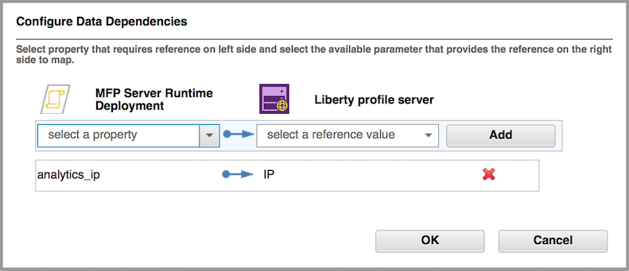
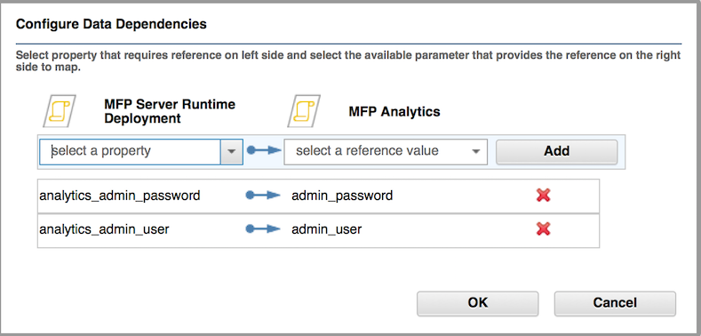

<!-- NLS_CHARSET=UTF-8 -->
## Visão Geral
{: #overview }
{{ site.data.keys.product_full }} O oferece a capacidade para implementar e gerenciar aplicativos {{ site.data.keys.mf_server }} e {{ site.data.keys.product_adj }} no IBM PureApplication System e no IBM PureApplication Service on SoftLayer.

{{ site.data.keys.product }} O em conjunto com o IBM PureApplication System e o IBM PureApplication Service on SoftLayer fornece um ambiente simples e intuitivo para desenvolvedores e administradores, para desenvolver aplicativos móveis, testá-los e implementá-los na nuvem. Essa versão do {{ site.data.keys.mf_system_pattern_full }} fornece {{ site.data.keys.product }} suporte de tempo de execução e de artefatos para tecnologias do PureApplication Virtual System Pattern que estão incluídas nas versões mais recentes do IBM PureApplication System e do IBM PureApplication Service on SoftLayer. O Padrão de Sistema Virtual Clássico era suportado em versões anteriores do IBM PureApplication System.

#### Ir para
{: #jump-to }
* [Instalando o {{ site.data.keys.mf_system_pattern }}](#installing-mobilefirst-system-pattern)
* [Requisitos de licenciamento de token para o {{ site.data.keys.mf_system_pattern }}](#token-licensing-requirements-for-mobilefirst-system-pattern)
* [Implementando o {{ site.data.keys.mf_server }} em um servidor de perfil Liberty do WebSphere Application Server de único nó](#deploying-mobilefirst-server-on-a-single-node-websphere-application-server-liberty-profile-server)
* [Implementando o {{ site.data.keys.mf_server }} em um servidor de perfil Liberty do WebSphere Application Server de vários nós](#deploying-mobilefirst-server-on-a-multiple-node-websphere-application-server-liberty-profile-server)
* [Implementando o {{ site.data.keys.mf_server }} em um servidor de perfil completo do WebSphere Application Server de único nó](#deploying-mobilefirst-server-on-a-single-node-websphere-application-server-full-profile-server)
* [Implementando o {{ site.data.keys.mf_server }} em um servidor de perfil completo do WebSphere Application Server de vários nós](#deploying-mobilefirst-server-on-a-multiple-node-websphere-application-server-full-profile-server)
* [Implementando o {{ site.data.keys.mf_server }} em clusters de servidores do WebSphere Application Server Network Deployment](#deploying-mobilefirst-server-on-clusters-of-websphere-application-server-network-deployment-servers)
* [Implementando o {{ site.data.keys.mf_app_center }} em um servidor de perfil Liberty do WebSphere Application Server de único nó](#deploying-mobilefirst-application-center-on-a-single-node-websphere-application-server-liberty-profile-server)
* [Implementando o {{ site.data.keys.mf_app_center }} em um servidor de perfil completo do WebSphere Application Server de único nó](#deploying-mobilefirst-application-center-on-a-single-node-websphere-application-server-full-profile-server)
* [Configurando a segurança de administração do {{ site.data.keys.product_adj }} com um repositório LDAP externo](#configuring-mobilefirst-administration-security-with-an-external-ldap-repository)
* [Configurando um banco de dados externo com um {{ site.data.keys.mf_system_pattern }}](#configuring-an-external-database-with-a-mobilefirst-system-pattern)
* [Implementando e configurando o {{ site.data.keys.mf_analytics }}](#deploying-and-configuring-mobilefirst-analytics)
* [Modelos predefinidos para {{ site.data.keys.mf_system_pattern }}](#predefined-templates-for-mobilefirst-system-pattern)
* [Pacotes de scripts para {{ site.data.keys.mf_server }}](#script-packages-for-mobilefirst-server)
* [Fazendo o upgrade do{{ site.data.keys.mf_system_pattern }}](#upgrading-mobilefirst-system-pattern)

### Benefícios-chave
{: #key-benefits }
{{ site.data.keys.mf_system_pattern }} O fornece os seguintes benefícios:

* Os modelos predefinidos permitem construir padrões de uma maneira simples para a maioria das topologias de implementação típicas do {{ site.data.keys.mf_server }}. Os exemplos das topologias são  
    * Único nó do perfil Liberty do IBM WebSphere Application Server
    * Vários nós do perfil Liberty do IBM WebSphere Application Server
    * Único nó de perfil completo do IBM WebSphere Application Server
    * Vários nós de perfil completo do IBM WebSphere Application Server
    * Clusters de servidores do WebSphere Application Server Network Deployment
    * Topologias de implementação do {{ site.data.keys.mf_app_center }}, como
        * Único nó do perfil Liberty do IBM WebSphere Application Server
        * Único nó de perfil completo do IBM WebSphere Application Server
* Os pacotes de scripts agem como blocos de construção para compor topologias de implementação estendida, como automação da inclusão de um servidor analítico em um padrão e opções de implementação flexíveis do DB VM. Os pacotes de scripts do WebSphere Application Server e do DB2 estão disponíveis por meio da inclusão de tipos padrão do WebSphere Application Server e do DB2.
* As propriedades opcionais de JNDI no pacote de scripts de implementação de tempo de execução permitem o ajuste de baixa granularidade para a topologia de implementação. Além disso, as topologias de implementação que são construídas com o perfil completo do IBM WebSphere Application Server agora suportam o acesso ao WebSphere Application Server Administration Console, que oferece controle total sobre a configuração do servidor de aplicativos.

### Restrições importantes
{: #important-restrictions }
Dependendo do modelo padrão usado, não mude alguns dos atributos de componente. Se você mudar qualquer um desses atributos de componente, a implementação de padrões que são baseados nesses modelos falhará.

#### {{ site.data.keys.product }} (Único nó de Liberty do Application Center)
{: #mobilefirst-foundation-application-center-liberty-single-node }
Não mude os valores para os seguintes atributos no servidor de perfil Liberty:

* Diretório de instalação do produto WebSphere
* Local dos dados de configuração
* Nome do servidor de perfil do Liberty
* Em Instalar um IBM Java SDK, selecione somente Java SDK V7.0 ou Java SDK V7.1
* Selecione Instalar recursos adicionais e limpe a seleção do IBM WebSphere eXtreme Scale.

#### {{ site.data.keys.product }} (Único nó do Application Center WebSphere Application Server)
{: #mobilefirst-foundation-application-center-websphere-application-server-single-node }
Não mude os valores para os seguintes atributos no servidor de perfil Liberty:

* Diretório de instalação do produto WebSphere
* Local dos dados de configuração
* Nome da célula
* Nome do Nó
* Nome do Perfil
* Em Instalar um IBM Java SDK, selecione somente Java SDK V7.0 ou Java SDK V7.1
* Selecione Instalar recursos adicionais e limpe a seleção do IBM WebSphere eXtreme Scale.

#### {{ site.data.keys.product }} (único nó do Liberty)
{: #mobilefirst-foundation-liberty-single-node }
Não mude os valores para os seguintes atributos no servidor de perfil Liberty:

* Diretório de instalação do produto WebSphere
* Local dos dados de configuração
* Nome do servidor de perfil do Liberty
* Em Instalar um IBM Java SDK, selecione somente Java SDK V7.0 ou Java SDK V7.1
* Selecione Instalar recursos adicionais e limpe a seleção do IBM WebSphere eXtreme Scale.

#### {{ site.data.keys.product }} (server farm do Liberty)
{: #mobilefirst-foundation-liberty-server-farm }
Não mude os valores para os seguintes atributos no servidor de perfil Liberty:

* Diretório de instalação do produto WebSphere
* Local dos dados de configuração
* Nome do servidor de perfil do Liberty
* Em Instalar um IBM Java SDK, selecione somente Java SDK V7.0 ou Java SDK V7.1
* Selecione Instalar recursos adicionais e limpe a seleção do IBM WebSphere eXtreme Scale.

#### {{ site.data.keys.product }} Modelo do (único nó do WebSphere Application Server)
{: #mobilefirst-foundation-websphere-application-server-single-node-template }
No **Componente do servidor independente** do nó do MobileFirst Platform Server, não desbloqueie nem mude os valores para nenhum dos seguintes atributos:

* Nome da célula
* Nome do Nó
* Nome do Perfil
* Se você mudar qualquer um desses atributos, sua implementação padrão falhará.

#### Modelo do {{ site.data.keys.product }} (server farm do WebSphere Application Server)
{: #mobilefirst-foundation-websphere-application-server-server-farm-template }
No **Componente do servidor independente** do nó do MobileFirst Platform Server, não desbloqueie nem mude os valores para nenhum dos seguintes atributos:

* Nome da célula
* Nome do Nó
* Nome do Perfil
* Se você mudar qualquer um desses atributos, sua implementação padrão falhará.

#### Modelo do {{ site.data.keys.product }} (WebSphere Application Server Network Deployment)
{: #mobilefirst-foundation-websphere-application-server-network-deployment-template }
No **Componente Deployment manager** do **nó DmgrNode** ou no **Componente de nós customizados** do **nó CustomNode**, não desbloqueie nem mude os valores para nenhum dos seguintes atributos:

* Nome da célula
* Nome do Nó
* Nome do Perfil

Se você mudar qualquer um desses atributos, sua implementação padrão falhará.

### Limitações
{: #limitations }
As seguintes limitações aplicam-se a:

* O ajuste de escala dinâmico para server farms de perfil Liberty do WebSphere Application Server e server farms de perfil completo do WebSphere Application Server não é suportado. O número de nós de server farm pode ser especificado no padrão, configurando a política de ajuste de escala, mas não pode ser mudado durante o tempo de execução.
* O {{ site.data.keys.v63_to_80prerebrand_product_full }} System Pattern Extension for {{ site.data.keys.mf_studio }} e a interface da linha de comandos de Ant que são suportados em versões anteriores à V7.0, não estão disponíveis para a versão atual do {{ site.data.keys.mf_system_pattern }}.
* O {{ site.data.keys.mf_system_pattern }} depende do WebSphere Application Server Patterns, que tem suas próprias restrições. Para obter informações adicionais, consulte [Restrições para o WebSphere Application Server Patterns](http://ibm.biz/knowctr#SSAJ7T_1.0.0/com.ibm.websphere.waspatt20base.doc/ae/rins_patternsB_restrictions.html).
* Devido a restrições na desinstalação de Padrões de Sistema Virtual, deve-se excluir os pacotes de scripts manualmente após excluir o tipo padrão. No IBM PureApplication System, acesse **Catálogo → Pacotes de scripts** para excluir os pacotes de scripts que estão listados na seção **Componentes**.
* O modelo padrão MobileFirst (WebSphere Application Server Network Deployment) não suporta o licenciamento de token. Se desejar usar esse padrão, deve-se usar o licenciamento permanente. Todos os outros padrões suportam o licenciamento de token.

### Composição
{: #composition }
O {{ site.data.keys.mf_system_pattern }} é composto dos seguintes padrões:

* IBM WebSphere Application Server Network Deployment Patterns 2.2.0.0.
* [PureApplication Service] Repositório do WebSphere 8558 for Mobile IM para permitir que o WebSphere Application Server Network Deployment Patterns funcione. Entre em contato com o administrador do IBM PureApplication System para confirmar se o repositório do WebSphere 8558 IM está instalado.
* IBM DB2 with BLU Acceleration  Pattern 1.2.4.0.
* {{ site.data.keys.mf_system_pattern }}.

### Componentes
{: #components }
Além de todos os componentes fornecidos pelo IBM WebSphere Application Server Pattern e o IBM DB2 with BLU Acceleration Pattern, o {{ site.data.keys.mf_system_pattern }} fornece os seguintes pacotes de scripts:

* MFP Administration DB
* MFP Runtime DB
* MFP Server Prerequisite
* MFP Server Administration
* MFP Server Runtime Deployment
* MFP Server Application Adapter Deployment
* MFP IHS Configuration
* MFP Analytics
* MFP Open Firewall Ports for WAS
* MFP WAS SDK Level
* MFP Server Application Center

### Compatibilidade entre tipos padrão e artefatos criados com versões diferentes do produto
{: #compatibility-between-pattern-types-and-artifacts-created-with-different-product-versions }
Se você usar o MobileFirst Studio V6.3.0 ou anterior para desenvolver seus aplicativos, será possível fazer upload de artefatos de tempo de execução, de aplicativo e do adaptador para padrões associados ao {{ site.data.keys.v63_to_80prerebrand_product_full }} V7.0.0 e mais recente.

Os tipos padrão que estão associados ao {{ site.data.keys.v63_to_80prerebrand_product_full }} V6.3.0 ou anterior não são compatíveis com artefatos de tempo de execução, de aplicativo e do adaptador criados usando o MobileFirst Studio V7.0.0 e mais recente.

Para versões V6.0.0 e anteriores, somente as mesmas versões do servidor, do arquivo **.war**, do aplicativo (arquivo **.wlapp**) e de adaptadores são compatíveis.

## Instalando o {{ site.data.keys.mf_system_pattern }}
{: #installing-mobilefirst-system-pattern }
É possível localizar o arquivo do **{{ site.data.keys.mf_system_pattern_file }}**. Certifique-se de extrair o arquivo antes de iniciar esse procedimento.

1. Efetue login no IBM PureApplication System com uma conta que tenha permissão para criar novos tipos padrão.
2. Acesse **Catálogo → Tipos padrão**.
3. Faça upload do arquivo **.tgz** do {{ site.data.keys.mf_system_pattern }}:
    * Na barra de ferramentas, clique em **+**. A janela "Instalar um tipo padrão" é aberta.
    * Na guia Local, clique em **Procurar**, selecione o arquivo **.tgz** do {{ site.data.keys.mf_system_pattern }} e espere a conclusão do processo de upload. O tipo padrão é exibido na lista e marcado como não ativado.
4. Na lista de tipos padrão, clique no tipo padrão transferido por upload. Os detalhes do tipo padrão são exibidos.
5. Na linha Contrato de licença, clique em **Licença**. A janela Licença é exibida informando os termos do contrato de licença.
6. Para aceitar a licença, clique em **Aceitar**. Os detalhes do tipo padrão agora mostram que a licença foi aceita.
7. Na linha Status, clique em **Ativar**. O tipo padrão está agora listado como sendo ativado.
8. Obrigatório para o PureApplication Service: após a ativação bem-sucedida do tipo padrão, acesse **Catálogo → Script** Pacotes e selecione pacotes de scripts com nomes semelhantes a "MFP \*\*\*". Na página de detalhes à direita, aceite a licença no campo **Contrato de licença**. Repita para todos os onze pacotes de scripts listados na seção Componentes.

## Requisitos de licenciamento de token para o {{ site.data.keys.mf_system_pattern }}
{: #token-licensing-requirements-for-mobilefirst-system-pattern }
Se você usar o licenciamento de token para licenciar o {{ site.data.keys.product }}, deverá instalar o IBM Rational License Key Server e configurar com suas licenças antes de implementar o {{ site.data.keys.mf_system_pattern_full }}.

> **Importante:** O modelo padrão do {{ site.data.keys.product }} (WAS ND) não suporta licenciamento de token. É preciso usar o licenciamento permanente ao implementar padrões com base no modelo padrão do {{ site.data.keys.product }} (WAS ND). Todos os outros modelos padrão suportam o licenciamento de token.

O IBM Rational License Key Server deve ser externo para o PureApplication System. O {{ site.data.keys.system_pattern }} não suporta o serviço compartilhado do PureApplication System para o IBM Rational License Key Server.

Além disso, é preciso saber as seguintes informações sobre o Rational License Key Server para incluir as informações do servidor da chave de licença nos atributos padrão:

* Nome completo do host ou endereço IP do Rational License Key Server
* Porta do daemon de gerenciador de licença (**lmgrd**)
* Porta do daemon de fornecedor (**ibmratl**)

Se você tiver um firewall entre o Rational License Key Server e o PureApplication System, certifique-se de que ambas as portas do daemon estejam abertas no firewall.
A implementação do {{ site.data.keys.system_pattern }} falhará se o servidor da chave de licença não puder ser contatado ou se houver tokens de licença insuficientes disponíveis.

Para obter detalhes sobre como instalar e configurar o Rational License Key Server, consulte [Suporte IBM - página inicial de licenciamento do Rational](http://www.ibm.com/software/rational/support/licensing/).

## Implementando o {{ site.data.keys.mf_server }} em um servidor de perfil Liberty do WebSphere Application Server de único nó
{: #deploying-mobilefirst-server-on-a-single-node-websphere-application-server-liberty-profile-server }
Use um modelo predefinido para implementar o {{ site.data.keys.mf_server }} em um servidor de perfil Liberty do WebSphere Application Server de único nó.

Esse procedimento envolve o upload de alguns artefatos para o IBM PureApplication System, como o aplicativo e o adaptador necessários. Antes de iniciar, certifique-se de que os artefatos estejam disponíveis para upload.

**Requisitos de licenciamento de token:** Se você usar o licenciamento de token para licenciar o {{ site.data.keys.product }}, revise os requisitos descritos em [Requisitos de licenciamento de token para o {{ site.data.keys.mf_system_pattern }}](#token-licensing-requirements-for-mobilefirst-system-pattern) antes de continuar. A implementação desse padrão falhará se o servidor da chave de licença não puder ser contatado ou se houver tokens de licença insuficientes disponíveis.

Alguns parâmetros de pacotes de scripts no modelo foram configurados com os valores recomendados e não são mencionados nessa seção. Para propósitos de otimização, consulte informações adicionais sobre todos os parâmetros de pacotes de scripts em [Pacotes de scripts para o {{ site.data.keys.mf_server }}](#script-packages-for-mobilefirst-server).

Para obter informações adicionais sobre as opções de composição e de configuração do modelo predefinido que é usado nesse procedimento, consulte [Modelo do {{ site.data.keys.product }} (nó único Liberty)](#mobilefirst-foundation-liberty-single-node-template).

1. Criar um padrão a partir do modelo predefinido:
    * No painel IBM PureApplication System, clique em **Padrões → Padrões de Sistema Virtual**. A página Padrões de Sistema Virtual é aberta.
    * Na página **Padrões de Sistema Virtual**, clique em **Criar novo** e, em seguida, na janela pop-up, selecione **MobileFirst Platform (único nó do Liberty)** da lista de modelos predefinidos. Se o nome for visível apenas parcialmente devido a seu comprimento, é possível confirmar se o modelo correto foi selecionando, visualizando sua descrição na guia **Mais informações**.
    * No campo **Nome**, forneça um nome para o padrão.
    * No campo **Versão**, especifique o número da versão do padrão.
    * Clique em **Iniciar construção**.
2. Obrigatório para AIX: no IBM PureApplication System em execução no Power, o nó MobileFirst Platform DB precisa usar o componente de complemento específico do AIX "Incluir disco padrão do AIX" para substituir o componente "Incluir disco padrão" no modelo para suportar o sistema de arquivos jfs2:
    * No Construtor de Padrões, selecione o nó **MobileFirst Platform DB**.
    * Clique no botão **Incluir um complemento do componente** (o botão é visível acima da caixa do componente quando você passa o cursor sobre o nó **MobileFirst Platform DB**).
    * Na lista **Incluir complementos**, selecione **Incluir disco padrão do AIX**. O componente é incluído como o menor componente do nó MobileFirst Platform DB.
    * Selecione o componente **Incluir disco padrão do AIX** e especifique os seguintes atributos:
        * **DISK_SIZE_GB:** O tamanho de armazenamento (medido em GB) a ser estendido para o servidor DB. Valor de exemplo: **10**.
        * **FILESYSTEM_TYPE:** Sistema de arquivos suportado no AIX. Valor padrão: **jfs2**.
        * **MOUNT_POINT:** Alinhar com o atributo **Ponto de montagem para o proprietário da instância** no componente Database Server no nó MobileFirst Platform DB. Valor de exemplo: **/dbinst**.
        * **VOLUME_GROUP:** Valor de exemplo: **group1**. Entre em contato com o administrador do IBM PureApplication System para o valor correto.
    * No nó MobileFirst Platform DB, selecione o componente **Incluir disco padrão** e, em seguida, clique no ícone de lixeira para excluí-lo.
    * Salve o padrão.
3. Opcional: configure a administração do {{ site.data.keys.mf_server }}. É possível ignorar essa etapa se desejar especificar a credencial do usuário com privilégio administrativo do {{ site.data.keys.mf_server }} posteriormente durante a fase de configuração de implementação padrão na etapa 9. Para especificá-la agora, conclua essas etapas:

    > **Nota:** Se desejar configurar a segurança de administração com um servidor LDAP, é preciso fornecer informações adicionais do LDAP. Para obter informações adicionais, consulte [Configurando a segurança de administração do {{ site.data.keys.product_adj }} com um repositório LDAP externo](#configuring-mobilefirst-administration-security-with-an-external-ldap-repository).
    * No nó MobileFirst Platform Server, clique no componente **MFP Server Administration**. As propriedades do componente selecionado são exibidas próximo à tela.
    * Próximo aos campos **admin_user** e **admin_password**, clique no botão Excluir para limpar suas configurações de parâmetro de nível padrão.
    * Nos campos **admin_user** e **admin\_password**, especifique o nome do usuário e a senha de administração.
    * Se você usar o licenciamento de token para licenciar o {{ site.data.keys.product }}, preencha os seguintes campos. Se você não usar o licenciamento de token, deixe esses campos em branco.

    **ACTIVATE\_TOKEN\_LICENSE**: selecione esse campo para licenciar seu padrão com o licenciamento de token.  
    **LICENSE\_SERVER\_HOSTNAME**: insira o nome completo do host ou o endereço IP do Rational License Key Server.  
    **LMGRD\_PORT**: insira o número da porta na qual o daemon de gerenciador de licença (**lmrgd**) recebe conexões. A porta do daemon de gerenciador de licença padrão é 27000.  
    **IBMRATL\_PORT**: insira o número da porta na qual o daemon de fornecedor (**ibmratl**) recebe conexões. A porta daemon de fornecedor padrão geralmente é 27001.  

    Uma conta de administração padrão para o {{ site.data.keys.mf_server }} é criada durante a implementação padrão.

4. Opcional: configure a implementação de tempo de execução do {{ site.data.keys.mf_server }}. É possível ignorar essa etapa se desejar especificar o nome da raiz de contexto para o tempo de execução posteriormente durante a fase de configuração de implementação padrão na etapa 9. Para especificar o nome da raiz de contexto agora, conclua essas etapas:
    * No nó MobileFirst Platform Server, clique no componente **MFP Server Runtime Deployment**. As propriedades do componente selecionado são exibidas próximo à tela.
    * Próximo ao campo **runtime\_contextRoot**, clique no botão **Excluir** para limpar a configuração de parâmetro de nível padrão.
    * No campo **runtime\_contextRoot**, especifique o nome da raiz de contexto de tempo de execução. Observe que o nome da raiz de contexto deve começar com uma barra, /; por exemplo, `/HelloWorld`.

5. Fazer upload de artefatos de aplicativo e do adaptador:

    > **Importante:** Ao especificar o caminho de destino para aplicativos e adaptadores, certifique-se de que todos os aplicativos e adaptadores estejam colocados no mesmo diretório. Por exemplo, se um caminho de destino for **/opt/tmp/deploy/HelloWorld-common.json**, todos os outros caminhos de destino devem ser `/opt/tmp/deploy/*`.
    * No nó MobileFirst Platform Server, clique no componente **MFP Server Application** ou **MFP Server Adapter**. As propriedades do componente selecionado são exibidas próximo à tela.
    * No campo **Arquivo adicional**, clique no botão **Procurar** para localizar e fazer upload do artefato de aplicativo ou do adaptador.
    * No campo **Caminho de destino**, especifique o caminho completo para armazenar o artefato, incluindo o nome do arquivo; por exemplo, **/opt/tmp/deploy/HelloWorld-common.json**.
    * Se nenhum aplicativo ou adaptador precisar ser implementado no padrão, remova o componente relevante, clicando no botão **X** dentro dele. Para que um {{ site.data.keys.mf_console }} vazio seja implementado sem nenhum aplicativo ou adaptador instalado, remova o componente MFP Server Application Adapter Deployment clicando no botão X dentro dele.

6. Opcional: inclua mais artefatos de aplicativo ou do adaptador para implementação:
    * Na barra de ferramentas **Ativos**, expanda **Componentes de software** e, em seguida, arraste e solte um componente de **Arquivo adicional** para o nó MobileFirst Platform Server na tela. Renomeie-o para **{{ site.data.keys.product_adj }} App\_X** ou **{{ site.data.keys.product_adj }} Adatper\_X** (em que **X** representa um número exclusivo para diferenciação).
    * Passe o cursor sobre o componente Aplicativo ou Adaptador recém-incluído e, em seguida, clique nos botões **Mover para cima** e **Mover para baixo** para ajustar sua sequência no nó. Certifique-se de que ele seja colocado após o componente MFP Runtime Deployment, mas antes do componente MFP Server Application Adapter Deployment.
    * Clique no componente aplicativo ou adaptador recém-incluído. As propriedades do componente selecionado são exibidas próximo à tela. Faça upload do artefato de aplicativo ou do adaptador e especifique seu caminho de destino consultando as etapas na etapa 6.
    * Repita a etapa 7 para incluir mais aplicativos e adaptadores para implementação.

7. Opcional: configurar a implementação do aplicativo e do adaptador no {{ site.data.keys.mf_server }}. É possível ignorar essa etapa se você desejar especificar a credencial do usuário com privilégio de implementação posteriormente durante a fase de configuração de implementação padrão na etapa 9. Se você especificou a credencial do usuário administrativo na etapa 3, agora é possível especificar o usuário implementador, que deve se alinhar com a credencial do usuário administrativo:
    * No nó MobileFirst Platform Server, selecione o componente **MFP Server Application Adapter Deployment**. As propriedades do componente selecionado são exibidas próximo à tela.
    * Localize os parâmetros chamados **deployer_user** e **deployer_password** e, em seguida, clique nos botões Excluir adjacentes para limpar as configurações de parâmetro de nível padrão.
    * Nos campos **deployer\_user** e **deployer\_password**, especifique o nome do usuário e a senha.

8. Configurar e ativar a implementação padrão:
    * No painel IBM PureApplication System, clique em **Padrões → Padrões de Sistema Virtual**.
    * Na página **Padrões de Sistema Virtual**, use o campo **Procurar** para localizar o padrão criado e, em seguida, selecione o padrão.
    * Na barra de ferramentas acima do painel que exibe informações detalhadas sobre o padrão, clique no botão Implementar.
    * Na janela Implementar padrão, no painel Configurar, selecione o perfil de ambiente correto da lista **Perfil de ambiente** e forneça outros parâmetros de ambiente do IBM PureApplication System. Para obter as informações corretas, consulte o administrador do IBM PureApplication System.
    * Na coluna do meio, clique em **Atributos de padrão** para exibir atributos, como nomes de usuários e senhas.

        Forneça as seguintes informações nos campos fornecidos:

        > **Nota:** Faça mudanças apropriadas nos valores padrão dos parâmetros de nível padrão, mesmo que um servidor LDAP externo esteja configurado. Se você configurar a segurança de administração usando um servidor LDAP, é preciso fornecer informações adicionais de LDAP. Para obter informações adicionais, consulte [Configurando a segurança de administração do {{ site.data.keys.product_adj }} com um repositório LDAP externo](#configuring-mobilefirst-administration-security-with-an-external-ldap-repository).
        
        **admin\_user**  
        Não visível se configurado na etapa 3. Crie uma conta do administrador padrão do {{ site.data.keys.mf_server }}. Valor padrão: demo.
        
        **admin\_password**  
        Não visível se configurado na etapa 3. Senha de conta de administrador padrão. Valor padrão: demo.
        
        **ACTIVATE\_TOKEN\_LICENSE**  
        Não visível se configurado na etapa 3. Selecione esse campo para licenciar seu padrão com o licenciamento de token. Deixe esse campo vazio se você usar licenças permanentes.
        
        **LICENSE\_SERVER\_HOSTNAME**  
        Não visível se configurado na etapa 3. Se você usar o licenciamento de token para licenciar o {{ site.data.keys.product }}, insira o nome completo do host ou endereço IP do Rational License Key Server. Caso contrário, deixe este campo em branco.
        
        **LMGRD\_PORT**   
        Não visível se configurado na etapa 3. Se você usar o licenciamento de token para licenciar o {{ site.data.keys.product }}, insira o número da porta na qual o daemon de gerenciador de licença (lmrgd) recebe conexões. Caso contrário, deixe esse campo em branco.
        A porta do daemon de gerenciador de licença padrão é 27000.

        **IBMRATL\_PORT**  
        Não visível se configurado na etapa 3. Se você usar o licenciamento de token para licenciar o {{ site.data.keys.product }}, insira o número da porta na qual o daemon de fornecedor (ibmratl) recebe conexões. Caso contrário, deixe esse campo em branco.
        A porta daemon de fornecedor padrão geralmente é 27001.

        **runtime\_contextRoot**  
        Não visível se configurado na etapa 5. Nome da raiz de contexto para o tempo de execução do {{ site.data.keys.mf_server }}. O nome deve começar com "/".
        
        **deployer\_user**  
        Não visível se configurado na etapa 8. Nome do usuário para a conta com privilégio de implementação. Se um servidor LDAP externo não estiver configurado, deve-se inserir o mesmo valor que o especificado ao criar o usuário administrativo padrão para o serviço de administração, porque nesse caso, o único usuário autorizado para implementação de aplicativo e de adaptador é o usuário administrativo padrão.
        
        **deployer\_password**  
        Não visível se configurado na etapa 8. Senha de usuário para o usuário com privilégio de implementação.
        
        **MFP Vms Password(root)**  
        Senha raiz para nós {{ site.data.keys.mf_server }} e {{ site.data.keys.product }} DB. Valor padrão: passw0rd.
        
        **MFP DB Password(Instance owner)**  
        Senha do proprietário da instância para o nó MobileFirst Platform DB. Valor padrão: **passw0rd**.    
    * Clique em **Implementação rápida** para ativar sua implementação padrão. Após alguns segundos, é exibida uma mensagem para indicar que o padrão começou a ser ativado. É possível clicar na URL fornecida na mensagem para rastrear o status de implementação padrão ou acessar **Padrões → Instâncias de sistema virtual** para abrir a página Instâncias de sistema virtual e procurar seu padrão lá.

    Se você usar o licenciamento de token para licenciar o {{ site.data.keys.product }}, seu padrão irá falhar ao implementar se houver tokens de licença insuficientes disponíveis ou se o endereço IP e a porta do servidor de chave de licença foram inseridos incorretamente.

9. Acesse a {{ site.data.keys.mf_console }}:
    * Clique em **Padrões → Instâncias de sistema virtual** para abrir a página Instâncias de sistema virtual e procure seu padrão lá. Certifique-se de que ele esteja no estado Em execução.
    * Selecione o nome padrão e expanda a opção **Perspectiva de máquina virtual** no painel que exibe detalhes da instância selecionada.
    * Localize a VM do {{ site.data.keys.mf_server }} que tem um nome semelhante a **MobileFirst\_Platform\_Server.** e anote seu endereço IP Público: essa informação será necessária na etapa a seguir.
    * No navegador, abra o {{ site.data.keys.mf_console }} formando sua URL com um dos seguintes formatos:
        * `http://{MFP Server VM Public IP}:9080/mfpconsole`
        * `https://{MFP Server VM Public IP}:9443/mfpconsole`
    * Efetue login no Console com o usuário administrativo e a senha especificados na etapa 3 ou 9.

## Implementando o {{ site.data.keys.mf_server }} em um servidor de perfil Liberty do WebSphere Application Server de vários nós
{: #deploying-mobilefirst-server-on-a-multiple-node-websphere-application-server-liberty-profile-server }
Use um modelo predefinido para implementar o {{ site.data.keys.mf_server }} em um servidor de perfil Liberty do WebSphere Application Server de vários nós.

Esse procedimento envolve o upload de alguns artefatos para o IBM PureApplication System, como o aplicativo e o adaptador necessários. Antes de iniciar, certifique-se de que os artefatos estejam disponíveis para upload.

**Requisitos de licenciamento de token:** Se você usar o licenciamento de token para licenciar o {{ site.data.keys.product }}, revise os requisitos descritos em [Requisitos de licenciamento de token para o {{ site.data.keys.mf_system_pattern }}](#token-licensing-requirements-for-mobilefirst-system-pattern) antes de continuar. A implementação desse padrão falhará se o servidor da chave de licença não puder ser contatado ou se houver tokens de licença insuficientes disponíveis.

Alguns parâmetros de pacotes de scripts no modelo foram configurados com os valores recomendados e não são mencionados nessa seção. Para propósitos de otimização, consulte informações adicionais sobre todos os parâmetros de pacotes de scripts em [Pacotes de scripts para o {{ site.data.keys.mf_server }}](#script-packages-for-mobilefirst-server).

Para obter informações adicionais sobre as opções de composição e de configuração do modelo predefinido que é usado nesse procedimento, consulte [Modelo do {{ site.data.keys.product }} (server farm Liberty)](#mobilefirst-foundation-liberty-server-farm-template).

1. Criar um padrão a partir do modelo predefinido:
    * No painel IBM PureApplication System, clique em **Padrões → Padrões de Sistema Virtual**. A página **Padrões de Sistema Virtual** é aberta.
    * Na página **Padrões de Sistema Virtual**, clique em **Criar novo** e, em seguida, na janela pop-up, selecione **MobileFirst Platform (server farm Liberty)** da lista de modelos predefinidos. Se o nome for visível apenas parcialmente devido a seu comprimento, é possível confirmar se o modelo correto foi selecionando, visualizando sua descrição na guia **Mais informações**.
    * No campo **Nome**, forneça um nome para o padrão.
    * No campo **Versão**, especifique o número da versão do padrão.
    * Clique em **Iniciar construção**.
2. Obrigatório para AIX : no IBM PureApplication System em execução no Power, o nó MobileFirst Platform DB precisa usar o componente de complemento específico do AIX "Incluir disco padrão do AIX" para substituir o componente "Incluir disco padrão" no modelo para suportar o sistema de arquivos **jfs2**:
    * No Construtor de Padrões, selecione o nó **MobileFirst Platform DB**.
    * Clique no botão **Incluir um complemento do componente** (o botão é visível acima da caixa do componente quando você passa o cursor sobre o nó **MobileFirst Platform DB**).
    * Na lista **Incluir complementos**, selecione **Incluir disco padrão do AIX**. O componente é incluído como o menor componente do nó MobileFirst Platform DB.
    * Selecione o componente **Incluir disco padrão do AIX** e especifique os seguintes atributos:
        * **DISK_SIZE_GB:** O tamanho de armazenamento (medido em GB) a ser estendido para o servidor DB. Valor de exemplo: **10**.
        * **FILESYSTEM_TYPE:** Sistema de arquivos suportado no AIX. Valor padrão: **jfs2**.
        * **MOUNT_POINT:** Alinhar com o atributo **Ponto de montagem para o proprietário da instância** no componente Database Server no nó MobileFirst Platform DB. Valor de exemplo: **/dbinst**.
        * **VOLUME_GROUP:** Valor de exemplo: **group1**. Entre em contato com o administrador do IBM PureApplication System para o valor correto.
    * No nó MobileFirst Platform DB, selecione o componente **Incluir disco padrão** e, em seguida, clique no ícone de lixeira para excluí-lo.
    * Salve o padrão.
3. Opcional: configure a administração do {{ site.data.keys.mf_server }}. É possível ignorar essa etapa se desejar especificar a credencial do usuário com privilégio administrativo do {{ site.data.keys.mf_server }} posteriormente durante a fase de configuração de implementação padrão na etapa 9. Para especificá-la agora, conclua essas etapas:

    > **Nota:** Se desejar configurar a segurança de administração com um servidor LDAP, é preciso fornecer informações adicionais do LDAP. Para obter informações adicionais, consulte [Configurando a segurança de administração do {{ site.data.keys.product_adj }} com um repositório LDAP externo](#configuring-mobilefirst-administration-security-with-an-external-ldap-repository).
    * No nó MobileFirst Platform Server, clique no componente **MFP Server Administration**. As propriedades do componente selecionado são exibidas próximo à tela.
    * Próximo aos campos **admin_user** e **admin_password**, clique no botão Excluir para limpar suas configurações de parâmetro de nível padrão.
    * Nos campos **admin_user** e **admin\_password**, especifique o nome do usuário e a senha de administração.
    * Se você usar o licenciamento de token para licenciar o {{ site.data.keys.product }}, preencha os seguintes campos. Se você não usar o licenciamento de token, deixe esses campos em branco.

    **ACTIVATE\_TOKEN\_LICENSE**: selecione esse campo para licenciar seu padrão com o licenciamento de token.  
    **LICENSE\_SERVER\_HOSTNAME**: insira o nome completo do host ou o endereço IP do Rational License Key Server.  
    **LMGRD\_PORT**: insira o número da porta na qual o daemon de gerenciador de licença (**lmrgd**) recebe conexões. A porta do daemon de gerenciador de licença padrão é 27000.  
    **IBMRATL\_PORT**: insira o número da porta na qual o daemon de fornecedor (**ibmratl**) recebe conexões. A porta daemon de fornecedor padrão geralmente é 27001.  

    Uma conta de administração padrão para o {{ site.data.keys.mf_server }} é criada durante a implementação padrão.
    
4. Opcional: configure a implementação de tempo de execução do {{ site.data.keys.mf_server }}. É possível ignorar essa etapa se desejar especificar o nome da raiz de contexto para o tempo de execução posteriormente durante a fase de configuração de implementação padrão na etapa 10. Para especificar o nome da raiz de contexto agora, conclua estas etapas:
    * No nó MobileFirst Platform Server, clique no componente **MFP Server Runtime Deployment**. As propriedades do componente selecionado são exibidas próximo à tela.
    * Próximo ao campo **runtime\_contextRoot**, clique no botão **Excluir** para limpar a configuração de parâmetro de nível padrão.
    * No campo **runtime\_contextRoot**, especifique o nome da raiz de contexto de tempo de execução. Observe que o nome da raiz de contexto deve começar com uma barra, /; por exemplo, `/HelloWorld`.

5. Fazer upload de artefatos de aplicativo e do adaptador:

    > **Importante:** Ao especificar o caminho de destino para aplicativos e adaptadores, certifique-se de que todos os aplicativos e adaptadores estejam colocados no mesmo diretório. Por exemplo, se um caminho de destino for **/opt/tmp/deploy/HelloWorld-common.json**, todos os outros caminhos de destino devem ser `/opt/tmp/deploy/*`.
    * No nó MobileFirst Platform Server, clique no componente **MFP Server Application** ou **MFP Server Adapter**. As propriedades do componente selecionado são exibidas próximo à tela.
    * No campo **Arquivo adicional**, clique no botão **Procurar** para localizar e fazer upload do artefato de aplicativo ou do adaptador.
    * No campo **Caminho de destino**, especifique o caminho completo para armazenar o artefato, incluindo o nome do arquivo; por exemplo, **/opt/tmp/deploy/HelloWorld-common.json**.
    * Se nenhum aplicativo ou adaptador precisar ser implementado no padrão, remova o componente relevante, clicando no botão **X** dentro dele. Para que um {{ site.data.keys.mf_console }} vazio seja implementado sem nenhum aplicativo ou adaptador instalado, remova o componente MFP Server Application Adapter Deployment clicando no botão X dentro dele. 

6. Opcional: inclua mais artefatos de aplicativo ou do adaptador para implementação:
    * Na barra de ferramentas **Ativos**, expanda **Componentes de software** e, em seguida, arraste e solte um componente de **Arquivo adicional** para o nó MobileFirst Platform Server na tela. Renomeie-o para **{{ site.data.keys.product_adj }} App\_X** ou **{{ site.data.keys.product_adj }} Adatper\_X** (em **X** representa um número exclusivo para diferenciação).
    * Passe o cursor sobre o componente Aplicativo ou Adaptador recém-incluído e, em seguida, clique nos botões **Mover para cima** e **Mover para baixo** para ajustar sua sequência no nó. Certifique-se de que ele seja colocado após o componente MFP Runtime Deployment, mas antes do componente MFP Server Application Adapter Deployment.
    * Clique no componente aplicativo ou adaptador recém-incluído. As propriedades do componente selecionado são exibidas próximo à tela. Faça upload do artefato de aplicativo ou do adaptador e especifique seu caminho de destino consultando as etapas na etapa 6.
    * Repita a etapa 7 para incluir mais aplicativos e adaptadores para implementação.

7. Opcional: configurar a implementação do aplicativo e do adaptador no {{ site.data.keys.mf_server }}. É possível ignorar essa etapa se você desejar especificar a credencial do usuário com privilégio de implementação posteriormente durante a fase de configuração de implementação padrão na etapa 9. Se você especificou a credencial do usuário administrativo na etapa 3, agora é possível especificar o usuário implementador, que deve se alinhar com a credencial do usuário administrativo:
    * No nó MobileFirst Platform Server, selecione o componente **MFP Server Application Adapter Deployment**. As propriedades do componente selecionado são exibidas próximo à tela.
    * Localize os parâmetros chamados **deployer_user** e **deployer_password** e, em seguida, clique nos botões Excluir adjacentes para limpar as configurações de parâmetro de nível padrão.
    * Nos campos **deployer\_user** e **deployer\_password**, especifique o nome do usuário e a senha.

8. Configurar a política de ajuste de escala base:
    * No nó MobileFirst Platform Server, selecione o componente **Política de Ajuste de Escala Base**. As propriedades do componente selecionado são exibidas próximo à tela.
    * No campo **Número de instâncias**, especifique o número de nós do servidor a serem instanciados durante a implementação padrão. O valor padrão é 2 no modelo predefinido. Como o ajuste de escala dinâmico não é suportado nessa liberação, não especifique valores nos campos de atributo restantes.

9. Configurar e ativar a implementação padrão:
    * No painel IBM PureApplication System, clique em **Padrões → Padrões de Sistema Virtual**.
    * Na página **Padrões de Sistema Virtual**, use o campo **Procurar** para localizar o padrão criado e, em seguida, selecione o padrão.
    * Na barra de ferramentas acima do painel que exibe informações detalhadas sobre o padrão, clique no botão Implementar.
    * Na janela Implementar padrão, no painel Configurar, selecione o perfil de ambiente correto da lista **Perfil de ambiente** e forneça outros parâmetros de ambiente do IBM PureApplication System. Para obter as informações corretas, consulte o administrador do IBM PureApplication System.
    * Na coluna do meio, clique em **Atributos de padrão** para exibir atributos, como nomes de usuários e senhas.

        Forneça as seguintes informações nos campos fornecidos:

        > **Nota:** Faça mudanças apropriadas nos valores padrão dos parâmetros de nível padrão, mesmo que um servidor LDAP externo esteja configurado. Se você configurar a segurança de administração usando um servidor LDAP, é preciso fornecer informações adicionais de LDAP. Para obter informações adicionais, consulte [Configurando a segurança de administração do {{ site.data.keys.product_adj }} com um repositório LDAP externo](#configuring-mobilefirst-administration-security-with-an-external-ldap-repository).
        
        **admin\_user**  
        Não visível se configurado na etapa 3. Crie uma conta do administrador padrão do {{ site.data.keys.mf_server }}. Valor padrão: demo.
        
        **admin\_password**  
        Não visível se configurado na etapa 3. Senha de conta de administrador padrão. Valor padrão: demo.
        
        **ACTIVATE\_TOKEN\_LICENSE**  
        Não visível se configurado na etapa 3. Selecione esse campo para licenciar seu padrão com o licenciamento de token. Deixe esse campo vazio se você usar licenças permanentes.
        
        **LICENSE\_SERVER\_HOSTNAME**  
        Não visível se configurado na etapa 3. Se você usar o licenciamento de token para licenciar o {{ site.data.keys.product }}, insira o nome completo do host ou endereço IP do Rational License Key Server. Caso contrário, deixe este campo em branco.
        
        **LMGRD\_PORT**   
        Não visível se configurado na etapa 3. Se você usar o licenciamento de token para licenciar o {{ site.data.keys.product }}, insira o número da porta na qual o daemon de gerenciador de licença (lmrgd) recebe conexões. Caso contrário, deixe esse campo em branco.
        A porta do daemon de gerenciador de licença padrão é 27000.

        **IBMRATL\_PORT**  
        Não visível se configurado na etapa 3. Se você usar o licenciamento de token para licenciar o {{ site.data.keys.product }}, insira o número da porta na qual o daemon de fornecedor (ibmratl) recebe conexões. Caso contrário, deixe esse campo em branco.
        A porta daemon de fornecedor padrão geralmente é 27001.

        **runtime\_contextRoot**  
        Não visível se configurado na etapa 5. Nome da raiz de contexto para o tempo de execução do {{ site.data.keys.mf_server }}. O nome deve começar com "/".
        
        **deployer\_user**  
        Não visível se configurado na etapa 8. Nome do usuário para a conta com privilégio de implementação. Se um servidor LDAP externo não estiver configurado, deve-se inserir o mesmo valor que o especificado ao criar o usuário administrativo padrão para o serviço de administração, porque nesse caso, o único usuário autorizado para implementação de aplicativo e de adaptador é o usuário administrativo padrão.
        
        **deployer\_password**  
        Não visível se configurado na etapa 8. Senha de usuário para o usuário com privilégio de implementação.
        
        **MFP Vms Password(root)**  
        Senha raiz para os nós {{ site.data.keys.mf_server }} e {{ site.data.keys.product }} DB. Valor padrão: passw0rd.
        
        **MFP DB Password(Instance owner)**  
        Senha do proprietário da instância para o nó MobileFirst Platform DB. Valor padrão: **passw0rd**.    
    * Clique em **Implementação rápida** para ativar sua implementação padrão. Após alguns segundos, é exibida uma mensagem para indicar que o padrão começou a ser ativado. É possível clicar na URL fornecida na mensagem para rastrear o status de implementação padrão ou acessar **Padrões → Instâncias de sistema virtual** para abrir a página Instâncias de sistema virtual e procurar seu padrão lá.

    Se você usar o licenciamento de token para licenciar o {{ site.data.keys.product }}, seu padrão irá falhar ao implementar se houver tokens de licença insuficientes disponíveis ou se o endereço IP e a porta do servidor de chave de licença foram inseridos incorretamente.
    
10. Acesse a {{ site.data.keys.mf_console }}:
    * Clique em **Padrões → Instâncias de sistema virtual** para abrir a página Instâncias de sistema virtual e procure seu padrão lá. Certifique-se de que ele esteja no estado Em execução.
    * Selecione o nome padrão e expanda a opção **Perspectiva de máquina virtual** no painel que exibe detalhes da instância selecionada.
    * Localize a VM do Servidor IHS que tem um nome semelhante a **IHS\_Server.*** e anote seu endereço IP Público: essa informação será necessária na etapa a seguir.
    * No navegador, abra o {{ site.data.keys.mf_console }} formando sua URL com um dos seguintes formatos:
        * `http://{IHS Server VM Public IP}/mfpconsole`
        * `https://{IHS Server VM Public IP}/mfpconsole`
    * Efetue login no Console com o ID do usuário administrativo e senha especificados na etapa 3 ou 10.

## Implementando o {{ site.data.keys.mf_server }} em um servidor de perfil completo do WebSphere Application Server de único nó
{: #deploying-mobilefirst-server-on-a-single-node-websphere-application-server-full-profile-server }
Use um modelo predefinido para implementar um {{ site.data.keys.mf_server }} de único nó em um servidor de perfil completo do WebSphere Application Server.

Esse procedimento envolve o upload de alguns artefatos para o IBM PureApplication System, como o aplicativo e o adaptador necessários. Antes de iniciar, certifique-se de que os artefatos estejam disponíveis para upload.

**Requisitos de licenciamento de token:** Se você usar o licenciamento de token para licenciar o {{ site.data.keys.product }}, revise os requisitos descritos em [Requisitos de licenciamento de token para o {{ site.data.keys.mf_system_pattern }}](#token-licensing-requirements-for-mobilefirst-system-pattern) antes de continuar. A implementação desse padrão falhará se o servidor da chave de licença não puder ser contatado ou se houver tokens de licença insuficientes disponíveis.

Alguns parâmetros de pacotes de scripts no modelo foram configurados com os valores recomendados e não são mencionados nessa seção. Para propósitos de otimização, consulte informações adicionais sobre todos os parâmetros de pacotes de scripts em [Pacotes de scripts para o {{ site.data.keys.mf_server }}](#script-packages-for-mobilefirst-server).

Para obter informações adicionais sobre as opções de composição e de configuração do modelo predefinido que é usado nesse procedimento, consulte [Modelo do {{ site.data.keys.product }} (único nó do WAS)](#mobilefirst-foundation-was-single-node-template).

1. Criar um padrão a partir do modelo predefinido:
    * No painel IBM PureApplication System, clique em **Padrões → Padrões de Sistema Virtual**. A página **Padrões de Sistema Virtual** é aberta.
    * Na página **Padrões de Sistema Virtual**, clique em **Criar novo** e, em seguida, na janela pop-up, selecione **MobileFirst Platform (único nó do WAS)** da lista de modelos predefinidos. Se o nome for visível apenas parcialmente devido a seu comprimento, é possível confirmar se o modelo correto foi selecionando, visualizando sua descrição na guia **Mais informações**.
    * No campo **Nome**, forneça um nome para o padrão.
    * No campo **Versão**, especifique o número da versão do padrão.
    * Clique em **Iniciar construção**.
2. Obrigatório para AIX : no IBM PureApplication System em execução no Power, o nó MobileFirst Platform DB precisa usar o componente de complemento específico do AIX "Incluir disco padrão do AIX" para substituir o componente "Incluir disco padrão" no modelo para suportar o sistema de arquivos **jfs2**:
    * No Construtor de Padrões, selecione o nó **MobileFirst Platform DB**.
    * Clique no botão **Incluir um complemento do componente** (o botão é visível acima da caixa do componente quando você passa o cursor sobre o nó **MobileFirst Platform DB**).
    * Na lista **Incluir complementos**, selecione **Incluir disco padrão do AIX**. O componente é incluído como o menor componente do nó MobileFirst Platform DB.
    * Selecione o componente **Incluir disco padrão do AIX** e especifique os seguintes atributos:
        * **DISK_SIZE_GB:** O tamanho de armazenamento (medido em GB) a ser estendido para o servidor DB. Valor de exemplo: **10**.
        * **FILESYSTEM_TYPE:** Sistema de arquivos suportado no AIX. Valor padrão: **jfs2**.
        * **MOUNT_POINT:** Alinhar com o atributo **Ponto de montagem para o proprietário da instância** no componente Database Server no nó MobileFirst Platform DB. Valor de exemplo: **/dbinst**.
        * **VOLUME_GROUP:** Valor de exemplo: **group1**. Entre em contato com o administrador do IBM PureApplication System para o valor correto.
    * No nó MobileFirst Platform DB, selecione o componente **Incluir disco padrão** e, em seguida, clique no ícone de lixeira para excluí-lo.
    * Salve o padrão.
3. Opcional: configure a administração do {{ site.data.keys.mf_server }}. É possível ignorar essa etapa se desejar especificar a credencial do usuário com privilégio administrativo do {{ site.data.keys.mf_server }} posteriormente durante a fase de configuração de implementação padrão na etapa 9. Para especificá-la agora, conclua essas etapas:

    > **Nota:** Se desejar configurar a segurança de administração com um servidor LDAP, é preciso fornecer informações adicionais do LDAP. Para obter informações adicionais, consulte [Configurando a segurança de administração do {{ site.data.keys.product_adj }} com um repositório LDAP externo](#configuring-mobilefirst-administration-security-with-an-external-ldap-repository).
    * No nó MobileFirst Platform Server, clique no componente **MFP Server Administration**. As propriedades do componente selecionado são exibidas próximo à tela.
    * Próximo aos campos **admin_user** e **admin_password**, clique no botão Excluir para limpar suas configurações de parâmetro de nível padrão.
    * Nos campos **admin_user** e **admin\_password**, especifique o nome do usuário e a senha de administração.
    * Se você usar o licenciamento de token para licenciar o {{ site.data.keys.product }}, preencha os seguintes campos. Se você não usar o licenciamento de token, deixe esses campos em branco.

    **ACTIVATE\_TOKEN\_LICENSE**: selecione esse campo para licenciar seu padrão com o licenciamento de token.  
    **LICENSE\_SERVER\_HOSTNAME**: insira o nome completo do host ou o endereço IP do Rational License Key Server.  
    **LMGRD\_PORT**: insira o número da porta na qual o daemon de gerenciador de licença (**lmrgd**) recebe conexões. A porta do daemon de gerenciador de licença padrão é 27000.  
    **IBMRATL\_PORT**: insira o número da porta na qual o daemon de fornecedor (**ibmratl**) recebe conexões. A porta daemon de fornecedor padrão geralmente é 27001.  

    Uma conta de administração padrão para o {{ site.data.keys.mf_server }} é criada durante a implementação padrão.

4. Opcional: configure a implementação de tempo de execução do {{ site.data.keys.mf_server }}. É possível ignorar essa etapa se desejar especificar o nome da raiz de contexto para o tempo de execução posteriormente durante a fase de configuração de implementação padrão na etapa 9. Para especificar o nome da raiz de contexto agora, conclua essas etapas:
    * No nó MobileFirst Platform Server, clique no componente **MFP Server Runtime Deployment**. As propriedades do componente selecionado são exibidas próximo à tela.
    * Próximo ao campo **runtime\_contextRoot**, clique no botão **Excluir** para limpar a configuração de parâmetro de nível padrão.
    * No campo **runtime\_contextRoot**, especifique o nome da raiz de contexto de tempo de execução. Observe que o nome da raiz de contexto deve começar com uma barra, /; por exemplo, `/HelloWorld`.

5. Fazer upload de artefatos de aplicativo e do adaptador:

    > **Importante:** Ao especificar o caminho de destino para aplicativos e adaptadores, certifique-se de que todos os aplicativos e adaptadores estejam colocados no mesmo diretório. Por exemplo, se um caminho de destino for **/opt/tmp/deploy/HelloWorld-common.json**, todos os outros caminhos de destino devem ser `/opt/tmp/deploy/*`.
    * No nó MobileFirst Platform Server, clique no componente **MFP Server Application** ou **MFP Server Adapter**. As propriedades do componente selecionado são exibidas próximo à tela.
    * No campo **Arquivo adicional**, clique no botão **Procurar** para localizar e fazer upload do artefato de aplicativo ou do adaptador.
    * No campo **Caminho de destino**, especifique o caminho completo para armazenar o artefato, incluindo o nome do arquivo; por exemplo, **/opt/tmp/deploy/HelloWorld-common.json**.
    * Se nenhum aplicativo ou adaptador precisar ser implementado no padrão, remova o componente relevante, clicando no botão **X** dentro dele. Para que um {{ site.data.keys.mf_console }} vazio seja implementado sem nenhum aplicativo ou adaptador instalado, remova o componente MFP Server Application Adapter Deployment clicando no botão X dentro dele. 

6. Opcional: inclua mais artefatos de aplicativo ou do adaptador para implementação:
    * Na barra de ferramentas **Ativos**, expanda **Componentes de software** e, em seguida, arraste e solte um componente de **Arquivo adicional** para o nó MobileFirst Platform Server na tela. Renomeie-o para **{{ site.data.keys.product_adj }} App\_X** ou **{{ site.data.keys.product_adj }} Adatper\_X** (em **X** representa um número exclusivo para diferenciação).
    * Passe o cursor sobre o componente Aplicativo ou Adaptador recém-incluído e, em seguida, clique nos botões **Mover para cima** e **Mover para baixo** para ajustar sua sequência no nó. Certifique-se de que ele seja colocado após o componente MFP Runtime Deployment, mas antes do componente MFP Server Application Adapter Deployment.
    * Clique no componente aplicativo ou adaptador recém-incluído. As propriedades do componente selecionado são exibidas próximo à tela. Faça upload do artefato de aplicativo ou do adaptador e especifique seu caminho de destino consultando as etapas na etapa 6.
    * Repita a etapa 7 para incluir mais aplicativos e adaptadores para implementação.

7. Opcional: configurar a implementação do aplicativo e do adaptador no {{ site.data.keys.mf_server }}. É possível ignorar essa etapa se você desejar especificar a credencial do usuário com privilégio de implementação posteriormente durante a fase de configuração de implementação padrão na etapa 9. Se você especificou a credencial do usuário administrativo na etapa 3, agora é possível especificar o usuário implementador, que deve se alinhar com a credencial do usuário administrativo:
    * No nó MobileFirst Platform Server, selecione o componente **MFP Server Application Adapter Deployment**. As propriedades do componente selecionado são exibidas próximo à tela.
    * Localize os parâmetros chamados **deployer_user** e **deployer_password** e, em seguida, clique nos botões Excluir adjacentes para limpar as configurações de parâmetro de nível padrão.
    * Nos campos **deployer\_user** e **deployer\_password**, especifique o nome do usuário e a senha.

8. Configurar a política de ajuste de escala base:
    * No painel IBM PureApplication System, clique em **Padrões → Padrões de Sistema Virtual**.
    * Na página **Padrões de Sistema Virtual**, use o campo Procurar para localizar o padrão criado e, em seguida, selecione o padrão.
    * Na barra de ferramentas acima do painel que exibe informações detalhadas sobre o padrão, clique no botão **Implementar**.
    * Na janela **Implementar padrão**, no painel **Configurar**, selecione o **Perfil de ambiente** correto e outros parâmetros de ambiente do IBM PureApplication System, consultando o administrador do IBM PureApplication System.
    * Na coluna do meio, clique em **Atributos de padrão** para configurar atributos, como nome do usuário e senhas.

        Forneça as seguintes informações nos campos fornecidos:
        
        > **Nota:** Faça mudanças apropriadas nos valores padrão dos parâmetros de nível padrão, mesmo que um servidor LDAP externo esteja configurado. Se você configurar a segurança de administração usando um servidor LDAP, é preciso fornecer informações adicionais de LDAP. Para obter informações adicionais, consulte [Configurando a segurança de administração do {{ site.data.keys.product_adj }} com um repositório LDAP externo](#configuring-mobilefirst-administration-security-with-an-external-ldap-repository).

        **Nome do usuário administrativo do WebSphere**  
        ID do usuário administrativo para login no console de administração do WebSphere. Valor padrão: virtuser.

        **Senha administrativa do WebSphere**  
        Senha do usuário administrativo para login no console de administração do WebSphere. Valor padrão: passw0rd.
        
        **admin\_user**  
        Não visível se configurado na etapa 3. Crie uma conta do administrador padrão do {{ site.data.keys.mf_server }}. Valor padrão: demo.
        
        **admin\_password**  
        Não visível se configurado na etapa 3. Senha de conta de administrador padrão. Valor padrão: demo.
        
        **ACTIVATE\_TOKEN\_LICENSE**  
        Não visível se configurado na etapa 3. Selecione esse campo para licenciar seu padrão com o licenciamento de token. Deixe esse campo vazio se você usar licenças permanentes.
        
        **LICENSE\_SERVER\_HOSTNAME**  
        Não visível se configurado na etapa 3. Se você usar o licenciamento de token para licenciar o {{ site.data.keys.product }}, insira o nome completo do host ou endereço IP do Rational License Key Server. Caso contrário, deixe este campo em branco.
        
        **LMGRD\_PORT**   
        Não visível se configurado na etapa 3. Se você usar o licenciamento de token para licenciar o {{ site.data.keys.product }}, insira o número da porta na qual o daemon de gerenciador de licença (lmrgd) recebe conexões. Caso contrário, deixe esse campo em branco.
        A porta do daemon de gerenciador de licença padrão é 27000.

        **IBMRATL\_PORT**  
        Não visível se configurado na etapa 3. Se você usar o licenciamento de token para licenciar o {{ site.data.keys.product }}, insira o número da porta na qual o daemon de fornecedor (ibmratl) recebe conexões. Caso contrário, deixe esse campo em branco.
        A porta daemon de fornecedor padrão geralmente é 27001.

        **runtime\_contextRoot**  
        Não visível se configurado na etapa 5. Nome da raiz de contexto para o tempo de execução do {{ site.data.keys.mf_server }}. O nome deve começar com "/".
        
        **deployer\_user**  
        Não visível se configurado na etapa 8. Nome do usuário para a conta com privilégio de implementação. Se um servidor LDAP externo não estiver configurado, deve-se inserir o mesmo valor que o especificado ao criar o usuário administrativo padrão para o serviço de administração, porque nesse caso, o único usuário autorizado para implementação de aplicativo e de adaptador é o usuário administrativo padrão.
        
        **deployer\_password**  
        Não visível se configurado na etapa 8. Senha de usuário para o usuário com privilégio de implementação.
        
        **MFP Vms Password(root)**  
        Senha raiz para os nós {{ site.data.keys.mf_server }} e {{ site.data.keys.product }} DB. Valor padrão: passw0rd.
        
        **MFP DB Password(Instance owner)**  
        Senha do proprietário da instância para o nó MobileFirst Platform DB. Valor padrão: **passw0rd**.

        **Restrição importante:**  
        Ao configurar esses atributos, não pude os seguintes atributos na seção {{ site.data.keys.mf_server }}:
        
        * Nome da célula
        * Nome do Nó
        * Nome do Perfil

        Se você mudar qualquer um desses atributos, sua implementação padrão falhará.
    * Clique em **Implementação rápida** para ativar sua implementação padrão. Após alguns segundos, é exibida uma mensagem para indicar que o padrão começou a ser ativado. É possível clicar na URL fornecida na mensagem para rastrear o status de implementação padrão ou acessar **Padrões → Instâncias de sistema virtual** para abrir a página **Instâncias de sistema virtual** e procurar seu padrão lá.

9. Acesse a {{ site.data.keys.mf_console }}:
    * Clique em **Padrões → Instâncias de sistema virtual** para abrir a página Instâncias de sistema virtual e procure seu padrão lá. Certifique-se de que ele esteja no estado Em execução.
    * Selecione o nome padrão e expanda a opção **Perspectiva de máquina virtual** no painel que exibe detalhes da instância selecionada.
    * Localize a VM do {{ site.data.keys.mf_server }} que tem um nome semelhante a **MobileFirst\_Platform\_Server.** e anote seu endereço IP Público: essa informação será necessária na etapa a seguir.
    * No navegador, abra o {{ site.data.keys.mf_console }} formando sua URL com um dos seguintes formatos:
        * `http://{MFP Server VM Public IP}:9080/mfpconsole`
        * `https://{MFP Server VM Public IP}:9443/mfpconsole`
    * Efetue login no Console com o usuário administrativo e a senha especificados na etapa 3 ou 9.

## Implementando o {{ site.data.keys.mf_server }} em um servidor de perfil completo do WebSphere Application Server de vários nós
{: #deploying-mobilefirst-server-on-a-multiple-node-websphere-application-server-full-profile-server }
Use um modelo predefinido para implementar o {{ site.data.keys.mf_server }} em um servidor de perfil completo do WebSphere Application Server de vários nós.

Esse procedimento envolve o upload de alguns artefatos para o IBM PureApplication System, como o aplicativo e o adaptador necessários. Antes de iniciar, certifique-se de que os artefatos estejam disponíveis para upload.

**Requisitos de licenciamento de token:** Se você usar o licenciamento de token para licenciar o {{ site.data.keys.product }}, revise os requisitos descritos em [Requisitos de licenciamento de token para o {{ site.data.keys.mf_system_pattern }}](#token-licensing-requirements-for-mobilefirst-system-pattern) antes de continuar. A implementação desse padrão falhará se o servidor da chave de licença não puder ser contatado ou se houver tokens de licença insuficientes disponíveis.

Alguns parâmetros de pacotes de scripts no modelo foram configurados com os valores recomendados e não são mencionados nessa seção. Para propósitos de otimização, consulte informações adicionais sobre todos os parâmetros de pacotes de scripts em [Pacotes de scripts para o {{ site.data.keys.mf_server }}](#script-packages-for-mobilefirst-server).

Para obter informações adicionais sobre as opções de composição e de configuração do modelo predefinido que é usado nesse procedimento, consulte [Modelo do {{ site.data.keys.product }} (server farm do WAS)](#mobilefirst-foundation-was-server-farm-template).

1. Criar um padrão a partir do modelo predefinido:
    * No painel IBM PureApplication System, clique em **Padrões → Padrões de Sistema Virtual**. A página Padrões de Sistema Virtual é aberta.
    * Na página **Padrões de Sistema Virtual**, clique em **Criar novo** e, em seguida, na janela pop-up, selecione **MobileFirst Platform (server farm do WAS)** da lista de modelos predefinidos. Se o nome for visível apenas parcialmente devido a seu comprimento, é possível confirmar se o modelo correto foi selecionando, visualizando sua descrição na guia **Mais informações**.
    * No campo **Nome**, forneça um nome para o padrão.
    * No campo **Versão**, especifique o número da versão do padrão.
    * Clique em **Iniciar construção**.
2. Obrigatório para AIX: no IBM PureApplication System em execução no Power, o nó MobileFirst Platform DB precisa usar o componente de complemento específico do AIX "Incluir disco padrão do AIX" para substituir o componente "Incluir disco padrão" no modelo para suportar o sistema de arquivos jfs2:
    * No Construtor de Padrões, selecione o nó **MobileFirst Platform DB**.
    * Clique no botão **Incluir um complemento do componente** (o botão é visível acima da caixa do componente quando você passa o cursor sobre o nó **MobileFirst Platform DB**).
    * Na lista **Incluir complementos**, selecione **Incluir disco padrão do AIX**. O componente é incluído como o menor componente do nó MobileFirst Platform DB.
    * Selecione o componente **Incluir disco padrão do AIX** e especifique os seguintes atributos:
        * **DISK_SIZE_GB:** O tamanho de armazenamento (medido em GB) a ser estendido para o servidor DB. Valor de exemplo: **10**.
        * **FILESYSTEM_TYPE:** Sistema de arquivos suportado no AIX. Valor padrão: **jfs2**.
        * **MOUNT_POINT:** Alinhar com o atributo **Ponto de montagem para o proprietário da instância** no componente Database Server no nó MobileFirst Platform DB. Valor de exemplo: **/dbinst**.
        * **VOLUME_GROUP:** Valor de exemplo: **group1**. Entre em contato com o administrador do IBM PureApplication System para o valor correto.
    * No nó MobileFirst Platform DB, selecione o componente **Incluir disco padrão** e, em seguida, clique no ícone de lixeira para excluí-lo.
    * Salve o padrão.
3. Opcional: configure a administração do {{ site.data.keys.mf_server }}. É possível ignorar essa etapa se desejar especificar a credencial do usuário com privilégio administrativo do {{ site.data.keys.mf_server }} posteriormente durante a fase de configuração de implementação padrão na etapa 9. Para especificá-la agora, conclua essas etapas:

    > **Nota:** Se desejar configurar a segurança de administração com um servidor LDAP, é preciso fornecer informações adicionais do LDAP. Para obter informações adicionais, consulte [Configurando a segurança de administração do {{ site.data.keys.product_adj }} com um repositório LDAP externo](#configuring-mobilefirst-administration-security-with-an-external-ldap-repository).
    * No nó MobileFirst Platform Server, clique no componente **MFP Server Administration**. As propriedades do componente selecionado são exibidas próximo à tela.
    * Próximo aos campos **admin_user** e **admin_password**, clique no botão Excluir para limpar suas configurações de parâmetro de nível padrão.
    * Nos campos **admin_user** e **admin\_password**, especifique o nome do usuário e a senha de administração.
    * Se você usar o licenciamento de token para licenciar o {{ site.data.keys.product }}, preencha os seguintes campos. Se você não usar o licenciamento de token, deixe esses campos em branco.

    **ACTIVATE\_TOKEN\_LICENSE**: selecione esse campo para licenciar seu padrão com o licenciamento de token.  
    **LICENSE\_SERVER\_HOSTNAME**: insira o nome completo do host ou o endereço IP do Rational License Key Server.  
    **LMGRD\_PORT**: insira o número da porta na qual o daemon de gerenciador de licença (**lmrgd**) recebe conexões. A porta do daemon de gerenciador de licença padrão é 27000.  
    **IBMRATL\_PORT**: insira o número da porta na qual o daemon de fornecedor (**ibmratl**) recebe conexões. A porta daemon de fornecedor padrão geralmente é 27001.  

    Uma conta de administração padrão para o {{ site.data.keys.mf_server }} é criada durante a implementação padrão.

4. Opcional: configure a implementação de tempo de execução do {{ site.data.keys.mf_server }}. É possível ignorar essa etapa se desejar especificar o nome da raiz de contexto para o tempo de execução posteriormente durante a fase de configuração de implementação padrão na etapa 10. Para especificar o nome da raiz de contexto agora, conclua estas etapas:
    * No nó MobileFirst Platform Server, clique no componente **MFP Server Runtime Deployment**. As propriedades do componente selecionado são exibidas próximo à tela.
    * Próximo ao campo **runtime\_contextRoot**, clique no botão **Excluir** para limpar a configuração de parâmetro de nível padrão.
    * No campo **runtime\_contextRoot**, especifique o nome da raiz de contexto de tempo de execução. Observe que o nome da raiz de contexto deve começar com uma barra, /; por exemplo, `/HelloWorld`.

5. Fazer upload de artefatos de aplicativo e do adaptador:

    > **Importante:** Ao especificar o caminho de destino para aplicativos e adaptadores, certifique-se de que todos os aplicativos e adaptadores estejam colocados no mesmo diretório. Por exemplo, se um caminho de destino for **/opt/tmp/deploy/HelloWorld-common.json**, todos os outros caminhos de destino devem ser `/opt/tmp/deploy/*`.
    * No nó MobileFirst Platform Server, clique no componente **MFP Server Application** ou **MFP Server Adapter**. As propriedades do componente selecionado são exibidas próximo à tela.
    * No campo **Arquivo adicional**, clique no botão **Procurar** para localizar e fazer upload do artefato de aplicativo ou do adaptador.
    * No campo **Caminho de destino**, especifique o caminho completo para armazenar o artefato, incluindo o nome do arquivo; por exemplo, **/opt/tmp/deploy/HelloWorld-common.json**.
    * Se nenhum aplicativo ou adaptador precisar ser implementado no padrão, remova o componente relevante, clicando no botão **X** dentro dele. Para que um {{ site.data.keys.mf_console }} vazio seja implementado sem nenhum aplicativo ou adaptador instalado, remova o componente MFP Server Application Adapter Deployment clicando no botão X dentro dele.

6. Opcional: inclua mais artefatos de aplicativo ou do adaptador para implementação:
    * Na barra de ferramentas **Ativos**, expanda **Componentes de software** e, em seguida, arraste e solte um componente de **Arquivo adicional** para o nó MobileFirst Platform Server na tela. Renomeie-o para **{{ site.data.keys.product_adj }} App\_X** ou **{{ site.data.keys.product_adj }} Adatper\_X** (em **X** representa um número exclusivo para diferenciação).
    * Passe o cursor sobre o componente Aplicativo ou Adaptador recém-incluído e, em seguida, clique nos botões **Mover para cima** e **Mover para baixo** para ajustar sua sequência no nó. Certifique-se de que ele seja colocado após o componente MFP Runtime Deployment, mas antes do componente MFP Server Application Adapter Deployment.
    * Clique no componente aplicativo ou adaptador recém-incluído. As propriedades do componente selecionado são exibidas próximo à tela. Faça upload do artefato de aplicativo ou do adaptador e especifique seu caminho de destino consultando as etapas na etapa 6.
    * Repita a etapa 7 para incluir mais aplicativos e adaptadores para implementação.

7. Opcional: configurar a implementação do aplicativo e do adaptador no {{ site.data.keys.mf_server }}. É possível ignorar essa etapa se você desejar especificar a credencial do usuário com privilégio de implementação posteriormente durante a fase de configuração de implementação padrão na etapa 10. Se você especificou a credencial do usuário administrativo na etapa 3, agora é possível especificar o usuário implementador, que deve se alinhar com a credencial do usuário administrativo:
    * No nó MobileFirst Platform Server, selecione o componente **MFP Server Application Adapter Deployment**. As propriedades do componente selecionado são exibidas próximo à tela.
    * Localize os parâmetros chamados **deployer_user** e **deployer_password** e, em seguida, clique nos botões Excluir adjacentes para limpar as configurações de parâmetro de nível padrão.
    * Nos campos **deployer\_user** e **deployer\_password**, especifique o nome do usuário e a senha.

8. Configurar a política de ajuste de escala base:
    * No nó **{{ site.data.keys.mf_server }}**, selecione o componente **Política de Ajuste de Escala Base**. As propriedades do componente selecionado são exibidas próximo à tela.
    * No campo **Número de instâncias**, especifique o número de nós do servidor a serem instanciados durante a implementação padrão. O valor padrão é 2 no modelo predefinido. Como o ajuste de escala dinâmico não é suportado nessa liberação, não especifique valores nos campos de atributo restantes.

9. Configurar e ativar a implementação padrão:
    * No painel IBM PureApplication System, clique em **Padrões → Padrões de Sistema Virtual**.
    * Na página **Padrões de Sistema Virtual**, use o campo **Procurar** para localizar o padrão criado e, em seguida, selecione o padrão.
    * Na barra de ferramentas acima do painel que exibe informações detalhadas sobre o padrão, clique no botão Implementar.
    * Na janela Implementar padrão, no painel Configurar, selecione o perfil de ambiente correto da lista **Perfil de ambiente** e forneça outros parâmetros de ambiente do IBM PureApplication System. Para obter as informações corretas, consulte o administrador do IBM PureApplication System.
    * Na coluna do meio, clique em **Atributos de padrão** para exibir atributos, como nomes de usuários e senhas.

        Forneça as seguintes informações nos campos fornecidos:

        > **Nota:** Faça mudanças apropriadas nos valores padrão dos parâmetros de nível padrão, mesmo que um servidor LDAP externo esteja configurado. Se você configurar a segurança de administração usando um servidor LDAP, é preciso fornecer informações adicionais de LDAP. Para obter informações adicionais, consulte [Configurando a segurança de administração do {{ site.data.keys.product_adj }} com um repositório LDAP externo](#configuring-mobilefirst-administration-security-with-an-external-ldap-repository).
        
        **runtime_contextRoot_list**  
        Os nomes de raízes de contexto dos tempos de execução do {{ site.data.keys.mf_server }}, caso existam vários tempos de execução. Use um ponto e vírgula, ";" para separar cada raiz de contexto de tempo de execução; por exemplo, **HelloMobileFirst;HelloWorld**.

        **Importante:** **runtime_contextRoot_list** deve se alinhar com a raiz de contexto especificada no nó MFP Server Runtime Deployment; caso contrário, o IHS não será capaz de rotear corretamente as solicitações que contêm a raiz de contexto de tempo de execução.
        
        **Nome do usuário administrativo do WebSphere**  
        ID do usuário administrativo para login no console de administração do WebSphere. Valor padrão: virtuser.
        
        **Senha administrativa do WebSphere**  
        Senha do usuário administrativo para login no console de administração do WebSphere. Valor padrão: passw0rd.

        **admin\_user**  
        Não visível se configurado na etapa 3. Crie uma conta do administrador padrão do {{ site.data.keys.mf_server }}. Valor padrão: demo.
        
        **admin\_password**  
        Não visível se configurado na etapa 3. Senha de conta de administrador padrão. Valor padrão: demo.
        
        **ACTIVATE\_TOKEN\_LICENSE**  
        Não visível se configurado na etapa 3. Selecione esse campo para licenciar seu padrão com o licenciamento de token. Deixe esse campo vazio se você usar licenças permanentes.
        
        **LICENSE\_SERVER\_HOSTNAME**  
        Não visível se configurado na etapa 3. Se você usar o licenciamento de token para licenciar o {{ site.data.keys.product }}, insira o nome completo do host ou endereço IP do Rational License Key Server. Caso contrário, deixe este campo em branco.
        
        **LMGRD\_PORT**   
        Não visível se configurado na etapa 3. Se você usar o licenciamento de token para licenciar o {{ site.data.keys.product }}, insira o número da porta na qual o daemon de gerenciador de licença (lmrgd) recebe conexões. Caso contrário, deixe esse campo em branco.
        A porta do daemon de gerenciador de licença padrão é 27000.

        **IBMRATL\_PORT**  
        Não visível se configurado na etapa 3. Se você usar o licenciamento de token para licenciar o {{ site.data.keys.product }}, insira o número da porta na qual o daemon de fornecedor (ibmratl) recebe conexões. Caso contrário, deixe esse campo em branco.
        A porta daemon de fornecedor padrão geralmente é 27001.

        **runtime\_contextRoot**  
        Não visível se configurado na etapa 5. Nome da raiz de contexto para o tempo de execução do {{ site.data.keys.mf_server }}. O nome deve começar com "/".
        
        **deployer\_user**  
        Não visível se configurado na etapa 8. Nome do usuário para a conta com privilégio de implementação. Se um servidor LDAP externo não estiver configurado, deve-se inserir o mesmo valor que o especificado ao criar o usuário administrativo padrão para o serviço de administração, porque nesse caso, o único usuário autorizado para implementação de aplicativo e de adaptador é o usuário administrativo padrão.
        
        **deployer\_password**  
        Não visível se configurado na etapa 8. Senha de usuário para o usuário com privilégio de implementação.
        
        **MFP Vms Password(root)**  
        Senha raiz para os nós {{ site.data.keys.mf_server }} e {{ site.data.keys.product }} DB. Valor padrão: passw0rd.
        
        **MFP DB Password(Instance owner)**  
        Senha do proprietário da instância para o nó MobileFirst Platform DB. Valor padrão: **passw0rd**.    
    * Clique em **Implementação rápida** para ativar sua implementação padrão. Após alguns segundos, é exibida uma mensagem para indicar que o padrão começou a ser ativado. É possível clicar na URL fornecida na mensagem para rastrear o status de implementação padrão ou acessar **Padrões → Instâncias de sistema virtual** para abrir a página Instâncias de sistema virtual e procurar seu padrão lá.

    Se você usar o licenciamento de token para licenciar o {{ site.data.keys.product }}, seu padrão irá falhar ao implementar se houver tokens de licença insuficientes disponíveis ou se o endereço IP e a porta do servidor de chave de licença foram inseridos incorretamente.
    
10. Acesse a {{ site.data.keys.mf_console }}:
    * Clique em **Padrões → Instâncias de sistema virtual** para abrir a página Instâncias de sistema virtual e procure seu padrão lá. Certifique-se de que ele esteja no estado Em execução.
    * Selecione o nome padrão e expanda a opção **Perspectiva de máquina virtual** no painel que exibe detalhes da instância selecionada.
    * Localize a VM do Servidor IHS que tem um nome semelhante a **IHS\_Server.*** e anote seu endereço IP Público: essa informação será necessária na etapa a seguir.
    * No navegador, abra o {{ site.data.keys.mf_console }} formando sua URL com um dos seguintes formatos:
        * `http://{IHS Server VM Public IP}/mfpconsole`
        * `https://{IHS Server VM Public IP}/mfpconsole`
    * Efetue login no Console com o ID do usuário administrativo e senha especificados na etapa 3 ou 10.

## Implementando o {{ site.data.keys.mf_server }} em clusters de servidores do WebSphere Application Server Network Deployment
{: #deploying-mobilefirst-server-on-clusters-of-websphere-application-server-network-deployment-servers }
É possível usar um modelo predefinido para implementar o {{ site.data.keys.mf_server }} em clusters de servidores do WebSphere Application Server Network Deployment. Esse modelo do {{ site.data.keys.mf_system_pattern_short }} não suporta licenciamento de token.

Esse procedimento envolve o upload de alguns artefatos para o IBM PureApplication System, como o aplicativo e o adaptador necessários. Antes de iniciar, certifique-se de que os artefatos estejam disponíveis para upload.

Se você estiver executando o serviço compartilhado do System Monitoring for WebSphere Application Server, o ambiente de tempo de execução do {{ site.data.keys.product }} poderá falhar ao iniciar corretamente durante a implementação do padrão. Se possível, pare o serviço compartilhado antes de continuar com este procedimento. Se não for possível parar o serviço compartilhado, pode ser necessário reiniciar o tempo de execução do {{ site.data.keys.product }} a partir do console administrativo do WebSphere Application Server para corrigir o problema. Para obter informações adicionais, consulte [Limitação de sincronização de tempo de execução do {{ site.data.keys.product }} com o WebSphere Application Server Network Deployment](#mobilefirst-foundation-runtime-synchronization-limitation-with-websphere-application-server-network-deployment). 

**Restrição importante do licenciamento de token:** Esse modelo padrão não suporta licenciamento de token. É preciso usar o licenciamento permanente ao implementar padrões com base no modelo padrão do {{ site.data.keys.product }} (WAS ND).

Alguns parâmetros de pacotes de scripts no modelo são configurados com valores recomendados e não são cobertos neste tópico. Para propósitos de otimização, consulte informações adicionais sobre todos os parâmetros de pacotes de scripts em [Pacotes de scripts para o {{ site.data.keys.mf_server }}](#script-packages-for-mobilefirst-server).

Para obter informações adicionais sobre as opções de composição e de configuração do modelo predefinido que é usado nesse procedimento, consulte [Modelo do {{ site.data.keys.product }} (WAS ND)](#mobilefirst-foundation-was-nd-template).

1. Criar um padrão a partir do modelo predefinido:
    * No painel IBM PureApplication System, clique em **Padrões → Padrões de Sistema Virtual**. A página Padrões de Sistema Virtual é aberta.
    * Na página **Padrões de Sistema Virtual**, clique em **Criar novo** e, em seguida, na janela pop-up, selecione **MobileFirst Platform (WAS ND)** da lista de modelos predefinidos. Se o nome for visível apenas parcialmente devido a seu comprimento, é possível confirmar se o modelo correto foi selecionando, visualizando sua descrição na guia **Mais informações**.
    * No campo **Nome**, forneça um nome para o padrão.
    * No campo **Versão**, especifique o número da versão do padrão.
    * Clique em **Iniciar construção**.
2. Obrigatório para AIX: no IBM PureApplication System em execução no Power, o nó MobileFirst Platform DB precisa usar o componente de complemento específico do AIX "Incluir disco padrão do AIX" para substituir o componente "Incluir disco padrão" no modelo para suportar o sistema de arquivos jfs2:
    * No Construtor de Padrões, selecione o nó **MobileFirst Platform DB**.
    * Clique no botão **Incluir um complemento do componente** (o botão é visível acima da caixa do componente quando você passa o cursor sobre o nó **MobileFirst Platform DB**).
    * Na lista **Incluir complementos**, selecione **Incluir disco padrão do AIX**. O componente é incluído como o menor componente do nó MobileFirst Platform DB.
    * Selecione o componente **Incluir disco padrão do AIX** e especifique os seguintes atributos:
        * **DISK_SIZE_GB:** O tamanho de armazenamento (medido em GB) a ser estendido para o servidor DB. Valor de exemplo: **10**.
        * **FILESYSTEM_TYPE:** Sistema de arquivos suportado no AIX. Valor padrão: **jfs2**.
        * **MOUNT_POINT:** Alinhar com o atributo **Ponto de montagem para o proprietário da instância** no componente Database Server no nó MobileFirst Platform DB. Valor de exemplo: **/dbinst**.
        * **VOLUME_GROUP:** Valor de exemplo: **group1**. Entre em contato com o administrador do IBM PureApplication System para o valor correto.
    * No nó MobileFirst Platform DB, selecione o componente **Incluir disco padrão** e, em seguida, clique no ícone de lixeira para excluí-lo.
    * Salve o padrão.
3. Opcional: configure a administração do {{ site.data.keys.mf_server }}. É possível ignorar essa etapa se desejar especificar a credencial do usuário com privilégio administrativo do {{ site.data.keys.mf_server }} posteriormente durante a fase de configuração de implementação padrão na etapa 9. Para especificá-la agora, conclua essas etapas:

    > **Nota:** Se desejar configurar a segurança de administração com um servidor LDAP, é preciso fornecer informações adicionais do LDAP. Para obter informações adicionais, consulte [Configurando a segurança de administração do {{ site.data.keys.product_adj }} com um repositório LDAP externo](#configuring-mobilefirst-administration-security-with-an-external-ldap-repository).
    * No nó MobileFirst Platform Server, clique no componente **MFP Server Administration**. As propriedades do componente selecionado são exibidas próximo à tela.
    * Próximo aos campos **admin_user** e **admin_password**, clique no botão Excluir para limpar suas configurações de parâmetro de nível padrão.
    * Nos campos **admin_user** e **admin\_password**, especifique o nome do usuário e a senha de administração.
    * Se você usar o licenciamento de token para licenciar o {{ site.data.keys.product }}, preencha os seguintes campos. Se você não usar o licenciamento de token, deixe esses campos em branco.

    **ACTIVATE\_TOKEN\_LICENSE**: selecione esse campo para licenciar seu padrão com o licenciamento de token.  
    **LICENSE\_SERVER\_HOSTNAME**: insira o nome completo do host ou o endereço IP do Rational License Key Server.  
    **LMGRD\_PORT**: insira o número da porta na qual o daemon de gerenciador de licença (**lmrgd**) recebe conexões. A porta do daemon de gerenciador de licença padrão é 27000.  
    **IBMRATL\_PORT**: insira o número da porta na qual o daemon de fornecedor (**ibmratl**) recebe conexões. A porta daemon de fornecedor padrão geralmente é 27001.  

    Uma conta de administração padrão para o {{ site.data.keys.mf_server }} é criada durante a implementação padrão.

4. Opcional: configure a implementação de tempo de execução do {{ site.data.keys.mf_server }}. É possível ignorar essa etapa se desejar especificar o nome da raiz de contexto para o tempo de execução posteriormente durante a fase de configuração de implementação padrão na etapa 10. Para especificar o nome da raiz de contexto agora, conclua estas etapas:
    * No nó MobileFirst Platform Server, clique no componente **MFP Server Runtime Deployment**. As propriedades do componente selecionado são exibidas próximo à tela.
    * Próximo ao campo **runtime\_contextRoot**, clique no botão **Excluir** para limpar a configuração de parâmetro de nível padrão.
    * No campo **runtime\_contextRoot**, especifique o nome da raiz de contexto de tempo de execução. Observe que o nome da raiz de contexto deve começar com uma barra, /; por exemplo, `/HelloWorld`.

5. Opcional: ajuste o número de nós de servidor de aplicativos nos clusters do WebSphere Application Server Network Deployment para o componente {{ site.data.keys.product_adj }} Administration e o ambiente de tempo de execução do {{ site.data.keys.product }}.

    Por padrão, o componente Administration e o ambiente de tempo de execução possuem cada um dois nós de servidor de aplicativos em seus respectivos clusters.
    * No nó DmgrNode, clique no componente **MFP Server Administration**. As propriedades do componente são exibidas próximo à tela.
    * No campo **NUMBER\_OF\_CLUSTERMEMBERS**, especifique o número de nós de servidor de aplicativos que você deseja no cluster do WebSphere Application Server Network Deployment para o componente {{ site.data.keys.product_adj }} Administration.
    * No nó DmgrNode, clique no componente **MFP Server Runtime Deployment**. As propriedades do componente são exibidas próximo à tela.
    * No campo **NUMBER\_OF\_CLUSTERMEMBERS**, especifique o número de nós de servidor de aplicativos que você deseja no cluster do WebSphere Application Server Network Deployment para o ambiente de tempo de execução do {{ site.data.keys.product }}.
    * No nó CustomNode, clique no componente **Política de Ajuste de Escala Base**.
    * Ajuste o valor de **Número de instâncias** a ser considerado para o número total de nós de servidor de aplicativos que foi inserido no campo **NUMBER\_OF\_CLUSTERMEMBERS** para cada componente.
    O valor mínimo para **Número de instâncias** é o número total de nós de servidor para o componente {{ site.data.keys.product_adj }} Administration e os ambientes de tempo de execução do {{ site.data.keys.product }}.

    Por exemplo, o valor padrão para **Número de instâncias** é 4 para a topologia padrão com dois nós para o componente de administração e dois nós para o ambiente de tempo de execução. Se você mudar os valores **NUMBER\_OF\_CLUSTERMEMBERS** do componente de administração para 3 e do ambiente de tempo de execução para 5, o valor mínimo para Número de instâncias será 8.

6. Fazer upload de artefatos de aplicativo e do adaptador:

    > **Importante:** Ao especificar o caminho de destino para aplicativos e adaptadores, certifique-se de que todos os aplicativos e adaptadores estejam colocados no mesmo diretório. Por exemplo, se um caminho de destino for **/opt/tmp/deploy/HelloWorld-common.json**, todos os outros caminhos de destino devem ser `/opt/tmp/deploy/*`.
    * No nó MobileFirst Platform Server, clique no componente **MFP Server Application** ou **MFP Server Adapter**. As propriedades do componente selecionado são exibidas próximo à tela.
    * No campo **Arquivo adicional**, clique no botão **Procurar** para localizar e fazer upload do artefato de aplicativo ou do adaptador.
    * No campo **Caminho de destino**, especifique o caminho completo para armazenar o artefato, incluindo o nome do arquivo; por exemplo, **/opt/tmp/deploy/HelloWorld-common.json**.
    * Se nenhum aplicativo ou adaptador precisar ser implementado no padrão, remova o componente relevante, clicando no botão **X** dentro dele. Para que um {{ site.data.keys.mf_console }} vazio seja implementado sem nenhum aplicativo ou adaptador instalado, remova o componente MFP Server Application Adapter Deployment clicando no botão X dentro dele.

7. Opcional: inclua mais artefatos de aplicativo ou do adaptador para implementação:
    * Na barra de ferramentas **Componentes**, expanda **Componentes de software** e, em seguida, arraste e solte um componente **Arquivo adicional** no nó do MobileFirst Platform Server na tela. Renomeie-o para **{{ site.data.keys.product_adj }} App\_X** ou **{{ site.data.keys.product_adj }} Adatper\_X** (em **X** representa um número exclusivo para diferenciação).
    * Passe o cursor sobre o componente Aplicativo ou Adaptador recém-incluído e, em seguida, clique nos botões **Mover para cima** e **Mover para baixo** para ajustar sua sequência no nó. Certifique-se de que ele seja colocado após o componente MFP Runtime Deployment, mas antes do componente MFP Server Application Adapter Deployment.
    * Clique no componente aplicativo ou adaptador recém-incluído. As propriedades do componente selecionado são exibidas próximo à tela. Faça upload do artefato de aplicativo ou do adaptador e especifique seu caminho de destino consultando as etapas na etapa 6.
    * No campo **Arquivo adicional**, clique no botão **Procurar** para localizar e fazer upload do artefato de aplicativo ou do adaptador.
    * No campo **Caminho de destino**, especifique o caminho completo para armazenar o artefato, incluindo seu nome de arquivo. Por exemplo, **/opt/tmp/deploy/HelloWorld-common.wlapp**.

    Repita essa etapa se desejar incluir mais aplicativos e adaptadores para implementação.

8. Opcional: configurar a implementação do aplicativo e do adaptador no {{ site.data.keys.mf_server }}. É possível ignorar essa etapa se você desejar especificar a credencial do usuário com privilégio de implementação posteriormente durante a fase de configuração de implementação padrão na etapa 10. Se você especificou a credencial do usuário administrativo na etapa 3, agora é possível especificar o usuário implementador, que deve se alinhar com a credencial do usuário administrativo:
    * No nó MobileFirst Platform Server, selecione o componente **MFP Server Application Adapter Deployment**. As propriedades do componente selecionado são exibidas próximo à tela.
    * Localize os parâmetros chamados **deployer_user** e **deployer_password** e, em seguida, clique nos botões Excluir adjacentes para limpar as configurações de parâmetro de nível padrão.
    * Nos campos **deployer\_user** e **deployer\_password**, especifique o nome do usuário e a senha.

9. Configurar a política de ajuste de escala base:
    * No painel IBM PureApplication System, clique em **Padrões → Padrões de Sistema Virtual**.
    * Na página **Padrões de Sistema Virtual**, use o campo Procurar para localizar o padrão criado e, em seguida, selecione o padrão.
    * Na barra de ferramentas acima do painel que exibe informações detalhadas sobre o padrão, clique no botão **Implementar**.
    * Na janela **Implementar padrão**, no painel **Configurar**, selecione o **Perfil de ambiente** correto e outros parâmetros de ambiente do IBM PureApplication System, consultando o administrador do IBM PureApplication System.
    * Na coluna do meio, clique em **Atributos de padrão** para configurar atributos, como nome do usuário e senhas.

        Forneça as seguintes informações nos campos fornecidos:
        
        > **Nota:** Faça mudanças apropriadas nos valores padrão dos parâmetros de nível padrão, mesmo que um servidor LDAP externo esteja configurado. Se você configurar a segurança de administração usando um servidor LDAP, é preciso fornecer informações adicionais de LDAP. Para obter informações adicionais, consulte [Configurando a segurança de administração do {{ site.data.keys.product_adj }} com um repositório LDAP externo](#configuring-mobilefirst-administration-security-with-an-external-ldap-repository).

        **Nome do usuário administrativo do WebSphere**  
        ID do usuário administrativo para login no console de administração do WebSphere. Valor padrão: virtuser.

        **Senha administrativa do WebSphere**  
        Senha do usuário administrativo para login no console de administração do WebSphere. Valor padrão: passw0rd.
        
        **admin\_user**  
        Não visível se configurado na etapa 3. Crie uma conta do administrador padrão do {{ site.data.keys.mf_server }}. Valor padrão: demo.
        
        **admin\_password**  
        Não visível se configurado na etapa 3. Senha de conta de administrador padrão. Valor padrão: demo.
        
        **ACTIVATE\_TOKEN\_LICENSE**  
        Não visível se configurado na etapa 3. Selecione esse campo para licenciar seu padrão com o licenciamento de token. Deixe esse campo vazio se você usar licenças permanentes.
        
        **LICENSE\_SERVER\_HOSTNAME**  
        Não visível se configurado na etapa 3. Se você usar o licenciamento de token para licenciar o {{ site.data.keys.product }}, insira o nome completo do host ou endereço IP do Rational License Key Server. Caso contrário, deixe este campo em branco.
        
        **LMGRD\_PORT**   
        Não visível se configurado na etapa 3. Se você usar o licenciamento de token para licenciar o {{ site.data.keys.product }}, insira o número da porta na qual o daemon de gerenciador de licença (lmrgd) recebe conexões. Caso contrário, deixe esse campo em branco.
        A porta do daemon de gerenciador de licença padrão é 27000.

        **IBMRATL\_PORT**  
        Não visível se configurado na etapa 3. Se você usar o licenciamento de token para licenciar o {{ site.data.keys.product }}, insira o número da porta na qual o daemon de fornecedor (ibmratl) recebe conexões. Caso contrário, deixe esse campo em branco.
        A porta daemon de fornecedor padrão geralmente é 27001.

        **runtime\_contextRoot**  
        Não visível se configurado na etapa 5. Nome da raiz de contexto para o tempo de execução do {{ site.data.keys.mf_server }}. O nome deve começar com "/".
        
        **deployer\_user**  
        Não visível se configurado na etapa 8. Nome do usuário para a conta com privilégio de implementação. Se um servidor LDAP externo não estiver configurado, deve-se inserir o mesmo valor que o especificado ao criar o usuário administrativo padrão para o serviço de administração, porque nesse caso, o único usuário autorizado para implementação de aplicativo e de adaptador é o usuário administrativo padrão.
        
        **deployer\_password**  
        Não visível se configurado na etapa 8. Senha de usuário para o usuário com privilégio de implementação.
        
        **MFP Vms Password(root)**  
        Senha raiz para os nós {{ site.data.keys.mf_server }} e {{ site.data.keys.product }} DB. Valor padrão: passw0rd.
        
        **MFP VMs Password(virtuser)**  
        Senha para o usuário virtuser dos nós DmgrNode, CustomNode, IHSNode e {{ site.data.keys.product }} DB. Valor padrão: passw0rd.
        
        **Portas de firewall abertas para WAS**  
        Os nós do WebSphere Application Server que são implementados nos nós CustomNode VM requerem portas de firewall abertas para se conectarem ao servidor de banco de dados e ao servidor LDAP (se configurado para LDAP). Se precisar especificar vários números de portas, separe os números de portas com um ponto e vírgula (;). Por exemplo, 50000;636. O valor padrão é 50000 (a porta padrão para o servidor DB2).

        **Restrição importante:**  
        Ao configurar esses atributos, não pude os seguintes atributos na seção {{ site.data.keys.mf_server }}:
        
        * Nome da célula
        * Nome do Nó
        * Nome do Perfil

        Se você mudar qualquer um desses atributos, sua implementação padrão falhará.
    * Clique em **Implementação rápida** para ativar sua implementação padrão. Após alguns segundos, é exibida uma mensagem para indicar que o padrão começou a ser ativado. É possível clicar na URL fornecida na mensagem para rastrear o status de implementação padrão ou acessar **Padrões → Instâncias de sistema virtual** para abrir a página **Instâncias de sistema virtual** e procurar seu padrão lá.

10. Acesse a {{ site.data.keys.mf_console }}:
    * Clique em **Padrões → Instâncias de sistema virtual** para abrir a página Instâncias de sistema virtual e procure seu padrão lá. Certifique-se de que ele esteja no estado Em execução.
    * Selecione o nome padrão e expanda a opção **Perspectiva de máquina virtual** no painel que exibe detalhes da instância selecionada.
    * Localize a VM do {{ site.data.keys.mf_server }} que tem um nome semelhante a **MobileFirst\_Platform\_Server.** e anote seu endereço IP Público: essa informação será necessária na etapa a seguir.
    * No navegador, abra o {{ site.data.keys.mf_console }} formando sua URL com um dos seguintes formatos:
        * `http://{MFP Server VM Public IP}:9080/mfpconsole`
        * `https://{MFP Server VM Public IP}:9443/mfpconsole`
    * Efetue login no Console com o usuário administrativo e a senha especificados na etapa 3 ou 9.

    Se o console não exibir os tempos de execução do {{ site.data.keys.product }}, reinicie o nó de tempo de execução do {{ site.data.keys.product }} a partir do console administrativo do WebSphere Application Server. Para obter instruções sobre como reiniciar o nó de tempo de execução a partir do console administrativo, consulte [Reiniciando o tempo de execução do {{ site.data.keys.product }} a partir do console administrativo do WebSphere Application Server](#restarting-the-mobilefirst-foundation-runtime-from-the-websphere-application-server-administrative-console).

### Limitação de sincronização de tempo de execução do {{ site.data.keys.product }} com o WebSphere Application Server Network Deployment
{: #mobilefirst-foundation-runtime-synchronization-limitation-with-websphere-application-server-network-deployment }
Se você implementar um padrão do PureApplication com base no modelo do {{ site.data.keys.product }} (WAS ND) e executar o serviço compartilhado do System Monitoring for WebSphere Application Server, o ambiente de tempo de execução do {{ site.data.keys.product }} poderá falhar ao iniciar corretamente durante a implementação do padrão.

Um padrão de sistema virtual do PureApplication baseado no modelo do {{ site.data.keys.product }} (WAS ND) implementa o serviço de administração do {{ site.data.keys.product_adj }} e o tempo de execução do {{ site.data.keys.product }} em diferentes clusters do WebSphere Application Server Network Deployment. Para que o tempo de execução do {{ site.data.keys.product }} funcione corretamente, ele deve ser iniciado após o serviço de administração do {{ site.data.keys.product_adj }}. Se o tempo de execução do {{ site.data.keys.product }} for iniciado primeiro, o serviço de tempo de execução falhará ao detectar o serviço de administração do {{ site.data.keys.product_adj }}, o que causa erros no serviço de tempo de execução.

Quando a implementação de um padrão do PureApplication estiver quase concluída, o serviço compartilhado do System Monitoring for WebSphere Application Server reiniciará todos os nós do WebSphere Application Server que são implementados a partir do padrão. Os nós são reiniciados em uma ordem aleatória, portanto, os nós que contêm o tempo de execução do {{ site.data.keys.product }} podem ser reiniciados antes dos nós que contêm o serviço de administração do {{ site.data.keys.product_adj }}.

É preciso parar o serviço compartilhado do System Monitoring for WebSphere Application Server antes de implementar o padrão. Se não for possível parar o serviço compartilhado, pode ser necessário reiniciar o tempo de execução do {{ site.data.keys.product }} a partir do console administrativo do WebSphere Application Server para corrigir o problema.

### Reiniciando o tempo de execução do {{ site.data.keys.product }} a partir do console administrativo do WebSphere Application Server
{: #restarting-the-mobilefirst-foundation-runtime-from-the-websphere-application-server-administrative-console }
Se seu {{ site.data.keys.mf_console }} estiver vazio após a implementação de um padrão do PureApplication System baseado no modelo do {{ site.data.keys.product }} (WAS ND), pode ser necessário reiniciar o tempo de execução do IBM {{ site.data.keys.product }} a partir do console administrativo do WebSphere Application Server.

Esse procedimento se aplica somente quando você está implementando padrões de sistema virtual do PureApplication baseados no modelo do {{ site.data.keys.product }} (WAS ND) durante a execução do serviço compartilhado do System Monitoring for WebSphere Application Server. Se você não usar esse serviço compartilhado ou se estiver implementando um padrão baseado em um modelo diferente, esse procedimento não se aplica a você.

É preciso implementar seu padrão antes da execução desse procedimento.

Para funcionarem corretamente, os nós do serviço de administração do {{ site.data.keys.product_adj }} devem ser iniciados antes dos nós de tempo de execução do {{ site.data.keys.product }}. Se o serviço compartilhado do System Monitoring for WebSphere Application Server estiver em execução durante a implementação de um padrão, o serviço compartilhado reiniciará todos os nós do WebSphere Application Server que são implementados a partir do padrão. Os nós são reiniciados em uma ordem aleatória, o que significa que os nós de tempo de execução do {{ site.data.keys.product }} podem ser iniciado antes dos nós do serviço de administração do {{ site.data.keys.product_adj }}.

1. Confirme se o serviço compartilhado do System Monitoring for WebSphere Application Server está implementado e em execução:
    * No painel do PureApplication System, clique em Padrões e, em seguida, em Instâncias padrão, clique em Serviços compartilhados.

        > **Importante:** Os Serviços compartilhados aparecem duas vezes no menu **Padrões**, certifique-se de clicar em **Serviços compartilhados** em **Instâncias padrão** e não em Padrões.
    * Na página **Instâncias de serviço compartilhado**, procure um nome que começa com **System Monitoring for WebSphere Application Server**. Clique esse nome para expandir sua entrada
    
        Se não aparecer uma entrada para **System Monitoring for WebSphere Application Server**, o serviço compartilhado do System Monitoring for WebSphere Application Server não está implementado e não é preciso continuar com esse procedimento.
    * Verifique a coluna **Status** para o serviço.
    
        Se **Status** indicar `Interrompido`, o serviço compartilhado do System Monitoring for WebSphere Application Server está interrompido e não é preciso continuar com esse procedimento.  
        Se **Status** indicar `Iniciado`, o serviço compartilhado do System Monitoring for WebSphere Application Server está em execução. Continue com o restante deste procedimento.

2. Confirme se seu padrão está em execução e acesse o {{ site.data.keys.mf_console }} a partir do painel do PureApplication System.

    Para obter instruções sobre como acessar o {{ site.data.keys.mf_console }} a partir do painel do PureApplication System, consulte a etapa 10 em [Implementando o {{ site.data.keys.mf_server }} em clusters de servidores do WebSphere Application Server Network Deployment](#deploying-mobilefirst-server-on-clusters-of-websphere-application-server-network-deployment-servers).
    
3. Se o console aparecer vazio ou, de outra forma, não estiver exibindo tempos de execução do {{ site.data.keys.product }}, reinicie o nó de tempo de execução do {{ site.data.keys.product }} a partir do console administrativo do WebSphere Application Server:
    * No painel **PureApplication System**, clique em **Padrões → Instâncias de sistema virtual**.
    * Na página **Instâncias de sistema virtual**, localize sua instância padrão e confirme se ela está em execução. Se não estiver em execução, inicie a instância padrão.
    * Clique no nome de sua instância padrão e, no painel de detalhes, localize a seção **Perspectiva de máquina virtual**.
    * Na seção **Perspectiva de máquina virtual**, localize a máquina virtual cujo nome começa com **DmgrNode** e anote seu endereço IP público.
    * Abra o console administrativo do WebSphere Application Server na seguinte URL:
    
        ```bash
        https://{DmgrNode VM public IP address}:9043/ibm/console
        ```
    
        Use o ID do usuário e a senha que foram especificados para o console administrativo do WebSphere Application Server quando o padrão foi implementado.
    * No console administrativo do WebSphere Application Server, expanda **Aplicativos** e clique em **Todos os aplicativos**.
    * Reinicie o tempo de execução do {{ site.data.keys.product }}:
        * Na lista de aplicativos, selecione o aplicativo com o nome que começa com IBM\_Worklight\_project\_runtime\_MFP.
        * Na coluna **Ação**, selecione **Parar**.
        * Clique em **Enviar ação**.
        * Espere até que o status do aplicativo na coluna **Status** mostre o ícone interrompido.
        * Na coluna **Ação**, selecione **Iniciar**.
        * Clique em E**nviar ação**.

        Repita esta etapa para cada aplicativo de tempo de execução do {{ site.data.keys.product }} na lista.

4. Acesse o {{ site.data.keys.mf_console }} novamente e confirme se os tempos de execução do {{ site.data.keys.product }} agora estão visíveis.

## Implementando o {{ site.data.keys.mf_app_center }} em um servidor de perfil Liberty do WebSphere Application Server de único nó
{: #deploying-mobilefirst-application-center-on-a-single-node-websphere-application-server-liberty-profile-server }
Use um modelo predefinido para implementar o {{ site.data.keys.mf_app_center }} em um servidor de perfil Liberty do WebSphere Application Server de único nó.

Esse procedimento envolve o upload de alguns artefatos para o IBM PureApplication System, como o aplicativo e o adaptador necessários. Antes de iniciar, certifique-se de que os artefatos estejam disponíveis para upload.

**Requisitos de licenciamento de token:** Se você usar o licenciamento de token para licenciar o {{ site.data.keys.product }}, revise os requisitos que estão descritos em [Requisitos de licenciamento de token para o {{ site.data.keys.mf_system_pattern }}](#token-licensing-requirements-for-mobilefirst-system-pattern) antes de continuar. Se o servidor de chave de licença não puder ser contatado ou se houver tokens de licença insuficientes disponíveis, a implementação desse padrão falhará.

Alguns parâmetros de pacotes de scripts no modelo são configurados com os valores recomendados e não são mencionados aqui. Para propósitos de otimização, consulte informações adicionais sobre todos os parâmetros de pacotes de scripts em [Pacotes de scripts para o {{ site.data.keys.mf_server }}](#script-packages-for-mobilefirst-server).

Para obter informações adicionais sobre opções de configuração e de configuração do modelo predefinido que é usado nesse procedimento, consulte [Modelo do {{ site.data.keys.mf_app_center }} (único nó do Liberty)](#mobilefirst-application-center-liberty-single-node-template).

1. Criar um padrão a partir do modelo predefinido:
    * No painel IBM PureApplication System, clique em **Padrões → Padrões de Sistema Virtual**. A página Padrões de Sistema Virtual é aberta.
    * Na página **Padrões de Sistema Virtual**, clique em **Criar novo** e, em seguida, na janela pop-up, selecione **MobileFirst Platform (único nó do AppCenter Liberty)** da lista de modelos predefinidos. Se o nome for visível apenas parcialmente devido a seu comprimento, é possível confirmar se o modelo correto foi selecionando, visualizando sua descrição na guia **Mais informações**.
    * No campo **Nome**, forneça um nome para o padrão.
    * No campo **Versão**, especifique o número da versão do padrão.
    * Clique em **Iniciar construção**.
2. Obrigatório para AIX: no IBM PureApplication System em execução no Power, o nó MobileFirst Platform DB precisa usar o componente de complemento específico do AIX "Incluir disco padrão do AIX" para substituir o componente "Incluir disco padrão" no modelo para suportar o sistema de arquivos jfs2:
    * No Construtor de Padrões, selecione o nó **MobileFirst Platform DB**.
    * Clique no botão **Incluir um complemento do componente** (o botão é visível acima da caixa do componente quando você passa o cursor sobre o nó **MobileFirst Platform DB**).
    * Na lista **Incluir complementos**, selecione **Incluir disco padrão do AIX**. O componente é incluído como o menor componente do nó MobileFirst Platform DB.
    * Selecione o componente **Incluir disco padrão do AIX** e especifique os seguintes atributos:
        * **DISK_SIZE_GB:** O tamanho de armazenamento (medido em GB) a ser estendido para o servidor DB. Valor de exemplo: **10**.
        * **FILESYSTEM_TYPE:** Sistema de arquivos suportado no AIX. Valor padrão: **jfs2**.
        * **MOUNT_POINT:** Alinhar com o atributo **Ponto de montagem para o proprietário da instância** no componente Database Server no nó MobileFirst Platform DB. Valor de exemplo: **/dbinst**.
        * **VOLUME_GROUP:** Valor de exemplo: **group1**. Entre em contato com o administrador do IBM PureApplication System para o valor correto.
    * No nó MFP AppCenter DB, selecione o componente **Incluir disco padrão** e, em seguida, clique no ícone de lixeira para excluí-lo.
    * Salve o padrão.
3. Opcional: configurar o **MFP Server Application Center** no nó **MFP AppCenter Server**.
    
    > **Nota:** Se desejar configurar a segurança de administração com um servidor LDAP, é preciso fornecer mais informações de LDAP. Para obter informações adicionais, consulte [Configurando a segurança de administração do {{ site.data.keys.product_adj }} com um repositório LDAP externo](#configuring-mobilefirst-administration-security-with-an-external-ldap-repository).
    * No nó M**FP AppCenter Server**, clique no componente **MFP Server Application Center**. As propriedades do componente selecionado são exibidas próximo à tela.
    * Próximo aos campos **admin_user** e **admin_password**, clique no botão Excluir para limpar suas configurações de parâmetro de nível padrão.
    * Nos campos **admin_user** e **admin_password**, especifique o nome do usuário e senha de administração.
    * Próximo aos campos **db_user** e **db_password**, clique no botão **Excluir** para limpar suas configurações de parâmetro de nível padrão.
    * Nos campos **db_user** e **db_password**, especifique o nome do usuário e a senha do banco de dados.
    * Nos campos **db_name**, **db_instance**, **db_ip** e **db_port**, especifique o nome de usuário do banco de dados, senha, nome da instância, IP e número da porta.

    Uma conta de administração padrão para o {{ site.data.keys.mf_server }} é criada durante a implementação padrão.

4. Configurar e ativar a implementação padrão:
    * No painel IBM PureApplication System, clique em **Padrões → Padrões de Sistema Virtual**.
    * Na página **Padrões de Sistema Virtual**, use o campo **Procurar** para localizar o padrão criado e, em seguida, selecione o padrão.
    * Na barra de ferramentas acima do painel que exibe as informações detalhadas sobre o padrão, clique no botão **Implementar**.
    * Na janela **Implementar padrão**, no painel **Configurar**, selecione o perfil de ambiente correto da lista **Perfil de ambiente** e forneça outros parâmetros de ambiente do IBM PureApplication System. Para obter as informações corretas, consulte o administrador do IBM PureApplication System.
    * Na coluna do meio, clique em Atributos de padrão para exibir atributos, como nomes de usuários e senhas.

    Forneça as seguintes informações nos campos fornecidos:

    > **Nota:** Faça mudanças apropriadas nos valores padrão dos parâmetros de nível padrão, mesmo que um servidor LDAP externo esteja configurado. Se você configurar a segurança de administração usando um servidor LDAP, é preciso fornecer informações adicionais de LDAP. Para obter informações adicionais, consulte [Configurando a segurança de administração do {{ site.data.keys.product_adj }} com um repositório LDAP externo](#configuring-mobilefirst-administration-security-with-an-external-ldap-repository).
    
    **admin\_user**  
    Não visível se configurado na etapa 3. Crie uma conta do administrador padrão do {{ site.data.keys.mf_server }}. Valor padrão: demo.
    
    **admin\_password**  
    Não visível se configurado na etapa 3. Senha de conta de administrador padrão. Valor padrão: demo.
    
    **ACTIVATE\_TOKEN\_LICENSE**  
    Não visível se configurado na etapa 3. Selecione esse campo para licenciar seu padrão com o licenciamento de token. Deixe esse campo vazio se você usar licenças permanentes.
    
    **LICENSE\_SERVER\_HOSTNAME**  
    Não visível se configurado na etapa 3. Se você usar o licenciamento de token para licenciar o {{ site.data.keys.product }}, insira o nome completo do host ou endereço IP do Rational License Key Server. Caso contrário, deixe este campo em branco.
    
    **LMGRD\_PORT**   
    Não visível se configurado na etapa 3. Se você usar o licenciamento de token para licenciar o {{ site.data.keys.product }}, insira o número da porta na qual o daemon de gerenciador de licença (lmrgd) recebe conexões. Caso contrário, deixe esse campo em branco.
    A porta do daemon de gerenciador de licença padrão é 27000.

    **IBMRATL\_PORT**  
    Não visível se configurado na etapa 3. Se você usar o licenciamento de token para licenciar o {{ site.data.keys.product }}, insira o número da porta na qual o daemon de fornecedor (ibmratl) recebe conexões. Caso contrário, deixe esse campo em branco.
    A porta daemon de fornecedor padrão geralmente é 27001.

    **runtime\_contextRoot**  
    Não visível se configurado na etapa 5. Nome da raiz de contexto para o tempo de execução do {{ site.data.keys.mf_server }}. O nome deve começar com "/".
    
    **deployer\_user**  
    Não visível se configurado na etapa 8. Nome do usuário para a conta com privilégio de implementação. Se um servidor LDAP externo não estiver configurado, deve-se inserir o mesmo valor que o especificado ao criar o usuário administrativo padrão para o serviço de administração, porque nesse caso, o único usuário autorizado para implementação de aplicativo e de adaptador é o usuário administrativo padrão.
    
    **deployer\_password**  
    Não visível se configurado na etapa 8. Senha de usuário para o usuário com privilégio de implementação.
    
    **MFP Vms Password(root)**  
    Senha raiz para os nós {{ site.data.keys.mf_server }} e {{ site.data.keys.product }} DB. Valor padrão: passw0rd.
    
    **MFP DB Password(Instance owner)**  
    Senha do proprietário da instância para o nó MobileFirst Platform DB. Valor padrão: **passw0rd**.    
* Clique em **Implementação rápida** para ativar sua implementação padrão. Após alguns segundos, é exibida uma mensagem para indicar que o padrão começou a ser ativado. É possível clicar na URL fornecida na mensagem para rastrear o status de implementação padrão ou acessar **Padrões → Instâncias de sistema virtual** para abrir a página Instâncias de sistema virtual e procurar seu padrão lá.

5. Para acessar o {{ site.data.keys.mf_console }}, execute as seguintes etapas:
    * Clique em **Padrões → Instâncias de sistema virtual** para abrir a página **Instâncias de sistema virtual** e procure seu padrão lá.
    * Selecione o nome padrão e expanda a perspectiva de máquina virtual no painel que exibe os detalhes da instância selecionada.
    * Localize a VM do {{ site.data.keys.mf_server }} que tem um nome semelhante a **MFP\_AppCenter\_Server.**, anote seu endereço IP público.
    * No navegador, abra o {{ site.data.keys.mf_console }} formando sua URL com um dos seguintes formatos:
        * `http://{MFP Server VM Public IP}:9080/appcenterconsole`
        * `https://{MFP Server VM Public IP}:9443/appcenterconsole`
    * Efetue login no Console com o usuário administrativo e a senha especificados na etapa 3.

## Implementando o {{ site.data.keys.mf_app_center }} em um servidor de perfil completo do WebSphere Application Server de único nó
{: #deploying-mobilefirst-application-center-on-a-single-node-websphere-application-server-full-profile-server }
Use um modelo predefinido para implementar um {{ site.data.keys.mf_app_center }} de único nó em um servidor de perfil completo do WebSphere Application Server.

Esse procedimento envolve o upload de alguns artefatos para o IBM PureApplication System, como o aplicativo e o adaptador necessários. Antes de iniciar, certifique-se de que os artefatos estejam disponíveis para upload.

**Requisitos de licenciamento de token:** Se você usar o licenciamento de token para licenciar o {{ site.data.keys.product }}, revise os requisitos descritos em [Requisitos de licenciamento de token para o {{ site.data.keys.mf_system_pattern }}](#token-licensing-requirements-for-mobilefirst-system-pattern) antes de continuar. A implementação desse padrão falhará se o servidor da chave de licença não puder ser contatado ou se houver tokens de licença insuficientes disponíveis.

Alguns parâmetros de pacotes de scripts no modelo foram configurados com os valores recomendados e não são mencionados nessa seção. Para propósitos de otimização, consulte informações adicionais sobre todos os parâmetros de pacotes de scripts em [Pacotes de scripts para o {{ site.data.keys.mf_server }}](#script-packages-for-mobilefirst-server).

Para obter informações adicionais sobre as opções de composição e de configuração do modelo predefinido que é usado nesse procedimento, consulte [Modelo do {{ site.data.keys.mf_app_center }} (único nó do WAS)](#mobilefirst-application-center-was-single-node-template).

1. Criar um padrão a partir do modelo predefinido:
    * No painel **IBM PureApplication System**, clique em P**adrões → Padrões de sistema virtual**. A página Padrões de Sistema Virtual é aberta.
    * Na página **Padrões de Sistema Virtual**, clique em **Criar novo** e, em seguida, na janela pop-up, selecione **MobileFirst Platform (único nó do AppCenter Liberty)** da lista de modelos predefinidos. Se o nome for visível apenas parcialmente devido a seu comprimento, é possível confirmar se o modelo correto foi selecionando, visualizando sua descrição na guia Mais informações.
    * No campo **Nome**, forneça um nome para o padrão.
    * No campo **Versão**, especifique o número da versão do padrão.
    * Clique em **Iniciar construção**.
2. Obrigatório para AIX : no IBM PureApplication System em execução no Power, o nó MobileFirst Platform DB precisa usar o componente de complemento específico do AIX "Incluir disco padrão do AIX" para substituir o componente "Incluir disco padrão" no modelo para suportar o sistema de arquivos **jfs2**:
    * No Construtor de Padrões, selecione o nó **MFP AppCenter DB**.
    * Clique no botão **Incluir um complemento do componente** (o botão é visível acima da caixa do componente quando você passa o cursor sobre o nó **MFP AppCenter** DB).
    * Na lista Incluir complementos, selecione Incluir disco **padrão do AIX**. O componente é incluído como o menor componente do nó MobileFirst Platform DB.
    * Selecione o componente Incluir disco **padrão do AIX** e especifique os seguintes atributos:
        
        **DISK\_SIZE\_GB**  
        Tamanho de armazenamento (medido em GB) a ser estendido para o servidor DB. A seguir está o valor de exemplo: 10.

        **FILESYSTEM\_TYPE**  
        Sistema de arquivos suportado no AIX. A seguir está o valor padrão: **jfs2**.

        **MOUNT\_POINT**  
        Alinhar com o atributo **Ponto de montagem para o proprietário da instância** no componente Database Server no nó MobileFirst Platform DB. A seguir está o valor de exemplo: /dbinst.

        **VOLUME\_GROUP**  
        A seguir está o valor de exemplo: **group1**. Entre em contato com o administrador do IBM PureApplication System para o valor correto.
    * No nó **MFP AppCenter DB**, selecione o componente **Incluir disco padrão** e, em seguida, clique no ícone de lixeira para excluí-lo.
    * Salve o padrão.

3. Opcional: configurar o **MFP Server Application Center** no nó **MFP AppCenter Server**.

    > **Nota:** Se desejar configurar a segurança de administração com um servidor LDAP, é preciso fornecer mais informações de LDAP. Para obter informações adicionais, consulte [Configurando a segurança de administração do {{ site.data.keys.product_adj }} com um repositório LDAP externo](#configuring-mobilefirst-administration-security-with-an-external-ldap-repository).
    * No nó **MFP AppCenter Server**, clique no componente **MFP Server Administration**. As propriedades do componente selecionado são exibidas próximo à tela.
    * Próximo aos campos **admin_user** e **admin_password**, clique no botão Excluir para limpar suas configurações de parâmetro de nível padrão.
    * Nos campos **admin_user** e **admin\_password**, especifique o nome do usuário e a senha de administração.
    * Se você usar o licenciamento de token para licenciar o {{ site.data.keys.product }}, preencha os seguintes campos. Se você não usar o licenciamento de token, deixe esses campos em branco.

    **ACTIVATE\_TOKEN\_LICENSE**: selecione esse campo para licenciar seu padrão com o licenciamento de token.  
    **LICENSE\_SERVER\_HOSTNAME**: insira o nome completo do host ou o endereço IP do Rational License Key Server.  
    **LMGRD\_PORT**: insira o número da porta na qual o daemon de gerenciador de licença (**lmrgd**) recebe conexões. A porta do daemon de gerenciador de licença padrão é 27000.  
    **IBMRATL\_PORT**: insira o número da porta na qual o daemon de fornecedor (**ibmratl**) recebe conexões. A porta daemon de fornecedor padrão geralmente é 27001.  

    Uma conta de administração padrão para o {{ site.data.keys.mf_server }} é criada durante a implementação padrão.

4. Configurar e ativar a implementação padrão:
    * No painel IBM PureApplication System, clique em **Padrões → Padrões de Sistema Virtual**.
    * Na página **Padrões de Sistema Virtual**, use o campo **Procurar** para localizar o padrão criado e, em seguida, selecione o padrão.
    * Na barra de ferramentas acima do painel que exibe informações detalhadas sobre o padrão, clique no botão Implementar.
    * Na janela Implementar padrão, no painel Configurar, selecione o perfil de ambiente correto da lista **Perfil de ambiente** e forneça outros parâmetros de ambiente do IBM PureApplication System. Para obter as informações corretas, consulte o administrador do IBM PureApplication System.
    * Na coluna do meio, clique em **Atributos de padrão** para exibir atributos, como nomes de usuários e senhas.

        Forneça as seguintes informações nos campos fornecidos:

        > **Nota:** Faça mudanças apropriadas nos valores padrão dos parâmetros de nível padrão, mesmo que um servidor LDAP externo esteja configurado. Se você configurar a segurança de administração usando um servidor LDAP, é preciso fornecer informações adicionais de LDAP. Para obter informações adicionais, consulte [Configurando a segurança de administração do {{ site.data.keys.product_adj }} com um repositório LDAP externo](#configuring-mobilefirst-administration-security-with-an-external-ldap-repository).
        
        **admin\_user**  
        Não visível se configurado na etapa 3. Crie uma conta do administrador padrão do {{ site.data.keys.mf_server }}. Valor padrão: demo.
        
        **admin\_password**  
        Não visível se configurado na etapa 3. Senha de conta de administrador padrão. Valor padrão: demo.
        
        **ACTIVATE\_TOKEN\_LICENSE**  
        Não visível se configurado na etapa 3. Selecione esse campo para licenciar seu padrão com o licenciamento de token. Deixe esse campo vazio se você usar licenças permanentes.
        
        **LICENSE\_SERVER\_HOSTNAME**  
        Não visível se configurado na etapa 3. Se você usar o licenciamento de token para licenciar o {{ site.data.keys.product }}, insira o nome completo do host ou endereço IP do Rational License Key Server. Caso contrário, deixe este campo em branco.
        
        **LMGRD\_PORT**   
        Não visível se configurado na etapa 3. Se você usar o licenciamento de token para licenciar o {{ site.data.keys.product }}, insira o número da porta na qual o daemon de gerenciador de licença (lmrgd) recebe conexões. Caso contrário, deixe esse campo em branco.
        A porta do daemon de gerenciador de licença padrão é 27000.

        **IBMRATL\_PORT**  
        Não visível se configurado na etapa 3. Se você usar o licenciamento de token para licenciar o {{ site.data.keys.product }}, insira o número da porta na qual o daemon de fornecedor (ibmratl) recebe conexões. Caso contrário, deixe esse campo em branco.
        A porta daemon de fornecedor padrão geralmente é 27001.

        **runtime\_contextRoot**  
        Não visível se configurado na etapa 5. Nome da raiz de contexto para o tempo de execução do {{ site.data.keys.mf_server }}. O nome deve começar com "/".
        
        **deployer\_user**  
        Não visível se configurado na etapa 8. Nome do usuário para a conta com privilégio de implementação. Se um servidor LDAP externo não estiver configurado, deve-se inserir o mesmo valor que o especificado ao criar o usuário administrativo padrão para o serviço de administração, porque nesse caso, o único usuário autorizado para implementação de aplicativo e de adaptador é o usuário administrativo padrão.
        
        **deployer\_password**  
        Não visível se configurado na etapa 8. Senha de usuário para o usuário com privilégio de implementação.
        
        **MFP Vms Password(root)**  
        Senha raiz para os nós {{ site.data.keys.mf_server }} e {{ site.data.keys.product }} DB. Valor padrão: passw0rd.
        
        **MFP DB Password(Instance owner)**  
        Senha do proprietário da instância para o nó MobileFirst Platform DB. Valor padrão: **passw0rd**.    
    * Clique em **Implementação rápida** para ativar sua implementação padrão. Após alguns segundos, é exibida uma mensagem para indicar que o padrão começou a ser ativado. É possível clicar na URL fornecida na mensagem para rastrear o status de implementação padrão ou acessar **Padrões → Instâncias de sistema virtual** para abrir a página Instâncias de sistema virtual e procurar seu padrão lá.

5. Para acessar o {{ site.data.keys.mf_console }}, execute as seguintes etapas:
    * Clique em **Padrões → Instâncias de sistema virtual** para abrir a página Instâncias de sistema virtual e procure seu padrão lá.
    * Selecione o nome padrão e expanda a perspectiva de máquina virtual no painel que exibe os detalhes da instância selecionada.
    * Localize a VM do {{ site.data.keys.mf_server }} que tem um nome semelhante a **MFP\_AppCenter\_Server.**, anote seu endereço IP público.
    * No navegador, abra o {{ site.data.keys.mf_console }} formando sua URL com um dos seguintes formatos:
        * `http://{MFP Server VM Public IP}:9080/appcenterconsole`
        * `https://{MFP Server VM Public IP}:9443/appcenterconsole`
    * Efetue login no Console com o usuário administrativo e a senha especificados na etapa 3.

## Configurando a segurança de administração do {{ site.data.keys.product_adj }} com um repositório LDAP externo
{: #configuring-mobilefirst-administration-security-with-an-external-ldap-repository }
É possível configurar a segurança de administração do {{ site.data.keys.product_adj }} para ativar a conexão com um repositório LDAP externo. A configuração é comum para o perfil Liberty e o perfil completo do WebSphere Application Server.

Esse procedimento envolve configurar os parâmetros LDAP para conexão com o servidor de registro do usuário externo. Antes de iniciar, certifique-se de que o servidor LDAP esteja funcionando e consulte o administrador de LDAP para obter as informações de configuração necessárias.

**Importante:**  
Quando a configuração de repositório LDAP está ativada, um usuário padrão para administração do {{ site.data.keys.product_adj }} não é criado automaticamente. Em vez disso, é preciso especificar o nome do usuário e a senha de administração que estão armazenados no repositório LDAP. Essas informações são requeridas pelo perfil Liberty do WebSphere Application Server e por um server farm de perfil completo do WebSphere Application Server.

Se o tempo de execução a ser implementado no padrão estiver configurado para usar LDAP para autenticação do aplicativo, certifique-se de que o servidor LDAP configurado no tempo de execução seja igual ao servidor LDAP configurado para o {{ site.data.keys.product_adj }} Administration; servidores LDAP diferentes não são suportados. Além disso, o protocolo e a porta para conexão LDAP devem ser idênticos. Por exemplo, se conexões do tempo de execução com o servidor LDAP estiverem configuradas para usar o protocolo SSL e a porta for 636, as conexões do {{ site.data.keys.product_adj }} Administration com o servidor LDAP também deverão usar o protocolo SSL e a porta 636.

1. Construir um padrão com qualquer topologia necessária. Para obter informações adicionais, consulte os
seguintes tópicos:
    * [Implementando o {{ site.data.keys.mf_server }} em um servidor de perfil Liberty do WebSphere Application Server de único nó](#deploying-mobilefirst-server-on-a-single-node-websphere-application-server-liberty-profile-server)
    * [Implementando o {{ site.data.keys.mf_server }} em um servidor de perfil Liberty do WebSphere Application Server de vários nós](#deploying-mobilefirst-server-on-a-multiple-node-websphere-application-server-liberty-profile-server)
    * [Implementando o {{ site.data.keys.mf_server }} em um servidor de perfil completo do WebSphere Application Server de único nó](#deploying-mobilefirst-server-on-a-single-node-websphere-application-server-full-profile-server)
    * [Implementando o {{ site.data.keys.mf_server }} em um servidor de perfil completo do WebSphere Application Server de vários nós](#deploying-mobilefirst-server-on-a-multiple-node-websphere-application-server-full-profile-server)
    * [Implementando o {{ site.data.keys.mf_server }} em clusters de servidores do WebSphere Application Server Network Deployment](#deploying-mobilefirst-server-on-clusters-of-websphere-application-server-network-deployment-servers)
2. Obrigatório para AIX: no IBM PureApplication System em execução no Power, o nó MobileFirst Platform DB precisa usar o componente de complemento específico do AIX "Incluir disco padrão do AIX" para substituir o componente "Incluir disco padrão" no modelo para suportar o sistema de arquivos jfs2:
    * No **Construtor de Padrões**, selecione o nó **MobileFirst Platform DB**.
    * Clique no botão **Incluir um complemento do componente** (o botão é visível acima da caixa do componente quando você passa o cursor sobre o nó **MobileFirst Platform DB**).
    * Na lista **Incluir complementos**, selecione **Incluir disco padrão do AIX**. O componente é incluído como o menor componente do nó MobileFirst Platform DB.
    * Selecione o componente Incluir disco padrão do AIX e especifique os seguintes atributos:

        **DISK\_SIZE\_GB**  
        Tamanho de armazenamento (medido em GB) a ser estendido para o servidor DB. Valor de exemplo: 10.
        
        **FILESYSTEM\_TYPE**  
        Sistema de arquivos suportado no AIX. Valor padrão: jfs2.
        
        **MOUNT\_POINT**  
        Alinhar com o atributo **Ponto de montagem para o proprietário da instância** no **componente Database Server** no nó **MobileFirst Platform DB**. Valor de exemplo: `/dbinst`.
        
        **VOLUME\_GROUP**  
        Valor de exemplo: `group1`. Entre em contato com o administrador do IBM PureApplication System para o valor correto.
    * No nó MobileFirst Platform DB, selecione o componente Incluir disco padrão e, em seguida, clique no ícone de lixeira para excluí-lo.
    * Salve o padrão.

3. Configurar a administração do {{ site.data.keys.mf_server }}:
    * No IBM PureApplication System, no painel, clique em P**adrões → Padrões de sistema virtual**. A página Padrões de Sistema Virtual é aberta.
    * Na página **Padrões de sistema virtual**, use o campo **Procurar** para localizar e selecionar o padrão criado e, em seguida, clique em **Abrir** para abrir a página **Construtor de Padrões**.
    * No nó MobileFirst Platform Server (ou no nó DmgrNode quando usar o modelo do {{ site.data.keys.product }} (WAS ND)), selecione o componente MFP Server Administration. As propriedades do componente selecionado são exibidas próximo à tela.
    * Forneça as seguintes informações de LDAP nos campos fornecidos:

    **admin_user**  
    ID do usuário da conta que tem privilégio administrativo do {{ site.data.keys.mf_server }}. Esse valor é armazenado no repositório LDAP. Não necessário se o {{ site.data.keys.mf_server }} for implementado em um único nó do perfil completo do WebSphere Application Server.
    
    **admin_password**  
    Senha de usuário do administrador. Esse valor é armazenado no repositório LDAP. Não necessário se o {{ site.data.keys.mf_server }} for implementado em um único nó do perfil completo do WebSphere Application Server.
    
    **LDAP_TYPE**  
    Tipo de servidor LDAP de seu registro do usuário. Um dos seguintes valores:  
    --- **None**  
    A conexão LDAP está desativada. Quando essa opção é configurada, todos os outros parâmetros LDAP são tratados somente como itens temporários.  
    --- **TivoliDirectoryServer**  
    Selecione essa opção se o repositório LDAP for um IBM Tivoli Directory Server.  
    --- **ActiveDirectory**  
    Selecione essa opção se o repositório LDAP for um Microsoft Active Directory.  
    Valor padrão: none.
    
    **LDAP_IP**  
    Endereço IP do servidor LDAP.
    
    **LDAP_SSL_PORT**  
    Porta LDAP para conexão segura.
    
    **LDAP_PORT**  
    Porta LDAP para conexão não segura.
    
    **BASE_DN**  
    Base DN.
    
    **BIND_DN**  
    DN de ligação.
    
    **BIND_PASSWORD**  
    Senha do DN de ligação.
    
    **REQUIRE_SSL**  
    Selecione true para conexão segura com o servidor LDAP. Valor padrão: falso.
    
    **USER_FILTER**  
    Filtro de usuário LDAP que se aplica ao procurar usuários no registro do usuário existente.
    
    **GROUP_FILTER**  
    Filtro de grupo LDAP que se aplica ao procurar grupos no registro do usuário existente.
    
    **LDAP\_REPOSITORY\_NAME**  
    Nome do servidor LDAP.
    
    **CERT\_FILE\_PATH**  
    Caminho de destino da certificação do servidor LDAP transferido por upload.
    
    **mfpadmin**  
    Função administrativa para {{ site.data.keys.mf_server }}. Um dos seguintes valores:
    --- **None**  
        Nenhum usuário.  
    --- **AllAuthenticatedUsers**  
        Usuários autenticados  
    --- **Everyone**  
        Todos os usuários.  
        
    Valor padrão: none. Para obter informações adicionais sobre funções de segurança, consulte [Configurando a autenticação do usuário para administração do {{ site.data.keys.mf_server }}](../../../installation-configuration/production/server-configuration/#configuring-user-authentication-for-mobilefirst-server-administration).
    
    **mfpdeployer**  
    Função de implementador para {{ site.data.keys.mf_server }}. Um dos seguintes valores:
    --- **None**  
        Nenhum usuário.  
    --- **AllAuthenticatedUsers**  
        Usuários autenticados  
    --- **Everyone**  
        Todos os usuários.
    
    Valor padrão: none. Para obter informações adicionais sobre funções de segurança, consulte [Configurando a autenticação do usuário para administração do {{ site.data.keys.mf_server }}](../../../installation-configuration/production/server-configuration/#configuring-user-authentication-for-mobilefirst-server-administration).
    
    **mfpmonitor**  
    Função de monitor para {{ site.data.keys.mf_server }}. Um dos seguintes valores:    
    --- **None**  
        Nenhum usuário.  
    --- **AllAuthenticatedUsers**  
        Usuários autenticados     
    --- **Everyone**  
        Todos os usuários.
    
    Valor padrão: none. Para obter informações adicionais sobre funções de segurança, consulte [Configurando a autenticação do usuário para administração do {{ site.data.keys.mf_server }}](../../../installation-configuration/production/server-configuration/#configuring-user-authentication-for-mobilefirst-server-administration).
    
    **mfpoperator**  
    Função de operador para {{ site.data.keys.mf_server }}. Um dos seguintes valores:
    --- **None**  
        Nenhum usuário.  
    --- **AllAuthenticatedUsers**  
        Usuários autenticados  
    --- **Everyone**  
        Todos os usuários.

    Valor padrão: none. Para obter informações adicionais sobre funções de segurança, consulte [Configurando a autenticação do usuário para administração do {{ site.data.keys.mf_server }}](../../../installation-configuration/production/server-configuration/#configuring-user-authentication-for-mobilefirst-server-administration).

4. Opcional: configurar a conexão SSL LDAP. Essa etapa será necessária apenas se você configurar **REQUIRE_SSL** como true na etapa anterior para usar conexões seguras com o servidor LDAP:
    * Na barra de ferramentas **Ativos**, expanda **Componentes de software** e, em seguida, arraste e solte um componente de **Arquivo adicional** para o nó MobileFirst Platform Server na tela. Renomeie o componente "MobileFirst LDAP Cert", por exemplo.
    * Passe o cursor sobre o componente recém-incluído e, em seguida, clique nos botões **Mover para cima** e **Mover para baixo** para ajustar a posição do componente no nó. Certifique-se de que ele seja colocado entre o componente **MFP Server Prerequisite** e o componente **MFP Server Administration**.
    * Clique no componente **MobileFirst LDAP Cert**. As propriedades do componente selecionado são exibidas próximo à tela. Faça upload do artefato de certificação LDAP no campo **Arquivo adicional** clicando no botão **Procurar** para localizá-lo
    * No campo **Caminho de destino**, especifique o caminho completo para armazenar o artefato, incluindo seu nome de arquivo; por exemplo, **/opt/tmp/tdscert.der**.
    * No nó MobileFirst Platform Server (ou no nó DmgrNode quando usar o modelo do {{ site.data.keys.product }} (WebSphere Application Server Network Deployment)), selecione o componente MFP Server Administration e, em seguida, clique no botão **Incluir referência**, próximo ao campo **CERT\_FILE\_PATH**. Na janela pop-up, clique na guia **Parâmetro de nível de componente**. Na lista Componente, selecione **MobileFirst LDAP Cert**. Na lista de atributos **Saída**, selecione **target\_path**. Clique no botão **Incluir** para atualizar o campo **Valor de saída** e, em seguida, clique em **OK**.

5. Configurar e ativar a implementação padrão. Na página Implementar padrão, na lista Nós, é possível ajustar suas configurações LDAP clicando em **MobileFirst Server** (ou **DmgrNode** quando usar o modelo do {{ site.data.keys.product }} (WAS ND)) e, em seguida, expandindo **MFP Server Administration**. Para obter informações adicionais sobre sua implementação padrão, consulte a etapa "Configurar e ativar a implementação padrão" em um dos seguintes tópicos, dependendo da topologia selecionada ao criar o padrão:
    * [Implementando o {{ site.data.keys.mf_server }} em um servidor de perfil Liberty do WebSphere Application Server de único nó](#deploying-mobilefirst-server-on-a-single-node-websphere-application-server-liberty-profile-server), etapa 8.
    * [Implementando o {{ site.data.keys.mf_server }} em um servidor de perfil Liberty do WebSphere Application Server de vários nós](#deploying-mobilefirst-server-on-a-multiple-node-websphere-application-server-liberty-profile-server), etapa 9.
    * [Implementando o {{ site.data.keys.mf_server }} em um servidor de perfil completo do WebSphere Application Server de único nó](#deploying-mobilefirst-server-on-a-single-node-websphere-application-server-full-profile-server), etapa 8.
    * [Implementando o {{ site.data.keys.mf_server }} em um servidor de perfil completo do WebSphere Application Server de vários nós](#deploying-mobilefirst-server-on-a-multiple-node-websphere-application-server-full-profile-server), etapa 9.
    * [Implementando o {{ site.data.keys.mf_server }} em clusters de servidores do WebSphere Application Server Network Deployment](#deploying-mobilefirst-server-on-clusters-of-websphere-application-server-network-deployment-servers), etapa 9 em diante.

6. Acesse o {{ site.data.keys.mf_console }}. Use o nome do usuário e a senha de administrador para efetuar login no {{ site.data.keys.mf_console }} por meio da configuração LDAP. Para obter informações adicionais, consulte a etapa "Acessar o {{ site.data.keys.mf_console }}:" em um dos seguintes tópicos, dependendo da topologia selecionada ao criar o padrão;
    * [Implementando o {{ site.data.keys.mf_server }} em um servidor de perfil Liberty do WebSphere Application Server de único nó](#deploying-mobilefirst-server-on-a-single-node-websphere-application-server-liberty-profile-server), etapa 9.
    * [Implementando o {{ site.data.keys.mf_server }} em um servidor de perfil Liberty do WebSphere Application Server de vários nós](#deploying-mobilefirst-server-on-a-multiple-node-websphere-application-server-liberty-profile-server), etapa 10.
    * [Implementando o {{ site.data.keys.mf_server }} em um servidor de perfil completo do WebSphere Application Server de único nó](#deploying-mobilefirst-server-on-a-single-node-websphere-application-server-full-profile-server), etapa 9.
    * [Implementando o {{ site.data.keys.mf_server }} em um servidor de perfil completo do WebSphere Application Server de vários nós](#deploying-mobilefirst-server-on-a-multiple-node-websphere-application-server-full-profile-server), etapa 10.
    * [Implementando o {{ site.data.keys.mf_server }} em clusters de servidores do WebSphere Application Server Network Deployment](#deploying-mobilefirst-server-on-clusters-of-websphere-application-server-network-deployment-servers), etapa 10 em diante.

## Configurando um banco de dados externo com um {{ site.data.keys.mf_system_pattern }}
{: #configuring-an-external-database-with-a-mobilefirst-system-pattern }
É possível configurar o {{ site.data.keys.mf_system_pattern }} para ativar a conexão com um banco de dados externo. O IBM DB2 é o único banco de dados externo suportado. A configuração é comum para todos os padrões suportados.

**Antes de iniciar**
Esse procedimento envolve configurar os parâmetros de banco de dados externo para conexão com o banco de dados externo. Antes de iniciar, assegure o seguinte:

* Configure a instância de banco de dados externo em seu IBM DB2 instalado.
* Anote o nome da instância de banco de dados, o nome de usuário do banco de dados, a senha do banco de dados, o nome do host ou IP do banco de dados e a porta da instância de banco de dados.

1. Construir um padrão com qualquer topologia necessária. Para obter informações adicionais, consulte os seguintes tópicos:
    [Implementando o {{ site.data.keys.mf_server }} em um servidor de perfil Liberty do WebSphere Application Server de único nó](#deploying-mobilefirst-server-on-a-single-node-websphere-application-server-liberty-profile-server)
    * [Implementando o {{ site.data.keys.mf_server }} em um servidor de perfil Liberty do WebSphere Application Server de vários nós](#deploying-mobilefirst-server-on-a-multiple-node-websphere-application-server-liberty-profile-server)
    * [Implementando o {{ site.data.keys.mf_server }} em um servidor de perfil completo do WebSphere Application Server de único nó](#deploying-mobilefirst-server-on-a-single-node-websphere-application-server-full-profile-server)
    * [Implementando o {{ site.data.keys.mf_server }} em um servidor de perfil completo do WebSphere Application Server de vários nós](#deploying-mobilefirst-server-on-a-multiple-node-websphere-application-server-full-profile-server)
    * [Implementando o {{ site.data.keys.mf_server }} em clusters de servidores do WebSphere Application Server Network Deployment](#deploying-mobilefirst-server-on-clusters-of-websphere-application-server-network-deployment-servers)

2. Selecione **MobileFirst Platform DB** e clique em **Remover componente**.
3. Configure a administração do {{ site.data.keys.mf_server }}:
    * No IBM PureApplication System, no painel, clique em **Padrões → Padrões de Sistema Virtual**. A página **Padrões de Sistema Virtual** é aberta.
    * Na página **Padrões de sistema virtual**, use o campo **Procurar** para localizar e selecionar o padrão criado e, em seguida, clique em **Abrir** para abrir a página **Construtor de Padrões**.
    * No nó MobileFirst Platform Server (ou no nó DmgrNode quando usar o modelo do {{ site.data.keys.product }} (WAS ND)), selecione o componente **MFP Server Administration**. As propriedades do componente selecionado são exibidas próximo à tela.
    * Marque a opção **USE\_EXTERNAL\_DATABASE** e configure os seguintes parâmetros:

        **db_instance**  
        Nome da instância de banco de dados externo.
        
        **db_user**  
        Nome de usuário do banco de dados externo.
        
        **db_name**  
        Nome do banco de dados externo.
        
        **db_password**  
        Senha do banco de dados externo.
        
        **db_ip**  
        IP do banco de dados externo.
        
        **db_port**  
        Número da porta do banco de dados externo.
        
        > **Nota:** Se estiver usando o modelo padrão do {{ site.data.keys.product }} (WAS ND), será necessário configurar adicionalmente o atributo **Portas de firewall abertas para WAS** para o número da porta do banco de dados externo.
    * No nó MobileFirst Platform Server (ou no nó DmgrNode quando usar o modelo do {{ site.data.keys.product }} (WAS ND)), selecione o componente **MFP Server Runtime Deployment**. As propriedades do componente selecionado são exibidas próximo à tela.
    * Em **USE\_EXTERNAL\_DATABASE**, configure os seguintes parâmetros:

        **rtdb_instance**  
        Nome da instância de banco de dados externo.
        
        **rtdb_user**  
        Nome de usuário do banco de dados de tempo de execução externo.
        
        **rtdb_name**  
        Nome do banco de dados de tempo de execução externo, que será criado.
        
        **rtdb_password**
        Senha do banco de dados de tempo de execução externo.

## Implementando e Configurando o {{ site.data.keys.mf_analytics }}
{: #deploying-and-configuring-mobilefirst-analytics }
É possível implementar e configurar o {{ site.data.keys.mf_analytics }} no perfil Liberty e no perfil completo do WebSphere Application Server para ativar os recursos do Analytics no padrão.

Antes de iniciar,  
Se você pretende usar um repositório LDAP para proteger o Console do Analytics, certifique-se de que o servidor LDAP esteja funcionando e consulte o administrador de LDAP para obter as informações de configuração necessárias.

> **Importante:** Quando a configuração de repositório LDAP estiver ativada no componente Analytics, um usuário de administração padrão não será criado para o {{ site.data.keys.mf_analytics }}. Em vez disso, é preciso especificar os valores de nome do usuário e senha de administração que estão armazenados no repositório LDAP. Esses valores não necessários para proteger o Console do Analytics.

1. Construir um padrão com a topologia necessária. Para obter informações adicionais, consulte os seguintes tópicos:
    * [Implementando o {{ site.data.keys.mf_server }} em um servidor de perfil Liberty do WebSphere Application Server de único nó](#deploying-mobilefirst-server-on-a-single-node-websphere-application-server-liberty-profile-server)
    * [Implementando o {{ site.data.keys.mf_server }} em um servidor de perfil Liberty do WebSphere Application Server de vários nós](#deploying-mobilefirst-server-on-a-multiple-node-websphere-application-server-liberty-profile-server)
    * [Implementando o {{ site.data.keys.mf_server }} em um servidor de perfil completo do WebSphere Application Server de único nó](#deploying-mobilefirst-server-on-a-single-node-websphere-application-server-full-profile-server)
    * [Implementando o {{ site.data.keys.mf_server }} em um servidor de perfil completo do WebSphere Application Server de vários nós](#deploying-mobilefirst-server-on-a-multiple-node-websphere-application-server-full-profile-server)
    * [Implementando o {{ site.data.keys.mf_server }} em clusters de servidores do WebSphere Application Server Network Deployment](#deploying-mobilefirst-server-on-clusters-of-websphere-application-server-network-deployment-servers)

2. Incluir e configurar o {{ site.data.keys.mf_analytics }}:
    * No painel IBM PureApplication System, clique em **Padrões → Padrões de Sistema Virtual**. A página **Padrões de Sistema Virtual** é aberta.
    * Na página **Padrões de sistema virtual**, use o campo **Procurar** para localizar e selecionar o padrão criado e, em seguida, clique em **Abrir** para abrir a página **Construtor de Padrões**.
    * Na lista **Ativos**, expanda **Componentes de software** e, em seguida, arraste e solte um dos seguintes componentes para a tela:

        **servidor de perfil Liberty**  
        Selecione esse componente se desejar implementar o {{ site.data.keys.mf_analytics }} no perfil Liberty do WebSphere Application Server.
        
        **Servidor independente
**  
        Selecione esse componente se desejar implementar o {{ site.data.keys.mf_analytics }} no perfil completo do WebSphere Application Server.

        Um novo nó é criado com o nome "Nome de S.O.". Renomeie-o para "{{ site.data.keys.mf_analytics }}".
    * Faça as seguintes mudanças na configuração, dependendo do tipo de servidor de aplicativos no qual você deseja implementar o Analytics:
        * Se estiver implementando o {{ site.data.keys.mf_analytics }} no perfil Liberty do WebSphere Application Server, clique em **Servidor de perfil Liberty** no nó do {{ site.data.keys.mf_analytics }}. As propriedades do componente selecionado são exibidas próximo à tela. No campo **Local de dados de configuração**, insira o caminho **/opt/IBM/WebSphere/Liberty** e especifique o nome do usuário administrativo e a senha. Use os valores padrão para os outros parâmetros.
        * Se estiver implementando o {{ site.data.keys.mf_analytics }} no perfil completo do WebSphere Application Server, clique em **Servidor independente** no nó {{ site.data.keys.mf_analytics }}. As propriedades do componente selecionado são exibidas próximo à tela. No campo **Local de dados de configuração**, insira o caminho **/opt/IBM/WebSphere/AppServer/Profiles**, mude o nome do perfil para **AppSrv01** e especifique o nome do usuário administrativo e a senha. Use os valores padrão para os outros parâmetros.
    
        > **Importante:** O usuário administrativo do WebSphere Application Server será criado no repositório do usuário do WebSphere Application Server. Se o LDAP for configurado para o servidor Analytics, evite conflitos de nome de usuário com o usuário administrativo do WebSphere Application Server. Por exemplo, se "user1" for introduzido pelo servidor LDAP por meio de sua configuração, não configure "user1" como o nome de usuário administrativo do WebSphere Application Server.
    * Na lista Componentes, expanda **Scripts** e, em seguida, arraste e solte um componente **MFP Server Prerequisite** e um componente MFP WAS SDK Level no nó do {{ site.data.keys.mf_analytics }} na tela.
    * Na lista Componentes, expanda **Scripts** e, em seguida, arraste e solte um componente **MFP Analytics** no nó {{ site.data.keys.mf_analytics }} na tela. Certifique-se de que o componente MFP Analytics esteja posicionado após o componente do servidor de perfil Liberty (ou do componente Servidor independente).
    * Forneça as seguintes informações do {{ site.data.keys.mf_analytics }} nos campos fornecidos:
        
        Os parâmetros LDAP são exatamente iguais aos parâmetros do MFP Server Administration. Para obter informações adicionais, consulte a etapa "Configurar MFP Server Administration" em 3:
        
        > **Importante:** Para configuração de conexão SSL LDAP no {{ site.data.keys.mf_analytics }}, certifique-se de que na etapa 4b em [Configurando a segurança de administração do {{ site.data.keys.product_adj }} com um repositório LDAP externo](#configuring-mobilefirst-administration-security-with-an-external-ldap-repository), o componente {{ site.data.keys.product_adj }} LDAP Cert arrastado no nó do {{ site.data.keys.mf_analytics }} deva ser movido entre o servidor de perfil Liberty (ou Servidor independente) e o pacote de scripts do MFP Analytics.
        
   #### WAS_ROOT
    * Se o {{ site.data.keys.mf_analytics }} estiver sendo instalado no perfil Liberty do WebSphere Application Server, especifique o diretório de instalação do perfil Liberty para o Analytics:
        * Clique no botão **Incluir referência**, próximo ao campo **WAS_ROOT** e, na janela pop-up, clique na guia **Parâmetro de nível de componente**.
        * No campo **Componente**, selecione **Servidor de perfil Liberty** (pode ser chamado de **Liberty profile server\_1** se o {{ site.data.keys.mf_server }} também for implementado no perfil Liberty do WebSphere Application Server).
        * No campo **Atributo de saída**, selecione **install_directory**. Clique no botão **Incluir** para atualizar o campo de valor de Saída e, em seguida, clique em **OK**.
    * Se o {{ site.data.keys.mf_analytics }} estiver sendo instalado no perfil completo do WebSphere Application Server, especifique o diretório de instalação do perfil completo do WebSphere Application Server para Analytics:
        * Clique no botão **Incluir referência**, próximo ao campo WAS_ROOT e, na janela pop-up, clique na guia **Parâmetro de nível de componente**.
        * No campo **Componente**, selecione **Servidor independente** (pode ser chamado de **Standalone server\_1** se o {{ site.data.keys.mf_server }} também for implementado no perfil completo do WebSphere Application Server)
        * No campo **Atributo de saída**, selecione **install_directory**. Clique no botão **Incluir** para atualizar o campo de valor de Saída e, em seguida, clique em **OK**.
        
   #### HEAP\_MIN\_SIZE
   
    Aplicável somente ao perfil completo do WebSphere Application Server.

    A quantidade de dados do Analytics gerados é diretamente proporcional à quantidade de memória necessária para manipulá-los. Configure esse valor para permitir um tamanho mínimo de heap maior para o perfil completo do WebSphere Application Server. Certifique-se de que o valor **Tamanho da memória** especificado no componente Core OS do nó {{ site.data.keys.mf_analytics }} seja maior que **HEAP\_MIN\_SIZE**. Considere configurar um valor igual a **HEAP\_MAX\_SIZE**.
    
    Valor padrão: 4096 MB.

   #### HEAP\_MAX\_SIZE
    Aplicável somente ao perfil completo do WebSphere Application Server.

    A quantidade de dados do Analytics gerados é diretamente proporcional à quantidade de memória necessária para manipulá-los. Configure esse valor para permitir um tamanho máximo de heap maior para o perfil completo do WebSphere Application Server. Certifique-se de que o valor **Tamanho da memória** especificado no componente Core OS do nó {{ site.data.keys.mf_analytics }} seja maior que **HEAP\_MAX\_SIZE**. Considere configurar um valor igual a **HEAP\_MIN\_SIZE**.

    Valor padrão: 4096 MB.
    
   #### WAS\_admin\_user
    * Aplicável somente ao perfil completo do WebSphere Application Server.  
    ID do usuário administrativo de perfil completo do WebSphere Application Server para o servidor Analytics.
        * Clique no botão **Incluir referência** próximo ao campo **WAS\_admin\_user** e, na janela pop-up, clique na guia do parâmetro **nível de componente**.
        * No campo **Componente**, selecione **Servidor independente** (pode ser chamado de **Standalone server_1** se o {{ site.data.keys.mf_server }} também for implementado no perfil completo do WebSphere Application Server)
        * No campo **Atributo de saída**, selecione **was\_admin**. Clique no botão **Incluir** para atualizar o campo de valor **Saída** e, em seguida, clique em **OK**.
    
    Para o perfil Liberty, o valor padrão pode ser usado.
    
   #### WAS\_admin\_password
    Aplicável somente ao perfil completo do WebSphere Application Server.

    ID do usuário administrativo de perfil completo do WebSphere Application Server para o servidor Analytics.
    * Clique no botão **Incluir referência**, próximo ao campo **WAS\_admin\_password** e, na janela pop-up, clique na guia **parâmetro de nível de componente**.
    * No campo **Componente**, selecione **Servidor independente** (pode ser chamado de **Standalone server_1** se o {{ site.data.keys.mf_server }} também for implementado no perfil completo do WebSphere Application Server)
    * No campo de atributo **Saída**, selecione **was\_admin\_password**. Clique no botão **Incluir** para atualizar o campo de valor **Saída** e, em seguida, clique em **OK**.
    
    Para o perfil Liberty, o valor padrão pode ser usado.

   #### admin_user
    * Se um repositório LDAP não estiver ativado, crie um usuário de administração padrão para proteção do {{ site.data.keys.mf_analytics_console }}.
    * Se um repositório LDAP estiver ativado, especifique o nome do usuário que tem privilégio administrativo do {{ site.data.keys.mf_analytics }}. O valor é armazenado no repositório LDAP.

   #### admin_password
    * Se um repositório LDAP não estiver ativado, especifique a senha para o usuário de administração padrão para proteção do {{ site.data.keys.mf_analytics_console }}.
    * Se um repositório LDAP estiver ativado, especifique a senha de usuário de administração. O valor é armazenado no repositório LDAP.
    
    Opcional: ativar o repositório LDAP para proteção do {{ site.data.keys.mf_analytics_console }}. Os parâmetros LDAP no {{ site.data.keys.mf_analytics }} são exatamente iguais aos do {{ site.data.keys.mf_server }} Administration. Para obter informações adicionais, consulte “Configurar MFP Server Administration” (etapa 3) em [Configurando a segurança de administração do {{ site.data.keys.product_adj }} com um repositório LDAP externo](#configuring-mobilefirst-administration-security-with-an-external-ldap-repository).

3. Configurar a implementação de tempo de execução do {{ site.data.keys.mf_server }} para conexão do {{ site.data.keys.mf_analytics }}:
    * No nó MobileFirst Platform Server (ou no nó DmgrNode quando usar o modelo do {{ site.data.keys.product }} (WAS ND)), selecione o componente **MFP Server Runtime Deployment**.
    * Arraste um link do componente MFP Server Runtime Deployment para o componente do servidor de perfil Liberty ou o componente Servidor independente no nó {{ site.data.keys.mf_analytics }}, dependendo do tipo de servidor de aplicativos que está sendo usado. A janela pop-up Configurar dependências de dados é aberta.
    * Configurar as dependências de dados:
        * Na janela Configurar dependências de dados, limpe todas as entradas de dependência de dados recomendadas existentes clicando no botão **X** próximo a cada entrada.
        * Abaixo do componente **MFP Server Runtime Deployment**, selecione **analytics_ip** e abaixo de **Servidor de perfil Liberty** ou **Servidor independente**, selecione **IP**.
        * Clique no botão **Incluir** para incluir a nova dependência de dados.
        * Clique em **OK** para salvar suas mudanças.

            
            
            É construído o link do componente MFP Server Runtime Deployment para o componente do servidor de perfil Liberty (ou o componente Servidor independente).
    * Arraste outro link do componente MFP Server Runtime Deployment para o componente MFP Analytics no nó {{ site.data.keys.mf_analytics }}. A janela pop-up Configurar dependências de dados é aberta.
    * Configurar as dependências de dados:
        * Na janela Configurar dependências de dados, limpe todas as entradas de dependências de dados recomendadas clicando no botão **X** próximo a cada entrada.
        * Abaixo do componente **MFP Server Runtime Deployment**, selecione **analytics\_admin\_user** e abaixo de **MFP Analytics**, selecione **admin_user**.
        * Clique no botão **Incluir** para incluir a nova dependência de dados.
        * Repita o processo para configurar uma dependência de dados de **analytics\_admin\_password** para **admin_password**.
        * Clique em **OK** para salvar suas mudanças.
            
            
            
    A figura a seguir mostra um exemplo de um nó {{ site.data.keys.mf_analytics }} incluído em um padrão do {{ site.data.keys.product }} WAS ND:

    

4. Configurar e ativar a implementação padrão.

    Na página Implementar padrão, é possível ajustar definições de configuração do {{ site.data.keys.mf_analytics }} clicando no componente {{ site.data.keys.mf_analytics }} na lista Nós, na coluna do meio e, em seguida, expandindo o MFP Analytics.

    Para obter informações adicionais sobre a implementação padrão, consulte a etapa "Configurar e ativar a implementação padrão" nos seguintes tópicos, dependendo da topologia selecionada ao criar o padrão:
    * [Implementando o {{ site.data.keys.mf_server }} em um servidor de perfil Liberty do WebSphere Application Server de único nó](#deploying-mobilefirst-server-on-a-single-node-websphere-application-server-liberty-profile-server), etapa 8.
    * [Implementando o {{ site.data.keys.mf_server }} em um servidor de perfil Liberty do WebSphere Application Server de vários nós](#deploying-mobilefirst-server-on-a-multiple-node-websphere-application-server-liberty-profile-server), etapa 9.
    * [Implementando o {{ site.data.keys.mf_server }} em um servidor de perfil completo do WebSphere Application Server de único nó](#deploying-mobilefirst-server-on-a-single-node-websphere-application-server-full-profile-server), etapa 8.
    * [Implementando o {{ site.data.keys.mf_server }} em um servidor de perfil completo do WebSphere Application Server de vários nós](#deploying-mobilefirst-server-on-a-multiple-node-websphere-application-server-full-profile-server), etapa 9.
    * [Implementando o {{ site.data.keys.mf_server }} em clusters de servidores do WebSphere Application Server Network Deployment](#deploying-mobilefirst-server-on-clusters-of-websphere-application-server-network-deployment-servers), etapa 9 em diante.

5. Acessar o {{ site.data.keys.mf_analytics }} por meio do {{ site.data.keys.mf_console }}.

    Para obter informações adicionais, consulte a etapa "Acessar o {{ site.data.keys.mf_console }}" em um dos seguintes tópicos, dependendo da topologia selecionada ao criar o padrão:
    * [Implementando o {{ site.data.keys.mf_server }} em um servidor de perfil Liberty do WebSphere Application Server de único nó](#deploying-mobilefirst-server-on-a-single-node-websphere-application-server-liberty-profile-server), etapa 9.
    * [Implementando o {{ site.data.keys.mf_server }} em um servidor de perfil Liberty do WebSphere Application Server de vários nós](#deploying-mobilefirst-server-on-a-multiple-node-websphere-application-server-liberty-profile-server), etapa 10.
    * [Implementando o {{ site.data.keys.mf_server }} em um servidor de perfil completo do WebSphere Application Server de único nó](#deploying-mobilefirst-server-on-a-single-node-websphere-application-server-full-profile-server), etapa 9.
    * [Implementando o {{ site.data.keys.mf_server }} em um servidor de perfil completo do WebSphere Application Server de vários nós](#deploying-mobilefirst-server-on-a-multiple-node-websphere-application-server-full-profile-server), etapa 10.
    * [Implementando o {{ site.data.keys.mf_server }} em clusters de servidores do WebSphere Application Server Network Deployment](#deploying-mobilefirst-server-on-clusters-of-websphere-application-server-network-deployment-servers), etapa 10 em diante.    
    
## Modelos predefinidos para o {{ site.data.keys.mf_system_pattern }}
{: #predefined-templates-for-mobilefirst-system-pattern }
{{ site.data.keys.mf_system_pattern }} O inclui modelos predefinidos que podem ser usados para construir padrões para as topologias de implementação mais típicas.  
Os seguintes modelos estão disponíveis:

#### Ir para
{: #jump-to-1 }
* [Modelo do {{ site.data.keys.product }} (único nó do Liberty)](#mobilefirst-foundation-liberty-single-node-template)
* [Modelo do {{ site.data.keys.product }} (server farm do Liberty)](#mobilefirst-foundation-liberty-server-farm-template)
* [Modelo do {{ site.data.keys.product }} (único nó do WAS)](#mobilefirst-foundation-was-single-node-template)
* [Modelo do {{ site.data.keys.product }} (server farm do WAS)](#mobilefirst-foundation-was-server-farm-template)
* [Modelo do {{ site.data.keys.product }} (WAS ND)](#mobilefirst-foundation-was-nd-template)
* [Modelo do {{ site.data.keys.mf_app_center }} (único nó do Liberty)](#mobilefirst-application-center-liberty-single-node-template)
* [Modelo do {{ site.data.keys.mf_app_center }} (único nó do WAS)](#mobilefirst-application-center-was-single-node-template)

### Modelo do {{ site.data.keys.product }} (único nó do Liberty)
{: #mobilefirst-foundation-liberty-single-node-template }
O diagrama a seguir mostra a composição do modelo do "MobileFirst Platform (único nó do Liberty)".


O modelo do {{ site.data.keys.product }} (único nó do Liberty) é composto dos seguintes nós e componentes:

| Nó | Componentes | 
|------|------------|
| MobileFirst Platform Server | **servidor de perfil Liberty**<br/>Instalação de servidor do perfil Liberty do WebSphere Application Server<br/><br/>**MFP Server Prerequisite**<br/>Pré-requisitos para instalação do {{ site.data.keys.mf_server }} incluindo SSL e Ant.<br/><br/>**MFP Server Administration**<br/>Aplicativo da web de administração do {{ site.data.keys.mf_server }} incluindo {{ site.data.keys.mf_console }}.<br/>**MFP Server Runtime Deployment**<br/>Configuração da raiz de contexto de tempo de execução.<br/><br/>**MFP Server Application**<br/>Aplicativo {{ site.data.keys.product_adj }} a ser incluído na implementação.<br/><br/>**MFP Server Adapter**<br/>. Um adaptador a ser incluído na implementação.<br/><br/>**MFP Server Application Adapter Deployment**<br/>Implementação do aplicativo e adaptador para {{ site.data.keys.mf_server }}. | 
| MobileFirst Platform DB | **Servidor de Banco de Dados**<br/>Instalação do servidor DB2 xdatabase<br/><br/>**MFP Administration DB**<br/>Instalação do esquema do banco de dados de administração MobileFirst.<br/><br/>**MFP Runtime DB**<br/>Instalação do esquema do banco de dados de tempo de execução do {{ site.data.keys.product }}.<br/><br/>**Default add disk**<br/>Configuração do tamanho do disco. | 

### Modelo do {{ site.data.keys.product }} (server farm do Liberty)
{: #mobilefirst-foundation-liberty-server-farm-template }
O diagrama a seguir mostra a composição do modelo do "MobileFirst Platform (server farm do Liberty)".


O modelo do {{ site.data.keys.product }} (server farm do Liberty) é composto dos seguintes nós e componentes:

| Nó | Componentes | 
|------|------------|
| Servidor IHS | **Servidores HTTP IBM**<br/>Instalação do IBM HTTP Server.<br/><br/>**MFP IHS Configuration**<br/>Configuração automática do IBM HTTP Server. | 
| MobileFirst Platform Server | **servidor de perfil Liberty**<br/>Instalação de servidor do perfil Liberty do WebSphere Application Server<br/><br/>**MFP Server Prerequisite**<br/>Pré-requisitos para instalação do {{ site.data.keys.mf_server }} incluindo SSL e Ant.<br/><br/>**MFP Server Administration**<br/>Aplicativo da web de administração do {{ site.data.keys.mf_server }} incluindo {{ site.data.keys.mf_console }}.<br/><br/>**MFP Server Runtime Deployment**<br/>Configuração da raiz de contexto de tempo de execução.<br/><br/>**MFP Server Application**<br/>Aplicativo {{ site.data.keys.product_adj }} a ser incluído na implementação.<br/><br/>**MFP Server Adapter**<br/>Um adaptador a ser incluído na implementação.<br/><br/>**MFP Server Application Adapter Deployment**<br/>Implementação do aplicativo e adaptador para {{ site.data.keys.mf_server }}.<br/><br/>**Política de ajuste de escala base**<br/>Política de ajuste de escala de VM: número de VMs. | 
| MobileFirst Platform DB | **Servidor de Banco de Dados**<br/>Instalação do servidor de banco de dados DB2.<br/><br/>**MFP Administration DB**<br/>Instalação do esquema do banco de dados de administração do {{ site.data.keys.product_adj }}.<br/><br/>**MFP Runtime DB**<br/>Instalação do esquema do banco de dados de tempo de execução do {{ site.data.keys.product }}.<br/><br/>**Default add disk**<br/>Configuração do tamanho do disco. | 

### Modelo do {{ site.data.keys.product }} (único nó do WAS)
{: #mobilefirst-foundation-was-single-node-template }
O diagrama a seguir mostra a composição do modelo do "MobileFirst Platform (único nó do WAS)".


O modelo do {{ site.data.keys.product }} (único nó do WAS) é composto dos seguintes nós e componentes:

| Nó | Componentes | 
|------|------------|
| MobileFirst Platform Server | **Servidor independente **<br/>Instalação de servidor do perfil integral do WebSphere Application Server.<br/><br/>Restrição:<br/>Não mude os valores para os atributos de componentes a seguir: {::nomarkdown}<ul><li>Nome da célula</li><li>Nome do Nó</li><li>Nome do Perfil</li></ul>{:/}Se você mudar qualquer um desses atributos, a implementação dos padrões que se baseiam nesse modelo falhará.<br/><br/>**MFP Server Prerequisite**<br/>Pré-requisitos para instalação do {{ site.data.keys.mf_server }} incluindo SSL e Ant.<br/><br/>**MFP Server Administration**<br/>Aplicativo da web de administração do {{ site.data.keys.mf_server }} incluindo {{ site.data.keys.mf_console }}.<br/><br/>**MFP Server Runtime Deployment**<br/>Configuração da raiz de contexto de tempo de execução.<br/><br/>**Aplicativo {{ site.data.keys.product_adj }} **<br/>Aplicativo {{ site.data.keys.product_adj }} a ser incluído na implementação.<br/><br/>**{{ site.data.keys.product_adj }} Adapter**<br/>Adaptador {{ site.data.keys.product_adj }} a ser incluído na implementação.<br/><br/>**MFP Server Application Adapter Deployment**<br/>Implementação do aplicativo e adaptador para {{ site.data.keys.mf_server }}. | 
| MobileFirst Platform DB | **Servidor de Banco de Dados**<br/>Instalação do servidor de banco de dados DB2.<br/><br/>**MFP Administration DB**<br/>Instalação do esquema do banco de dados de administração do {{ site.data.keys.product_adj }}.<br/><br/>**MFP Runtime DB**<br/>Instalação do esquema do banco de dados de tempo de execução do {{ site.data.keys.product }}.<br/><br/>**Default add disk**<br/>Configuração do tamanho do disco. | 

### Modelo do {{ site.data.keys.product }} (server farm do WAS)
{: #mobilefirst-foundation-was-server-farm-template }
O diagrama a seguir mostra a composição do modelo do "MobileFirst Platform (server farm do WAS)".


O modelo do {{ site.data.keys.product }} (server farm do WAS) é composto dos seguintes nós e componentes:

| Nó | Componentes | 
|------|------------|
| Servidor IHS | **Servidores HTTP IBM**<br/>Instalação do IBM HTTP Server.<br/><br/>**MFP IHS Configuration**<br/>Configuração automática do IBM HTTP Server. | 
| MobileFirst Platform Server | **Servidor independente **<br/>Instalação de servidor do perfil integral do WebSphere Application Server.<br/><br/>Restrição: não mude os valores para os atributos de componentes a seguir:{::nomarkdown}<ul><li>Nome da célula</li><li>Nome do Nó</li><li>Nome do Perfil</li></ul>{:/}Se você mudar qualquer um desses atributos, a implementação dos padrões que se baseiam nesse modelo falhará.<br/><br/>**MFP Server Prerequisite**<br/>Pré-requisitos para instalação do {{ site.data.keys.mf_server }} incluindo SSL e Ant.<br/><br/>**MFP Server Administration**<br/>Aplicativo da web de administração do {{ site.data.keys.mf_server }} incluindo {{ site.data.keys.mf_console }}.<br/><br/>**MFP Server Runtime Deployment**<br/>Configuração da raiz de contexto de tempo de execução.<br/><br/>**Aplicativo {{ site.data.keys.product_adj }} **<br/>Aplicativo {{ site.data.keys.product_adj }} a ser incluído na implementação.<br/><br/>**{{ site.data.keys.product_adj }} Adapter**Um adaptador a ser incluído na implementação.<br/><br/>**MFP Server Application Adapter Deployment**<br/>Implementação do aplicativo e adaptador para {{ site.data.keys.mf_server }}.<br/><br/>**Política de ajuste de escala base**<br/>Política de ajuste de escala de VM: número de VMs. | 
| MobileFirst Platform DB | **Servidor de Banco de Dados**<br/>Instalação do servidor de banco de dados DB2.<br/><br/>**MFP Administration DB**<br/>Instalação do esquema do banco de dados de administração do {{ site.data.keys.product_adj }}.<br/><br/>**MFP Runtime DB**<br/>Instalação do esquema do banco de dados de tempo de execução do {{ site.data.keys.product }}.<br/><br/>**Default add disk**<br/>Configuração do tamanho do disco. | 

### Modelo do {{ site.data.keys.product }} (WAS ND)
{: #mobilefirst-foundation-was-nd-template }
O diagrama a seguir mostra a composição do modelo do "MobileFirst Platform (WAS ND)".


O modelo do {{ site.data.keys.product }} (WAS ND) é composto dos seguintes nós e componentes:

| Nó | Componentes | 
|------|------------|
| Servidor IHS | **Servidores HTTP IBM**<br/>Instalação do IBM HTTP Server.<br/><br/>**MFP IHS Configuration**<br/>Configuração automática do IBM HTTP Server. | 
| DmgrNode | **Gerenciador de implementação**<br/>Instalação do gerenciador de implementação do WebSphere Application Server.<br/><br/>Restrição: não mude os valores para os atributos de componentes a seguir:{::nomarkdown}<ul><li>Nome da célula</li><li>Nome do Nó</li><li>Nome do Perfil</li></ul>{:/}Se você mudar qualquer um desses atributos, a implementação dos padrões que se baseiam nesse modelo falhará.<br/><br/>**MFP Server Prerequisite**<br/>Pré-requisitos para instalação do {{ site.data.keys.mf_server }} incluindo SSL e Ant.<br/><br/>**MFP Server Administration**<br/>Aplicativo da web de administração do {{ site.data.keys.mf_server }} incluindo {{ site.data.keys.mf_console }}.<br/><br/>**MFP Runtime**<br/>Arquivo WAR de tempo de execução.<br/><br/>**MFP Server Runtime Deployment**<br/>Configuração da raiz de contexto de tempo de execução.<br/><br/>**MFP Application**<br/>Aplicativo {{ site.data.keys.product_adj }} a ser incluído na implementação.<br/><br/>**MFP Adapter**<br/>Um adaptador a ser incluído na implementação.<br/><br/>**MFP Server Application Adapter Deployment**<br/>Implementação do aplicativo e adaptador para {{ site.data.keys.mf_server }}. | 
| MobileFirst Platform DB | **Servidor de Banco de Dados**<br/>Instalação do servidor de banco de dados DB2.<br/><br/>**MFP Administration DB**<br/>Instalação do esquema do banco de dados de administração do {{ site.data.keys.product_adj }}.<br/><br/>**MFP Runtime DB**<br/>Instalação do esquema do banco de dados de tempo de execução do {{ site.data.keys.product }}.<br/><br/>**Default add disk**<br/>Configuração do tamanho do disco. | 
| CustomNode | **Nós Personalizados**<br/>Detalhes das células e nós nos clusters de servidores do WebSphere Application Server Network Deployment.<br/><br/>Restrição: não mude os valores para os atributos de componentes a seguir:{::nomarkdown}<ul><li>Nome da célula</li><li>Nome do Nó</li><li>Nome do Perfil</li></ul>{:/}Se você mudar qualquer um desses atributos, a implementação dos padrões que se baseiam nesse modelo falhará.<br/><br/>**MFP Open Firewall Ports for WAS**<br/>As portas que devem ser abertas para permitir conexão com o servidor de banco de dados e o servidor LDAP.<br/><br/>**Política de ajuste de escala base **<br/>Número de instâncias da máquina virtual necessárias para a topologia escolhida. | 

### Modelo do {{ site.data.keys.mf_app_center }} (único nó do Liberty)
{: #mobilefirst-application-center-liberty-single-node-template }
O diagrama a seguir mostra a composição do modelo do "MobileFirst Platform Application Center (único nó do Liberty)".


O modelo do {{ site.data.keys.mf_app_center }} (único nó do Liberty) é composto dos seguintes nós e componentes:

| Nó | Componentes |
|------|------------|
| MFP AppCenter DB | **Servidor de Banco de Dados**<br/>Instalação do servidor de banco de dados DB2.<br/><br/>**Default add disk**<br/>Configuração do tamanho do disco. | 
| MFP AppCenter Server | **servidor de perfil Liberty**<br/>Instalação de servidor do perfil Liberty do WebSphere Application Server<br/><br/>**MFP Server Prerequisite**<br/>Pré-requisitos para instalação do {{ site.data.keys.mf_server }} incluindo SSL e Ant.<br/><br/>**MFP Server Application Center**<br/>Esse pacote de scripts configura o servidor {{ site.data.keys.mf_app_center }} em um perfil completo do WebSphere Application Server ou servidor de perfil Liberty do WebSphere Application Server. | 

### Modelo do {{ site.data.keys.mf_app_center }} (único nó do WAS)
{: #mobilefirst-application-center-was-single-node-template }
O diagrama mostra a composição do modelo do "MobileFirst Platform Application Center (único nó do WAS)".


O modelo do {{ site.data.keys.mf_app_center }} (único nó do WAS) é composto dos seguintes nós e componentes:

| Nó | Componentes | 
|------|------------|
| MFP AppCenter DB | **Servidor de Banco de Dados**<br/>Instalação do servidor de banco de dados DB2.<br/><br/>**Default add disk**<br/>Configuração do tamanho do disco. | 
| MFP AppCenter Server | **Servidor independente **<br/>Instalação de servidor do perfil integral do WebSphere Application Server.<br/><br/>Restrição: não mude os valores para os atributos de componentes a seguir:{::nomarkdown}<ul><li>Nome da célula</li><li>Nome do Nó</li><li>Nome do Perfil</li></ul>{:/}Se você mudar qualquer um desses atributos, a implementação dos padrões que se baseiam nesse modelo falhará.<br/><br/>**MFP WAS SDK Level**<br/>O propósito desse script é configurar o nível de SDK necessário como o SDK padrão para o Perfil do WAS<br/><br/>**MFP Server Prerequisite**<br/>Pré-requisitos para instalação do {{ site.data.keys.mf_server }} incluindo SSL e Ant.<br/><br/>**MFP Server Application Center**<br/>Esse pacote de scripts configura o servidor {{ site.data.keys.mf_app_center }} em um perfil completo do WebSphere Application Server ou servidor de perfil Liberty do WebSphere Application Server. | 


## Pacotes de scripts para {{ site.data.keys.mf_server }}
{: #script-packages-for-mobilefirst-server }
{{ site.data.keys.mf_system_pattern }}O fornece pacotes de scripts que são os blocos de construção para compor várias topologias padrão.  
As seções a seguir listam e descrevem os parâmetros para cada pacote de scripts.

#### Ir para
{: #jump-to-2 }
* [MFP Administration DB](#mfp-administration-db)
* [MFP Analytics](#mfp-analytics)
* [MFP IHS Configuration](#mfp-ihs-configuration)
* [MFP Open Firewall Ports for WAS](#mfp-open-firewall-ports-for-was)
* [MFP WAS SDK Level](#mfp-was-sdk-level)
* [MFP Runtime DB](#mfp-runtime-db)
* [MFP Server Administration](#mfp-server-administration)
* [MFP Server Application Adapter Deployment](#mfp-server-application-adapter-deployment)
* [MFP Server Application Center](#mfp-server-application-center)
* [MFP Server Prerequisite](#mfp-server-prerequisite)
* [MFP Server Runtime Deployment](#mfp-server-runtime-deployment)

### MFP Administration DB
{: #mfp-administration-db }
Este pacote de scripts configura o esquema do banco de dados de administração em um banco de dados DB2. Ele deve ser usado com o componente de software Database Server (DB2).

| Parâmetro | Descrição (Description) | 
|-----------|-------------|
| db_user   | Obrigatório. Nome do usuário para criar o banco de dados de Administração. Ele pode ser mapeado para o nome da instância do componente Database Server. Valor padrão: db2inst1. |
| db_name	| Obrigatório. Nome do banco de dados para criar o banco de dados de Administração. Valor padrão: WLADM. |
| db_password |	Obrigatório. Senha de usuário para criar o banco de dados de Administração. Pode ser mapeado para a senha do proprietário da instância do componente Database Server. Valor padrão: passw0rd (como o parâmetro de nível padrão). |
| other\_db\_args | Obrigatório. Quatro parâmetros para criar o banco de dados de Administração: tipo SQL, Conjunto de códigos, Território e Intercalação. Valor padrão: DB2 UTF-8 US SYSTEM. |

### MFP Analytics
{: #mfp-analytics }
Esse pacote de scripts configura o {{ site.data.keys.mf_analytics_server }} em um perfil completo do WebSphere Application Server ou servidor de perfil Liberty do WebSphere Application Server, e configura a conexão e o mapeamento de funções de segurança de administração do Analytics para um servidor externo TDS ou AD. Deve ser usado com o servidor de perfil Liberty do WebSphere Application Server ou perfil completo do componente de software do WebSphere Application Server (nome de exibição: servidor independente). Deve ser instalado após o componente de software de perfil Liberty ou Servidor independente.

| Parâmetro | Descrição (Description) | 
|-----------|-------------|
| WAS_ROOT  | Obrigatório.{::nomarkdown}<ul><li>Se o Analytics estiver instalado no perfil Liberty do WebSphere Application Server, especifique o diretório de instalação do perfil Liberty do WebSphere Application Server para Analytics.</li><li>Se o Analytics estiver instalado no perfil completo do WebSphere Application Server, especifique o diretório de instalação do perfil completo do WebSphere Application Server para Analytics.</li></ul>{:/} | 
| HEAP\_MIN\_SIZE | Somente o perfil integral do WebSphere Application Server.<br/><br/>Dependendo da quantidade de dados de analítica que são gerados, mais memória será necessária para manipulação de mais dados. Configure essa opção para permitir um tamanho mínimo de heap maior para o perfil completo do WebSphere Application Server. Certifique-se de que o tamanho da memória especificado no componente Core OS do {{ site.data.keys.mf_analytics }} seja maior que esse. Recomenda-se configurar o mesmo valor como HEAP_MAX_SIZE.<br/><br/>Valor padrão: 4096 (MB). | 
| HEAP\_MAX\_SIZE	| Somente o perfil integral do WebSphere Application Server.<br/><br/>Dependendo da quantidade de dados de analítica que são gerados, mais memória será necessária para manipulação de mais dados. Configure essa opção para permitir um tamanho máximo de heap maior para o perfil completo do WebSphere Application Server. Certifique-se de que o tamanho da memória especificado no componente Core OS do {{ site.data.keys.mf_analytics }} seja maior que esse. Recomenda-se configurar o mesmo valor como HEAP_MIN_SIZE.<br/><br/>Valor padrão: 4096 (MB). | 
| WAS\_admin\_user | Somente o perfil integral do WebSphere Application Server.<br/><br/>Usuário administrativo de perfil integral do WebSphere Application Server para o servidor analítico. Para o perfil Liberty do WebSphere Application Server, deixe o valor padrão inalterado. | 
| WAS\_admin\_password | Somente o perfil integral do WebSphere Application Server.<br/><br/>Senha do usuário administrativo de perfil integral do WebSphere Application Server para o servidor analítico. Para o perfil Liberty do WebSphere Application Server, deixe o valor padrão inalterado. | 
| admin_user | Obrigatório.{::nomarkdown}<ul><li>Se o repositório LDAP não estiver ativado, crie um usuário de administração padrão para proteção do {{ site.data.keys.mf_analytics_console }}.</li><li>Se o repositório LDAP estiver ativado, especifique o nome do usuário que tem privilégio administrativo do {{ site.data.keys.mf_analytics }}. O valor é armazenado no repositório LDAP.</li></ul> |
| admin_password | Obrigatório.<ul><li>Se um repositório LDAP não estiver ativado, especifique a senha para o usuário de administração padrão para proteção do {{ site.data.keys.mf_analytics_console }}.</li><li>Se um repositório LDAP estiver ativado, especifique a senha de usuário administrativo. O valor é armazenado no repositório LDAP.</li></ul>{:/} | 
| LDAP_TYPE | (parâmetro LDAP) Obrigatório. Tipo de servidor LDAP de seu registro do usuário:<br/><br/>Nenhuma<br/>A conexão LDAP está desativada. Quando essa opção é configurada, todos os outros parâmetros LDAP são tratados somente como itens temporários.<br/><br/>TivoliDirectoryServer<br/>Selecione essa opção se o repositório LDAP for um IBM Tivoli Directory Server.<br/><br/>ActiveDirectory<br/>Selecione essa opção se o repositório LDAP for um Microsoft Active Directory.<br/><br/>Valor padrão: none. | 
| LDAP_IP | (parâmetro LDAP). Endereço IP do servidor LDAP. | 
| LDAP\_SSL\_PORT | (parâmetro LDAP) Porta LDAP para conexão segura. | 
| LDAP_PORT | (parâmetro LDAP) Porta LDAP para conexão não segura. | 
| BASE_DN | (parâmetro LDAP) DN base. | 
| BIND_DN | (parâmetro LDAP) DN de ligação. | 
| BIND_PASSWORD | (parâmetro LDAP) Senha do DN de ligação. | 
| REQUIRE_SSL | (parâmetro LDAP) Configure-o como true para conexão segura com o servidor LDAP.{::nomarkdown}<ul><li>Quando for true, LDAP_SSL_PORT será usado e CERT_FILE_PATH será necessário para localizar o arquivo de certificação do servidor LDAP.</li><li>Quando for false, LDAP_PORT será usado.</li></ul>{:/}Valor padrão: falso. | 
| USER_FILTER | (parâmetro LDAP) Filtro de usuário LDAP que procura usuários no registro do usuário existente. | 
| GROUP_FILTER | (parâmetro LDAP) Filtro de grupo LDAP que procura grupos no registro do usuário existente. | 
| LDAP\_REPOSITORY\_NAME | (parâmetro LDAP) Nome do servidor LDAP. | 
| CERT\_FILE\_PATH | (parâmetro LDAP) Caminho de destino da certificação do servidor LDAP transferido por upload. É obrigatório quando REQUIRE_SSL está configurado como true. | 
| mfpadmin | (Parâmetro LDAP) função administrativa para {{ site.data.keys.mf_server }}:<br/><br/>Nenhuma<br/>Nenhum usuário.<br/><br/>AllAuthenticatedUsers<br/>Usuários autenticados<br/><br/>Everyone<br/>Todos os usuários.<br/><br/>Valor padrão: none. | 
| mfpdeployer | (Parâmetro LDAP) função de implementador para {{ site.data.keys.mf_server }}:<br/><br/>Nenhuma<br/>Nenhum usuário.<br/><br/>AllAuthenticatedUsers<br/>Usuários autenticados<br/><br/>Everyone<br/>Todos os usuários.<br/><br/>Valor padrão: none. | 
| mfpmonitor | (Parâmetro LDAP) função de monitor para {{ site.data.keys.mf_server }}:<br/><br/>Nenhuma<br/>Nenhum usuário.<br/><br/>AllAuthenticatedUsers<br/>Usuários autenticados<br/><br/>Everyone<br/>Todos os usuários.<br/><br/>Valor padrão: none. | 
| mfpoperator | (Parâmetro LDAP) função de operador para {{ site.data.keys.mf_server }}:<br/><br/>Nenhuma<br/>Nenhum usuário.<br/><br/>AllAuthenticatedUsers<br/>Usuários autenticados<br/><br/>Everyone<br/>Todos os usuários.<br/><br/>Valor padrão: none. | 

### MFP IHS Configuration
{: #mfp-ihs-configuration }
Esse pacote de scripts configura o IBM HTTP Server para funcionar como um balanceador de carga para várias instâncias do {{ site.data.keys.mf_server }}. Deve ser usado com o componente de software IBM HTTP Servers. Deve ser instalado após o componente de software IBM HTTP Servers.

| Parâmetro | Descrição (Description) | 
|-----------|-------------|
| WAS_ROOT | Obrigatório. Diretório de instalação do perfil Liberty do WebSphere Application Server ou perfil completo do WebSphere Application Server no nó MobileFirst Platform Server, ou diretório de instalação do Deployment manager no nó DmgrNode. Nos modelos padrão, ele é mapeado para o atributo de saída `install_directory` do servidor de perfil Liberty, Servidor independente ou Deployment manager. | 
| profile_name | Opcional. O nome do perfil que contém os arquivos para o ambiente de tempo de execução do WebSphere Application Server.<br/><br/>Nos modelos padrão, ele é mapeado para o atributo de saída **dmgr\_profile\_name** do gerenciador de implementação ou sa_profile_name do servidor independente. | 
| runtime\_contextRoot\_list | Obrigatório. Lista de raiz de contexto de tempo de execução que permite que o IHS roteie solicitações que possuem raízes de contexto correspondentes. Use pontos e vírgulas (;) para separar as raízes de contexto de tempo de execução. Por exemplo, HelloMobileFirst;HelloWorld<br/><br/>Importante: deve ser alinhado com a raiz de contexto especificada no MFP Server Runtime Deployment. Caso contrário, o IHS não poderá rotear corretamente solicitações que contêm a raiz de contexto de Tempo de execução. | 
| http_port | Obrigatório. Abra a porta do firewall no nó do IHS Server para permitir o transporte HTTP do IHS Server para o {{ site.data.keys.mf_server }}. Deve ser 9080. | 
| https_port | Obrigatório. Abra a porta de firewall no nó do IHS Server para permitir o transporte HTTPS do IHS Server para o {{ site.data.keys.mf_server }}. Deve ser 9443. | 
| server_hostname | Obrigatório. Nome do host de IBM HTTP Servers. É mapeado para o atributo de saída do host de IBM HTTP Servers no modelo padrão. | 

### MFP Open Firewall Ports for WAS
{: #mfp-open-firewall-ports-for-was }
Esse pacote de scripts é aplicável somente para Nós customizados no modelo padrão do {{ site.data.keys.product_adj }} (WAS ND) (WebSphere Application Server Network Deployment). Seu propósito é abrir as portas de firewall necessárias dos Nós customizados que hospedam o {{ site.data.keys.product_adj }} Administration Services e o tempo de execução. Além de definir algumas portas predefinidas do WebSphere Application Server, é preciso especificar as outras portas para conexão com o servidor DB2 e o servidor LDAP.

| Parâmetro | Descrição (Description) | 
|-----------|-------------|
| WAS_ROOT | Obrigatório. Diretório de instalação de Nós customizados do WebSphere Application Server Network Deployment no nó CustomNode. Nos modelos padrão, ele é mapeado para o atributo de saída install_directory do servidor de Nós customizados. |
| profile_name | Obrigatório. O nome do perfil que contém os arquivos para o ambiente de tempo de execução do WebSphere Application Server. Nos modelos padrão, ele é mapeado para o atributo de saída cn_profile_name de Nós customizados. | 
| WAS\_admin\_user | Obrigatório. É mapeado para o atributo de saída was_admin de Nós customizados no modelo padrão. | 
| Portas	| Obrigatório. Outras portas que precisam ser abertas para conexão com o servidor DB2 e o servidor LDAP (opcional). Os valores de porta podem ser separados por ponto-e-vírgula; por exemplo, '50000;636'<br/><br/>Valor padrão: 50000. | 

### MFP WAS SDK Level
{: #mfp-was-sdk-level }
Esse pacote de scripts é aplicável somente onde os Perfis do WAS estiverem disponíveis no modelo padrão (WebSphere Application Server Network Deployment).

| Parâmetro | Descrição (Description) | 
|-----------|-------------|
| WAS_ROOT | Diretório de instalação do perfil Liberty do WebSphere Application Server ou do perfil completo do WebSphere Application Server no nó do MobileFirst Platform Server ou o diretório de instalação do Deployment manager no nó DmgrNode. Nos modelos padrão, ele é mapeado para o atributo de saída **install_directory** do servidor de perfil Liberty, Servidor independente ou Deployment manager. |
| profile_name | O nome do perfil que contém os arquivos para o ambiente de tempo de execução do WebSphere Application Server. Nos modelos padrão, ele é mapeado para o atributo de saída **dmgr\_profile\_name** do Deployment manager ou **sa\_profile\_name** do Servidor independente. | 
| SDK_name | Nome do SDK que precisa ser ativado para essa instalação do WebSphere | 

### MFP Runtime DB
{: #mfp-runtime-db }
Esse pacote de scripts configura o esquema do banco de dados de tempo de execução em um banco de dados DB2.

| Parâmetro | Descrição (Description) | 
|-----------|-------------|
| db_user | Obrigatório. Nome do usuário para criar o banco de dados de Tempo de execução. Ele pode ser mapeado para o nome da instância do componente Database Server. Valor padrão: db2inst1. | 
| db_name | Obrigatório. Nome do banco de dados para criar o banco de dados de Tempo de execução. Valor padrão: WLRTIME. | 
| db_password | Obrigatório. Senha de usuário para criar o banco de dados de Tempo de execução. Pode ser mapeado para a senha do proprietário da instância do componente Database Server. Valor padrão: passw0rd (como o parâmetro de nível padrão). | 
| other\_db\_args |	Obrigatório. Quatro parâmetros para criar o banco de dados de Tempo de execução: tipo SQL, Conjunto de códigos, Território e Intercalação. Valor padrão: DB2 UTF-8 US SYSTEM. | 

### MFP Server Administration
{: #mfp-server-administration }
Esse pacote de scripts configura o componente {{ site.data.keys.product_adj }} Administration (incluindo o {{ site.data.keys.mf_console }}) em um perfil completo do WebSphere Application Server ou servidor de perfil Liberty do WebSphere Application Server, configurando a conexão e mapeando funções de segurança de administração para um servidor externo TDS ou AD.

O pacote de scripts deve ser usado com o componente de software do servidor de perfil Liberty do WebSphere Application Server ou o componente de software de perfil completo do WebSphere Application Server (nome de exibição: servidor independente), e deve ser instalado após o MFP Server Prerequisite mas antes de quaisquer outros Pacotes de scripts do MFP * no nó da VM do {{ site.data.keys.mf_server }}.

| Parâmetro | Descrição (Description) |
|-----------|-------------|
| WAS_ROOT | Obrigatório. Diretório de instalação do perfil Liberty do WebSphere Application Server ou do perfil completo do WebSphere Application Server no nó do MobileFirst Platform Server ou o diretório de instalação do Deployment manager no nó DmgrNode. Nos modelos padrão, ele é mapeado para o atributo de saída `install_directory` do servidor de perfil Liberty, Servidor independente ou Deployment manager. | 
| profile_name | Opcional. O nome do perfil que contém os arquivos para o ambiente de tempo de execução do WebSphere Application Server. Nos modelos padrão, ele é mapeado para o atributo de saída dmgr_profile_name do Deployment manager ou sa_profile_name do Servidor independente. | 
| NUMBER\_OF\_CLUSTERMEMBERS | Opcional. Aplicável somente para o modelo padrão do {{ site.data.keys.product }} (WAS ND). Especifica o número de membros de cluster para o cluster para implementar o serviço de administração do MFP. Valor padrão: 2. | 
| db_user | Obrigatório. Nome do usuário que criou o banco de dados de Administração. É mapeado para o atributo de saída db_user do pacote de scripts MFP Administration DB no modelo padrão. | 
| db_name | Obrigatório. Nome do banco de dados de Administração. É mapeado para o atributo de saída `db_name` do pacote de scripts MFP Administration DB no modelo padrão. | 
| db_password |	Obrigatório. Senha do usuário que criou o banco de dados de Administração. É mapeado para o atributo de saída db_password do pacote de scripts MFP Administration DB no modelo padrão.| 
| db_ip | Endereço IP do servidor de banco de dados no qual o banco de dados de Administração está instalado. É mapeado para o atributo de saída IP do componente de software Database Server no modelo padrão. | 
| db_port |  Número da porta do servidor de banco de dados no qual o banco de dados de Administração está instalado. É mapeado para o atributo de saída instancePort do componente de software Database Server no modelo padrão. | 
| admin_user | Nome do usuário que tem privilégio administrativo do {{ site.data.keys.mf_server }}.{::nomarkdown}<ul><li>Quando LDAP_TYPE for None, crie o usuário administrativo padrão.</li><li>Quando LDAP_TYPE for configurado como TivoliDirectoryServer ou ActiveDirectory e outros parâmetros LDAP forem especificados de acordo com a configuração do servidor LDAP, o valor admin_user deve ser obtido do repositório do usuário LDAP configurado. Não é necessário quando o {{ site.data.keys.mf_server }} for implementado em um único nó do perfil completo do WebSphere Application Server.</li></ul> | 
| admin_password | Senha do usuário administrativo.<ul><li>Quando LDAP_TYPE for None, crie a senha de usuário administrativo padrão.</li><li>Quando um servidor LDAP externo for configurado, a senha de usuário será obtida do repositório LDAP. Não é necessário quando o {{ site.data.keys.mf_server }} for implementado em um único nó do perfil completo do WebSphere Application Server.</li></ul> | 
| install_console | Se o {{ site.data.keys.mf_console }} for implementado no nó MobileFirst Platform Server. Valor padrão: selected. (Caixa de opção) |
| WAS\_admin\_user | Opcional. Quando o {{ site.data.keys.mf_server }} for implementado no perfil completo do WebSphere Application Server, ele será mapeado para o atributo de saída was_admin do Servidor independente no modelo padrão. Quando o {{ site.data.keys.mf_server }} for implementado no WebSphere Application Server Network Deployment, ele será mapeado para o atributo de saída was_admin do Deployment manager no modelo padrão. | 
| WAS\_admin\_password | Opcional. Quando o {{ site.data.keys.mf_server }} for implementado no perfil completo do WebSphere Application Server, ele será mapeado para o atributo de saída was\_admin\_password do Servidor independente no modelo padrão. Quando o {{ site.data.keys.mf_server }} for implementado no WebSphere Application Server Network Deployment, ele será mapeado para o atributo de saída was\_admin\_password do Deployment manager no modelo padrão. | 
| server_hostname | Obrigatório. Nome do host do {{ site.data.keys.mf_server }} ou Deployment manager. Mapeado para o atributo de saída do host do servidor de perfil Liberty, Servidor Independente ou Deployment manager. | 
| server\_farm\_mode | Obrigatório. Se o {{ site.data.keys.mf_server }} for implementado no modo server farm. Deve ser selecionado para uma topologia de server farm e deve ser limpo para uma topologia independente. Valor padrão: configure de acordo com a topologia definida no modelo padrão. | 
| webserver_ip | Opcional. Quando IBM HTTP Servers forem implementados no modelo padrão, esse parâmetro será mapeado para o atributo de saída IP dos IBM HTTP Servers. | 
| LDAP_TYPE | (parâmetro LDAP) Obrigatório. Tipo de servidor LDAP de seu registro do usuário. Um dos seguintes valores:<ul>None – A conexão LDAP está desativada. Quando esse valor for selecionado, todos os outros parâmetros LDAP serão tratados somente como itens temporários.</li><li>TivoliDirectoryServer: selecione esse valor se o repositório LDAP for IBM Tivoli Directory Server</li><li>ActiveDirectory: selecione esse valor se o repositório LDAP for Microsoft Active Directory</li></ul>{:/}Valor padrão: none. | 
| LDAP_IP | (parâmetro LDAP) Endereço IP do servidor LDAP. | 
| LDAP_SSL_PORT | (parâmetro LDAP) Porta LDAP para conexão segura. | 
| LDAP_PORT | (parâmetro LDAP) Porta LDAP para conexão não segura. | 
| BASE_DN | (parâmetro LDAP) DN base. | 
| BIND_DN | (parâmetro LDAP) DN de ligação. | 
| BIND_PASSWORD | (parâmetro LDAP) Senha do DN de ligação. | 
| REQUIRE_SSL | (parâmetro LDAP) Configure como true para conexão segura com o servidor LDAP.{::nomarkdown}<ul><li>Quando true, o LDAP\_SSL\_PORT será usado e CERT\_FILE\_PATH será necessário para localizar o arquivo de certificação do servidor LDAP.</li><li>Quando false, LDAP_PORT será usado.</li></ul>{:/}Valor padrão: falso. | 
| USER_FILTER | (parâmetro LDAP) Filtro de usuário que procura usuários no registro do usuário existente. | 
| GROUP_FILTER | (parâmetro LDAP) Filtro de grupo LDAP que procura grupos no registro do usuário existente. | 
| LDAP\_REPOSITORY\_NAME | (parâmetro LDAP) Nome do servidor LDAP. | 
| CERT\_FILE\_PATH | (parâmetro LDAP) Caminho de destino da certificação do servidor LDAP transferido por upload. É obrigatório quando REQUIRE_SSL está configurado como true. | 
| mfpadmin | Função administrativa para {{ site.data.keys.mf_server }}. Um dos seguintes valores:<br/><br/>Nenhuma<br/>Nenhum usuário.<br/><br/>AllAuthenticatedUsers<br/>Usuários autenticados<br/><br/>Everyone<br/>Todos os usuários.<br/><br/>Valor padrão: none. | 
| mfpdeployer | (Parâmetro LDAP) função de implementador para {{ site.data.keys.mf_server }}:<br/><br/>Nenhuma<br/>Nenhum usuário.<br/><br/>AllAuthenticatedUsers<br/>Usuários autenticados<br/><br/>Everyone<br/>Todos os usuários.<br/><br/>Valor padrão: none. | 
| mfpmonitor | (Parâmetro LDAP) função de monitor para {{ site.data.keys.mf_server }}:<br/><br/>Nenhuma<br/>Nenhum usuário.<br/><br/>AllAuthenticatedUsers<br/>Usuários autenticados<br/><br/>Everyone<br/>Todos os usuários.<br/><br/>Valor padrão: none. | 
| mfpoperator | (Parâmetro LDAP) função de operador para {{ site.data.keys.mf_server }}:<br/><br/>Nenhuma<br/>Nenhum usuário.<br/><br/>AllAuthenticatedUsers<br/>Usuários autenticados<br/><br/>Everyone<br/>Todos os usuários.<br/><br/>Valor padrão: none. | 

### MFP Server Application Adapter Deployment
{: #mfp-server-application-adapter-deployment }
Este pacote de scripts implementa aplicativos e adaptadores no {{ site.data.keys.mf_server }}. Ele deve ser instalado após o pacote de scripts MFP Server Runtime Deployment correspondente que instalou o tempo de execução onde o aplicativo e o adaptador serão implementados.

| Parâmetro | Descrição (Description) | 
|-----------|-------------|
| artifact_dir | Obrigatório. Caminho de instalação do aplicativo e adaptador para implementação. É mapeado para o atributo de saída target_path do componente {{ site.data.keys.product_adj }} App no modelo padrão. | 
| admin_context | Obrigatório. Deve ser mfpadmin. | 
| runtime_context | Obrigatório. Alinhar com a raiz de contexto de tempo de execução especificada no componente MFP Server Runtime Deployment. É mapeado para o atributo de saída runtime_contextRoot do componente MFP Server Runtime Deployment. | 
| deployer_user | Obrigatório. Conta do usuário com privilégio de implementação do aplicativo e do adaptador. Configurar como parâmetro de nível padrão no modelo padrão. | 
| deployer_password | Obrigatório. Senha de usuário com privilégio de implementação do aplicativo e do adaptador. Configurar como parâmetro de nível padrão no modelo padrão. | 
| webserver_ip | Opcional. Quando IBM HTTP Servers forem implementados no modelo padrão, ele será mapeado para o mesmo atributo de saída do MFP Server Administration. | 

### MFP Server Application Center
{: #mfp-server-application-center }
Esse pacote de scripts configura o servidor {{ site.data.keys.mf_app_center }} em um perfil completo do WebSphere Application Server ou servidor de perfil Liberty do WebSphere Application Server. Ele deve ser usado com o servidor de perfil Liberty do WebSphere Application Server e o perfil completo do MFP Server Prerequisite ou do WebSphere Application Server (Servidor independente), MFP WAS SDK Level e MFP Server Prerequisite. Deve ser instalado após o componente de software de perfil Liberty ou Servidor independente.

| Parâmetro | Descrição (Description) | 
|-----------|-------------|
| WAS_ROOT | Obrigatório. Diretório de instalação do perfil Liberty do WebSphere Application Server ou do perfil completo do WebSphere Application Server no nó do MobileFirst Platform Server. Nos modelos padrão, ele é mapeado para o atributo de saída `install_directory` do servidor de perfil Liberty ou Servidor independente. | 
| profile_name | O nome do perfil que contém os arquivos para o ambiente de tempo de execução do WebSphere Application Server. Nos modelos padrão, ele é mapeado para o atributo de saída sa_profile_name do Servidor independente. | 
| db_instance | Nome da instância de banco de dados. É mapeado para o atributo de saída instancePort do componente de software Database Server no modelo padrão. | 
| db_user | Nome do usuário que criou o banco de dados de Administração. É mapeado para o atributo de saída db_user do pacote de scripts MFP Administration DB no modelo padrão. | 
| db_name | Nome do banco de dados de Administração. É mapeado para o atributo de saída `db_name` do pacote de scripts MFP Administration DB no modelo padrão. |
| db_password | Senha do usuário que criou o banco de dados de Administração. É mapeado para o atributo de saída db_password do pacote de scripts MFP Administration DB no modelo padrão. | 
| db_ip | Endereço IP do servidor de banco de dados no qual o banco de dados de Administração está instalado. É mapeado para o atributo de saída IP do componente de software Database Server no modelo padrão. | 
| db_port | Número da porta do servidor de banco de dados no qual o banco de dados de Administração está instalado. É mapeado para o atributo de saída instancePort do componente de software Database Server no modelo padrão.|
| admin_user | Nome do usuário que tem privilégio administrativo do {{ site.data.keys.mf_server }}.<br/><br/>No modelo padrão, está associado ao parâmetro de mesmo nome no pacote de scripts MFP Server Administration que um parâmetro de nível padrão para assegurar que sejam configurados como o mesmo valor | 
| admin_password | Senha de usuário administrativo.<br/><br/>No modelo padrão, está associado ao parâmetro de mesmo nome no pacote de scripts MFP Server Administration que um parâmetro de nível padrão para assegurar que sejam configurados como o mesmo valor | 
| WAS\_admin\_user | Obrigatório para WebSphere Application Server. Opcional para WebSphere Application Server Liberty. Quando o {{ site.data.keys.mf_server }} for implementado no perfil completo do WebSphere Application Server, ele será mapeado para o atributo de saída was_admin do Servidor independente no modelo padrão.<br/><br/>Quando o {{ site.data.keys.mf_server }} for implementado no WebSphere Application Server Network Deployment, ele será mapeado para o atributo de saída was_admin do Deployment manager no modelo padrão. | 
| WAS\_admin\_password | Obrigatório para WebSphere Application Server. Opcional para WebSphere Application Server Liberty. Quando o {{ site.data.keys.mf_server }} for implementado no perfil completo do WebSphere Application Server, ele será mapeado para o atributo de saída was\_admin\_password do Servidor independente no modelo padrão. |
| server_hostname | O nome do host do {{ site.data.keys.mf_server }}. É mapeado para o atributo de saída host do servidor de perfil Liberty ou Servidor Independente. |
| LDAP_TYPE | (parâmetro LDAP) Obrigatório. Tipo de servidor LDAP de seu registro do usuário:<br/><br/>Nenhuma<br/>A conexão LDAP está desativada. Quando essa opção é configurada, todos os outros parâmetros LDAP são tratados somente como itens temporários.<br/><br/>TivoliDirectoryServer<br/>Selecione essa opção se o repositório LDAP for um IBM Tivoli Directory Server.<br/><br/>ActiveDirectory<br/>Selecione essa opção se o repositório LDAP for um Microsoft Active Directory.<br/><br/>Valor padrão: none. | 
| LDAP_IP | (parâmetro LDAP). Endereço IP do servidor LDAP. | 
| LDAP\_SSL\_PORT | (parâmetro LDAP) Porta LDAP para conexão segura. | 
| LDAP_PORT | (parâmetro LDAP) Porta LDAP para conexão não segura. | 
| BASE_DN | (parâmetro LDAP) DN base. | 
| BIND_DN | (parâmetro LDAP) DN de ligação. | 
| BIND_PASSWORD | (parâmetro LDAP) Senha do DN de ligação. | 
| REQUIRE_SSL | (parâmetro LDAP) Configure-o como true para conexão segura com o servidor LDAP.{::nomarkdown}<ul><li>Quando for true, LDAP_SSL_PORT será usado e CERT_FILE_PATH será necessário para localizar o arquivo de certificação do servidor LDAP.</li><li>Quando for false, LDAP_PORT será usado.</li></ul>Valor padrão: falso. | 
| USER_FILTER | (parâmetro LDAP) Filtro de usuário LDAP que procura usuários no registro do usuário existente. | 
| GROUP_FILTER | (parâmetro LDAP) Filtro de grupo LDAP que procura grupos no registro do usuário existente. | 
| LDAP\_REPOSITORY\_NAME | (parâmetro LDAP) Nome do servidor LDAP. | 
| CERT\_FILE\_PATH | (parâmetro LDAP) Caminho de destino da certificação do servidor LDAP transferido por upload. É obrigatório quando REQUIRE_SSL está configurado como true. | 
| appcenteradmin | Função administrativa para {{ site.data.keys.mf_app_center }}. Use um dos valores a seguir:<ul><li>Nenhuma</li><li>Nenhum usuário</li><li>AllAuthenticatedUsers</li>Usuários autenticados</li><li>Everyone</li><li>Todos os usuários</li></ul>{:/}Valor padrão: none | 

### MFP Server Prerequisite
{: #mfp-server-prerequisite }
Esse pacote de scripts inclui todos os pré-requisitos necessários para instalar o {{ site.data.keys.mf_server }}, incluindo o driver DB2 JDBC e Apache Ant. O pacote de scripts deve ser usado com o componente de software do servidor de perfil Liberty do WebSphere Application Server ou o componente de software de perfil completo do WebSphere Application Server (nome de exibição: servidor independente), e deve ser instalado após o componente de software do servidor mas antes de quaisquer outros pacotes de scripts MFP* no nó do MobileFirst Platform Server.

| Parâmetro | Descrição (Description) |
|-----------|-------------|
| Nenhuma | Não há parâmetros para este pacote de scripts. | 

### MFP Server Runtime Deployment
{: #mfp-server-runtime-deployment }
Esse pacote de scripts instala o tempo de execução do {{ site.data.keys.product }} em um perfil completo do WebSphere Application Server ou no servidor de perfil Liberty do WebSphere Application Server com o {{ site.data.keys.mf_console }} instalado. O pacote de scripts também configura a conexão com o {{ site.data.keys.mf_analytics_server }}. Ele deve ser instalado após o pacote de scripts MFP Server Administration.

| Parâmetro | Descrição (Description) |
|-----------|-------------|
| WAS_ROOT | Obrigatório. Diretório de instalação do perfil Liberty do WebSphere Application Server ou perfil completo do WebSphere Application Server no nó MobileFirst Platform Server, ou diretório de instalação do Deployment manager no nó DmgrNode. Nos modelos padrão, ele é mapeado para o atributo de saída install_directory do servidor de perfil Liberty ou Servidor independente. | 
| profile_name | Opcional. O nome do perfil que contém os arquivos para o ambiente de tempo de execução do WebSphere Application Server. Nos modelos padrão, ele é mapeado para o atributo de saída dmgr\_profile\_name do Deployment manager ou sa\_profile\_name do Servidor independente. |
| NUMBER\_OF\_CLUSTERMEMBERS | Opcional. Aplicável somente para o modelo padrão do {{ site.data.keys.product }} (WAS ND). Especifica o número de membros de cluster para o cluster para implementar o tempo de execução do MFP. Valor padrão: 2. | 
| db_ip | Endereço IP do servidor de banco de dados no qual o banco de dados de Tempo de execução (e de Relatórios opcional) está instalado. É mapeado para o atributo de saída IP do componente de software Database Server no modelo padrão. |
| db_port | Número da porta do servidor de banco de dados no qual o banco de dados de Tempo de execução (e de Relatórios opcional) está instalado. É mapeado para o atributo de saída instancePort do componente de software Database Server no modelo padrão. |
| admin_user | Obrigatório. Nome do usuário que tem privilégio administrativo do {{ site.data.keys.mf_server }}. No modelo padrão, está associado ao parâmetro de mesmo nome no pacote de scripts MFP Server Administration que um parâmetro de nível padrão para assegurar que sejam configurados como o mesmo valor | 
| admin_password | Obrigatório. Senha de usuário administrativo. No modelo padrão, está associado ao parâmetro de mesmo nome no pacote de scripts MFP Server Administration que um parâmetro de nível padrão para assegurar que sejam configurados como o mesmo valor | 
| runtime_path | Obrigatório. Caminho instalado do arquivo WAR de tempo de execução. Por exemplo: pode ser mapeado para o atributo de saída target_path do MFP Server Runtime no modelo padrão. | 
| runtime_contextRoot | Obrigatório. Raiz de contexto de tempo de execução. Deve começar com uma barra, /; por exemplo, "/HelloWorld". É configurado como um parâmetro de nível padrão no modelo padrão. | 
| rtdb_name | Obrigatório. Nome do banco de dados de Tempo de execução. É mapeado para o atributo de saída `db_name` do pacote de scripts MFP Runtime DB no modelo padrão. | 
| rtdb_user | Obrigatório. Usuário que criou o banco de dados de Tempo de execução. É mapeado para o atributo de saída `db_user` do pacote de scripts MFP Runtime DB no modelo padrão. |
| rtdb_password | Obrigatório. Senha do usuário que criou o banco de dados de Tempo de execução. É mapeado para o atributo de saída `db_password` do pacote de scripts MFP Runtime DB no modelo padrão. |
| rptdb_name | Opcional. Nome do banco de dados de Relatórios. É mapeado para o atributo de saída `db_name` do pacote de scripts MFP Reports DB no modelo padrão. Deixe em branco se não desejar se conectar a um banco de dados de Relatórios. |
| rptdb_user | Opcional. Usuário que criou o banco de dados de Relatórios. É mapeado para o atributo de saída `db_user` do pacote de scripts MFP Reports DB no modelo padrão. | 
| rptdb_password | Opcional. Senha do usuário que criou o banco de dados de Relatórios. É mapeado para o atributo de saída `db_password` do pacote de scripts MFP Reports DB no modelo padrão. \ 
| was\_admin\_user	| Opcional. Quando o {{ site.data.keys.mf_server }} for implementado no perfil completo do WebSphere Application Server, ele será mapeado para o atributo de saída was_admin do Servidor independente no modelo padrão. Quando o {{ site.data.keys.mf_server }} for implementado no WebSphere Application Server Network Deployment, ele será mapeado para o atributo de saída was_admin do Deployment manager no modelo padrão. |
| was_admin_password | Opcional. Quando o {{ site.data.keys.mf_server }} for implementado no perfil completo do WebSphere Application Server, ele será mapeado para o atributo de saída was_admin_password do Servidor independente no modelo padrão. Quando o {{ site.data.keys.mf_server }} for implementado no WebSphere Application Server Network Deployment, ele será mapeado para o atributo de saída was_admin_password do Deployment manager no modelo padrão. | 
| server_farm_mode | Obrigatório. Mapeie-o para o mesmo atributo do MFP Server Administration. | 
| server_hostname | Obrigatório. O nome do host do {{ site.data.keys.mf_server }}. É mapeado para o atributo de saída host do servidor de perfil Liberty, Servidor Independente ou Deployment manager. |
| analytics_ip | Opcional. Endereço IP do nó do {{ site.data.keys.mf_analytics }} para ativar o recurso Analytics no MFP Server Runtime. |
| analytics_admin_user | Opcional. Nome do administrador do {{ site.data.keys.mf_analytics_server }}. | 
| analytics_admin_password | Opcional. Senha de administrador do {{ site.data.keys.mf_analytics_server }}. | 

## Fazendo Upgrade do {{ site.data.keys.mf_system_pattern }}
{: #upgrading-mobilefirst-system-pattern }
Para fazer upgrade do {{ site.data.keys.mf_system_pattern }}, faça upload do arquivo **.tgz** que contém as atualizações mais recentes.

1. Efetue login no IBM PureApplication System com uma conta que tenha permissão para fazer upload de novos plug-ins do sistema.
2. No console do IBM PureApplication System, navegue para **Catálogo → Plug-ins do sistema**.
3. Faça upload do arquivo **.tgz** do {{ site.data.keys.mf_system_pattern }} que contém as atualizações.
4. Ative os plug-ins que foram transferidos por upload.
5. Reimplemente o padrão.

