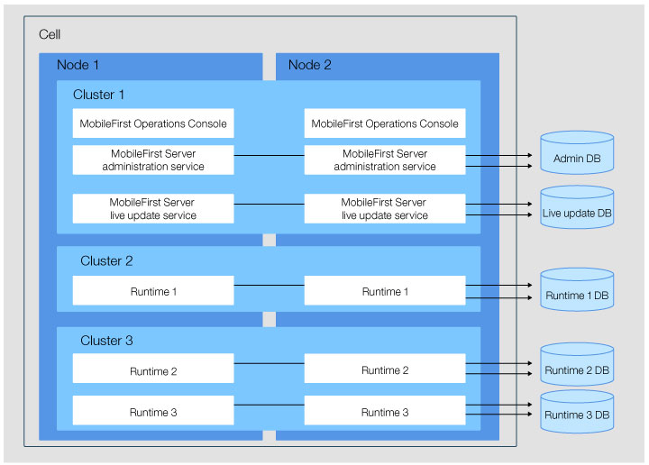

<!-- NLS_CHARSET=UTF-8 -->
## Visão Geral
{: #overview }
As informações apresentadas aqui detalham as possíveis topologias do servidor para componentes do {{ site.data.keys.mf_server }}, bem como os fluxos de rede disponíveis.  
Os componentes são implementados de acordo com a topologia de servidor usada. Os fluxos de rede explicam como os componentes se comunicam uns com os outros e com os dispositivos de usuário final.

#### Ir para
{: #jump-to }

* [Fluxos de rede entre os componentes do {{ site.data.keys.mf_server }}](#network-flows-between-the-mobilefirst-server-components)
* [Restrições nos componentes do {{ site.data.keys.mf_server }} e {{ site.data.keys.mf_analytics }}](#constraints-on-the-mobilefirst-server-components-and-mobilefirst-analytics)
* [Vários tempos de execução do {{ site.data.keys.product }}](#multiple-mobilefirst-foundation-runtimes)
* [Várias instâncias do {{ site.data.keys.mf_server }} no mesmo servidor ou célula do WebSphere Application Server](#multiple-instances-of-mobilefirst-server-on-the-same-server-or-websphere-application-server-cell)

## Fluxos de rede entre componentes do {{ site.data.keys.mf_server }}
{: #network-flows-between-the-mobilefirst-server-components }
Os componentes do {{ site.data.keys.mf_server }} podem se comunicar uns com os outros sobre JMX ou HTTP. É necessário configurar certas propriedades JNDI para ativar comunicações.  
Os fluxos de rede entre os componentes e o dispositivo podem ser ilustrados pela seguinte imagem:

Os fluxos entre os vários componentes do {{ site.data.keys.mf_server }},
{{ site.data.keys.mf_analytics }},
dispositivos móveis e servidor de aplicativos são explicados nas seções a seguir:

1. [Tempo de execução do {{ site.data.keys.product }} para serviço de administração do {{ site.data.keys.mf_server }}](#mobilefirst-foundation-runtime-to-mobilefirst-server-administration-service)
2. [Serviço de administração do {{ site.data.keys.mf_server }} para tempo de execução do {{ site.data.keys.product }} em outros servidores](#mobilefirst-server-administration-service-to-mobilefirst-foundation-runtime-in-other-servers)
3. [Serviço de administração do {{ site.data.keys.mf_server }} e tempo de execução do {{ site.data.keys.product_adj }} para o gerenciador de implementação no WebSphere Application Server Network Deployment](#mobilefirst-server-administration-service-and-mobilefirst-runtime-to-the-deployment-manager-on-websphere-application-server-network-deployment)
4. Serviço de push do [{{ site.data.keys.mf_server }} e tempo de execução do {{ site.data.keys.product }} para {{ site.data.keys.mf_analytics }}](#mobilefirst-server-push-service-and-mobilefirst-foundation-runtime-to-mobilefirst-analytics)
5. [Serviço de administração do {{ site.data.keys.mf_server }} para serviço de atualização em tempo real do {{ site.data.keys.mf_server }}](#mobilefirst-server-administration-service-to-mobilefirst-server-live-update-service)
6. [{{ site.data.keys.mf_console }} para serviço de administração do {{ site.data.keys.mf_server }}](#mobilefirst-operations-console-to-mobilefirst-server-administration-service)
7. [Serviço de administração do {{ site.data.keys.mf_server }} para serviço de push do {{ site.data.keys.mf_server }} e para o servidor de autorizações](#mobilefirst-server-administration-service-to-mobilefirst-server-push-service-and-to-the-authorization-server)
8. [Serviço de push do {{ site.data.keys.mf_server }} para um serviço de notificação push externo (saída)](#mobilefirst-server-push-service-to-an-external-push-notification-service-outbound)
9. [Dispositivos móveis para o tempo de execução do {{ site.data.keys.product }}](#mobile-devices-to-mobilefirst-foundation-runtime)

### Tempo de execução do {{ site.data.keys.product }} para o serviço de administração do {{ site.data.keys.mf_server }}
{: #mobilefirst-foundation-runtime-to-mobilefirst-server-administration-service }
O tempo de execução e o serviço de administração podem se comunicar um com o outro por meio de JMX e HTTP. Essa comunicação ocorre durante a fase de inicialização do tempo de execução. O tempo de execução contata o serviço de administração local para seu servidor de aplicativos para obter a lista de adaptadores e aplicativos que ele precisa atender. A comunicação também acontece quando algumas operações de administração são executadas do {{ site.data.keys.mf_console }} ou serviço de administração. No WebSphere Application Server Network Deployment, o tempo de execução pode entrar em contato com um serviço de administração que está instalado em outro servidor da célula. Isso permite a implementação não simétrica (consulte [Restrições no serviço de administração do {{ site.data.keys.mf_server }}, serviço de atualização em tempo real do {{ site.data.keys.mf_server }} e tempo de execução do {{ site.data.keys.product }}](#constraints-on-mobilefirst-server-administration-service-mobilefirst-server-live-update-service-and-mobilefirst-foundation-runtime)). No entanto, em todos os outros servidores de aplicativos (Apache Tomcat, WebSphere Application Server Liberty ou WebSphere Application Server independente), o serviço de administração deve estar em execução no mesmo servidor que o tempo de execução.

Os protocolos para JMX dependem do servidor de aplicativos:

* Apache Tomcat - RMI
* WebSphere Application Server Liberty - HTTPS (com o conector REST)
* WebSphere Application Server - SOAP ou RMI

Para comunicação via JMX, é necessário que esses protocolos estejam disponíveis no servidor de aplicativos. Para obter informações adicionais sobre os requisitos, consulte [Pré-requisitos do servidor de aplicativos](../appserver/#application-server-prerequisites).

Os beans JMX do tempo de execução e serviço de administração são obtidos do servidor de aplicativos. No entanto, no caso do WebSphere Application Server Network Deployment, os beans JMX são obtidos do gerenciador de implementação. O gerenciador de implementação tem a visão de todos os beans de uma célula no WebSphere Application Server Network Deployment. Portanto, algumas configurações não são necessárias no WebSphere Application Server Network Deployment (como a configuração de farm), e a implementação não simétrica é possível no WebSphere Application Server Network Deployment. Para obter informações adicionais, consulte [Restrições no serviço de administração do {{ site.data.keys.mf_server }}, no serviço de atualização em tempo real do {{ site.data.keys.mf_server }} e no tempo de execução do {{ site.data.keys.product }}](#constraints-on-mobilefirst-server-administration-service-mobilefirst-server-live-update-service-and-mobilefirst-foundation-runtime).

Para distinguir diferentes instalações do {{ site.data.keys.mf_server }} no mesmo servidor de aplicativos ou na mesma célula do WebSphere Application Server, é possível usar um ID de ambiente, que é uma variável JNDI. Por padrão, essa variável tem um valor vazio. Um tempo de execução com um determinado ID de ambiente se comunica somente com um serviço de administração que tem o mesmo ID de ambiente. Por exemplo, o serviço de administração tem um ID de ambiente configurado como X, e o tempo de execução tem um ID de ambiente diferente (por exemplo, Y), portanto, os dois componentes não se veem. O {{ site.data.keys.mf_console }} mostra que não há nenhum tempo de execução disponível.

Um serviço de administração deve estar apto para se comunicar com todos os componentes de tempo de execução do {{ site.data.keys.product }} de um cluster. Quando uma operação de administração é executada, como o upload de uma nova versão de um adaptador ou a mudança do status ativo de um aplicativo, todos os componentes de tempo de execução do cluster devem ser notificados da mudança. Se o servidor de aplicativos não for WebSphere Application Server Network Deployment, essa comunicação poderá ocorrer somente se um farm estiver configurado. Para obter informações adicionais, consulte [Restrições no serviço de administração do {{ site.data.keys.mf_server }}, no serviço de atualização em tempo real do {{ site.data.keys.mf_server }} e no tempo de execução do {{ site.data.keys.product }}](#constraints-on-mobilefirst-server-administration-service-mobilefirst-server-live-update-service-and-mobilefirst-foundation-runtime).

O tempo de execução também se comunica com o serviço de administração por meio de HTTP ou HTTPS para fazer o download de artefatos grandes, como adaptadores. Uma URL é gerada pelo serviço de administração e o tempo de execução abre uma conexão HTTP ou HTTPS de saída para solicitar um artefato dessa URL. É possível substituir a geração de URL padrão definindo as propriedades JNDI (mfp.admin.proxy.port, mfp.admin.proxy.protocol e mfp.admin.proxy.host) no serviço de administração. O serviço de administração também pode precisar se comunicar com o tempo de execução por meio de HTTP ou HTTPS para obter os tokens OAuth que são usados para a execução de operações push. Para obter informações adicionais, consulte [Serviço de administração do {{ site.data.keys.mf_server }} para o serviço de push do {{ site.data.keys.mf_server }} e para o servidor de autorizações](#mobilefirst-server-administration-service-to-mobilefirst-server-push-service-and-to-the-authorization-server).

As propriedades JNDI que são usadas para comunicação entre o tempo de execução e o serviço de administração são as seguintes:

#### Serviço de Administração do {{ site.data.keys.mf_server }}
{: #mobilefirst-server-administration-service }

* [Propriedades JNDI para serviços de administração: JMX](../server-configuration/#jndi-properties-for-administration-service-jmx)
* [Propriedades JNDI para serviços de administração: proxies](../server-configuration/#jndi-properties-for-administration-service-proxies)
* [Propriedades JNDI para serviços de administração: topologias](../server-configuration/#jndi-properties-for-administration-service-topologies)

#### Tempo de execução
{{ site.data.keys.product }}
{: #mobilefirst-foundation-runtime }

* [Lista de propriedades JNDI para o tempo de execução do {{ site.data.keys.product_adj }}](../server-configuration/#list-of-jndi-properties-for-mobilefirst-runtime)

### Serviço de administração do {{ site.data.keys.mf_server }} para tempo de execução do
{{ site.data.keys.product }} em outros servidores
{: #mobilefirst-server-administration-service-to-mobilefirst-foundation-runtime-in-other-servers }
Conforme descrito em [Tempo de execução do {{ site.data.keys.product }} para serviço de administração do {{ site.data.keys.mf_server }}](#mobilefirst-foundation-runtime-to-mobilefirst-server-administration-service), é necessário ter a comunicação entre um serviço de administração e todos os componentes de tempo de execução de um cluster. Quando uma operação de administração é executada, todos os componentes de tempo de execução de um cluster podem ser notificados sobre essa modificação. A comunicação é por meio de JMX.

No WebSphere Application Server Network Deployment, essa comunicação pode ocorrer sem nenhuma configuração específica. Todos os MBeans JMX que correspondem ao mesmo ID de ambiente são obtidos do gerenciador de implementação.

Para um cluster do WebSphere Application Server independente, do perfil Liberty do WebSphere Application Server ou do Apache Tomcat, a comunicação pode ocorrer somente se um farm estiver configurado. Para obter mais informações, consulte [Instalando um server farm](../appserver/#installing-a-server-farm).

### Serviço de administração do {{ site.data.keys.mf_server }} e tempo de execução do MobileFirst para o gerenciador de implementação no WebSphere Application Server Network Deployment
{: #mobilefirst-server-administration-service-and-mobilefirst-runtime-to-the-deployment-manager-on-websphere-application-server-network-deployment }
No WebSphere Application Server Network Deployment, o tempo de execução e o serviço de administração obtêm os MBeans JMX que são usados no tempo de execução do [{{ site.data.keys.product }} para o serviço de administração do {{ site.data.keys.mf_server }}](#mobilefirst-foundation-runtime-to-mobilefirst-server-administration-service) e no serviço de administração do [{{ site.data.keys.mf_server }} para o tempo de execução do {{ site.data.keys.product }} em outros servidores](#mobilefirst-server-administration-service-to-mobilefirst-foundation-runtime-in-other-servers) comunicando-se com o gerenciador de implementação. As propriedades JNDI correspondentes são **mfp.admin.jmx.dmgr.*** em [Propriedades JNDI para serviços de administração: JMX](../server-configuration/#jndi-properties-for-administration-service-jmx).

O gerenciador de implementação deve estar em execução para permitir as operações que requerem comunicação do JMX entre o tempo de execução e o serviço de administração. Essas operações podem ser a inicialização de um tempo de execução ou a notificação de uma modificação executada por meio de serviço de administração.

### Serviço de push do
{{ site.data.keys.mf_server }} e tempo de execução do {{ site.data.keys.product }} para
{{ site.data.keys.mf_analytics }}
{: #mobilefirst-server-push-service-and-mobilefirst-foundation-runtime-to-mobilefirst-analytics }
O tempo de execução envia dados para o {{ site.data.keys.mf_analytics }} por meio de HTTP ou HTTPS. As propriedades JNDI do tempo de execução que são usadas para definir essa comunicação são:

* **mfp.analytics.url ** - a URL que é exposta pelo serviço {{ site.data.keys.mf_analytics }} para receber dados de  análise de dados recebidos do tempo de execução. Exemplo: `http://<hostname>:<port>/analytics-service/rest`

    Quando {{ site.data.keys.mf_analytics }} é instalado como um cluster, os dados podem ser enviados para quaisquer membros do cluster.

* **mfp.analytics.username** - o nome do usuário usado para acessar o serviço do {{ site.data.keys.mf_analytics }}. O serviço de análise de dados é protegido por uma função de segurança.
* **mfp.analytics.password** - a senha para acessar o serviço de análise de dados.
* **mfp.analytics.console.url** - a URL passada para o {{ site.data.keys.mf_console }} para exibir um link para o {{ site.data.keys.mf_analytics_console }}. Exemplo: `http://<hostname>:<port>/analytics/console`

    As propriedades JNDI do serviço de push que são usadas para definir essa comunicação são:
* **mfp.push.analytics.endpoint ** - a URL que é exposta pelo serviço {{ site.data.keys.mf_analytics }} para receber dados de análise de dados recebidos do serviço de push. Exemplo: `http://<hostname>:<port>/analytics-service/rest`

    Quando {{ site.data.keys.mf_analytics }} é instalado como um cluster, os dados podem ser enviados para quaisquer membros do cluster.    
* **mfp.push.analytics.username** - o nome do usuário usado para acessar o serviço do {{ site.data.keys.mf_analytics }}. O serviço de análise de dados é protegido por uma função de segurança.
* **mfp.push.analytics.password** - a senha para acessar o serviço de análise de dados.

### Serviço de administração do {{ site.data.keys.mf_server }} para o serviço de atualização em tempo real do {{ site.data.keys.mf_server }}
{: #mobilefirst-server-administration-service-to-mobilefirst-server-live-update-service }
O serviço de administração comunica-se com o serviço de atualização em tempo real para armazenar e recuperar informações de configuração sobre os artefatos do {{ site.data.keys.product }}. A comunicação é executada por meio de HTTP ou HTTPS.

A URL para conectar o serviço de atualização em tempo real é gerada automaticamente pelo serviço de administração. Ambos os serviços devem estar no mesmo servidor de aplicativos. A raiz de contexto do serviço de atualização em tempo real deve ser definida dessa forma: `<adminContextRoot>config`. Por exemplo, se a raiz de contexto do serviço de administração for
**mfpadmin**, a raiz de contexto do serviço de atualização em tempo real deverá ser **mfpadminconfig**. É possível substituir a geração de URL padrão definindo as propriedades JNDI (**mfp.admin.proxy.port**, **mfp.admin.proxy.protocol** e
**mfp.admin.proxy.host**) no serviço de administração.

As propriedades JNDI para configurar essa comunicação entre os dois serviços são:

* **mfp.config.service.user**
* **mfp.config.service.password**
* E as propriedades em [Propriedades JNDI para serviços de administração: proxies](../server-configuration/#jndi-properties-for-administration-service-proxies).

### {{ site.data.keys.mf_console }} para serviço de administração do {{ site.data.keys.mf_server }}
{: #mobilefirst-operations-console-to-mobilefirst-server-administration-service }
{{ site.data.keys.mf_console }} é uma interface com o usuário da web e age como front-end para o serviço de administração. Ele se comunica com serviços REST do serviço de administração por meio de HTTP ou HTTPS. Os usuários que têm permissão para usar o console também devem ter permissão para usar o serviço de administração. Cada usuário que é mapeado para uma certa função de segurança do console também deve ser mapeado para a mesma função de segurança do serviço. Com essa configuração, as solicitações do console podem então ser aceitas pelo serviço.

As propriedades JNDI para configurar essa comunicação estão em [Propriedades JNDI para o {{ site.data.keys.mf_console }}](../server-configuration/#jndi-properties-for-mobilefirst-operations-console).

> Nota: a propriedade **mfp.admin.endpoint** permite que o console localize o serviço de administração. É possível usar o caractere asterisco "\*" como um curinga para especificar que a URL, gerada pelo console para entrar em contato com os serviços de administração, usa o mesmo valor que a solicitação de HTTP recebida no console. Por exemplo: `*://*:*/mfpadmin` significa usar o mesmo protocolo, host e porta que o console, mas usar **mfpadmin** como raiz de contexto. Essa propriedade é especificada para o aplicativo do console.

### Serviço de administração do {{ site.data.keys.mf_server }} para o serviço de push do {{ site.data.keys.mf_server }} e para o servidor de autorizações
{: #mobilefirst-server-administration-service-to-mobilefirst-server-push-service-and-to-the-authorization-server }
O serviço de administração se comunica com o serviço de push para solicitar várias operações de push. Essa comunicação é protegida pelo protocolo OAuth. Ambos os serviços precisam ser registrados como clientes confidenciais. Um registro inicial pode ser executado no momento da instalação. Nesse processo, ambos os serviços precisam entrar em contato com um servidor de autorizações. Esse servidor de autorizações pode ser o tempo de execução do {{ site.data.keys.product }}.

As propriedades JNDI do serviço de administração para configurar essa comunicação são:

* **mfp.admin.push.url** - a URL do serviço de push.
* **mfp.admin.authorization.server.url** - a URL do servidor de autorizações {{ site.data.keys.product }}.
* **mfp.admin.authorization.client.id** - o ID do cliente do serviço de administração, como um cliente confidencial OAuth.
* **mfp.admin.authorization.client.secret** - o código secreto usado para obter tokens baseados em OAuth.

> Nota: as propriedades **mfp.push.authorization.client.id** e **mfp.push.authorization.client.secret** do serviço de administração podem ser usadas para registrar o serviço de push automaticamente como um cliente confidencial quando o serviço de administração for iniciado. O serviço de push deve ser configurado com os mesmos valores.

As propriedades JNDI do serviço de push para configurar essa comunicação são:

* **mfp.push.authorization.server.url** - a URL do servidor de autorizações {{ site.data.keys.product }}. Mesmo que a propriedade **mfp.admin.authorization.server.url**.
* **mfp.push.authorization.client.id** - o ID do cliente do serviço de push para contatar o servidor de autorizações.
* **mfp.push.authorization.client.secret** - o código secreto usado para contatar o servidor de autorizações.

### Serviço de push do {{ site.data.keys.mf_server }} para um serviço de notificação push externo (saída)
{: #mobilefirst-server-push-service-to-an-external-push-notification-service-outbound }
O serviço de push gera tráfego de saída para o serviço de notificação externo, como Apple Push Notification Service (APNS) ou Google Cloud Messaging (GCM). Essa comunicação também pode ser feita por meio de um proxy. Dependendo do serviço de notificação, as propriedades JNDI a seguir devem ser configuradas:

* **push.apns.proxy**
* **push.gcm.proxy**

Para obter informações adicionais, consulte [Lista de propriedades JNDI para o serviço de push do {{ site.data.keys.mf_server }}](../server-configuration/#list-of-jndi-properties-for-mobilefirst-server-push-service).

### Dispositivos móveis para o tempo de execução do {{ site.data.keys.product }}
{: #mobile-devices-to-mobilefirst-foundation-runtime }
Os dispositivos móveis contatam o tempo de execução. A segurança dessa comunicação é determinada pela configuração do aplicativo e dos adaptadores solicitados. Para obter informações adicionais, consulte [Estrutura de segurança do {{ site.data.keys.product_adj }}](../../../authentication-and-security).

## Restrições nos componentes do {{ site.data.keys.mf_server }} e {{ site.data.keys.mf_analytics }}
{: #constraints-on-the-mobilefirst-server-components-and-mobilefirst-analytics }
Entenda as restrições nos vários componentes do {{ site.data.keys.mf_server }} e {{ site.data.keys.mf_analytics }} antes de decidir a topologia do servidor.

* [Restrições no serviço de administração do {{ site.data.keys.mf_server }}, no serviço de atualização em tempo real do {{ site.data.keys.mf_server }} e no tempo de execução do {{ site.data.keys.product }}](#constraints-on-mobilefirst-server-administration-service-mobilefirst-server-live-update-service-and-mobilefirst-foundation-runtime)
* [Restrições no serviço de push do {{ site.data.keys.mf_server }}](#constraints-on-mobilefirst-server-push-service)

### Restrições no serviço de administração do {{ site.data.keys.mf_server }}, serviço de atualização em tempo real do {{ site.data.keys.mf_server }} e tempo de execução do {{ site.data.keys.product }}
{: #constraints-on-mobilefirst-server-administration-service-mobilefirst-server-live-update-service-and-mobilefirst-foundation-runtime }
Descubra as restrições e o modo de implementação do serviço de administração, serviço de atualização em tempo real e tempo de execução por topologia de servidor.

O serviço de atualização em tempo real deve ser sempre instalado com o serviço de administração no mesmo servidor de aplicativos, conforme explicado em [Serviço de administração do {{ site.data.keys.mf_server }} para o serviço de atualização em tempo real do {{ site.data.keys.mf_server }}](#mobilefirst-server-administration-service-to-mobilefirst-server-live-update-service). A raiz de contexto do serviço de atualização em tempo real deve ser definida dessa forma: `/<adminContextRoot>config`. Por exemplo, se a raiz de contexto do serviço de administração for **/mfpadmin**, a raiz de contexto do serviço de atualização em tempo real deverá ser **/mfpadminconfig**.

É possível usar as seguintes topologias de servidores de aplicativos:

* Servidor independente: perfil Liberty do WebSphere Application Server, Apache Tomcat ou perfil completo do WebSphere Application Server
* Server farm: perfil Liberty do WebSphere Application Server, Apache Tomcat ou perfil completo do WebSphere Application Server
* Célula do WebSphere Application Server Network Deployment
* Coletivo Liberty

#### Modos de implementação
{: #modes-of-deployment }
Dependendo da topologia do servidor de aplicativos usada, você terá dois modos de opção de implementação para implementar o serviço de administração, serviço de atualização em tempo real e tempo de execução na infraestrutura do servidor de aplicativo. Na implementação assimétrica, ainda é possível instalar os tempos de execução em diferentes servidores de aplicativos a partir dos serviços de administração e atualização em tempo real.

**Implementação simétrica**  
Na implementação simétrica, deve-se instalar os componentes de administração do  {{ site.data.keys.product }} (aplicativos {{ site.data.keys.mf_console }}, serviço de administração e serviço de atualização em tempo real) e o tempo de execução no mesmo servidor de aplicativos.

**Implementação assimétrica**  
Na implementação assimétrica, é possível instalar os tempos de execução em diferentes servidores de aplicativos dos componentes de administração do {{ site.data.keys.product }}.  
A implementação assimétrica é suportada somente para a topologia de célula do WebSphere Application Server Network Deployment e para a topologia do Liberty Collective.

#### Selecione uma topologia
{: #select-a-topology }

* [Topologia de Servidor Independente](#stand-alone-server-topology)
* [Topologia do server farm](#server-farm-topology)
* [Topologia do Liberty Collective](#liberty-collective-topology)
* [Topologias do WebSphere Application Server Network Deployment](#websphere-application-server-network-deployment-topologies)
* [Usando um proxy reverso com o server farm e as topologias do WebSphere Application Server Network Deployment](#using-a-reverse-proxy-with-server-farm-and-websphere-application-server-network-deployment-topologies)

### Topologia de Servidor Independente
{: #stand-alone-server-topology }
É possível configurar uma topologia independente para o perfil completo do WebSphere Application Server, o perfil Liberty do WebSphere Application Server e o Apache Tomcat.
Nessa topologia, todos os componentes de administração e os tempos de execução são implementados em uma única Java Virtual Machine (JVM).

Com uma JVM, somente a implementação simétrica é possível com as seguintes características:

* Um ou vários componentes de administração podem ser implementados. Cada {{ site.data.keys.mf_console }} se comunica com um serviço de administração e um serviço de atualização em tempo real.
* Um ou vários tempos de execução podem ser implementados.
* Um {{ site.data.keys.mf_console }} pode gerenciar vários tempos de execução.
* Um tempo de execução é gerenciado por apenas um {{ site.data.keys.mf_console }}.
* Cada serviço de administração usa o seu próprio esquema do banco de dados de administração.
* Cada serviço de atualização em tempo real usa seu próprio esquema do banco de dados de atualização em tempo real.
* Cada tempo de execução usa o seu próprio esquema do banco de dados de tempo de execução.

#### Configuração de propriedades da JNDI
{: #configuration-of-jndi-properties }
Algumas propriedades JNDI são necessárias para permitir a comunicação de Java Management Extensions (JMX) entre o serviço de administração e o tempo de execução, e para definir o serviço de administração que gerencia um tempo de execução. Para obter detalhes sobre essas propriedades, consulte [Lista de propriedades JNDI para o serviço de administração do {{ site.data.keys.mf_server }}](../server-configuration/#list-of-jndi-properties-for-mobilefirst-server-administration-service) e [Lista de propriedades JNDI para o tempo de execução do {{ site.data.keys.product_adj }}](../server-configuration/#list-of-jndi-properties-for-mobilefirst-runtime).

**Servidor de perfil Liberty do WebSphere Application Server independente**  
As propriedades JNDI globais são necessárias para serviços de administração e tempos de execução.

| Propriedades JNDI          | Valores |
|--------------------------|--------|
| mfp.topology.platform	   | Liberty |
| mfp.topology.clustermode | Standalone |
| mfp.admin.jmx.host       | O nome do host do servidor de perfil Liberty do WebSphere Application Server. |
| mfp.admin.jmx.port       | A porta do conector REST que é a porta do atributo httpsPort declarado no elemento `<httpEndpoint>` do arquivo server.xml do servidor de perfil Liberty do WebSphere Application Server. Essa propriedade não tem nenhum valor padrão. |
| mfp.admin.jmx.user       | O nome do usuário do administrador do WebSphere Application Server Liberty, que deve ser idêntico ao nome definido no elemento `<administrator-role>` do arquivo server.xml do servidor de perfil Liberty do WebSphere Application Server. |
| mfp.admin.jmx.pwd        | A senha do usuário administrador do WebSphere Application Server Liberty. |

Vários componentes de administração podem ser implementados para ativar a mesma JVM para executar em componentes de administração separados que gerenciam diferentes tempos de execução.

Quando você implementa vários componentes de administração, deve especificar:

* Em cada serviço de administração, um valor exclusivo para a propriedade JNDI **mfp.admin.environmentid** local.
* Em cada tempo de execução, o mesmo valor para a propriedade JNDI **mfp.admin.environmentid** local, conforme o valor definido para o serviço de administração que gerencia o tempo de execução.

**Servidor Apache Tomcat independente**
As seguintes propriedades JNDI locais são necessárias para os serviços de administração e os tempos de execução.

| Propriedades JNDI        |	Valores    |
|------------------------|------------|
| mfp.topology.platform   | Tomcat     |
| mfp.topology.clustermode | Standalone |

Propriedades da JVM também são requeridas para definir a Remote Method Invocation (RMI) das Java Management Extensions (JMX). Para obter informações adicionais, consulte [Configurando a conexão JMX para Apache Tomcat](../appserver/#apache-tomcat-prerequisites).

Se o servidor Apache Tomcat estiver em execução atrás de um firewall, as propriedades JNDI **mfp.admin.rmi.registryPort** e **mfp.admin.rmi.serverPort** serão necessárias para o serviço de administração. Consulte [Configurando a conexão JMX para Apache Tomcat](../appserver/#apache-tomcat-prerequisites).

Vários componentes de administração podem ser implementados para ativar a mesma JVM para executar em componentes de administração separados que gerenciam diferentes tempos de execução.  
Quando você implementa vários componentes de administração, deve especificar:

* Em cada serviço de administração, um valor exclusivo para a propriedade JNDI mfp.admin.environmentid local.
* Em cada tempo de execução, o mesmo valor para a propriedade JNDI mfp.admin.environmentid local que o valor definido para o serviço de administração que gerencia o tempo de execução.

**WebSphere Application Server independente**  
As propriedades JNDI locais a seguir são necessárias para os serviços de administração e tempos de execução.

| Propriedades JNDI          | Valores                 |
|--------------------------| -----------------------|
| mfp.topology.platform    | WAS                    |
| mfp.topology.clustermode | Standalone             |
| mfp.admin.jmx.connector  | O tipo de conector JMX; o valor pode ser SOAP ou RMI. |

Vários componentes de administração podem ser implementados para ativar a mesma JVM para executar em componentes de administração separados que gerenciam diferentes tempos de execução.  
Quando você implementa vários componentes de administração, deve especificar:

* Em cada serviço de administração, um valor exclusivo para a propriedade JNDI **local mfp.admin.environmentid**.
* Em cada tempo de execução, o mesmo valor para a propriedade JNDI **mfp.admin.environmentid** local, conforme o valor definido para o serviço de administração que gerencia o tempo de execução.

### Topologia do server farm
{: #server-farm-topology }
É possível configurar um farm do perfil completo do WebSphere Application Server, do perfil Liberty do WebSphere Application Server ou de servidores de aplicativos Apache Tomcat.

Um farm é um conjunto de servidores individuais no qual os mesmos componentes são implementados e onde o mesmo banco de dados de serviço de administração e banco de dados de tempo de execução são compartilhados entre os servidores. A topologia de farm possibilita o carregamento de aplicativos {{ site.data.keys.product }} para serem distribuídos ao longo de vários servidores. Cada servidor no farm deve ser uma Java virtual machine (JVM) do mesmo tipo do servidor de aplicativos; ou seja, um server farm homogêneo. Por exemplo, um conjunto de vários servidores Liberty pode ser configurado como um server farm. Por outro lado, uma combinação de servidor Liberty, servidor Tomcat ou WebSphere Application Server independente não pode ser configurada como um server farm.

Nessa topologia, todos os componentes de administração ({{ site.data.keys.mf_console }}, o serviço de administração e o serviço de atualização em tempo real) e tempos de execução são implementados em cada servidor no farm.

Essa topologia suporta somente a implementação simétrica. Os tempos de execução e os componentes de administração devem ser implementados em cada servidor no farm. A implementação dessa topologia tem as seguintes características:

* Um ou vários componentes de administração podem ser implementados. Cada instância do {{ site.data.keys.mf_console }} se comunica com um serviço de administração e um serviço de atualização em tempo real.
* Os componentes de administração devem ser implementados em todos os servidores no farm.
* Um ou vários tempos de execução podem ser implementados.
* Os tempos de execução devem ser implementados em todos os servidores no farm.
* Um {{ site.data.keys.mf_console }} pode gerenciar vários tempos de execução.
* Um tempo de execução é gerenciado por apenas um {{ site.data.keys.mf_console }}.
* Cada serviço de administração usa o seu próprio esquema do banco de dados de administração. Todas as instâncias implementadas do mesmo serviço de administração compartilham o mesmo esquema do banco de dados de administração.
* Cada serviço de atualização em tempo real usa seu próprio esquema do banco de dados de atualização em tempo real. Todas as instâncias implementadas do mesmo serviço de atualização em tempo real compartilham o mesmo esquema do banco de dados de atualização em tempo real.
* Cada tempo de execução usa o seu próprio esquema do banco de dados de tempo de execução. Todas as instâncias implementadas do mesmo tempo de execução compartilham o mesmo esquema do banco de dados de tempo de execução.

#### Configuração de propriedades da JNDI
{: #configuration-of-jndi-properties-1 }
Algumas propriedades da JNDI são requeridas para ativar a comunicação de JMX entre o serviço de administração e o tempo de execução do mesmo servidor e para definir o serviço de administração que gerencia um tempo de execução. Para sua comodidade, as tabelas a seguir listam essas propriedades. Para obter instruções sobre como instalar um server farm, consulte [Instalando um server farm](../appserver/#installing-a-server-farm). Para obter informações adicionais sobre as propriedades JNDI, consulte [Lista de propriedades JNDI para o serviço de administração do {{ site.data.keys.mf_server }}](../server-configuration/#list-of-jndi-properties-for-mobilefirst-server-administration-service) e [Lista de propriedades JNDI para o tempo de execução do {{ site.data.keys.product_adj }}](../server-configuration/#list-of-jndi-properties-for-mobilefirst-runtime).

**Server farm de perfil Liberty do WebSphere Application Server**  
As propriedades JNDI globais a seguir são necessárias em cada servidor do farm para os serviços de administração e tempos de execução.

<table>
    <tr>
        <th>
            Propriedades JNDI
        </th>
        <th>
            Valores
        </th>
    </tr>
    <tr>
        <td>
            mfp.topology.platform
        </td>
        <td>
            Liberty
        </td>
    </tr>
    <tr>
        <td>
            mfp.topology.clustermode
        </td>
        <td>
            Farm
        </td>
    </tr>
    <tr>
        <td>
            mfp.admin.jmx.host
        </td>
        <td>
            O nome do host do servidor de perfil Liberty do WebSphere Application Server
        </td>
    </tr>
    <tr>
        <td>
            mfp.admin.jmx.port
        </td>
        <td>
            A porta do conector REST que deve ser idêntica ao valor do atributo httpsPort declarado no elemento <code>httpEndpoint</code> do arquivo <b>server.xml</b> do servidor de perfil Liberty do WebSphere Application Server. 


<httpEndpoint id="defaultHttpEndpoint" httpPort="9080" httpsPort="9443" host="*" />

        </td>
    </tr>
    <tr>
        <td>
            mfp.admin.jmx.user
        </td>
        <td>
            O nome do usuário do administrador do WebSphere Application Server Liberty que está definido no elemento <code>administrator-role</code> do arquivo <b>server.xml</b> do servidor de perfil Liberty do WebSphere Application Server.
            

<administrator-role>
    <user>MfpRESTUser</user>
</administrator-role>
        
        </td>
    </tr>
    <tr>
        <td>
            mfp.admin.jmx.pwd
        </td>
        <td>
            A senha do usuário administrador do WebSphere Application Server Liberty.
        </td>
    </tr>
</table>

A propriedade JNDI **mfp.admin.serverid** é necessária para o serviço de administração gerenciar a configuração do server farm. O seu valor é o identificador do servidor, que deve ser diferente para cada servidor no farm.

Vários componentes de administração podem ser implementados para ativar a mesma JVM para executar em componentes de administração separados que gerenciam diferentes tempos de execução.

Quando você implementa vários componentes de administração, deve especificar:

* Em cada serviço de administração, um valor exclusivo para a propriedade JNDI mfp.admin.environmentid local.
* Em cada tempo de execução, o mesmo valor para a propriedade JNDI **mfp.admin.environmentid** local, conforme o valor definido para o serviço de administração que gerencia o tempo de execução.

**Server farm do Apache Tomcat**  
As propriedades JNDI globais a seguir são necessárias em cada servidor do farm para os serviços de administração e tempos de execução.

| Propriedades JNDI          |	Valores |
|--------------------------|-----------|
| mfp.topology.platform	   | Tomcat    |
| mfp.topology.clustermode | Farm      |

Propriedades da JVM também são requeridas para definir a Remote Method Invocation (RMI) das Java Management Extensions (JMX). Para obter informações adicionais, consulte [Configurando a conexão JMX para Apache Tomcat](../appserver/#apache-tomcat-prerequisites).

A propriedade JNDI **mfp.admin.serverid** é necessária para o serviço de administração gerenciar a configuração do server farm. O seu valor é o identificador do servidor, que deve ser diferente para cada servidor no farm.

Vários componentes de administração podem ser implementados para ativar a mesma JVM para executar em componentes de administração separados que gerenciam diferentes tempos de execução.

Quando você implementa vários componentes de administração, deve especificar:

* Em cada serviço de administração, um valor exclusivo para a propriedade JNDI mfp.admin.environmentid local.
* Em cada tempo de execução, o mesmo valor para a propriedade JNDI **mfp.admin.environmentid** local, conforme o valor definido para o serviço de administração que gerencia o tempo de execução.

**Server farm de perfil completo do WebSphere Application Server**  
As propriedades JNDI globais a seguir são necessárias em cada servidor no farm para os serviços de administração e tempos de execução.

| Propriedades JNDI            | Valores |
|----------------------------|--------|
| mfp.topology.platform	WAS  | WAS    |
| mfp.topology.clustermode   | Farm   |
| mfp.admin.jmx.connector    | SOAP   |

As seguintes propriedades da JNDI são requeridas para os serviços de administração para gerenciar a configuração do server farm.

| Propriedades JNDI    | Valores |
|--------------------|--------|
| mfp.admin.jmx.user | O nome do usuário do WebSphere Application Server. Esse usuário deve ser definido no registro do usuário do WebSphere Application Server. |
| mfp.admin.jmx.pwd	 | A senha do usuário do WebSphere Application Server. |
| mfp.admin.serverid | O identificador do servidor, que deve ser diferente para cada servidor no farm e idêntica para o valor dessa propriedade usado para esse servidor no arquivo de configuração do server farm. |

Vários componentes de administração podem ser implementados para ativar a mesma JVM para executar em componentes de administração separados que gerenciam diferentes tempos de execução.

Quando você implementa vários componentes de administração, deve especificar os seguintes valores:

* Em cada serviço de administração, um valor exclusivo para a propriedade JNDI **mfp.admin.environmentid** local.
* Em cada tempo de execução, o mesmo valor para a propriedade JNDI **mfp.admin.environmentid** local, conforme o valor definido para o serviço de administração que gerencia o tempo de execução.

### Topologia do Liberty Collective
{: #liberty-collective-topology }
É possível implementar componentes do {{ site.data.keys.mf_server }} em uma topologia Liberty Collective.

Na topologia Liberty Collective, os componentes de administração do {{ site.data.keys.mf_server }} ({{ site.data.keys.mf_console }}, o serviço de administração e o serviço de atualização em tempo real) são implementados em um controlador coletivo e os tempos de execução do {{ site.data.keys.product }} em um membro coletivo. Essa topologia suporta somente implementação assimétrica, e os tempos de execução não podem ser implementados em um controlador coletivo.

A implementação dessa topologia tem as seguintes características:

* Um ou vários componentes de administração podem ser implementados em um ou vários controladores do Collective. Cada instância de * * {{ site.data.keys.mf_console }} se comunica com um serviço de administração e um serviço de atualização em tempo real.
* Um ou vários tempos de execução podem ser implementados nos membros de cluster do Collective.
* Um {{ site.data.keys.mf_console }} gerencia vários tempos de execução implementados nos membros de cluster do Collective.
* Um tempo de execução é gerenciado por apenas um {{ site.data.keys.mf_console }}.
* Cada serviço de administração usa o seu próprio esquema do banco de dados de administração.
* Cada serviço de atualização em tempo real usa seu próprio esquema do banco de dados de atualização em tempo real.
* Cada tempo de execução usa o seu próprio esquema do banco de dados de tempo de execução.

#### Configuração de propriedades da JNDI
{: #configuration-of-jndi-properties-2 }
As tabelas a seguir listam as propriedades JNDI que são necessárias para ativar a comunicação JMX entre o serviço de administração e o tempo de execução e para definir o serviço de administração que gerencia um tempo de execução. Para obter informações adicionais sobre essas propriedades, consulte [Lista de propriedades JNDI para o serviço de administração do {{ site.data.keys.mf_server }}](../server-configuration/#list-of-jndi-properties-for-mobilefirst-server-administration-service) e [Lista de propriedades JNDI para o tempo de execução do {{ site.data.keys.product_adj }}](../server-configuration/#list-of-jndi-properties-for-mobilefirst-runtime). Para obter instruções sobre como instalar um Liberty Collective manualmente, consulte [Instalação manual no WebSphere Application Server Liberty Collective](../appserver/#manual-installation-on-websphere-application-server-liberty-collective).

As propriedades JNDI globais a seguir são necessárias para os serviços de administração:

<table>
    <tr>
        <th>
            Propriedades JNDI
        </th>
        <th>
            Valores
        </th>
    </tr>
    <tr>
        <td>mfp.topology.platform</td>
        <td>Liberty</td>
    </tr>
    <tr>
        <td>mfp.topology.clustermode</td>
        <td>Cluster</td>
    </tr>
    <tr>
        <td>mfp.admin.serverid</td>
        <td>controlador PowerVC</td>
    </tr>
    <tr>
        <td>mfp.admin.jmx.host</td>
        <td>O nome do host do controlador Liberty.</td>
    </tr>
    <tr>
        <td>mfp.admin.jmx.port</td>
        <td>A porta do conector REST que deve ser idêntica ao valor do atributo <b>httpsPort</b> declarado no elemento <code>httpEndpoint</code> do arquivo server.xml do controlador Liberty.


<httpEndpoint id="defaultHttpEndpoint" httpPort="9080" httpsPort="9443" host="*"/>

        </td>
    </tr>
    <tr>
        <td>mfp.admin.jmx.user</td>
        <td>O nome do usuário do administrador controlador que está definido no elemento <code>administrator-role</code> do arquivo <b>server.xml</b> do controlador Liberty.


<administrator-role> <user>MfpRESTUser</user> </administrator-role>

        </td>
    </tr>
    <tr>
        <td>mfp.admin.jmx.pwd</td>
        <td>A senha para o usuário administrador do controlador Liberty.</td>
    </tr>
</table>

Vários componentes de administração podem ser implementados para permitir que o controlador execute componentes de administração separados que gerenciam diferentes tempos de execução.

Quando implementa vários componentes de administração, você deve especificar em cada serviço de administração um valor exclusivo para a propriedade JNDI **mfp.admin.environmentid** local.

As propriedades JNDI globais a seguir são necessárias para os tempos de execução:

<table>
    <tr>
        <th>
            Propriedades JNDI
        </th>
        <th>
            Valores
        </th>
    </tr>
    <tr>
        <td>mfp.topology.platform</td>
        <td>Liberty</td>
    </tr>
    <tr>
        <td>mfp.topology.clustermode</td>
        <td>Cluster</td>
    </tr>
    <tr>
        <td>mfp.admin.serverid</td>
        <td>Um valor que identifica exclusivamente o membro coletivo. Ele deve ser diferente para cada membro no Collective. O valor <code>controller</code> não pode ser usado, já que está reservado para o controlador coletivo.</td>
    </tr>
    <tr>
        <td>mfp.admin.jmx.host</td>
        <td>O nome do host do controlador Liberty.</td>
    </tr>
    <tr>
        <td>mfp.admin.jmx.port</td>
        <td>A porta do conector REST que deve ser idêntica ao valor do atributo <b>httpsPort</b> declarado no elemento <code>httpEndpoint</code> do arquivo server.xml do controlador Liberty.


<httpEndpoint id="defaultHttpEndpoint" httpPort="9080" httpsPort="9443" host="*"/>

        </td>
    </tr>
    <tr>
        <td>mfp.admin.jmx.user</td>
        <td>O nome do usuário do administrador controlador que está definido no elemento <code>administrator-role</code> do arquivo <b>server.xml</b> do controlador Liberty.


<administrator-role> <user>MfpRESTUser</user> </administrator-role>

        </td>
    </tr>
    <tr>
        <td>mfp.admin.jmx.pwd</td>
        <td>A senha para o usuário administrador do controlador Liberty.</td>
    </tr>
</table>

A propriedade JNDI a seguir é necessária para o tempo de execução quando vários controladores (réplicas) usando os mesmos componentes de administração são usados:

| Propriedades JNDI | Valores | 
|-----------------|--------|
| mfp.admin.jmx.replica | Lista de terminais de diferentes réplicas do controlador com a seguinte sintaxe: `replica-1 hostname:replica-1 port, replica-2 hostname:replica-2 port,..., replica-n hostname:replica-n port` | 

Quando vários componentes de administração são implementados no controlador, cada tempo de execução deve ter o mesmo valor para a propriedade JNDI **mfp.admin.environmentid** local que o valor definido para o serviço de administração gerenciando o tempo de execução.

### Topologias do WebSphere Application Server Network Deployment
{: #websphere-application-server-network-deployment-topologies }
Os componentes de administração e os tempos de execução são implementados em servidores ou clusters da célula do WebSphere Application Server Network Deployment.

Exemplos dessas topologias suportam implementação assimétrica ou simétrica, ou ambas. É possível, por exemplo, implementar os componentes de administração ({{ site.data.keys.mf_console }}, o serviço de administração e o serviço de atualização em tempo real) em um cluster e os tempos de execução gerenciados por esses componentes em outro cluster.

#### Implementação simétrica no mesmo servidor ou cluster
{: #symmetric-deployment-in-the-same-server-or-cluster }
O diagrama abaixo mostra a implementação simétrica em que os tempos de execução e os componentes de administração são implementados no mesmo servidor ou cluster.

A implementação dessa topologia tem as seguintes características:

* Um ou vários componentes de administração podem ser implementados em um ou vários servidores ou clusters da célula. Cada instância do * {{ site.data.keys.mf_console }} se comunica com um serviço de administração e um serviço de atualização em tempo real.
* Um ou vários tempos de execução podem ser implementados no mesmo servidor ou cluster como os componentes de administração que os gerencia.
* Um tempo de execução é gerenciado por apenas um {{ site.data.keys.mf_console }}.
* Cada serviço de administração usa o seu próprio esquema do banco de dados de administração.
* Cada serviço de atualização em tempo real usa seu próprio esquema do banco de dados de atualização em tempo real.
* Cada tempo de execução usa o seu próprio esquema do banco de dados de tempo de execução.

#### Implementação assimétrica com tempos de execução e serviços de administração em servidor ou cluster diferente
{: #asymmetric-deployment-with-runtimes-and-administration-services-in-different-server-or-cluster }
O diagrama abaixo mostra uma topologia em que os tempos de execução são implementados em um servidor ou cluster diferente dos serviços de administração.

A implementação dessa topologia tem as seguintes características:

* Um ou vários componentes de administração podem ser implementados em um ou vários servidores ou clusters da célula. Cada instância do * {{ site.data.keys.mf_console }} se comunica com um serviço de administração e um serviço de atualização em tempo real.
* Um ou vários tempos de execução podem ser implementados em outros servidores ou clusters da célula.
* Um {{ site.data.keys.mf_console }} gerencia vários tempos de execução implementados nos outros servidores ou clusters da célula.
* Um tempo de execução é gerenciado por apenas um {{ site.data.keys.mf_console }}.
* Cada serviço de administração usa o seu próprio esquema do banco de dados de administração.
* Cada serviço de atualização em tempo real usa seu próprio esquema do banco de dados de atualização em tempo real.
* Cada tempo de execução usa o seu próprio esquema do banco de dados de tempo de execução.

Essa topologia é vantajosa, porque ela ativa os tempos de execução para serem isolados dos componentes de administração e de outros tempos de execução. Ela pode ser usada para fornecer isolamento de desempenho, para isolar aplicativos críticos e impingir o Service Level Agreement (SLA).

#### Implementação simétrica e assimétrica
{: #symmetric-and-asymmetric-deployment }
O diagrama abaixo mostra um exemplo de implementação simétrica em Cluster1 e de implementação assimétrica em Cluster2, em que Runtime2 e Runtime3 são implementados em um cluster diferente dos componentes de administração. O {{ site.data.keys.mf_console }} gerencia
os tempos de execução implementados no Cluster1 e no Cluster2.

A implementação dessa topologia tem as seguintes características:

* Um ou vários componentes de administração podem ser implementados em um ou vários servidores ou clusters da célula. Cada instância do {{ site.data.keys.mf_console }} se comunica com um serviço de administração e um serviço de atualização em tempo real.
* Um ou vários tempos de execução podem ser implementados em um ou vários servidores ou clusters da célula.
* Um {{ site.data.keys.mf_console }} pode gerenciar vários tempos de execução implementados no mesmo ou em outros servidores ou clusters da célula.
* Um tempo de execução é gerenciado por apenas um {{ site.data.keys.mf_console }}.
* Cada serviço de administração usa o seu próprio esquema do banco de dados de administração.
* Cada serviço de atualização em tempo real usa seu próprio esquema do banco de dados de atualização em tempo real.
* Cada tempo de execução usa o seu próprio esquema do banco de dados de tempo de execução.

#### Configuração de propriedades da JNDI
{: #configuration-of-jndi-properties-3 }
Algumas propriedades da JNDI são requeridas para ativar a comunicação de JMX entre o serviço de administração  e o tempo de execução e para definir o serviço de administração que gerencia um tempo de execução. Para obter detalhes sobre essas propriedades, consulte [Lista de propriedades JNDI para o serviço de administração do {{ site.data.keys.mf_server }}](../server-configuration/#list-of-jndi-properties-for-mobilefirst-server-administration-service) e [Lista de propriedades JNDI para o tempo de execução do {{ site.data.keys.product_adj }}](../server-configuration/#list-of-jndi-properties-for-mobilefirst-runtime).

As seguintes propriedades locais da JNDI são requeridas para os serviços de administração e para os tempos de execução:

| Propriedades JNDI |	Valores |
|-----------------|--------|
| mfp.topology.platform	| WAS |
| mfp.topology.clustermode | Cluster |
| mfp.admin.jmx.connector |	O tipo de conector JMX para se conectar ao gerenciador de implementação. O valor pode ser SOAP ou RMI. SOAP é o valor padrão e preferencial. Você deve usar RMI se a porta SOAP estiver desativada. |
| mfp.admin.jmx.dmgr.host |	O nome do host do gerenciador de implementação. |
| mfp.admin.jmx.dmgr.port |	A porta RMI ou SOAP usada pelo gerenciador de implementação, dependendo do valor de mfp.admin.jmx.connector. |

Vários componentes de administração podem ser implementados para possibilitar que você execute o mesmo servidor ou cluster com componentes de administração separados gerenciando cada um dos diferentes tempos de execução.

Quando vários componentes de administração forem implementados, deve-se especificar:

* Em cada serviço de administração, um valor exclusivo para a propriedade JNDI **mfp.admin.environmentid** local.
* Em cada tempo de execução, o mesmo valor para o **mfp.admin.environmentid** local que o valor definido para o serviço de administração que gerencia o tempo de execução.

Se o host virtual mapeado para um aplicativo de serviço de administração não for o host padrão, deve-se configurar as propriedades a seguir no aplicativo de serviço de administração:

* **mfp.admin.jmx.user**: o nome do usuário do administrador do WebSphere Application Server
* **mfp.admin.jmx.pwd**: a senha do administrador do WebSphere Application Server

### Usando um proxy reverso com o server farm e as topologias do WebSphere Application Server Network Deployment
{: #using-a-reverse-proxy-with-server-farm-and-websphere-application-server-network-deployment-topologies }
É possível usar um proxy reverso com topologias distribuídas. Se a sua topologia usar um proxy reverso, configure as propriedades da JNDI necessárias para o serviço de administração.

É possível usar um proxy reverso, como IBM HTTP Server, para funcionar com o server farm ou topologias do WebSphere Application Server Network Deployment. Nesse caso, deve-se configurar os componentes de administração apropriadamente.

É possível chamar o proxy reverso a partir de:

* O navegador ao acessar o {{ site.data.keys.mf_console }}.
* O tempo de execução quando ele chama o serviço de administração.
* O componente {{ site.data.keys.mf_console }} quando ele chama o serviço de administração.

Se o proxy reverso for uma DMZ (uma configuração de firewall para redes locais de segurança) e um firewall for usado entre a DMZ e a rede interna, esse firewall deverá autorizar todas as solicitações recebidas dos servidores de aplicativos.

Quando um proxy reverso for usado na frente da infraestrutura do servidor de aplicativos, as seguintes propriedades da JNDI devem ser definidas para o serviço de administração.

| Propriedades JNDI |	Valores |
|-----------------|--------|
| mfp.admin.proxy.protocol | O protocolo usado para comunicação com o proxy reverso. Pode ser HTTP ou HTTPS. |
| mfp.admin.proxy.host | O nome do host do proxy reverso. |
| mfp.admin.proxy.port | O número da porta do proxy reverso. |

A propriedade **mfp.admin.endpoint** que faz referência à URL do proxy reverso também é necessária para {{ site.data.keys.mf_console }}.

### Restrições no serviço de push do {{ site.data.keys.mf_server }}
{: #constraints-on-mobilefirst-server-push-service }
O serviço de push pode estar no mesmo servidor de aplicativos que o serviço de administração ou tempo de execução ou pode estar em um servidor de aplicativos diferente. A URL usada pelos aplicativos do cliente para entrar em contato com o serviço de push é igual à URL usada pelos aplicativos do cliente para entrar em contato com o tempo de execução, exceto que a raiz de contexto do tempo de execução é substituída por imfpush. Se você instalar o serviço de push em um servidor diferente do tempo de execução, seu servidor HTTP deverá direcionar o tráfego para a raiz de contexto /imfpush para um servidor no qual o serviço de push será executado.

Para obter informações adicionais sobre as propriedades JNDI que são necessárias para adaptar a instalação a uma topologia, consulte [Serviço de administração do {{ site.data.keys.mf_server }} para o serviço de push do {{ site.data.keys.mf_server }} e para o servidor de autorizações](#mobilefirst-server-administration-service-to-mobilefirst-server-push-service-and-to-the-authorization-server). O serviço de push deve ser instalado com a raiz de contexto **/imfpush**.

## Tempos de execução múltiplos do {{ site.data.keys.product }}
{: #multiple-mobilefirst-foundation-runtimes }
É possível instalar vários tempos de execução. Cada tempo de execução deve ter sua própria raiz de contexto, e todos os tempos de execução são gerenciados pelo mesmo serviço de administração do {{ site.data.keys.mf_server }} e {{ site.data.keys.mf_console }}.

As restrições, conforme descrito em [Restrições no serviço de administração do {{ site.data.keys.mf_server }}, no serviço de atualização em tempo real do {{ site.data.keys.mf_server }} e no tempo de execução do {{ site.data.keys.product }}](#constraints-on-mobilefirst-server-administration-service-mobilefirst-server-live-update-service-and-mobilefirst-foundation-runtime) se aplicam. Cada tempo de execução (com sua raiz de contexto) deve ter suas próprias tabelas de banco de dados.

> Para obter instruções, consulte [Configurando vários tempos de execução](../server-configuration/#configuring-multiple-runtimes).

## Várias instâncias do {{ site.data.keys.mf_server }} no mesmo servidor ou célula do WebSphere Application Server
{: #multiple-instances-of-mobilefirst-server-on-the-same-server-or-websphere-application-server-cell }
Com a definição de um ID de ambiente comum, é possível que várias instâncias do {{ site.data.keys.mf_server }} sejam instaladas no mesmo servidor.

É possível instalar várias instâncias do serviço de administração do {{ site.data.keys.mf_server }}, do serviço de atualização em tempo real do {{ site.data.keys.mf_server }} e tempo de execução do {{ site.data.keys.product }} no mesmo servidor de aplicativos ou célula do WebSphere Application Server. No entanto, você deve distinguir suas instalações com a variável JNDI **mfp.admin.environmentid**, que é uma variável do serviço de administração e do tempo de execução. O serviço de administração gerencia somente os tempos de execução que têm o mesmo identificador de ambiente. Dessa forma, somente os componentes de tempo de execução e serviço de administração com o mesmo valor para **mfp.admin.environmentid** são considerados parte da mesma instalação.
