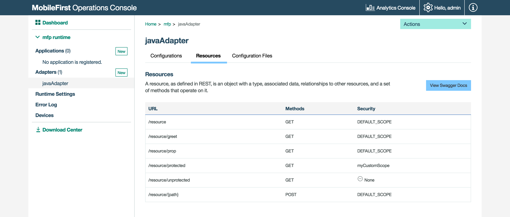

<!-- NLS_CHARSET=UTF-8 -->
## Visão Geral
{: #overview }
O {{ site.data.keys.mf_console_full }} é uma UI baseada na web que possibilita fluxos de trabalho simplificados para o desenvolvedor e o administrador para criar, monitorar, proteger e administrar aplicativos e adaptadores.

#### Como um desenvolvedor
{: #as-a-developer }
* Desenvolva aplicativos para qualquer ambiente e registre-os no {{ site.data.keys.mf_server }}.
* Veja todos os seus aplicativos e adaptadores implementados em uma visão rápida. Consulte o Painel.
* Gerencie e configure aplicativos registrados, incluindo Atualização Direta, desativação remota e parâmetros de segurança para autenticidade do aplicativo e autenticação do usuário.
* Configure notificação push implementando certificados, criando tags de notificação e enviando notificação.
* Crie e implemente adaptadores.
* Faça download de amostras.

#### Como um administrador de TI
{: #as-an-it-administrator }
* Monitore diversos serviços.
* Procure dispositivos que acessem o {{ site.data.keys.mf_server }} e gerencie seus direitos de acesso.
* Atualize as configurações do adaptador dinamicamente.
* Ajuste as configurações do criador de logs do cliente por meio de perfis de log.
* Controle como as licenças do produto são usadas.

#### Ir para:
{: #jump-to }
* [Acessando o Console](#accessing-the-console)
* [Navegando no Console](#navigating-the-console)

## Acessando o console
{: #accessing-the-console }
O {{ site.data.keys.mf_console }} pode ser acessado das maneiras a seguir:

### De um {{ site.data.keys.mf_server }} instalado localmente
{: #from-a-locally-installed-mobilefirst-server }
#### Navegador da área de trabalho
{: #desktop-browser }
Em seu navegador de opção, carregue a URL [http://localhost:9080/mfpconsole](http://localhost:9080/mfpconsole). O nome do usuário/senha são *admin/admin*.

#### Linha de Comandos
{: #command-line }
A partir de uma janela de **Linha de comandos**, com o {{ site.data.keys.mf_cli }} instalado, execute o comando: `mfpdev server console`.

### A partir de um {{ site.data.keys.mf_server }} instalado remotamente
{: #from-a-remotely-installed-mobilefirst-server }
#### Navegador da área de trabalho
{: #desktop-browser-remote }
No seu navegador de opção, carregue a URL `http://the-server-host:server-port-number/mfpconsole`.  
O servidor host pode ser um servidor de propriedade do cliente ou o serviço IBM Cloud, IBM [Mobile Foundation](../../../bluemix/).

#### Linha de Comandos
{: #command-line-remote }
Em uma janela de **Linha de comandos**, com o {{ site.data.keys.mf_cli }} instalado,

1. Inclua uma definição do servidor remoto:

    *Modo Interativo*  
    Execute o comando: `mfpdev server add` e siga as instruções na tela.

    *Modo Direto*  
    Execute o comando com a estrutura a seguir: `mfpdev server add [server-name] --URL [remote-server-URL] --login [admin-username] --password [admin-password] --contextroot [admin-service-name]`. Por
exemplo:

   ```bash
   mfpdev server add MyRemoteServer http://my-remote-host:9080/ --login TheAdmin --password ThePassword --contextroot mfpadmin
   ```

2. Execute o comando: `mfpdev server console MyRemoteServer`.

> Saiba mais sobre os vários comandos da CLI no tutorial [Usando a CLI para gerenciar artefatos do {{ site.data.keys.product_adj }}](../../../application-development/using-mobilefirst-cli-to-manage-mobilefirst-artifacts/).

## Navegando no console
{: #navigating-the-console }
### Dashboard
{: #dashboard }
O Painel fornece uma visualização rápida dos projetos implementados.


#### Lista suspensa Ações
{: #actions-dropdown }
A lista suspensa fornece acesso rápido a várias ações do console.


### Configurações de tempo de execução
{: #runtime-settings }
Edite as propriedades de tempo de execução, as variáveis de segurança global, o keystore do servidor e os clientes confidenciais.


### log de erro
{: #error-log }
O log de erro mostra uma lista das operações de gerenciamento com falha que foram iniciadas a partir do {{ site.data.keys.mf_console }} ou da linha de comandos no ambiente de tempo de execução atual. Use o log para ver o efeito da falha nos servidores.

> Para obter mais informações, consulte o tópico sobre log de erro de operações em ambientes de tempo de execução na documentação do usuário.


### Dispositivos
{: #devices }
Os administradores podem procurar dispositivos que acessem o {{ site.data.keys.mf_server }} e podem gerenciar direitos de acesso.  
Os dispositivos podem ser procurados usando qualquer ID do usuário ou usando um nome fácil. O ID do usuário é o identificador que foi usado para efetuar login.  
Um nome fácil é um nome que é associado com o dispositivo para distingui-lo de outros dispositivos que compartilham o ID do usuário.

> Para obter mais informações, consulte o tópico sobre gerenciamento de acesso ao dispositivo na documentação do usuário.


### Aplicações
{: #applications }
#### Registrando Aplicativos
{: #registering-applications }
Forneça valores de aplicativo básicos e faça download do código de início.


#### Gerenciando aplicativos
{: #managing-applications }
Gerencie e configure aplicativos registrados usando [Atualização Direta](../../../application-development/direct-update/), Desativação remota, [Autenticação do aplicativo](../../../authentication-and-security/application-authenticity/) e [configurando parâmetros de segurança](../../../authentication-and-security/).


#### Autenticação e Segurança
{: #authentication-and-security }
Configure parâmetros de segurança de aplicativo, como o valor de expiração do token padrão, mapeie elementos do escopo para verificações de segurança, defina os escopos de aplicativos obrigatórios e configure opções de verificação de segurança.

> [Saiba mais](../../../authentication-and-security/) sobre a estrutura de segurança do {{ site.data.keys.product_adj }}.


#### Configurações de Aplicativo
{: #application-settings }
Configure o nome de exibição do aplicativo no console, assim como o tipo de aplicativo e o licenciamento.


#### Notificações
{: #notifications }
Configure [notificações push](../../../notifications/) e parâmetros relacionados, como certificados e detalhes do GCM, defina tags e envie notificações para os dispositivos.


### Adaptadores
{: #adapters }
#### Criando adaptadores
{: #creating-adapters }
[Registre um adaptador](../../../adapters/), faça download do código de início e atualize um adaptador rapidamente, atualizando suas propriedades sem precisar reconstruir e reimplementar o artefato do adaptador.


#### Propriedades do adaptador
{: #adapter-properties }
Após a implementação de um adaptador, ele pode ser configurado no console.



### Logs do cliente
{: #client-logs }
Os administradores podem usar perfis de log para ajustar configurações do criador de logs do cliente, como filtros de nível de log e de pacote de log, para qualquer combinação de sistema operacional, versão do sistema operacional, aplicativo, versão do aplicativo e modelo de dispositivo.

Quando um administrador cria um perfil de configuração, a configuração de log é concatenada com chamadas de API de respostas, como `WLResourceRequest`, e é aplicada automaticamente.

> Para obter mais informações, consulte o tópico sobre configuração de captura de log do lado do cliente na documentação do usuário.


### Rastreamento de licença
{: #license-tracking }
Acessível a partir dos botões de Configurações na parte superior.

Os termos de licença variam conforme a edição (Enterprise ou Consumer) do {{ site.data.keys.product }} que está sendo usada.   O rastreamento de licença está ativado por padrão e controla métricas relevantes para a política de licenciamento, como dispositivos do cliente ativos e aplicativos instalados. Essas informações ajudam a determinar se o uso atual do {{ site.data.keys.product }} está dentro dos níveis de titularidade de licença e podem evitar potenciais violações de licença.

Ao rastrear o uso de dispositivos do cliente e determinar se os dispositivos estão ativos, os administradores podem desativar dispositivos que não deveriam mais estar acessando o serviço. Essa situação pode surgir se um funcionário deixou a empresa, por exemplo.

> Para obter mais informações, consulte o tópico sobre o rastreamento de licença na documentação do usuário.


### Downloads
{: #downloads }
Para situações em que a conectividade com a Internet não está disponível, é possível fazer download de uma captura instantânea dos vários artefatos de desenvolvimento do {{ site.data.keys.product }} a partir do Download Center no {{ site.data.keys.mf_console }}.


