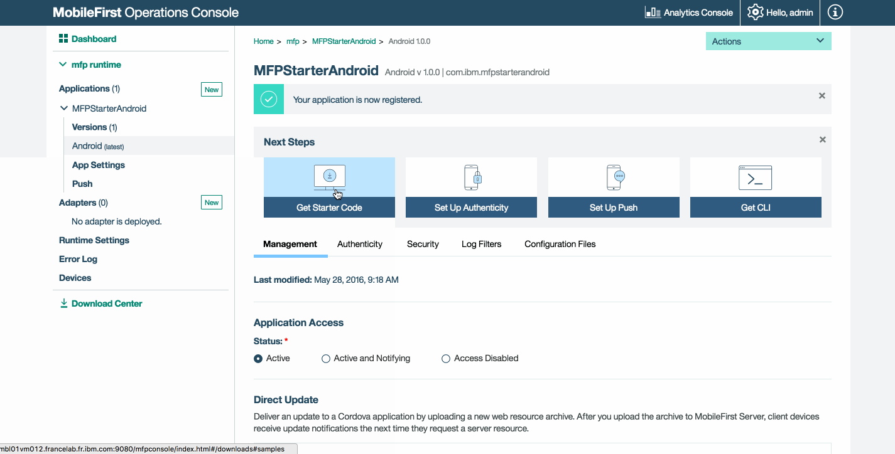
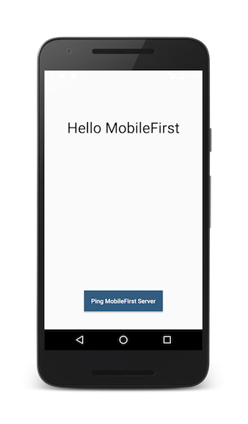

<!-- NLS_CHARSET=UTF-8 -->
## Visão Geral
{: #overview }
O propósito desta demonstração é experimentar um fluxo de ponta a ponta:

1. Um aplicativo de amostra que é pré-empacotado com o SDK do cliente {{ site.data.keys.product_adj }} é registrado e transferido por download a partir do {{ site.data.keys.mf_console }}.
2. Um adaptador novo ou fornecido é implementado no {{ site.data.keys.mf_console }}.  
3. A lógica de aplicativo é alterada para fazer uma solicitação de recurso.

**Resultado final**:

* Ping de {{ site.data.keys.mf_server }} executado com sucesso.
* Recuperação de dados usando adaptador realizada com sucesso.

#### Pré-requisitos:
{: #prerequisites }
* Android Studio
* *Opcional*. {{ site.data.keys.mf_cli }} ([download]({{site.baseurl}}/downloads))
* *Opcional*. Independente {{ site.data.keys.mf_server }} ([download]({{site.baseurl}}/downloads))

### 1. Iniciando o {{ site.data.keys.mf_server }}
{: #1-starting-the-mobilefirst-server }
Certifique-se de ter [criado uma instância do Mobile Foundation](../../bluemix/using-mobile-foundation) ou  
Se estiver usando [{{ site.data.keys.mf_dev_kit }}](../../installation-configuration/development/mobilefirst), navegue para a pasta do servidor e execute o comando: `./run.sh` em Mac e Linux ou `run.cmd` no Windows.

### 2. Criando um aplicativo
{: #2-creating-an-application }
Em uma janela do navegador, abra {{ site.data.keys.mf_console }} carregando a URL: `http://your-server-host:server-port/mfpconsole`. Se estiver executando localmente, use: [http://localhost:9080/mfpconsole](http://localhost:9080/mfpconsole). O nome de usuário/senha são *admin/admin*.

1. Clique no botão **Novo** próximo de **Aplicativos**
    * Selecione a plataforma **Android**
    * Insira **com.ibm.mfpstarterandroid** como o **identificador do aplicativo**
    * Insira **1.0** como o valor da **versão**
    * Clique em **Registrar aplicativo**

    

2. Clique no quadro **Obter Código de Início** e selecione para fazer download do aplicativo de amostra Android.

    

### 3. Editando a lógica de aplicativo
{: #3-editing-application-logic }
1. Abra o projeto Android Studio e importe-o.

2. No menu da barra lateral **Projeto**, selecione o arquivo **app → java → com.ibm.mfpstarterandroid → ServerConnectActivity.java** e:

* Inclua as importações a seguir:

  ```java
  import java.net.URI;
  import java.net.URISyntaxException;
  import android.util.Log;
  ```

* Cole o fragmento de código a seguir, substituindo a chamada para `WLAuthorizationManager.getInstance().obtainAccessToken`:

  ```java
  WLAuthorizationManager.getInstance().obtainAccessToken("", new WLAccessTokenListener() {
                @Override
                public void onSuccess(AccessToken token) {
                    System.out.println("Received the following access token value: " + token);
                    runOnUiThread(new Runnable() {
                        @Override
                        public void run() {
                            titleLabel.setText("Yay!");
                            connectionStatusLabel.setText("Connected to {{ site.data.keys.mf_server }}");
                        }
                    });

                    URI adapterPath = null;
                    try {
                        adapterPath = new URI("/adapters/javaAdapter/resource/greet");
                    } catch (URISyntaxException e) {
                        e.printStackTrace();
                    }

                    WLResourceRequest request = new WLResourceRequest(adapterPath, WLResourceRequest.GET);

                    request.setQueryParameter("name","world");
                    request.send(new WLResponseListener() {
                        @Override
                        public void onSuccess(WLResponse wlResponse) {
                            // Imprimirá "Hello world" em LogCat.
                            Log.i("MobileFirst Quick Start", "Success: " + wlResponse.getResponseText());
                        }

                        @Override
                        public void onFailure(WLFailResponse wlFailResponse) {
                            Log.i("MobileFirst Quick Start", "Failure: " + wlFailResponse.getErrorMsg());
                        }
                    });
                }

                @Override
                public void onFailure(WLFailResponse wlFailResponse) {
                    System.out.println("Did not receive an access token from server: " + wlFailResponse.getErrorMsg());
                    runOnUiThread(new Runnable() {
                        @Override
                        public void run() {
                            titleLabel.setText("Bummer...");
                            connectionStatusLabel.setText("Failed to connect to {{ site.data.keys.mf_server }}");
                        }
                    });
                }
            });
  ```

### 4. Implemente um adaptador
{: #4-deploy-an-adapter }
Faça o download [deste artefato .adapter preparado](../javaAdapter.adapter) e implemente-o a partir do {{ site.data.keys.mf_console }} usando a ação **Ações → Implementar Adaptador**.

Como alternativa, clique no botão **Novo** próximo de **Adaptadores**.  

1. Selecione a opção **Ações → Download de Amostra**. Faça o download da amostra do adaptador **Java** "Hello World".

   > Se o Maven e o {{ site.data.keys.mf_cli }} não estiverem instalados, siga as instruções **Configure seu ambiente de desenvolvimento** na tela.

2. Em uma janela de **Linha de Comandos**, navegue para a pasta raiz do projeto Maven do adaptador e execute o comando:

   ```bash
   mfpdev adapter build
   ```

3. Quando a compilação for concluída, implemente-a a partir do {{ site.data.keys.mf_console }} usando a ação **Ações → Implementar Adaptador**. O adaptador pode ser localizado na pasta **[adapter]/target**.

       


### 5. Testando o aplicativo
{: #5-testing-the-application }

1. No Android Studio, no menu da barra lateral **Projeto**, selecione o arquivo **app → src → main →assets → mfpclient.properties** e edite as propriedades **protocol**, **host** e **port** com os valores corretos para seu {{ site.data.keys.mf_server }}.
    * Se estiver usando um {{ site.data.keys.mf_server }} local, os valores normalmente serão **http**, **localhost** e **9080**.
    * Se você estiver usando um {{ site.data.keys.mf_server }} remoto (no IBM Cloud), normalmente os valores serão **https**, **your-server-address** e **443**.
    * Se você estiver usando um cluster do Kubernetes no IBM Cloud Private, e se a implementação for do tipo **NodePort**, normalmente o valor da porta será **NodePort**, exposto pelo serviço no cluster do Kubernetes.

    Como alternativa, se você tiver instalado {{ site.data.keys.mf_cli }}, navegue para a pasta raiz do projeto e execute o comando
`mfpdev app register`. Se um {{ site.data.keys.mf_server }} remoto for usado, [execute o comando `mfpdev server add`](../../application-development/using-mobilefirst-cli-to-manage-mobilefirst-artifacts/#add-a-new-server-instance) para incluir o servidor, seguido por, por exemplo: `mfpdev app register myIBMCloudServer`.

2. Clique no botão **Executar Aplicativo**.  

<br clear="all"/>
### Resultados
{: #results }
* Um clique no botão **Ping {{ site.data.keys.mf_server }}** exibirá **Conectado ao
{{ site.data.keys.mf_server }}**.
* Se o aplicativo foi capaz de se conectar ao {{ site.data.keys.mf_server }}, uma chamada de solicitação de recurso usando o adaptador Java implementado acontecerá.

A resposta do adaptador será impressa na visualização LogCat do Android Studio.


## Etapas Seguintes
{: #next-steps }
Saiba mais sobre como usar adaptadores em aplicativos e como integrar serviços adicionais, como Notificações Push, usando a estrutura de segurança do {{ site.data.keys.product_adj }} e mais:

- Revise os tutoriais [Desenvolvendo Aplicativos](../../application-development/)
- Revise os tutoriais [Desenvolvimento de Adaptadores](../../adapters/)
- Revise os tutoriais [Autenticação e Segurança](../../authentication-and-security/)
- Revise os tutoriais [Notificações](../../notifications/)
- Revise [Todos os Tutoriais](../../all-tutorials)
