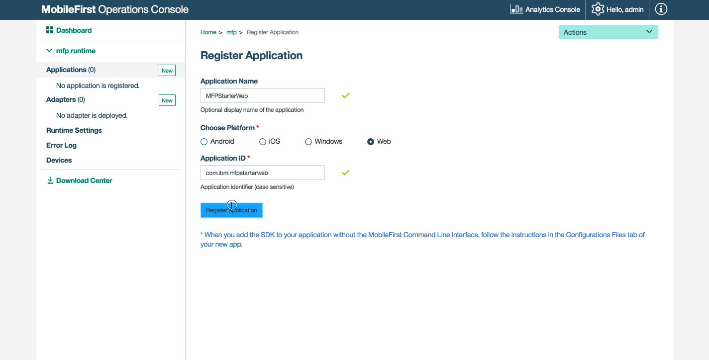
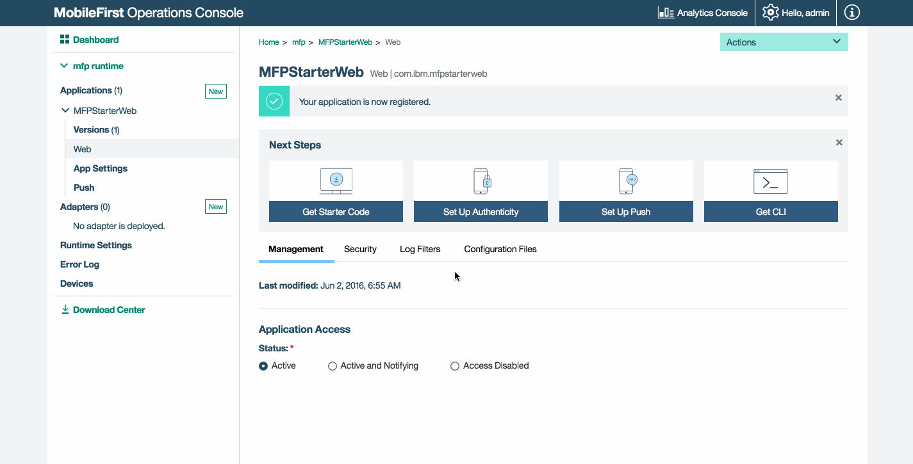

<!-- NLS_CHARSET=UTF-8 -->
## Visão Geral 
{: #overview }
O propósito desta demonstração é experimentar um fluxo de ponta a ponta:

1. Um aplicativo de amostra que é pré-empacotado com o SDK do cliente {{ site.data.keys.product_adj }} é registrado e transferido
por download a partir do {{ site.data.keys.mf_console }}.
2. Um adaptador novo ou fornecido é implementado no {{ site.data.keys.mf_console }}.  
3. A lógica de aplicativo é alterada para fazer uma solicitação de recurso.

**Resultado final**:

* Ping de {{ site.data.keys.mf_server }} executado com sucesso.
* Recuperação de dados usando adaptador realizada com sucesso.

#### Pré-requisitos:
{: #prerequisites }
* Um navegador da web moderno
* *Opcional*. {{ site.data.keys.mf_cli }} ([download]({{site.baseurl}}/downloads))
* *Opcional*. Independente {{ site.data.keys.mf_server }} ([download]({{site.baseurl}}/downloads))

### 1. Iniciando o {{ site.data.keys.mf_server }}
{: #starting-the-mobilefirst-server }
Certifique-se de ter [criado uma instância do Mobile Foundation](../../bluemix/using-mobile-foundation) ou  
Se estiver usando [{{ site.data.keys.mf_dev_kit }}](../../installation-configuration/development/mobilefirst), navegue
para a pasta do servidor e execute o comando: `./run.sh` em Mac e Linux ou `run.cmd` no Windows.

### 2. Criando e registrando um aplicativo
{: #creating-and-registering-an-application }
Em uma janela do navegador, abra {{ site.data.keys.mf_console }} carregando a URL:
`http://your-server-host:server-port/mfpconsole`. Se estiver executando localmente, use:
[http://localhost:9080/mfpconsole](http://localhost:9080/mfpconsole). O nome de usuário/senha são *admin/admin*.
 
1. Clique no botão **Novo** próximo de **Aplicativos**
    * Selecione a plataforma da **Web**
    * Insira **com.ibm.mfpstarterweb** como o **identificador do aplicativo**
    * Clique em **Registrar aplicativo**

    
 
2. Clique no quadro **Obter Código de Início** e selecione para fazer download do aplicativo de amostra da web.

    
 
### 3. Editando a lógica de aplicativo
{: #editing-application-logic }
1. Abra o projeto no editor de código de sua escolha.

2. Selecione o arquivo **client/js/index.js** e cole o fragmento de código a seguir, substituindo a função
`WLAuthorizationManager.obtainAccessToken()` existente:

   ```javascript
WLAuthorizationManager.obtainAccessToken()
        .then(
        function(accessToken) {
                titleText.innerHTML = "Yay!";
            statusText.innerHTML = "Connected to {{ site.data.keys.mf_server }}";
                
                var resourceRequest = new WLResourceRequest(
                "/adapters/javaAdapter/resource/greet/",
                WLResourceRequest.GET
            );
                
                resourceRequest.setQueryParameter("name", "world");
            resourceRequest.send().then(
                function(response) {
                        // Exibirá "Hello world" em um diálogo de alerta.
                        alert("Success: " + response.responseText);
                },
                function(response) {
                        alert("Failure: " + JSON.stringify(response));
                }
                );
            },

            function(error) {
                titleText.innerHTML = "Bummer...";
            statusText.innerHTML = "Failed to connect to {{ site.data.keys.mf_server }}";
        }
        );
   ```
    
### 4. Implemente um adaptador
{: #deploy-an-adapter }
Faça o download [deste artefato .adapter preparado](../javaAdapter.adapter) e implemente-o a partir do
{{ site.data.keys.mf_console }} usando a ação **Ações → Implementar Adaptador**.

Como alternativa, clique no botão **Novo** próximo de **Adaptadores**.  
        
1. Selecione a opção **Ações → Download de Amostra**. Faça o download da amostra do adaptador **Java** "Hello World".

   > Se o Maven e o {{ site.data.keys.mf_cli }} não estiverem instalados, siga as instruções **Configure seu ambiente de
desenvolvimento** na tela.

2. Em uma janela de **Linha de Comandos**, navegue para a pasta raiz do projeto Maven do adaptador e execute o comando:

   ```bash
   mfpdev adapter build
   ```

3. Quando a compilação for concluída, implemente-a a partir do {{ site.data.keys.mf_console }} usando a ação **Ações →
Implementar Adaptador**. O adaptador pode ser localizado na pasta **[adapter]/target**.
    
       


### 5. Testando o aplicativo
{: #testing-the-application }
1. Em uma janela de **Linha de Comandos**, navegue para a pasta **[project root] → node-server**.
2. Execute o comando: `npm start` para instalar a configuração do Node.js necessária e inicie o servidor Node.js.
3. Abra o arquivo **[project root] → node-server → server.js** e edite as variáveis **host** e
**port** com os valores corretos para seu {{ site.data.keys.mf_server }}.
    * Se estiver usando um {{ site.data.keys.mf_server }} local, os valores normalmente serão **http**,
**localhost** e **9080**.
    * Se estiver usando um {{ site.data.keys.mf_server }} remoto (no Bluemix), os valores normalmente serão
**https**, **your-server-address** e **443**. 

   Por
exemplo:  
    
   ```javascript
   var host = 'https://mobilefoundation-xxxx.mybluemix.net'; // O endereço do servidor Mobile Foundation
   var port = 9081; // O número da porta local a ser usado
   var mfpURL = host + ':443'; // O número da porta do servidor Mobile Foundation
   ```
   
4. Em seu navegador, visite a URL: [http://localhost:9081/home](http://localhost:9081/home).

<br>
#### Política de Origens Seguras
{: #secure-origins-policy }
Ao usar o Chrome durante o desenvolvimento, o navegador pode não permitir que um aplicativo seja carregado se estiver usando HTTP e um host
que **não seja** o "host local". Isso se deve à Politica de Origens Seguras implementada e usada por padrão neste navegador.

Para superar isso, é possível iniciar o navegador Chrome com a sinalização a seguir:

```bash
--unsafely-treat-insecure-origin-as-secure="http://replace-with-ip-address-or-host:port-number" --user-data-dir=/test-to-new-user-profile/myprofile
```

- Substitua "test-to-new-user-profile/myprofile" pelo local de uma pasta que agirá como um novo perfil do usuário do Chrome para a
sinalização funcionar.

<br clear="all"/>
### Resultados
{: #results }
* Um clique no botão **Ping {{ site.data.keys.mf_server }}** exibirá **Conectado ao
{{ site.data.keys.mf_server }}**.
* Se o aplicativo foi capaz de se conectar ao {{ site.data.keys.mf_server }}, uma chamada de solicitação de recurso usando o
adaptador Java implementado acontecerá.

A resposta do adaptador é então exibida em um alerta.

## Etapas Seguintes
{: #next-steps }
Saiba mais sobre como usar adaptadores em aplicativos e como integrar serviços adicionais, como Notificações Push, usando a estrutura de
segurança do {{ site.data.keys.product_adj }} e mais:

- Revise os tutoriais [Desenvolvimento de Aplicativo](../../application-development/)
- Revise os tutoriais [Desenvolvimento de Adaptadores](../../adapters/)
- Revise os tutoriais [Autenticação e Segurança](../../authentication-and-security/)
- Revise [Todos os Tutoriais](../../all-tutorials)
