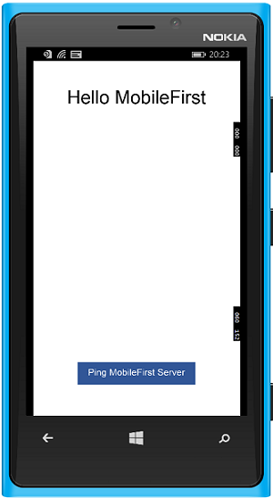
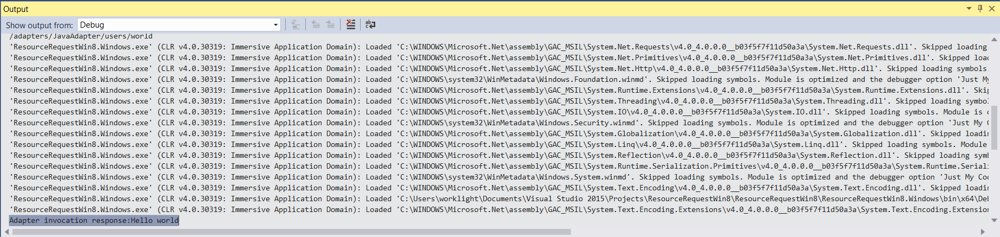

<!-- NLS_CHARSET=UTF-8 -->
## Visão Geral
{: #overview }
O propósito desta demonstração é experimentar um fluxo de ponta a ponta:

1. Um aplicativo de amostra que é pré-empacotado com o SDK do cliente {{ site.data.keys.product_adj }} é registrado e transferido
por download a partir do {{ site.data.keys.mf_console }}.
2. Um adaptador novo ou fornecido é implementado no {{ site.data.keys.mf_console }}.  
3. A lógica de aplicativo é alterada para fazer uma solicitação de recurso.

**Resultado final**:

* Ping de {{ site.data.keys.mf_server }} executado com sucesso.
* Recuperação de dados usando adaptador realizada com sucesso.

#### Pré-requisitos:
{: #prerequisites }
* Visual Studio 2013/5 configurado
* *Opcional*. {{ site.data.keys.mf_cli }} ([download]({{site.baseurl}}/downloads))
* *Opcional*. Independente {{ site.data.keys.mf_server }} ([download]({{site.baseurl}}/downloads))

### 1. Iniciando o {{ site.data.keys.mf_server }}
{: #1-starting-the-mobilefirst-server }
Certifique-se de ter [criado uma instância do Mobile Foundation](../../bluemix/using-mobile-foundation) ou  
Se estiver usando o [{{ site.data.keys.mf_dev_kit }}](../../installation-configuration/development/mobilefirst), navegue
para a pasta do servidor e execute o comando: `./run.cmd`.

### 2. Criando um aplicativo
{: #2-creating-an-application }
Em uma janela do navegador, abra {{ site.data.keys.mf_console }} carregando a URL:
`http://your-server-host:server-port/mfpconsole`. Se estiver executando localmente, use:
[http://localhost:9080/mfpconsole](http://localhost:9080/mfpconsole). O nome de usuário/senha são *admin/admin*.

1. Clique no botão **Novo** próximo de **Aplicativos**
    * Selecione uma plataforma **Windows**
    * Insira **MFPStarterCSharp.Windows** como o **identificador do aplicativo** para Windows ou
**MFPStarterCSharp.WindowsPhone** para Windows Phone
    * Insira **1.0.0** como o valor da **versão**
    * Clique em **Registrar aplicativo**

    

2. Clique no quadro **Obter Código de Início** e selecione para fazer download do aplicativo de amostra Windows 8.1 ou
Windows 10.

    

### 3. Editando a lógica de aplicativo
{: #3-editing-application-logic }
1. Abra o projeto Visual Studio.

2. Selecione o arquivo **MainPage.xaml.cs** da solução e cole o fragmento de código a seguir no método GetAccessToken():

   ```csharp
   try
                   {
          IWorklightClient _newClient = WorklightClient.CreateInstance();
          accessToken = await _newClient.AuthorizationManager.ObtainAccessToken("");
          if (accessToken.IsValidToken &&  accessToken.Value != null &&  accessToken.Value != "")
          {
              System.Diagnostics.Debug.WriteLine("Received the following access token value: " + accessToken.Value);
              titleTextBlock.Text = "Yay!";
              statusTextBlock.Text = "Connected to {{ site.data.keys.mf_server }}";

              Uri adapterPath = new Uri("/adapters/javaAdapter/resource/greet",UriKind.Relative);
              WorklightResourceRequest request = _newClient.ResourceRequest(adapterPath, "GET","");
              request.SetQueryParameter("name", "world");
              WorklightResponse response = await request.Send();

              System.Diagnostics.Debug.WriteLine("Success: " + response.ResponseText);

            }
        }
        catch (Exception e)
        {
            titleTextBlock.Text = "Uh-oh";
            statusTextBlock.Text = "Client failed to connect to {{ site.data.keys.mf_server }}";
            System.Diagnostics.Debug.WriteLine("An error occurred: '{0}'", e);
        }
   ```


### 4. Implemente um adaptador
{: 4-deploy-an-adapter }
Faça o download [deste artefato .adapter preparado](../javaAdapter.adapter) e implemente-o a partir do
{{ site.data.keys.mf_console }} usando a ação **Ações → Implementar Adaptador**.

<!-- Alternatively, click the **New** button next to **Adapters**.  

1. Select the **Actions → Download sample** option. Download the "Hello World" **Java** adapter sample.

    > If Maven and {{ site.data.keys.mf_cli }} are not installed, follow the on-screen **Set up your development environment** instructions.

2. From a **Command-line** window, navigate to the adapter's Maven project root folder and run the command:

    ```bash
    mfpdev adapter build
    ```

3. When the build finishes, deploy it from the {{ site.data.keys.mf_console }} using the **Actions → Deploy adapter** action. The adapter can be found in the **[adapter]/target** folder.

        -->


### 5. Testando o aplicativo
{: 5-testing-the-application }
1. No Visual Studio, selecione o arquivo **mfpclient.resw** e edite as propriedades **protocol**,
**host** e **port** com os valores corretos para seu {{ site.data.keys.mf_server }}.
    * Se estiver usando um {{ site.data.keys.mf_server }} local, os valores normalmente serão **http**,
**localhost** e **9080**.
    * Se você estiver usando um {{ site.data.keys.mf_server }} remoto (no IBM Cloud), normalmente os valores serão **https**, **your-server-address** e **443**.
    * Se você estiver usando um cluster do Kubernetes no IBM Cloud Private, e se a implementação for do tipo **NodePort**, normalmente o valor da porta será **NodePort**, exposto pelo serviço no cluster do Kubernetes.

    Como alternativa, se você tiver instalado {{ site.data.keys.mf_cli }}, navegue para a pasta raiz do projeto e execute o comando
`mfpdev app register`. Se um {{ site.data.keys.mf_server }} remoto for usado, [execute o comando `mfpdev server add`](../../application-development/using-mobilefirst-cli-to-manage-mobilefirst-artifacts/#add-a-new-server-instance) para incluir o servidor, seguido por, por exemplo: `mfpdev app register myIBMCloudServer`.
    
2. Pressione o botão **Executar Aplicativo**.

### Resultados
{: #results }
* Um clique no botão **Ping {{ site.data.keys.mf_server }}** exibirá **Conectado ao
{{ site.data.keys.mf_server }}**.
* Se o aplicativo foi capaz de se conectar ao {{ site.data.keys.mf_server }}, uma chamada de solicitação de recurso usando o
adaptador Java implementado acontecerá.

A resposta do adaptador é então impressa no console de saída do Visual Studio.



## Etapas Seguintes
{: #next-steps }
Saiba mais sobre como usar adaptadores em aplicativos e como integrar serviços adicionais, como Notificações Push, usando a estrutura de
segurança do {{ site.data.keys.product_adj }} e mais:

- Revise os tutoriais [Desenvolvimento de Aplicativo](../../application-development/)
- Revise os tutoriais [Desenvolvimento de Adaptadores](../../adapters/)
- Revise os tutoriais [Autenticação e Segurança](../../authentication-and-security/)
- Revise os tutoriais [Notificações](../../notifications/)
- Revise [Todos os Tutoriais](../../all-tutorials)
