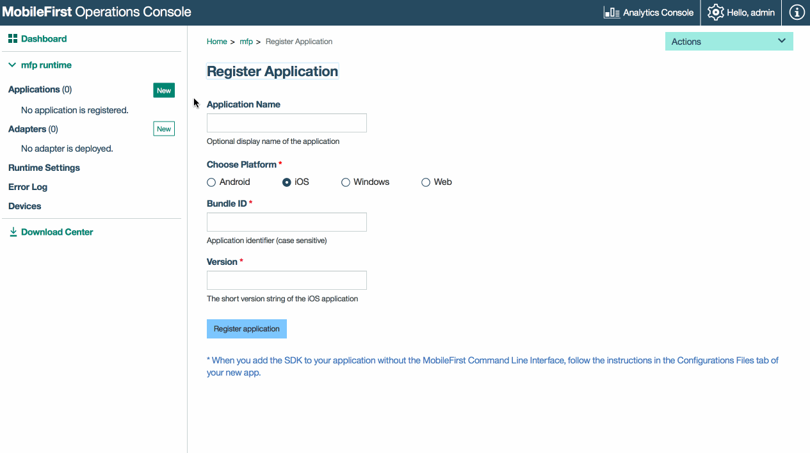

<!-- NLS_CHARSET=UTF-8 -->
## Visão Geral (Overview)
{: #overview }
O propósito desta demonstração é experimentar um fluxo de ponta a ponta:

1. Um aplicativo de amostra que é empacotado com o SDK do cliente {{site.data.keys.product_adj }} Xamarin é registrado com o
{{site.data.keys.mf_console }}.
2. Um adaptador novo ou fornecido é implementado no {{site.data.keys.mf_console }}.  
3. A lógica de aplicativo é alterada para fazer uma solicitação de recurso.

**Resultado final**:

* Ping de {{site.data.keys.mf_server }} executado com sucesso.

#### Pré-requisitos:
{: #prerequisites }
* Xamarin Studio
* *Opcional*. Independente {{site.data.keys.mf_server }} ([download]({{site.baseurl}}/downloads))

### 1. Iniciando o {{site.data.keys.mf_server }}
{: #1-starting-the-mobilefirst-server }
Certifique-se de ter [criado uma instância do Mobile Foundation](../../bluemix/using-mobile-foundation) ou  
Se estiver usando [{{site.data.keys.mf_dev_kit }}](../../installation-configuration/development/), navegue
para a pasta do servidor e execute o comando: `./run.sh` em Mac e Linux ou `run.cmd` no Windows.

### 2. Criando um aplicativo
{: #2-creating-an-application }
Em uma janela do navegador, abra {{site.data.keys.mf_console }} carregando a URL:
`http://your-server-host:server-port/mfpconsole`. Se estiver executando localmente, use:
[http://localhost:9080/mfpconsole](http://localhost:9080/mfpconsole). O nome de usuário/senha são *admin/admin*.

1. Clique no botão **Novo** próximo de **Aplicativos**
    * Selecione a plataforma **Android**
    * Insira **com.ibm.mfpstarterxamarin** como o **identificador do aplicativo** (dependendo da
andaime do aplicativo do qual você fará download na próxima etapa)
    * Insira **1.0** como o valor da **versão**
    * Clique em **Registrar aplicativo**

    

### 3. Editando a lógica de aplicativo
{: #3-editing-application-logic }
* Crie um projeto Xamarin.
* Inclua o Xamarin SDK conforme mencionado no tutorial [Incluindo o SDK](../../application-development/sdk/xamarin/).
* Inclua uma propriedade do tipo `IWorklightClient` em qualquer arquivo de classe, conforme abaixo.

   ```csharp
   /// <summary>
   /// Obtém ou configura o cliente de amostra worklight.
   /// </summary>
   /// <value>O cliente worklight.</value>
   public static IWorklightClient WorklightClient {get; set;}
   ```
* Se você estiver desenvolvendo para iOS, cole o código a seguir dentro do método **FinishedLaunching** do arquivo **AppDelegate.cs**:

  ```csharp
   {ClassName}.WorklightClient = WorklightClient.CreateInstance();
  ```
* Se você estiver desenvolvendo para Android, inclua a linha de código a seguir dentro do método **OnCreate** do arquivo
**MainActivity.cs**:

  ```csharp
   {ClassName}.WorklightClient = WorklightClient.CreateInstance(this);
  ```
* Defina um método para obter o token de acesso e execute uma solicitação de recurso para o MFP Server, conforme abaixo.
   
    ```csharp
    public async void ObtainToken()
           { 
            try
                   {
       
                       IWorklightClient _newClient = App.WorklightClient;
                       WorklightAccessToken accessToken = await _newClient.AuthorizationManager.ObtainAccessToken("");
       
                       if (accessToken.Value != null && accessToken.Value != "")
                       {
                           System.Diagnostics.Debug.WriteLine("Received the following access token value: " + accessToken.Value);
                           StringBuilder uriBuilder = new StringBuilder().Append("/adapters/javaAdapter/resource/greet");
       
                           WorklightResourceRequest request = _newClient.ResourceRequest(new Uri(uriBuilder.ToString(), UriKind.Relative), "GET");
                           request.SetQueryParameter("name", "world");
                           WorklightResponse response = await request.Send();
       
                           System.Diagnostics.Debug.WriteLine("Success: " + response.ResponseText);

            }
                   }
        catch (Exception e)
        {
                       System.Diagnostics.Debug.WriteLine("An error occurred: '{0}'", e);
                   }
               }
           }
    }
   ```
  
* Chame o método **ObtainToken** dentro de um construtor de classe ou clicando em um botão.

### 4. Implemente um adaptador
{: #4-deploy-an-adapter }
Faça o download [deste artefato .adapter preparado](../javaAdapter.adapter) e implemente-o a partir do
{{site.data.keys.mf_console }} usando a ação **Ações → Implementar Adaptador**.

Como alternativa, clique no botão **Novo** próximo de **Adaptadores**.  

1. Selecione a opção **Ações → Download de Amostra**. Faça o download da amostra do adaptador **Java** "Hello World".

   > Se o Maven e o {{site.data.keys.mf_cli }} não estiverem instalados, siga as instruções **Configure seu ambiente de
desenvolvimento** na tela.

2. Em uma janela de **Linha de Comandos**, navegue para a pasta raiz do projeto Maven do adaptador e execute o comando:

   ```bash
   mfpdev adapter build
   ```

3. Quando a compilação for concluída, implemente-a a partir do {{site.data.keys.mf_console }} usando a ação **Ações →
Implementar Adaptador**. O adaptador pode ser localizado na pasta **[adapter]/target**.

   

<!-- -->
### 5. Testando o aplicativo
{: #5-testing-the-application }
1. No Xamarin Studio, selecione o arquivo **mfpclient.plist** e edite as propriedades **protocol**,
**host** e **port** com os valores corretos para o {{site.data.keys.mf_server }}.
    * Se estiver usando um {{site.data.keys.mf_server }} local, os valores normalmente serão **http**,
**localhost** e **9080**.
    * Se estiver usando um {{site.data.keys.mf_server }} remoto (no Bluemix), os valores normalmente serão
**https**, **your-server-address** e **443**.

2. Pressione o botão **Reproduzir**.

<br clear="all"/>
### Resultados
{: #results }
* Um clique no botão **Ping do MobileFirst Server** exibirá **Conectado ao MobileFirst
Server**.
* Se o aplicativo foi capaz de se conectar ao {{site.data.keys.mf_server }}, uma chamada de solicitação de recurso usando o
adaptador Java implementado acontecerá.

A resposta do adaptador é então impressa no Xamarin Studio Console.

 com sucesso

## Etapas Seguintes
{: #next-steps }
Saiba mais sobre como usar adaptadores em aplicativos e como integrar serviços adicionais, como Notificações Push, usando a estrutura de
segurança do {{site.data.keys.product_adj }} e mais:

- Revise os tutoriais [Desenvolvimento de Adaptadores](../../adapters/)
- Revise os tutoriais [Autenticação e Segurança](../../authentication-and-security/)
- Revise [Todos os Tutoriais](../../all-tutorials)
