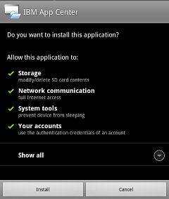
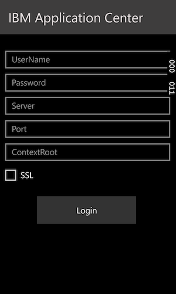
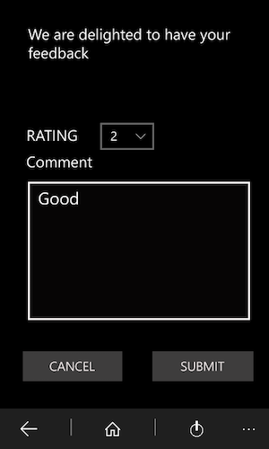
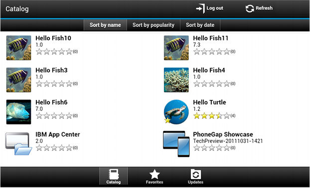

<!-- NLS_CHARSET=UTF-8 -->
## Overview
{: #overview }
You can install applications on your mobile device with the Application Center mobile client.

The Application Center mobile client is the application that runs on your Android, iOS, Windows Phone, or Windows device. Only Windows Phone 8 is supported by the current version of the Application Center. You use the mobile client to list the catalog of available applications in the Application Center. You can install these applications on your device. The mobile client is sometimes referred to as the Application Center installer. This application must be present on your device if you want to install on your device applications from your private application repository.

### Prerequisites
{: #prerequisites }
Your system administrator must give you a user name and password before you can download and install the mobile client. The user name and password are required whenever you start the mobile client on your device. For Windows Store applications, the user name and password are required for the mobile client only at run time. For security reasons, do not disseminate these credentials. These credentials are the same credentials used to log in to the Application Center console.

#### Jump to
{: #jump-to }
* [Installing the client on an Android mobile device](#installing-the-client-on-an-android-mobile-device)
* [Installing the client on an iOS mobile device](#installing-the-client-on-an-ios-mobile-device)
* [Installing the client on a Windows Phone 8 Universal mobile device](#installing-the-client-on-a-windows-phone-8-universal-mobile-device)
* [Installing Windows 10 UWP client on Windows 10 device](#installing-windows-10-uwp-client-on-windows-10-device)
* [Installing a Windows 10 UWP application and adding review comments](#installing-a-windows-10-uwp-application-and-adding-review-comments)
* [The Login view](#the-login-view)
* [Views in the Application Center client](#views-in-the-application-center-client)
* [Installing an application on an Android device](#installing-an-application-on-an-android-device)
* [Installing an application on an iOS device](#installing-an-application-on-an-ios-device)
* [Installing an application on a Windows Phone device](#installing-an-application-on-a-windows-phone-device)
* [Installing a Windows Store application on a Windows device](#installing-a-windows-store-application-on-a-windows-device)
* [Installing applications through public app stores](#installing-applications-through-public-app-stores)
* [Removing an installed application](#removing-an-installed-application)
* [Showing details of a specific application version](#showing-details-of-a-specific-application-version)
* [Updating an application](#updating-an-application)
* [Upgrading the Application Center client automatically](#upgrading-the-application-center-client-automatically)
* [Reverting an installed application](#reverting-an-installed-application)
* [Marking or unmarking a favorite app](#marking-or-unmarking-a-favorite-app)
* [Submitting a review for an installed application](#submitting-a-review-for-an-installed-application)
* [Viewing reviews](#viewing-reviews)

## Installing the client on an Android mobile device
{: #installing-the-client-on-an-android-mobile-device }
You can install the mobile client, or any signed application marked with the installer flag, on your Android mobile device by entering the access URL in your browser, entering your credentials, and completing the required steps.

1. Start the browser on your mobile device.
2. Enter the following access URL in the address text field: `http://hostname:portnumber/applicationcenter/installers.html`

    Where hostname is the address of the server and portnumber is the number of the port where the Application Center is installed. Your system administrator can provide this information.

    The Application Center also provides an alternative URL for installing the client on a mobile device: `http://hostname:portnumber/applicationcenter/inst.html`. The page of this URL works better with some older or some nonstandard mobile web browsers. If the page installers.html does not work on your mobile device, you can use inst.html. This page is provided in English only and is not translated into other languages.

    If you try to open the page with HTTPS and use self-signed certificates, older Android browsers cannot open the page. In this case, you must use a non self-signed certificate or use another browser on the Android device, such as Firefox, Chrome, or Opera. In Android 4 and later, the Android browser displays a security warning about the SSL certificate, but lets you proceed to the website after confirmation that you consent to an unsafe connection.

3. Enter your user name and password. When your user name and password are validated, the list of compatible installer applications for your device is displayed in the browser. Normally, only one application, the mobile client, appears in this list.

4. If the web server uses a self-signed CA certificate, install the certificate at least once on the device. The Application Center administrator should provide the certificate; see [Managing and installing self-signed CA certificates in an Application Center test environment](../../installation-configuration/production/appcenter/#managing-and-installing-self-signed-ca-certificates-in-an-application-center-test-environment) for details.
    * Tap the **SSL-Certificate** tab and select the certificate.
    * Tap **Install**. You must only perform this action once for the device. You can verify whether the certificate is installed by looking in **Settings → Security → Trusted Credentials → User on the device**. This view shows the SSL certificates that the user has installed on the device. If the self-signed CA certificate is not installed on the device, the Android operating system prevents you from downloading the mobile client in the following steps.

    Before you can see the mobile client in the list of available applications, the Application Center administrator must install the mobile client application. The administrator uploads the mobile client to the Application Center and sets the **Installer** property to **true**. See [Application properties](../appcenter-console/#application-properties).

    

5. Select an item in the list to display the application details. Typically, these details include the application name and its version number.

    

6. Tap **Install Now** to download the mobile client. On newer Android devices, a question might request permission for Chrome to access media files on the device. Select YES. A warning about potential harmful files might be displayed. Select the option to keep the APK file anyway.

7. Launch the **Android Download** applications. Select the Application Center client installer.
8. Select the Application Center client installer. You can see the access granted to the application when you choose to install it.

    

9. Select **Install** to install the mobile client.
10. When the application is installed, select **Open** to open the mobile client or **Done** to close the Downloads application.

The APK file might fail for one of the following reasons:

* The device does not have enough free memory.
* The SSL certificate of the server is not known to the device.

The first time that you install an app through the Downloads application, you might receive a request to confirm whether Google should regularly check the device activity for security problems. You can accept or decline according to your preference. The Application Center client is unaffected by your choice.

The installation might be blocked for one of the following reasons:

* The device does not permit installation from unknown sources. Go to **Settings → Security** on the device and enable **Unknown sources (Allow installation from unknown sources)**.
* The device has the same app already installed, but it was signed by a different certificate. In this case, you must remove the app before you install it on the device with another signed certificate.

## Installing the client on an iOS mobile device
{: #installing-the-client-on-an-ios-mobile-device }
You can install the mobile client, or any signed application marked with the installer flag, on your iOS mobile device by entering the access URL in your browser, entering your credentials, and completing the required steps.

> **Important:** To install applications on iOS devices, you must first configure the Application Center server with SSL. See [Configuring Secure Sockets Layer (SSL)](../../installation-configuration/production/appcenter/#configuring-secure-sockets-layer-ssl).

The **ibm.appcenter.ios.plist.onetimeurl** JNDI property of the IBM  Application Center Services controls whether One-Time URLs are used when the mobile client is installed on an iOS mobile device. Set this property to false for maximal security. When you set this property to false, users must enter their credentials several times when they install the mobile client: once when they select the client and once when they install the client.

When you set the property to true, users enter their credentials only once. A temporary download URL with a cryptographic hash is generated when the user enters the credentials. This temporary download URL is valid for 1 hour and does not require further authentication. This solution is a compromise between security and ergonomy.

The steps to specify the **ibm.appcenter.ios.plist.onetimeurl** JNDI property are similar to the steps for the **ibm.appcenter.proxy.host property**. See [Defining the endpoint of the application resources](../../installation-configuration/production/appcenter/#defining-the-endpoint-of-the-application-resources).

Installing the mobile client on an iOS device is similar to installing it on Android, but with some differences. The installer is automatically started directly after download. Your user name and password credentials are requested for almost all the installation steps.

1. Start the browser on your mobile device.
2. Enter the following access URL in the address field: `http://hostname:portnumber/applicationcenter/installers.html`

    Where hostname is the address of the server and portnumber is the number of the port where the Application Center is installed. Your system administrator can provide this information.

    The Application Center also provides an alternative URL for installing the client on a mobile device: `http://hostname:portnumber/applicationcenter/inst.html`. The page of this URL works better with some older or some nonstandard mobile web browsers. If the page **installers.html** does not work on your mobile device, you can use **inst.html**. The page is provided in English only and is not translated into other languages.

    If you open the page with HTTPS and use self-signed certificates, the browser displays a security warning about the SSL certificate, but you can proceed to the website after confirmation that you consent to an unsafe connection.

3. Enter your user name and password. See the [prerequisites in The mobile client](../preparations).

    When your user name and password are validated, the list of compatible installer applications for your device is displayed in the browser. Normally, only one application, the mobile client, appears in this list.

    If you open the page with https:
    * If the web server uses a real SSL certificate that is provided by a trusted certificate authority, proceed to step 5.
    * If the web server uses a self-signed CA certificate, proceed to step 4.

4. If the web server uses a self-signed CA certificate, install the certificate at least once on the device.

    The Application Center administrator provides the certificate. See [Managing and installing self-signed CA certificates in an Application Center test environment](../../installation-configuration/production/appcenter/#managing-and-installing-self-signed-ca-certificates-in-an-application-center-test-environment) for details.

    * Tap the SSL-Certificate tab and select the certificate.
    * Tap Install. You do this only once for the device. You can verify whether the certificate is installed by looking in **Settings → General → Profiles on the device**. This view shows the SSL certificates that the user installed on the device. If the self-signed CA certificate is not installed on the device, the iOS operating system prevents you from downloading the mobile client in the following steps.

    Before you can see the mobile client in the list of available applications, the Application Center administrator must install the mobile client application. The administrator uploads the mobile client to the Application Center and sets the Installer property to true. See [Application properties](../appcenter-console/#application-properties).

5. Tap the **Installers** tab and select an item in the list to display the application details.
6. Tap **Install** to download the mobile client.
7. Enter your credentials to authorize the downloader transaction.
8. To authorize the download, tap **Install**.

    

9. Enter your credentials to authorize the installation.
10. Close the browser.

    The app icon appears on the home screen and you can watch the download progress on the home screen.

> **Note:** Installing an application on a device requires a provisioning profile that enables the application to be installed on the selected device. If you accidentally try to install an application that is not valid for your device, some versions of iOS might try to install the application in an endless loop without ever succeeding or indicating any error. The application icon that shows the progress of the installation appears on the home screen, but, because of the endless loop, it is difficult to delete this application icon to stop the endless loop. A workaround is to put the device into Airplane mode. In this mode, the endless loop is stopped and you can delete the application icon by following the normal steps to delete apps on iOS devices.

The installation might be blocked for one of the following reasons:

* The provisioning profile of the application is not valid for the device. The application must be signed with a different provisioning profile.
* The device has no access to Apple servers to confirm the validity of the provisioning profile.
* The SSL certificate of the server is not known to the device.

In general, iOS applications can be installed on the device only if they are signed with a provisioning profile. See [Importing and building the project (Android, iOS, Windows Phone)](../preparations/#importing-and-building-the-project-android-ios-windows-phone).

Since iOS 9, when a company application is opened, depending on the type of the provisioning profile, an Untrusted Enterprise Developer message might display. This message explains that the provisioning profile is not yet trusted on this device. In this case, the application does not open, unless trust is established for this provisioning profile. Establishing trust must be done only once per provisioning profile.

To establish trust for a provisioning profile after the application is installed:

#### Until iOS 9.1
{: #until-ios-91 }
1. Go to **Settings → General → Profiles**. Under the **Enterprise apps** heading, you see the provisioning profile of the app.
2. Tap on the profile and confirm the trust.

#### Since iOS 9.2
{: #since-ios-92 }
1. Go to **Settings → General → Profiles → Device Management or Profiles &amp; Device Management**. Under the **Enterprise apps** heading, you see the provisioning profile of the app.
2. Tap on the profile and confirm the trust.

After the trust is confirmed, no application that uses that provisioning profile shows the Untrusted Enterprise Developer message. For more information, see the Apple web site at [https://support.apple.com/en-us/HT204460](https://support.apple.com/en-us/HT204460).

## Installing the client on a Windows Phone 8 Universal mobile device
{: #installing-the-client-on-a-windows-phone-8-universal-mobile-device }
You can install the mobile client, or any signed application marked with the installer flag, on Windows 8 Universal by entering the access URL in your browser, entering your credentials, and completing the required steps. The company account must be preinstalled on your mobile device.

Before you can install apps published by your company, you must add the company account to your mobile device. You must download an application enrollment token (AET) to your Windows Phone device. This AET must already be present on the {{ site.data.keys.mf_server }}. It is uploaded to the {{ site.data.keys.mf_server }} by using the Application Center console. See [Application enrollment tokens in Windows 8 Universal](../appcenter-console/#application-enrollment-tokens-in-windows-8-universal) for details.

1. Start the browser on your mobile device.
2. Enter the following access URL in the address text field: `http://hostname:portnumber/applicationcenter/installers.html`.

    Where **hostname** is the address of the server and **portnumber** is the number of the port where the Application Center is installed. Your system administrator can provide this information.

    The Application Center also provides an alternative URL for installing the client on a mobile device: `http://hostname:portnumber/applicationcenter/inst.html`. The page of this URL works better with some older or some nonstandard mobile web browsers. If the page **installers.html** does not work on your mobile device, you can use **inst.html**. This page is provided in English only and is not translated into other languages.

3. Enter your credentials to authorize access to the server. On the lower part of the screen, a toolbar contains an **Installers** tab and a **Tokens** tab.

    

4. Tap **Tokens** and select an application enrollment token in the list of available tokens to display the token details.

    

5. Tap **Add** to download the application enrollment token.
6. Tap **Add** to add the company account.

    

    Windows Phone 8 does not provide any feedback about adding the company account.

7. Tap the Back icon to return to the details of application enrollment tokens.
8. Tap **Installers** and select the mobile client application in the list of available applications. The application details are displayed.
9. Tap **Install** to download the selected application.

    

10. Tap **Install** to install the application.

    

    Windows 8 Universal does not provide any feedback about installing the application.

> **Tip:** When you install a company application on a device, the device must connect to the Microsoft server to verify the application signature. Sometimes, the Microsoft server does not respond. In this case, you can try the installation again a few minutes later. See Installing an application on a Windows Phone device for the possible error messages.

When the installation is finished, the mobile client application should be available in your applications list in Windows Phone.

## Installing Windows 10 UWP client on Windows 10 device
{: #installing-windows-10-uwp-client-on-windows-10-device }

You can install the mobile client, or any signed application marked with the installer flag, on Windows 10 by entering the access URL in your browser, entering your credentials, and completing the required steps.

1. Start the browser on your mobile device.

2. Enter the following access URL in the address text field: `http://hostname:portnumber/applicationcenter/installers.html?os=Windows`. Where `hostname` is the address of the server and `portnumber` is the number of the port where the Application Center is installed. Your system administrator can provide this information.

    The Application Center also provides an alternative URL for installing the client on a mobile device: `http://hostname:portnumber/applicationcenter/inst.html?os=Windows`. The page of this URL works better with some older or some nonstandard mobile web browsers. If the page *installers.html* does not work on your mobile device, you can use *inst.html*. This page is provided in English only and is not translated into other languages.

3.  Enter your credentials to authorize access to the server.

    

4.  Select an item in the list of available applications to display the application details.

    

5.  Tap **Install** to download and install the mobile client.

    

> **Note:** To list the Windows 10 UWP apps you need to pass the query string `os=Windows`

## Installing a Windows 10 UWP application and adding review comments
{:  #installing-a-windows-10-uwp-application-and-adding-review-comments}

1. Login to the Application Center.

    

2. Select the application to be installed from the list of available applications in the catalog.

    

3. Tap **Install** to download and install the application.

    

4. Review the application by providing a rating and adding the review comments.

    

## The Login view
{: #the-login-view }
In the Login view, you can access the fields that are required to connect to the server to view the list of applications available for your device.  
Use the Login view to enter your credentials to connect to the Application Center server to view the list of applications that are available for your device.

The Login view presents all the mandatory fields for the information that is required to connect to the server.  
When the application is started, the Login page is displayed. The login credentials are required to connect to the server.

On iOS devices, the credentials are saved in the keychain. After you successfully log in to the Application Center server, when you later start the application, the login page is not displayed and the previous credentials are used. If login fails, the login view is displayed.

#### User name and password
{: #user-name-and-password }
Enter your credentials for access to the server. They are the same user name and password as the ones that were granted by your system administrator for downloading and installing the mobile client.

#### Application Center server address
{: #application-center-server-address }
The Application Center server address is composed of the following elements:

* Host name or IP address.
* Port, which is optional if the default port is used.
* Context, which is optional if the Application Center is installed at the root of the server.

On a phone, a field is available for each part of the address.

On a tablet, a single field that contains a preformatted example address is displayed. Use it as a model for entering the correct server address to avoid formatting errors. See [Preparations for using the mobile client](../preparations) for information on filling parts of the address in advance, or hardcode the address and hide the associated fields.

#### Secure Socket Layer (SSL)
{: #secure-socket-layer-ssl }
SSL is mandatory on iOS devices. Therefore, this option is not displayed in the login view.
On the other supported operating systems, select SSL to turn on the SSL protocol for communications over the network. If you tap this field again when SSL is selected, SSL switches off.

SSL selection is available for cases where the Application Center server is configured to run over an SSL connection. Selecting SSL when the server is not configured to handle an SSL layer prevents you from connecting to the server. Your system administrator can inform you whether the Application Center runs over an SSL connection.

### Connecting to the server
{: #connecting-to-the-server }
To connect to the server:

1.Enter your user name and password.
2. Enter your Application Center server address.
3. If your configuration of the Application Center runs over the SSL protocol, select **SSL**.
4. Tap **Log in** to connect to the server.

If this login is successful, the user name and server address are saved to fill the fields when you start the client afterwards.

## Views in the Application Center client
{: #views-in-the-application-center-client }
The client provides views that are adapted to the various tasks that you want to perform.  
After a successful login, you can choose among these views.

Use these views to communicate with a server to send or retrieve information about applications or to manage the applications that are located on your device.

The Windows 8 client home screen displays up to six applications in each category. On the Windows 8 client, if you want the full list of applications in a category, click the title of the category.

Here are descriptions of the different views:

* **Catalog**. This view shows the applications that can be installed on a device.
* **Favorites**. This view shows the list of applications that you marked as favorites.
* **Updates**. This view shows all applications that you marked as favorite apps and that have a later version available in Application Center than the version, if any, installed on the device.

When you first start the mobile client, it opens the Login view for you to enter your user name, password, and the address of the Application Center server. This information is mandatory.

### Displays on different device types
{: #displays-on-different-device-types }
The layout of the views is specific to the Android, iOS, Windows Phone, or Windows 8 environment, even though the common functions that you can perform in the views are the same for all operating systems. Different device types might have different page displays. On the phone, a list is displayed. On a tablet, a grid of applications is used.

### Features of the views
{: #features-of-the-views }
On an Android or iOS tablet, you can sort the lists by tapping one of the sort criteria.  
On a Windows Phone, Android, or iOS phone, sort criteria are available through the sort button.  
On the Windows 8 client, you can sort the list of applications within a category. To sort the applications, select from the list of sort criteria in the **Sort By** field.

Applications that are marked as favorites are indicated by a star that is superposed on the application icon.

The average rating of the latest version of an application is shown by using a number of stars and the number of ratings received. [See Preparations for using the mobile client](../preparations) for how to show the rating of all versions of the application instead of the latest version only.

Tapping an application in the list opens the Details view of the latest installed version of this application.

To refresh the view, tap the refresh button: . or, on Windows 8, .

To return to the login page:

* In Android, iOS, and Windows Phone applications, tap the logout button: 
* In the Windows 8 version of the client, tap the logout button: 

### The Details view
{: #the-details-view }
Tapping an application in the Catalog, Favorites, or Updates view opens the Details view where you can see details of the application properties. Details of the application version are displayed in this view.

On Android, iOS, and Windows Phone clients, the following details of the application version are displayed:

* The name of the application.
* Commercial version: the published version of the application.
* Internal version: on Android, the internal version identification of the application; on iOS, the build number of the application. See [Application properties](../appcenter-console/#application-properties) for technical details about this property on all operating systems.
* Update date.
* Approximate size of the application file.
* Rating of the version and number of ratings received.
* Description of the application.

On Windows 8 client the following details of the application version are displayed:

* Application name.
* Version.
* Vendor name.
* Update date.
* Rating of the version and the number of ratings received.
* Existing reviews of either the current version or of all the versions of the current application.

You can take the following actions in this view.

* Install, upgrade, downgrade, or uninstall an application version.
* Cancel the current operation in progress (if available).
* Rate the application version if it is installed on the device.
* List the reviews of this version or of all versions of the application.
* Show details of a previous version.
* Mark or unmark the application as a favorite app.
* Refresh the view with the latest changes from the Application Center server.

## Installing an application on an Android device
{: #installing-an-application-on-an-android-device }
From the **Details** view, you can install an application on your Android device.  
In the Details view, if a previous version of the application is not installed, you can install this application version on your Android device.

1. In the **Details** view, tap **Install**.

    The application is downloaded. You can tap **Cancel** in the **Details** view at any time during the download to cancel the download. (The **Cancel** button appears only during the installation steps.) If you let the download complete, you will see the rights that are granted to the application.

    

2. Tap **Install** to confirm installation of the application or **Cancel** to cancel installation.

    Depending on the action taken, the application is installed or not. When the application is successfully installed, it is also marked as a favorite app.

    If you selected **Cancel**, in the application rights confirmation panel, you can tap **Cancel** in the **Details** view at any time to notify the application that the installation has been canceled. The **Cancel** button appears in the Details view only during the installation steps.

## Installing an application on an iOS device
{: #installing-an-application-on-an-ios-device }
From the **Details** view, you can install an application version on your iOS mobile device.

> **Important:** To install applications on iOS devices, you must first configure the Application Center server with SSL. See [Configuring Secure Sockets Layer (SSL)](../../installation-configuration/production/appcenter/#configuring-secure-sockets-layer-ssl).

1. In the **Details** view, tap **Install**. You are requested to confirm the download and installation of the application version.
2. Tap **Install** to confirm download and installation of the application version or **Cancel** to cancel the installation.

    

    Depending on the action that is taken, the application is installed or not. When the application is successfully installed, it is also marked as a favorite app.

    Installing an application on a device requires a provisioning profile that enables the application to be installed on the selected device. If you accidentally try to install an application that is not valid for your device, iOS 6 (deprecated) or earlier gives an error message.

Unlike the Android client, after the installation is finished, the **Install** button in the **Details** view does not change its label to **Uninstall**. In iOS, no **Uninstall** button is available. It is only possible to uninstall applications through the home screen.

Some versions of iOS 7 might try to install the application in an endless loop without ever succeeding or indicating any error. The application icon that shows the progress of the installation appears on the home screen, but, because of the endless loop, it is difficult to delete this application icon to stop the endless loop. A workaround is to put the device into Airplane mode. In this mode, the endless loop is stopped and you can delete the application icon by following the normal steps to delete apps on iOS devices.

After the application is installed on the device, you can open it.

In general, iOS applications can be installed on the device only if they are signed with a provisioning profile. See [Importing and building the project (Android, iOS, Windows Phone)](../preparations/#importing-and-building-the-project-android-ios-windows-phone).

Since iOS 9, when a company application is opened, depending on the type of the provisioning profile, an Untrusted Enterprise Developer message might display. This message explains that the provisioning profile is not yet trusted on this device. In this case, the application does not open, unless trust is established for this provisioning profile. Establishing trust must be done only once per provisioning profile.

To establish trust for a provisioning profile after the application is installed:

#### Until iOS 9.1
{: #until-ios-91-app }
1. Go to **Settings → General → Profiles**. Under the **Enterprise apps** heading, you see the provisioning profile of the app.
2. Tap on the profile and confirm the trust.

#### Since iOS 9.2
{: #since-ios-92-app }
1. Go to **Settings → General → Profiles → Device Management or Profiles &amp; Device Management**. Under the **Enterprise apps** heading, you see the provisioning profile of the app.
2. Tap on the profile and confirm the trust.

After the trust is confirmed, no application that uses that provisioning profile shows the Untrusted Enterprise Developer message. For more information, see the Apple web site at [https://support.apple.com/en-us/HT204460](https://support.apple.com/en-us/HT204460).

## Installing an application on a Windows Phone device
{: #installing-an-application-on-a-windows-phone-device }
From the **Details** view, you can install a company application on your Windows phone device.  
The **Details** view of the selected application displays information about the application that you want to install.

1. In the **Details** view, tap **Install**. The application is downloaded and installed. You can tap **Cancel** at any time during the downloading of the application to cancel the activity. **Cancel** appears only during the downloading step of the installation process.

    At the beginning of the installation process, you are requested to confirm whether you want to add the company application to the applications installed on your mobile device.

2. Tap **Install** to confirm installation of the application or **Cancel** to cancel the installation. The application is marked as a favorite app.

    

> **Tip:** When you install a company application on a device, the device must connect to the Microsoft server to verify the application signature. Sometimes, the Microsoft server does not respond. In this case, you can try the installation again a few minutes later.

The possible error messages are:

* **There's a problem with this company app. Contact your company's support person for help.**

    You are probably using an unsigned Windows Phone application package (.xap) file. You must sign application package (.xap) files before using them in the Application Center. This message might also occur if the Microsoft server does not respond and the signature of the company application cannot be validated. In this case, try the installation again a few minutes later.

* **Before you install this app, you need to add ... company account.**

    The Windows Phone application package (.xap) file is signed, but the device is not enrolled for company applications. You must first install on the device the application enrollment token of the company.

* **We haven't been able to contact the company account to make sure you can install this app. ...**

    Either the company account is expired or blocked, or the Microsoft server is temporarily not responding. Make sure that your device is connected to the internet and connected to the Microsoft server, and try again.

> **Note:** If a device is registered with several company accounts, the Windows Phone operating system might display the wrong company account in the message **Would you like to install application from company name?**. This message is outside the control of the Application Center. This situation is a display problem only and does not affect the functionality.

Depending on the action that you take, the application is installed or not.

> **Tip:** The install process will not work if the PFX certificate used to code sign the application package (.xap) file of the application that you want to install has expired. Windows Phone operating system returns an error with **HRESULT 0x81030110**. When you renew your PFX certificate, you must code sign again with this new certificate all the deployed applications that you have in your Application Center catalog.
>
When you renew your PFX code-signing certificate, you must also renew the enrollment token and deploy it on the Application Center console. Devices must also be re-enrolled to the company account with this new token. Users of devices enrolled with an expired token cannot install any applications.

In Windows Phone 8.1, if the Application Center client is not code signed (for example, when you debug it in Visual Studio), you cannot install any application by using this unsigned client. In this case, the Windows Phone operating system returns an error with **HRESULT 0x800703F0**. Before installing applications in Windows Phone 8.1, you must code sign the application package (.xap) file of the client.

## Installing a Windows Store application on a Windows device
{: #installing-a-windows-store-application-on-a-windows-device }
Use sideloading to install Windows Store apps through Application Center.

You must check that your configuration satisfies the application sideloading prerequisites that are described in Prepare to Sideload Apps.  
The device user needs administrator rights on the device to execute the Application Center client.

Installing APPX packages through Application Center is done by a process called sideloading. As part of Windows 8.1 Update, sideloading is enabled for all Windows 8.1 Pro devices that are part of an Active Directory domain, which matches the current behavior of Windows 8.1 Enterprise. If you use either of those product versions and the device is part of an Active Directory domain, you have no concerns about sideloading keys or activating sideloading.

When you develop a Windows Store application, Microsoft Visual Studio automatically generates a self-signed certificate and uses it to code sign the application package. To be able to install the application later by using Application Center, you must import this certificate into the "Trusted Root Certification Authorities" store of the "Local Machine". Importing the certificate is a manual procedure.

> **Note:** Manual installation of a certificate is only required for the development phase, because APPX code signing relies on a self-signed certificate generated by Microsoft Visual Studio. In production, your APPX file must be signed by a genuine certificate purchased from a recognized root certificate authority.

The first step of this procedure tells you how to install the certificate before you can install the application through Application Center.

1. Import this certificate into the "Trusted Root Certification Authorities" store of the "Local Machine".
    * After you have generated an APPX file by using Visual Studio, place this file in your file system. In the folder of the APPX file, you can see a certificate (.cer) file that contains the self-signed certificate that you must import.
    
    * To open the certificate, double-click the CER file.
    * Click Install Certificate.
        
    * Select "Local Machine" and click **Next**.
        
    * Select "Place all certificate in the following store" and then browse to select "Trusted Root Certification Authorities".
        
    * Click **Next** and then **Finish**. The successful import of the certificate should be confirmed.

The following steps describe how to perform the installation of a Windows Store application on a Windows device by using Application Center.

1. Log in to the Application Center mobile client for Windows Store applications.
2. Select the application that you want to install to access its details.

    

3. To install the application, tap **Install**. If the application is already installed and other versions are available, you can decide to update to a later version or to revert to a previous version.

## Installing applications through public app stores
{: #installing-applications-through-public-app-stores }
You can link from the mobile client to applications that are stored in supported public app stores and install these applications on your compatible device by following the normal procedure of the public app store.

The Application Center administrator can create links to selected applications stored in supported public app stores and make them available to users of the Application Center mobile client on the operating systems that match these applications. See [Adding an application from a public app store](../appcenter-console/#adding-an-application-from-a-public-app-store). You can install these applications through the mobile client on your compatible device.

Links to Android applications stored in Google play and to iOS applications stored in Apple iTunes are listed in the application list on the device along with the binary files of private applications created within your enterprise.

1. Select an application stored in a public app store from the application list to see the application details. Instead of Install, you see Go to Store.
2. Tap **Go to Store** to open Google play or Apple iTunes.

    **Android**
    

    **iOS**
    

3. Follow the usual procedure of the public app store to install the application.

## Removing an installed application
{: #removing-an-installed-application }
You can remove an application that is installed on your mobile device.

1. Start the removal procedure that is valid for the operating system of your device.
    * **Android**: See the procedure in step 2.
    * **iOS**: You can remove applications only from the iOS Home screen, and not through the Application Center client. Use the normal iOS procedure for removing an application.
    * **Windows Phone**: You can remove applications only from the Windows Phone Home screen, and not through the Application Center client. Use the normal Windows Phone procedure for removing an application.
    * **Windows Store**: You can remove applications either from the Application Center mobile client or from the Windows home screen.
2. **Android only**: Remove an application from an Android device.
    * In the **Details** view of any version of the application, tap **Uninstall**. The **Uninstall** button appears in the **Details** view only when a version of the application is installed. You are requested to confirm that the application version is to be uninstalled.
        * Tap **Uninstall** to uninstall the application version or **Cancel** to notify the application that the uninstallation command has been canceled.

## Showing details of a specific application version
{: #showing-details-of-a-specific-application-version }
You can show the details of the selected version of an application by following the appropriate procedure for an Android or iOS phone or tablet, a Windows Phone device, or a Windows device.

1. Show details of a specific application version on a mobile device by selecting the appropriate procedure for your device.
    * A Windows Phone, Android, or iOS phoneA phone; see step 2.
    * A Windows device; see step 3
    * A tablet; see step 4.
2. **Windows Phone, Android, iOS only**: Show details of a specific application version on a Windows Phone, Android, or iOS phone.
    * Tap **Select a version** to navigate to the version list view.
    
    * Tap the appropriate version of the application. The **Details** view is updated and shows the details of the selected application version.
3. Windows only: Show details of a specific Windows Store application version on a Windows device. If more than one version is available for the Windows Store application, then you can select which version that you want to install.
    * Tap the appropriate version of the application. The **Details** view is updated and shows the details of the selected application version.
4. Tablet devices only: Show details of a specific application version on a tablet.
    * Tap **Select version**.
    * In the menu, select the appropriate version of the application. The **Details** view is updated and shows the details of the selected application version.

## Updating an application
{: #updating-an-application }
Follow this procedure to make the latest versions of favorite and recommended apps available on your device. Applications that are marked as favorites and that have an updated version are listed in the **Updates** view. The applications that are marked as recommended by the Application Center server administrator are also listed in the **Updates** view, even if they are not favorites.

If a more up-to-date version of an installed application is available on the server, it is listed under **Update or Recommended**.

1. In the **Updates** view, navigate to the **Details** view.
2. In the **Details** view, select a newer version of the application or take the latest available version.
3. **Android and Windows 8 Universal**: On Android and Windows 8 Universal devices, tap **Update**.
4. **iOS only**: On iOS devices, tap **Install latest**.
5. Follow the appropriate application installation procedure.
    * [Installing an application on an Android device](#installing-an-application-on-an-android-device)
    * [Installing an application on an iOS device](#installing-an-application-on-an-ios-device)
    * [Installing an application on a Windows Phone device](#installing-an-application-on-a-windows-phone-device)
    * [Installing a Windows Store application on a Windows device](#installing-a-windows-store-application-on-a-windows-device)

## Upgrading the Application Center client automatically
{: #upgrading-the-application-center-client-automatically }
You can enable automatic detection of new versions of the client application. Then, you can choose whether to download and install the new version on your mobile device. This feature is supported for iOS, Android, and Windows Phone.

New versions of the mobile client application that are available on the Application Center server can be detected automatically. When this feature is enabled, a more recent version of the application, if it exists, can be detected at start up or each time that the Available applications view is refreshed.

f a later version of the application is detected, you are requested to download and install the later version.

Automatic upgrade of the Application Center client application is enabled by default with the **appCenterAutoUpgrade** property set to **true**. This property is located in the {{ site.data.keys.product_full }} project for the Application Center: **IBMAppCenter/apps/AppCenter/common/js/appcenter/config.json**.

If you want to disable automatic upgrade, you must set this property to false and rebuild the project for the required platforms.

1. When a later version of the client is detected, tap **OK** to start the download and installation sequence.

    

2. Tap **Install** to install the later version of the application.

    

3. Tap **Open** to start the updated application.

    

You must log in to the updated version of the application to run it.

**Note:** To upgrade the Application Center client, the following conditions apply:

1. The new Application Center client must use the same package name or bundle identifier as the old client.
2. On iOS, the new Application Center client must be signed with the same provisioning profile as the old client.
3. On Android, the new Application Center client must have the same signature as the old client.
4. On Windows Phone, the new Application Center client must be signed with the same company account as the old client.

## Reverting an installed application
{: #reverting-an-installed-application }
You can revert the version of an installed application if an earlier version exists on the server.

To replace the currently installed version of an application with an earlier version, from the **Catalog**, **Updates**, or **Favorites** view, navigate to the Details view. In the **Details** view, select an earlier version. See [Showing details of a specific application version](#showing-details-of-a-specific-application-version) for information about how to display details of a specific application version on a mobile device.

### On Android
{: #on-android }
If the installed version of the Android operating system is earlier than 4.2.2, tap **Revert**.  
If the installed version of the Android operating system is 4.2.2 or later, you must uninstall the current version before you can install the earlier version.

Then, follow the procedure documented in [Installing an application on an Android device](#installing-an-application-on-an-android-device).

### On iOS
{: #on-ios }
Use the normal procedure of the operating system to remove the application.  
Tap **Install** to install the earlier version of the application. Follow the procedure documented in [Installing an application on an iOS device](#installing-an-application-on-an-ios-device).

### On Windows Phone
{: #on-windows-phone }
Tap **Revert**. Follow the procedue documented in [Installing an application on a Windows Phone device](#installing-an-application-on-a-windows-phone-device).

## Marking or unmarking a favorite app
{: #marking-or-unmarking-a-favorite-app }
Mark your favorite apps or unmark an app to have it removed from the favorites list.

An application marked as a favorite on your device indicates that you are interested in this application. This application is then listed in the list of favorite apps to make locating it easier. This application is displayed on every device belonging to you that is compatible with the application. If a later version of the app is available in the Application Center, the application is listed in the **Updates** view.

To mark or unmark an application as a favorite app, tap the Favorites icon . in the header of the **Details** view.  

An installed application is automatically marked as a favorite app.

## Submitting a review for an installed application
{: #submitting-a-review-for-an-installed-application }
You can review an application version that is installed on your mobile device; the review must include a rating and a comment. You can submit a review of an application version only if that version is installed on your mobile device.

1. In the **Details** view, initiate your review.
    * On iOS phones and tablets, tap **Review version X**.
    * On Android phones and tablets, tap **Review version X**.
2. Enter a nonzero star rating.

    On mobile devices with touchscreens, tap 1 to 5 stars to represent your approval rating of the version of the application. One star represents the lowest level of appreciation and five stars represent the highest level of appreciation.

3. Enter a comment about this version of the application.
4. Tap **Submit** to send your review to the Application Center.

## Viewing reviews
{: #viewing-reviews }
You can view reviews of a specific version of an application or of all versions of an application.  

Reviews are displayed in descending order from the most recent review. If the number of reviews fills more than one screen, tap **Load more** to show more reviews. On Android, iOS, and Windows Phone devices, the review details are visible in the list.

### Viewing reviews of a specific version
{: #viewing-reviews-of-a-specific-version }
The **Details** view always shows the details of a specific version. On a phone, the reviews are for that version.  
In the **Details** view of an application version:

* On a Windows Phone, Android, or iOS phone, tap **View Reviews** to navigate to the Reviews view.
* On a tablet, tap **Reviews** xx, where xx is the displayed version of the application.

### Viewing reviews of all versions of an application
{: #viewing-reviews-of-all-versions-of-an-application }
In the **Details** view of an application version:

* On a Windows Phone, Android, or iOS phone, tap **View Reviews** to navigate to the **Reviews** view. Then, tap the settings icon. Tap **All versions**, and confirm the selection.
* On a tablet, tap **All Reviews**.
