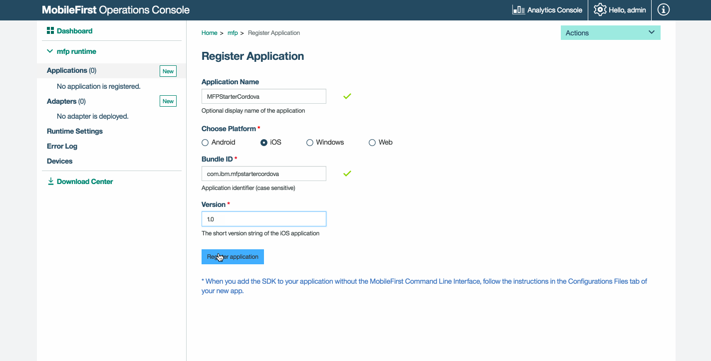

<!-- NLS_CHARSET=UTF-8 -->
## Обзор
{: #overview }
В этой демонстрации рассматриваются все этапы потока:

1. Пример приложения, поставляемый вместе с SDK клиента {{site.data.keys.product_adj }}, регистрируется и загружается с помощью {{site.data.keys.mf_console }}.
2. В {{site.data.keys.mf_console }} развертывается новый или предоставленный адаптер.  
3. В логику приложения вносятся изменения для запроса ресурса.

**Конечный результат**:

* Проверка связи с {{site.data.keys.mf_server }}.
* Успешное извлечение данных с помощью адаптера.

#### Предварительные требования:
{: #prerequisites }
* Xcode для iOS, Android Studio для Android или Visual Studio 2013/2015 для Windows 8.1 Universal / Windows 10 UWP
* Cordova CLI 6.x.
* *Необязательно*. {{site.data.keys.mf_cli }} ([загрузить]({{site.baseurl}}/downloads))
* *Необязательно*. Автономный экземпляр {{site.data.keys.mf_server }} ([загрузить]({{site.baseurl}}/downloads))

### 1. Запуск {{site.data.keys.mf_server }}
{: #1-starting-the-mobilefirst-server }
Убедитесь, что [создан экземпляр Mobile Foundation](../../bluemix/using-mobile-foundation) либо  
В случае применения [{{site.data.keys.mf_dev_kit }}](../../installation-configuration/development/mobilefirst) перейдите в папку сервера и выполните следующую команду: `./run.sh` (Mac и Linux) или `run.cmd` (Windows).

### 2. Создание и регистрация приложения
{: #2-creating-and-registering-an-application }
В браузере откройте {{site.data.keys.mf_console }} с помощью следующего URL: `http://your-server-host:server-port/mfpconsole`. В локальном режиме введите следующий адрес: [http://localhost:9080/mfpconsole](http://localhost:9080/mfpconsole). Идентификационные данные пользователя: *admin/admin*.
 
1. Нажмите кнопку **Создать** рядом с разделом **Приложения**
    * Выберите платформу: **Android, iOS, Windows**
    * Введите **com.ibm.mfpstartercordova** в качестве **идентификатора приложения**
    * Введите **1.0.0** в качестве **версии**
    * Нажмите кнопку **Зарегистрировать приложение**

    
 
2. Щелкните на плитке **Получить начальный код** и выберите загрузку примера приложения Cordova.

    
 
### 3. Изменение логики приложения
{: #3-editing-application-logic }
1. Откройте проект Cordova в предпочитаемом редакторе исходного кода.

2. Выберите файл **www/js/index.js** и вставьте следующий фрагмент кода, заменив существующую функцию `WLAuthorizationManager.obtainAccessToken()`:

```javascript
WLAuthorizationManager.obtainAccessToken()
    .then(
        function(accessToken) {
            titleText.innerHTML = "Yay!";
            statusText.innerHTML = "Connected to {{ site.data.keys.mf_server }}";
            
            var resourceRequest = new WLResourceRequest(
                "/adapters/javaAdapter/resource/greet/",
                WLResourceRequest.GET
            );
            
            resourceRequest.setQueryParameter("name", "world");
            resourceRequest.send().then(
                function(response) {
                    // Will display "Hello world" in an alert dialog.
                    alert("Success: " + response.responseText);
                },
                function(response) {
                    alert("Failure: " + JSON.stringify(response));
                }
            );
        },

        function(error) {
            titleText.innerHTML = "Bummer...";
            statusText.innerHTML = "Failed to connect to {{ site.data.keys.mf_server }}";
        }
    );
```
    
### 4. Развертывание адаптера
{: #4-deploy-an-adapter }
Загрузите [этот подготовленный артефакт .adapter](../javaAdapter.adapter) и разверните его с помощью {{site.data.keys.mf_console }}. Для этого выберите **Действия → Развернуть адаптер**.

Кроме того, можно нажать кнопку **Создать** рядом с разделом **Адаптеры**.  
        
1. Выберите **Действия → Загрузить пример**. Загрузите пример адаптера **Java** "Hello World".

    > Если Maven и {{site.data.keys.mf_cli }} не установлены, выполните инструкции по **настройке среды разработки**.

2. В окне **Командная строка** перейдите в корневую папку проекта Maven адаптера и выполните следующую команду:

    ```bash
   mfpdev adapter build
    ```

3. После завершения компоновки разверните адаптер с помощью {{site.data.keys.mf_console }}. Для этого выберите **Действия → Развернуть адаптер**. Адаптер расположен в папке **[adapter]/target**.
    
       


### 5. Тестирование приложения
{: #5-testing-the-application }
1. В окне **Командная строка** перейдите в корневую папку проекта Cordova.
2. Выполните команду `cordova platform add ios|android|windows` для добавления платформы.
3. В проекте Cordova выберите файл  **config.xml** и укажите в элементе `<mfp:server ... url=" "/>` значения свойств **protocol**, **host** и **port** с учетом конфигурации {{site.data.keys.mf_server }}.
    * Обычные значения в случае применения локального экземпляра {{site.data.keys.mf_server }}: **http**, **localhost** и **9080**.
    * Обычные значения в случае применения удаленного экземпляра {{site.data.keys.mf_server }} (в Bluemix): **https**, **your-server-address** и **443**.

    Кроме того, если установлен {{site.data.keys.mf_cli }}, перейдите в корневую папку проекта и выполните команду `mfpdev app register`. В случае применения удаленного экземпляра {{site.data.keys.mf_server }} [выполните команду `mfpdev server add`](../../application-development/using-mobilefirst-cli-to-manage-mobilefirst-artifacts/#add-a-new-server-instance) для добавления сервера, а затем выполните команду, аналогичную следующей: `mfpdev app register myBluemixServer`.
	
Если устройство подключено, то приложение устанавливается и запускается на устройстве.  
В противном случае применяется симулятор или эмулятор.

<br clear="all"/>
### Результаты
{: #results }
* При нажатии кнопки **Проверить связь с {{site.data.keys.mf_server }}** выдается сообщение **Установлено соединение с {{site.data.keys.mf_server }}**.
* Если приложению удалось подключиться к {{site.data.keys.mf_server }}, ресурс запрашивается с помощью развернутого адаптера Java.

Ответ адаптера отображается в предупреждении.

## Дальнейшие действия
{: #next-steps }
Узнайте больше об использовании адаптеров в приложениях, интеграции дополнительных служб, таких как Push-уведомления, с помощью среды защиты {{site.data.keys.product_adj }} и других вопросах:

- Просмотреть учебники, посвященные [разработке приложений](../../application-development/)
- Просмотреть учебники, посвященные [разработке адаптеров](../../adapters/)
- Просмотреть учебники, посвященные [идентификации и защите](../../authentication-and-security/)
- Просмотреть учебники, посвященные [уведомлениям](../../notifications/)
- Просмотреть [все учебники](../../all-tutorials)
