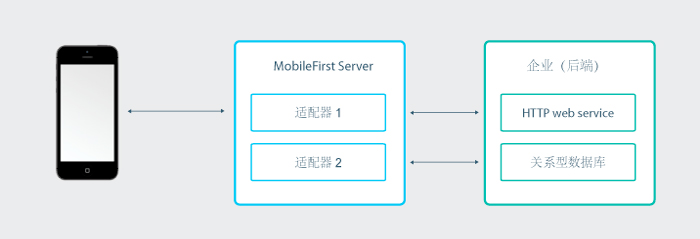
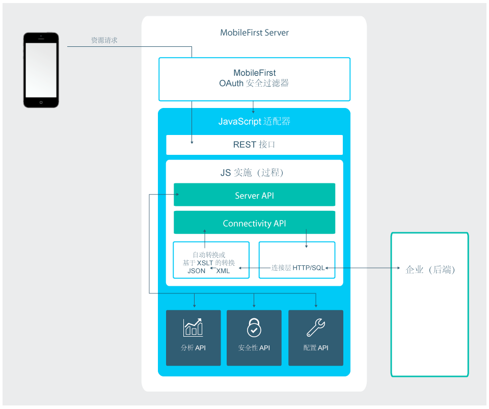
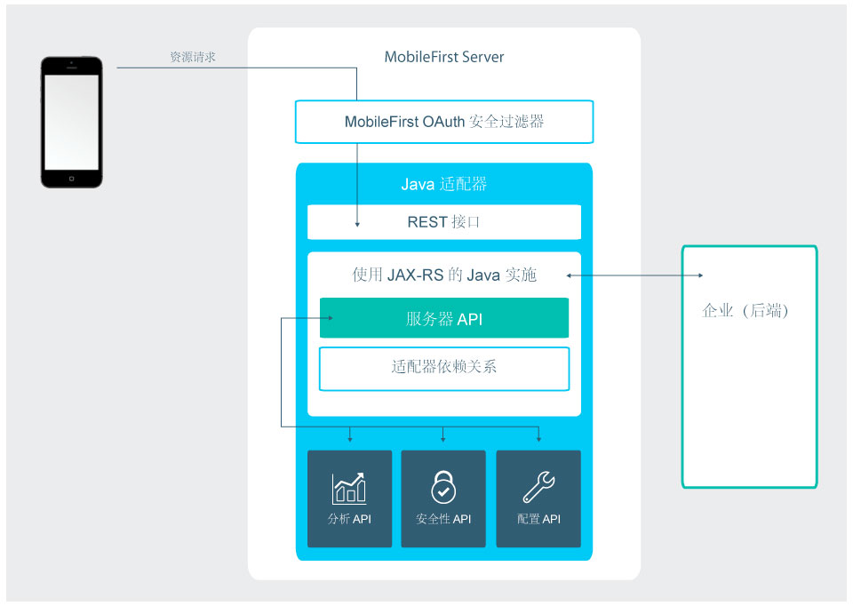

<!-- NLS_CHARSET=UTF-8 -->
## 概述
{: #overview }
适配器是包含以 Java 或 JavaScript 实现的服务器端代码的 Maven 项目。  
适配器用于执行任何必要的服务器端逻辑，并从后端系统检索信息并将信息传输到客户机应用程序和云服务。 

每个适配器都有各自的隔离沙箱，可以在不知道其他适配器沙箱或不中断这些沙箱的情况下运行。也就是说，适配器仍然可以通过调用可能生成“[适配器聚合](advanced-adapter-usage-mashup)”的 API 来与其他适配器通信。

要包含适配器代码所需的第三方库，可在适配器的 **pom.xml** 文件中将它们定义为 Maven 依赖关系。有关更多信息，请参阅[创建 Java 和 JavaScript 适配器](creating-adapters)教程中的[依赖关系](creating-adapters/#dependencies)部分。

适配器也支持 DevOps 需求：

* 您可以“热部署”适配器，即在运行时部署、取消部署和重新部署适配器。此功能给予服务器端开发流程很大的灵活性。
* 适配器可以具有由管理人员配置的用户定义的属性，无需重新部署适配器。该功能允许您针对不同的环境（例如开发、测试以及生产）定制适配器行为。

继续阅读以了解 Java 和 JavaScript 适配器的概述。然后遵循侧边栏导航中的教程来学习如何：创建、构建、更新、开发、测试以及部署 Java 和 JavaScript 适配器，学习如何使用 IDE 进行适配器开发，收集服务器端日志以及更多高级主题（例如适配器聚合和 Cloudant 集成）。

### 使用适配器的优点
{: #benefits-of-using-adapters }

#### 普遍性
{: #universality }

* 适配器支持多种集成技术和后端信息系统。

#### 只读和事务功能
{: #read-only-and-transactional-capabilities }

* 适配器支持对后端系统的只读和事务访问方式。

#### 加速开发
{: #fast-development }

* 适配器使用简单的 XML 语法，并可以使用 JavaScript API 或 Java API 轻松配置。

#### 安全性
{: #security }

* 适配器使用灵活的认证功能来创建与后端系统的连接。
* 适配器提供对已连接用户的身份进行控制。

#### 透明性
{: #transparency }

* 以统一的方式公开从后端应用程序检索到的数据，无论是什么样的适配器类型。  

### 特定于 Java 适配器的优点
{: #benefits-specific-to-java-adapters }

* 能够完全控制 URL 结构、内容类型、请求和响应头、内容以及编码
* 能够使用第三方工具（例如 Postman）测试适配器
* 能够简单快速地部署到运行的 {{ site.data.keys.mf_server }} 实例，而不会影响性能并且无停机时间
* 通过在源代码中使用简单注释，无需其他定制便能与 {{ site.data.keys.product }} 安全模型进行安全集成

## JavaScript 适配器
{: #javascript-adapters }

JavaScript 适配器提供用于与 HTTP 和 SQL 后端通信的模板。这些模板包含一组服务，称为过程。移动应用程序可以通过发出 AJAX 请求来调用这些过程。过程从后端应用程序检索信息，并将数据返回给应用程序。使用 REST 接口，您可得益于由 {{ site.data.keys.product }} 提供的[基于 OAuth 2.0 的安全框架](../authentication-and-security)。

* 如果数据的格式是 JSON，那么 {{ site.data.keys.mf_server }} 使数据保持原样。否则，{{ site.data.keys.mf_server }} 自动将该数据转换为 JSON。  
* 或者，您可以提供 XSL 变换以将数据转换为 JSON。在这种情况下，从后端返回的内容类型必须是 XML。然后，您可以使用 XSLT 来根据需求过滤数据。
* 通过 HTTP 适配器，您可以发送 GET 或 POST HTTP 请求，并从响应头或主体检索数据。HTTP 适配器与 RESTful 和基于 SOAP 的服务一起使用，可以读取结构化的 HTTP 源（例如 RSS 订阅源）。
* 通过 SQL 适配器，您可以与任何 SQL 数据源进行通信。您可以使用普通 SQL 查询或存储过程。

> * 在[创建适配器](creating-adapters)教程中学习如何创建适配器。
> * 了解有关 [JavaScript 适配器](javascript-adapters)的更多信息

## Java 适配器
{: #java-adapters }

Java 适配器基于 [JAX-RS 2.0 规范](https://jax-rs-spec.java.net/nonav/2.0-rev-a/apidocs/index.html)，因而使用 Java 编写，并将完整的 REST API 公开给客户机。在 Java 适配器中，由开发人员定义返回的内容及其格式，以及每个资源的 URL 结构。唯一例外是，如果发送请求的客户机支持 GZip，那么返回的 Java 适配器的内容编码用 GZip 压缩。对所返回内容的所有操作均由开发人员完成和拥有。

下图描述移动设备如何从其 REST 端点访问任何 Java 适配器。REST 接口受 {{ site.data.keys.product }} OAuth 安全过滤器保护，这表示客户机需要获得访问令牌才能访问适配器资源。适配器的每个资源都有其自己的 URL，所以可使用任何防火墙保护 {{ site.data.keys.product }} 端点。REST 接口调用 Java 代码（JAX-RS 服务）以处理传入请求。Java 代码可使用 Java {{ site.data.keys.mf_server }} API 在服务器上执行操作。此外，Java 代码可以连接到企业系统以访存数据、更新数据或执行企业系统公开的任何其他操作。

> * 在[创建适配器](creating-adapters)教程中学习如何创建适配器。
> * 了解有关 [Java 适配器](java-adapters) 的更多信息

## 后续教程
{: #tutorials-to-follow-next }
