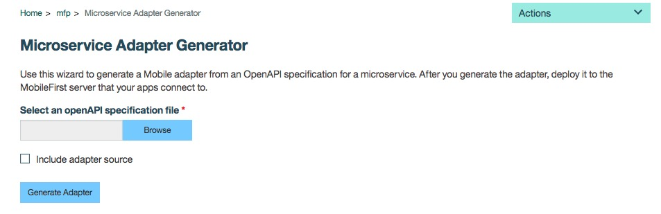

<!-- NLS_CHARSET=UTF-8 -->
## 概述
{: #overview }

{{ site.data.keys.product }} 适配器用于执行任何必要的服务器端逻辑，并从后端系统检索信息并将信息传输到客户机应用程序和云服务。

##  通过适配器的 OpenAPI 规范生成适配器
{: #generate-adapter-openapi-spec}

通过适配器的 OpenAPI 规范（Swagger 规范）自动生成适配器有助于加快完成应用程序开发。{{ site.data.keys.product }} 用户现在可以专注于应用程序逻辑，而不必花费精力来创建将应用程序连接到所需后端服务的 {{ site.data.keys.product }} 适配器。

>**注：**该功能只在 DevKit 中可用。

要使用此功能，针对微服务（或期望的后端服务）的 OpenAPI 规范 JSON 应可用。通过名为**微服务连接器**（也称为**微服务适配器生成器**）的扩展适配器（可从 {{ site.data.keys.product }} Console 上的**下载中心**下载）提供适配器生成功能。

>**注：**作为先决条件，请将 JAVA_HOME 变量配置为指向已安装的 JDK 文件夹。

  

下载**微服务适配器生成器**适配器并将其部署到 {{ site.data.keys.product }} 服务器。已部署的适配器现在将列出在导航窗格中的**扩展**下。

  

单击**微服务适配器生成器**将启动页面，用户可以在其中提供 OpenAPI 规范 JSON 文件，并且可以选择通过提供的 OpenAPI 规范来生成适配器。

  

在生成适配器之后，会自动将该适配器下载至浏览器。然后，需要用户部署生成的适配器以在其应用程序中使用。

适配器生成器依赖于 OpenAPI 规范 JSON 的准确性。如果规范不完整或者不正确，那么生成可能会失败或者可能会导致生成其他与后端微服务的 API 不匹配的 API。

>要了解更多信息，请阅读博客帖子：[Auto Generate Adapters for Microservices and backend systems from its OpenAPI Specification](https://mobilefirstplatform.ibmcloud.com/blog/2017/08/10/autogenerate-adapter-from-openapi-specification/)。
