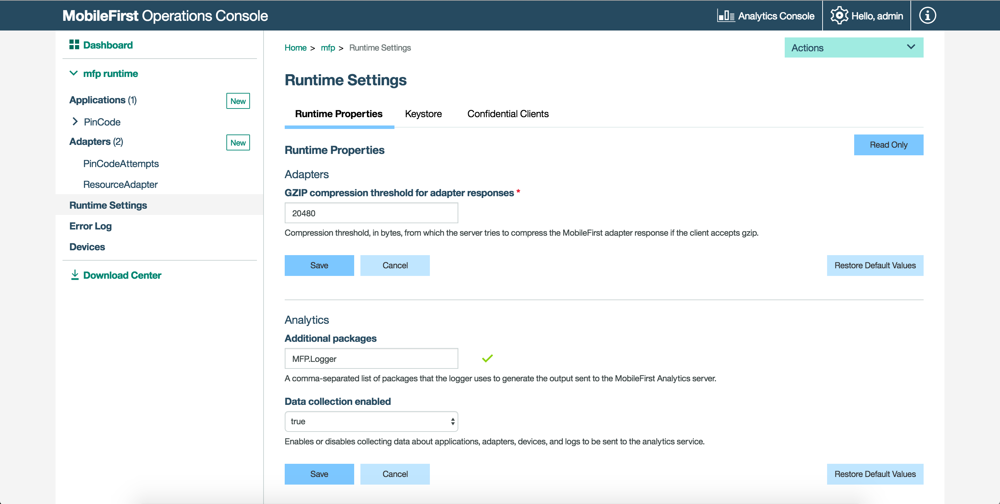

<!-- NLS_CHARSET=UTF-8 -->
## 概述
{: #overview }

本教程提供在 JavaScript 适配器中添加日志记录功能所需的代码片段。

## 日志记录示例
{: #logging-example }

下面的消息输出至应用程序服务器的 `trace.log` 文件。 如果服务器管理员正在从 {{ site.data.keys.mf_server }} 向 {{ site.data.keys.mf_analytics_server }} 转发日志，那么 `logger` 消息还将显示在 {{ site.data.keys.mf_analytics_console }} 的**基础架构 → 服务器日志搜索**视图中。

```javascript
MFP.Logger.debug("This is a debug message from a JavaScript adapter");
```

从最低到最高详细度的其他日志记录级别为：ERROR、WARN、INFO、LOG 和 DEBUG。 

## 访问日志文件
{: #accessing-the-log-files }

* 在 {{ site.data.keys.mf_server }} 的预安装中，根据底层应用程序服务器提供该文件。 
    * [IBM WebSphere Application Server 完整概要文件](http://ibm.biz/knowctr#SSEQTP_8.5.5/com.ibm.websphere.base.doc/ae/ttrb_trcover.html)
    * [IBM WebSphere Application Server Liberty 概要文件](http://ibm.biz/knowctr#SSEQTP_8.5.5/com.ibm.websphere.wlp.doc/ae/rwlp_logging.html?cp=SSEQTP_8.5.5%2F1-16-0-0)
    * [Apache Tomcat](http://tomcat.apache.org/tomcat-7.0-doc/logging.html)
* 要获取以下各项中云部署中的日志：
    * IBM Containers 或 Liberty Build Pack，请参阅 [IBM Containers 日志和跟踪集合](../../../bluemix/mobilefirst-server-using-scripts/log-and-trace-collection/)教程。
    * Mobile Foundation Bluemix 服务，请参阅[使用 Mobile Foundation](../../../bluemix/using-mobile-foundation) 教程中的[访问服务器日志](../../../bluemix/using-mobile-foundation/#accessing-server-logs)部分。

## 将日志转发到分析服务器
{: #forwarding-logs-to-the-analytics-server }

也可以将日志转发至分析控制台。

1. 在 {{ site.data.keys.mf_console }} 中，选择侧边栏导航中的**设置**选项。
2. 单击**“运行时属性”选项卡**中的**编辑**按钮。
3. 在**分析 → 更多程序包**部分，指定 **MFP.Logger**，以将 JavaScript 适配器日志转发至 {{ site.data.keys.mf_server }}。



