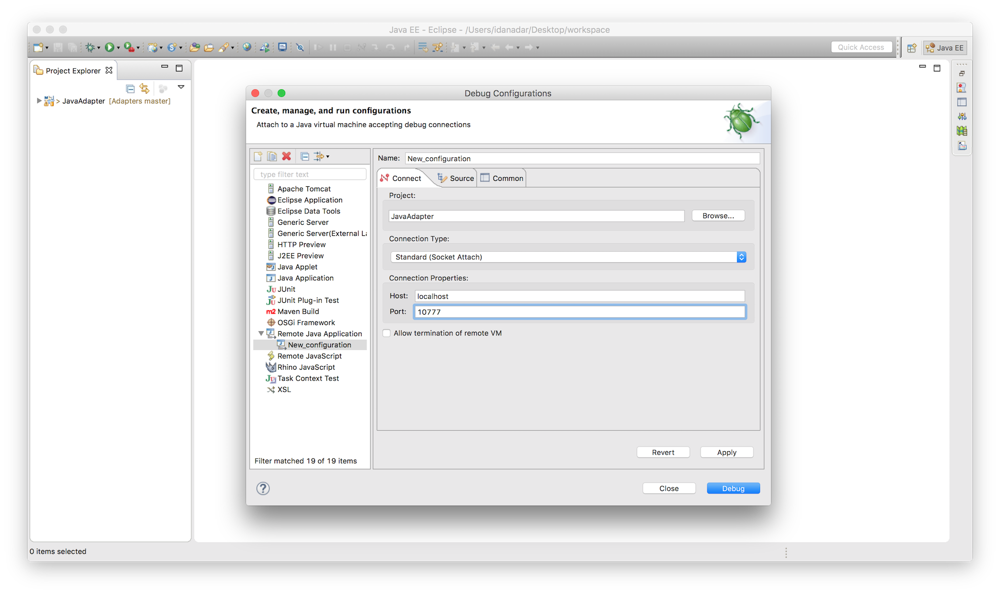

<!-- NLS_CHARSET=UTF-8 -->
## 概述
{: #overview }

您可以使用 IDE（如 Eclipse、IntelliJ 或类似环境）来测试 Java 和 JavaScript 适配器，并且调试为在 Java 或 JavaScript 适配器中使用而实施的 Java 代码。  

本教程演示如何使用 {{ site.data.keys.mf_cli }} 和 Postman 来测试适配器，以及如何使用 Eclipse IDE 来调试 Java 适配器。

#### 跳转至
{: #jump-to }

* [测试适配器](#testing-adapters)
 * [使用 Postman](#using-postman)
 * [使用 Swagger](#using-swagger)
* [调试适配器](#debugging-adapters)
 * [JavaScript 适配器](#debugging-javascript-adapters)
 * [Java 适配器](#debugging-java-adapters)

## 测试适配器
{: #testing-adapters }

可通过 REST 接口获取适配器。这表示如果您知道资源的 URL，那么便可以使用诸如 Postman 的 HTTP 工具来测试请求并传递您认为合适的 `URL` 参数、`path` 参数、`body` 参数或 `headers`。

用于访问适配器资源的 URL 的结构为：

* 在 JavaScript 适配器中 - `http://hostname-or-ip-address:port-number/mfp/api/adapters/{adapter-name}/{procedure-name}`
* 在 Java 适配器中 - `http://hostname-or-ip-address:port-number/mfp/api/adapters/{adapter-name}/{path}`

### 传递参数
{: #passing-parameters }

* 使用 Java 适配器时，根据适配器的配置方式，您可以在 URL、主体、表单等中传递参数。
* 使用 JavaScript 适配器时，以 `params=["param1", "param2"]` 形式传递参数。换而言之，JavaScript 过程只接收一个名为 `params` 的参数，要求该参数为**一个有序的未命名值的数组**。通过 `Content-Type: application/x-www-form-urlencoded`，该参数可以在 URL (`GET`) 中，也可以在主体 (`POST`) 中。

### 处理安全
{: #handling-security }

{{ site.data.keys.product }} 安全框架针对任何适配器资源都需要访问令牌，即使未对资源明确分配范围也是如此。因此，除非您特意禁用安全性，否则端点始终受保护。

要在 Java 适配器中禁用安全性，请向方法/类附加 `OAuthSecurity` 注释：

```java
@OAuthSecurity(enabled=false)
```

要在 JavaScript 适配器中禁用安全性，请向过程添加 `secured` 属性：

```js
<procedure name="adapter-procedure-name" secured="false"/>
```

另外，{{ site.data.keys.mf_server }} 的开发版本包含用于绕过安全挑战的测试令牌端点。

### 使用 Postman
{: #using-postman }

#### 测试令牌
{: #test-token }

要接收测试令牌，请单击下面的“在 Postman 中运行”按钮，以将“集合”导入到包含已就绪请求的 Postman 应用程序，或者按照以下步骤自行创建请求。

<a href="https://app.getpostman.com/run-collection/d614827491450d43c10e"></a>


1. 在 {{ site.data.keys.mf_console }} → **设置** → **机密客户机**选项卡中，创建机密客户机或使用缺省值：  
出于测试目的，将**允许的作用域**设置为 `**`。

  


1.  通过 HTTP 客户机 (Postman)，使用下列 `Content-Type: application/x-www-form-urlencoded` 格式的参数，向 `http://<IP>:<PORT>/mfp/api/az/v1/token` 发出 HTTP `POST` 请求：

    - `grant_type` - 将值设置为 `client_credentials`。
    - `scope` - 将值设置为资源的保护作用域。如果没有为资源分配保护作用域，请省略此参数以应用缺省作用域 (`RegisteredClient`)。有关更多信息，请参阅[作用域](../../authentication-and-security/#scopes)。

    

2.  使用带机密客户机标识（“test”）和密钥（“test”）的`基本认证`添加`授权头`。
    > 有关机密客户机的更多信息，请参阅[机密客户机](../../authentication-and-security/confidential-clients)。


    


结果是具有临时有效访问令牌的 JSON 对象：

```json
{
  "access_token": "eyJhbGciOiJSUzI1NiIsImp3ayI6eyJlIjoiQVFBQiIsIm4iOiJBTTBEZDd4QWR2NkgteWdMN3I4cUNMZEUtM0kya2s0NXpnWnREZF9xczhmdm5ZZmRpcVRTVjRfMnQ2T0dHOENWNUNlNDFQTXBJd21MNDEwWDlJWm52aHhvWWlGY01TYU9lSXFvZS1ySkEwdVp1dzJySGhYWjNXVkNlS2V6UlZjQ09Zc1FOLW1RSzBtZno1XzNvLWV2MFVZd1hrU093QkJsMUVocUl3VkR3T2llZzJKTUdsMEVYc1BaZmtOWkktSFU0b01paS1Uck5MelJXa01tTHZtMDloTDV6b3NVTkExNXZlQ0twaDJXcG1TbTJTNjFuRGhIN2dMRW95bURuVEVqUFk1QW9oMmluSS0zNlJHWVZNVVViTzQ2Q3JOVVl1SW9iT2lYbEx6QklodUlDcGZWZHhUX3g3c3RLWDVDOUJmTVRCNEdrT0hQNWNVdjdOejFkRGhJUHU4Iiwia3R5IjoiUlNBIiwia2lkIjoidGVzdCJ9fQ.eyJpc3MiOiJjb20uaWJtLm1mcCIsInN1YiI6InRlc3QiLCJhdWQiOiJjb20uaWJtLm1mcCIsImV4cCI6MTQ1MjUxNjczODAwNSwic2NvcGUiOiJ4eCJ9.vhjSkv5GShCpcDSu1XCp1FlgSpMHZa-fcJd3iB4JR-xr_3HOK54c36ed_U5s3rvXViao5E4HQUZ7PlEOl23bR0RGT2bMGJHiU7c0lyrMV5YE9FdMxqZ5MKHvRnSOeWlt2Vc2izh0pMMTZd-oL-0w1T8e-F968vycyXeMs4UAbp5Dr2C3DcXCzG_h9jujsNNxgXL5mKJem8EpZPolQ9Rgy2bqt45D06QTW7J9Q9GXKt1XrkZ9bGpL-HgE2ihYeHBygFll80M8O56By5KHwfSvGDJ8BMdasHFfGDRZUtC_yz64mH1lVxz5o0vWqPwEuyfslTNCN-M8c3W9-6fQRjO4bw",
  "token_type": "Bearer",
  "expires_in": 3599,
  "scope": "**"
}
```
<br/><br/>
#### 发送请求
{: #sending-request }

现在，对于到适配器端点的任何未来请求，均向 HTTP 头添加名称 `Authorization` 和您之前收到的值（以 Bearer 开头）。安全框架将跳过保护您资源的任何安全挑战。

  

### 使用 Swagger
{: #using-swagger }

Swagger 文档 UI 是适配器 REST 端点的可视化表示形式。  
使用 Swagger，开发人员可以在客户机应用程序使用适配器端点之前测试这些适配器端点。

要访问 Swagger：

1. 打开 {{ site.data.keys.mf_console }} 并从适配器列表中选择某适配器。
2. 单击**资源**选项卡。
3. 单击**查看 Swagger 文档**按钮。  
4. 单击**显示/隐藏**按钮。

  


#### 添加测试令牌
{: #adding-a-test-token }

要向请求添加测试令牌，以使安全框架跳过保护资源的任何安全挑战，请单击端点操作右上角的**开关**按钮。

这会要求您选择授予 Swagger UI 的作用域（出于测试目的，您可以全部选择）。如果是首次使用 Swagger UI，那么可能会要求您使用机密客户机标识和密码登录。为此，您需要创建一个新的机密客户机，并将 `*` 作为其**允许的作用域**。

> 在[机密客户机](../../authentication-and-security/confidential-clients)教程中了解有关“机密客户机”的更多信息。


<br/><br/>

#### 发送请求
{: #sending-request-swagger }

展开端点的操作，输入所需参数（如果需要），然后单击**试一下！**按钮。

  

#### Swagger 注释
{: #swagger-annotations }
仅在 Java 适配器中提供。

要为 Java 适配器生成 Swagger 文档，请在 Java 实施中使用 Swagger 提供的注释。
> 要了解有关 Swagger 注释的更多信息，请参阅 [Swagger 文档](https://github.com/swagger-api/swagger-core/wiki/Annotations-1.5.X)。
```java
@ApiOperation(value = "Multiple Parameter Types Example", notes = "Example of passing parameters by using 3 different methods: path parameters, headers, and form parameters. A JSON object containing all the received parameters is returned.")
@ApiResponses(value = { @ApiResponse(code = 200, message = "A JSON object containing all the received parameters returned.") })
@POST
@Produces(MediaType.APPLICATION_JSON)
@Path("/{path}")
public Map<String, String> enterInfo(
    @ApiParam(value = "The value to be passed as a path parameter", required = true) @PathParam("path") String path,
    @ApiParam(value = "The value to be passed as a header", required = true) @HeaderParam("Header") String header,
    @ApiParam(value = "The value to be passed as a form parameter", required = true) @FormParam("form") String form) {
  Map<String, String> result = new HashMap<String, String>();

  result.put("path", path);
  result.put("header", header);
  result.put("form", form);

  return result;
}
```



### 使用 {{ site.data.keys.mf_cli }}
{: #using-mobilefirst-cli }

为了测试适配器功能，可在命令行中使用 `mfpdev adapter call` 命令来调用 Java 或 JavaScript 适配器。
您可以选择以交互式或直接运行该命令。以下是使用直接方式的示例：

#### Java 适配器
{: #java-adapters-adapters-cli }

打开**命令行**窗口，然后运行：

```bash
mfpdev adapter call adapterName/path
```
例如：
```bash
mfpdev adapter call SampleAdapter/users/World

Calling GET '/mfp/api/adapters/SampleAdapter/users/World'
Response:
Hello World
```

#### JavaScript 适配器
{: #javascript-adapters-cli }

打开**命令行**窗口，然后运行：

```bash
mfpdev adapter call adapterName/procedureName
```
例如：
```bash
mfpdev adapter call SampleAdapter/getFeed

Calling GET '/mfp/api/adapters/SampleAdapter/users/World'
Response:
Hello World
```



## 调试适配器
{: #debugging-adapters }

### JavaScript 适配器
{: #debugging-javascript-adapters }
您可以在 JavaScript 适配器中通过使用 `MFP.Logger` API 来调试 JavaScript 代码。  
可用的日志记录级别，从最低到最高详细程度为：`MFP.Logger.error`、`MFP.Logger.warn`、`MFP.Logger.info` 和 `MFP.Logger.debug`。

之后，日志将打印到应用程序服务器的日志文件。  
确保相应地设置服务器详细程度，否则您在日志文件中看不到该日志记录。

### Java 适配器
{: #debugging-java-adapters }

在调试适配器的 Java 代码之前，需要如下配置 Eclipse：

1. **Maven 集成** - 从 Eclipse Kepler (v4.3) 开始，Maven 支持已内置在 Eclipse 中。  
如果您的 Eclipse 实例不支持 Maven，那么请遵循[ m2e 指示信息](http://www.eclipse.org/m2e/)以添加 Maven 支持。

2. Maven 一旦在 Eclipse 中可用，请导入适配器 Maven 项目：

    

3. 提供调试参数：
    - 单击**运行** → **调试配置**。
    - 双击**远程 Java 应用程序**。
    - 为该配置提供**名称**。
    - 设置**主机**值：如果运行本地服务器，那么使用“localhost”，否则提供您的远程服务器主机名。
    - 将**端口**值设置为“10777”。
    - 单击**浏览**，然后选择 Maven 项目。
    - 单击**调试**。

    

4. 单击**窗口 → 显示视图 → 调试**以进入*调试方式*。现在，您可以像在标准 Java 应用程序中一样正常调试 Java 代码。您需要向适配器发出请求，以使代码运行并命中任何设置断点。通过遵循[“测试适配器”部分](#testing-adapters)中有关如何调用适配器资源的指示信息，即可完成此操作。

    

> 有关如何使用 IntelliJ 调试 Java 适配器的指示信息，请参阅[使用 IntelliJ 开发 MobileFirst Java 适配器]({{site.baseurl}}/blog/2016/03/31/using-intellij-to-develop-adapters)博客帖子。
