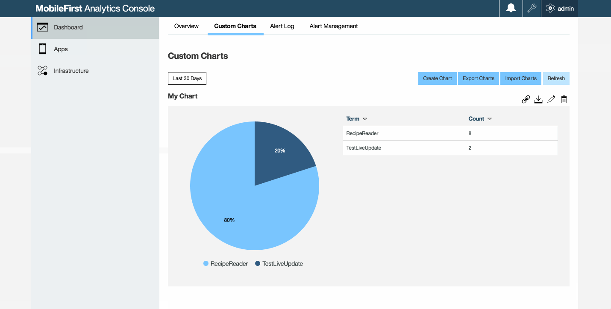

<!-- NLS_CHARSET=UTF-8 -->
## 概述
{: #overview }

定制图表允许您将分析数据存储库中收集的分析数据直观呈现为缺省情况下在 {{ site.data.keys.mf_analytics_console }} 中不可用的图表。该直观呈现功能是分析业务关键型数据的有效方式。

可用的定制图表类型有：**应用程序会话**、**网络事务**、**推送通知**、**客户机日志**、**服务器日志**和**定制数据**。

#### 跳转至
{: #jump-to }

* [创建定制图表](#creating-a-custom-chart)
* [图表类型](#chart-types)
* [为客户机日志创建定制图表](#creating-custom-charts-for-client-logs)
* [导出定制图表数据](#exporting-custom-chart-data)
* [导出和导入定制图表定义](#exporting-and-importing-custom-chart-definitions)

## 创建定制图表
{: #creating-a-custom-chart }

在 {{ site.data.keys.mf_analytics_console }} 的**仪表板**面板中，定制图表创建构建器会指导您完成四个主要阶段：

### 1. 常规设置
{: #1-general-settings }

单击**定制图表**选项卡中的**创建图表**按钮。  

在**常规设置**选项卡中，选择“图表标题”、“事件类型”和“图表类型”。  
在选择“事件类型”和“图表类型”之后，将显示**图表定义**选项卡。

### 2. “图标定义”选项卡
{: #2-the-chart-definition-tab }

使用**图表定义**选项卡为先前选择的指定图表类型定义图表。定义图表后，可以设置图表过滤器和图表属性。

### 3. “图表过滤器”选项卡
{: #3-the-chart-filters-tab }

**图表过滤器**用于微调定制图表。可针对任何图表定义多个过滤器。  
例如，如果有兴趣查看特定应用程序的平均应用程序会话持续时间，可以指定以下选项：

1. 针对**属性**选择**应用程序名称**。
2. 针对**运算符**选择**等于**。
3. 针对**值**选择应用程序的名称。
4. 单击**添加过滤器**。

这样会将应用程序名称过滤器添加到您的图表的过滤器表格中。

### 4. 图表属性
{: #4-chart-properties }

针对**表格**、**条形图**和**折线图**图表类型可提供图表属性。图表属性的目标是增强数据演示的方式，使可视化更有效。

如果您创建了**表格图表**，那么可设置图表属性来定义表格页面大小、要排序的字段以及字段的排序顺序。

如果您创建了**条形图**或**折线图**图表，那么可设置图表属性以标记阈值行，为监控此图表的所有人添加引用框架。

## 图表类型
{: #chart-types }

### 条形图
{: #bar-graph }

条形图允许在 X 轴上直观呈现数字数据。定义条形图时，必须先选择 X 轴的值。以下可能值可供选择。

* **时间线** - 如果要以趋势方式来查看数据（例如，长期的平均应用程序会话持续时间），请针对 X 轴选择时间线。
* **属性** - 如果要查看特定属性的计数明细，请选择“属性”。如果针对 X 轴选择“属性”，那么将针对 Y 轴隐式选择“总计”。例如，针对 X 轴选择“属性”，并针对“属性”选择“应用程序名称”，以查看指定事件类型（按应用程序名称细分）的计数。

为 X 轴定义值之后，可以为 Y 轴定义值。如果针对 X 轴选择时间线，那么可以针对 Y 轴选择以下可能的值。

* **平均值** - 计算提供的事件类型中数字属性的平均值。
* **总计** - 计算提供的事件类型中属性的总数。
* **唯一** - 计算提供的事件类型中属性的唯一计数。

定义图表轴后，必须为“属性”选择值。

### 折线图
{: #line-graph }

折线图允许直观显示一段时间内的某些度量值。要从趋势角度来直观显示一段时间内的数据时，此类型的图表很有价值。创建折线图时要定义的首个值为度量，包含以下可能的值。：

* **平均值** - 计算提供的事件类型中数字属性的平均值。
* **总计** - 计算提供的事件类型中属性的总数。
* **唯一** - 计算提供的事件类型中属性的唯一计数。

定义度量后，必须为“属性”选择值。

### 流程图
{: #flow-chart }

流程图允许直观显示从某个属性到另一个属性的流程明细。对于流程图，必须设置以下属性。

* **源** - 图中源节点的值。
* **目标** - 图中目标节点的值。
* **属性** - 来自源节点或目标节点的属性值。

通过流程图，可以查看从各种源流至目标的密度明细，反之亦然。例如，如果要查看某个应用程序的日志严重性的明细，可以定义以下值。

* 针对“源”选择“应用程序名称”。
* 针对“目标”选择“日志级别”。
* 针对“属性”选择应用程序名称。

### 度量组
{: #metric-group }

度量组可用于直观显示作为平均值、总数或唯一计数来度量的单个度量值。要定义度量组，必须为“度量”定义以下某个可能的值。

* **平均值** - 计算提供的事件类型中数字属性的平均值。
* **总计** - 计算提供的事件类型中属性的总数。
* **唯一** - 计算提供的事件类型中属性的唯一计数。

定义度量后，必须为“属性”选择值。此度量显示在度量组中。

### 饼图
{: #pie-chart }

饼图可用于直观显示特定属性的值的计数明细。例如，如果要查看崩溃明细，请定义以下值。

* 针对“事件类型”选择“应用程序会话”。
* 针对“图表类型”选择“饼图”。
* 针对“属性”选择“结束方式”。

生成的饼图会显示由用户关闭的应用程序会话与由崩溃而关闭的应用程序会话的对比明细。

### 表格
{: #table }

要查看原始数据时可使用该表。构建表很简单，为要查看的原始数据添加列即可。  
由于特定事件类型并不需要所有属性，因此表中可能显示空值。如果要防止在表中显示这些行，请在“图表过滤器”选项卡中为特定属性添加“存在”过滤器。

## 为客户机日志创建定制图表
{: #creating-custom-charts-for-client-logs }

您可以为客户机日志（其中包含通过平台的 Logger API 发送的日志信息）创建定制图表。  
日志信息还包含有关设备的上下文信息，包括环境、应用程序名称和应用程序版本。

> **注：**您必须记录定制事件以填充定制图表。有关从客户机应用程序发送定制事件的信息，请参阅[捕获定制数据](../../analytics-api/#custom-events)。

1. 从客户机应用程序，通过将捕获到的日志发送至服务器来填充数据。参阅[发送捕获的日志](../../analytics-api/#sending-analytics-data)。
2. 在 {{ site.data.keys.mf_analytics_console }} 中，单击**定制图表**选项卡并继续创建图表：
    * **图表标题**：应用程序和日志级别
    * **事件类型**：客户机日志
    * **图表类型**：流程图

3. 单击**图表定义**选项卡并提供以下值：
    * **源**：应用程序名称
    * **目标**：日志级别
    * **属性**：您的应用程序名称

4. 单击**保存**按钮。

## 导出定制图表数据
{: #exporting-custom-chart-data }

您可以下载针对任何定制图表显示的数据。  

* **连同 URL 一起导出** - 看起来像链条
* **下载图表** - 看起来像向下箭头
* **编辑图表** - 看起来像画笔
* **删除图表** - 看起来像废纸箱

单击**下载图表**图标以从 {{ site.data.keys.mf_analytics_console_short }} 下载 JSON 格式的文件。  
单击**连同 URL 一起导出**图标从 {{ site.data.keys.mf_analytics_console_short }} 生成一个导出链接以从 HTTP 客户机调用。如果您要编写脚本来按指定时间间隔自动执行导出流程，那么可使用该选项。

## 导出和导入定制图表定义
{: #exporting-and-importing-custom-chart-definitions }

您可以在 {{ site.data.keys.mf_analytics_console_short }} 中导出和导入定制图表定义。
如果从测试环境迁移至生产部署，可以通过导出定制图表定义来节省时间，而无需为新集群重新创建定制图表。

1. 单击 {{ site.data.keys.mf_analytics_console_short }} 仪表板中的**定制图表**选项卡。
2. 单击**导出图表**以下载带有您的图表定义的 JSON 文件。
3. 选择位置以保存 JSON 文件。
4. 单击**导入图表**以导入您的 JSON 文件。如果您导入了某个已存在的定制图表定义，将创建重复的定义，这也意味着 {{ site.data.keys.mf_analytics_console_short }} 将显示重复的定制图表。
