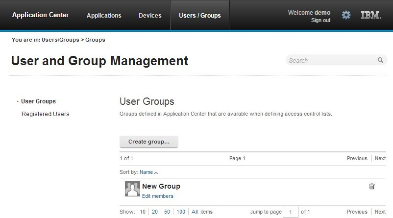
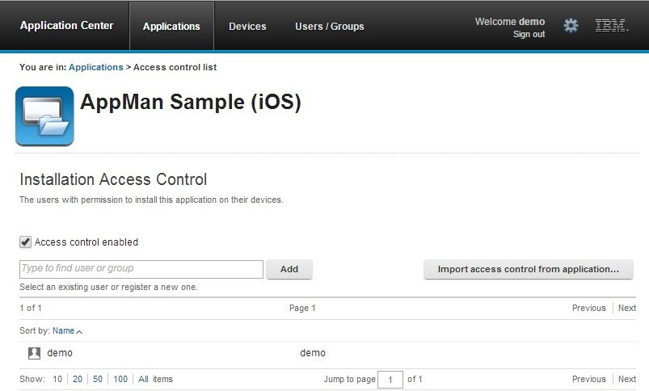

<!-- NLS_CHARSET=UTF-8 -->
## 概述
{: #overview }
通过 Application Center 控制台，您可以管理 Application Center 的存储库以及您的应用程序。

Application Center 控制台是一种 Web 应用程序，用于管理 Application Center 的存储库。 Application Center 存储库是用于存储可安装在移动设备上的移动应用程序的中央位置。

使用 Application Center 控制台可执行以下操作：

* 上载针对以下操作系统编写的应用程序：Android、iOS、Windows 8（仅限 Windows Store 软件包）、Windows Phone 8 或 Windows 10 Universal。
* 管理多种不同版本的移动应用程序。
* 查看测试员对于移动应用程序的反馈。
* 定义有权在移动设备上列出并安装应用程序的用户。
* 跟踪在哪些设备上安装了哪些应用程序。

> **注：**
>
> * 只有具有管理员角色的用户才能登录 Application
Center 控制台。
> * 多语言支持：Application Center 控制台的用户界面尚未翻译。

#### 跳至：
{: #jump-to }
* [启动 Application Center 控制台](#starting-the-application-center-console)
* [对损坏的登录页面 (Apache Tomcat) 进行故障诊断](#troubleshooting-a-corrupted-login-page-apache-tomcat)
* [在 Safari 浏览器中对损坏的登录页面进行故障诊断](#troubleshooting-a-corrupted-login-page-in-safari-browsers)
* [应用程序管理](#application-management)
* [添加移动应用程序](#adding-a-mobile-application)
* [从通用应用商店添加应用程序](#adding-an-application-from-a-public-app-store)
* [应用程序属性](#application-properties)
* [编辑应用程序属性](#editing-application-properties)
* [在 {{ site.data.keys.mf_server }} 和 Application Center 中升级移动应用程序](#upgrading-a-mobile-application-in-mobilefirst-server-and-the-application-center)
* [下载应用程序文件](#downloading-an-application-file)

在 Application Center 控制台中，您可以查看用户发送的有关移动应用程序版本的评论。

* [用户和组管理](#user-and-group-management)
* [访问控制](#access-control)
* [管理访问控制](#managing-access-control)
* [设备管理](#device-management)
* [Windows 8 Universal 中的应用程序注册标记](#application-enrollment-tokens-in-windows-8-universal)
* [从 Application Center 控制台注销](#signing-out-of-the-application-center-console)

## 启动 Application Center 控制台
{: #starting-the-application-center-console }
如果您具有管理员角色，那么可以使用自己的 Web 浏览器启动 Application Center 并登录。

1. 在您的桌面上启动 Web 浏览器会话。
2. 联系您的系统管理员以获取安装了 Application Center 的服务器的地址和端口。
3. 输入以下 URL：`http://server/appcenterconsole`
4. 其中，**server** 是用于安装 Application Center 的服务器的地址和端口：`http://localhost:9080/appcenterconsole`

登录到 Application Center 控制台。 联系您的系统管理员以获取您的凭证，以便可以登录到 Application Center 控制台。

> **注：**只有具有管理员角色的用户才能登录到 Application Center 控制台。

## 对损坏的登录页面 (Apache Tomcat) 进行故障诊断
{: #troubleshooting-a-corrupted-login-page-apache-tomcat }
当 Application Center 在 Apache Tomcat 中运行时，可以从 Application Center 控制台的损坏登录页面恢复。

当 Application Center 在 Apache Tomcat 中运行时，使用错误的用户名或密码可能会破坏 Application Center 控制台的登录页面。

当尝试使用错误的用户名或错误的密码登录控制台时，您会收到一条错误消息。 在纠正用户名或密码后，将会收到以下某个错误，而不是成功登录；消息内容取决于您的 Web 浏览器。

* 与之前相同的错误消息
* 消息**已重置连接**
* 消息**超出了允许的登录时间**

该行为与 Apache Tomcat 对 j_security_check servlet 的管理有关。 该行为特定于 Apache Tomcat，而不会在任何 WebSphere Application Server 概要文件中出现。

变通方法是单击浏览器的刷新按钮，以在登录失败后刷新 Web 页面。 然后，输入正确的凭证。

## 在 Safari 浏览器中对损坏的登录页面进行故障诊断
{: #troubleshooting-a-corrupted-login-page-in-safari-browsers }
在使用 Safari 浏览器时，可以从 Application Center 控制台的损坏登录页面恢复。

在 Safari 浏览器中打开 Application Center 控制台时，您可能会离开该控制台。 在返回到该控制台时，您可能会看到登录页面。 即使输入正确的登录详细信息，您仍会看到以下消息而不是成功登录：**HTTP 状态 404 - appcenterconsole/j_security_check。**

该行为与 Safari 浏览器中的高速缓存问题有关。

变通方法是在您看到登录页面时触发强制重新装入，而不输入或自动填写凭证。 下面是触发强制重新装入的方法：

* 在 Mac 计算机上，按 Shift + **刷新**按钮。
* 在 iPad 或 iPhone 设备上：双击“刷新”按钮或通过关闭 Safari（双击 Home 按钮然后滑动关闭 Safari）来清除高速缓存。

## 应用程序管理
{: #application-management }
您可以使用“应用程序管理”来添加新的应用程序和版本以及管理这些应用程序。  
Application Center 支持您添加新应用程序和版本以及管理这些应用程序。

单击**应用程序**以访问“应用程序管理”。

### 安装在 WebSphere Application Server Liberty Profile 或 Apache Tomcat 上的 Application Center
{: #application-center-installed-on-websphere-application-server-liberty-profile-or-on-apache-tomcat }
使用 IBM Installation Manager 软件包安装 {{ site.data.keys.product_full }} 期间，在这些应用程序服务器上安装 Application Center 的过程会定义两个不同的用户以供您使用。

* 使用登录名 **demo** 和密码 **demo** 的用户
* 使用登录名 **appcenteradmin** 和密码 **admin** 的用户

### WebSphere
Application Server Full Profile
{: #websphere-application-server-full-profile }
如果您在 WebSphere Application Server Full Profile 上已安装 Application Center，那么缺省情况下会创建一个名为 appcenteradmin 的用户，其密码由安装程序指示。

## 添加移动应用程序
{: #adding-a-mobile-application }
可以使用 Application Center 控制台将应用程序添加到服务器上的存储库中。 然后可使用移动式客户机将这些应用程序安装在移动设备上。

在“应用程序”视图中，可以将应用程序添加到 Application Center 中。 最初，应用程序列表为空，并且您必须上载应用程序文件。 在以下过程中描述了应用程序文件。

要添加应用程序以使其可安装在移动设备上：

1. 单击**添加应用程序**。
2. 单击**上载**。
3. 选择要上载至 Application Center 存储库的应用程序文件。

   ### Android
   {: #android }
   应用程序文件扩展名为 **.apk**。

   ### iOS
   {: #ios }
   对于常规 iOS 应用程序，应用程序文件扩展名为 **.ipa**。

   ### Windows Phone 8
   {: #windows-phone-8 }
   应用程序文件扩展名为 **.xap**。 应用程序必须使用公司帐户签署。 必须使该公司帐户的应用程序注册标记可用于 Windows Phone 8 设备，然后才可在这些设备上安装应用程序。 请参阅 [Windows 8 Universal 中的应用程序注册标记](#application-enrollment-tokens-in-windows-8-universal)以获取详细信息。

   ### Windows 8
   {: #windows-8 }
   应用程序作为 Windows Store 软件包提供；文件扩展名为 **.appx**。

   Windows Store .appx 包可依赖于一个或多个 Windows 组件库应用程序包（也称为“框架”包）。 Windows 8 的 MobileFirst 混合应用程序依赖于 Microsoft.WinJS 框架包。 当使用 Microsoft Visual Studio 生成应用程序包时，还会生成依赖关系包并将其打包为独立的 .appx 文件。 要使用移动式客户机成功安装此类应用程序，必须将应用程序 .appx 包以及任何其他依赖关系包上载到 Application Center 服务器。 上载依赖关系包时，它在 Application Center 控制台中显示为“不活动”状态。 预期将发生此行为，使得框架包在客户机中不显示为可安装应用程序。 之后，当用户安装应用程序时，移动式客户机会检查设备上是否已安装依赖关系。 如果未安装依赖关系包，那么客户机会从 Application Center 服务器中自动检索依赖关系包，并将其安装在设备上。 有关依赖关系的更多信息，请参阅 Windows 开发人员文档中有关包和应用程序部署的[依赖关系](http://msdn.microsoft.com/library/windows/apps/hh464929.aspx#dependencies)。

   ### Windows 10 Universal
   {: windows-10-universal}
   应用程序文件扩展名为 **.appx**。

4. 单击**下一步**以访问属性来完成应用程序的定义。
5. 填写属性以定义该应用程序。 请参阅[应用程序属性](#application-properties)，以获取有关如何填写属性值的信息。
6. 单击**完成**。

## 从通用应用商店添加应用程序
{: #adding-an-application-from-a-public-app-store }
Application Center 支持向目录添加存储在第三方应用商店（如 Google Play 或 Apple iTunes）的应用程序。

来自第三方应用商店的应用程序可像其他应用程序一样出现在 Application Center 目录中，但是用户将被定向至相应的通用应用商店以安装应用程序。 在控制台中添加来自通用应用商店的应用程序，同样还可添加自己企业内部创建的应用程序。 请参阅[添加移动应用程序](#adding-a-mobile-application)。

> **注：**目前，Application Center 仅支持 Google Play 和 Apple iTunes。 尚不支持 Windows Phone Store 和 Windows Store。

必须提供到存储应用程序的第三方应用商店的 URL，而不是提供应用程序可执行文件。 为更轻松地找到正确的应用程序链接，控制台中的**添加应用程序**页面提供到受支持的第三方应用商店网站的直接链接。

Google Play 商店地址为 [https://play.google.com/store/apps](https://play.google.com/store/apps)。

Apple iTunes 商店地址为 [https://linkmaker.itunes.apple.com/](https://linkmaker.itunes.apple.com/)；请使用 linkmaker 站点，而不是 iTunes 站点，因为您可通过该站点搜索到所有类型的 iTunes 项，包括歌曲、播客以及 Apple 支持的其他项。 仅选择 iOS 应用程序会为您提供用于创建应用程序链接的兼容链接。

1. 单击想要浏览的通用应用商店的 URL。
2. 将第三方应用商店中的应用程序的 URL 复制到 Application Center 控制台的**添加应用程序**页面中的**应用程序 URL** 文本字段。
    * **Google Play：**
        * 在商店中选择应用程序。
        * 单击应用程序的详细信息页面。
        * 复制地址栏 URL。
    * **Apple iTunes：**
        * 当搜索结果中返回项列表时，选择需要的项。

        * 在所选应用程序的底部，单击**直接链接**以打开“应用程序详细信息”页面。

        * 复制地址栏 URL。

          **注：**请勿将**直接链接**复制到 Application Center。 **直接链接**是具有重定向功能的 URL，将需要获取其重定向到的 URL。

3. 当应用程序链接位于控制台的**应用程序 URL** 文本字段中时，单击**下一步**以验证应用程序链接的创建。
    * 如果验证失败，那么将在**添加应用程序**页面显示错误消息。 您可尝试其他链接或取消尝试创建当前链接。
    * 如果验证成功，那么该操作将显示应用程序属性。 随后您可在执行下一步之前，在应用程序属性中修改应用程序描述。

    

4. 单击**完成**以创建应用程序链接。

    该操作使应用程序可用于相应版本的 Application Center 移动式客户机。 在应用程序图标上将出现一个小链接图标，表示该应用程序存储在通用应用商店，且不同于二进制应用程序。

    

## 应用程序属性
{: #application-properties }
应用程序拥有自己的属性集，这些属性集取决于移动设备上的操作系统，并且无法进行编辑。 应用程序还拥有公共属性和可编辑的属性。

以下字段的值取自应用程序，并且无法进行编辑。

* **Package**。
* **Internal Version**。
* **Commercial Version**。
* **Label**。
* **External URL**；Android、iOS 和 Windows Phone 8 上运行的应用程序支持此属性。

### Android 应用程序的属性
{: #properties-of-android-applications }
有关以下属性的更多信息，请参阅 Android SDK 文档。

* **Package** 是应用程序的包名称；应用程序清单文件中 manifest 元素的 **package** 属性。
* **Internal Version** 是应用程序的内部版本标识；应用程序的清单文件中 **manifest** 元素的 **android:versionCode** 属性。
* **Commercial Version** 是应用程序的已发布版本。
* **Label** 是应用程序的标签；应用程序**清单**文件中 application 元素的 **android:label** 属性。
* **External URL** 是可用于在当前应用程序最新版本的“详细信息”视图中自动启动 Application Center 移动式客户机的 URL。

### iOS 应用程序的属性
{: #properties-of-ios-applications }
有关以下属性的更多信息，请参阅 iOS SDK 文档。

* **Package** 是公司标识和产品名称；**CFBundleIdentifier** 键。
* **Internal Version** 是应用程序的构建号；应用程序的 **CFBundleVersion** 键。
* **Commercial Version** 是应用程序的已发布版本。
* **Label** 是应用程序的标签；应用程序的 **CFBundleDisplayName** 键。
* **External URL** 是可用于在当前应用程序最新版本的“详细信息”视图中自动启动 Application Center 移动式客户机的 URL。

### Windows Phone 8 应用程序的属性
{: #properties-of-windows-phone-8-applications }
有关以下属性的更多信息，请参阅 Windows Phone 文档。

* **Package** 是应用程序的产品标识；应用程序清单文件中的 App 元素的 **ProductID** 属性。
* **Internal Version** 是应用程序的版本标识；应用程序清单文件中 App 元素的 **Version** 属性。
* **Commercial Version** 类似于 Internal Version，也指的是应用程序的版本。
* **Label**() 是应用程序的标题；应用程序清单文件中 **App** 元素的 **Title** 属性。
* **Vendor** 是创建应用程序的供应商；应用程序的清单文件中 **App** 元素的 **Publisher** 属性。
* **External URL** 是可用于在当前应用程序最新版本的“详细信息”视图中自动启动 Application Center 移动式客户机的 URL。
* **Commercial Version** 与 **Internal
Version** 一样是应用程序的版本。

### Windows Store 应用程序的属性
{: #properties-of-windows-store-applications }
有关以下属性的更多信息，请参阅与应用程序开发有关的 Windows Store 文档。

* **Package** 是应用程序的产品标识；应用程序清单文件中的 **Package name** 属性。
* **Internal Version** 是应用程序的版本标识；应用程序的清单文件中的 **Version** 属性。
* **Commercial Version** 与 **Internal
Version** 一样是应用程序的版本。
* **Label** 是应用程序的标题；应用程序清单文件中的 **Label display name** 属性。
* **Vendor** 是创建应用程序的供应商；应用程序的清单文件中的 **Publisher** 属性。

### Windows 10 Universal 应用程序的属性
{: #properties-of-windows-10-universal-applications}

* **Package** 是应用程序的产品标识；应用程序清单文件中的 **Package name** 属性。
* **Internal Version** 是应用程序的版本标识；应用程序的清单文件中的 **Version** 属性。
* **Commercial Version** 与 **Internal
Version** 一样是应用程序的版本。
* **Label** 是应用程序的标题；应用程序清单文件中的 **Label display name** 属性。
* **Vendor** 是创建应用程序的供应商；应用程序的清单文件中的 **Publisher** 属性

### 公共属性：Author
{: #common-property-author }
**Author** 字段为只读。 它显示上载该应用程序的用户的 **username** 属性。

### 可编辑属性
{: #editable-properties }
您可以编辑以下字段：

**Description**  
该字段用于向移动用户描述该应用程序。

**Recommended**  
选择 **Recommended** 以指示您鼓励用户安装该应用程序。 建议的应用程序在移动式客户机中显示为特殊列表。

**Installer**  
仅针对管理员：该属性指示此应用程序用于在移动设备上安装其他应用程序，并将有关应用程序的反馈从移动设备发送至 Application Center。 通常只有一个应用程序具备作为 **Installer** 的资格，该应用程序称为移动式客户机。 在[移动式客户机](../mobile-client)中记录了该应用程序。

**Active**  
选择 Active 以指示某个应用程序可安装在移动设备上。

* 如果您不选择 **Active**，那么移动用户不会在设备上显示的可用应用程序列表中看到该应用程序，并且该应用程序处于不活动状态。
* 在“应用程序管理”中的可用应用程序列表中，如果选中了 **Show inactive**，那么该应用程序处于禁用状态。 如果未选中 **Show inactive**，那么该应用程序不会显示在可用应用程序的列表中。

**Ready for production**  
选择 **Ready for production** 以指示某个应用程序已准备就绪可部署至生产环境中，因此适合由 Tivoli Endpoint Manager 通过其应用商店进行管理。 选中该属性的应用程序是唯一向 Tivoli Endpoint Manager 标记的应用程序。

## 编辑应用程序属性
{: #editing-application-properties }
您可以在上载的应用程序的列表中编辑某个应用程序的属性。  
要编辑上载的应用程序的属性：

1. 选择**应用程序**以查看已上载应用程序的列表：可用应用程序。
2. 单击要编辑其属性的应用程序版本：应用程序详细信息。
3. 编辑所需的任何可编辑属性。 请参阅[应用程序属性](#application-properties)，以获取有关这些属性的详细信息。 在属性后显示了当前应用程序文件的名称。

    > **要点：**如果您要更新此文件，它必须属于相同的包，并且必须为相同的版本号。 如果其中任何属性不同，那么必须首先返回至应用程序列表并添加新版本。

4. 单击**确定**以保存更改并返回至“可用应用程序”，或者单击**应用**以保存并使“应用程序详细信息”保持打开。

## 在 {{ site.data.keys.mf_server }} 和 Application Center 中升级移动应用程序
{: #upgrading-a-mobile-application-in-mobilefirst-server-and-the-application-center }

> 仅针对 Android、iOS 和 Windows Phone 支持此项操作，目前针对 Windows 10 Universal、Blackberry 或 Windows 8 Universal 不支持此项操作。

您可以结合使用 {{ site.data.keys.mf_console }} 和 Application Center 来轻松升级已部署的移动应用程序。

Application Center 移动式客户机必须安装在移动设备上。 HelloWorld 应用程序必须安装在移动设备上，且此应用程序运行时需要连接到 {{ site.data.keys.mf_server }}。

您可以使用该过程来更新已部署到 {{ site.data.keys.mf_server }} 和 Application Center 中的 Android、iOS 和 Windows Phone 应用程序。 在该任务中，应用程序 HelloWorld V1.0 已部署到 {{ site.data.keys.mf_server }} 和 Application Center 中。

HelloWorld V2.0 已发布，您希望 V1.0 的用户升级到更高版本。 要部署新版本的应用程序：

1. 在 Application Center 中部署 HelloWorld 2.0。 请参阅[添加移动应用程序](#adding-a-mobile-application)。
2. 在“应用程序详细信息”页面中，复制外部 URL 的设置。

    

3. 将外部 URL 复制到剪贴板时，打开 {{ site.data.keys.mf_console }}。
4. 将 HelloWorld V1.0 的访问规则更改为“Access Disabled”。
5. 将外部 URL 粘贴到 URL 字段。

    运行客户机：当移动设备连接到 {{ site.data.keys.mf_server }} 以尝试运行 HelloWorld V1.0 时，将请求设备用户升级应用程序版本。

    

6. 单击**升级**以打开 Application Center 客户端。 正确完成登录详细信息后，您将直接访问 HelloWorld V2.0 的“详细信息”页面。

    

## 下载应用程序文件
{: #downloading-an-application-file }
您可以下载 Application Center 中注册的应用程序的文件。

1. 选择**应用程序**以查看上载的应用程序的列表：**可用应用程序**。
2. 在**应用程序详细信息**下轻击应用程序的版本。
3. 轻击“应用程序文件”部分中的文件名。

## 查看应用程序评论
{: #viewing-application-reviews }
在 Application Center 控制台中，您可以查看用户发送的有关移动应用程序版本的评论。

移动应用程序的用户可以编写评论（其中包括评级和评论），并通过 Application Center 客户机提交评论。 可在 Application Center 控制台和客户机中查看评论。 单个评论始终与应用程序的特定版本关联。

要查看来自移动用户或测试员的有关应用程序版本的评论：

1. 选择**应用程序**以查看上载的应用程序的列表：**可用应用程序**。
2. 选择应用程序的版本。
3. 在菜单中，选择**评论**。

    

    评级是所有已记录的评论中评级的平均值。 它包含一到五颗星，一颗星表示最低级别的评论，五颗星表示最高级别的评论。 该客户机不能发送零颗星的评级。

    平均评级指示了应用程序满足其预定用途的程度。

4. 单击双箭头  以展开属于评论的评论，并查看生成评论的移动设备的详细信息。

    例如，评论可以提供提交评论的原因（例如，安装失败）。
    如果您要删除评论，请单击其右侧的废纸箱图标。

## 用户和组管理
{: #user-and-group-management }
您可以使用用户和组来定义谁有权访问 Application Center 的某些功能，例如在移动设备上安装应用程序。  
在访问控制表 (ACL) 的定义中使用用户和组。

### 管理注册用户
{: #managing-registered-users }
要管理注册用户，请单击**用户/组**选项卡，然后选择**注册用户**。 您将获得 Application Center 的注册用户列表，其中包括：

* 移动式客户机用户
* 控制台用户
* 本地组成员
* 访问控制表的成员

如果 Application Center 已连接至 LDAP 存储库，那么您不能编辑用户显示名称。 如果存储库不是 LDAP，那么您可以通过选择并编辑用户显示名称来进行更改。

要注册新用户，请单击**注册用户**，输入登录名和显示名称，然后单击**确定**。  
要注销用户，请单击用户名旁的废纸篓图标。

* 除去该用户提供的反馈
* 从访问控制表中除去该用户
* 从本地组中除去该用户

> **注：**注销用户时，不会从应用程序服务器或 LDAP 存储库中除去该用户。

### 管理本地组
{: #managing-local-groups }
要管理本地组，请单击**用户/组**选项卡，然后选择**用户组**。  
要创建本地组，请单击**创建组**。 请输入新组的名称，然后单击**确定**。

如果 Application Center 已连接至 LDAP 存储库，那么搜索包含本地组以及 LDAP 存储库中定义的组。 如果存储库不是 LDAP，那么只能搜索本地组。

要删除组，请单击组名旁的废纸篓图标。 这样还会从访问控制表中除去该组。  
要添加或除去组成员，请单击组的**编辑成员**链接。

要添加新成员，请通过输入用户显示名称来搜索该用户，选中该用户，然后单击**添加**。

如果 Application Center 已连接至 LDAP 存储库，那么会在 LDAP 存储库中执行用户搜索。 如果存储库不是 LDAP，那么会在注册用户列表中执行搜索。

要从组中除去成员，请单击该用户名右侧的叉。

## 访问控制
{: #access-control }
您可以决定是允许任何用户在移动设备上安装应用程序，还是希望限制安装应用程序的功能。

在移动设备上安装应用程序的功能可限制为特定用户，也可对任何用户可用。

访问控制在应用程序级别定义，而非在版本级别定义。

缺省情况下，上载应用程序后，任何用户都有权在移动设备上安装应用程序。

在每个应用程序的“可用应用程序”中显示了该应用程序的当前访问控制。 安装的不受限或受限访问状态显示为指向用于编辑访问控制的页面的链接。

安装权利仅与移动设备上应用程序的安装有关。 如果未启用访问控制，那么所有人都有权访问该应用程序。

## 管理访问控制
{: #managing-access-control }
您可以为用户或组添加或除去在移动设备上安装应用程序的访问权。  
您可以编辑访问控制：

1. 在“可用应用程序”下的“应用程序管理”中，单击应用程序的安装状态：无限制或受限制。

    

2. 选择**启用访问控制**以启用访问控制。
3. 将用户或组添加到访问列表中。

要添加单个用户或组，请输入名称，选择找到的匹配条目中的条目，然后单击**添加**。

如果 Application Center 已连接到 LDAP 存储库，那么您可以在存储库以及本地定义的组中搜索用户和组。 如果存储库不是 LDAP，您只能搜索本地组和注册用户。 在**用户/组**选项卡中专门定义了本地组。 使用 Liberty Profile 联合注册表时，只能使用登录名搜索用户；结果限制为最多 15 个用户和 15 个组（而不是 50 个用户和 50 个组）。

要在将用户添加到访问列表的同时注册该用户，请输入用户名并单击**添加**。 然后，您必须指定用户的登录名和显示名称。

要添加应用程序的所有用户，请单击**从应用程序添加用户**，然后选择相应的应用程序。  
要从用户或组中除去访问权，请单击名称右侧的叉。

## 设备管理
{: #device-management }
您可以从 Application Center 移动式客户机查看已连接到 Application
Center 的设备及其属性。

**设备管理**在**已注册的设备**下显示了从 Application Center 移动式客户机连接到 Application Center 至少一次的设备的列表。

### 设备属性
{: #device-properties }
单击设备列表中的设备以查看该设备的属性或者安装在该设备上的应用程序。

选择**属性**以查看设备属性。

**姓名**  
设备的名称。 您可以编辑此属性。

> **注：**在 iOS 上，用户可以在设备设置的“设置 > 常规 > 信息 > 名称”中定义此名称。 在 iTunes 上会显示相同的名称。

**用户名**  
登录到该设备的第一个用户的名称。

**制造商**  
设备的制造商。

**型号**  
型号标识。

**操作系统**  
移动设备的操作系统。

**唯一标识**  
移动设备的唯一标识。

如果您编辑了设备名称，请单击**确定**以保存名称并返回至“已注册的设备”，或者单击**应用**以保存并将“编辑设备属性”保持为打开状态。

### 设备上安装的应用程序
{: #applications-installed-on-device }
选择**设备上安装的应用程序**以列出在该设备上安装的所有应用程序。

## Windows 8 Universal 中的应用程序注册标记
{: #application-enrollment-tokens-in-windows-8-universal }
Windows 8 Universal 操作系统需要用户向公司注册每台设备，然后才能在其设备上安装公司应用程序。 注册设备的一种方法是使用应用程序注册标记。

应用程序注册标记可使您在 Windows 8 Universal 设备上安装公司应用程序。 您必须首先在设备上安装指定公司的注册标记，以向公司注册设备。 然后，您才能安装对应公司创建并签署的应用程序。
Application Center 可简化注册标记的交付。 您可使用 Application Center 目录的管理员角色，管理来自 Application Center 控制台的注册标记。 只要在 Application Center 控制台中声明该注册标记，Application Center 用户即可用其注册自己的设备。

利用 Application Center 控制台的“设置”视图中提供的注册标记界面，您可以通过注册、更新或删除应用程序注册标记来为 Windows 8 Universal 管理这些标记。

### 管理应用程序注册标记
{: #managing-application-enrollment-tokens }
您可使用 Application Center 的管理员角色，通过单击屏幕标题中的齿轮图标来显示“Application Center 设置”，从而访问注册标记的列表。 然后选择**注册标记**以显示注册标记的列表。

要注册设备，设备用户必须在安装 Application Center 移动式客户机之前，上载和安装标记文件。 移动式客户机也是一种公司应用程序。 因此，必须注册设备，之后才能安装移动式客户机。

可通过位于以下地址的引导程序页面来访问注册标记：`http://hostname:portnumber/applicationcenter/installers.html`，其中，**hostname** 是托管 Application Center 的服务器的主机名，**portnumber** 是对应的端口号。

要在 Application Center 控制台中注册标记，请单击**上载标记**并选择标记文件。 标记文件扩展名为 aetx。  
要更新标记的证书主题，请在列表中选择该标记名称，更改其值，然后单击“确定”。  
要删除标记，请单击列表中该标记右侧的废纸箱图标。

## 从 Application Center 控制台注销
{: #signing-out-of-the-application-center-console }
出于安全目的，您在完成自己的管理任务之后必须从控制台注销。

注销 Application Center 控制台的安全登录。  
要从 Application Center 控制台注销，请单击每个页面的条幅中显示的“欢迎”消息旁的**注销**。
