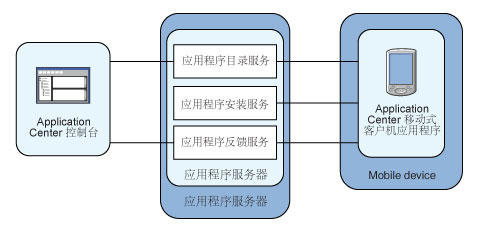

<!-- NLS_CHARSET=UTF-8 -->
## 概述
{: #overview }
了解有关 {{ site.data.keys.mf_app_center_full }} 的信息：其用途、不同的组件和功能，以及如何使用控制台和客户机。

移动设备的销量现已超出了个人计算机。 因此，移动应用程序对于企业至关重要。  
Application Center 是一种便于在组织内共享移动应用程序的工具。

您可以将 Application Center 用作企业应用商店。 通过 Application Center，您可以使某些移动应用程序以公司内的特定用户组为目标。

开发团队还可以在应用程序的开发阶段使用 Application Center 来与公司内的测试员、设计者或者主管共享应用程序。 在此类场景中，开发流程所涉及的所有人员之间可以更轻松地进行协作。

> 您还可以查看 [Application Center 教程](app-center-tutorial)。

#### 跳至：
{: #jump-to }
* [Application Center 概念](#concept-of-application-center)
* [特定平台需求](#specific-platform-requirements)
* [常规体系结构](#general-architecture)
* [初步信息](#preliminary-information)
* [下一步是什么](#whats-next)

## Application Center 概念
{: #concept-of-application-center }
Application Center 可以用作企业应用商店，也是在公司内的不同团队成员之间共享信息的一种方式。

Application Center 的概念类似于 Apple 通用应用商店或 Android Market 的概念，但它专供公司内部使用。

通过 Application Center，来自同一公司或组织的用户可以从用作移动应用程序存储库的单一位置中，将应用程序下载到手机或平板电脑上。

Application Center 将设备本身上安装的移动应用程序作为目标。 这些应用程序可以是使用设备 SDK 构建的本机应用程序或者混合了本机内容和 Web 内容的混合应用程序。 Application Center 不会将移动 Web 应用程序作为目标；可通过 URL（与 Web 站点类似）将此类应用程序交付到移动设备 Web 浏览器。

在当前版本中，Application Center 支持为 Google Android 平台、Apple iOS 平台、Windows Phone 8 平台、Windows 8 平台和 Windows 10 平台构建的应用程序。

对于 Windows Phone，当前仅支持 Windows Phone 应用程序包 (.xap) 文件格式。 我们还支持 Windows 10 UWP 应用程序包 (.appx) 文件格式。 对于 Windows Store（桌面应用程序），支持应用程序包 (.appx) 文件格式。

当前版本的 Application Center 不支持 Windows Phone 7、Windows RT 和 BlackBerry OS。

Application Center 可管理移动应用程序；它支持任何类型的 Android、iOS、Windows Phone 8、Windows 8 应用程序或 Windows 10 应用程序，包括基于 {{ site.data.keys.product }} 构建的应用程序。

可以在应用程序的开发过程中使用 Application Center。 Application Center 的典型场景是由一个团队构建移动应用程序；开发团队创建新版本的 Android、iOS、Windows Phone、Windows 8 或 Windows 10 UWP 应用程序。 开发团队希望此新版本由更多团队成员复审和测试。 开发人员转至 Application Center 控制台，并将新版本的应用程序上载到 Application Center。 作为此过程的一部分，此开发人员可以输入应用程序版本的描述。 例如，描述可以提及开发团队基于先前的版本添加或修订的元素。 然后该应用程序的新版本可供团队的其他成员使用。

另一个人（例如，beta 测试员）可以启动 Application Center 安装程序（即移动式客户机）以在可用应用程序列表中查找此新版本的移动应用程序，然后将其安装在自己的移动设备上。 在测试新版本之后，此 beta 测试员可以对该应用程序评级并提交反馈。 开发人员可以从 Application Center 控制台中看到此反馈。

Application Center 是在公司或团队内共享移动应用程序的一种便捷方式，也是在团队成员之间共享信息的一种方式。

## 特定平台需求
{: #specific-platform-requirements }
不同的操作系统对于在相应移动设备上部署、安装或使用应用程序有不同的要求。

### Android
{: #android }
必须配置移动设备，以支持从未知源安装。 Android 设置中可找到相应的切换。 请参阅 [User Opt-in for apps from unknown sources](http://developer.android.com/distribute/open.html#unknown-sources)，以获取详细信息。  

在 Application Center 中，应用程序具有内部版本号和商业版本号。 内部版本号用于区别哪个版本更新，而商业版本仅用作参考显示字符串。 对于 Android 应用程序，内部版本为来自应用程序清单的 android:[versionCode](http://developer.android.com/guide/topics/manifest/manifest-element.html#vcode)，并且此版本号必须为整数。

### iOS
{: #ios }
通过 Application Center 管理的所有应用程序都必须按照“特别分发版”打包。 通过 iOS 开发人员帐户，
您最多可与 100 个 iOS 设备共享应用程序。 通过 iOS 企业帐户，您可与无限多的 iOS 设备共享内部应用程序。 请参阅 [iOS Developer Program](https://developer.apple.com/programs/ios/distribute.html) 和 [iOS Enterprise Program](https://developer.apple.com/programs/ios/enterprise/)，以获取详细信息。
在 Application Center 中，应用程序具有内部版本号和商业版本号。 内部版本号用于区别哪个版本更新，而商业版本仅用作为参考显示字符串。 对于 iOS 应用程序，内部版本为来自应用程序清单 **Info.plist** 的 CFBundleVersion。 版本号必须采用以下格式：`a`、`a.b` 或 `a.b.c`，其中 `a`、`b` 和 `c` 为非负整数，`a` 不为 `0`。

### Windows Phone 8
{: #windows-phone-8 }
应用程序不是从 Windows Store 安装的，而是从 Application Center 安装的，这就是 Microsoft 文档中所谓的**公司主数据中心**。 请参阅 [Company app distribution for Windows Phone](http://msdn.microsoft.com/en-us/library/windowsphone/develop/jj206943%28v=vs.105%29.aspx)，以获取详细信息。
要使用公司主数据中心，Windows Phone 要求您向 Microsoft 注册一个公司帐户，并使用公司证书签署所有应用程序（包括 Application Center 客户机）。 只有签署的应用程序才可以通过 Application Center 进行管理。

必须通过与公司帐户关联的应用程序注册标记注册所有移动设备。

Application Center 可帮助您通过用于分发应用程序注册标记的工具来注册设备。 [请参阅“Windows 8 Universal 中的应用程序注册标记”以获取详细信息](appcenter-console/#application-enrollment-tokens-in-windows-8-universal)。

Application Center 支持以 Windows Phone 应用程序包 (.xap) 文件（针对 Microsoft
Windows Phone 8.0 和 Microsoft
Windows Phone 8.1）形式分发应用程序。 在 Microsoft Windows Phone 8.1 中，Microsoft 引入了一种新的通用格式，即针对 Windows Phone 的应用程序包 (.appx) 文件。 目前，Application Center 不支持分发针对 Microsoft
Windows Phone 8.1 的应用程序包 (.appx) 文件，而仅限于 Windows Phone 应用程序包 (.xap) 文件。

在 Application Center 中，应用程序只有一个版本号。 此版本号用于区别哪个版本更新。 对于 Windows Phone 8 应用程序，版本号位于 **WMAppManifest.xml** 文件的 **Version** 字段中。 此版本号必须采用以下格式：`a.b.c.d`，其中 `a`、`b`、`c` 和 `d` 为非负整数。

### Windows 8
{: #windows-8 }
Application Center 移动式客户机以一般的桌面可执行文件 (.exe) 形式提供。 可使用此客户机在设备上安装 Windows Store 应用程序（打包为 .appx 文件）。
在不使用 Windows Store 的情况下在设备上安装 appx 类型的文件称为侧加载应用程序。要侧加载应用程序，您必须遵循 [Prepare tosideload apps](http://technet.microsoft.com/fr-fr/library/dn613842.aspx) 中的先决条件。 Windows 8.1 更新可简化侧加载的先决条件。 有关更多信息，请参阅 [Sideloading store apps to Windows 8.1 devices](http://blogs.msdn.com/b/micham/archive/2014/05/30/sideloading-store-apps-to-windows-8-1-devices.aspx)。

在基于 ARM 的平板电脑上不能执行类型为 .exe 的文件，因此 Application Center 不支持 Windows RT，而只支持 Windows 8 和 Windows 8.1。

设备用户需要具有设备的管理员权限才能够执行 Application Center 客户机操作。

Application Center 未提供任何预定义方式来分发移动式客户机。

在 Application Center 中，应用程序只有一个版本号。 此版本号用于区别哪个版本更新。 对于 Windows 8 应用程序，版本号位于 AppxManifest.xml 文件的 Version 字段中。 此版本号必须采用以下格式：a.b.c.d（其中 a、b、c 和 d 为非负整数）。

### Windows 10 UWP
{:  #windows-10-uwp}

Application Center 随附用于安装 UWP 应用程序的 Windows 10 UWP 客户机项目。 您可以在 Visual Studio 中打开项目，并创建二进制文件（例如：**.appx**）以用于分发。 Application Center 未提供预定义方法来分发移动式客户机。

在 Application Center 中，应用程序只有一个版本号。 此版本号用于区别哪个版本更新。 对于 Windows 10 UWP 应用程序，版本号位于 **Package.appxmanifest** 文件的 _**Version**_ 字段中。 此版本号必须采用以下格式：a.b.c.d（其中 a、b、c 和 d 为非负整数）。


## 常规体系结构
{: #general-architecture }
Application Center 由以下主要元素组成：服务器端组件、存储库、管理控制台和移动式客户机应用程序。

### 服务器端组件
{: #server-side-component }
服务器端组件是必须部署在 Web 应用程序服务器（例如 IBM WebSphere 或 Apache Tomcat）中的 Java™ 企业应用程序。

服务器端组件包含管理控制台和移动应用程序。 此移动应用程序会安装可供客户机组件使用的移动应用程序。

Web 控制台和安装应用程序通过 REST 服务与服务器组件进行通信。

Application Center 服务器端组件由多项服务组成；例如，列出可用应用程序的服务、向移动设备交付应用程序二进制文件的服务，或者注册反馈和评级的服务。

### 存储库
{: #repository }
这是用于存储信息（如在哪些设备上安装了哪个应用程序）、有关应用程序的反馈以及移动应用程序二进制文件的数据库。 当您为特定 Web 应用程序服务器和受支持的数据库配置 Application Center 时，Application
Center 应用程序与该数据库关联。

### 管理控制台
{: #administration-console }
这是一种 Web 控制台，管理员可以通过此控制台管理应用程序、针对安装应用程序的用户访问权、有关移动应用程序的用户反馈以及有关在设备上安装的应用程序的详细信息。 请参阅 [Application Center 控制台](appcenter-console)。

### 移动式客户机应用程序
{: #mobile-client-application }
您可以使用移动式客户机在移动设备上安装应用程序，并向服务器发送有关某个应用程序的反馈。 请参阅[移动式客户机](mobile-client)。

下图显示了体系结构的概述。



通过 Application Center 控制台，您可以执行以下操作：

* 上载不同版本的移动应用程序。
* 除去不需要的应用程序。
* 控制对应用程序的访问权：每个应用程序都与可安装应用程序的人员列表关联。
* 查看移动用户发送的有关应用程序的反馈。
* 获取有关在设备上安装的应用程序的信息。
* 取消激活某个应用程序，以使其在可供下载的应用程序的列表中不可见。

通过移动式客户机，您可以执行以下操作：

* 列出可用移动应用程序。
* 在设备上安装新的应用程序。
* 发送有关某个应用程序的反馈。

Application Center 支持针对 Android、iOS、Windows Phone 8 和 Windows 8 设备的应用程序。 因此，针对 Android、iOS、Windows Phone 8 和 Windows 8，移动式客户机分别随附了独立版本。

Android、iOS 和 Windows Phone 8 移动式客户机是基于 {{ site.data.keys.product }} 构建的。 要了解如何在安装产品后在各种 Java 应用程序服务器上配置 Application Center 服务器端组件以及如何为 Application Center 客户机构建 {{ site.data.keys.product_adj }} 应用程序，请参阅[在安装后配置 Application Center](../installation-configuration/production/appcenter)。

## 初步信息
{: #preliminary-information }
要使用 Application Center，您必须配置安全设置，启动安装了 {{ site.data.keys.product }} 的 Web 应用程序服务器，启动 Application Center 控制台，然后登录。

安装 {{ site.data.keys.product }} 时，Application Center 会自动安装在指定的应用程序服务器中。

如果在 WebSphere Application Server Liberty Profile 中安装 Application Center，那么会在 **installation-directory/server** 中创建服务器。

在安装完成后，您必须为应用程序配置安全设置。 请参阅[为 Application Center 配置用户认证](../installation-configuration/production/appcenter#configuring-user-authentication-for-application-center)，或者如果要使用 LDAP 认证，请参阅[使用 LDAP 管理用户](../installation-configuration/production/appcenter/#managing-users-with-ldap)。

### 示例：在 Liberty Profile 上启动服务器和 Application Center 控制台
{: #example-starting-the-server-and-the-application-center-console-on-liberty-profile}

1. 使用位于 **installation-directory/server/wlp/bin** 目录中的 **server** 命令来启动 Liberty 服务器。

   ```bash
   server start worklightServer
   ```

2. 当服务器正在运行时，通过在浏览器中输入以下地址来启动 Application Center 控制台：`http://localhost:9080/appcenterconsole/`
3. 登录。 缺省情况下，已定义了两个用户，以用于在 Apache Tomcat 或 WebSphere Application Server Liberty Profile 上安装 Application Center。
    * **demo**，密码为 **demo**
    * **appcenteradmin**，密码为 **admin**

### 获取更多信息
{: #for-more-information }
要使用 Application Center 控制台，请参阅 [Application Center 控制台](appcenter-console)。

要在以下操作系统上安装和运行移动式客户机，请参阅：

* Android：请参阅[在 Android 移动设备上安装客户机](mobile-client/#installing-an-application-on-an-android-device)。
* iOS 操作系统：请参阅[在 iOS 移动设备上安装客户机](mobile-client/#installing-an-application-on-an-ios-device)。
* Windows Phone 8：请参阅[在 Windows8 Universal 上安装客户机](mobile-client/#installing-the-client-on-a-windows-phone-8-universal-mobile-device)。
* Windows 8：Windows 8 移动式客户机不能部署到 Application Center 中以供稍后分发。 请参阅 [Microsoft Windows 8：构建项目](preparations/#microsoft-windows-8-building-the-project)。
* Windows 10 UWP：请参阅[在 Windows 10 设备上安装 Windows 10 UWP 客户机](mobile-client/#installing-windows-10-uwp-client-on-windows-10-device)。

## 下一步是什么
{: #whats-next }
请遵循下列主题来使用 appcenter 移动式客户机；向已安装的应用程序发送通知；了解 appcenter 控制台、命令行工具和移动式客户机；以及设置日志级别。
