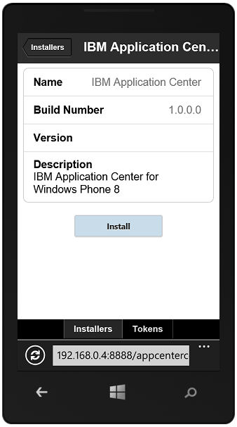
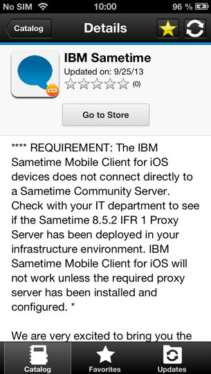

<!-- NLS_CHARSET=UTF-8 -->
## 概述
{: #overview }
您可以使用 Application Center 移动式客户机在自己的移动设备上安装应用程序。

Application Center 移动式客户机是在 Android、iOS、Windows Phone 或 Windows 设备上运行的应用程序。当前版本的 Application Center 仅支持 Windows Phone 8。您可以使用移动式客户机来列出 Application Center 中可用应用程序的目录。您可以在自己的设备上安装这些应用程序。移动式客户机有时也称为 Application Center 安装程序。如果您要在设备上安装专用应用程序存储库中的应用程序，那么此应用程序必须存在于设备上。

### 先决条件
{: #prerequisites }
您的系统管理员必须为您提供用户名和密码，然后您才能下载和安装移动式客户机。每当您在自己的设备上启动移动式客户机时，用户名和密码是必需的。对于 Windows Store 应用程序，移动式客户机仅在运行时才需要用户名和密码。出于安全原因，请勿公开这些凭证。这些凭证是用于登录 Application Center 控制台的相同凭证。

#### 跳至：
{: #jump-to }
* [在 Android 移动设备上安装客户机](#installing-the-client-on-an-android-mobile-device)
* [在 iOS 移动设备上安装客户机](#installing-the-client-on-an-ios-mobile-device)
* [在 Windows Phone 8 Universal 移动设备上安装客户机](#installing-the-client-on-a-windows-phone-8-universal-mobile-device)
* [登录视图](#the-login-view)
* [Application Center 客户机中的视图](#views-in-the-application-center-client)
* [在 Android 设备上安装应用程序](#installing-an-application-on-an-android-device)
* [在 iOS 设备上安装应用程序](#installing-an-application-on-an-ios-device)
* [在 Windows Phone 设备上安装应用程序](#installing-an-application-on-a-windows-phone-device)
* [在 Windows 设备上安装 Windows Store 应用程序](#installing-a-windows-store-application-on-a-windows-device)
* [通过通用应用商店安装应用程序](#installing-applications-through-public-app-stores)
* [除去已安装的应用程序](#removing-an-installed-application)
* [显示特定应用程序版本的详细信息](#showing-details-of-a-specific-application-version)
* [更新应用程序](#updating-an-application)
* [自动升级 Application Center 客户机](#upgrading-the-application-center-client-automatically)
* [还原已安装的应用程序](#reverting-an-installed-application)
* [标记或取消标记收藏的应用程序](#marking-or-unmarking-a-favorite-app)
* [提交已安装应用程序的评论](#submitting-a-review-for-an-installed-application)
* [查看评论](#viewing-reviews)

## 在 Android 移动设备上安装客户机
{: #installing-the-client-on-an-android-mobile-device }
您可以通过在浏览器中输入访问 URL，输入您的凭证，并完成所需的步骤，从而在 Android 移动设备上安装移动式客户机或标记有安装程序标志的任何已签署应用程序。

1. 在移动设备上启动浏览器。
2. 在地址文本字段中输入以下访问 URL：`http://hostname:portnumber/applicationcenter/installers.html`

    其中 hostname 是服务器的地址，portnumber 是安装 Application Center 的端口号。系统管理员可以提供此信息。

    Application Center 还提供用于在移动设备上安装客户机的替代 URL：`http://hostname:portnumber/applicationcenter/inst.html`。此 URL 的页面在某些较旧的或某些非标准的移动 Web 浏览器上显示效果更佳。如果 installers.html 页面在您的移动设备上无法正常显示，那么可以使用 inst.html。仅提供该页面的英文版本并未翻译为其他语言。

    如果尝试打开使用 HTTPS 的页面并使用自签名证书，那么较旧的 Android 浏览器将无法打开该页面。在此情况下，您必须使用非自签名证书或者使用 Android 设备上的其他浏览器，例如，Firefox、Chrome 或 Opera。在 Android 4 及更高版本中，Android 浏览器会显示一条有关 SSL 证书的安全性警告，但是允许您在确认同意使用不安全的连接后继续使用该 Web 站点。

3. 请输入您的用户名和密码。验证您的用户名和密码后，会在浏览器中显示与设备兼容的安装应用程序的列表。通常在此列表中仅显示一个应用程序，即移动式客户机。

4. 如果 Web 服务器使用自签名的 CA 证书，那么请在设备上至少安装一次该证书。Application Center 管理员应当提供此证书；请参阅[在 Application Center 测试环境中管理和安装自签名 CA 证书](../../installation-configuration/production/appcenter/#managing-and-installing-self-signed-ca-certificates-in-an-application-center-test-environment)以获取详细信息。
    * 点击 **SSL 证书**选项卡并选择证书。

    * 点击**安装**。只能对设备执行一次该操作。
通过在设备上查看**设置 → 安全性 → 可信凭证 → 用户**，可以验证是否已安装了证书。该视图显示用户已安装在设备上的 SSL 证书。
如果未在设备上安装自签名 CA 证书，那么 Android 操作系统会阻止您在以下步骤中下载移动式客户机。

    Application Center 管理员必须安装移动式客户机应用程序，然后您才能在可用应用程序列表中看到移动式客户机。管理员会将移动式客户机上载至 Application Center，并将 **Installer** 属性设置为 **true**。请参阅[应用程序属性](../appcenter-console/#application-properties)。

    
    
5. 选择列表中的某项以显示应用程序详细信息。通常，这些详细信息包含应用程序名称及其版本号。

    

6. 轻击**立即安装**以下载移动式客户机。在较新的 Android 设备上，可能会出现一个问题，要求提供 Chrome 的许可权以访问设备上的介质文件。
选择“是”。可能会显示一条有关潜在有害文件的警告。选择依旧保留该 APK 文件的选项。

7. 启动 **Android 下载**应用程序。选择 Application Center 客户机安装程序。
8. 选择 Application Center 客户机安装程序。选择安装应用程序时，您可以看到授予该应用程序的访问权。

    
    
9. 选择**安装**以安装移动式客户机。
10. 安装应用程序时，选择**打开**以打开移动式客户机，或者选择**完成**以关闭“下载”应用程序。

APK 文件可能会因以下某原因而失败：

* 设备可能没有足够的可用内存。
* 设备无法识别服务器的 SSL 证书。

在第一次通过“下载”应用程序安装应用程序时，您可能收到了一个请求，要求确认 Google 是否应当定期检查设备活动中的安全性问题。您可以根据自己的偏好接受或拒绝。
您所做的选择不会影响 Application Center 客户机。

安装可能会因以下某原因而被阻止：

* 设备不允许从未知来源安装。
请转至设备上的**设置 → 安全性**，然后启用**未知来源（允许从未知来源安装）**。
* 设备已安装了同一应用程序，但使用不同的证书签名。
对此，您必须除去该应用程序，然后在使用其他签名证书的设备上安装该应用程序。

## 在 iOS 移动设备上安装客户机
{: #installing-the-client-on-an-ios-mobile-device }
您可以通过在浏览器中输入访问 URL，输入您的凭证，并完成所需的步骤，从而在 iOS 移动设备上安装移动式客户机或标记有安装程序标志的任何已签署应用程序。

> **要点：**要在 iOS 设备上安装应用程序，首先必须为 Application Center 服务器配置 SSL。请参阅[配置安全套接字层 (SSL)](../../installation-configuration/production/appcenter/#configuring-secure-sockets-layer-ssl)。IBM Application Center 服务的 **ibm.appcenter.ios.plist.onetimeurl** JNDI 属性可控制在 iOS 移动设备上安装移动式客户机时是否使用一次性 URL。将此属性设置为 false 可实现最大的安全性。
将此属性设置为 false 时，用户在安装移动式客户机时必须多次输入其凭证：选择客户机时输入一次，安装客户机时输入一次。

将此属性设置为 true 时，用户只需输入一次凭证。当用户输入凭证时，会生成带有加密散列的临时下载 URL。
此临时下载 URL 有效期为 1 小时，无需再进行认证。此解决方案是安全性和便利性之间的折中。

指定 **ibm.appcenter.ios.plist.onetimeurl** JNDI 属性的步骤与指定 **ibm.appcenter.proxy.host property** 的步骤类似。请参阅[定义应用程序资源的端点](../../installation-configuration/production/appcenter/#defining-the-endpoint-of-the-application-resources)。

在 iOS 设备上安装移动式客户机类似于在 Android 上进行安装，但是存在某些区别。在下载之后，安装程序会直接自动启动。
几乎针对所有安装步骤都会请求您输入用户名和密码凭证。

1. 在移动设备上启动浏览器。
2. 在地址字段中输入以下访问 URL：`http://hostname:portnumber/applicationcenter/installers.html`

    其中 hostname 是服务器的地址，portnumber 是安装 Application Center 的端口号。系统管理员可以提供此信息。

    Application Center 还提供用于在移动设备上安装客户机的替代 URL：`http://hostname:portnumber/applicationcenter/inst.html`。此 URL 的页面在某些较旧的或某些非标准的移动 Web 浏览器上显示效果更佳。如果 **installers.html** 页面在您的移动设备上无法正常显示，您可以使用 **inst.html**。仅提供该页面的英文版本，并未翻译为其他语言。

    如果打开使用 HTTPS 的页面并使用自签名证书，那么浏览器会显示一条有关 SSL 证书的安全性警告，但是您可以在确认同意使用不安全的连接后继续使用该 Web 站点。

3. 请输入您的用户名和密码。请参阅[移动式客户机中的先决条件](../preparations)。

    验证您的用户名和密码后，会在浏览器中显示与设备兼容的安装应用程序的列表。通常在此列表中仅显示一个应用程序，即移动式客户机。

    如果打开使用 https 的页面：
    * 如果 Web 服务器使用可信认证中心提供的真实 SSL 证书，那么继续步骤 5。
    * 如果 Web 服务器使用自签名的 CA 证书，那么继续步骤 4。

4. 如果 Web 服务器使用自签名的 CA 证书，那么请在设备上至少安装一次该证书。

    Application Center 管理员将提供该证书。请参阅[在 Application Center 测试环境中管理和安装自签名 CA 证书](../../installation-configuration/production/appcenter/#managing-and-installing-self-signed-ca-certificates-in-an-application-center-test-environment)以获取详细信息。

    * 点击“SSL 证书”选项卡并选择证书。

    * 点击“安装”。只需对设备执行一次该操作。通过在设备上查看**设置 → 常规 → 概要文件**，可以验证是否已安装了证书。该视图显示用户已安装在设备上的 SSL 证书。如果未在设备上安装自签名 CA 证书，那么 iOS 操作系统会阻止您在以下步骤中下载移动式客户机。

    
    Application Center 管理员必须安装移动式客户机应用程序，然后您才能在可用应用程序列表中看到移动式客户机。管理员会将移动式客户机上载到 Application Center，并将 Installer 属性设置为 true。请参阅[应用程序属性](../appcenter-console/#application-properties)。
    
5. 点击**安装程序**选项卡并选择列表中的某项以显示应用程序详细信息。
6. 点击**安装**以下载移动式客户机。
7. 输入您的凭证以授权下载程序事务。
8. 要授权下载，请轻击**安装**。

    
    
9. 输入您的凭证以授权安装。
10. 关闭浏览器。

    应用程序图标将显示在主屏中，并且您可以在主屏上看到下载进度。

> **注：**在设备上安装应用程序需要一个供应概要文件来支持在所选设备上安装此应用程序。
如果您无意间尝试安装某个对设备无效的应用程序，那么部分 iOS 版本可能会尝试在无限循环中安装此应用程序，而从不会成功或指示任何错误。主屏中会出现显示安装进度的应用程序图标，但由于是无限循环，因此难以删除此应用程序图标以停止该无限循环。
变通方法是将此设备设定为飞行模式。
在此模式下，无限循环将停止，这样您可以按照删除 iOS 设备上应用程序的正常步骤来删除此应用程序图标。
安装可能会因以下某原因而被阻止：

* 应用程序的供应概要文件对设备无效。
必须使用其他供应概要文件签署此应用程序。

* 设备无权访问 Apple 服务器以确认供应概要文件的有效性。

* 设备无法识别服务器的 SSL 证书。

总之，仅当使用供应概要文件对 iOS 应用程序签名之后才能将其安装在设备上。请参阅[导入并构建项目（Android、iOS 和 Windows Phone）](../preparations/#importing-and-building-the-project-android-ios-windows-phone)。

从 iOS 9 起，打开公司应用程序时，根据供应概要文件类型，可能会显示“不可信的企业开发人员”消息。此消息说明在此设备上尚未信任此供应概要文件。在此情况下，除非建立针对此供应概要文件的信任，否则不会打开此应用程序。只能针对每个供应概要文件建立一次信任。

要在安装应用程序后建立针对供应概要文件的信任：

#### 对于低于 iOS 9.1 的版本
{: #until-ios-91 }
1. 转至**设置 → 常规 → 概要文件**。在**企业应用程序**标题下，您会看到应用程序的供应概要文件。
2. 轻击概要文件并确认信任。

#### 从 iOS 9.2 起
{: #since-ios-92 }
1. 转至**设置 → 常规 → 概要文件 → 设备管理或概要文件和设备管理**。在**企业应用程序**标题下，您会看到应用程序的供应概要文件。
2. 轻击概要文件并确认信任。

确认信任后，所有使用此供应概要文件的应用程序都不会显示“不可信的企业开发人员”消息。有关更多信息，请访问 Apple Web 站点：[https://support.apple.com/en-us/HT204460](https://support.apple.com/en-us/HT204460)。

## 在 Windows Phone 8 Universal 移动设备上安装客户机
{: #installing-the-client-on-a-windows-phone-8-universal-mobile-device }
您可以通过在浏览器中输入访问 URL，输入您的凭证，并完成所需的步骤，从而在 Windows 8 Universal 上安装移动式客户机或标记有安装程序标志的任何已签署应用程序。必须在您的移动设备上预先安装公司帐户。

安装公司发布的应用程序之前，必须将公司帐户添加到您的移动设备上。必须将应用程序注册标记 (AET) 下载到 Windows Phone 设备上。该 AET 必须已经在 {{ site.data.keys.mf_server }} 上。使用 Application Center 控制台将其上载至 {{ site.data.keys.mf_server }}   。请参阅 [Windows 8 Universal 中的应用程序注册标记](../appcenter-console/#application-enrollment-tokens-in-windows-8-universal)以获取详细信息。

1. 在移动设备上启动浏览器。
2. 在地址文本字段中输入以下访问 URL：`http://hostname:portnumber/applicationcenter/installers.html`。

    其中 **hostname** 是服务器的地址，**portnumber** 是安装 Application Center 的端口号。系统管理员可以提供此信息。

    Application Center 还提供用于在移动设备上安装客户机的替代 URL：`http://hostname:portnumber/applicationcenter/inst.html`。此 URL 的页面在某些较旧的或某些非标准的移动 Web 浏览器上显示效果更佳。如果 **installers.html** 页面在您的移动设备上无法正常显示，您可以使用 **inst.html**。仅提供该页面的英文版本并未翻译为其他语言。

3. 输入您的凭证以授权访问服务器。在屏幕的下半部分中，有一个包含**安装程序**选项卡和**标记**选项卡的工具栏。

    
    
4. 轻击**标记**并在可用标记列表中选择应用程序注册标记，以显示标记详细信息。

    
    
5. 轻击**添加**，下载应用程序注册标记。
6. 轻击**添加**，添加公司帐户。

    
    
    Windows Phone 8 不提供有关添加公司帐户的任何反馈信息。

7. 轻击“后退”图标，返回到应用程序注册标记详细信息。
8. 轻击**安装程序**并在可用应用程序列表中选择移动式客户机应用程序。这样将显示应用程序的详细信息。
9. 轻击**安装**，下载所选应用程序。

    
    
10. 轻击**安装**，安装应用程序。

    
    
    Windows 8 Universal 不提供有关安装应用程序的任何反馈信息。

> **提示：**在设备上安装公司应用程序时，必须将设备连接到 Microsoft 服务器以验证应用程序签名。Microsoft 服务器有时候可能无响应。在此情况下，您可在几分钟之后再次尝试安装。请参阅“在 Windows Phone 设备上安装应用程序”以获取可能的错误消息。

完成安装之后，移动式客户机应用程序将在 Windows Phone 的应用程序列表中可用。

## 登录视图
{: #the-login-view }
在“登录”视图中，您可以访问连接到服务器（以查看可用于设备的应用程序列表）所需的字段。  
可使用“登录”视图输入您的凭证，以便连接到 Application Center 服务器来查看设备的可用应用程序列表。

“登录”视图会显示连接到服务器所需的信息的所有必填字段。  
启动应用程序时，会显示“登录”页面。登录凭证是连接到服务器所必需的。

在 iOS 设备上，凭证保存在密钥链中。在成功登录到 Application Center 服务器后，当您在稍后启动应用程序时，将不显示登录页面并使用先前的凭证。如果登录失败，将显示登录视图。

#### 用户名和密码
{: #user-name-and-password }
输入您的凭证以访问服务器。这些是系统管理员授予的用于下载和安装移动式客户机的相同用户名和密码。

#### Application Center 服务器地址
{: #application-center-server-address }
Application Center 服务器地址包含以下元素：

* 主机名或 IP 地址。
* 端口（如果使用缺省端口，那么是可选的）。
* 上下文（如果在服务器根目录中安装 Application Center，那么是可选的）。

在电话上，针对地址的每个部分提供了一个字段。

在平板电脑上，会显示包含预格式化的示例地址的单个字段。将其用作输入正确服务器地址的范例，以避免格式化错误。请参阅[准备使用移动式客户机](../preparations)，以提前获取有关填充地址中各个部分的信息，或者对地址进行硬编码并隐藏相关字段。

#### 安全套接字层 (SSL)
{: #secure-socket-layer-ssl }
SSL 在 iOS 设备上是必需的。因此，该选项未在登录视图中显示。在所支持的其他操作系统上，选择 SSL，为网络通信开启 SSL 协议。如果在 SSL 处于选中状态时再次轻击该字段，将关闭 SSL。

如果 Application Center 服务器配置为通过 SSL 连接运行，那么 SSL 选项可用。当服务器未配置为处理 SSL 层时选择 SSL 会阻止您连接到服务器。系统管理员可以告知您 Application Center 是否通过 SSL 连接运行。

### 连接至服务器
{: #connecting-to-the-server }
要连接至服务器：

1. 输入您的用户名和密码。
2. 输入您的 Application Center 服务器地址。
3. 如果您的 Application Center 配置通过 SSL 协议运行，请选择 **SSL**。
4. 轻击**登录**以连接到服务器。

如果此登录成功，那么会保存用户名和服务器地址以便在后续启动客户机时用于填充这些字段。

## Application Center 客户机中的视图
{: #views-in-the-application-center-client }
此客户机提供适合您要执行的各种任务的视图。  
成功登录之后，您可以在这些视图中进行选择。

使用这些视图可与服务器通信以发送或检索有关应用程序的信息，或者管理位于您的设备上的应用程序。

Windows 8 客户机主屏在每个类别中最多可显示 6 个应用程序。
在 Windows 8 客户机上，如果您需要某一类别中应用程序的完整列表，请单击该类别的标题。

以下是不同视图的描述：

* **目录**。此视图显示可安装在设备上的应用程序。
* **收藏夹**。此视图显示您标记为收藏项的应用程序的列表。
* **更新**。此视图显示您标记为收藏的应用程序并且在 Application Center 中存在高于设备上已安装版本（如有）的版本的所有应用程序。

首次启动移动式客户机时，它会为您打开“登录”视图以便您输入自己的用户名、密码和 Application Center 服务器的地址。
此信息为必填信息。

### 在不同的设备类型上显示
{: #displays-on-different-device-types }
虽然视图中可执行的常用功能对于所有操作系统都是相同的，但是视图布局特定于 Android、iOS、Windows Phone 或 Windows 8 环境。不同的设备类型可能具有不同的页面显示。在电话上，会显示一个列表。
在平板电脑上，会使用应用程序网格。

### 视图的功能
{: #features-of-the-views }
在 Android 或 iOS 平板电脑上，您可以通过轻击某个排序条件对列表进行排序。  
在 Windows Phone、Android 或 iOS 手机上，可通过排序按钮使用排序条件。  
在 Windows 8 客户机上，您可以对某一类别中的应用程序列表进行排序。要对应用程序排序，请从**排序方式**字段中的排序条件列表中进行选择。

标记为收藏项的应用程序通过在应用程序图标上叠放星型来指示。

通过使用若干个星型和收到的评级数来显示应用程序的最新版本的平均评级。请参阅[准备使用移动式客户机](../preparations)，以了解如何显示应用程序的所有版本的评级，而不是仅显示最新的版本。

轻击列表中的应用程序会打开此应用程序的最新安装版本的“详细信息”视图。

要刷新视图，请轻击刷新按钮：。或者，在 Windows 8 上，轻击 。

要返回至登录页面：

* 在 Android、iOS 和 Windows Phone 应用程序上，轻击注销按钮：
* 在客户机的 Windows 8 版本中，轻击注销按钮：

### “详细信息”视图
{: #the-details-view }
轻击“目录”、“收藏夹”或“更新”视图中的应用程序会打开“详细信息”视图，您可以在其中查看应用程序属性的详细信息。应用程序版本的详细信息会显示在此视图中。

在 Android、iOS 和 Windows Phone 客户机上，将显示应用程序版本的以下详细信息：

* 应用程序的名称。
* 商业版本：应用程序的已发布版本。
* 内部版本：在 Android 上，为应用程序的内部版本标识；在 iOS 上，为应用程序的构建号。请参阅[应用程序属性](../appcenter-console/#application-properties)，以获取所有操作系统上关于此属性的技术详细信息。
* 更新日期。
* 应用程序文件的大概大小。
* 版本的评级和收到的评级数。
* 应用程序的描述。

在 Windows 8 客户机上，将显示应用程序版本的以下详细信息：

* 应用程序名称。
* 版本。
* 供应商名称。
* 更新日期。
* 版本的评级和收到的评级数。
* 当前版本或当前应用程序的所有版本的现有评论。

可以在此视图中执行以下操作。

* 安装、升级、降级或卸载某个应用程序版本。
* 取消正在进行的当前操作（如有）。
* 对已安装在设备上的应用程序版本评级。
* 列出应用程序的此版本或所有版本的评论。
* 显示先前版本的详细信息。
* 将该应用程序标记或取消标记为收藏的应用程序。
* 使用来自 Application Center 服务器的最新更改刷新此视图。

## 在 Android 设备上安装应用程序
{: #installing-an-application-on-an-android-device }
通过**详细信息**视图，可以在 Android 设备上安装应用程序。  
在“详细信息”视图中，如果未安装应用程序的先前版本，那么可以在 Android 设备上安装此应用程序版本。

1. 在**详细信息**视图中，轻击**安装**。

    这样会下载该应用程序。您可以在下载期间随时轻击**详细信息**视图中的**取消**以取消下载。（**取消**按钮仅在安装步骤期间显示。）如果您让下载完成，那么将看到授予应用程序的权利。

    

2. 轻击**安装**以确认安装应用程序，或者轻击**取消**以取消安装。

    根据所采取的操作，会安装或不安装该应用程序。应用程序安装成功之后，还会将其标记为收藏的应用程序。

    如果您选择了**取消**，那么在应用程序权利确认面板中，您可以随时轻击**详细信息**视图中的**取消**以通知应用程序安装已取消。仅在执行安装步骤期间才会在“详细信息”视图中显示**取消**按钮。

## 在 iOS 设备上安装应用程序
{: #installing-an-application-on-an-ios-device }
通过**详细信息**视图，您可以在 iOS 移动设备上安装应用程序版本。

> **要点：**要在 iOS 设备上安装应用程序，首先必须为 Application Center 服务器配置 SSL。请参阅[配置安全套接字层 (SSL)](../../installation-configuration/production/appcenter/#configuring-secure-sockets-layer-ssl)。
1. 在**详细信息**视图中，轻击**安装**。系统会请求您确认下载和安装应用程序版本。
2. 轻击**安装**以确认下载和安装应用程序版本，或者轻击**取消**以取消安装。

    
    
    根据所采取的操作，会安装或不安装该应用程序。应用程序安装成功之后，还会将其标记为收藏的应用程序。

    在设备上安装应用程序需要一个供应概要文件来支持在所选设备上安装此应用程序。
如果无意间尝试安装某个对设备无效的应用程序，那么 iOS 6（不推荐）或先前版本会给出一条错误消息。
    
与 Android 客户机不同，安装完成后，“**详细信息**”视图中的**安装**按钮不会将其标签更改为**卸载**。在 iOS 中，没有**卸载**按钮可用。
只能通过主屏来卸载应用程序。

iOS 7 的部分版本可能会尝试在无限循环中安装此应用程序，而从不会成功或指示任何错误。
主屏中会出现显示安装进度的应用程序图标，但由于是无限循环，因此难以删除此应用程序图标以停止该无限循环。
变通方法是将此设备设定为飞行模式。
在此模式下，无限循环将停止，这样您可以按照删除 iOS 设备上应用程序的正常步骤来删除此应用程序图标。

在设备上安装应用程序之后，可以将其打开。

总之，仅当使用供应概要文件对 iOS 应用程序签名之后才能将其安装在设备上。请参阅[导入并构建项目（Android、iOS 和 Windows Phone）](../preparations/#importing-and-building-the-project-android-ios-windows-phone)。

从 iOS 9 起，打开公司应用程序时，根据供应概要文件类型，可能会显示“不可信的企业开发人员”消息。此消息说明在此设备上尚未信任此供应概要文件。在此情况下，除非建立针对此供应概要文件的信任，否则不会打开此应用程序。只能针对每个供应概要文件建立一次信任。

要在安装应用程序后建立针对供应概要文件的信任：

#### 对于低于 iOS 9.1 的版本
{: #until-ios-91-app }
1. 转至**设置 → 常规 → 概要文件**。在**企业应用程序**标题下，您会看到应用程序的供应概要文件。
2. 轻击概要文件并确认信任。

#### 从 iOS 9.2 起
{: #since-ios-92-app }
1. 转至**设置 → 常规 → 概要文件 → 设备管理或概要文件和设备管理**。在**企业应用程序**标题下，您会看到应用程序的供应概要文件。
2. 轻击概要文件并确认信任。

确认信任后，所有使用此供应概要文件的应用程序都不会显示“不可信的企业开发人员”消息。有关更多信息，请访问 Apple Web 站点：[https://support.apple.com/en-us/HT204460](https://support.apple.com/en-us/HT204460)。

## 在 Windows Phone 设备上安装应用程序
{: #installing-an-application-on-a-windows-phone-device }
在**详细信息**视图中，您可在 Windows Phone 设备上安装公司应用程序。  
所选应用程序的**详细信息**视图显示有关想要安装的应用程序的信息。

1. 在**详细信息**视图中，轻击**安装**。这样会下载和安装该应用程序。您可以在下载应用程序期间随时轻击**取消**以取消该活动。
**取消**仅在安装过程的下载步骤期间显示。

    在安装流程的开始，将请求您确认是否想要将公司应用程序添加到安装在移动设备上的应用程序。

2. 轻击**安装**以确认安装应用程序，或轻击**取消**以取消安装。将该应用程序标记为收藏的应用程序。

    
    
> **提示：**在设备上安装公司应用程序时，必须将设备连接到 Microsoft 服务器以验证应用程序签名。Microsoft 服务器有时候可能无响应。在此情况下，您可在几分钟之后再次尝试安装。可能出现的错误消息如下：

* **该公司应用程序存在问题。请联系公司的支持人员以获取帮助。**

    您可能使用的是未签署的 Windows Phone 应用程序包 (.xap) 文件。在 Application Center 中使用应用程序包 (.xap) 文件之前，必须签署这些文件。如果 Microsoft 服务器无响应且无法验证公司应用程序的签名，也可能出现该消息。在此情况下，请在几分钟之后再次尝试安装。

* **安装该应用程序之前，您需要添加……公司帐户。**

    Windows Phone 应用程序包 (.xap) 文件已签署，但是该设备未注册公司应用程序。必须首先在设备上安装公司的应用程序注册标记。

* **尚未能联系到公司帐户来确保您可安装该应用程序...**

    可能是公司帐户到期或被阻塞，或者 Microsoft 服务器暂时无响应。
确保您的设备连接到因特网并连接到 Microsoft 服务器，然后再次尝试。

> **要点：**如果使用多个公司帐户注册设备，那么 Windows Phone 操作系统可能在以下消息中显示错误的公司帐户：**您想要安装来自 name 公司的应用程序吗？**。该消息不受 Application Center 控制。该情况只是显示问题，不影响功能。根据您所采取的操作，会安装或不安装该应用程序。

> **提示：**如果用于对要安装的应用程序的应用程序包 (.xap) 文件进行代码签名的 PFX 证书到期，那么将不会运行安装过程。Windows Phone 操作系统将返回一个错误，显示 **HRESULT 0x81030110**。当您更新 PFX 证书时，必须使用此新证书对 Application Center 目录中部署的所有应用程序重新进行代码签名。
> 
当您更新 PFX 代码签名证书时，还必须更新注册标记并将其部署在 Application Center 控制台上。
还必须使用此新标记向公司帐户重新注册设备。使用过期标记注册设备的用户不能安装任何应用程序。

在 Windows Phone 8.1 中，如果 Application Center 客户机未进行代码签名（例如，在 Visual Studio 中对其调试时），那么您将无法使用此未签署的客户机来安装任何应用程序。在这种情况下，Windows Phone 操作系统将返回一个错误，显示 **HRESULT 0x800703F0**。在 Windows Phone 8.1 中安装应用程序前，必须对客户机的应用程序包 (.xap) 文件进行代码签名。

## 在 Windows 设备上安装 Windows Store 应用程序
{: #installing-a-windows-store-application-on-a-windows-device }
使用侧加载通过 Application Center 安装 Windows Store 应用程序。

您必须查看您的配置是否满足“准备侧加载应用程序”中所述的应用程序侧加载先决条件。  
设备用户需要具有设备的管理员权限才能够执行 Application Center 客户机操作。

通过 Application Center 安装 APPX 包的过程可由一个称为“侧加载”的进程来完成。作为 Windows 8.1 更新的一部分，系统会针对属于 Active Directory 域的所有 Windows 8.1 Pro 设备启用侧加载，这与 Windows 8.1 Enterprise 的当前行为相一致。
如果使用任一此产品版本，并且设备属于 Active Directory 域，那么您不必担心侧加载密钥或激活侧加载。

当您开发 Windows Store 应用程序时，Microsoft Visual Studio 会自动生成一份自签名证书，并使用它对应用程序包进行代码签名。为了能够在以后使用 Application Center 安装应用程序，必须将该证书导入“本地计算机”的“可信根认证中心”库中。导入证书是一种手动完成的过程。

> **要点：**仅在开发阶段才需要手动安装证书，因为 APPX 代码签名依赖于 Microsoft Visual Studio 所生成的自签名证书。在生产中，必须使用从公认的根认证中心购买的真实证书来对 APPX 文件进行签名。该过程的第一步是告诉您在通过 Application Center 安装应用程序之前如何安装证书。

1. 将该证书导入到“本地计算机”的“可信根认证中心”库中。
    * 在使用 Visual Studio 生成 APPX 文件之后，将该文件放入您的文件系统中。在 APPX 文件的文件夹中，可以查看证书 (.cer) 文件，此文件包含您必须导入的自签名证书。

    * 要打开该证书，请双击 CER 文件。
    * 单击“安装证书”。    
    * 选择“本地计算机”，然后单击**下一步**。    
    * 选择“将所有证书放入下列库中”，然后浏览并选择“可信根认证中心”。    
    * 单击**下一步**，然后单击**完成**。您应确认已成功导入该证书。

下列步骤描述了如何通过使用 Application Center 在 Windows 设备上安装 Windows Store 应用程序。

1. 登录到 Windows Store 应用程序的 Application Center 移动式客户机。
2. 选择要安装的应用程序以访问其详细信息。

    

3. 要安装应用程序，请轻击**安装**。如果已安装了应用程序并且有其他可用版本，那么您可以决定是更新到较高版本还是还原至较低版本。

## 通过通用应用商店安装应用程序
{: #installing-applications-through-public-app-stores }
您可从移动式客户机链接至存储在受支持的通用应用商店中的应用程序，并遵循通用应用商店的常规过程在兼容设备上安装这些应用程序。

Application Center 管理员可创建到存储在受支持通用应用商店中的已选应用程序的链接，并使 Application Center 移动式客户机用户能够在与这些应用程序匹配的操作系统上使用这些链接。请参阅[从通用应用商店添加应用程序](../appcenter-console/#adding-an-application-from-a-public-app-store)。您可通过兼容设备上的移动式客户机安装这些应用程序。

设备的应用程序列表列出了存储在 Google
Play 中的 Android 应用程序链接和存储在 Apple iTunes 中的 iOS 应用程序链接，以及在企业内部创建的专用应用程序的二进制文件。

1. 从应用程序列表中选择存储在通用应用商店中的应用程序，以查看应用程序详细信息。您将看到“转至商店”，而不是“安装”。
2. 轻击**转至商店**以打开 Google play 或 Apple iTunes。

    **Android**
    
    
    **iOS**
    
    
3. 遵循通用应用商店的常规过程，安装应用程序。

## 除去已安装的应用程序
{: #removing-an-installed-application }
您可以除去安装在您的移动设备上的应用程序。

1. 启动对您设备的操作系统有效的除去过程。
    * **Android**：请参阅步骤 2 中的过程。
    * **iOS**：您只能从 iOS 主屏中除去应用程序，而不能通过 Application Center 客户机除去。使用常规 iOS 过程除去应用程序。
    * **Windows Phone**：您只能从 Windows Phone 主屏中除去应用程序，而不能通过 Application Center 客户机除去。使用常规 Windows Phone 过程除去应用程序。
    * **Windows Store**：您既可以通过 Application Center 移动式客户机除去应用程序，也可以从 Windows 主屏中除去应用程序。
2. **仅限 Android**：从 Android 设备除去应用程序。
    * 在任何版本的应用程序的**详细信息**视图中，轻击**卸载**。仅当已安装某个应用程序版本时，**卸载**按钮才会显示在**详细信息**视图中。系统会请求您确认是否要卸载该应用程序版本。
        * 轻击**卸载**以卸载应用程序版本，或者轻击**取消**以通知应用程序已取消卸载命令。

## 显示特定应用程序版本的详细信息
{: #showing-details-of-a-specific-application-version }
可以针对 Android 或 iOS 手机/平板电脑、Windows Phone 设备或 Windows 设备执行相应过程来显示所选应用程序版本的详细信息。

1. 针对您的设备选择相应的过程以显示移动设备上特定应用程序版本的详细信息。
    * 针对 Windows Phone、Android 或 iOS 手机；请参阅步骤 2。
    * 针对 Windows 设备；请参阅步骤 3
    * 针对平板电脑：请参阅步骤 4。
2. **仅限 Windows Phone、Android 和 iOS**：在 Windows Phone、Android 或 iOS 手机上显示特定应用程序版本的详细信息。
    * 轻击**选择版本**以浏览至版本列表视图。 
    * 轻击应用程序的相应版本。**详细信息**视图会更新并显示所选应用程序版本的详细信息。
3. 仅限 Windows：显示 Windows 设备上特定 Windows Store 应用程序版本的详细信息。如果 Windows Store 应用程序提供有多个版本，那么您可以选择想要安装的版本。
    * 轻击应用程序的相应版本。**详细信息**视图会更新并显示所选应用程序版本的详细信息。
4. 仅限平板电脑设备：显示平板电脑上特定应用程序版本的详细信息。
    * 轻击**选择版本**。
    * 在菜单中，选择相应的应用程序版本。**详细信息**视图会更新并显示所选应用程序版本的详细信息。

## 更新应用程序
{: #updating-an-application }
遵循该过程以使最新版本的收藏应用程序和推荐应用程序在您的设备上可用。标记为收藏项的应用程序和具有更新版本的应用程序会列在**更新**视图中。Application Center 服务器管理员标记为推荐的应用程序即使不是收藏的应用程序，也会列在**更新**视图中。

如果在服务器上有已安装应用程序的更新版本可用，那么此版本会列在**更新或推荐**下。

1. 在**更新**视图中，浏览至**详细信息**视图。
2. 在**详细信息**视图中，选择应用程序的更新版本或者采用最新的可用版本。
3. **Android 和 Windows 8 Universal**：在 Android 和 Windows 8 Universal 设备上，轻击**更新**。
4. **仅限 iOS**：在 iOS 设备上，轻击**安装最新版本**。
5. 遵循相应的应用程序安装过程进行操作。
    * [在 Android 设备上安装应用程序](#installing-an-application-on-an-android-device)
    * [在 iOS 设备上安装应用程序](#installing-an-application-on-an-ios-device)
    * [在 Windows Phone 设备上安装应用程序](#installing-an-application-on-a-windows-phone-device)
    * [在 Windows 设备上安装 Windows Store 应用程序](#installing-a-windows-store-application-on-a-windows-device)

## 自动升级 Application Center 客户机
{: #upgrading-the-application-center-client-automatically }
可以启用对客户机应用程序的新版本的自动检测。之后，可以选择是否在移动设备中下载和安装新版本。
iOS、Android 和 Windows Phone 支持该功能。

可以自动检测 Application Center 服务器上可用的新移动式客户机应用程序版本。
启用此功能时，可以在启动时或每次刷新“可用应用程序”视图时检测到更新的应用程序版本（如果存在）。

如果检测到应用程序的更新版本，系统将请求您下载并安装此更新版本。

缺省情况下，通过将 **appCenterAutoUpgrade** 属性设置为 **true** 启用了 Application Center 客户机应用程序的自动升级。该属性位于 Application Center 的 {{ site.data.keys.product_full }}    项目中：**IBMAppCenter/apps/AppCenter/common/js/appcenter/config.json**。

如果要禁用自动升级，必须将此属性设置为 false，并为所需平台重新构建项目。

1. 当检测到客户机的更新版本时，轻击**确定**以启动下载和安装序列。

    

2. 轻击**安装**以安装应用程序的更新版本。

    

3. 轻击**打开**以启动更新的应用程序。

    
    
必须登录到应用程序的更新版本才能够运行此版本。

**注：**要升级 Application Center 客户机，必须满足以下条件：

1. 新的 Application Center 客户机必须使用与旧客户机相同的包名或捆绑标识。
2. 在 iOS 上，必须使用与旧客户机相同的供应概要文件签署新的 Application Center 客户机。
3. 在 Android 上，新的 Application Center 客户机必须具有与旧客户机相同的签名。
4. 在 Windows Phone 上，必须使用与旧客户机相同的公司帐户签署新的 Application Center 客户机。

## 还原已安装的应用程序
{: #reverting-an-installed-application }
如果在服务器上存在先前版本的应用程序，那么您可以还原已安装应用程序的版本。

要将当前安装的应用程序版本替换为先前的版本，请从**目录**、**更新**或**收藏夹**视图中浏览至“详细信息”视图。在**详细信息**视图中，选择先前的版本。
请参阅[显示特定应用程序版本的详细信息](#showing-details-of-a-specific-application-version)，以获取有关如何在移动设备上显示特定应用程序版本的详细信息的信息。

### 在 Android 上
{: #on-android }
如果安装的 Android 操作系统版本低于 4.2.2，请轻击**还原**。  
如果安装的 Android 操作系统版本为 4.2.2 或更高版本，那么必须卸载当前版本，然后才能安装先前的版本。

然后，遵循[在 Android 设备上安装应用程序](#installing-an-application-on-an-android-device)中记录的过程。

### 在 iOS 上
{: #on-ios }
使用操作系统的正常过程来除去应用程序。  
轻击**安装**以安装应用程序的先前版本。遵循[在 iOS 设备上安装应用程序](#installing-an-application-on-an-ios-device)中记录的过程。

### 在 Windows Phone 上
{: #on-windows-phone }
轻击**还原**。
遵循[在 Windows Phone 设备上安装应用程序](#installing-an-application-on-a-windows-phone-device)中记录的过程。

## 标记或取消标记收藏的应用程序
{: #marking-or-unmarking-a-favorite-app }
标记收藏的应用程序或取消标记应用程序以将其从收藏夹列表中除去。

在设备上将应用程序标记为收藏项表示您关注此应用程序。然后，此应用程序会列在收藏的应用程序的列表中，以便于查找该应用程序。该应用程序会显示在属于您且与此应用程序兼容的每个设备上。如果在 Application Center 中提供了该应用程序的更新版本，那么该应用程序会列在**更新**视图中。

要将某个应用程序标记或取消标记为收藏的应用程序，请轻击**详细信息**视图的标题中的“收藏夹”图标 。  

已安装的应用程序会自动标记为收藏的应用程序。

## 提交已安装应用程序的评论
{: #submitting-a-review-for-an-installed-application }
您可以对移动设备上安装的应用程序版本进行评论；评论必须包含评级和评论。仅当移动设备上已安装某个应用程序版本时，您才能提交对该版本的评论。

1. 在**详细信息**视图中，开始评论。
    * 在 iOS 手机和平板电脑上，轻击**评论 VX**。
    * 在 Android 手机和平板电脑上，轻击**评论 VX**。
2. 输入评论星级（非零）。

    在带有触摸屏的移动设备上，轻击 1 到 5 颗星以表示您对该应用程序的版本的审核评级。一颗星表示最低级别的评论，五颗星表示最高级别的评论。

3. 输入关于此应用程序版本的评论。
4. 轻击**提交**以将您的评论发送给 Application Center。

## 查看评论
{: #viewing-reviews }
您可以查看应用程序的特定版本或所有版本的评论。  

评论按降序显示，最近的评论排在最前。
如果评论数量超过一个屏幕可显示的数量，请轻击**装入更多**以显示更多评论。在 Android、iOS 和 Windows Phone 设备上，可在列表中查看评论的详细信息。

### 查看特定版本的评论
{: #viewing-reviews-of-a-specific-version }
**详细信息**视图始终显示特定版本的详细信息。在电话上，评论仅针对该版本。  
在应用程序版本的**详细信息**视图中：

* 在 Windows Phone、Android 或 iOS 手机上，轻击**查看评论**以浏览至“评论”视图。
* 在平板电脑上，轻击**评论** xx，其中 xx 是应用程序的显示版本。

### 查看应用程序的所有版本的评论
{: #viewing-reviews-of-all-versions-of-an-application }
在应用程序版本的**详细信息**视图中：

* 在 Windows Phone、Android 或 iOS 手机上，轻击**查看评论**以浏览至**评论**视图。然后，轻击设置图标。
轻击**所有版本**，然后确认选择。
* 在平板电脑上，轻击**所有评论**。
