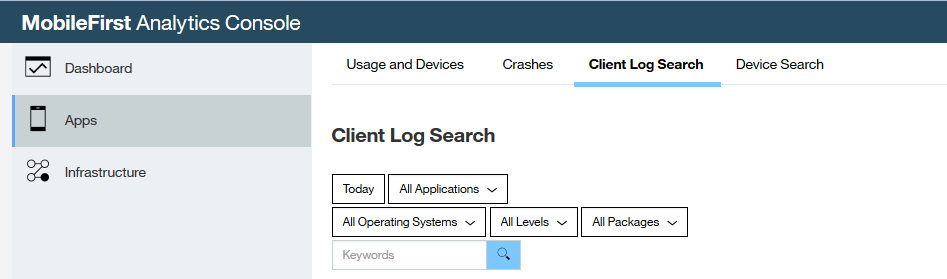

<!-- NLS_CHARSET=UTF-8 -->
## 概述
{: #overview }
日志记录是对源代码的检测，其使用 API 调用来记录消息以促进诊断和调试。
{{ site.data.keys.product_full }} 针对此目的提供一组日志记录 API 方法。

{{ site.data.keys.product_adj }} `Logger` API 类似于常用的记录器 API，例如，`console.log` (JavaScript)、`java.util.logging` (Java) 和 `NSLog` (Objective-C)，并且提供永久捕获所记录数据的额外功能，以将数据发送到 {{ site.data.keys.mf_server }}，用于分析收集和开发人员检查。 使用 `Logger` API 在相应的级别报告日志数据，以便检查日志的开发人员可以对问题进行分类并修复问题，而无需在其实验室中重现问题。

#### 可用性
{: #availability }
{{ site.data.keys.product_adj }} 提供的 `Logger` API 方法可用于 iOS、Android、Web 和 Cordova 应用程序。

## 日志记录级别
{: #logging-levels }
日志记录库一般具有通常称为**级别**的详细程度控件。  
日志记录级别按详细程度从高到低排列如下：

* 跟踪 - 用于方法入口点和出口点
* 调试 - 用于方法结果输出
* 记录 - 用于类实例化
* 参考 - 用于报告初始化
* 警告 - 用于记录不推荐的用法警告
* 错误 - 用于意外的异常情况
* 严重 - 用于不可恢复的崩溃或挂起

> **注：**使用“严重”将导致收集应用程序崩溃。 为避免偏离应用程序崩溃数据，不建议使用此关键字。

缺省情况下，按“严重”详细程度配置客户机 SDK，这意味着很少或不输出或捕获原始调试日志。 您可以编程方式调整详细程度，或者通过在 {{ site.data.keys.mf_analytics_console }} 上设置配置概要文件（必须由应用程序显式检索）进行调整。

### 来自客户机应用程序的日志记录：
{: #logging-from-client-applications }
* [JavaScript（Cordova 或 Web）应用程序中的日志记录](javascript/)
* [iOS 应用程序中的日志记录](ios/)
* [Android 应用程序中的日志记录](android/)

### 调整日志详细程度
{: #adjusting-log-verbosity }
在设置日志记录级别之后，通过设置客户机或检索服务器概要文件，客户机对发送的日志记录消息进行过滤。 如果显式发送低于阈值的消息，那么客户机将忽略该消息。

例如，要将详细程度级别设置为“调试”：

#### iOS
{: #ios}
**Objective-C**

```objc
[OCLogger setLevel:OCLogger_DEBUG];
```

**Swift**

```swift
 OCLogger.setLevel(OCLogger_DEBUG);
 ```

#### Android
{: #android }
```java
Logger.setLevel(Logger.LEVEL.DEBUG);
```

#### JavaScript (Cordova)
{: #javascript-cordova }
```javascript
WL.Logger.config({ level: 'DEBUG' });
```

#### JavaScript (Web)
{: #javascript-web }
对于 Web SDK，无法从客户机更改缺省跟踪级别。

## 崩溃捕获
{: #crash-capture }
Android 和 iOS 应用程序上的 {{ site.data.keys.product_adj }} 客户机 SDK 根据应用程序崩溃捕获堆栈跟踪并记录为“严重”级别。 此类型的崩溃是 UI 从用户视图中消失的实际崩溃。 在 Cordova 应用程序中，捕获 JavaScript 全局错误，并且如果可能，还捕获一个 JavaScript 调用堆栈，并将其记录为“严重”级别。 此类型的崩溃不是崩溃事件，在运行时可能对用户体验造成负面后果，也可能不会。

在重新运行应用程序后，将自动捕获和记录崩溃、未捕获的异常和全局错误。

## 查看日志
{: #viewing-the-logs }
在收集日志并发送到服务器后，在 {{ site.data.keys.mf_analytics_console }} 中进行查看。 从导航栏中选择**应用程序**面板，然后单击**客户机日志搜索**选项卡。


