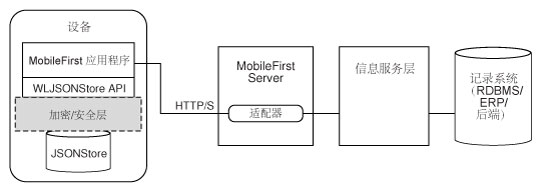

<!-- NLS_CHARSET=UTF-8 -->
## 概述
{: #overview }
{{ site.data.keys.product_full }} **JSONStore** 是可选的客户机端 API，其提供轻量级、面向文档的存储系统。 JSONStore 支持持久存储 **JSON 文档**。 即使在运行应用程序的设备脱机时，应用程序中的文档在 JSONStore 中仍可用。 此持久、始终可用的存储可用于授予用户对文档的访问权，例如，在设备中无网络连接时。



由于开发人员对此很熟悉，所以此文档中偶尔使用关系数据库术语以帮助说明 JSONStore。 但是关系数据库和 JSONStore 之间有很多不同。 例如，用于在关系数据库中存储数据的严格模式与 JSONStore 方法不同。 使用 JSONStore，您可以存储任何 JSON 内容并可对您需要搜索的内容建立索引。

#### 主要功能
{: #key-features }
* 用于提高搜索效率的数据索引
* 用于跟踪对存储数据的仅本地更改的机制
* 多用户支持
* 对存储数据进行 AES 256 加密以提供安全性和机密性。 如果单个设备上有多个用户，那么您可以利用密码保护按照用户进行分段保护。

单个存储可以有多个集合，每个集合可有多个文档。 还可以有包含多个存储的 {{ site.data.keys.product_adj }} 应用程序。 有关信息，请参阅 JSONStore 多用户支持。

#### 支持级别
{: #support-level }
* 在本机 iOS 和 Android 应用程序中支持 JSONStore（对于本机 Windows（Universal 和 UWP）不支持）。
* 在 Cordova iOS、Android 和 Windows（Universal 和 UWP）应用程序中支持 JSONStore。

#### 跳转至
{: #jump-to }
* [常规 JSONStore 术语](#general-jsonstore-terminology)
* [功能表](#features-table)
* [多用户支持](#multiple-user-support)
* [安全性](#security)
* [性能](#performance)
* [并行性](#concurrency)
* [分析](#analytics)
* [使用外部数据](#working-with-external-data)
* [故障诊断](#troubleshooting)
* [API 用法](#api-usage)

## 常规 JSONStore 术语
{: #general-jsonstore-terminology }
### 文档
{: #document }
文档是 JSONStore 的基本构建块。

JSONStore 文档是具有自动生成的标识 (`_id`) 和 JSON 数
据的 JSON 对象。 它类似于数据库术语中的记录或行。 `_id` 的值始终是特定集合中的唯一整数。 `JSONStoreInstance` 类中的某些函数（例如，`add`、`replace` 和 `remove`）可获取文档/对象数组。 这些方法可用于一次在多个文档/对象上执行操作。

**单个文档**  

```javascript
var doc = { _id: 1, json: {name: 'carlos', age: 99} };
```

**文档数组**

```javascript
var docs = [
  { _id: 1, json: {name: 'carlos', age: 99} },
  { _id: 2, json: {name: 'tim', age: 100} }
]
```

### 集合
{: #collection }
JSONStore 集合类似于数据库术语中的表。  
以下代码示例不是在磁盘上存储文档的方式，而是在较高级别查看集合概况的有效方法。

```javascript
[
    { _id: 1, json: {name: 'carlos', age: 99} },
    { _id: 2, json: {name: 'tim', age: 100} }
]
```

### 存储区
{: #store }
存储区是包含一个或多个集合的持久性 JSONStore 文件。  
存储区类似于数据库术语中的关系数据库。 存储区也称为 JSONStore。

### 搜索字段
{: #search-fields }
搜索字段是键/值对。  
搜索字段是为了快速查找而编制索引的关键字，与数据库术语中的列字段或属性类似。

额外的搜索字段是编制了索引的关键字，但并非存储的 JOSON 数据的一部分。 这些字段定义了其值已经编制索引（在 JSON 集合中）的关键字，并且可以用于更加快速地进行搜索。

有效数据类型包括：字符串、布尔值、数字和整数。 这些类型仅仅是类型提示，不会进行类型验证。 此外，这些类型决定了如何存储可以编制索引的字段。 例如，`{age: 'number'}` 将 1 编制为索引 1.0，`{age: 'integer'}` 将 1 编制为索引 1。

**搜索字段和额外的搜索字段**

```javascript
var searchField = {name: 'string', age: 'integer'};
var additionalSearchField = {key: 'string'};
```

只能针对对象内的索引键建立索引，而不是对象自身。 数组将以传递方式进行处理，这意味着您无法编制数组的索引或编制数组 (arr[n]) 的特定索引，但可以针对数组内的对象编制索引。

**对数组内的值建立索引**

```javascript

var searchFields = {
    'people.name' : 'string', // matches carlos and tim on myObject
    'people.age' : 'integer' // matches 99 and 100 on myObject
};

var myObject = { 
    people : [ 
        {name: 'carlos', age: 99}, 
        {name: 'tim', age: 100}
    ] 
};
```

### 查询
{: #queries }
查询是使用搜索字段或额外的搜索字段来查找文档的对象。  
这些示例假定 name 搜索字段为字符串类型并且 age 搜索字段为整数类型。

**查找其 `name` 与 `carlos` 匹配的文档**

```javascript
var query1 = {name: 'carlos'};
```

**查找其 `name` 与 `carlos` 匹配并且 `age` 与 `99` 匹配的文档**

```javascript
var query2 = {name: 'carlos', age: 99};
```

### 查询部分
{: #query-parts }
查询部分用于构建更高级的搜索。 某些 JSONStore 操作（例如，某些版本的 `find` 或
`count`）生成查询部分。 查询部分中的所有项都由
`AND` 语句进行连接，而查询部分自身由
`OR` 语句进行连接。 仅在查询部分中的所有项为 **true** 时搜索条件才返回匹配项。 您可以使用多个查询部分来搜索满足一个或多个查询部分的匹配项。

使用查询部分进行查找仅作用于顶级搜索字段。 例如：
`name`，而不是 `name.first`。 使用所有搜索字段都是顶级的多个集合来避开这点。 处理非顶级搜索字段的查询部分操作为：`equal`、`notEqual`、`like`、`notLike`、`rightLike`、`notRightLike`、`leftLike` 和
`notLeftLike`。 如果使用非顶级搜索字段，那么行为不确定。

## 功能表
{: #features-table }
比较 JSONStore 功能与其他数据存储技术和格式的功能。

JSONStore 是一个用于在使用 {{ site.data.keys.product_adj }} 插件的 Cordova 应用程序中存储数据的 JavaScript API，Objective-C API 用于本机 iOS 应用程序，Java API 用于本机 Android 应用程序。 请参考以下不同 JavaScript 存储技术的比较，以了解 JSONStore 与它们相比有哪些不同。

JSONStore 类似于诸如 LocalStorage、Indexed DB、Cordova Storage API 和 Cordova File API 之类的技术。 此表显示了 JSONStore 提供的某些功能与其他技术进行对比的结果。 JSONStore 功能仅供 iOS 和 Android 设备和仿真程序使用。

| 功能                                            | JSONStore      | LocalStorage | IndexedDB | Cordova Storage API | Cordova File API |
|----------------------------------------------------|----------------|--------------|-----------|---------------------|------------------|
| Android 支持（Cordova 和本机应用程序）|	     ✔ 	      |      ✔	    |     ✔	     |        ✔	           |         ✔	      |
| iOS 支持（Cordova 和本机应用程序）	     |	     ✔ 	      |      ✔	    |     ✔	     |        ✔	           |         ✔	      |
| Windows 8.1 Universal 和 Windows 10 UWP（Cordova 应用程序）          |	     ✔ 	      |      ✔	    |     ✔	     |        -	           |         ✔	      |
| 数据加密	                                 |	     ✔ 	      |      -	    |     -	     |        -	           |         -	      |
| 最大存储量	                                 |可用空间 |    ~5MB    |   ~5MB   	 | 可用空间	   | 可用空间  |
| 可靠存储（请参阅注释）	                     |	     ✔ 	      |      -	    |     -	     |        ✔	           |         ✔	      |
| 跟踪本地更改	                     |	     ✔ 	      |      -	    |     -	     |        -	           |         -	      |
| 多用户支持                                 |	     ✔ 	      |      -	    |     -	     |        -	           |         -	      |
| 建立索引	                                         |	     ✔ 	      |      -	    |     ✔	     |        ✔	           |         -	      |
| 存储类型	                                 | JSON 文档 | 键/值对 | JSON 文档 | 关系数据库 (SQL) | 字符串     |

**注：**可靠存储意味着除非发生以下某个事件，否则不会删除您的数据：

* 从设备上移除应用程序。
* 调用移除数据的某种方法。

## 多用户支持	
{: #multiple-user-support }
借助 JSONStore，您可以在单个 {{ site.data.keys.product_adj }} 应用程序中创建包含不同集合的多个存储区。

init (JavaScript) 或 open（本机 iOS 和本机 Android）API 可获取具有某个用户名的选项对象。 不同的存储区是文件系统中的单独文件。 用户名用作存储区的文件名。 出于安全性和隐私的原因，这些单独存储区可以通过不同的密码进行加密。 调用 closeAll API 将除去对所有集合的访问权。 还可通过调用 changePassword API 来更改加密存储区的密码。

示例用例是共享物理设备（例如，iPad 或 Android 平板电脑）和 {{ site.data.keys.product_adj }} 应用程序的不同员工。 此外，如果员工工作班次不同并且处理来自不同客户的隐私数据，那么在使用 {{ site.data.keys.product_adj }} 应用程序时，多用户支持非常有用。

## 安全性
{: #security }
您可以加密存储区中的所有集合以确保其安全性。

要加密存储器中的所有集合，请将密码传递到 `init` (JavaScript) 或 `open`（本机 iOS 和本机 Android）API。 如果未传递任何密码，那么存储器集合中的所有文档都不会加密。

某些安全工件（例如，salt）存储在密钥链 (iOS)、共享首选项 (Android) 和凭据保险箱（Windows Universal 8.1 和 Windows 10 UWP）中。 此存储区利用 256 位高级加密标准 (AES) 密钥进行加密。 所有密钥通过基于密码的密钥派生功能 2 (PBKDF2) 进行增强。 您可以选择针对应用程序加密数据集合，但是无法在已加密和明文格式之间进行切换，或者在存储区中混用两种格式。

用于保护存储区中数据的密钥基于您提供的用户密码。 密钥不会到期，但是您可以通过调用 changePassword API 进行更改。

数据保护密钥 (DPK) 是用于解密存储器内容的密钥。 DPK 保存在 iOS 密钥链中，即使应用程序已卸载也是如此。 要移除密
钥链中的密钥以及 JSONStore 放入应用程序中的任何项，请使用 destroy API。 此过程不适用于 Android，因为加密的 DPK 存储在共享首选项中，并且会在卸载应用程序时擦除。

JSONStore 第一次使用密码打开集合时，这意味着开发人员想要加密存储区中的数据，JSONStore 需要随机令牌。 可以从客户机或服务器获取此随机令牌。

当 JSONStore API 的 JavaScript 实施中存在 localKeyGen 密钥并且具有值 true 时，将本地生成使用密码的安全令牌。 否则，通过联系服
务器生成令牌，因此需要 {{ site.data.keys.mf_server }} 连通性。 仅在第一次使用密码打开存储器时需要此令牌。 缺省情况下，本机实施（Objective-C 和 Java）本地生成使用密码的安全令
牌，或者您可以通过 secureRandom 选项传递一个令牌。

权衡以下两种方法，脱机打开存储区并信任客户机以生成此随机令牌（安全性较低），或者
通过访问 {{ site.data.keys.mf_server }}（需要连通性）打开存储区并信任服务器（安全性较高）。

### 安全实用程序
{: #security-utilities }
{{ site.data.keys.product_adj }} 客户机端 API 提供以下安全实用程序来帮助保护用户数据。 如果要保护 JSON 对象，那么诸如 JSONStore 之类的功能很有效。 但是，不建议在 JSONStore 集合中存储二元 BLOB。

应改为在文件系统上存储二元数据，并将文件路径和其他元数据存储在 JSONStore 集合内。 如果要保护图像之类的文件，可以将其编码为 base64 字符串、对其加密，并将输出写入磁盘。 要解密数据时，可以在 JSONStore 集合中查找元数据、从磁盘中读取加密数据，并使用存储的元数据来解密数据。 此元数据可包括密钥、加密盐 (Salt)、初始化向量 (IV)、文件类型、到文件的路径等。

> 了解有关 [JSONStore 安全实用程序](security-utilities)的更多信息。

### Windows 8.1 Universal 和 Windows 10 UWP 加密
{: #windows-81-universal-and-windows-10-uwp-encryption }
您可以加密存储区中的所有集合以确保其安全性。

JSONStore 使用
[SQLCipher](http://sqlcipher.net/) 作为其底层数据库技术。 SQLCipher 是由 Zetetic 生成的 SQLite 构建，LLC 会向数据库添加一个加密层。

JSONStore 在所有平台上使用 SQLCipher。 在 Android 和 iOS 上，提供免费的、开放式源代码版本的 SQLCipher，这也称为 Community Edition，其纳入 {{ site.data.keys.product }}
中包含的 JSONStore 版本。 只有获取商业许可才能使用 Windows 版本的 SQLCipher，并且 {{ site.data.keys.product }} 不得直接再分发。

相反，JSONStore for Windows 8 Universal 包含 SQLite 作为底层数据库。 如果需要加密其中一个平台的数据，您需要获
取自己的 SQLCipher 版本并置换
{{ site.data.keys.product }}
中包含的 SQLite 版本。

如果不需要加密，那么通过使用
{{ site.data.keys.product }}
中的 SQLite 版本使 JSONStore 完全生效（除去加密）。

#### 针对 Windows Universal 和 Windows UWP，将 SQLite 替换为 SQLCipher
{: #replacing-sqlite-with-sqlcipher-for-windows-universal-and-windows-uwp }
1. 运行 SQLCipher for Windows Runtime Commercial Edition 随附的 SQLCipher for Windows Runtime 8.1/10 扩展。
2. 安装完扩展后，查找刚创建的 **sqlite3.dll** 文件的 SQLCipher 版本。 分别存在针对 x86、x64 和 ARM 的版本。

   ```bash
   C:\Program Files (x86)\Microsoft SDKs\Windows\v8.1\ExtensionSDKs\SQLCipher.WinRT81\3.0.1\Redist\Retail\<platform>
   ```
    
3. 将此文件复制到您的 {{ site.data.keys.product_adj }} 应用程序并进行替换。

   ```bash
   <Worklight project name>\apps\<application name>\windows8\native\buildtarget\<platform>
   ```

## 效果
{: #performance }
以下是可能会影响 JSONStore 性能的因素。

### 网络
{: #network }
* 在执行操作（例如，将所有脏文档发送到适配器）之前检查网络连接。
* 通过网络发送至客户机的数据量严重影响性能。 只发送应用程序所需的数据，而不是复制后端数据库中的所有项。
* 如果正在使用适配器，请考虑将 compressResponse 标记设置为 true。 通过此方式压缩响应，与无压缩相比，通常这种方式所用带宽较少并且传输速度更快。

### 内存
{: #memory }
* 在使用 JavaScript API
时，JSONStore 文档将作为本机（Objective-C、Java 或 C#）层和 JavaScript 层之间的字
符串进行序列化和反序列化。 缓解可能的内存问题的一种方法是在使用 find API 时应用限制和偏移量。 这样，您限制针对结果分配的内存量并且可实施诸如分页等事项（每页显示 X 条结果）。
* 不再使用最终作为字符串进行序列化和反序列化的长密钥名称，考虑将这些长密钥名称映射为较短的名称（例如，`myVeryVeryVerLongKeyName` 到 `k` 或 `key`）。 理想情况下，在从适配器发送到客户机时将其映射为简短的密钥名称，在将数据发送回后端时将其映射为原始长密钥名称。
* 考虑将存储区内的数据拆分为不同的集合。 让小型文档分布在各个集合中，而不是单个集合中包含整个文档。 此注意事项取决于数据间的相关程度以及指定数据的用例。
* 在将 add API 用于对象数组时，可能会遇到内存问题。 要缓解此问题，请一次使用较少的 JSON 对象调用这些方法。
* JavaScript 和 Java 具有垃圾收集器，而
Objective-C 具有自动引用计数。 允许其工作，但不要完全依赖。 尝试删除不再使用的空引用，并且使用概要分析工具来检查内存使用是否降低（当您预计会降低时）。

### CPU
{: #cpu }
* 在调用建立索引的 add 方法时，使用的搜索字段和其他搜索字段的数量会影响性能。 仅对 find 方法的查询中使用的值编制索引。
* 缺省情况下，JSONStore 跟踪对其文档的本地更改。 可以禁用此行为，因此在使用 add、remove 和 replace API 时，通过将 `markDirty` 标记设置为 **false** 将省去一些循环周期。
* 启用安全性会向 `init` 或
`open` API 以及处理集合中的文档的其
他操作增加开销。 考虑安全性是否确实需要。 例如，open API 比加密更慢，因为它必须生成用于加密和解密的加密密钥。
* `replace` 和
`remove` API 取决于集合大小，因为它们必须浏览整个集合以替换或移除所有出现项。 由于它必须浏览每条记录，因为必须加密每个记录，在使用加密时速度会变得很慢。 在大型集
合上，此性能下降更加明显。
* `count` API 相对开销较多。 但是，您可以保留一个变量来保持集合计数。 每次从集合存储内容或移除内容时，会将其更新。
* `find` API（`find`、`findAll` 和 `findById`）受加密影响，因为它们必须解密每个文档以查看其是否匹配。 针对 find by query，如果传递了限制，那么当其达到结果限制而停止时，可能会更快。 JSONStore 不需要解密剩余的文档即可了解是否保留任何其他搜索结果。

## 并行
{: #concurrency }
### JavaScript
{: #javascript }
可以对集合执行的大部分操作都是异步的，例如添加和查找。 这些操作在操作成功完成时返回解析的 jQuery 承诺，如果失败，则会被拒绝。 这些承诺类似于成功和失败的回调。

jQuery Deferred 是可以解析或拒绝的承诺。 以下示例并非特定于 JSONStore，而是旨在帮助您了解其常规用法。

不再承诺和回调，您还可以侦听 JSONStore `success` 和 `failure` 事件。 基于传递到事件侦听器的参数执行操作。

**示例承诺定义**

```javascript
var asyncOperation = function () {
  // Assumes that you have jQuery defined via $ in the environment
  var deferred = $.Deferred();

  setTimeout(function() {
    deferred.resolve('Hello');
  }, 1000);

  return deferred.promise();
};
```

**示例承诺用法**

```javascript
// The function that is passed to .then is executed after 1000 ms.
asyncOperation.then(function (response) {
  // response = 'Hello'
});
```

**示例回调定义**

```javascript
var asyncOperation = function (callback) {
  setTimeout(function() {
    callback('Hello');
  }, 1000);
};
```

**示例回调用法**

```javascript
// The function that is passed to asyncOperation is executed after 1000 ms.
asyncOperation(function (response) {
  // response = 'Hello'
});
```

**示例事件**

```javascript
$(document.body).on('WL/JSONSTORE/SUCCESS', function (evt, data, src, collectionName) {

  // evt - Contains information about the event
  // data - Data that is sent ater the operation (add, find, etc.) finished
  // src - Name of the operation (add, find, push, etc.)
  // collectionName - Name of the collection
});
```

### Objective-C
{: #objective-c }
在将本机 iOS
API 用于 JSONStore 时，所有操作都将添加到同步分派队列。 此行为确保在不是主线程的线程上按顺序执行接触存储的操作。 有关更多信息，请参阅 [Grand Central Dispatch (GCD)](https://developer.apple.com/library/ios/documentation/Performance/Reference/GCD_libdispatch_Ref/Reference/reference.html#//apple_ref/c/func/dispatch_sync        ) 中的 Apple 文档。

### Java
{: #java }
在将本机 Android API 用于 JSONStore 时，将在主线程上执行所有操作。 您必须创建线程或者使用线程池以使用异步行为。 所有存储操作都是线程安全的。

## 分析 
{: #analytics }
可收集与 JSONStore 相关的分析信息的关键部分 

### 文件信息
{: #file-information }
如果在分析标记设置为 **true** 的情况下调用
JSONStore API，那么将按照每个应用程序会话收集文件信息。 在将应用程序装入内存以及从内存中移除时，将定义应用程序会话。 您可以使用此信息来确定应用程序中的
JSONStore 内容使用的空间量。

### 性能指标
{: #performance-metrics }
每次使用有关操作开始和结束时间的信息调用 JSONStore API 时，都将收集性能指标。 您可以使用此信息来确定不同操作所用的时间（毫秒）。

### 示例
{: #examples }
#### iOS
{: #ios-example}
```objc
JSONStoreOpenOptions* options = [JSONStoreOpenOptions new];
[options setAnalytics:YES];

[[JSONStore sharedInstance] openCollections:@[...] withOptions:options error:nil];
```

#### Android
{: #android-example }
```java
JSONStoreInitOptions initOptions = new JSONStoreInitOptions();
initOptions.setAnalytics(true);

WLJSONStore.getInstance(...).openCollections(..., initOptions);
```

#### JavaScript
{: #java-script-example }
```javascript
var options = {
  analytics : true
};

WL.JSONStore.init(..., options);
```

## 使用外部数据
{: #working-with-external-data }
您可以在多个不同的概念中使用外部数据：**拉取**和**推送**。

### 拉取
{: #pull }
许多系统使用词汇“拉取”来指代从外部源获取数据。  
有三个重要部分：

#### 外部数据源
{: #external-data-source }
此源可以为数据库、REST 或 SOAP API 等等。 唯一要求是，外部数据源必须可以通过 {{ site.data.keys.mf_server }} 访问，或可以直接通过客户机应用程序访问。 理想情况下，您希望此源以 JSON 格式返回数据。

#### 传输层
{: #transport-layer }
此源表示您如何将数据从外部源传送到内部源（存储区中的 JSONStore 集合）。 一个备选方案是适配器。

#### 内部数据源 API
{: #internal-data-source-api }
此源是可用于将 JSON 数据添加到集合的 JSONStore API。

**注：**您可以使用从文件读取的数据、输入字段或变量中的硬编码数据来填充内部存储区。 此源不必专门来自需要网络通信的外部源。

以下所有代码示例都以类似于 JavaScript 的伪码来编写。

**注：**针对传输层使用适配器。 使用适配器的优点包括服务器端代码和客户机端代码的 XML 到 JSON 转换、安全性、过滤和重复数据删除。

**外部数据源：后端 REST 端点**  
假设您具有一个 REST 端点，用于从数据库读取数据并将其返回为 JSON 对象数组。

```javascript
app.get('/people', function (req, res) {

  var people = database.getAll('people');

  res.json(people);
});
```

返回的数据可能与以下示例类似：

```xml
[{id: 0, name: 'carlos', ssn: '111-22-3333'},
 {id: 1, name: 'mike', ssn: '111-44-3333'},
 {id: 2, name: 'dgonz' ssn: '111-55-3333')]
```

**传输层：适配器**  
假设创建名为 people 的适配器并定义名为 getPeople 的过程。 该过程将调用 REST 端点并将 JSON 对象数组返回到客户机。 您可能想在此执行更多操作，如仅将数据的子集返回到客户机。

```javascript
function getPeople () {

  var input = {
    method : 'get',
    path : '/people'
  };

  return MFP.Server.invokeHttp(input);
}
```

在客户机上，您可以使用 WLResourceRequest API 来获取数据。 此外，您可能希望将某些参数从客户机传递到适配器。 一个示例是客户机上次通过适配器从外部源获取新数据的日期。

```javascript
var adapter = 'people';
var procedure = 'getPeople';
 
var resource = new WLResourceRequest('/adapters' + '/' + adapter + '/' + procedure, WLResourceRequest.GET);
resource.send()
.then(function (responseFromAdapter) {
  // ...
});
```

**注：**您可能想要利用可传递到 `WLResourceRequest` API 的 `compressResponse`、`timeout` 以及其他参数。  
另外，您可以跳过适配器并使用诸如 jQuery.ajax 之类的项，从而直接与具有要存储数据的 REST 端点联系。

```javascript
$.ajax({
  type: 'GET',
  url: 'http://example.org/people',
})
.then(function (responseFromEndpoint) {
  // ...
});
```

**内部数据源 API：JSONStore**
在收到后端响应后，您可以使用 JSONStore 来处理此数据。
JSONStore 提供跟踪本地更改的方法。 该方法将启用某些 API 以将文档标记为脏。 API 将记录对文档执行的最后一个操作，以及将文档标记为脏的时间。 然后可以使用此信息来实现诸如数据同步等功能。

change API 将采用数据和某些选项：

**replaceCriteria**  
这些搜索字段是输入数据的一部分。 它们用于查找已存在于集合内的文档。 例如，如果选择

```javascript
['id', 'ssn']
```

作为替换标准，那么将传递以下数组作为输入数据：

```javascript
[{id: 1, ssn: '111-22-3333', name: 'Carlos'}]
```

并且 `people` 集合已包含以下文档：

```javascript
{_id: 1,json: {id: 1, ssn: '111-22-3333', name: 'Carlitos'}}
```

`change` 操作将查找与以下查询完全匹配的文档：

```javascript
{id: 1, ssn: '111-22-3333'}
```

`change` 操作将使用输入数据执行替换并且该集合将包含：

```javascript
{_id: 1, json: {id:1, ssn: '111-22-3333', name: 'Carlos'}}
```

该名称已从 `Carlitos` 更改为 `Carlos`。 如果多个文档匹配替换标准，那么匹配的所有文档都将替换为各自输入数据。

**addNew**  
当没有任何文档与替换标准相匹配时，change API 将查看此标记的值。 如果标记设置为 **true**，那么 change API 将创建一个新文档并将其添加到存储区中。 否则，不执行任何其他操作。

**markDirty**  
确定 change API 是否将替换或添加的文档标记为脏。

将从适配器返回一个数据数组：

```javascript
.then(function (responseFromAdapter) {

  var accessor = WL.JSONStore.get('people');

  var data = responseFromAdapter.responseJSON;

  var changeOptions = {
    replaceCriteria : ['id', 'ssn'],
    addNew : true,
    markDirty : false
  };

  return accessor.change(data, changeOptions);
})

.then(function() {
  // ...
})
```

可以使用其他 API 来跟踪对存储的本地文档进行的更改。 将始终获取对其执行操作的集合的存取器。

```javascript
var accessor = WL.JSONStore.get('people')
```

然后，可以添加数据（JSON 对象的数组）并确定是否要将其标记为脏数据。 通常情况下，从外部源获取更改时，您会希望将 markDirty 标记设置为 false。 之后当在本地添加数据时，您会希望将该标记设置为 true。

```javascript
accessor.add(data, {markDirty: true})
```

还可以替换文档，并选择是否将替换的文档标记为脏文档。

```javascript
accessor.replace(doc, {markDirty: true})
```

同样，可以移除文档，并选择是否将移除文档标记为脏文档。 使用 find API 时，将不再显示移除的文档和标记为脏的文档。 但是，这些文档仍存在于该集合中，直到应用 `markClean` API（此 API 可从集合中物理删除文档）。 如果未将文档标记为脏文档，那么会从集合中物理删除文档。

```javascript
accessor.remove(doc, {markDirty: true})
```

### 推送
{: #push }
许多系统使用词汇推送来指代将数据发送到外部源。

有三个重要部分：

#### 内部数据源 API
{: #internal-data-source-api-push }
此源是 JSONStore API，用于返回包含仅本地更改（脏）的文档。

#### 传输层
{: #transport-layer-push }
此源是您希望联系外部数据源以发送更改的方式。

#### 外部数据源
{: #external-data-source-push }
此源通常是数据库、REST 或 SOAP 端点等等，用于接收客户机对数据进行的更新。

以下所有代码示例都以类似于 JavaScript 的伪码来编写。

**注：**针对传输层使用适配器。 使用适配器的优点包括服务器端代码和客户机端代码的 XML 到 JSON 转换、安全性、过滤和重复数据删除。

**内部数据源 API：JSONStore**  
具有集合的存取器后，您可以调用 `getAllDirty` API 以获取标记为脏的所有文档。 这些文档中包含您要通过传输层发送到外部数据源的仅限本地更改。

```javascript
var accessor = WL.JSONStore.get('people');

accessor.getAllDirty()

.then(function (dirtyDocs) {
  // ...
});
```

`dirtyDocs` 参数与以下示例类似：

```javascript
[{_id: 1,
  json: {id: 1, ssn: '111-22-3333', name: 'Carlos'},
  _operation: 'add',
  _dirty: '1395774961,12902'}]
```

字段包括：
* `_id`：JSONStore 使用的内部字段。 会为每个文档分配唯一的内部字段。
* `json`：存储的数据。
* `_operation`：在文档上执行的上一个操作。 可能的值为 add、store、replace 和 remove。
* `_dirty`：存储为数字的时间戳记，其表示文档标记为脏的时间。

**传输层：MobileFirst 适配器**  
您可以选择将脏文档发送到适配器。 假设您具有使用 `updatePeople` 过程定义的 `people` 适配器。

```javascript
.then(function (dirtyDocs) {
  var adapter = 'people',
  procedure = 'updatePeople';
 
  var resource = new WLResourceRequest('/adapters/' + adapter + '/' + procedure, WLResourceRequest.GET)
  resource.setQueryParameter('params', [dirtyDocs]);
  return resource.send();
})
 
.then(function (responseFromAdapter) {
  // ...
})
```

**注：**您可能想要利用可传递到 `WLResourceRequest` API 的 `compressResponse`、`timeout` 以及其他参数。

在 {{ site.data.keys.mf_server }} 上，适配器具有类似以下示例的 `updatePeople` 过程：

```javascript
function updatePeople (dirtyDocs) {

  var input = {
    method : 'post',
    path : '/people',
    body: {
      contentType : 'application/json',
      content : JSON.stringify(dirtyDocs)
    }
  };

  return MFP.Server.invokeHttp(input);
}
```

您可能必须更新有效内容以与后端预期的格式相匹配，而不是从客户机上的 `getAllDirty` API 传达输出。 可能必须将替换项、移除项以及包含项分割成独立的后端 API 调用。

或者，可以迭代 `dirtyDocs`
数组并检查 `_operation` 字段。 然后，将替换项发送到某一过程，移除项发送到另一过程，包含项发送到其他过程。 先前的示例将所有脏文档成批发送到适配器。

```javascript
var len = dirtyDocs.length;
var arrayOfPromises = [];
var adapter = 'people';
var procedure = 'addPerson';
var resource;
 
while (len--) {
 
  var currentDirtyDoc = dirtyDocs[len];
 
  switch (currentDirtyDoc._operation) {
 
    case 'add':
    case 'store':
 
    resource = new WLResourceRequest('/adapters/people/addPerson', WLResourceRequest.GET);
    resource.setQueryParameter('params', [currentDirtyDoc]);
 
      arrayOfPromises.push(resource.send());
 
    break;
 
    case 'replace':
    case 'refresh':
 
    resource = new WLResourceRequest('/adapters/people/replacePerson', WLResourceRequest.GET);
    resource.setQueryParameter('params', [currentDirtyDoc]);
 
 
      arrayOfPromises.push(resource.send());
 
    break;
 
    case 'remove':
    case 'erase':
 
    resource = new WLResourceRequest('/adapters/people/removePerson', WLResourceRequest.GET);
    resource.setQueryParameter('params', [currentDirtyDoc]);
 
      arrayOfPromises.push(resource.send());
  }
}
 
$.when.apply(this, arrayOfPromises)
.then(function () {
  var len = arguments.length;
 
  while (len--) {
    // Look at the responses in arguments[len]
  }
});
```

或者，您可以跳过适配器并直接联系 REST 端点。

```javascript
.then(function (dirtyDocs) {

  return $.ajax({
    type: 'POST',
    url: 'http://example.org/updatePeople',
    data: dirtyDocs
  });
})

.then(function (responseFromEndpoint) {
  // ...
});
```

**外部数据源：后端 REST 端点**  
后端将接受或拒绝更改，然后将响应传达回到客户机。 客户机看到响应后，可以将更新的文档传递给 markClean API。

```javascript
.then(function (responseFromAdapter) {

  if (responseFromAdapter is successful) {
    WL.JSONStore.get('people').markClean(dirtyDocs);
  }
})

.then(function () {
  // ...
})
```

文档标记为干净后，将不会显示在 `getAllDirty` API 的输出中。

## 故障排除
{: #troubleshooting }
有关更多信息，请参阅 [JSONStore 故障诊断](../../troubleshooting/jsonstore)部分。

## API 用法
{: #api-usage }
选择平台： 
