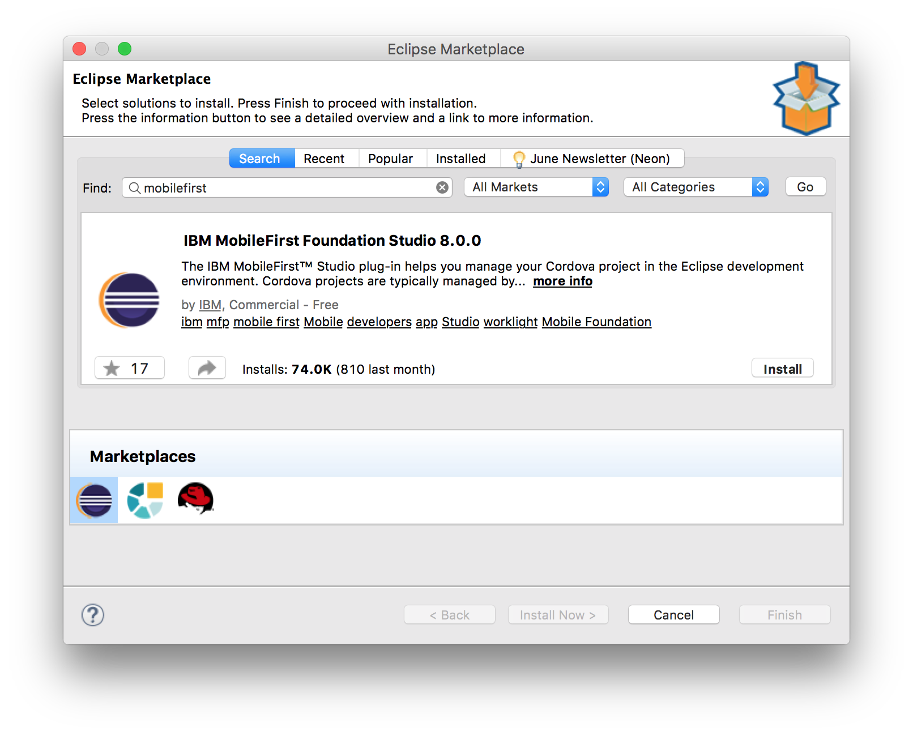

<!-- NLS_CHARSET=UTF-8 -->
## 概述
{: #overview }
通过使用 Cordova CLI，可以创建和管理您的 Cordova 应用程序。 还可以使用 [THyM](https://www.eclipse.org/thym/) 插件在 Eclipse IDE 中实现相同的结果。

THyM 支持在 Eclipse 中导入和管理 Cordova 项目。 您可以创建新的 Cordova 项目，并且可以导入现有的 Cordova 项目。 也可以通过此插件将 Cordova 插件安装到您的项目中。

在[官方 Web 站点](https://www.eclipse.org/thym/)中了解有关 THyM 的更多信息。

针对 Eclipse 的 {{ site.data.keys.mf_studio }} 插件将在 Eclipse IDE 中公开各种 {{ site.data.keys.product_adj }} 命令。
具体来说，它提供以下命令：打开服务器控制台、预览应用程序、注册应用程序、加密应用程序、拉取应用程序、推送应用程序、更新应用程序。

此教程将指导您安装 THyM 和 MobileFirst Eclipse 插件。

**先决条件：**

* {{ site.data.keys.mf_server }} 在本地运行，或者提供一个远程运行的 {{ site.data.keys.mf_server }}。
* {{ site.data.keys.mf_cli }} 已安装在开发人员工作站上

#### 跳转至：
{: #jump-to }
* [安装 {{ site.data.keys.mf_studio }} 插件](#installing-the-mobilefirst-studio-plug-in)
* [安装 THyM 插件](#installing-the-thym-plug-in)
* [创建 Cordova 项目](#creating-a-cordova-project)
* [导入现有的 Cordova 项目](#importing-an-existing-cordova-project)
* [将 {{ site.data.keys.product_adj }} SDK 添加到 Cordova 项目](#adding-the-mobilefirst-sdk-to-cordova-project)
* [{{ site.data.keys.product_adj }} 命令](#mobilefirst-commands)
* [提示与技巧](#tips-and-tricks)

## 安装 {{ site.data.keys.mf_studio }} 插件
{: #installing-the-mobilefirst-studio-plug-in}
1. 在 Eclipse 中单击**帮助 → Eclipse Marketplace...**
2. 在“查找”字段中搜索“{{ site.data.keys.product_adj }}”，然后单击“开始”
3. 单击“安装”

	

4. 完成安装流程
5. 重新启动 Eclipse 以使安装生效。

## 安装 THyM 插件
{: #installing-the-thym-plug-in }
**注：**要运行 THyM，您必须正在运行 Eclipse Mars 或更高版本

1. 在 Eclipse 中单击**帮助 → Eclipse Marketplace...**
2. 在“查找”字段中搜索“thym”，然后单击“开始”：
3. 单击 Eclipse Thym 的“安装”

	

4. 完成安装流程
5. 重新启动 Eclipse 以使安装生效。

## 创建 Cordova 项目
{: #creating-a-cordova-project }
在此部分中，我们将讨论如何使用 THyM 创建新的 Cordova 项目。

1. 在 Eclipse 中单击**文件 → 新建 → 其他...**
2. 通过搜索“Cordova”来缩小选项范围，然后在**移动**目录中选择**混合移动 (Cordova) 应用程序项目**，然后单击**下一步**

	

3. 为项目命名，然后单击**下一步**

	

4. 为您的项目添加期望的平台，然后单击**完成**

**注**：如果您在创建之后需要其他平台，请参阅[添加平台](#adding-platforms)

## 导入现有的 Cordova 项目
{: #importing-an-existing-cordova-project }
在此部分中，我们将讨论如何导入已经使用 Cordova CLI 创建的现有 Cordova 项目。

1. 在 Eclipse 中单击**文件 → 导入...**
2. 选择**移动**目录中的**导入 Cordova 项目**，然后单击**下一步 >**
3. 单击**浏览...**，并选择现有 Cordova 项目的根目录。
4. 确保在“项目：”部分中检查项目，然后单击**完成**
	

如果在没有任何平台的情况下导入项目，那么您将看到以下错误，请查看关于如何解决此错误的[添加平台](#adding-platforms)部分。

**注**：如果在导入之后需要其他平台，请参阅[添加平台](#adding-platforms)

## 将 {{ site.data.keys.product_adj }} SDK 添加到 Cordova 项目
{: #adding-the-mobilefirst-sdk-to-cordova-project }
在[将 THyM](#installing-the-thym-plug-in) 和 [{{ site.data.keys.mf_cli }} 插件](#installing-the-mobilefirst-studio-plug-in)安装到 Eclipse 中并且[创建 Cordova 项目](#creating-a-cordova-project)或[导入 Cordova 项目](#importing-an-existing-cordova-project)之后，您可以遵循下面的步骤，通过 Cordova 插件来安装 {{ site.data.keys.product_adj }} SDK。

1. 在 Project Explorer 中，右键单击**插件**目录并选择**安装 Cordova 插件**
2. 在显示的对话框的“注册表”选项卡中搜索 **mfp**，选择 **cordova-plugin-mfp**，然后单击**完成**

	

## {{ site.data.keys.product_adj }} 命令
{: #mobilefirst-commands }
要访问 {{ site.data.keys.product }} 快捷方式，请右键单击根项目目录并浏览至 **IBM MobileFirst Foundation**。

此时，您能够从以下命令中进行选择：

| 菜单选项         | 操作                                                                                                                                       | MobileFirst 命令行界面等效项 |
|---------------------|----------------------------------------------------------------------------------------------------------------------------------------------|-----------------------------------------------|
| 打开服务器控制台 | 在服务器定义已存在时，打开控制台，以便您可以查看指定服务器的操作。                                    | mfpdev server console                         |
| 预览应用程序         | 在浏览器预览方式下打开应用程序。                                                                                                   | 在浏览器预览方式下打开应用程序。    |
| 注册应用程序        | 向服务器定义中指定的服务器注册应用程序。                                                              | mfpdev app register                           |
| 加密应用程序         | 在您的应用程序上运行 Web 资源加密工具。                                                                                           | mfpdev app webencrypt                         |
| 拉取应用程序            | 从服务器定义中指定的服务器检索现有的应用程序配置。                                         | mfpdev app pull                               |
| 推送应用程序            | 将当前应用程序的应用程序配置发送到在构建定义中指定的服务器，以便您可以对其他应用程序复用此应用程序配置。 | mfpdev app push                               |
| 已更新应用程序         | 将 www 文件夹的内容打包在 .zip 文件中，并将服务器上的版本替换为此软件包。                             | mfpdev app webupdate                          |

## 提示与技巧
{: #tips-and-tricks }

### 外部 IDE
{: #external-ides }
如果要通过外部 IDE（Android Studio 或 Xcode）测试或部署到设备，可以通过上下文菜单来实现此。

**注**：请确保将项目手动导入 Android Studio 中，以在从 Eclipse 启动之前设置 gradle 配置。  否则，您可能会遇到不必要的步骤或错误。  从 Android Studio 选择导入：**导入项目（Eclipse ADT Gradle 等）**，并浏览至您的项目，然后选择**平台**目录中的 **android** 目录。

在 Eclipse Project Explorer 中，右键单击期望的平台（例如**平台**目录中的 **android** 或 **ios**）→ 悬停在上下文菜单中的**运行方式** → 选择相应的外部 IDE。

### 添加平台
{: #adding-platforms }

添加其他平台是一个简单的过程，THyM 插件不直观显示。 您可以通过两个选项来完成同一任务，如下所述。

1. 通过“属性”
	1. 右键单击您的项目并从上下文菜单中选择**属性**。
	1. 在显示的对话框中，从左侧菜单选择**混合移动引擎**。
	1. 在此窗格中，您将能够选择或下载期望的平台。

1. 通过“终端”
	1. 右键单击您的项目，悬停在**显示于**上，然后从上下文菜单中选择**终端**。
	1. 这应该会在 Eclipse 中的控制台旁边添加一个选项卡。
	1. 此时，您将能够使用 Cordova CLI 命令手动添加平台
		*  `cordova platform ls` 将列示已安装的平台和可用平台
		*  `cordova platform add <platform>`（其中 *<platform>* 为您期望的平台）会将指定的平台添加到项目。
		*  有关特定于 Cordova 平台的命令的更多信息，请参阅 <a href="https://cordova.apache.org/docs/en/latest/reference/cordova-cli/#cordova-platform-command" target="blank">Cordova 平台命令文档</a>。

### 调试方式
{: #debug-mode }
启用调试方式将在浏览器中预览应用程序的同时在 Eclipse 控制台中显示调试级别日志。  要启用调试方式，请执行以下操作：

1. 打开 Eclipse 的首选项。
2. 选择 **MobileFirst Studio 插件**以显示插件首选项页面。
3. 确保选中**启用调试方式**复选框，然后单击**应用 → 确定**

### 实时更新
{: #live-update }
在预览应用程序时，实时更新可用。 您可以进行更新，保存更改，并在预览中观看它们自动更新。

### 将 {{ site.data.keys.mf_server }} 集成到 Eclipse 中
{: #integrating-mobilefirst-server-into-eclipse }
通过使用 {{ site.data.keys.mf_dev_kit }}，您可以将上述项与[在 Eclipse 中运行 {{ site.data.keys.mf_server }}](../../installation-configuration/development/mobilefirst/using-mobilefirst-server-in-eclipse) 结合在一起，以创建集成程度更高的开发环境。

### 演示视频
{: #demo-video }

	

   		<iframe src="https://www.youtube.com/embed/yRe2AprnUeg"></iframe>
	

