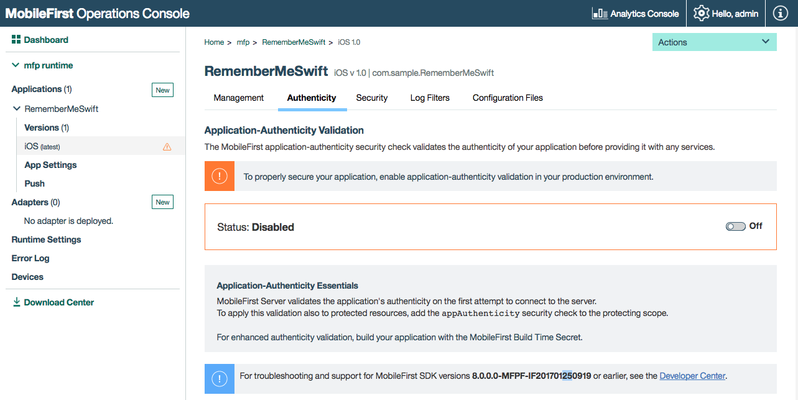

<!-- NLS_CHARSET=UTF-8 -->
## 概述
{: #overview }
通过发出 HTTP 请求，应用程序可访问 {{ site.data.keys.mf_server }} 提供访问权的企业 HTTP 服务 (API)。预定义应用程序真实性[安全检查](../)可确保尝试连接到 {{ site.data.keys.mf_server }} 实例的应用程序是真实的应用程序。

要启用应用程序真实性，可遵循 **{{ site.data.keys.mf_console }}** → **[您的应用程序]** → **真实性**中的屏幕说明，或查看以下信息。

#### 可用性
{: #availability }
* 应用程序真实性在 Cordova 和本机应用程序中的所有受支持平台（iOS、Android、Windows 8.1 Universal、Windows 10 UWP）上均可用。

#### 限制
{: #limitations }
* 应用程序真实性在 iOS 中不支持**位码**。因此，在使用应用程序真实性之前，请在 Xcode 项目属性中禁用位码。

#### 跳转至：
{: #jump-to }
- [应用程序真实性流程](#application-authenticity-flow)
- [启用应用程序真实性](#enabling-application-authenticity)
- [配置应用程序真实性](#configuring-application-authenticity)

## 应用程序真实性流程
{: #application-authenticity-flow }
缺省情况下，将在应用程序运行时注册到 {{ site.data.keys.mf_server }} 期间运行应用程序真实性安全检查，这会在应用程序实例首次尝试连接到服务器时发生。真实性验证问题不会重现。

请参阅[配置应用程序真实性](#configuring-application-authenticity)，了解如何定制此行为。

## 启用应用程序真实性
{: #enabling-application-authenticity }
要在 Cordova 或本机应用程序中启用应用程序真实性，必须使用 mfp-app-authenticity 工具签署应用程序二进制文件。合格的二进制文件有：`ipa`（针对 iOS）、`apk`（针对 Android）和 `appx`（针对 Windows 8.1 Universal 和 Windows 10 UWP）。

1. 通过 **{{ site.data.keys.mf_console }} → 下载中心**来下载 mfp-app-authenticity 工具。
2. 打开**命令行**窗口并运行以下命令：`java -jar path-to-mfp-app-authenticity.jar path-to-binary-file`

   例如：

   ```bash
   java -jar /Users/your-username/Desktop/mfp-app-authenticity.jar /Users/your-username/Desktop/MyBankApp.ipa
   ```

   此命令可在 `MyBankApp.ipa` 文件旁生成一个名为 `MyBankApp.authenticity_data` 的 `.authenticity_data` 文件。

3. 在您最喜爱的浏览器中打开 {{ site.data.keys.mf_console }}。
4. 从导航侧边栏中选择应用程序，然后单击**真实性**菜单项。
5. 单击**上载真实性文件**以上载 `.authenticity_data` 文件。

上载 `.authenticity_data` 文件时，将启用应用程序真实性。



### 禁用应用程序真实性
{: #disabling-application-authenticity }
要禁用应用程序真实性，请单击**删除真实性文件**按钮。

## 配置应用程序真实性
{: #configuring-application-authenticity }
缺省情况下，仅在客户机注册期间检查应用程序真实性。正如其他任何安全性检查一样，您可以遵循[保护资源](../#protecting-resources)下的指示信息，从控制台中使用 `appAuthenticity` 安全性检查来保护应用程序或资源。

您可以使用以下属性配置预定义的应用程序真实性安全检查：

- `expirationSec`：缺省为 3600 秒/1 小时。定义真实性令牌到期前的持续时间。

完成真实性检查后，直到令牌到期（根据设定值）才会重新进行。

#### 要配置 `expirationSec` 属性，请执行以下操作：
{: #to-configure-the-expirationsec property }
1. 装入 {{ site.data.keys.mf_console }}，导航至 **[您的应用程序]** → **安全性** → **安全性检查配置**，然后单击**新建**。

2. 搜索 `appAuthenticity` 作用域元素。

3. 设置新值（秒）。


