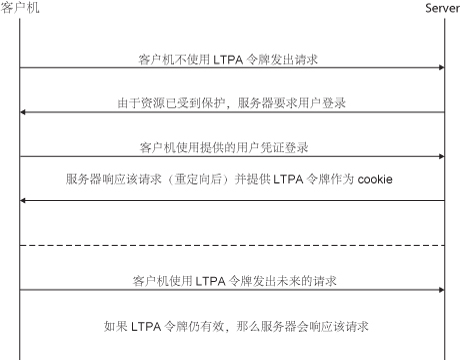
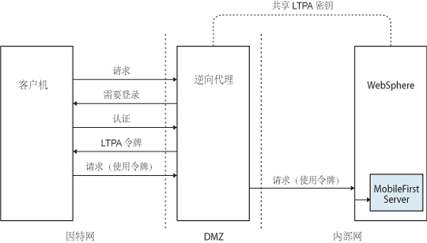
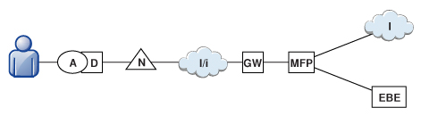
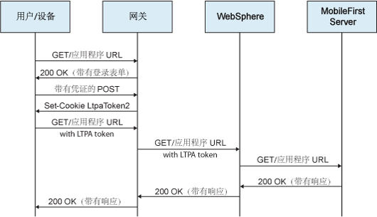

<!-- NLS_CHARSET=UTF-8 -->
## 概述
{: #overview }
轻量级第三方认证 (LTPA) 令牌是 IBM WebSphere Application Server 和其他 IBM 产品使用的一种安全性令牌。 LTPA 可用于将已认证用户的凭证发送到后端服务。 它还可用作用户和多个服务器间的单点登录 (SSO) 令牌。

简单客户机 < - > 具有 LTPA 的服务器流：

在用户登录到服务器后，服务器会生成 LTPA 令牌，这是包含已认证的用户信息的加密散列。 该令牌由所有试图解码的服务器间共享的专用密钥进行签名。 对于 HTTP 服务，该令牌通常采用 cookie 格式。 通过作为 cookie 发送令牌，无需后续用户交互。

LTPA 令牌具有可配置的到期时间以减少会话截取的可能性。

## 具有 LTPA 的逆向代理
{: #reverse-proxy-with-ltpa }
基础结构也可使用 LTPA 令牌与代表用户操作的后端服务器进行通信。 在逆向代理拓扑结构中，用户无法直接访问后端服务器。 逆向代理可用于认证用户的身份，然后将已认证用户的 LTPA 令牌发送到后端服务器。 此配置确保在认证用户之前无法获取对 {{ site.data.keys.mf_server }} 的访问。 在您不希望使用 {{ site.data.keys.product }} 来处理重要用户凭证时，或者想要使用现有认证设置等情况下，这非常有用。 在 DMZ 中，企业环境应使用逆向代理，例如，IBM WebSphere DataPower 或 IBM Security Access Manager，并将 {{ site.data.keys.mf_server }} 放入内部网中。

在逆向代理实施中，必须针对 LTPA 认证配置 {{ site.data.keys.mf_server }} 以获取用户身份。

客户机与后端服务器之间使用逆向代理的 LTPA 流：

## {{ site.data.keys.product_adj }} 与逆向代理的集成
{: #mobilefirst-integration-with-a-reverse-proxy }
您可以使用逆向代理以支持 {{ site.data.keys.product_adj }} 环境中的企业连接，以及向 {{ site.data.keys.product }} 提供认证服务。

### 常规体系结构
{: #general-architecture }
逆向代理通常作为部署的一部分位于 {{ site.data.keys.mf_server }} 实例的前面，如下图中所示，并且遵循网关模式。

**MFP** 图标表示 {{ site.data.keys.mf_server }} 的实例。 **GW** 图标表示逆向代理网关，例如，WebSphere DataPower。 除了保护因特网中的 {{ site.data.keys.product_adj }} 资源，逆向代理还能够终止 HTTPS (SSL) 连接和认证。 逆向代理也可以充当策略执行点 (PEP)。

在使用网关时，设备 (**D**) 上的应用程序 (**A**) 使用网关公布的公共 URI，而不是内部 {{ site.data.keys.mf_server }} URI。 公共 URI 可公开为应用程序中的设置，或者在将应用程序升级到生产期间（在将应用程序发布到公共或专用应用程序商店之前）进行内置。

### 网关认证
{: #authentication-at-the-gateway }
如果在网关处结束认证，{{ site.data.keys.product }} 可通过共享上下文向已认证用户发出通知，如定制 HTTP 头或 cookie。 通过使用可扩展认证框架，您可以配置 {{ site.data.keys.product }} 以使用来自其中一种机制的用户身份，并实现成功登录。 下图显示此网关拓扑的典型认证流程。

针对基于 LTPA 的认证，已成功使用 WebSphere DataPower 测试了此配置。 在成功认证后，网关会将 LTPA 令牌（以 HTTP cookie 形式）转发给 WebSphere Application Server，它会验证 LTPA 令牌并创建调用者主体。 {{ site.data.keys.product }} 可根据需要使用此调用者主体。

## {{ site.data.keys.product_adj }} 基于 LTPA 的 SSO 安全性检查
{: #the-mobilefirst-ltpa-based-sso-security-check }
预定义的 {{ site.data.keys.product_adj }} 基于 LTPA 的单点登录 (SSO) 安全性检查 (**LtpaBasedSSO**) 支持将 {{ site.data.keys.product }} 与 WebSphere Application Server LTPA 协议进行集成。 此安全性检查允许在基于 LTPA 的网关拓扑中集成 {{ site.data.keys.mf_server }} 的实例，如先前部分中所述，并使用后端服务以使用 SSO LTPA 令牌来认证用户。

此预定义的安全性检查可用作 {{ site.data.keys.product_adj }} 安全框架中的任何其他安全性检查，您可以将定制作用域元素映射到此检查，并在保护的资源作用域或必需的应用程序作用域中使用此检查（或包含此检查的作用域元素）。

您还可以针对应用程序配置此安全性检查的行为。

## 配置基于 LTPA 的 SSO 安全性检查
{: #configuring-the-ltpa-based-sso-security-check }
预定义的基于 LTPA 的单点登录 (SSO) 安全性检查 (**LtpaBasedSSO**) 具有单个可配置的属性：**expirationSec**。 此属性设置成功安全性检查状态的到期时间段。 到期时间段确定在成功执行后再次调用检查的最小时间间隔。

> **注：**此过程阐述如何使用 {{ site.data.keys.mf_console }} 来配置属性值。 或者，您也可以直接在 **application-descriptor** 文件中设置属性值。 有关详细信息，请参阅“配置应用程序安全性检查属性”。

1. 打开 {{ site.data.keys.mf_console }} 窗口。 从**导航侧边栏**中选择应用程序版本，然后选择**安全性**选项卡。
2. 在**安全性检查配置**部分中，单击**新建**。
3. 在**配置安全性检查属性**窗口中，配置**基于 LTPA 的 SSO** 安全性检查：
    * 在**安全性检查**字段中，从列表中选择 **LtpaBasedSSO**。
    * 在**到期时间段成功状态（秒）**字段中，为安全性检查的成功状态设置首选到期时间段（秒）。

在完成配置后，您可以在应用程序“安全性”选项卡的“安全性检查配置”表中查看和编辑 LtpaBasedSSO 安全性检查配置。
