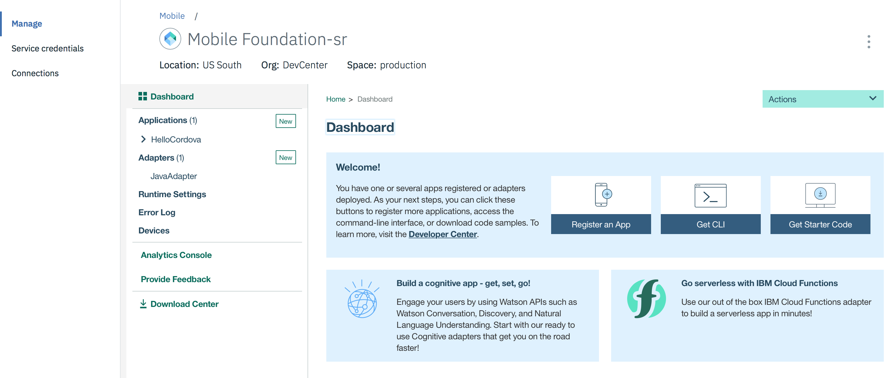

<!-- NLS_CHARSET=UTF-8 -->
## 概述
{: #overview }
本教程提供了在 IBM Cloud 上使用 {{ site.data.keys.mf_bm_full }} (**{{ site.data.keys.mf_bm_short }}**) 服务来设置 {{ site.data.keys.mfound_server }} 实例的分步指示信息。  
{{ site.data.keys.mf_bm_short }} 是一项 IBM Cloud 服务，支持快速轻松地在 **Liberty for Java 运行时**上启动 Mobile Foundation v8.0 的可扩展开发者或生产环境。

{{ site.data.keys.mf_bm_short }} 服务提供了以下计划选项：

1. **Developer**：此计划在 Liberty for Java 运行时上提供 {{ site.data.keys.mfound_server }} 作为 Cloud Foundry 应用程序。 将单独对 Liberty for Java 费用收费，这些费用不包含在此计划中。 此计划不支持使用外部数据库并且仅限于开发和测试。 {{ site.data.keys.mf_bm_short }} 服务器 *Developer 计划*实例允许您注册任意数量的移动应用程序用于开发和测试，但是将连接的设备数限制为每天 10 台。<!--This plan also includes {{ site.data.keys.mf_analytics_service }} service instance. If your usage exceeds the Mobile Analytics free tier entitlements, then charges apply as per Mobile Analytics basic plan.-->

    > **注：**“Developer”计划不提供持续性数据库，因此请务必备份配置，如[“故障诊断”部分中](#troubleshooting)所述。

2. **Professional Per Device**：此计划允许用户在生产中构建、测试和运行移动应用程序。 将根据每天连接的客户机设备数进行计费。 此计划支持大型部署和高可用性。 此计划要求您具有单独创建和计费的 IBM Db2（任何 **Lite** 计划以外的计划）或 Compose for PostgreSQL 服务的实例。此计划在 Liberty for Java 上供应 Mobile Foundation 服务器，从最少 2 个 1 GB 的节点开始。 将单独对 Liberty for Java 费用收费，这些费用不包含在此计划中。<!--Optionally, you can add  Mobile Analytics service instance. The Mobile Analytics service is billed separately.-->

3. **Professional 1 Application**：此计划允许用户以可预测的价格构建和管理单个移动应用程序，不限制移动应用程序用户或设备数量。 单个移动应用程序可以有多种类型，例如 iOS、Android、Windows 和 Mobile Web。 此计划在 Liberty for Java 上的可扩展环境中以 Cloud Foundry 应用程序形式供应 Mobile Foundation 服务器，从最少 2 个 1 GB 的节点开始。 将单独对 Liberty for Java 费用收费，这些费用不包含在此计划中。 此计划还需要单独创建和计费的 IBM Db2（任何 **Lite** 计划以外的计划）或 Compose for PostgreSQL 服务实例。<!--Optionally, you can add {{ site.data.keys.mf_analytics_service }} service instance by clicking the **Add Analytics** button. The Mobile Analytics service is billed separately.-->

4. **Developer Pro**：此计划在 Liberty for Java 运行时上提供 {{ site.data.keys.mfound_server }} 作为 Cloud Foundry 应用程序，并且允许用户开发和测试任意数量的移动应用程序。 此计划要求您具有 **Db2**（任何 **Lite** 计划以外的计划）服务实例。Db2 服务实例是单独创建和计费的。此计划大小受限，并且旨在用于基于团队的开发和测试活动，不可用于生产活动。费用取决于环境的总规模。<!--Optionally, you can add a {{ site.data.keys.mf_analytics_service }} service by clicking the **Add Analytics** button.-->
>_现在不推荐使用 **Developer Pro** 计划。_

5. **Professional Per Capacity：**此计划允许用户在生产环境中构建、测试和运行任意数量的移动应用程序，不限制移动用户或设备数量。它支持大型部署和高可用性。此计划要求您具有 **Db2**（任何 **Lite** 计划以外的计划）服务实例。Db2 服务实例是单独创建和计费的。费用取决于环境的总规模。<!--Optionally, you can add a {{ site.data.keys.mf_analytics_service }} service by clicking the **Add Analytics** button.-->
>_现在不推荐使用 **Professional Per Capacity** 计划。_

> [请参阅服务详细信息](https://console.bluemix.net/catalog/services/mobile-foundation/)，以获取有关可用计划及其计费方式的更多信息。

#### 跳转至：
{: #jump-to}
- [概述](#overview)
    - [跳转至：](#jump-to)
- [设置 {{ site.data.keys.mf_bm_short }} 服务](#setting-up-the--sitedatakeysmfbmshort--service)
  - [设置 *developer* 计划](#setting-up-the-developer-plan)
  - [设置 *Professional 1 Application* 和 *Professional Per Device* 计划](#setting-up-the-professional-1-application-and-professional-per-device-plan)
- [使用 {{ site.data.keys.mf_bm_short }} 服务](#using-the--sitedatakeysmfbmshort--service)
  - [服务器配置](#server-configuration)
  - [高级服务器配置](#advanced-server-configuration)
- [应用 {{ site.data.keys.mfound_server }} 修订](#applying--sitedatakeysmfoundserver--fixes)
- [访问服务器日志](#accessing-server-logs)
    - [跟踪](#tracing)
- [故障诊断](#troubleshooting)
- [补充阅读](#further-reading)

## 设置 {{ site.data.keys.mf_bm_short }} 服务
{: #setting-up-the-mobile-foundation-service }
要设置可用计划，请首先遵循以下步骤进行操作：

1. 转至 [bluemix.net](http://bluemix.net) 并登录，然后单击**目录**。
2. 搜索 **Mobile Foundation** 并单击生成的选项。
3. *可选*。输入服务实例的定制名称，或者使用提供的缺省名称。
4. 选择期望的定价计划，然后单击**创建**。

    

### 设置 *developer* 计划
{: #setting-up-the-developer-plan }

创建 {{ site.data.keys.mf_bm_short }} 服务会创建 {{ site.data.keys.mfound_server }}。
  * 您可以立即访问和使用 {{ site.data.keys.mfound_server }}。
  * 要使用 CLI 访问 {{ site.data.keys.mfound_server }}，您将需要凭证，单击 IBM Cloud 控制台左侧导航面板中提供的**服务凭证**时可获取这些凭证。

  

### 设置 *Professional 1 Application* 和 *Professional Per Device* 计划
{: #setting-up-the-professional-1-application-n-professional-per-device-plan }
1. 这些计划需要外部 [Db2（任何**Lite** 计划以外的计划）数据库实例](https://console.bluemix.net/catalog/services/db2/)。

    * 如果您具有现有的 Db2 服务实例，请选择**使用现有服务**选项，并提供您的凭证：

        

    * 如果您具有现有的 Compose for PostgreSQL 服务实例，请选择**使用现有服务**选项，并提供您的凭证：

        


    * 如果您当前没有 Db2 或 Compose for PostgreSQL 服务实例，请选择**创建新服务**选项并遵循屏幕上的指示信息进行操作：

       

2. 启动 {{ site.data.keys.mfound_server }}。
    - 您可以保留服务器配置的基本级别，并单击**启动基本服务器**，或者
    - 在[“设置”选项卡](#advanced-server-configuration)中更新服务器配置，并单击**启动高级服务器**。

    在此步骤中，将针对 {{ site.data.keys.mf_bm_short }} 服务生成 Cloud Foundry 应用程序，并初始化 Mobile Foundation 环境。 此步骤可能需要 5 到 10 分钟才能完成。

3. 实例就绪后，您可以[使用服务](#using-the-mobile-foundation-service)。

    

## 使用 {{ site.data.keys.mf_bm_short }} 服务
{: #using-the-mobile-foundation-service }

{{ site.data.keys.mfound_server }} 运行后，会显示以下仪表板：


<!--Click on **Add Analytics** to add {{ site.data.keys.mf_analytics_service }} support to your server instance.
Learn more in the [Adding Analytics support](#adding-analytics-support) section.-->

* 单击**启动控制台**以打开 {{ site.data.keys.mf_console }}。缺省用户名为 *admin*，可通过单击密码字段中的眼睛图标来显示密码。

  

* 从 {{ site.data.keys.mf_console }} 单击 **Analytics Console**，以打开 Mobile Analytics 控制台并查看分析数据，如下所示。

  


### 服务器配置
{: #server-configuration }
基本服务器实例包括：

* 单个节点（服务器大小：“小”）
* 1GB 内存
* 2GB 存储容量

### 高级服务器配置
{: #advanced-server-configuration }
通过**设置**选项卡，可以通过添加以下内容来进一步定制服务器实例

* 不同的节点、内存和存储组合
* {{ site.data.keys.mf_console }} 管理密码
* LTPA 密钥
* JNDI 配置
* 用户注册表
* 信任库

  *为 Mobile Foundation 服务创建信任库证书：*

  * 从 IBM Java 或 Oracle Java 的最新修订包 Java 8 JDK 获取*可信证书*。

  * 使用以下命令将附加证书导入到信任库：
    ```
    keytool -import -file firstCA.cert -alias firstCA -keystore truststore.jks
    ```

  >**注**：您可以选择创建自己的信任库，但需要将缺省证书提供给 Mobile Foundation 服务以使其正常运行

<!--* {{ site.data.keys.mf_analytics_service }} configuration-->
* VPN


<!--
## Adding {{ site.data.keys.mf_analytics_service }} support
{: #adding-analytics-support }
You can add {{ site.data.keys.mf_analytics_service }} support to your {{ site.data.keys.mf_bm_short }} service instance by clicking on **Add Analytics** from the service's Dashboard page. This action provisions a {{ site.data.keys.mf_analytics_service }} service instance.

>When you create or recreate the **Developer** plan instance of {{ site.data.keys.mf_bm_short }} service, the {{ site.data.keys.mf_analytics_service }} service instance is added by default.
-->
<!--* When using the **Developer** plan this action will also automatically hook the {{ site.data.keys.mf_analytics_service }} service instance to your {{ site.data.keys.mf_server }} instance.  
* When using the **Developer Pro**, **Professional Per Capacity** or **Professional 1 Application** plans, this action will require additional input from you to select: amount of available Nodes, available Memory and a storage volume. -->
<!--
Once the operation finishes, reload the {{ site.data.keys.mf_console }} page in your browser to access the {{ site.data.keys.mf_analytics_service_console }}.  

> Learn more about {{ site.data.keys.mf_analytics_service }} in the [{{ site.data.keys.mf_analytics_service }} category](../../analytics).

##  Removing {{ site.data.keys.mf_analytics_service }} support
{: #removing-analytics-support}

You can remove the {{ site.data.keys.mf_analytics_service }} support for your {{ site.data.keys.mf_bm_short }} service instance by clicking on **Delete Analytics**  from the service’s Dashboard page. This action deletes the {{ site.data.keys.mf_analytics_service }} service instance.

Once the operation finishes, reload the {{ site.data.keys.mf_console }} page in your browser.
-->
<!--
##  Switching from Analytics deployed with IBM Containers to Analytics service
{: #switching-from-analytics-container-to-analytics-service}

>**Note**: Deleting {{ site.data.keys.mf_analytics_service }} will remove all available analytics data. This data will not be available in the new {{ site.data.keys.mf_analytics_service }} instance.

User can delete current container by clicking on **Delete Analytics** button from service dashboard. This will remove the analytics instance and enable the **Add Analytics** button, which the user can click to add a new {{ site.data.keys.mf_analytics_service }} service instance.
-->

## 应用 {{ site.data.keys.mfound_server }} 修订
{: #applying-mobilefirst-server-fixes }
对 {{ site.data.keys.mf_bm }} 服务的更新会自动应用，无需人为干预，无需同意执行更新。档更新可用时，会在服务的“仪表板”页面中显示一个条幅，其中包含指示信息和操作按钮。

## 访问服务器日志
{: #accessing-server-logs }
要访问服务器日志，请执行下面描述的步骤。

**场景 1：**

1. 设置主机。<br/>
   要管理 IBM Cloud Cloud Foundry 应用程序，需要安装 Cloud Foundry CLI。<br/>
   安装 [Cloud Foundry CLI](https://github.com/cloudfoundry/cli/releases)。
2. 打开终端并使用 `cf login` 登录至您的*组织*和*空间*。
3. 在 CLI 中执行以下命令：
```bash
  cf ssh <mfp_Appname> -c "/bin/cat logs/messages.log" > messages.log
```
4. 只有当启用了跟踪时才执行以下命令：
```bash
cf ssh <mfp_Appname> -c "/bin/cat logs/trace.log" > trace.log
 ```

**场景 2：**      

* 要访问服务器日志，请打开侧边栏导航并单击**应用程序 → 仪表板 → Cloud Foundry 应用程序**。
* 选择您的应用程序，然后单击**日志 → 在 Kibana 中查看**。
* 选择并复制日志消息。


#### 跟踪
{: #tracing }
要启动跟踪以在 **trace.log** 文件中查看调试级别消息：

1. 在**运行时 → SSH** 中，从组合框中选择服务实例（以 **0** 开头的实例标识）。
2. 转至控制台中的每个实例，使用 VI 编辑器打开文件 `/home/vcap/app/wlp/usr/servers/mfp/configDropins/overrides/tracespec.xml`。
3. 更新跟踪语句 `traceSpecification="=info:com.ibm.mfp.*=all"`，然后保存该文件。

现在，可从以上指定位置获取 **trace.log** 文件。


## 故障诊断
{: #troubleshooting }
Developer 计划不提供持续性数据库，这有时可能会导致数据丢失。要在此类情况下快速开始使用，请确保遵循如下最佳实践：

* 每次执行以下任意服务器端操作时：
    * 部署适配器或者更新任何适配器配置或属性值
    * 执行任何安全配置，如作用域映射等

    请从命令行运行以下命令以将配置下载至 .zip 文件：

  ```bash
  $curl -X GET -u admin:admin -o export.zip http://<App Name>.mybluemix.net/mfpadmin/management-apis/2.0/runtimes/mfp/export/all
  ```

* 如果重新创建服务器或者配置丢失，请从命令行运行以下命令以将配置导入服务器：

  ```bash
  $curl -X POST -u admin:admin -F file=@./export.zip http://<App Name>.mybluemix.net/mfpadmin/management-apis/2.0/runtimes/mfp/deploy/multi
  ```

## 补充阅读
{: #further-reading }
现在 {{ site.data.keys.mfound_server }} 实例已启动并正常运行。

* 熟悉 [{{ site.data.keys.mf_console }}](../../product-overview/components/console)。
* 通过这些[快速入门教程](../../quick-start)来体验 Mobile Foundation。
* 阅读所有[可用教程](../../all-tutorials/)。
