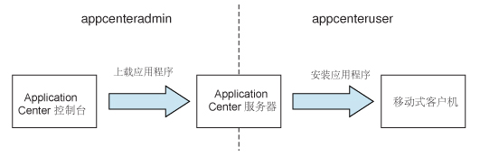
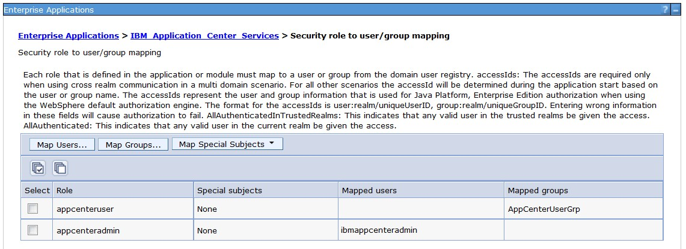

<!-- NLS_CHARSET=UTF-8 -->
## 概述
{: #overview }
可以在 {{ site.data.keys.mf_server }} 安装过程中安装 Application Center。
您可以使用以下某种方法进行安装：

* 使用 IBM Installation Manager 进行安装
* 使用 Ant 任务进行安装
* 手动安装

（可选）您可以先创建所选的数据库，然后使用 Application Center 来安装 {{ site.data.keys.mf_server }}。  
在所选 Web 应用程序服务器中安装 Application Center 之后，需要进行额外配置。 有关更多信息，请参阅下面的“在安装后配置 Application Center”。 如果您在安装程序中选择手动安装，请参阅所选服务器的文档。

> **注：**如果您想要通过 Application Center 在 iOS 设备上安装应用程序，首先必须为 Application Center 服务器配置 SSL。

要获取已安装的文件和工具的列表，请参阅 [{{ site.data.keys.mf_server }} 的分布结构](../installation-manager/#distribution-structure-of-mobilefirst-server)。

#### 跳至：
{: #jump-to }

* [使用 IBM Installation Manager 来安装 Application Center](#installing-application-center-with-ibm-installation-manager)
* [使用 Ant 任务来安装 Application Center](#installing-the-application-center-with-ant-tasks)
* [手动安装 Application Center](#manually-installing-application-center)
* [在安装后配置 Application Center](#configuring-application-center-after-installation)

## 使用 IBM Installation Manager 来安装 Application Center
{: #installing-application-center-with-ibm-installation-manager }
您可以使用 IBM Installation Manager 来安装 Application Center，创建其数据库，并将其部署到应用程序服务器上。  
在开始之前，请验证运行 IBM Installation Manager 的用户是否具有[文件系统先决条件](../appserver/#file-system-prerequisites)中所述的权限。

要使用 IBM Installation Manager 来安装 IBM Application Center，请完成以下步骤。

1. 可选：您可以为 Application Center 手动创建数据库，如下面的[（可选）创建数据库](#optional-creation-of-databases)中所述。 IBM Installation Manager 可以使用缺省设置来创建 Application Center 数据库。
2. 运行 IBM Installation Manager，如[运行 IBM Installation Manager](../installation-manager) 中所述。
3. 对于问题**安装 IBM Application Center**，请选择**是**。

#### 跳至：
{: #jump-to-1 }
* [可选的数据库创建](#optional-creation-of-databases)
* [在 WebSphere Application Server Network Deployment 中安装 Application Center](#installing-application-center-in-websphere-application-server-network-deployment)
* [完成安装](#completing-the-installation)
* [由 IBM Installation Manager 为 Application Center 创建的缺省登录和密码](#default-logins-and-passwords-created-by-ibm-installation-manager-for-the-application-center)

### 可选的数据库创建
{: #optional-creation-of-databases }
如果您要激活在运行
{{ site.data.keys.mf_server }} 安装程序时安装 Application Center 的选项，那么您需要拥有某些数据库访问权限，以授权您创建 Application Center 所需的表。

如果您拥有足够的数据库管理凭证，如果在出现提示时您在安装程序中输入管理员用户名和密码，那么安装程序就会为您创建数据库。 否则，您需要请求您的数据库管理员为您创建所需的数据库。 需要在启动 {{ site.data.keys.mf_server }} 安装程序之前创建数据库。

以下主题描述了受支持数据库管理系统的过程。

#### 跳至：
{: #jump-to-2 }

* [为 Application Center 创建 DB2 数据库](#creating-the-db2-database-for-application-center)
* [为 Application Center 创建 MySQL 数据库](#creating-the-mysql-database-for-application-center)
* [为 Application Center 创建 Oracle 数据库](#creating-the-oracle-database-for-application-center)

#### 为 Application Center 创建 DB2 数据库
{: #creating-the-db2-database-for-application-center }
在 IBM MobileFirst Foundation 安装期间，安装程序会为您创建 Application Center 数据库。

如果您输入数据库服务器上具有 DB2 SYSADM 或 SYSCTRL 权限的用户帐户的名称和密码，并且此帐户可通过 SSH 进行访问，那么安装程序会为您创建 Application Center 数据库。 否则，数据库管理员可以为您创建 Application Center 数据库。 有关更多信息，请参阅 [DB2 解决方案](http://ibm.biz/knowctr#SSEPGG_9.7.0/com.ibm.db2.luw.admin.sec.doc/doc/c0055206.html)用户文档。

在手动创建数据库时，可以将数据库名称（此处为 APPCNTR）和密码替换为您选择的数据库名称和密码。

> **要点：**您可以为数据库和用户指定不同的名称，或者设置不同的密码，但请确保在整个 DB2 数据库设置过程中正确输入相应的数据库名称、用户名和密码。 DB2 在所有平台上的数据库名称长度限制均为 8 个字符，并且对于 UNIX 和 Linux 系统，其用户名和密码长度限制为 8 个字符，而对于 Windows，此限制为 30 个字符。

1. 使用适合您操作系统的命令，在 DB2 管理员组（如 **DB2USERS**）中创建系统用户，例如，名为 **wluser**。 为其设置密码，例如，**wluser**。 如果您希望多个 IBM {{ site.data.keys.mf_server }} 实例连接到同一数据库，请对每个连接使用不同的用户名。 每个数据库用户都有不同的缺省模式。 有关数据库用户的更多信息，请参阅 DB2 文档和操作系统文档。

2. 使用具有 **SYSADM** 或 **SYSCTRL** 许可权的用户身份打开 DB2 命令行处理器：

    * 在 Windows 系统中，单击**开始 → IBM DB2 → 命令行处理器**
    * 在 Linux 或 UNIX 系统中，浏览至 **~/sqllib/bin**，并输入 `./db2`。
    * 输入类似于以下示例的数据库管理器和 SQL 语句以创建 Application Center 数据库（将用户名 **wluser** 替换为您所选的用户名）：

      ```bash
      CREATE DATABASE APPCNTR COLLATE USING SYSTEM PAGESIZE 32768
      CONNECT TO APPCNTR
      GRANT CONNECT ON DATABASE TO USER wluser
      DISCONNECT APPCNTR
      QUIT
      ```

3. 安装程序可以为 Application Center 以特定模式创建数据库表和对象。 这样，您便可以对 Application Center 和 MobileFirst 项目使用相同的数据库。 如果向步骤 1 中创建的用户授予 IMPLICIT\_SCHEMA 权限（步骤 2 中数据库创建脚本内的缺省值），那么无需进一步操作。 如果用户没有 IMPLICIT\_SCHEMA 权限，那么您需要为 Application Center 数据库表和对象创建一种模式。

#### 为 Application Center 创建 MySQL 数据库
{: #creating-the-mysql-database-for-application-center }
在 MobileFirst 安装期间，安装程序会为您创建 Application Center 数据库。

如果您输入超级用户帐户的名称和密码，那么安装程序会为您创建数据库。 有关更多信息，请参阅 MySQL 数据库服务器上的 [Securing the Initial MySQL Accounts](http://dev.mysql.com/doc/refman/5.1/en/default-privileges.html)。 您的数据库管理员还可以为您创建数据库。 在手动创建数据库时，可以将数据库名称（此处为 APPCNTR）和密码替换为您选择的数据库名称和密码。 请注意，在 UNIX 上，MySQL 数据库名称是区分大小写的。

1. 启动 MySQL 命令行工具。
2. 输入以下命令：

   ```bash
   CREATE DATABASE APPCNTR CHARACTER SET utf8 COLLATE utf8_general_ci;
   GRANT ALL PRIVILEGES ON APPCNTR.* TO 'worklight'@'Worklight-host' IDENTIFIED BY 'password';
   GRANT ALL PRIVILEGES ON APPCNTR.* TO 'worklight'@'localhost' IDENTIFIED BY 'password';
   FLUSH PRIVILEGES;
   ```

   此处，您需要将 **Worklight-host** 替换为运行 IBM MobileFirst Foundation 的主机的名称。

#### 为 Application Center 创建 Oracle 数据库
{: #creating-the-oracle-database-for-application-center }
在安装期间，安装程序可创建 Application Center 数据库（Oracle 12c 数据库类型除外），或在现有数据库中创建用户和模式。

如果您在数据库服务器上输入 Oracle 管理员的名称和密码，并且可通过 SSH 访问此帐户，那么安装程序可创建数据库（Oracle 12c 数据库类型除外），或在现有数据库中创建用户和模式。 否则，数据库管理员可以为您创建数据库或者用户和模式。 您在手动创建数据库或用户时，可以使用您选择的数据库名称、用户名和密码。 请注意，Oracle 用户名中的小写字符可导致麻烦。

1. 如果您还没有名为 **ORCL** 的数据库，那么请使用 Oracle Database Configuration Assistant (DBCA) 并执行向导中的步骤来新建名为 **ORCL** 的常规用途数据库：
    * 使用全局数据库名称 **ORCL\_your\_domain** 和系统标识 (SID) **ORCL**。
    * 在步骤**数据库内容**的**定制脚本**选项卡上，请勿运行 SQL 脚本，因为您必须首先创建用户帐户。
    * 在步骤**初始化参数**的**字符集**选项卡上，选择**使用 Unicode (AL32UTF8) 字符集和 UTF8 - Unicode 3.0 UTF-8 国家字符集**。
    * 在接受缺省值的情况下完成此过程。
2. 通过使用 **Oracle Database Control** 或 **Oracle SQLPlus** 命令行解释器来创建数据库用户。
    * 使用 **Oracle Database Control**：
        * 以 **SYSDBA** 身份连接。
        * 转至**用户**页面：单击**服务器**，然后单击**安全**部分中的**用户**。
        * 创建用户，例如名为 **APPCENTER**。 如果您希望多个 IBM {{ site.data.keys.mf_server }} 实例连接到步骤 1 中创建的同一个通用数据库，请对每个连接使用不同的用户名。 每个数据库用户都有不同的缺省模式。
        * 指定以下属性：
            * 概要文件：**DEFAULT**
            * 认证：**password**
            * 缺省表空间：**USERS**
            * 临时表空间：**TEMP**
            * 状态：**Unlocked**
            * 添加系统权限：**CREATE SESSION**
            * 添加系统权限：**CREATE SEQUENCE**
            * 添加系统权限：**CREATE TABLE**
            * 添加配额：**Unlimited for tablespace USERS**
    * 使用 **Oracle SQLPlus** 命令行解释器：  
    以下示例中的命令将为数据库创建名为 APPCENTER 的用户：

        ```bash
        CONNECT SYSTEM/<SYSTEM_password>@ORCL
        CREATE USER APPCENTER IDENTIFIED BY password DEFAULT TABLESPACE USERS QUOTA UNLIMITED ON USERS;
        GRANT CREATE SESSION, CREATE SEQUENCE, CREATE TABLE TO APPCENTER;
        DISCONNECT;
        ```

### 在 WebSphere Application Server Network Deployment 中安装 Application Center
{: #installing-application-center-in-websphere-application-server-network-deployment }
要在一组 WebSphere Application Server Network Deployment 服务器中安装 Application Center，请在运行 Deployment Manager 的机器上运行 IBM Installation Manager。

1. 在 IBM Installation Manager 提示您指定数据库类型时，请选择 **Apache Derby** 以外的任何选项。 IBM MobileFirst Foundation 仅在嵌入方式中支持 Apache Derby，而此选项与通过 WebSphere Application Server Network Deployment 进行的部署不兼容。
2. 在安装程序面板（您在其中指定 WebSphere Application Server 安装目录）中，选择 Deployment Manager 概要文件。

    > **注意：**请勿在选择了应用程序服务器概要文件之后又选择单个受管服务器：这样做会导致 Deployment Manager 覆盖服务器的配置，而不管您是在运行 Deployment Manager 的机器上还是在其他机器上进行安装。
3. 根据您想要将 Application Center 安装到何处来选择所需的作用域。 下表列出了可用的作用域：

    | 作用域	 | 说明 |
    |--------|-------------|
    | 单元	 | 将 Application Center 安装到单元的所有应用程序服务器中。 |
    | 集群| 将 Application Center 安装到指定集群的所有应用程序服务器中。 |
    | 节点   | （不包括集群）将 Application Center 安装到属于指定节点但不在集群中的所有应用程序服务器中。 |
    | 服务器 | 将 Application Center 安装到指定的服务器（不在集群中）中。 |

4. 按照下文[完成安装](#completing-the-installation)中的过程来重新启动目标服务器。

此安装在指定作用域内的服务器集合之外没有影响。 将使用指定的作用域来定义 JDBC 提供程序和 JDBC 数据源。 具有单元作用域的实体（应用程序以及（对于 DB2）认证别名）的名称中包含使其唯一的后缀。 因此，您可以将 Application Center 安装到不同配置中，甚至可以将 Application Center 的不同版本安装到同一单元的不同集群中。

> **注：**由于 JDBC 驱动程序仅安装在一组指定的应用程序服务器中，因此 Deployment Manager 的 WebSphere Application Server 管理控制台中 JDBC 数据源的“测试连接”按钮可能不起作用。

如果您使用前端 HTTP 服务器，那么同样需要配置公共 URL。

### 完成安装
{: #completing-the-installation }
安装完成后，在特定情况下必须重新启动 Web 应用程序服务器。  
在以下情况下，必须重新启动 Web 应用程序服务器：

* 在使用以 DB2 作为数据库类型的 WebSphere Application Server 时。
* 在使用 WebSphere Application Server，并且在安装 IBM MobileFirst Application Center 或 {{ site.data.keys.mf_server }} 之前未启用应用程序安全性的情况下打开 WebSphere Application Server 时。

MobileFirst 安装程序必须激活 WebSphere Application Server 的应用程序安全性（如果尚未激活）才能安装 Application Center。 然后，为了进行此激活，在完成了 {{ site.data.keys.mf_server }} 的安装之后重新启动此应用程序服务器。

* 在使用 WebSphere Application Server Liberty 或 Apache Tomcat 时。
* 在已从先前版本的 {{ site.data.keys.mf_server }} 升级之后。

如果使用 WebSphere Application Server Network Deployment，并且选择了通过 Deployment Manager 进行安装：

* 必须重新启动已在安装期间运行并且已安装 {{ site.data.keys.mf_server }} Web 应用程序的服务器。

要通过 Deployment Manager 控制台重新启动这些服务器，请选择**应用程序 → 应用程序类型 → WebSphere 企业应用程序 → IBM_Application\_Center\_Services → 特定于目标的应用程序状态**。

* 您不必重新启动 Deployment Manager 或节点代理程序。

> **注：**只有 Application Center 安装在应用程序服务器中。

### 由 IBM Installation Manager 为 Application Center 创建的缺省登录和密码
{: #default-logins-and-passwords-created-by-ibm-installation-manager-for-the-application-center }
缺省情况下，IBM Installation Manager 会根据您的应用程序服务器为 Application Center 创建登录。 您可以使用这些登录来测试 Application Center。

#### WebSphere Application Server Full Profile
{: #websphere-application-server-full-profile }
创建登录 **appcenteradmin**，使其密码为安装期间生成和显示的密码。

应用程序域中认证的所有用户也有权访问 **appcenteradmin** 角色。 此角色不用于生产环境，尤其是在 WebSphere Application Server 只配置有一个安全域的情况下。

有关如何修改这些登录的更多信息，请参阅[在 WebSphere Application Server Full Profile 上配置 Java EE 安全角色](#configuring-the-java-ee-security-roles-on-websphere-application-server-full-profile)。

#### WebSphere Application Server Liberty Profile
{: #websphere-application-server-liberty-profile }
* 在 basicRegistry 中创建密码为 demo 的登录 demo。
* 在 basicRegistry 中创建密码为 admin 的登录 appcenteradmin。

有关如何修改这些登录的更多信息，请参阅[在 WebSphere Application Server Liberty Profile 上配置 Java EE 安全角色](#configuring-the-java-ee-security-roles-on-websphere-application-server-liberty-profile)。

#### Apache Tomcat
{: #apache-tomcat }
* 创建密码为 demo 的登录 demo。
* 创建密码为 guest 的登录 guest。
* 创建密码为 admin 的登录 appcenteradmin。

有关如何修改这些登录的更多信息，请参阅[在 Apache Tomcat 上配置 Java EE 安全角色](#configuring-the-java-ee-security-roles-on-apache-tomcat)。

## 使用 Ant 任务来安装 Application Center
{: #installing-the-application-center-with-ant-tasks }
了解可用于安装 Application Center 的 Ant 任务。

#### 跳至：
{: #jump-to-3 }

* [使用 Ant 任务为 Application Center 创建和配置数据库](#creating-and-configuring-the-database-for-application-center-with-ant-tasks)
* [使用 Ant 任务部署 Application Center 控制台和服务](#deploying-the-application-center-console-and-services-with-ant-tasks)

### 使用 Ant 任务为 Application Center 创建和配置数据库
{: #creating-and-configuring-the-database-for-application-center-with-ant-tasks }
如果您未手动创建数据库，那么可以使用 Ant 任务为 Application Center 创建和配置数据库。 如果已存在数据库，那么只能使用 Ant 任务执行配置步骤。

在开始之前，请确保在数据库服务器（可能位于同一台计算机上，也可能位于不同的计算机上）上已安装并正在运行数据库管理系统 (DBMS)。

用于 Application Center 的 Ant 任务位于 {{ site.data.keys.mf_server }} 分发版的 **ApplicationCenter/configuration-samples** 目录中。

如果您希望从没有安装 {{ site.data.keys.mf_server }} 的计算机启动 Ant 任务，那么必须将以下文件复制到该计算机上：

* **mf\_server\_install\_dir/MobileFirstServer/mfp-ant-deployer.jar** 库
* 包含来自 Android SDK 平台工具包 **mf\_server\_install\_dir/ApplicationCenter/tools/android-sdk** 的 aapt 程序的二进制文件的目录
* 位于 **mf\_server\_install\_dir/ApplicationCenter/configuration-samples** 中的 Ant 样本文件

> **注：****mf\_server\_install\_dir** 占位符表示 {{ site.data.keys.mf_server }} 的安装目录。

如果您未按照[可选的数据库创建](#optional-creation-of-databases)中所述手动创建数据库，请执行下面的步骤 1 到 3。
如果已存在数据库，那么必须仅创建数据库表。 请执行下面的步骤 4 到 7。

1. 复制与 DBMS 对应的样本 Ant 文件。 用于创建数据库的文件采用以下模式命名：

    ```bash
    create-appcenter-database-<dbms>.xml
    ```

2. 编辑 Ant 文件，并将占位符值替换为该文件开头的属性。
3. 运行以下命令以创建 Application Center 数据库：

    ```bash
    ant -f create-appcenter-database-<dbms>.xml databases
    ```

    您可以在 **mf\_server\_install\_dir/shortcuts** 中找到该 Ant 命令。

    如果已存在数据库，那么必须完成以下步骤来仅创建数据库表：

4. 复制与应用程序服务器和 DBMS 对应的样本 Ant 文件。 用于配置现有数据库的文件采用以下模式命名：

    ```bash
    configure-appcenter-<appServer>-<dbms>.xml
    ```

5. 编辑 Ant 文件，并将占位符值替换为该文件开头的属性。
6. 运行以下命令以配置数据库：

    ```bash
    ant -f configure-appcenter-<appServer>-<dbms>.xml databases
    ```

    您可以在 **mf\_server\_install\_dir/shortcuts** 中找到该 Ant 命令。

7. 保存 Ant 文件。 您稍后可能需要使用此文件来应用修订包或执行升级。

如果您不想保存密码，可以在出现交互式提示时使用“************”（12 个星号）来代替密码。

### 使用 Ant 任务部署 Application Center 控制台和服务
{: #deploying-the-application-center-console-and-services-with-ant-tasks }
通过使用 Ant 任务，不仅可将 Application Center 控制台和服务部署到应用程序服务器中，还可配置 Application Center 所使用的数据源、属性和数据库驱动程序。

开始之前：

* 完成[使用 Ant 任务为 Application Center 创建和配置数据库](#creating-and-configuring-the-database-for-application-center-with-ant-tasks)中的过程。
* 您必须在安装了应用程序服务器的计算机上运行 Ant 任务，或运行针对 WebSphere Application Server Network Deployment 的 Network Deployment Manager。 如果您希望从没有安装 {{ site.data.keys.mf_server }} 的计算机上启动 Ant 任务，那么必须将以下文件和目录复制到该计算机上：

    * **mf\_server\_install\_dir/MobileFirstServer/mfp-ant-deployer.jar** 库
    * **mf_server\_install\_dir/ApplicationCenter/console** 中的 Web 应用程序（WAR 和 EAR 文件）
    * 包含来自 Android SDK 平台工具包 **mf\_server\_install\_dir/ApplicationCenter/tools/android-sdk** 的 aapt 程序的二进制文件的目录
    * 位于 **mf\_server\_install\_dir/ApplicationCenter/configuration-samples** 中的 Ant 样本文件

> **注：**mf_server_install_dir 占位符表示 {{ site.data.keys.mf_server }} 的安装目录。

1. 复制与应用程序服务器和 DBMS 对应的 Ant 文件。 用于配置 Application Center 的文件按照以下模式命名：

    ```bash
    configure-appcenter-<appserver>-<dbms>.xml
    ```

2. 编辑 Ant 文件，并将占位符值替换为该文件开头的属性。
3. 运行以下命令以将 Application Center 控制台和服务部署到应用程序服务器中：

    ```bash
    ant -f configure-appcenter-<appserver>-<dbms>.xml install
    ```

    您可以在 **mf\_server\_install\_dir/shortcuts** 中找到该 Ant 命令。

    > **注：**通过这些 Ant 文件，您还可以执行以下操作：
    >
    > * 使用目标 **uninstall** 来卸载 Application Center。
    > * 使用目标 **minimal-update** 来更新 Application Center，以便应用修订包。

4. 保存 Ant 文件。 您稍后可能需要使用此文件来应用修订包或执行升级。 如果您不想保存密码，可以在出现交互式提示时使用“************”（12 个星号）来代替密码。
5. 如果您在 WebSphere Application Server Liberty Profile 或 Apache Tomcat 上进行安装，请检查 aapt 程序对于所有用户而言是否均为可执行程序。 如果需要，必须设置适当的用户权限。 例如，在 UNIX/Linux 系统上：

    ```bash
    chmod a+x mf_server_install_dir/ApplicationCenter/tools/android-sdk/*/aapt*
    ```

## 手动安装 Application Center
{: #manually-installing-application-center }
要使用与 {{ site.data.keys.mf_server }} 安装期间指定的数据库或模式不同的数据库或模式，需要对其进行重新配置。 该重新配置过程取决于数据库的类型和应用程序服务器的种类。

在 Apache Tomcat 以外的应用程序服务器上，可通过两个 WAR 文件或一个 EAR 文件部署 Application Center。

> **限制：**无论是作为 {{ site.data.keys.mf_server }} 安装的一部分使用 IBM Installation Manager 安装 Application Center，还是手动进行安装，请记住 Application Center 的“滚动更新”不受支持。 即，不能安装针对同一数据库运行的两个版本的 Application Center（例如，V5.0.6 和 V6.0.0）。

#### 跳至：
{: #jump-to-4 }

* [为 Application Center 手动配置 DB2 数据库](#configuring-the-db2-database-manually-for-application-center)
* [为 Application Center 手动配置 Apache Derby 数据库](#configuring-the-apache-derby-database-manually-for-application-center)
* [为 Application Center 手动配置 MySQL 数据库](#configuring-the-mysql-database-manually-for-application-center)
* [为 Application Center 手动配置 Oracle 数据库](#configuring-the-oracle-database-manually-for-application-center)
* [部署 ApplicationCenter WAR 文件并手动配置应用程序服务器](#deploying-the-application-center-war-files-and-configuring-the-application-server-manually)
* [部署 Application Center EAR 文件并手动配置应用程序服务器](#deploying-the-application-center-ear-file-and-configuring-the-application-server-manually)

### 为 Application Center 手动配置 DB2 数据库
{: #configuring-the-db2-database-manually-for-application-center }
手动配置 DB2 数据库的方式是：创建数据库，创建数据库表，然后将相关应用程序服务器配置为使用此数据库设置。

1. 创建数据库。 [为 Application Center 创建 DB2 数据库](#creating-the-db2-database-for-application-center)中描述了此步骤。
2. 创建数据库中的表。 [为 Application Center 手动设置 DB2 数据库](#setting-up-your-db2-database-manually-for-application-center)中描述了此步骤。
3. 执行特定于应用程序服务器的设置，如以下列表所示。

#### 跳至：
{: #jump-to-5 }

* [为 Application Center 手动设置 DB2 数据库](#setting-up-your-db2-database-manually-for-application-center)
* [为 Application Center 手动配置 Liberty Profile for DB2](#configuring-liberty-profile-for-db2-manually-for-application-center)
* [为 Application Center 手动配置 WebSphere Application Server for DB2](#configuring-websphere-application-server-for-db2-manually-for-application-center)
* [为 Application Center 手动配置 Apache Tomcat for DB2](#configuring-apache-tomcat-for-db2-manually-for-application-center)

##### 为 Application Center 手动设置 DB2 数据库
{: #setting-up-your-db2-database-manually-for-application-center }
可通过创建数据库模式来为 Application Center 设置 DB2 数据库。

1. 通过使用适合您操作系统的命令，在 DB2 管理员组（如 **DB2USERS**）中创建系统用户 **worklight**。 将其密码设置为 **worklight**。 有关更多信息，请参阅 DB2 文档以及您操作系统的文档。

> **要点：**您可以为用户指定不同的名称，或者设置不同的密码，但请确保在整个 DB2 数据库设置过程中正确输入相应的用户名和密码。 对于 UNIX 和 Linux 系统，DB2 的用户名和密码长度限制为 8 个字符，而对于 Windows，此限制为 30 个字符。

2. 使用具有 **SYSADM** 或 **SYSCTRL** 许可权的用户身份打开 DB2 命令行处理器：
    * 在 Windows 系统中，单击**开始 → IBM DB2 → 命令行处理器**。
    * 在 Linux 或 UNIX 系统上，浏览至 **~/sqllib/bin** 并输入 `/db2`。

3. 输入以下数据库管理器和 SQL 语句以创建名为 **APPCNTR** 的数据库：

   ```bash
   CREATE DATABASE APPCNTR COLLATE USING SYSTEM PAGESIZE 32768
   CONNECT TO APPCNTR
   GRANT CONNECT ON DATABASE TO USER worklight
   QUIT
   ```

4. 使用以下命令运行 DB2，以在名为 **APPSCHM**（可更改此模式名称）的模式中创建 **APPCNTR** 表。 该命令可在现有数据库上运行，该数据库的页面大小与步骤 3 中定义的页面大小兼容。

   ```bash
   db2 CONNECT TO APPCNTR
   db2 SET CURRENT SCHEMA = 'APPSCHM'
   db2 -vf product_install_dir/ApplicationCenter/databases/create-appcenter-db2.sql -t
   ```

##### 为 Application Center 手动配置 Liberty Profile for DB2
{: #configuring-liberty-profile-for-db2-manually-for-application-center }
您可以通过 WebSphere Application Server Liberty Profile 为 Application Center 手动设置和配置 DB2 数据库。  
完成 DB2 数据库设置过程，然后继续操作。

1. 将 DB2 JDBC 驱动程序 JAR 文件添加到 **$LIBERTY\_HOME/wlp/usr/shared/resources/db2** 中。

    如果此目录不存在，请予以创建。 您可以通过以下两种方法之一来检索该文件：
    * 从 [DB2 JDBC 驱动程序版本](http://www.ibm.com/support/docview.wss?uid=swg21363866)进行下载。
    * 从 DB2 服务器目录上的 **db2\_install\_dir/java** 中进行访存。

2. 在 **$LIBERTY_HOME/wlp/usr/servers/worklightServer/server.xml** 文件中配置数据源，如下所示：

   在此路径中，可以将 **worklightServer** 替换为您的服务器的名称。

   ```xml
   <library id="DB2Lib">
        <fileset dir="${shared.resource.dir}/db2" includes="*.jar"/>
   </library>

   <!-- Declare the IBM Application Center database. -->
   <dataSource jndiName="jdbc/AppCenterDS" transactional="false">
      <jdbcDriver libraryRef="DB2Lib"/>
      <properties.db2.jcc databaseName="APPCNTR"  currentSchema="APPSCHM"
            serverName="db2server" portNumber="50000"
            user="worklight" password="worklight"/>
   </dataSource>
   ```

   **user=** 之后的 **worklight** 占位符是系统用户（具有先前创建的 **APPCNTR** 数据库的 **CONNECT** 访问权）的名称。  

   **password=** 之后的 **worklight** 占位符是用户的密码。 如果您已定义其他用户名和/或其他密码，请相应替换 **worklight**。 此外，将 **db2server** 替换为 DB2 服务器的主机名（例如，**localhost**，如果位于相同的计算机上）。

   对于 UNIX 和 Linux 系统，DB2 的用户名和密码长度限制为 8 个字符，而对于 Windows，此限制为 30 个字符。

3. 可以使用 **liberty\_install\_dir/bin** 中的 securityUtility 程序来加密数据库密码。

##### 为 Application Center 手动配置 WebSphere Application Server for DB2
{: #configuring-websphere-application-server-for-db2-manually-for-application-center }
您可以通过 WebSphere Application Server 为 Application Center 手动设置和配置 DB2 数据库。

1. 确定 WebSphere Application Server 安装目录中 JDBC 驱动程序 JAR 文件的合适目录。
    * 对于独立服务器，您可以使用诸如 **was\_install\_dir/optionalLibraries/IBM/Worklight/db2** 之类的目录。
    * 要部署到 WebSphere Application Server ND 单元，请使用 **was\_install\_dir/profiles/profile-name/config/cells/cell-name/Worklight/db2**。
    * 要部署到 WebSphere Application Server ND 集群，请使用 **was\_install\_dir/profiles/profile-name/config/cells/cell-name/clusters/cluster-name/Worklight/db2**。
    * 要部署到 WebSphere Application Server ND 节点，请使用 **was\_install\_dir/profiles/profile-name/config/cells/cell-name/nodes/node-name/Worklight/db2**。
    * 要部署到 WebSphere Application Server ND 服务器，请使用 **was\_install\_dir/profiles/profile-name/config/cells/cell-name/nodes/node-name/servers/server-name/Worklight/db2**。

    如果此目录不存在，请创建该目录。

2. 将 DB2 JDBC 驱动程序 JAR 文件及其关联的许可证文件（如果有）添加到步骤 1 中确定的目录。  
    您可以通过以下两种方法之一来检索驱动程序文件：
    * 从 [DB2 JDBC 驱动程序版本](http://www.ibm.com/support/docview.wss?uid=swg21363866)进行下载。
    * 从 DB2 服务器上的 **db2\_install\_dir/java** 目录中进行访存。

3. 在 WebSphere Application Server 控制台中，单击**资源 → JDBC → JDBC 提供程序**。  
    * 从**作用域**组合框中，选择相应的作用域。
    * 单击**新建**。
    * 将**数据库类型**设置为 **DB2**。
    * 将**提供程序类型**设置为**使用 IBM JCC 驱动程序的 DB2**。
    * 将**实现类型**设置为**连接池数据源**。
    * 将**名称**设置为**使用 IBM JCC 驱动程序的 DB2**。
    * 单击**下一步**。
    * 将类路径设置为步骤 1 中确定的目录中的 JAR 文件集，并将 **was\_install\_dir/profiles/profile-name** 替换为 WebSphere Application Server 变量引用 `${USER_INSTALL_ROOT}`。
    * 请勿设置**本机库路径**。
    * 单击**下一步**。
    * 单击**完成**。
    * 这样就创建了 JDBC 提供程序。
    * 单击**保存**。

4. 创建 Application Center 数据库的数据源：
    * 单击**资源 → JDBC → 数据源**。
    * 从**作用域**组合框中，选择相应的作用域。
    * 单击**新建**以创建数据源。
    * 将**数据源名称**设置为 **Application Center 数据库**。
    * 将 **JNDI 名称**设置为 **jdbc/AppCenterDS**。
    * 单击**下一步**。
    * 输入数据源的属性，例如：
        * **驱动程序类型**：4
        * **数据库名称**：APPCNTR
        * **服务器名称**：localhost
        * **端口号**：50000（缺省值）
    * 单击**下一步**。
    * 创建 JAAS-J2C 认证数据（指定 DB2 用户名和密码作为其属性）。 如果需要，请重复步骤 4.a 到 4.h，以返回到数据源创建向导。
    * 选择您在**组件管理的认证别名**组合框（而非**容器管理的认证别名**组合框）中创建的认证别名。
    * 单击**下一步**和**完成**。
    * 单击**保存**。
    * 在**资源 → JDBC → 数据源**中，选择新的数据源。
    * 单击 **WebSphere Application Server 数据源属性**。
    * 选中**非事务数据源**复选框。
    * 单击**确定**。
    * 单击**保存**。
    * 单击**数据源的定制属性**，选择属性 **currentSchema**，然后将值设置为用于创建 Application Center 表的模式（在此示例中为 APPSCHM）。
5. 通过选择**数据源**并单击**测试连接**来测试数据源连接。

将**在 (CMP) 中使用此数据源**保持为选中状态。

##### 为 Application Center 手动配置 Apache Tomcat for DB2
{: #configuring-apache-tomcat-for-db2-manually-for-application-center }
如果您想要通过 Apache Tomcat 服务器为 Application Center 手动设置和配置 DB2 数据库，请使用以下过程。  
在继续之前，请完成 DB2 数据库设置过程。

1. 添加 DB2 JDBC 驱动程序 JAR 文件。

    您可以使用以下某种方法来检索此 JAR 文件：
    * 从 [DB2 JDBC 驱动程序版本](http://www.ibm.com/support/docview.wss?uid=swg21363866)进行下载。
    * 或者，从 DB2 服务器上的 **db2\_install\_dir/java** 中访存到 **$TOMCAT_HOME/lib** 中。

2. 准备用于定义数据源的 XML 语句，如以下代码示例中所示。

   ```xml
   <Resource auth="Container"
            driverClassName="com.ibm.db2.jcc.DB2Driver"
            name="jdbc/AppCenterDS"
            username="worklight"
            password="password"
            type="javax.sql.DataSource"
            url="jdbc:db2://server:50000/APPCNTR:currentSchema=APPSCHM;"/>
   ```

   **username=** 之后的 **worklight** 参数是系统用户（具有先前创建的 **APPCNTR** 数据库的“CONNECT”访问权）的名称。 **password=** 之后的 **password** 参数是此用户的密码。 如果您已定义其他用户名和/或其他密码，请相应替换这些条目。

   DB2 对用户名和密码的长度实施了限制。
    * 对于 UNIX 和 Linux 系统：8 个字符
    * 对于 Windows：30 个字符

3. 将该语句插入 server.xml 文件中，如[为 Application Center 手动配置 Apache Tomcat](#configuring-apache-tomcat-for-application-center-manually) 中所示。

### 为 Application Center 手动配置 Apache Derby 数据库
{: #configuring-the-apache-derby-database-manually-for-application-center }
手动配置 Apache Derby 数据库的方式为创建数据库和数据库表，然后将相关应用程序服务器配置为使用此数据库设置。

1. 创建数据库以及其中的表。 [为 Application Center 手动设置 Apache Derby 数据库](#setting-up-your-apache-derby-database-manually-for-application-center)中描述了此步骤。
2. 将应用程序服务器配置为使用此数据库设置。 转至以下主题之一。

#### 跳至：
{: #jump-to-6 }

* [为 Application Center 手动设置 Apache Derby 数据库](#setting-up-your-apache-derby-database-manually-for-application-center)
* [为 Application Center 手动配置 Liberty Profile for Derby](#configuring-liberty-profile-for-derby-manually-for-application-center)
* [为 Application Center 手动配置 WebSphere Application Server for Derby](#configuring-websphere-application-server-for-derby-manually-for-application-center)
* [为 Application Center 手动配置 Apache Tomcat for Derby](#configuring-apache-tomcat-for-derby-manually-for-application-center)

##### 为 Application Center 手动设置 Apache Derby 数据库
{: #setting-up-your-apache-derby-database-manually-for-application-center }
可通过创建数据库模式来为 Application Center 设置 Apache Derby 数据库。

1. 在要创建数据库的位置中，在 Windows 系统上运行 **ij.bat**，或者在 UNIX 和 Linux 系统上运行 **ij.sh**。

   > **注：**ij 程序是 Apache Derby 的一部分。 如果未安装该程序，可从 [Apache Derby: Downloads](http://db.apache.org/derby/derby_downloads) 下载。

   有关 Apache Derby 的受支持版本，请参阅[系统需求](../../../product-overview/requirements)。  
   该脚本显示 ij 版本号。

2. 在命令提示符中，输入以下命令：

   ```bash
   connect 'jdbc:derby:APPCNTR;user=APPCENTER;create=true';
   run '<product_install_dir>/ApplicationCenter/databases/create-appcenter-derby.sql';
   quit;
   ```

##### 为 Application Center 手动配置 Liberty Profile for Derby
{: #configuring-liberty-profile-for-derby-manually-for-application-center }
如果您想要通过 WebSphere Application Server Liberty Profile 为 Application Center 手动设置和配置 Apache Derby 数据库，请使用以下过程。 完成 Apache Derby 数据库设置过程，然后再继续。

在 $LIBERTY_HOME/usr/servers/worklightServer/server.xml 文件（在此路径中，可将 worklightServer 替换为您服务器的名称）中配置数据源，如下所示：

```xml
<!-- Declare the jar files for Derby access through JDBC. -->
<library id="derbyLib">
  <fileset dir="C:/Drivers/derby" includes="derby.jar" />
</library>

<!-- Declare the IBM Application Center database. -->
<dataSource jndiName="jdbc/AppCenterDS" transactional="false" statementCacheSize="10">
  <jdbcDriver libraryRef="derbyLib"
              javax.sql.ConnectionPoolDataSource="org.apache.derby.jdbc.EmbeddedConnectionPoolDataSource40"/>
  <properties.derby.embedded databaseName="DERBY_DATABASES_DIR/APPCNTR" user="APPCENTER"
                             shutdownDatabase="false" connectionAttributes="upgrade=true"/>
  <connectionManager connectionTimeout="180"
                     maxPoolSize="10" minPoolSize="1"
                     reapTime="180" maxIdleTime="1800"
                     agedTimeout="7200" purgePolicy="EntirePool"/>
</dataSource>
```

##### 为 Application Center 手动配置 WebSphere Application Server for Derby
{: #configuring-websphere-application-server-for-derby-manually-for-application-center }
您可以通过 WebSphere Application Server 为 Application Center 手动设置和配置 Apache Derby 数据库。 完成 Apache Derby 数据库设置过程，然后再继续。

1. 确定 WebSphere Application Server 安装目录中 JDBC 驱动程序 JAR 文件的合适目录。 如果此目录不存在，请创建该目录。
    * 对于独立服务器，您可以使用诸如 **was\_install\_dir/optionalLibraries/IBM/Worklight/derby** 之类的目录。
    * 要部署到 WebSphere Application Server ND 单元，请使用 **was\_install\_dir/profiles/profile-name/config/cells/cell-name/Worklight/derby**。
    * 要部署到 WebSphere Application Server ND 集群，请使用 **was\_install\_dir/profiles/profile-name/config/cells/cell-name/clusters/cluster-name/Worklight/derby**。
    * 要部署到 WebSphere Application Server ND 节点，请使用 **was\_install\_dir/profiles/profile-name/config/cells/cell-name/nodes/node-name/Worklight/derby**。
    * 要部署到 WebSphere Application Server ND 服务器，请使用 **was\_install\_dir/profiles/profile-name/config/cells/cell-name/nodes/node-name/servers/server-name/Worklight/derby**。
2. 将 **product\_install\_dir/ApplicationCenter/tools/lib/derby.jar** 中的 **Derby** JAR 文件添加到步骤 1 中确定的目录中。
3. 设置 JDBC 提供程序。
    * 在 WebSphere Application Server 控制台中，单击**资源 → JDBC → JDBC 提供程序**。
    * 从**作用域**组合框中，选择相应的作用域。
    * 单击**新建**。
    * 将**数据库类型**设置为**用户定义**。
    * 将**类实现名**设置为 **org.apache.derby.jdbc.EmbeddedConnectionPoolDataSource40**。
    * 将**名称**设置为 **Worklight - Derby JDBC 提供程序**。
    * 将**描述**设置为 **Worklight 的 Derby JDBC 提供程序**。
    * 单击**下一步**。
    * 将**类路径**设置为步骤 1 中确定的目录中的 JAR 文件，并将 **was\_install\_dir/profiles/profile-name** 替换为 WebSphere Application Server 变量引用 **${USER\_INSTALL\_ROOT}**。
    * 单击**完成**。
4. 为 **Worklight** 数据库创建数据源。
    * 在 WebSphere Application Server 控制台中，单击**资源 → JDBC → 数据源**。
    * 从**作用域**组合框中，选择相应的作用域。
    * 单击**新建**。
    * 将**数据源名称**设置为 **Application Center 数据库**。
    * 将 **JNDI** 名称设置为 **jdbc/AppCenterDS**。
    * 单击**下一步**。
    * 选择名为 **Worklight - Derby JDBC 提供程序**的现有 JDBC 提供程序。
    * 单击**下一步**。
    * 单击**下一步**。
    * 单击**完成**。
    * 单击**保存**。
    * 在该表中，单击您创建的 **Application Center 数据库**数据源。
    * 在**其他属性**下，单击**定制属性**。
    * 单击**数据库名称**。
    * 将**值**设置为指向[为 Application Center 手动设置 Apache Derby 数据库](#setting-up-your-apache-derby-database-manually-for-application-center)中创建的 **APPCNTR** 数据库的路径。
    * 单击**确定**。
    * 单击**保存**。
    * 在该页面的顶部，单击 **Application Center 数据库**。
    * 在**其他属性**下，单击 **WebSphere Application Server 数据源属性**。
    * 选择**非事务数据源**。
    * 单击**确定**。
    * 单击**保存**。
    * 在该表中，选择您创建的**Application Center 数据库**数据源。
    * 可选：仅当不在 WebSphere Application Server Deployment Manager 控制台上时，才单击**测试连接**。

##### 为 Application Center 手动配置 Apache Tomcat for Derby
{: #configuring-apache-tomcat-for-derby-manually-for-application-center }
您可以通过 Apache Tomcat 应用程序服务器为 Application Center 手动设置和配置 Apache Derby 数据库。 完成 Apache Derby 数据库设置过程，然后再继续。

1. 将 **product\_install\_dir/ApplicationCenter/tools/lib/derby.jar** 中的 **Derby** JAR 文件添加到 **$TOMCAT\_HOME/lib** 目录中。
2. 准备用于定义数据源的 XML 语句，如以下代码示例中所示。

   ```xml
   <Resource auth="Container"
            driverClassName="org.apache.derby.jdbc.EmbeddedDriver"
            name="jdbc/AppCenterDS"
            username="APPCENTER"
            password=""
            type="javax.sql.DataSource"
            url="jdbc:derby:DERBY_DATABASES_DIR/APPCNTR"/>
   ```

3. 将该语句插入 **server.xml** 文件中，如[为 Application Center 手动配置 Apache Tomcat](#configuring-apache-tomcat-for-application-center-manually) 中所示。

### 为 Application Center 手动配置 MySQL 数据库
{: #configuring-the-mysql-database-manually-for-application-center }
手动配置 MySQL 数据库的方式为创建数据库，创建数据库表，然后将相关应用程序服务器配置为使用此数据库设置。

1. 创建数据库。 [为 Application Center 创建 MySQL 数据库](#creating-the-mysql-database-for-application-center)中描述了此步骤。
2. 创建数据库中的表。 [为 Application Center 手动设置 MySQL 数据库](#setting-up-your-mysql-database-manually-for-application-center)中描述了此步骤。
3. 执行特定于应用程序服务器的设置，如以下列表所示。

#### 跳至：
{: #jump-to-7 }

* [为 Application Center 手动设置 MySQL 数据库](#setting-up-your-mysql-database-manually-for-application-center)
* [为 Application Center 手动配置 Liberty Profile for MySQL](#configuring-liberty-profile-for-mysql-manually-for-application-center)
* [为 Application Center 手动配置 WebSphere Application Server for MySQL](#configuring-websphere-application-server-for-mysql-manually-for-application-center)
* [为 Application Center 手动配置 Apache Tomcat for MySQL](#configuring-apache-tomcat-for-mysql-manually-for-application-center)

##### 为 Application Center 手动设置 MySQL 数据库
{: #setting-up-your-mysql-database-manually-for-application-center }
完成以下过程来设置您的 MySQL 数据库。

1. 创建数据库模式。
    * 使用选项 `-u root` 运行 MySQL 命令行客户机。
    * 输入以下命令：

   ```bash
   CREATE DATABASE APPCNTR CHARACTER SET utf8 COLLATE utf8_general_ci;
   GRANT ALL PRIVILEGES ON APPCNTR.* TO 'worklight'@'Worklight-host'IDENTIFIED BY 'worklight';
   GRANT ALL PRIVILEGES ON APPCNTR.* TO 'worklight'@'localhost' IDENTIFIED BY 'worklight';
   FLUSH PRIVILEGES;

   USE APPCNTR;
   SOURCE product_install_dir/ApplicationCenter/databases/create-appcenter-mysql.sql;
   ```

   其中，@ 符号前面的 **worklight** 是用户名，`IDENTIFIED BY` 后面的 **worklight** 是密码，**Worklight-host** 是运行 IBM MobileFirst Foundation 的主机的名称。

2. 将以下属性添加到 MySQL 选项文件：max_allowed_packet=256M。  
    有关选项文件的更多信息，请参阅 MySQL 中的 MySQL 文档。

3. 将以下属性添加到 MySQL 选项文件：innodb_log_file_size = 250M  
    有关 innodb_log_file_size 属性的更多信息，请参阅 MySQL 文档的 innodb_log_file_size 节。

##### 为 Application Center 手动配置 Liberty Profile for MySQL
{: #configuring-liberty-profile-for-mysql-manually-for-application-center }
如果您想要通过 WebSphere Application Server Liberty Profile 为 Application Center 手动设置和配置 MySQL 数据库，请使用以下过程。 完成 MySQL 数据库设置过程，然后再继续。

> **注：**与 WebSphere Application Server Liberty Profile 或 WebSphere Application Server Full Profile 结合使用的 MySQL 不属于受支持的配置。 有关更多信息，请参阅 [WebSphere Application Server 支持声明](http://www.ibm.com/support/docview.wss?uid=swg27004311)。 您可以使用 IBM DB2 或其他受 WebSphere Application Server 支持的数据库，从 IBM 支持中心全面支持的配置中受益。

1. 将 MySQL JDBC 驱动程序 JAR 文件添加到 **$LIBERTY_HOME/wlp/usr/shared/resources/mysql** 中。 如果此目录不存在，请予以创建。
2. 如下所示配置 **$LIBERTY_HOME/usr/servers/worklightServer/server.xml** 文件（在此路径中，可将 **worklightServer** 替换为您的服务器的名称）中的数据源：

   ```xml
   <!-- Declare the jar files for MySQL access through JDBC. -->
   <library id="MySQLLib">
      <fileset dir="${shared.resource.dir}/mysql" includes="*.jar"/>
   </library>

   <!-- Declare the IBM Application Center database. -->
   <dataSource jndiName="jdbc/AppCenterDS" transactional="false">
      <jdbcDriver libraryRef="MySQLLib"/>
   <properties databaseName="APPCNTR"
              serverName="mysqlserver" portNumber="3306"
              user="worklight" password="worklight"/>
   </dataSource>
   ```

   其中，**user=** 之后的 **worklight** 是用户名，**password=** 之后的 **worklight** 是此用户的密码，而 **mysqlserver** 是您的 MySQL 服务器的主机名（例如，如果它在同一机器上，那么为 localhost）。

3. 可以使用 `<liberty_install_dir>/bin` 中的 securityUtility 程序来加密数据库密码。

##### 为 Application Center 手动配置 WebSphere Application Server for MySQL
{: #configuring-websphere-application-server-for-mysql-manually-for-application-center }
如果您想要通过 WebSphere Application Server 为 Application Center 手动设置和配置 MySQL 数据库，请使用以下过程。 完成 MySQL 数据库设置过程，然后再继续。

> **注：**与 WebSphere Application Server Liberty Profile 或 WebSphere Application Server Full Profile 结合使用的 MySQL 不属于受支持的配置。 有关更多信息，请参阅 [WebSphere Application Server 支持声明](http://www.ibm.com/support/docview.wss?uid=swg27004311)。 我们建议您使用 IBM DB2 或其他受 WebSphere Application Server 支持的数据库，从 IBM 支持中心全面支持的配置中受益。

1. 确定 WebSphere Application Server 安装目录中 JDBC 驱动程序 JAR 文件的合适目录。
    * 对于独立服务器，您可以使用诸如 **WAS\_INSTALL\_DIR/optionalLibraries/IBM/Worklight/mysql** 之类的目录。
    * 要部署到 WebSphere Application Server ND 单元，请使用 **WAS\_INSTALL\_DIR/profiles/profile-name/config/cells/cell-name/Worklight/mysql**。
    * 要部署到 WebSphere Application Server ND 集群，请使用 **WAS\_INSTALL\_DIR/profiles/profile-name/config/cells/cell-name/clusters/cluster-name/Worklight/mysql**。
    * 要部署到 WebSphere Application Server ND 节点，请使用 **WAS\_INSTALL\_DIR/profiles/profile-name/config/cells/cell-name/nodes/node-name/Worklight/mysql**。
    * 要部署到 WebSphere Application Server ND 服务器，请使用 **WAS\_INSTALL\_DIR/profiles/profile-name/config/cells/cell-name/nodes/node-name/servers/server-name/Worklight/mysql**。

    如果此目录不存在，请创建该目录。

2. 将从 [Download Connector/J](http://dev.mysql.com/downloads/connector/j/) 上下载的 MySQL JDBC 驱动程序 JAR 文件添加到步骤 1 所确定的目录中。
3. 设置 JDBC 提供程序：
    * 在 WebSphere Application Server 控制台中，单击**资源 → JDBC → JDBC 提供程序**。
    * 从**作用域**组合框中，选择相应的作用域。
    * 单击**新建**。
    * 创建名为 **MySQL** 的 **JDBC 提供程序**。
    * 将**数据库类型**设置为**用户定义**。
    * 将**作用域**设置为**单元**。
    * 将**实施类**设置为 **com.mysql.jdbc.jdbc2.optional.MysqlConnectionPoolDataSource**。
    * 将**数据库类路径**设置为步骤 1 中确定的目录中的 **JAR 文件**，并将  **WAS\_INSTALL\_DIR/profiles/profile-name** 替换为 WebSphere Application Server 变量引用 **${USER_INSTALL_ROOT}**。
    * 保存更改。
4. 为 IBM Application Center 数据库创建数据源：
    * 单击**资源 → JDBC → 数据源**。
    * 从**作用域**组合框中，选择相应的作用域。
    * 单击**新建**以创建数据源。
    * 输入任意名称（例如，Application Center 数据库）。
    * 将 **JNDI 名称**设置为 **jdbc/AppCenterDS**。
    * 使用上一步中定义的现有 JDBC 提供程序 MySQL。
    * 将**作用域**设置为**新建**。
    * 在**配置**选项卡上，选择**非事务数据源**。
    * 单击若干次**下一步**，将其他所有设置保留为缺省值。
    * 保存更改。
5. 设置新数据源的定制属性。
    * 选择新数据源。
    * 单击**定制属性**。
    设置以下属性：

    ```xml
    portNumber = 3306
    relaxAutoCommit=true
    databaseName = APPCNTR
    serverName = the host name of the MySQL server
    user = the user name of the MySQL server
    password = the password associated with the user name
    ```

6. 设置新数据源的 WebSphere Application Server 定制属性。
    * 在**资源 → JDBC → 数据源**中，选择**新建数据源**。
    * 单击 **WebSphere Application Server 数据源属性**。
    * 选择**非事务数据源**。
    * 单击**确定**。
    * 单击**保存**。

##### 为 Application Center 手动配置 Apache Tomcat 以使用 MySQL
{: #configuring-apache-tomcat-for-mysql-manually-for-application-center }
如果您想为使用 Apache Tomcat 服务器的 Application Center 手动设置和配置 MySQL 数据库，请使用以下过程。 完成 MySQL 数据库设置过程，然后再继续。

1. 将 MySQL Connector/J JAR 文件添加到 **$TOMCAT_HOME/lib** 目录中。
2. 准备用于定义数据源的 XML 语句，如以下代码示例中所示。 将该语句插入 server.xml 文件中，如[为 Application Center 手动配置 Apache Tomcat](#configuring-apache-tomcat-for-application-center-manually) 中所示。

```xml
<Resource name="jdbc/AppCenterDS"
            auth="Container"
            type="javax.sql.DataSource"
            maxActive="100"
            maxIdle="30"
            maxWait="10000"
            username="worklight"
            password="worklight"
            driverClassName="com.mysql.jdbc.Driver"
            url="jdbc:mysql://server:3306/APPCNTR"/>
```

### 为 Application Center 手动配置 Oracle 数据库
{: #configuring-the-oracle-database-manually-for-application-center }
手动配置 Oracle 数据库的方式为创建数据库，创建数据库表，然后将相关应用程序服务器配置为使用此数据库设置。

1. 创建数据库。 [为 Application Center 创建 Oracle 数据库](#creating-the-oracle-database-for-application-center)中描述了此步骤。
2. 创建数据库中的表。 [为 Application Center 手动设置 Oracle 数据库](#setting-up-your-oracle-database-manually-for-application-center)中描述了此步骤。
3. 执行特定于应用程序服务器的设置，如以下列表所示。

#### 跳至：
{: #jump-to-8 }

* [为 Application Center 手动设置 Oracle 数据库](#setting-up-your-oracle-database-manually-for-application-center)
* [为 Application Center 手动配置 Liberty Profile for Oracle](#configuring-liberty-profile-for-oracle-manually-for-application-center)
* [为 Application Center 手动配置 WebSphere Application Server for Oracle](#configuring-websphere-application-server-for-oracle-manually-for-application-center)
* [为 Application Center 手动配置 Apache Tomcat for Oracle](#configuring-apache-tomcat-for-oracle-manually-for-application-center)

##### 为 Application Center 手动设置 Oracle 数据库
{: #setting-up-your-oracle-database-manually-for-application-center }
完成以下过程来设置您的 Oracle 数据库。

1. 确保您至少拥有一个 Oracle 数据库。

    在许多 Oracle 安装中，缺省的数据库具有 SID（名称）ORCL。 为取得最佳结果，请指定 **Unicode (AL32UTF8)** 作为数据库字符集。

    如果 Oracle 安装位于 UNIX 或 Linux 计算机上，请确保在下一次重新启动 Oracle 安装时启动了该数据库。 为了达到此效果，请确保 /etc/oratab 中与该数据库对应的行以 Y 结尾，而不是以 N 结尾。

2. 通过使用 Oracle Database Control 或 Oracle SQLPlus 命令行解释器来创建用户 APPCENTER。
    * 要使用 Oracle Database Control 为 Application Center 数据库/模式创建用户，请按如下所示继续操作：
        * 以 **SYSDBA** 身份连接。
        * 转至“用户”页面。
        * 单击**服务器**，然后在“安全性”部分单击**用户**。
        * 使用以下属性创建名为 **APPCENTER** 的用户：

      ```bash
      Profile: DEFAULT
      Authentication: password
      Default tablespace: USERS
      Temporary tablespace: TEMP
      Status: Unlocked
      Add system privilege: CREATE SESSION
      Add system privilege: CREATE SEQUENCE
      Add system privilege: CREATE TABLE
      Add quota: Unlimited for tablespace USERS
      ```
    * 要使用 Oracle SQLPlus 创建用户，请输入以下命令：

      ```bash
      CONNECT SYSTEM/<SYSTEM_password>@ORCL
      CREATE USER APPCENTER IDENTIFIED BY password DEFAULT TABLESPACE USERS QUOTA UNLIMITED ON USERS;
      GRANT CREATE SESSION, CREATE SEQUENCE, CREATE TABLE TO APPCENTER;
      DISCONNECT;
      ```

3. 为 Application Center 数据库创建表：
    * 使用 Oracle SQLPlus 命令行解释器，通过运行 **create-appcenter-oracle.sql** 文件为 Application Center 数据库创建表：

   ```bash
   CONNECT APPCENTER/APPCENTER_password@ORCL
   @product_install_dir/ApplicationCenter/databases/create-appcenter-oracle.sql
   DISCONNECT;
   ```

4. 下载和配置 Oracle JDBC 驱动程序：
    * 从 Oracle Web 站点 [Oracle: JDBC, SQLJ, Oracle JPublisher and Universal Connection Pool (UCP)](http://www.oracle.com/technetwork/database/features/jdbc/index-091264.html) 中下载 JDBC 驱动程序。
    * 确保 Oracle JDBC 驱动程序位于系统路径中。 驱动程序文件为 **ojdbc6.jar**。

##### 为 Application Center 手动配置 Liberty Profile for Oracle
{: #configuring-liberty-profile-for-oracle-manually-for-application-center }
您可以通过添加 Oracle JDBC 驱动程序的 JAR 文件，使用 WebSphere Application Server Liberty Profile 为 Application Center 手动设置和配置 Oracle 数据库。 在继续之前，设置 Oracle 数据库。

1. 将 Oracle JDBC 驱动程序的 JAR 文件添加到 **$LIBERTY_HOME/wlp/usr/shared/resources/oracle** 中。 如果此目录不存在，请予以创建。
2. 如果正在使用 JNDI，请在 **$LIBERTY_HOME/wlp/usr/servers/mobileFirstServer/server.xml** 文件中配置数据源，如以下 JNDI 代码示例中所示：

   **注：**在该路径中，您可以将 mobileFirstServer 替换为您服务器的名称。

   ```xml
   <!-- Declare the jar files for Oracle access through JDBC. -->
   <library id="OracleLib">
      <fileset dir="${shared.resource.dir}/oracle" includes="*.jar"/>
   </library>

   <!-- Declare the IBM Application Center database. -->
   <dataSource jndiName="jdbc/AppCenterDS" transactional="false">
      <jdbcDriver libraryRef="OracleLib"/>
      <properties.oracle driverType="thin"
                         serverName="oserver" portNumber="1521"
                         databaseName="ORCL"
                         user="APPCENTER" password="APPCENTER_password"/>
   </dataSource>
   ```

   其中：
    * **user=** 之后的 **APPCENTER** 是用户名，
    * **password=** 之后的 **APPCENTER_password** 是该用户的密码，
    * **oserver** 是 Oracle 服务器的主机名（例如，如果它在同一机器上，那么为 localhost）。

    > **注：**有关如何使用服务名称或 URL 将 Liberty 服务器连接到 Oracle 数据库的更多信息，请参阅 [WebSphere Application Server Liberty Core 8.5.5 文档](http://www-01.ibm.com/support/knowledgecenter/SSD28V_8.5.5/com.ibm.websphere.wlp.core.doc/autodita/rwlp_metatype_core.html?cp=SSD28V_8.5.5%2F1-5-0)中的 **properties.oracle** 部分。

3. 可以使用 **liberty\_install\_dir/bin** 中的 securityUtility 程序来加密数据库密码。

##### 为 Application Center 手动配置 WebSphere Application Server for Oracle
{: #configuring-websphere-application-server-for-oracle-manually-for-application-center }
如果您想要通过 WebSphere Application Server 为 Application Center 手动设置和配置 Oracle 数据库，请使用以下过程。 完成 Oracle 数据库设置过程，然后再继续。

1. 确定 WebSphere Application Server 安装目录中 JDBC 驱动程序 JAR 文件的合适目录。
    * 对于独立服务器，您可以使用诸如 WAS_INSTALL_DIR/optionalLibraries/IBM/Worklight/oracle 之类的目录。
    * 要部署到 WebSphere Application Server ND 单元，请使用 **WAS\_INSTALL\_DIR/profiles/profile-name/config/cells/cell-name/Worklight/oracle**。
    * 要部署到 WebSphere Application Server ND 集群，请使用 **WAS\_INSTALL\_DIR/profiles/profile-name/config/cells/cell-name/clusters/cluster-name/Worklight/oracle**。
    * 要部署到 WebSphere Application Server ND 节点，请使用 **WAS\_INSTALL\_DIR/profiles/profile-name/config/cells/cell-name/nodes/node-name/Worklight/oracle**。
    * 要部署到 WebSphere Application Server ND 服务器，请使用 **WAS\_INSTALL\_DIR/profiles/profile-name/config/cells/cell-name/nodes/node-name/servers/server-name/Worklight/oracle**。

    如果此目录不存在，请创建此目录。

2. 将从 [JDBC and Universal Connection Pool (UCP)](http://www.oracle.com/technetwork/database/features/jdbc/index-091264.html) 下载的 Oracle **ojdbc6.jar** 文件添加到步骤 1 中确定的目录中。
3. 设置 JDBC 提供程序：
    * 在 WebSphere Application Server 控制台中，单击**资源 → JDBC → JDBC 提供程序**。
    * 从**作用域**组合框中，选择相应的作用域。
    * 单击**新建**。
    * 按照下表中的指示来填写 **JDBC** 提供程序字段：

        | 字段 | 值 |
        |-------|-------|
        | 数据库类型 | Oracle |
        | 提供程序类型 | Oracle JDBC 驱动程序 |
        | 实现类型 | 连接池数据源 |
        | 名称 | Oracle JDBC 驱动程序 |
    * 单击**下一步**。
    * 将**类路径**设置为步骤 1 中确定的目录中的 JAR 文件，并将 **WAS\_INSTALL\_DIR/profiles/profile-name** 替换为 WebSphere Application Server 变量引用 **${USER_INSTALL_ROOT}**
    * 单击**下一步**。

    这样就创建了 JDBC 提供程序。

4. 为 Worklight 数据库创建数据源：
    * 单击**资源 → JDBC → 数据源**。
    * 从**作用域**组合框中，选择相应的作用域。
    * 单击**新建**。
    * 将**数据源名称**设置为 **Oracle
JDBC 驱动程序数据源**。
    * 将 **JNDI 名称**设置为 **jdbc/AppCenterDS**。
    * 单击**下一步**。
    * 单击**选择现有 JDBC 提供程序**，然后从列表中选择 **Oracle JDBC 驱动程序**。
    * 单击**下一步**。
    * 将 **URL** 值设置为 **jdbc:oracle:thin:@oserver:1521:ORCL**，其中，**oserver** 是 Oracle 服务器的主机名（例如，如果它在同一机器上，那么为 **localhost**）。
    * 单击两次**下一步**。
    * 单击**资源 → JDBC → 数据源 → Oracle JDBC 驱动程序数据源 → 定制属性**。
    * 将 **oracleLogPackageName** 设置为 **oracle.jdbc.driver**。
    * 设置 **user = APPCENTER**。
    * 设置 **password = APPCENTER_password**。
    * 单击**确定**以保存更改。
    * 在**资源 → JDBC → 数据源**中，选择新的数据源。
    * 单击 **WebSphere Application Server 数据源属性**。
    * 选中**非事务数据源**复选框。
    * 单击**确定**。
    * 单击**保存**。

##### 为 Application Center 手动配置 Apache Tomcat 以使用 Oracle
{: #configuring-apache-tomcat-for-oracle-manually-for-application-center }
如果您想为使用 Apache Tomcat 服务器的 Application Center 手动设置和配置 Oracle 数据库，请使用以下过程。 完成 Oracle 数据库设置过程，然后再继续。

1. 将 Oracle JDBC 驱动程序 JAR 文件添加到 **$TOMCAT_HOME/lib** 目录中。
2. 准备用于定义数据源的 XML 语句，如以下代码示例中所示。 将该语句插入 server.xml 文件中，如[为 Application Center 手动配置 Apache Tomcat](#configuring-apache-tomcat-for-application-center-manually) 中所示

```xml
<Resource name="jdbc/AppCenterDS"
        auth="Container"
        type="javax.sql.DataSource"
        driverClassName="oracle.jdbc.driver.OracleDriver"
        url="jdbc:oracle:thin:@oserver:1521:ORCL"
        username="APPCENTER"
        password="APPCENTER_password"/>
```

其中，**username=** 之后的 **APPCENTER** 是系统用户（对先前创建的 **APPCNTR** 数据库具有“CONNECT”访问权）的名称，而 password= 之后的 **APPCENTER_password** 是此用户的密码。 如果您已定义其他用户名和/或其他密码，请相应替换这些值。

### 部署 Application Center WAR 文件并手动配置应用程序服务器
{: #deploying-the-application-center-war-files-and-configuring-the-application-server-manually }
将 Application Center WAR 文件手动部署到应用程序服务器的过程取决于所配置的应用程序服务器类型。  
这些手动指示信息假定您熟悉应用程序服务器。

> **注：**与手动安装相比，使用 {{ site.data.keys.mf_server }} 安装程序来安装 Application Center 更加可靠，因此应尽可能使用此方法。

如果您更倾向于使用手动过程，请执行以下步骤来为 Application Center 配置应用程序服务器。 必须将 appcenterconsole.war 和 applicationcenter.war 文件部署到 Application Center。 这些文件位于 **product\_install\_dir/ApplicationCenter/console** 中。

#### 跳至：
{: #jump-to-9 }

* [为 Application Center 手动配置 Liberty Profile](#configuring-the-liberty-profile-for-application-center-manually)
* [为 Application Center 手动配置 WebSphere Application Server](#configuring-websphere-application-server-for-application-center-manually)
* [为 Application Center 手动配置 Apache Tomcat](#configuring-apache-tomcat-for-application-center-manually)

##### 为 Application Center 手动配置 Liberty Profile
{: #configuring-the-liberty-profile-for-application-center-manually }
要为 Application Center 手动配置 WebSphere Application Server Liberty Profile，必须修改 **server.xml** 文件。  
除了[手动安装 Application Center](#manually-installing-application-center) 中描述的数据库修改，还必须对 **server.xml** 文件进行以下修改。

1. 确保 `<featureManager>` 元素至少包含以下 `<feature>` 元素：

   ```xml
   <feature>jdbc-4.0</feature>
   <feature>appSecurity-2.0</feature>
   <feature>servlet-3.0</feature>
   <feature>usr:MFPDecoderFeature-1.0</feature>
   ```

2. 为 Application Center 添加以下声明：

   ```xml
   <!-- The directory with binaries of the 'aapt' program, from the Android SDK's
         platform-tools package. -->
   <jndiEntry jndiName="android.aapt.dir" value="product_install_dir/ApplicationCenter/tools/android-sdk"/>
   <!-- Declare the Application Center Console application. -->
   <application id="appcenterconsole"
                 name="appcenterconsole"
                 location="appcenterconsole.war"
                 type="war">
      <application-bnd>
        <security-role name="appcenteradmin">
          <group name="appcentergroup"/>
        </security-role>
      </application-bnd>
      <classloader delegation="parentLast">
      </classloader>
   </application>

   <!-- Declare the IBM Application Center Services application. -->
   <application id="applicationcenter"
                 name="applicationcenter"
                 location="applicationcenter.war"
                 type="war">
      <application-bnd>
        <security-role name="appcenteradmin">
          <group name="appcentergroup"/>
        </security-role>
      </application-bnd>
      <classloader delegation="parentLast">           
      </classloader>
   </application>

   <!-- Declare the user registry for the IBM Application Center. -->
   <basicRegistry id="applicationcenter-registry"
                   realm="ApplicationCenter">
      <!-- The users defined here are members of group "appcentergroup",
           thus have role "appcenteradmin", and can therefore perform
           administrative tasks through the Application Center Console. -->
      <user name="appcenteradmin" password="admin"/>
      <user name="demo" password="demo"/>
      <group name="appcentergroup">
        <member name="appcenteradmin"/>
        <member name="demo"/>
      </group>
   </basicRegistry>
   ```

   在 `basicRegistry` 中定义的组和用户是可用于测试 Application Center 的登录示例。 同样，在 `<security-role name="appcenteradmin">` 中为 Application Center 控制台和 Application Center 服务定义的组也都是示例。 有关如何修改这些组的更多信息，请参阅[在 WebSphere Application Server Liberty Profile 上配置 Java EE 安全角色](#configuring-the-java-ee-security-roles-on-websphere-application-server-liberty-profile)。

3. 如果数据库为 Oracle，请将 **commonLibraryRef** 属性添加到 Application Center 服务应用程序的类装入器中。

   ```xml
   ...
   <classloader delegation="parentLast"  commonLibraryRef="OracleLib">
   ...
   ```

   库引用的名称（在此示例中为 `OracleLib`）必须是包含 JDBC JAR 文件的库的标识。 在[为 Application Center 手动配置 Liberty Profile for Oracle](#configuring-liberty-profile-for-oracle-manually-for-application-center) 所记录的过程中声明了该标识。

4. 将 Application Center WAR 文件复制到 Liberty 服务器中。
    * 在 UNIX 和 Linux 系统上：

      ```bash
      mkdir -p LIBERTY_HOME/wlp/usr/servers/server_name/apps
      cp product_install_dir/ApplicationCenter/console/*.war LIBERTY_HOME/wlp/usr/servers/server_name/apps/
      ```
    * 在 Windows 系统上：

      ```bash
      mmkdir LIBERTY_HOME\wlp\usr\servers\server_name\apps
      copy /B product_install_dir\ApplicationCenter\console\appcenterconsole.war
      LIBERTY_HOME\wlp\usr\servers\server_name\apps\appcenterconsole.war
      copy /B product_install_dir\ApplicationCenter\console\applicationcenter.war
      LIBERTY_HOME\wlp\usr\servers\server_name\apps\applicationcenter.war
      ```

5. 复制密码解码器用户功能。
    * 在 UNIX 和 Linux 系统上：

      ```bash
      mkdir -p LIBERTY_HOME/wlp/usr/extension/lib/features
  cp product_install_dir/features/com.ibm.websphere.crypto_1.0.0.jar LIBERTY_HOME/wlp/usr/extension/lib/
  cp product_install_dir/features/MFPDecoderFeature-1.0.mf LIBERTY_HOME/wlp/usr/extension/lib/features/
      ```
    * 在 Windows 系统上：

      ```bash
      mkdir LIBERTY_HOME\wlp\usr\extension\lib
  copy /B product_install_dir\features\com.ibm.websphere.crypto_1.0.0.jar
  LIBERTY_HOME\wlp\usr\extension\lib\com.ibm.websphere.crypto_1.0.0.jar
  mkdir LIBERTY_HOME\wlp\usr\extension\lib\features
  copy /B product_install_dir\features\MFPDecoderFeature-1.0.mf
  LIBERTY_HOME\wlp\usr\extension\lib\features\MFPDecoderFeature-1.0.mf
      ```

6. 启动 Liberty Server。

##### 为 Application Center 手动配置 WebSphere Application Server
{: #configuring-websphere-application-server-for-application-center-manually }
要为 Application Center 手动配置 WebSphere Application Server，必须配置变量、定制属性和类装入策略。 确保存在 WebSphere Application Server 概要文件。

1. 登录到 IBM MobileFirst Server 的 WebSphere Application Server 管理控制台。
2. 启用应用程序安全性。
    * 单击**安全性 → 全局安全性**。
    * 确保选中**启用管理安全性**。 仅在启用了管理安全性的情况下才可启用应用程序安全性。
    * 确保选中**启用应用程序安全性**。
    * 单击**确定**。
    * 保存更改。

    有关更多信息，请参阅[启用安全性](http://ibm.biz/knowctr#SSEQTP_7.0.0/com.ibm.websphere.base.doc/info/aes/ae/tsec_csec2.html)。

3. 创建 Application Center JDBC 数据源和提供程序。 请参阅[手动安装 Application Center](#manually-installing-application-center) 中的相应部分。
4. 安装 Application Center 控制台 WAR 文件。
    * 根据您的 WebSphere Application Server 版本，单击以下选项之一：
        * **应用程序 → 新建 → 新建企业应用程序**
        * **应用程序 → 新建应用程序 → 新建企业应用程序**
    * 浏览至 {{ site.data.keys.mf_server }} 安装目录 **mfserver\_install\_dir/ApplicationCenter/console**。
    * 选择 **appcenterconsole.war**，然后单击**下一步**。
    * 在“**您想要如何安装应用程序？**” 页面上，单击**详细信息**，然后单击**下一步**。
    * 在“**应用程序安全警告**”页面上，单击**继续**。
    * 单击**下一步**，直至到达“映射 Web 模块的上下文根”页面。
    * 在**上下文根**字段中，输入 **/appcenterconsole**。
    * 单击**下一步**，直至到达“将安全角色映射到用户或组”页面。
    * 选择所有角色，单击**映射特殊主题**，并选择**应用程序域中的所有已认证项**。
    * 单击**下一步**，直至到达“摘要”页面。
    * 单击**完成**并保存配置。

5. 配置类装入器策略，然后启动应用程序：
    * 单击**应用程序 → 应用程序类型 → WebSphere 企业应用程序**。
    * 从应用程序列表中，单击 **appcenterconsole\_war**。
    * 在**详细信息属性**部分中，单击**类装入和更新检测**链接。
    * 在**类装入器顺序**窗格中，单击**最先通过本地类装入器（父代最后）装入类**。
    * 单击**确定**。
    * 在**模块**部分中，单击**管理模块**。
    * 从模块列表中，单击 **ApplicationCenterConsole**。
    * 在**类装入器顺序**窗格中，单击**最先通过本地类装入器（父代最后）装入类**。
    * 单击**确定**两次。
    * 单击**保存**。
    * 选择 **appcenterconsole_war**，然后单击“启动”。

6. 安装 Application Center 服务的 WAR 文件。
    * 根据您的 WebSphere Application Server 版本，单击以下选项之一：
        * **应用程序 → 新建 → 新建企业应用程序**
        * **应用程序 → 新建应用程序 → 新建企业应用程序**
    * 浏览至 {{ site.data.keys.mf_server }} 安装目录 **mfserver\_install\_dir/ApplicationCenter/console**。
    * 选择 **applicationcenter.war**，然后单击**下一步**。
    * 在“**您想要如何安装应用程序？**” 页面上，单击**详细信息**，然后单击**下一步**。
    * 在“**应用程序安全警告**”页面上，单击**继续**。
    * 单击**下一步**，直至到达“将资源引用映射到资源”页面。
    * 单击**浏览器**，然后选择具有 **jdbc/AppCenterDS** JNDI 名称的数据源。
    * 单击**应用**。
    * 在**上下文根**字段中，输入 **/applicationcenter**。
    * 单击**下一步**，直至到达“将安全角色映射到用户或组”页面。
    * 选择**所有角色**，单击**映射特殊主题**，然后选择**应用程序域中的所有已认证项**。
    * 单击**下一步**，直至到达“**摘要**”页面。
    * 单击**完成**并保存配置。

7. 重复步骤 5。
    * 在子步骤 b 和 k 中从应用程序列表中选择 **applicationcenter.war**。
    * 在子步骤 g 中选择 **ApplicationCenterServices**。

8. 查看服务器类装入器策略：根据您的 WebSphere Application Server 版本，单击**服务器 → 服务器类型 → 应用程序服务器或服务器 → 服务器类型 → WebSphere Application Server**，然后选择服务器。
    * 如果将类装入器策略设置为**多个**，那么无需执行任何操作。
    * 如果将类装入器策略设置为**单个**，并且**类装入方式**设置为**最先通过本地类装入器（父代最后）装入类**，那么无需执行任何操作。
    * 如果将**类装入器策略**设置为**单个**，并且将**类装入方式**设置为**最先通过父类装入器装入类**，请将**类装入器策略**设置为**多个**，并且将 MobileFirst 应用程序以外的其他应用程序的**类装入器策略**设置为**最先通过父类装入器装入类**。

9. 保存配置。

10. 配置 JNDI 环境条目以指定包含 aapt 程序（来自 Android SDK platform-tools 软件包）的二进制文件的目录。
    * 确定 WebSphere Application Server 安装目录中 aapt 二进制文件的合适目录。
        * 对于独立服务器，您可以使用诸如 **WAS\_INSTALL\_DIR/optionalLibraries/IBM/mobilefirst/android-sdk** 之类的目录。
        * 要部署到 WebSphere Application Server Network Deployment 单元，请使用 **WAS\_INSTALL\_DIR/profiles/profile-name/config/cells/cell-name/mobilefirst/android-sdk**。
        * 要部署到 WebSphere Application Server Network Deployment 集群，请使用 **WAS\_INSTALL\_DIR/profiles/profile-name/config/cells/cell-name/clusters/cluster-name/mobilefirst/android-sdk**。
        * 要部署到 WebSphere Application Server Network Deployment 节点，请使用 **WAS\_INSTALL\_DIR/profiles/profile-name/config/cells/cell-name/nodes/node-name/mobilefirst/android-sdk**。
        * 要部署到 WebSphere Application Server Network Deployment 服务器，请使用 **WAS\_INSTALL\_DIR/profiles/profile-name/config/cells/cell-name/nodes/node-name/servers/server-name/mobilefirst/android-sdk**。
    * 将 **product\_install\_dir/ApplicationCenter/tools/android-sdk** 目录复制到子步骤 a 中确定的目录中。
    * 对于 WebSphere Application Server Network Deployment，单击**系统管理 → 节点**，选择节点，然后单击**完全同步**。
    * 配置环境条目（JNDI 属性）android.aapt.dir，并将其设置为子步骤 a 中确定的目录。将 **WAS\_INSTALL\_DIR/profiles/profile-name** 概要文件替换为 WebSphere Application Server 变量引用 **${USER\_INSTALL\_ROOT}**。

现在，您可以通过以下网址访问 Application Center：`http://<server>:<port>/appcenterconsole`，其中，server 是您服务器的主机名，port 是端口号（缺省情况下为 9080）。

##### 为 Application Center 手动配置 Apache Tomcat
{: #configuring-apache-tomcat-for-application-center-manually }
要为 Application Center 手动配置 Apache Tomcat，必须将 JAR 和 WAR 文件复制到 Tomcat，添加数据库驱动程序，编辑 **server.xml** 文件，然后启动 Tomcat。

1. 将数据库驱动程序添加到 Tomcat lib 目录中。 请参阅[手动安装 Application Center](#manually-installing-application-center) 中相应 DBMS 的指示信息。
2. 编辑 **tomcat\_install\_dir/conf/server.xml**。
    * 取消注释以下元素（最初已被注释掉）：`<Valve className="org.apache.catalina.authenticator.SingleSignOn" />`。
    * 声明 Application Center 控制台和服务应用程序以及用户注册表：

      ```xml
      <!-- Declare the IBM Application Center Console application. -->
      <Context path="/appcenterconsole" docBase="appcenterconsole">

          <!-- Define the AppCenter services endpoint in order for the AppCenter
               console to be able to invoke the REST service.
               You need to enable this property if the server is behind a reverse
               proxy or if the context root of the Application Center Services
               application is different from '/applicationcenter'. -->
          <!-- <Environment name="ibm.appcenter.services.endpoint"
                            value="http://proxy-host:proxy-port/applicationcenter"
                            type="java.lang.String" override="false"/>
          -->

      </Context>

      <!-- Declare the IBM Application Center Services application. -->
      <Context path="/applicationcenter" docBase="applicationcenter">
          <!-- The directory with binaries of the 'aapt' program, from
               the Android SDK's platform-tools package. -->
          <Environment name="android.aapt.dir"
                       value="product_install_dir/ApplicationCenter/tools/android-sdk"
                       type="java.lang.String" override="false"/>
          <!-- The protocol of the application resources URI.
               该属性为可选属性。 It is only needed if the protocol
               of the external and internal URI are different. -->
          <!-- <Environment name="ibm.appcenter.proxy.protocol"
                            value="http" type="java.lang.String" override="false"/>
          -->

          <!-- The host name of the application resources URI. -->
          <!-- <Environment name="ibm.appcenter.proxy.host"
                            value="proxy-host"
                            type="java.lang.String" override="false"/>
          -->

          <!-- The port of the application resources URI.
               This property is optional. -->
          <!-- <Environment name="ibm.appcenter.proxy.port"
                            value="proxy-port"
                            type="java.lang.Integer" override="false"/> -->

          <!-- Declare the IBM Application Center Services database. -->
          <!-- <Resource name="jdbc/AppCenterDS" type="javax.sql.DataSource" ... -->

      </Context>

      <!-- Declare the user registry for the IBM Application Center.
             The MemoryRealm recognizes the users defined in conf/tomcat-users.xml.
             For other choices, see Apache Tomcat's "Realm Configuration HOW-TO"
             http://tomcat.apache.org/tomcat-7.0-doc/realm-howto.html . -->
      <Realm className="org.apache.catalina.realm.MemoryRealm"/>
      ```

    在其中，您按照以下某个部分中所述来填写 `<Resource>` 元素：

    * [为 Application Center 手动配置 Apache Tomcat for DB2](#configuring-apache-tomcat-for-db2-manually-for-application-center)
    * [为 Application Center 手动配置 Apache Tomcat for Derby](#configuring-apache-tomcat-for-derby-manually-for-application-center)
    * [为 Application Center 手动配置 Apache Tomcat for MySQL](#configuring-apache-tomcat-for-mysql-manually-for-application-center)
    * [为 Application Center 手动配置 Apache Tomcat for Oracle](#configuring-apache-tomcat-for-oracle-manually-for-application-center)

3. 将 Application Center WAR 文件复制到 Tomcat。
    * 在 UNIX 和 Linux 系统上：

      ```bash
      cp product_install_dir/ApplicationCenter/console/*.war TOMCAT_HOME/webapps/
      ```
    * 在 Windows 系统上：

      ```bash
      copy /B product_install_dir\ApplicationCenter\console\appcenterconsole.war tomcat_install_dir\webapps\appcenterconsole.war
      copy /B product_install_dir\ApplicationCenter\console\applicationcenter.war tomcat_install_dir\webapps\applicationcenter.war
      ```

4. 启动 Tomcat。

### 部署 Application Center EAR 文件并手动配置应用程序服务器
{: #deploying-the-application-center-ear-file-and-configuring-the-application-server-manually }
作为 {{ site.data.keys.mf_server }} 安装程序过程的替代方法，您可以使用手动过程来部署 Application Center EAR 文件并手动配置 WebSphere Application Server。 这些手动指示信息假定您熟悉应用程序服务器。

将 Application Center EAR 文件手动部署到应用程序服务器的过程取决于应用程序服务器的类型。 只有 WebSphere Application Server Liberty Profile 和 WebSphere Application Server 支持手动部署。

> **提示：**与手动安装相比，通过 {{ site.data.keys.mf_server }} 安装程序安装 Application Center 更可靠一些。 因此，请尽可能使用 {{ site.data.keys.mf_server }} 安装程序。 但是，如果您更希望使用手动过程，请部署 **appcentercenter.ear** 文件（位于 **product\_install\_dir/ApplicationCenter/console** 目录中）。

#### 为 Application Center 手动配置 Liberty Profile
{: #configuring-the-liberty-profile-for-application-center-manually-1 }
在部署 Application Center EAR 文件后，要为 Application Center 手动配置 WebSphere Application Server Liberty Profile，必须修改 server.xml 文件。

除了[手动安装 Application Center](#manually-installing-application-center) 中描述的数据库修改，还必须对 **server.xml** 文件进行以下修改。

1. 确保 `<featureManager>` 元素至少包含以下 `<feature>` 元素：

   ```xml
   <feature>jdbc-4.0</feature>
   <feature>appSecurity-2.0</feature>
   <feature>servlet-3.0</feature>
   <feature>usr:MFPDecoderFeature-1.0</feature>
   ```

2. 为 Application Center 添加以下声明：

   ```xml
   <!-- The directory with binaries of the 'aapt' program, from the Android SDK's platform-tools package. -->
   <jndiEntry jndiName="android.aapt.dir" value="product_install_dir/ApplicationCenter/tools/android-sdk"/>

   <!-- Declare the IBM Application Center application. -->
   <application id="applicationcenter"
                 name="applicationcenter"
                 location="applicationcenter.ear"
                 type="ear">
      <application-bnd>
        <security-role name="appcenteradmin">
          <group name="appcentergroup"/>
        </security-role>
      </application-bnd>
      <classloader delegation="parentLast">           
      </classloader>
   </application>

   <!-- Declare the user registry for the IBM Application Center. -->
   <basicRegistry id="applicationcenter-registry"
                   realm="ApplicationCenter">
      <!-- The users defined here are members of group "appcentergroup",
           thus have role "appcenteradmin", and can therefore perform
           administrative tasks through the Application Center Console. -->
      <user name="appcenteradmin" password="admin"/>
      <user name="demo" password="demo"/>
      <group name="appcentergroup">
        <member name="appcenteradmin"/>
        <member name="demo"/>
      </group>
   </basicRegistry>
   ```

   在 **basicRegistry** 元素中定义的组和用户是可用于测试 Application Center 的登录示例。 同样，在 `<security-role name="appcenteradmin">` 元素中定义的组也都是示例。 有关如何修改这些组的更多信息，请参阅[在 WebSphere Application Server Liberty Profile 上配置 Java EE 安全角色](#configuring-the-java-ee-security-roles-on-websphere-application-server-liberty-profile)。

3. 如果数据库为 Oracle，请将 **commonLibraryRef** 属性添加到 Application Center 应用程序的类装入器中。

   ```xml
   ...
   <classloader delegation="parentLast"  commonLibraryRef="OracleLib">
   ...
   ```

   库引用的名称（在此示例中为 **OracleLib**）必须是包含 JDBC JAR 文件的库的标识。 在[为 Application Center 手动配置 Liberty Profile for Oracle](#configuring-liberty-profile-for-oracle-manually-for-application-center) 所记录的过程中声明了该标识。

4. 将 Application Center EAR 文件复制到 Liberty 服务器中。
    * 在 UNIX 和 Linux 系统上：

       ```bash
       mkdir -p LIBERTY_HOME/wlp/usr/servers/server_name/apps
       cp product_install_dir/ApplicationCenter/console/*.ear LIBERTY_HOME/wlp/usr/servers/server_name/apps/
       ```

    * 在 Windows 系统上：

       ```bash
       mkdir LIBERTY_HOME\wlp\usr\servers\server_name\apps
       copy /B product_install_dir\ApplicationCenter\console\applicationcenter.ear
       LIBERTY_HOME\wlp\usr\servers\server_name\apps\applicationcenter.ear
       ```

5. 复制密码解码器用户功能。
    * 在 UNIX 和 Linux 系统上：

      ```bash
      mkdir -p LIBERTY_HOME/wlp/usr/extension/lib/features
  cp product_install_dir/features/com.ibm.websphere.crypto_1.0.0.jar LIBERTY_HOME/wlp/usr/extension/lib/
  cp product_install_dir/features/MFPDecoderFeature-1.0.mf LIBERTY_HOME/wlp/usr/extension/lib/features/
      ```
    * 在 Windows 系统上：

      ```bash
      mkdir LIBERTY_HOME\wlp\usr\extension\lib
  copy /B product_install_dir\features\com.ibm.websphere.crypto_1.0.0.jar
  LIBERTY_HOME\wlp\usr\extension\lib\com.ibm.websphere.crypto_1.0.0.jar
  mkdir LIBERTY_HOME\wlp\usr\extension\lib\features
  copy /B product_install_dir\features\MFPDecoderFeature-1.0.mf
  LIBERTY_HOME\wlp\usr\extension\lib\features\MFPDecoderFeature-1.0.mf
      ```

6. 启动 Liberty Server。

#### 为 Application Center 手动配置 WebSphere Application Server
{: #configuring-websphere-application-server-for-application-center-manually-1 }
在部署 Application Center EAR 文件后，要为 Application Center 手动配置 WebSphere Application Server 概要文件，必须配置变量、定制属性和类装入器策略。 确保存在 WebSphere Application Server 概要文件。

1. 登录到 IBM MobileFirst Server 的 WebSphere Application Server 管理控制台。
2. 启用应用程序安全性。
    * 单击**安全性 → 全局安全性**。
    * 确保选中**启用管理安全性**。 仅在启用了管理安全性的情况下才可启用应用程序安全性。
    * 确保选中**启用应用程序安全性**。
    * 单击**确定**。
    * 保存更改。

    有关更多信息，请参阅[启用安全性](http://ibm.biz/knowctr#SSEQTP_7.0.0/com.ibm.websphere.base.doc/info/aes/ae/tsec_csec2.html)。

3. 创建 Application Center JDBC 数据源和提供程序。 请参阅[手动安装 Application Center](#manually-installing-application-center) 中的相应部分。
4. 安装 Application Center 控制台 WAR 文件。
    * 根据您的 WebSphere Application Server 版本，单击以下选项之一：
        * **应用程序 → 新建 → 新建企业应用程序**
        * **应用程序 → 新建应用程序 → 新建企业应用程序**
    * 浏览至 {{ site.data.keys.mf_server }} 安装目录 **mfserver\_install\_dir/ApplicationCenter/console**。
    * 选择 **appcenterconsole.war**，然后单击**下一步**。
    * 在“**您想要如何安装应用程序？**” 页面上，单击**详细信息**，然后单击**下一步**。
    * 在“**应用程序安全警告**”页面上，单击**继续**。
    * 单击**下一步**，直至到达“映射 Web 模块的上下文根”页面。
    * 在**上下文根**字段中，输入 **/appcenterconsole**。
    * 单击**下一步**，直至到达“将安全角色映射到用户或组”页面。
    * 选择所有角色，单击**映射特殊主题**，并选择**应用程序域中的所有已认证项**。
    * 单击**下一步**，直至到达“摘要”页面。
    * 单击**完成**并保存配置。

5. 配置类装入器策略，然后启动应用程序：
    * 单击**应用程序 → 应用程序类型 → WebSphere 企业应用程序**。
    * 在应用程序列表中，单击 **AppCenterEAR**。
    * 在**详细信息属性**部分中，单击**类装入和更新检测**链接。
    * 在**类装入器顺序**窗格中，单击**最先通过本地类装入器（父代最后）装入类**。
    * 单击**确定**。
    * 在**模块**部分中，单击**管理模块**。
    * 从模块列表中，单击 **ApplicationCenterConsole**。
    * 在**类装入器顺序**窗格中，单击**最先通过本地类装入器（父代最后）装入类**。
    * 单击**确定**。
    * 从模块列表中，单击 **ApplicationCenterServices**。
    * 在**类装入器顺序**窗格中，单击**最先通过本地类装入器（父代最后）装入类**。
    * 单击**确定**两次。
    * 单击**保存**。
    * 选择 **appcenterconsoleEAR**，然后单击**启动**。
6. 查看服务器类装入器策略：

    根据您的 WebSphere Application Server 版本，单击**服务器 → 服务器类型 → 应用程序服务器或服务器 → 服务器类型 → WebSphere Application Server**，然后选择服务器。
        * 如果将类装入器策略设置为**多个**，那么无需执行任何操作。
        * 如果将类装入器策略设置为**单个**，并且**类装入方式**设置为**最先通过本地类装入器（父代最后）装入类**，那么无需执行任何操作。
        * 如果将**类装入器策略**设置为**单个**，并且将**类装入方式**设置为**最先通过父类装入器装入类**，请将**类装入器策略**设置为**多个**，并且将 MobileFirst 应用程序以外的其他应用程序的**类装入器策略**设置为**最先通过父类装入器装入类**。

7. 保存配置。
8. 配置 JNDI 环境条目，以指示包含来自 Android
SDK **platform-tools** 软件包的 **aapt** 程序的二进制文件的目录。
    * 确定 WebSphere Application Server 安装目录中 aapt 二进制文件的合适目录。
        * 对于独立服务器，您可以使用诸如 **WAS\_INSTALL\_DIR/optionalLibraries/IBM/mobilefirst/android-sdk** 之类的目录。
        * 要部署到 WebSphere Application Server Network Deployment 单元，请使用 **WAS\_INSTALL\_DIR/profiles/profile-name/config/cells/cell-name/mobilefirst/android-sdk**。
        * 要部署到 WebSphere Application Server Network Deployment 集群，请使用 **WAS\_INSTALL\_DIR/profiles/profile-name/config/cells/cell-name/clusters/cluster-name/mobilefirst/android-sdk**。
        * 要部署到 WebSphere Application Server Network Deployment 节点，请使用 **WAS\_INSTALL\_DIR/profiles/profile-name/config/cells/cell-name/nodes/node-name/mobilefirst/android-sdk**。
        * 要部署到 WebSphere Application Server Network Deployment 服务器，请使用 **WAS\_INSTALL\_DIR/profiles/profile-name/config/cells/cell-name/nodes/node-name/servers/server-name/mobilefirst/android-sdk**。
    * 将 **product\_install\_dir/ApplicationCenter/tools/android-sdk** 目录复制到子步骤 a 中确定的目录中。
    * 对于 WebSphere Application Server Network Deployment，单击**系统管理 → 节点**，选择节点，然后单击**完全同步**。
    * 配置环境条目（JNDI 属性）**android.aapt.dir**，并将其设置为子步骤 a 中确定的目录。将 **WAS\_INSTALL\_DIR/profiles/profile-name** 概要文件替换为 WebSphere Application Server 变量引用 **${USER\_INSTALL\_ROOT}**。

    现在，您可以通过以下网址访问 Application Center：`http://<server>:<port>/appcenterconsole`，其中，server 是您服务器的主机名，port 是端口号（缺省情况下为 9080）。

## 在安装后配置 Application Center
{: #configuring-application-center-after-installation }
在指定的 Web 应用程序服务器中安装 Application Center 后，需要进行额外的配置。

#### 跳至：
{: #jump-to-10 }
* [为 Application Center 配置用户认证](#configuring-user-authentication-for-application-center)
* [使用 LDAP 管理用户](#managing-users-with-ldap)
* [配置 WebSphere Application Server 中 DB2 JDBC 驱动程序的属性](#configuring-properties-of-db2-jdbc-driver-in-websphere-application-server)
* [管理 DB2 事务日志大小](#managing-the-db2-transaction-log-size)
* [定义应用程序资源的端点](#defining-the-endpoint-of-the-application-resources)
* [配置安全套接字层 (SSL)](#configuring-secure-sockets-layer-ssl)
* [Application Center 的 JNDI 属性](#jndi-properties-for-application-center)
* [配置 WebSphere Application Server 以支持公共应用商店中的应用程序](#configuring-websphere-application-server-to-support-applications-in-public-app-stores)

### 为 Application Center 配置用户认证
{: #configuring-user-authentication-for-application-center }
您可以配置用户认证并选择认证方法。 配置过程将取决于您所使用的 Web 应用程序服务器。 **Application Center 需要用户认证**。

安装程序在 Web 应用程序服务器中部署 Application Center Web 应用程序后，您必须进行一些配置。
Application Center 定义了两个 Java™ Platform，Enterprise Edition (Java EE) 安全角色：  

* **appcenteruser** 角色，这表示可将目录中的移动应用程序安装到自己移动设备上的普通 Application Center 用户。
* **appcenteradmin** 角色，这表示可通过 Application Center 控制台执行管理任务的用户。

必须将角色映射到对应的用户集。



如果您选择使用通过用户存储库执行的认证方法（如 LDAP），那么可以配置 Application Center，以对用户存储库使用用户和组来定义 Application Center 的访问控制表 (ACL)。 该过程的条件由您所使用的 Web 应用程序服务器类型和版本而定。 请参阅[使用 LDAP 管理用户](#managing-users-with-ldap)，以获取与 Application Center 所使用的 LDAP 有关的信息。

配置 Application Center 的用户认证（如果您计划使用 LDAP，还要配置 LDAP）后，如果需要，可定义应用程序资源的端点。 然后，您必须构建 Application Center 移动式客户机。 移动式客户机用于在移动设备上安装应用程序。 请参阅[准备使用移动式客户机](../../../appcenter/preparations/)，以了解如何构建 Application Center 移动式客户机。

#### 跳至：
{: #jump-to-11 }
* [在 WebSphere Application Server Full Profile 上配置 Java EE 安全角色](#configuring-the-java-ee-security-roles-on-websphere-application-server-full-profile)
* [在 WebSphere Application Server Liberty Profile 上配置 Java EE 安全角色](#configuring-the-java-ee-security-roles-on-websphere-application-server-liberty-profile)
* [在 Apache Tomcat 上配置 Java EE 安全角色](#configuring-the-java-ee-security-roles-on-apache-tomcat)

##### 在 WebSphere Application Server Full Profile 上配置 Java EE 安全角色
{: #configuring-the-java-ee-security-roles-on-websphere-application-server-full-profile }
通过将 Application Center Java™ EE 角色映射到两个 Web 应用程序的一组用户来配置安全性。

可在 WebSphere Application Server 控制台中定义用户配置的基本内容。 通常，通过以下地址访问该控制台：`https://localhost:9043/ibm/console/`。

1. 选择**安全性 → 全局安全性**。
2. 选择**安全性配置向导**来配置用户。  
    可以通过选择**用户和组 → 管理用户**来管理个别用户帐户。

3. 如果部署了 WAR 文件，请将 **appcenteruser** 和 **appcenteradmin** 角色映射到一组用户，如下所示：
    * 选择**服务器 → 服务器类型 → WebSphere Application Server**。
    * 选择服务器。
    * 在“配置”选项卡中，选择**应用程序 → 企业应用程序**。

        
    * 选择 **IBM\_Application\_Center\_Services**。
    * 在“配置”选项卡中，选择**详细信息 → 安全角色到用户/组的映射**。    
    * 进行必要的定制。
    * 单击**确定**。
    * 重复这些步骤以映射控制台 Web 应用程序的角色；选择 **IBM\_Application\_Center\_Console**。
    * 单击**保存**以保存更改。

4. 如果部署了 EAR 文件，请将 appcenteruser 和 appcenteradmin 角色映射到一组用户，如下所示：
    * 选择**应用程序 → 应用程序类型 → WebSphere Application Server**。
    * 单击 **AppCenterEAR**。
    * 在“**详细属性**”部分中，单击**安全角色到用户/组的映射**。
    * 根据需要进行定制。
    * 单击**确定**。
    * 单击**保存**。    

##### 在 WebSphere Application Server Liberty Profile 上配置 Java EE 安全角色
{: #configuring-the-java-ee-security-roles-on-websphere-application-server-liberty-profile }
在 **server.xml** 文件中配置 Application Center 和数据源的 Java™ EE 安全角色。

要配置安全角色，您必须编辑 **server.xml** 文件。 在每个 `<application>` 元素的 `<application-bnd>` 元素中，创建两个 `<security-role>` 元素。 一个 `<security-role>` 元素用于 **appcenteruser** 角色，另一个元素用于 **appcenteradmin** 角色。 将角色映射至合适的用户组名称 **appcenterusergroup** 或 **appcenteradmingroup**。 这些组是通过 `<basicRegistry>` 元素定义的。 您可以定制该元素或将其完全替换为 `<ldapRegistry>` 元素或 `<safRegistry>` 元素。

然后，要在已安装了大量应用程序（例如，80 个应用程序）的情况下保持较短的响应时间，您应该为 Application Center 数据库配置一个连接池。

1. 编辑 **server.xml** 文件。 例如：

   ```xml
   <security-role name="appcenteradmin">
      <group name="appcenteradmingroup"/>
   </security-role>
   <security-role name="appcenteruser">
      <group name="appcenterusergroup"/>
   </security-role>
   ```

   必须在以下位置中包含此示例：  

   * 如果部署了 WAR 文件，请在每个 `<application>` 元素的 `<application-bnd>` 元素中包含该示例：**appcenterconsole** 和 **applicationcenter** 应用程序。
   * 如果部署了 EAR 文件，请在 **applicationcenter** 应用程序的 `<application-bnd>` 元素中包含该示例。

   替换在安装期间为测试目的创建的 `<security-role>` 元素。

   ```xml
   <basicRegistry id="appcenter">
      <user name="admin" password="admin"/>
      <user name="guest" password="guest"/>
      <user name="demo" password="demo"/>
      <group name="appcenterusergroup">
        <member name="guest"/>
        <member name="demo"/>
      </group>
      <group name="appcenteradmingroup">
        <member name="admin" id="admin"/>
      </group>
   </basicRegistry>
   ```

   此示例显示了 WebSphere Application Server Liberty 的 `basicRegistry` 中的用户和组定义。 有关为 WebSphere Application Server Liberty Profile 配置用户注册表的更多信息，请参阅[为 Liberty Profile 配置用户注册表](http://www-01.ibm.com/support/knowledgecenter/SSD28V_8.5.5/com.ibm.websphere.wlp.core.doc/ae/twlp_sec_registries.html)。

2. 编辑 **server.xml** 文件以定义 `AppCenterPool` 的大小。

   ```xml
   <connectionManager id="AppCenterPool" minPoolSize="10" maxPoolSize="40"/>
   ```

3. 在 `<dataSource>` 元素中，为连接管理器定义一个引用：

   ```xml
   <dataSource id="APPCNTR" jndiName="jdbc/AppCenterDS" connectionManagerRef="AppCenterPool">
   ...
   </dataSource>
   ```

##### 在 Apache Tomcat 上配置 Java EE 安全角色
{: #configuring-the-java-ee-security-roles-on-apache-tomcat }
您必须在 Apache Tomcat Web 应用程序服务器上为 Application Center 配置 Java™ EE 安全角色。

1. 在 Apache Tomcat Web 应用程序服务器中，您可以在 **conf/tomcat-users.xml** 文件中配置 **appcenteruser** 和 **appcenteradmin** 角色。 安装过程创建了以下用户：

   ```xml
   <user username="appcenteradmin" password="admin" roles="appcenteradmin"/>
   <user username="demo" password="demo" roles="appcenteradmin"/>
   <user username="guest" password="guest" roles="appcenteradmin"/>
   ```

2. 您可以按 Apache Tomcat 文档中的描述定义用户集，[Realm Configuration HOW-TO](http://tomcat.apache.org/tomcat-7.0-doc/realm-howto.html)。

### 使用 LDAP 管理用户
{: #managing-users-with-ldap }
使用轻量级目录访问协议 (LDAP) 注册表管理用户。

LDAP 是一种在维持用户注册表的 LDAP 服务器中为多个 Web 应用程序集中管理用户的方法。 使用它可代替逐个为安全角色 **appcenteradmin**和 **appcenteruser** 指定用户的方法。

如果计划将 LDAP 注册表与 Application Center 一起使用，您必须将 WebSphere Application Server 或 Apache Tomcat 服务器配置为使用 LDAP 注册表来认证用户。

除了认证用户，为 LDAP 配置 Application Center 还可让您定义能够通过 Application Center 安装移动应用程序的用户和组。 定义这些用户和组的方法是访问控制表 (ACL)。

自 IBM Worklight V6.0 起，可使用 JNDI 环境条目来定义 LDAP 配置属性。

专家用户可使用 IBM Worklight V6.0 之前发行版中记录的方法来将应用程序服务器配置为使用 LDAP 认证。

#### 跳至：
{: #jump-to-12 }
* [LDAP 与 WebSphere Application Server V8.x](#ldap-with-websphere-application-server-v8x)
* [LDAP 与 Liberty Profile](#ldap-with-liberty-profile)
* [LDAP 与 Apache Tomcat](#ldap-with-apache-tomcat)

##### LDAP 与 WebSphere Application Server V8.x
{: #ldap-with-websphere-application-server-v8x }
LDAP 认证基于联合存储库配置。 Application Center 的 ACL 管理配置使用虚拟成员管理器 API。

您必须基于联合存储库配置来配置 LDAP。 不支持独立 LDAP 注册表。

在联合存储库中，可以配置几种不同的存储库：LDAP 和非 LDAP。

有关配置联合存储库的信息，请参阅 [WebSphere Application Server V8.0](http://ibm.biz/knowctr#/SSEQTP_8.0.0/as_ditamaps/welcome_base.html) 用户文档或 [WebSphere Application Server V8.5](http://ibm.biz/knowctr#SSEQTP_8.5.5/as_ditamaps/was855_welcome_base_dist_iseries.html) 用户文档（具体取决于您的版本）。

##### 通过 LDAP 为 Application Center 配置 ACL 管理
{: #configuration-of-the-application-center-for-acl-management-with-ldap }
ACL 管理的某些配置细节是特定于 Application Center，因为它使用虚拟成员管理器 (VMM) API。

Application Center 会针对用户引用以下 VMM 属性：

* **uid** 表示用户登录名。
* **sn** 表示用户全名。
* 对于组，Application Center 仅引用 VMM 属性 **cn**。

如果 LDAP 中的 VMM 属性不完全相同，那么必须将 VMM 属性映射到对应的 LDAP 属性。

* [为 WebSphere Application Server V8.x 配置 LDAP 认证](#configuring-ldap-authentication-for-websphere-application-server-v8x)
* [为 WebSphere Application Server V8.x 配置 LDAP ACL 管理](#configuring-ldap-acl-management-for-websphere-application-server-v8x)

##### 为 WebSphere Application Server V8.x 配置 LDAP 认证
{: #configuring-ldap-authentication-for-websphere-application-server-v8x }
只能基于联合存储库配置来配置 LDAP。 此过程说明了如何在 WebSphere Application Server V8.x 中使用 LDAP 定义角色 appcenteradmin 和 appcenteruser。

1. 登录到 WebSphere Application Server 控制台。
2. 选择**安全性 → 全局安全性**，然后验证是否已启用管理安全性和应用程序安全性。
3. 在“用户帐户存储库”部分中，选择**联合存储库**。
4. 单击**配置**。
5. 添加存储库并进行配置。
    * 单击**将基本条目添加到域**。
    * 指定**专门识别域中条目的基本条目的专有名称**的值，然后单击**添加存储库**。
    * 选择 **LDAP 存储库**。
    * 为该存储库指定名称并输入连接到 LDAP 服务器所需的值。
    * 在**额外属性**下，单击 **LDAP 实体类型**。
    * 配置 **Group**、**OrgContainer** 和 **PersonAccount** 属性。 这些配置详细信息根据 LDAP 服务器而定。
6. 保存配置、注销，然后重新启动服务器。
7. 如果部署了 WAR 文件，请在 WebSphere Application Server 控制台中，将安全角色映射到用户和组。
    * 在**配置**选项卡中，选择**应用程序 → WebSphere 企业应用程序**。
    * 选择 **IBM_Application_Center_Services**。
    * 在**配置**选项卡中，选择**详细信息 → 安全角色到用户/组的映射**。
    * 对于 **appcenteradmin** 和 **appcenteruser** 角色，选择**映射组**。 这一选择使您可以在 WebSphere 用户存储库中选择用户和组（包括 LDAP 用户和组）。 所选用户能够以 **appcenteradmin** 或 **appcenteruser** 角色访问 Application Center。 也可将这些角色映射到**特殊主题**“应用程序域中的所有已认证项”，以使 WebSphere 用户存储库中的所有用户（包括在 LDAP 注册表中注册的所有用户）都能够访问 Application Center。
8. 针对 **IBM_Application_Center_Console** 重复步骤 7。

    确保您在步骤 7.b 中选择了 **IBM_Application_Center_Console**，而不是 **IBM_Application_Center_Services**。

9. 如果部署了 EAR 文件，请在 WebSphere Application Server 控制台中将安全角色映射到用户和组。
    * 单击**应用程序 → 应用程序类型 → WebSphere 企业应用程序**。
    * 在应用程序列表中，单击 **AppCenterEAR**。
    * 在“**详细属性**”部分中，单击**安全角色到用户/组的映射**。
    * 针对 **appcenteradmin** 和 **appcenteruser** 角色，选择**映射组**或**映射用户**以在 WebSphere 用户存储库中选择用户或组（包括 LDAP 用户和组）。

    所选用户能够以 **appcenteradmin** 或 **appcenteruser** 角色访问 Application Center。 也可将角色映射到**特殊主题**“应用程序域中的所有已认证项”，以便 WebSphere 用户存储库中的所有用户（包括在 LDAP 注册表中注册的所有用户）都能够访问 Application Center。

10. 单击**保存**以保存更改。

##### 为 WebSphere Application Server V8.x 配置 LDAP ACL 管理
{: #configuring-ldap-acl-management-for-websphere-application-server-v8x }
要使用 LDAP 配置 ACL，需要定义以下三个属性：**uid**、**sn** 和 **cn**。 通过这些属性，可以在 Application Center 中识别用户的登录名和全名以及用户组的名称。 这样便可以使用 VMM 启用 ACL 管理。 只能基于联合存储库配置来配置 LDAP。

1. 登录到 WebSphere Application Server 控制台。
2. 选择**安全性 → 全局安全性**。
3. 在**用户帐户存储库**部分中，选择**配置**。
4. 选择 LDAP 存储库项。
5. 在**其他属性**下选择 **LDAP 属性** (WebSphere Application Server V8.0) 或**联合存储库属性名到 LDAP 属性的映射** (WebSphere Application Server V8.5)。
6. 选择**添加 → 支持项**。
7. 输入这些属性值：
    * 对于**名称**，请输入 LDAP 登录属性。
    * 对于**属性名**，请输入 **uid**。
    * 对于**实体类型**，请输入 LDAP 实体类型。
    * 单击**确定**。

    

8. 选择**添加 → 支持项**。
    * 对于**名称**，请输入完整用户名的 LDAP 属性。
    * 对于**属性名**，请输入 **sn**。
    * 对于**实体类型**，请输入 LDAP 实体类型。
    * 单击**确定**。

    

9. 选择**添加 → 支持项**来配置一个组名：
    * 对于**名称**，请输入组名的 LDAP 属性。
    * 对于**属性名**，请输入 **cn**。
    * 对于**实体类型**，请输入 LDAP 实体类型。
    * 单击**确定**。

10. 使用 LDAP 启用 ACL 管理：
    * 选择**服务器 → 服务器类型 → WebSphere Application Server**。
    * 选择合适的应用程序服务器。  
        在集群环境中，必须使用同一方式在集群中配置所有服务器。
    * 在**配置**选项卡中的**服务器基础结构**下，单击 **Java 和进程管理**选项卡，并选择**进程定义**。
    * 在**配置**选项卡中的**其他属性**下，选择 **Java 虚拟机**。
    * 在**配置**选项卡中的**其他属性**下，选择**定制属性**。
    * 在表单中输入必填的属性-值对。 要输入每个对，请单击**新建**，输入属性及其值，然后单击**确定**。  
        属性-值对：
        * ibm.appcenter.ldap.vmm.active = true
        * ibm.appcenter.ldap.active = true
        * ibm.appcenter.ldap.cache.expiration.seconds = delay_in_seconds
    * 输入 LDAP 缓存到期之前的延迟（以秒为单位）。 如果未输入任何值，缺省值为 86400，即 24 个小时。

    延迟过后，Application Center 可以看到 LDAP 服务器上的用户和组的更改，这是由 **ibm.appcenter.ldap.cache.expiration.seconds** 指定的。 Application Center 将维护 LDAP 数据的缓存，仅在缓存到期后更改内容才可见。 缺省情况下，延迟时间为 24 小时。 如果在更改用户和组之后不想等待延迟到期，可以调用以下命令来清除 LDAP 数据的缓存：

    ```xml
    acdeploytool.sh -clearLdapCache -s serverurl -c context -u user -p password
    ```

    请参阅[使用独立工具来清除 LDAP 高速缓存](../../../appcenter/command-line/#using-the-stand-alone-tool-to-clear-the-ldap-cache)，以获取详细信息。

下图显示了正确设置情况下定制属性的一个示例。


**后续步骤**  

1. 保存配置并重新启动服务器。
2. 要使用 VMM API，您必须将 **IdMgrReader** 角色分配给运行 VMM 代码的用户或者分配给这些用户的组所有者。 您必须将该角色分配给所有具有 **appcenteruser** 或 **appcenteradminroles** 角色的用户和组。
3. 在 **was\_home\bin** 目录中（其中 **was_home** 是 WebSphere Application Server 的主目录），运行 **wsadmin** 命令。
4. 与 WebSphere Application Server 管理用户建立连接之后，运行以下命令：

    ```bash
    $AdminTask mapIdMgrGroupToRole {-roleName IdMgrReader -groupId your_LDAP_group_id}
    ```

5. 针对映射到 **appcenteruser** 和 **appcenteradminroles** 的所有组，运行相同的命令。 对那些不是组内成员的个别用户，运行以下命令：

    ```bash
    $AdminTask mapIdMgrUserToRole {-roleName IdMgrReader -userId your_LDAP_user_id}
    ```

    可以将特殊主题“应用程序域中的所有已认证项”指定为 appcenteruser 和 appcenteradmin 角色。 如果选择指定此特殊主题，那么必须使用以下方式配置 IdMgrReader：

    ```bash
    $AdminTask mapIdMgrGroupToRole {-roleName IdMgrReader -groupId ALLAUTHENTICATED}
    ```

6. 输入**退出**以结束 **wsadmin**。

##### LDAP 与 Liberty Profile
{: #ldap-with-liberty-profile }
使用 LDAP 可认证用户，并可定义能够利用 JNDI 环境通过 Application Center 来安装移动应用程序的用户和组。

要将 LDAP 与 Liberty Profile 一起使用，您需要配置 LDAP 认证和 LDAP ACL 管理。

* [为 Liberty Profile 配置 LDAP 认证](#configuring-ldap-authentication-for-the-liberty-profile)
* [配置 LDAP ACL 管理 (Liberty Profile)](#configuring-ldap-acl-management-liberty-profile)

##### 为 Liberty Profile 配置 LDAP 认证
{: #configuring-ldap-authentication-for-the-liberty-profile }
通过定义 LDAP 注册表，或者在 WebSphere Application Server Liberty Profile V8.5.5 及之后的版本中通过定义使用多个 LDAP 注册表的联合注册表，您可以在 **server.xml** 文件中配置用户和组的 LDAP 认证。 然后，将用户和组映射到 Application Center 角色。 对于 LDAP 认证和基本认证，其映射配置相同。

1. 要打开 **server.xml** 描述符文件，请输入 **{server.config.dir}/server.xml**
2. 在 `<httpEndpoint>` 元素之后插入一个或几个 LDAP 注册表定义。 LDAP 注册表的示例：

   ```xml
   <ldapRegistry baseDN="o=ibm.com" host="employees.com" id="Employees"
                  ldapType="IBM Tivoli Directory Server" port="389" realm="AppCenterLdap"
                  recursiveSearch="true">
      <idsFilters
          groupFilter="(&amp;(cn=%v)(|(objectclass=groupOfNames)(objectclass=groupOfUniqueNames))) " id="Employees"
          userFilter="(&amp;(emailAddress=%v)(objectclass=ibmPerson))"
          groupMemberIdMap="ibm-allGroups:member;ibm-allGroups:uniqueMember"
          userIdMap="*:emailAddress"/>
   </ldapRegistry>
   ```

   有关此示例中使用的参数的信息，请参阅 [WebSphere Application Server V8.5](http://ibm.biz/knowctr#SSEQTP_8.5.5/as_ditamaps/was855_welcome_base_dist_iseries.html) 用户文档。

3. 在每个 Application Center 应用程序定义后面插入安全角色定义。

   * 如果部署了 WAR 文件：**applicationcenter** 和 **appcenterconsole**
   * 如果部署了 EAR 文件：**applicationcenter**

   **组名在 LDAP 中唯一**  
   该样本代码说明在存在组名 **ldapGroupForAppcenteruser** 和 **ldapGroupForAppcenteradmin** 并且它们在 LDAP 中唯一的情况下如何使用这两个组名。

   ```xml
   <application-bnd>
         <security-role name="appcenteruser" id="appcenteruser">
           <group name="ldapGroupForAppcenteruser" />
         </security-role>
         <security-role name="appcenteradmin" id="appcenteradmin">
           <group name="ldapGroupForAppcenteradmin" />
         </security-role>
   </application-bnd>
   ```

   **组名在 LDAP 中不唯一**  
   该样本代码展示在组名在 LDAP 中不唯一的情况下如何对映射进行编码。 必须使用 **access-id** 属性来指定组。 **access-id** 属性必须引用用于指定 LDAP 域的域名。 在该样本代码中，域名为 **AppCenterLdap**。 **access-id** 属性的剩余部分采用特殊方式（使其具有唯一性）指定某个名为 **ldapGroup** 的 LDAP 组。

   ```xml
   <application-bnd>
         <security-role name="appcenteruser" id="appcenteruser">
           <group name="ldapGroup"
                  id="ldapGroup"
                  access-id="group:AppCenterLdap/CN=ldapGroup,OU=myorg,
                             DC=mydomain,DC=AD,DC=myco,DC=com"/>
         </security-role>
         ...
   </application-bnd>
   ```

   如果适用，请使用类似代码映射 **appcenteradmin** 角色。

##### 配置 LDAP ACL 管理 (Liberty Profile)
{: #configuring-ldap-acl-management-liberty-profile }
在配置 LDAP 并将用户和组映射到 Application Center 角色之后启用 ACL 管理。 仅支持简单类型的 LDAP 认证。

要能够定义 JNDI 条目，必须在 **server.xml** 文件中定义以下功能：

```xml
<feature>jndi-1.0</feature>
```

在 **server.xml** 文件的 `<server>` 节中，为每个属性添加条目。 该条目应包含以下语法：

```xml
<jndiEntry jndiName="JNDI_property_name" value="property_value"/>
```

其中：

* **JNDI\_property\_name** 是要添加的属性的名称。
* **property\_value** 是要添加的属性的值。

| 属性 | 描述 |
|----------|-------------|
| ibm.appcenter.ldap.active | 设置为 true 可启用 LDAP；设置为 false 可禁用 LDAP。 |
| ibm.appcenter.ldap.federated.active | 自 WebSphere Application Server Liberty Profile V8.5.5 起：设置为 true 可启用联合注册表；设置为 false 可禁用联合注册表（缺省设置）。 |
| ibm.appcenter.ldap.connectionURL | LDAP 连接 URL。 |
| ibm.appcenter.ldap.user.base | 用户的搜索条件。 |
| ibm.appcenter.ldap.user.loginName | LDAP 登录属性。 |
| ibm.appcenter.ldap.user.displayName | 要显示的用户名的 LDAP 属性，例如，人员的全名。 |
| ibm.appcenter.ldap.group.base | 组的搜索条件。 |
| ibm.appcenter.ldap.group.name | 组名的 LDAP 属性。 |
| ibm.appcenter.ldap.group.uniquemember | 用于标识组成员的 LDAP 属性。 |
| ibm.appcenter.ldap.user.groupmembership | 用于标识用户所属组的 LDAP 属性。 |
| ibm.appcenter.ldap.group.nesting | 嵌套组的管理：如果嵌套组不是受管型，请将该值设置为 false。 |
| ibm.appcenter.ldap.user.filter |  针对用户登录名属性的 LDAP 用户搜索过滤器。 使用 %v 作为登录名属性的占位符。 仅当在相同的子树中定义 LDAP 用户和组时才需要该属性；即，当属性 **ibm.appcenter.ldap.user.base** 和 **ibm.appcenter.ldap.group.base** 具有相同值时。 |
| ibm.appcenter.ldap.displayName.filter | 针对用户显示名属性的 LDAP 用户搜索过滤器。 使用 %v 作为显示名属性的占位符。 仅当在相同的子树中定义 LDAP 用户和组时才需要该属性；即，当属性 **ibm.appcenter.ldap.user.base** 和 **ibm.appcenter.ldap.group.base** 具有相同值时。 |
| ibm.appcenter.ldap.group.filter | LDAP 组搜索过滤器。 使用 %v 作为组属性的占位符。 仅当在相同的子树中定义 LDAP 用户和组时才需要该属性；即，当属性 **ibm.appcenter.ldap.user.base** 和 **ibm.appcenter.ldap.group.base** 具有相同值时。 |
| ibm.appcenter.ldap.security.sasl | 在需要 LDAP 外部 SASL 认证机制以绑定到 LDAP 服务器的情况下，安全认证机制的值。 该值取决于 LDAP 服务器；通常，其设置为“EXTERNAL”。 |
| ibm.appcenter.ldap.security.binddn | 此属性标识被允许搜索 LDAP 目录的用户的专有名称。 仅在需要安全绑定时使用该属性。 |
| ibm.appcenter.ldap.security.bindpwd | 此属性标识被允许搜索 LDAP 目录的用户的密码。 仅在需要安全绑定时使用该属性。 可通过“Liberty Profile securityUtility”工具对密码进行编码。 运行该工具，然后将该属性的值设置为工具生成的编码后的密码。 受支持的编码类型为 xor 和 aes。 编辑 Liberty Profile 的 server.xml 文件，以检查是否启用 classloader 来装入用于解码密码的 JAR 文件。 |
| ibm.appcenter.ldap.cache.expiration.seconds | 在 LDAP 缓存到期之前出现的延迟（以秒为单位）。 如果未输入任何值，缺省值为 86400，即 24 个小时。 延迟过后，Application Center 可以看到 LDAP 服务器上的用户和组的更改，这是由 **ibm.appcenter.ldap.cache.expiration.seconds** 指定的。 Application Center 将维护 LDAP 数据的缓存，仅在缓存到期后更改内容才可见。 缺省情况下，延迟时间为 24 小时。 如果在更改用户和组之后不想等待该延迟到期，可以调用以下命令来清除 LDAP 数据的缓存：`acdeploytool.sh -clearLdapCache -s serverurl -c context -u user -p password`。请参阅[使用独立工具来清除 LDAP 缓存](../../../appcenter/command-line/#using-the-stand-alone-tool-to-clear-the-ldap-cache)以获取详细信息。 |
| ibm.appcenter.ldap.referral | 用于指示引荐是否受 JNDI API 支持的属性。 如果未指定任何值，JNDI API 将不会处理 LDAP 引荐。 可能的值为： {::nomarkdown}<ul><li>ignore：忽略在 LDAP 服务器中发现的引荐。</li><li>follow：自动跟踪在 LDAP 服务器中发现的任何引荐。</li><li>throw：使 LDAP 服务器中发现的每个引荐都抛出异常。</li></ul>{:/} |

请参阅 [Application Center 的 JNDI 属性](#jndi-properties-for-application-center)，以获取可设置的 LDAP 属性的完整列表。

**通过 LDAP 设置 ACL 管理属性的示例**  
此示例显示了 server.xml 文件中使用 LDAP 进行 ACL 管理时需要指定的属性设置。

```xml
<jndiEntry jndiName="ibm.appcenter.ldap.active" value="true"/>
<jndiEntry jndiName="ibm.appcenter.ldap.connectionURL" value="ldap://employees.com:636"/>
<jndiEntry jndiName="ibm.appcenter.ldap.user.loginName" value="uid"/>
<jndiEntry jndiName="ibm.appcenter.ldap.user.base" value="dc=ibm,dc=com"/>
<jndiEntry jndiName="ibm.appcenter.ldap.group.base" value="dc=ibm,dc=com"/>
<jndiEntry jndiName="ibm.appcenter.ldap.user.displayName" value="sn"/>
<jndiEntry jndiName="ibm.appcenter.ldap.group.name" value="cn"/>
<jndiEntry jndiName="ibm.appcenter.ldap.group.uniquemember" value="uniqueMember"/>
<jndiEntry jndiName="ibm.appcenter.ldap.user.groupmembership" value="ibm-allGroups"/>
<jndiEntry jndiName="ibm.appcenter.ldap.cache.expiration.seconds" value="43200"/>
<jndiEntry jndiName="ibm.appcenter.ldap.security.sasl" value='"EXTERNAL"'/>
<jndiEntry jndiName="ibm.appcenter.ldap.referral" value='"follow"'/>
<jndiEntry jndiName="ibm.appcenter.ldap.user.filter" value='"(&amp;(uid=%v)(objectclass=inetOrgPerson))"'/>
<jndiEntry jndiName="ibm.appcenter.ldap.user.displayName.filter" value='"(&amp;(cn=%v)(objectclass=inetOrgPerson))"'/>
<jndiEntry jndiName="ibm.appcenter.ldap.group.filter" value='"(&amp;(cn=%v)(|(objectclass=groupOfNames)(objectclass=groupOfUniqueNames)))"'/>
```

#### LDAP 与 Apache Tomcat
{: #ldap-with-apache-tomcat }
为 Apache Tomcat 应用程序服务器配置 LDAP 认证，并在 Application Center 的 web.xml 文件中配置安全性 (Java™ Platform Enterprise Edition)。

要配置 Application Center 的 ACL 管理，请为用户认证配置 LDAP，将 Application Center 的 Java™ EE 角色映射到 LDAP 角色，并为 LDAP 认证配置 Application Center 属性。 仅支持简单类型的 LDAP 认证。

* [配置 LDAP 认证 (Apache Tomcat)](#configuration-of-ldap-authentication-apache-tomcat)
* [配置 LDAP ACL 管理 (Apache Tomcat)](#configuring-ldap-acl-management-apache-tomcat)

##### 配置 LDAP 认证 (Apache Tomcat)
{: #configuration-of-ldap-authentication-apache-tomcat }
通过将 Java™ Platform, Enterprise Edition 角色映射到 LDAP 角色，定义哪些用户能够访问 Application Center 控制台以及哪些用户能够使用移动式客户机进行登录。

要配置 Application Center 的 ACL 管理，请执行以下过程：

* 为用户认证配置 LDAP。
* 将 Application Center 的 Java Platform, Enterprise Edition (Java EE) 角色映射到 LDAP 角色。
* 为 LDAP 认证配置 Application Center 属性。

**限制：**仅支持简单类型的 LDAP 认证。

为 Apache Tomcat 服务器配置 LDAP 认证，并在 Application Center 服务 Web 应用程序 (**applicationcenter.war**) 和 Application Center 控制台 Web 应用程序 (**appcenterconsole.war**) 的 web.xml 文件中配置安全性 (Java™ Platform, Enterprise Edition)。

**LDAP 用户认证**  
必须配置 **server.xml** 文件的 `<Host>` 元素中的 **JNDIRealm**。 有关配置域的更多信息，请参阅 Apache Tomcat Web 站点上的“域组件”。

**在 Apache Tomcat 上配置以针对 LDAP 服务器进行认证的示例**  
该示例说明如何通过与支持 LDAP 认证的服务器上的用户认证进行比较，从而在 Apache Tomcat 服务器上配置用户认证。

```xml
<Host appBase="webapps" autoDeploy="true" name="localhost" unpackWARs="true">
 ...
<Realm className="org.apache.catalina.realm.JNDIRealm"
       connectionURL="ldap://bluepages.ibm.com:389"
       userSubtree="true"
       userBase="ou=bluepages,o=ibm.com"
       userSearch="(emailAddress={0})"
       roleBase="ou=ibmgroups,o=ibm.com"
       roleName="cn"
       roleSubtree="true"
       roleSearch="(uniqueMember={0})"
       allRolesMode="authOnly"
       commonRole="appcenter"/>
 ...
</Host>
```

**connectionURL** 的值为 LDAP 服务器的 LDAP URL。

**userSubtree**、**userBase** 和 **userSearch** 属性定义了如何使用在登录表单中（在浏览器消息框中）向 Application Center 提供的名称来匹配 LDAP 用户条目。

在该示例中，**userSearch** 的定义指定用户名用于匹配 LDAP 用户条目的电子邮件地址。

该搜索的基础或范围由 **userBase** 属性定义。 在 LDAP 中定义了信息树；用户库表示该树中的节点。

将 **userSubtree** 的值设置为 true；如果该值设置为 **false**，那么搜索只会在用户库的直接子节点上运行。 要点，搜索会贯通子树并且不会在第一个级别停止。

要进行认证，仅需定义 **userSubtree**、**userBase** 和 **userSearch** 属性。 Application Center 还使用 Java EE 安全角色。 因此，您必须将 LDAP 属性映射到某些 Java EE 角色。 以下属性用于将 LDAP 属性映射到安全角色：

* **roleBase**
* **roleName**
* **roleSubtree**
* **roleSearch**

在此示例中，**roleSearch** 属性的值将与满足以下条件的所有 LDAP 条目匹配：其 **uniqueMember** 属性的值是已认证用户的**专有名称 (DN)**。

* **roleBase** 属性指定 LDAP 树中的某个节点（在该节点下面定义了角色）。
* **roleSubtree** 属性表示 LDAP 搜索是否应该搜索条目子树（该子树的根由 **roleBase** 定义）还是仅搜索直接子节点。
* **roleName** 属性定义 LDAP 属性的名称。
* **allRolesMode** 属性指定可在 **web.xml** 文件中将星号 (\*) 字符用作 **role-name** 的值。 该属性为可选。
* **commonRole** 属性添加一个由所有已认证的用户共享的角色。 该属性为可选。

**将 Application Center 的 Java EE 角色映射到 LDAP 角色**  
针对 Java EE 角色定义 LDAP 请求之后，必须更改 Application Center 服务 Web 应用程序 (**applicationcenter.war**) 和 Application Center 控制台 Web 应用程序 (**appcenterconsole.war**) 的 **web.xml** 文件，以将 **appcenteradmin** 和 **appcenteruser** 的 Java EE 角色映射到 LDAP 角色。

以下示例（其中 LDAP 用户具有称为 **MyLdapAdmin** 和 **MyLdapUser** 的 LDAP 角色）说明了在何处以及如何更改 web.xml 文件。 将 **MyLdapAdmin** 和 **MyLdapUser** 名称替换为 LDAP 中定义的角色。 修改以下文件：

* **tomcat\_install\_dir/webapps/appcenterconsole/WEB-INF/web.xml**
* **tomcat\_install\_dir/webapps/applicationcenter/WEB-INF/web.xml**

**JAX_RS Servlet 中的 security-role-ref 元素**  

```xml
<servlet>
    <servlet-name>...</servlet-name>
    <servlet-class>...</servlet-class>
        <init-param>
            ...		
        </init-param>
       <load-on-startup>1</load-on-startup>
       <security-role-ref>
           <role-name>appcenteradmin</role-name>
           <role-link>MyLdapAdmin</role-link>
       </security-role-ref>
       <security-role-ref>
           <role-name>appcenteruser</role-name>
           <role-link>MyLdapUser</role-link>
       </security-role-ref>
</servlet>
```

**security-role 元素**  

```xml
<security-role>
    <role-name>MyLdapAdmin</role-name>
</security-role>
<security-role>
    <role-name>MyLdapUser</role-name>
</security-role>
```

**auth-constraint 元素**  
编辑 **security-role-ref** 和 **security-role** 元素之后，您可使用在 **auth-constraint** 元素中定义的角色来保护 Web 资源。 在 **appcenterconsole** 和
**applicationcenter** 的 **web.xml** 文件中针对 **appcenteradminConstraint** 元素编辑这些角色，并在 **appcenterconsole** **web.xml** 文件中针对 **appcenteruserConstraint** 元素编辑这些角色。

```xml
<security-constraint>
        <display-name>appcenteradminConstraint</display-name>
        <web-resource-collection>
            ...
        </web-resource-collection>
        <auth-constraint>
            <role-name>MyLdapAdmin</role-name>
        </auth-constraint>
        <user-data-constraint>
            ...
        </user-data-constraint>
</security-constraint>
```

以及

```xml
<security-constraint>
        <display-name>appcenteruserConstraint</display-name>
        <web-resource-collection>
            ...
        </web-resource-collection>
        <auth-constraint>
            <role-name>MyLdapUser</role-name>
        </auth-constraint>
        <user-data-constraint>
            ...
        </user-data-constraint>
</security-constraint>
```

#### 配置 LDAP ACL 管理 (Apache Tomcat)
{: #configuring-ldap-acl-management-apache-tomcat }
使用 LDAP 定义能够通过 Application Center 安装移动应用程序的用户和组，方法是：通过 JNDI 定义 Application Center LDAP 属性。

要配置 Application Center 的 LDAP ACL 管理，请在 IBM Application Center Services 应用程序的 server.xml 文件中的 `<context>` 节中，为每个属性添加一个条目。 该条目应包含以下语法：

```xml
<Environment name="JNDI_property_name" value="property_value" type="java.lang.String" override="false"/>
```

其中：

* **JNDI\_property\_name** 是要添加的属性的名称。
* **property\_value** 是要添加的属性的值。

| 属性 | 描述 |
|----------|-------------|
| ibm.appcenter.ldap.active | 设置为 true 可启用 LDAP；设置为 false 可禁用 LDAP。 |
| ibm.appcenter.ldap.federated.active | 自 WebSphere Application Server Liberty Profile V8.5.5 起：设置为 true 可启用联合注册表；设置为 false 可禁用联合注册表（缺省设置）。 |
| ibm.appcenter.ldap.connectionURL | LDAP 连接 URL。 |
| ibm.appcenter.ldap.user.base | 用户的搜索条件。 |
| ibm.appcenter.ldap.user.loginName | LDAP 登录属性。 |
| ibm.appcenter.ldap.user.displayName | 要显示的用户名的 LDAP 属性，例如，人员的全名。 |
| ibm.appcenter.ldap.group.base | 组的搜索条件。 |
| ibm.appcenter.ldap.group.name | 组名的 LDAP 属性。 |
| ibm.appcenter.ldap.group.uniquemember | 用于标识组成员的 LDAP 属性。 |
| ibm.appcenter.ldap.user.groupmembership | 用于标识用户所属组的 LDAP 属性。 |
| ibm.appcenter.ldap.group.nesting | 嵌套组的管理：如果嵌套组不是受管型，请将该值设置为 false。 |
| ibm.appcenter.ldap.user.filter |  针对用户登录名属性的 LDAP 用户搜索过滤器。 使用 %v 作为登录名属性的占位符。 仅当在相同的子树中定义 LDAP 用户和组时才需要该属性；即，当属性 **ibm.appcenter.ldap.user.base** 和 **ibm.appcenter.ldap.group.base** 具有相同值时。 |
| ibm.appcenter.ldap.displayName.filter | 针对用户显示名属性的 LDAP 用户搜索过滤器。 使用 %v 作为显示名属性的占位符。 仅当在相同的子树中定义 LDAP 用户和组时才需要该属性；即，当属性 **ibm.appcenter.ldap.user.base** 和 **ibm.appcenter.ldap.group.base** 具有相同值时。 |
| ibm.appcenter.ldap.group.filter | LDAP 组搜索过滤器。 使用 %v 作为组属性的占位符。 仅当在相同的子树中定义 LDAP 用户和组时才需要该属性；即，当属性 **ibm.appcenter.ldap.user.base** 和 **ibm.appcenter.ldap.group.base** 具有相同值时。 |
| ibm.appcenter.ldap.security.sasl | 在需要 LDAP 外部 SASL 认证机制以绑定到 LDAP 服务器的情况下，安全认证机制的值。 该值取决于 LDAP 服务器；通常，其设置为“EXTERNAL”。 |
| ibm.appcenter.ldap.security.binddn | 此属性标识被允许搜索 LDAP 目录的用户的专有名称。 仅在需要安全绑定时使用该属性。 |
| ibm.appcenter.ldap.security.bindpwd | 此属性标识被允许搜索 LDAP 目录的用户的密码。 仅在需要安全绑定时使用该属性。 可通过“Liberty Profile securityUtility”工具对密码进行编码。 运行该工具，然后将该属性的值设置为工具生成的编码后的密码。 受支持的编码类型为 xor 和 aes。 编辑 Liberty Profile 的 server.xml 文件，以检查是否启用 classloader 来装入用于解码密码的 JAR 文件。 |
| ibm.appcenter.ldap.cache.expiration.seconds | 在 LDAP 缓存到期之前出现的延迟（以秒为单位）。 如果未输入任何值，缺省值为 86400，即 24 个小时。 延迟过后，Application Center 可以看到 LDAP 服务器上的用户和组的更改，这是由 **ibm.appcenter.ldap.cache.expiration.seconds** 指定的。 Application Center 将维护 LDAP 数据的缓存，仅在缓存到期后更改内容才可见。 缺省情况下，延迟时间为 24 小时。 如果在更改用户和组之后不想等待该延迟到期，可以调用以下命令来清除 LDAP 数据的缓存：`acdeploytool.sh -clearLdapCache -s serverurl -c context -u user -p password`。请参阅[使用独立工具来清除 LDAP 缓存](../../../appcenter/command-line/#using-the-stand-alone-tool-to-clear-the-ldap-cache)以获取详细信息。 |
| ibm.appcenter.ldap.referral | 用于指示引荐是否受 JNDI API 支持的属性。 如果未指定任何值，JNDI API 将不会处理 LDAP 引荐。 可能的值为： {::nomarkdown}<ul><li>ignore：忽略在 LDAP 服务器中发现的引荐。</li><li>follow：自动跟踪在 LDAP 服务器中发现的任何引荐。</li><li>throw：使 LDAP 服务器中发现的每个引荐都抛出异常。</li></ul>{:/} |

请参阅 [Application Center 的 JNDI 属性](#jndi-properties-for-application-center)，以获取可设置的 LDAP 属性的完整列表。

该示例显示了在 **server.xml** 文件中定义的属性。

```xml
<Environment name="ibm.appcenter.ldap.active" value="true" type="java.lang.String" override="false"/>
<Environment name="ibm.appcenter.ldap.connectionURL" value="ldaps://employees.com:636" type="java.lang.String" override="false"/>
<Environment name="ibm.appcenter.ldap.user.base" value="dc=ibm,dc=com" type="java.lang.String" override="false"/>
<Environment name="ibm.appcenter.ldap.user.loginName" value="uid" type="java.lang.String" override="false"/>
<Environment name="ibm.appcenter.ldap.user.displayName" value="cn" type="java.lang.String" override="false"/>
<Environment name="ibm.appcenter.ldap.user.groupmembership" value="ibm-allGroups" type="java.lang.String" override="false"/>
<Environment name="ibm.appcenter.ldap.group.base" value="dc=ibm,dc=com" type="java.lang.String" override="false"/>
<Environment name="ibm.appcenter.ldap.group.name" value="cn" type="java.lang.String" override="false"/>
<Environment name="ibm.appcenter.ldap.group.uniquemember" value="uniquemember" type="java.lang.String" override="false"/>
<Environment name="ibm.appcenter.ldap.cache.expiration.seconds" value="43200" type="java.lang.String" override="false"/>
<Environment name="ibm.appcenter.ldap.security.sasl" value="EXTERNAL" type="java.lang.String" override="false"/>
<Environment name="ibm.appcenter.ldap.security.referral" value="follow" type="java.lang.String" override="false"/>
<Environment name="ibm.appcenter.ldap.user.filter" value="(&amp;(uid=%v)(objectclass=inetOrgPerson))" type="java.lang.String" override="false"/>
<Environment name="ibm.appcenter.ldap.user.displayName.filter" value="(&amp;(cn=%v)(objectclass=inetOrgPerson))" type="java.lang.String" override="false"/>
<Environment name="ibm.appcenter.ldap.group.filter" value="(&amp;(cn=%v)(|(objectclass=groupOfNames)(objectclass=groupOfUniqueNames)))" type="java.lang.String" override="false"/>
```

### 配置 WebSphere Application Server 中 DB2 JDBC 驱动程序的属性
{: #configuring-properties-of-db2-jdbc-driver-in-websphere-application-server }
添加一些 JDBC 定制属性，以避免在使用 IBM DB2 数据库的 WebSphere Application Server 中发生 DB2 异常。

将 WebSphere Application Server 与 IBM DB2 数据库配合使用时，可能出现以下异常：

```bash
Invalid operation: result set is closed. ERRORCODE=-4470, SQLSTATE=null
```

为避免出现此类异常，必须在 Application Center 数据源级别，在 WebSphere Application Server 中添加定制属性。

1. 登录到 WebSphere Application Server 管理控制台。
2. 选择**资源 → JDBC → 数据源 → Application Center 数据源名称 → 定制属性**，然后单击**新建**。
3. 在**名称**字段中，输入 **allowNextOnExhaustedResultSet**。
4. 在**值**字段中，输入 **1**。
5. 将类型更改为 **java.lang.Integer**。
6. 单击**确定**。
7. 单击**新建**。
8. 在**名称**字段中，输入 **resultSetHoldability**。
9. 在**值**字段中，输入 **1**。
10. 将类型更改为 **java.lang.Integer**。
11. 单击**确定**以保存更改。

### 管理 DB2 事务日志大小
{: #managing-the-db2-transaction-log-size }
在使用 IBM MobileFirst Foundation Application Center 控制台上载至少为 40 MB 的应用程序时，您可能会收到 transaction log full 错误。

以下系统输出是 **transaction
log full** 错误代码的示例。

```bash
DB2 SQL Error: SQLCODE=-964, SQLSTATE=57011
```

每个应用程序的内容都存储在 Application Center 数据库中。

对于活动日志文件，可通过 **LOGPRIMARY** 和 **LOGSECOND** 数据库配置参数来定义其数量，并通过 LOGFILSIZ 数据库配置参数来定义其大小。 单个事务不能使用超过 **LOGFILSZ * (LOGPRIMARY + LOGSECOND) * 4096 KB** 的日志空间。

`DB2 GET DATABASE CONFIGURATION` 命令包含有关日志文件大小的信息，以及主要和辅助日志文件的数量。

根据已部署的 MobileFirst 应用程序的最大大小，您可能需要增加 DB2 日志空间。

使用 `DB2 update db cfg` 命令增大 **LOGSECOND** 参数。 在激活数据库时不会分配空间。 而是仅在需要时分配空间。

### 定义应用程序资源的端点
{: #defining-the-endpoint-of-the-application-resources }
从 Application Center 控制台添加移动应用程序时，服务器端组件会为应用程序资源（包和图标）创建统一资源标识 (URI)。 移动式客户机使用这些 URI 在您的设备上管理应用程序。

要在您的设备上管理应用程序，Application Center 控制台必须能够找到 Application Center REST 服务并生成所需数量的 URI，这些 URI 使移动式客户机能够找到 Application Center REST 服务。

缺省情况下，URI 协议、主机名和端口与 Web 应用程序服务器中定义的用于访问 Application Center 控制台的对应内容相同；Application Center REST 服务的上下文根是 **applicationcenter**。 如果更改了 Application Center REST 服务上下文根，或者 Web 应用程序服务器的内部 URI 与可由移动式客户机使用的外部 URI 不同，那么必须通过配置 Web 应用程序服务器来定义应用程序资源的外部访问端点（协议、主机名和端口）。 （例如，将内部和外部 URI 分开的原因可能是：使用 HTTP 重定向的防火墙或安全逆向代理。）

下图表明一个包含安全逆向代理的配置，这一逆向代理隐藏内部地址 (192.168...). 移动式客户机必须使用外部地址 (**appcntr.net**)。


#### 端点属性
{: #endpoint-properties }

| 属性名 | 用途 | 示例 |
|---------------|---------|---------|
| ibm.appcenter.services.endpoint | 该属性使 Application Center 控制台能够找到 Application Center REST 服务。 该属性的值必须指定为 applicationcenter.war Web 应用程序的外部地址和上下文根。 您可以使用星号 (\*) 字符作为通配符，以指定 Application Center REST 服务使用与 Application Center 控制台相同的值。 例如：*://*:*/appcenter 表示使用与 Application Center 控制台相同的协议、主机和端口，但是使用 appcenter 作为上下文根。 必须为 Application Center 控制台应用程序指定该属性。 | https://appcntr.net:443/applicationcenter |
| ibm.appcenter.proxy.protocol | 该属性指定外部应用程序连接到 Application Center 所需的协议。 | https |
| ibm.appcenter.proxy.host | 该属性指定外部应用程序连接到 Application Center 所需的主机名。 | appcntr.net |
| ibm.appcenter.proxy.port | 该属性指定外部应用程序连接到 Application Center 所需的端口。 | 443 |

#### 跳至：
{: #jump-to-13 }
* [配置应用程序资源的端点 (Full Profile)](#configuring-the-endpoint-of-application-resources-full-profile)
* [配置应用程序资源的端点 (Liberty Profile)](#configuring-the-endpoint-of-the-application-resources-liberty-profile)
* [配置应用程序资源的端点 (Apache Tomcat)](#configuring-the-endpoint-of-the-application-resources-apache-tomcat)

#### 配置应用程序资源的端点 (Full Profile)
{: #configuring-the-endpoint-of-application-resources-full-profile }
对于 WebSphere  Application Server Full Profile，请在 Application Center 服务和 Application Center 控制台应用程序的环境条目中配置应用程序资源的端点。 此过程因您部署的是 WAR 文件还是 EAR 文件而异。

##### 如果部署了 WAR 文件
{: #if-you-deployed-war-files }
如果必须更改由移动客户机用来管理设备上的应用程序的 URI 协议、主机名和端口，请执行此过程。 自 IBM Worklight V6.0 起，可使用 JNDI 环境条目。

有关 JNDI 属性的完整列表，请参阅 [Application Center 的 JNDI 属性](#jndi-properties-for-application-center)。

1. 登录到 WebSphere Application Server 控制台。
2. 选择**应用程序 → 应用程序类型 → WebSphere 企业应用程序**。
3. 单击 **IBM Application Center 服务**。
4. 在“**Web 模块属性**”部分中，选择 **Web 模块的环境条目**。
5. 为以下环境条目分配相应的的值：
    * 对于 **ibm.appcenter.proxy.host**，指定主机名。
    * 对于 **ibm.appcenter.proxy.port**，指定端口号。
    * 对于 **ibm.appcenter.proxy.protocol**，指定外部协议。
    * 单击**确定**并保存配置。
6. 选择**应用程序 → 应用程序类型 → WebSphere 企业应用程序**。
7. 单击 **IBM Application Center 控制台**。
8. 在“**Web 模块属性**”部分中，选择 **Web 模块的环境条目**。
9. 对于 **ibm.appcenter.services.endpoint**，指定 Application Center REST 服务的完整 URI（**applicationcenter.war** 文件的 URI）。
    * 在有防火墙或安全逆向代理的情况下，该 URI 必须为外部 URI 且不能为本地 LAN 中的内部 URI。
    * 您可以使用星号 (\*) 字符作为通配符，以指定 Application Center REST 服务使用与 Application Center 控制台相同的值。

    例如：`*://*:*/appcenter` 表示使用与 Application Center 控制台相同的协议、主机和端口，但是使用 appcenter 作为上下文根。
10. 单击**确定**并保存配置。

##### 如果部署了 EAR 文件
{: #if-you-deployed-an-ear-file }

1. 登录到 WebSphere Application Server 控制台。
2. 选择**应用程序 → 应用程序类型 → WebSphere 企业应用程序**。
3. 单击 **AppCenterEAR**。
4. 在“**Web 模块属性**”部分中，选择 **Web 模块的环境条目**。
5. 为以下环境条目分配相应的的值：
    * 对于 **ibm.appcenter.proxy.host**，指定主机名。
    * 对于 **ibm.appcenter.proxy.port**，指定端口号。
    * 对于 **ibm.appcenter.proxy.protocol**，指定外部协议。
6. 对于 **ibm.appcenter.services.endpoint**，指定 Application Center REST 服务的完整 URI（**applicationcenter.war** 文件的 URI）。
    * 在有防火墙或安全逆向代理的情况下，该 URI 必须为外部 URI 且不能为本地 LAN 中的内部 URI。
    * 您可以使用星号 (\*) 字符作为通配符，以指定 Application Center REST 服务使用与 Application Center 控制台相同的值。

    例如：`*://*:*/appcenter` 表示使用与 Application Center 控制台相同的协议、主机和端口，但是使用 appcenter 作为上下文根。
7. 单击“确定”并保存配置。

#### 配置应用程序资源的端点 (Liberty Profile)
{: #configuring-the-endpoint-of-the-application-resources-liberty-profile }
对于 Liberty Profile，请通过 JNDI 环境配置应用程序资源的端点，

自 IBM Worklight V6.0 起，如果必须更改由 Application Center 客户机用来管理设备上的应用程序的 URI 协议、主机名和端口，请执行此过程。

编辑 **server.xml** 文件。 为了能够定义 JNDI 条目，必须在 **server.xml** 文件中正确定义 `<feature>` 元素：

```xml
<feature>jndi-1.0</feature>
```

在 **server.xml** 文件的 `<server>` 节中，为每个属性添加条目。 该条目应包含以下语法：

```xml
<jndiEntry jndiName="JNDI_property_name" value="property_value"/>
```

其中：

* **JNDI\_property\_name** 是要添加的属性的名称。
* **property\_value** 是要添加的属性的值。

| 属性 | 描述 |
|----------|-------------|
| ibm.appcenter.services.endpoint | Application Center REST 服务的 URI。 在有防火墙或安全逆向代理的情况下，该 URI 必须为外部 URI 且不能为本地 LAN 中的内部 URI。 |
| ibm.appcenter.proxy.protocol	应用程序资源 URI 的协议。 该属性为可选属性。 仅在外部和内部 URI 不同的情况下才需要。 |
| ibm.appcenter.proxy.host | 应用程序资源 URI 的主机名。 |
| ibm.appcenter.proxy.port | 应用程序资源 URI 的端口。 该属性为可选属性。 仅在外部和内部 URI 不同的情况下才需要。 |

有关可设置的 LAPD 属性的完整列表，请参阅 [Application Center 的 JNDI 属性](#jndi-properties-for-application-center)。

##### 用于配置端点的属性设置示例
{: #example-of-setting-properties-for-configuring-the-endpoint }
该示例显示了 **server.xml** 文件中配置应用程序资源端点所需属性的设置。

```xml
<jndiEntry jndiName="ibm.appcenter.services.endpoint" value=" https://appcntr.net:443/applicationcenter" />
<jndiEntry jndiName="ibm.appcenter.proxy.protocol" value="https" />
<jndiEntry jndiName="ibm.appcenter.proxy.host" value="appcntr.net" />
<jndiEntry jndiName="ibm.appcenter.proxy.port"  value=" 443"/>
```

您可以使用星号 (\*) 字符作为通配符，以指定 Application Center REST 服务使用与 Application Center 控制台相同的值。 例如：`*://*:*/appcenter` 表示使用与 Application Center 控制台相同的协议、主机和端口，但是使用 **appcenter** 作为上下文根。

#### 配置应用程序资源的端点 (Apache Tomcat)
{: #configuring-the-endpoint-of-the-application-resources-apache-tomcat }
对于 Apache Tomcat 服务器，请配置 **server.xml** 文件中应用程序资源的端点。

自 IBM Worklight V6.0 起，如果必须更改由 Application Center 客户机用来管理设备上的应用程序的 URI 协议、主机名和端口，请执行此过程。

在 Apache Tomcat 安装的 conf 目录中，编辑 **server.xml** 文件。  
在对应的应用程序的 `<context>` 节中，为每个属性添加一个条目。 该条目应包含以下语法：

```xml
<Environment name="JNDI_property_name" value="property_value" type="property_type" override="false"/>
```

其中：

* **JNDI\_property\_name** 是要添加的属性的名称。
* **property\_value** 是要添加的属性的值。
* **property\_type** 是要添加的属性的类型。

| 属性 | 类型 | 描述 |
|----------|------|-------------|
| ibm.appcenter.services.endpoint | java.lang.String | Application Center REST 服务 (applicationcenter.war) 的 URI。 在有防火墙或安全逆向代理的情况下，该 URI 必须为外部 URI 且不能为本地 LAN 中的内部 URI。 |
| ibm.appcenter.proxy.protocol | java.lang.String | 应用程序资源 URI 的协议。 该属性为可选属性。 仅在外部和内部 URI 不同的情况下才需要。 |
| ibm.appcenter.proxy.host | java.lang.String | 应用程序资源 URI 的主机名。 |
| ibm.appcenter.proxy.port | java.lang.Integer | 应用程序资源 URI 的端口。 该属性为可选属性。 仅在外部和内部 URI 不同的情况下才需要。 |

有关可设置的 JNDI 属性的完整列表，请参阅 [Application Center 的 JNDI 属性](#jndi-properties-for-application-center)。

##### 配置端点的 server.xml 属性设置示例
{: #example-of-setting-serverxml-properties-for-configuring-the-endpoint }
该示例显示了 **server.xml** 文件中配置应用程序资源端点所需属性的设置。

在 Application Center 控制台应用程序的 `<context>` 节中：

```xml
<Environment name="ibm.appcenter.services.endpoint" value="https://appcntr.net:443/applicationcenter" type="java.lang.String" override="false"/>
```

您可以使用星号 (\*) 字符作为通配符，以指定 Application Center REST 服务使用与 Application Center 控制台相同的值。 例如：`*://*:*/appcenter` 表示使用与 Application Center 控制台相同的协议、主机和端口，但是使用 appcenter 作为上下文根。

在 Application Center 服务应用程序的 `<context>` 节中：

```xml
<Environment name="ibm.appcenter.services.endpoint" value="https://appcntr.net:443/applicationcenter" type="java.lang.String" override="false"/>
<Environment name="ibm.appcenter.proxy.protocol" value="https" type="java.lang.String" override="false"/>
<Environment name="ibm.appcenter.proxy.host" value="appcntr.net" type="java.lang.String" override="false"/>
<Environment name="ibm.appcenter.proxy.port"  value="443" type="java.lang.Integer" override="false"/>
```

### 配置安全套接字层 (SSL)
{: #configuring-secure-sockets-layer-ssl }
了解如何在受支持的应用程序服务器上为 Application Center 配置 SSL 以及移动操作系统上证书验证的限制。

使用或不使用 SSL 都可以配置 Application Center，**除非**您打算在 IOS 设备上安装应用程序。 针对 iOS 应用程序，您必须通过 SSL 配置 Application Center 服务器。

SSL 可在网络上以安全通道传输数据。 您必须从 SSL 认证中心购买官方的 SSL 证书。 SSL 证书必须与 Android 和 iOS 兼容。 自签名证书对 Application Center 无效。

当客户通过 SSL 访问服务器时，可通过 SSL 证书验证该服务器。 如果服务器地址与 SSL 证书中提供的地址相匹配，那么客户机将接受连接。 为了验证能够成功，客户机必须知道认证中心的根证书。 许多根证书已预先安装在 Android 和 iOS 设备上。 预安装根证书的详细列表将因移动操作系统版本而异。

有关移动操作系统版本上支持的证书的信息，请咨询 SSL 认证中心。

如果 SSL 证书验证失败，一般的 Web 浏览器会请求确认是否联系不受信任的站点。 当使用不是从认证中心购买的自签名证书时也会出现该行为。 安装移动应用程序之后，该控件不由一般 Web 浏览器执行，而是由操作系统调用执行。

某些版本的 Android、iOS 和 Windows Phone 操作系统在系统调用中不支持此确认对话框。 这一限制是因为要避免使用不适合于移动操作系统的自签名证书或 SSL 证书。 在 Android、iOS 和 Windows Phone 操作系统上，您可以在设备上安装自签名 CA 证书，从而使设备能够处理与该自签名证书相关的系统调用。 这种做法不适用于生产环境中的 Application Center，但是在测试期间可能适用。 请参阅以下[在 Application Center 测试环境中管理和安装自签名 CA 证书](#managing-and-installing-self-signed-ca-certificates-in-an-application-center-test-environment)以获取详细信息。

#### 跳至：
{: #jump-to-14 }
* [为 WebSphere Application Server Full Profile 配置 SSL](#configuring-ssl-for-websphere-application-server-full-profile)
* [为 Liberty Profile 配置 SSL](#configuring-ssl-for-liberty-profile)
* [为 Apache Tomcat 配置 SSL](#configuring-ssl-for-apache-tomcat)
* [在 Application Center 测试环境中管理和安装自签名 CA 证书](#managing-and-installing-self-signed-ca-certificates-in-an-application-center-test-environment)

##### 为 WebSphere Application Server Full Profile 配置 SSL
{: #configuring-ssl-for-websphere-application-server-full-profile }
请求安全套接字层 (SSL) 证书并处理接收到的文档以将它们导入到密钥库。  
此过程指示了如何请求 SSL 证书并将其和链式证书导入到您的密钥库。

1. 创建对认证中心的请求；在 WebSphere 管理控制台中，选择**安全性 → SSL 证书和密钥管理 → 密钥库和证书 → 密钥库 → 个人证书请求 → 新建**（其中**密钥库**标识您的密钥库）。

    请求将发送到认证中心。

2. 接收到 SSL 证书时，根据认证中心提供的以下指示信息将其和相应的链式证书导入到您的密钥库。 在 WebSphere 管理控制台中，您可在**安全性 → SSL 证书和密钥管理 → 管理端点安全配置 → 节点 SSL 设置 → 密钥库和证书 → 密钥库 → 个人证书 → 证书 → 从认证中心接收证书**中找到对应的选项。

    其中：  
    * **节点 SSL 设置**显示您的配置中节点的 SSL 设置。
    * **密钥库**标识您的密钥库。
    * **证书**标识收到的证书。

3. 创建 SSL 配置。 请参阅与支持您应用程序的 WebSphere Application Server Full Profile 版本相对应的用户文档中的指示信息。

您可在 WebSphere 管理控制台的**安全性 → SSL 证书和密钥管理 → 管理端点安全配置 → SSL 配置**中找到配置详细信息。

##### 为 Liberty Profile 配置 SSL
{: #configuring-ssl-for-liberty-profile }
创建密钥库，导入安全套接字层 (SSL) 证书并编辑 server.xml 文件，以便在 Liberty Profile 上配置 SSL。  
按照此过程中的步骤在 Liberty Profile 上配置 SSL。

1. 为 Web 服务器创建密钥库；将 **securityUtility** 与 **createSSLCertificate** 选项一起使用。 请参阅[为 Liberty Profile 启用 SSL 通信](http://www-01.ibm.com/support/knowledgecenter/SSAW57_8.5.5/com.ibm.websphere.wlp.nd.doc/ae/twlp_sec_ssl.html?cp=SSAW57_8.5.5%2F1-3-11-0-4-1-0)以获取更多信息。
2. 根据认证中心提供的指示信息，将 SSL 证书和对应的链证书导入到密钥库中。
3. 在 **server.xml** 文件中启用 ssl-1.0 Liberty 功能。

   ```xml
   <featureManager>
      <feature>ssl-1.0</feature>
   </featureManager>
   ```

4. 将密钥库服务对象条目添加到 server.xml 文件中。 **keyStore** 元素名为 **defaultKeyStore**，包含密钥库密码。 例如：

   ```xml
   <keyStore id="defaultKeyStore" location="/path/to/myKeyStore.p12"
          password="myPassword" type="PKCS12"/>
   ```

5. 确保 **server.xml** 文件的 **httpEndpoint** 元素的值定义了 httpsPort 属性。 例如：

   ```xml
   <httpEndpoint id="defaultHttpEndpoint” host="*" httpPort="9080” httpsPort="9443" >
   ```

6. 重新启动 Web 服务器。 您现在可通过 `https://myserver:9443/ 访问 Web 服务器。..`

##### 为 Apache Tomcat 配置 SSL
{: #configuring-ssl-for-apache-tomcat }
创建密钥库，导入安全套接字层 (SSL) 证书并编辑 **conf/server.xml** 文件以在 Apache Tomcat 上定义 SSL 的接口。
按照此过程中的步骤在 Apache Tomcat 上配置 SSL。 请参阅 [SSL 配置方法](http://tomcat.apache.org/tomcat-7.0-doc/ssl-howto.html)以获取有关为 Apache Tomcat 配置 SSL 的更多详细信息和示例。

1. 为 Web 服务器创建密钥库。 您可以使用 Java™ **keytool** 命令来创建密钥库。

   ```bash
   keytool -genkey -alias tomcat -keyalg RSA -keystore /path/to/keystore.jks
   ```

2. 根据认证中心提供的指示信息，将 SSL 证书和对应的链证书导入到密钥库中。
3. 编辑 **conf/server.xml** 文件来定义连接符以使用 SSL。 此接口必须指向您的密钥库。

   ```xml
   <Connector port="8443" protocol="HTTP/1.1" SSLEnabled="true"
               maxThreads="150" scheme="https" secure="true"
               clientAuth="false" sslProtocol="TLS"
               keystoreFile="/path/to/keystore.jks"
               keystorePass="mypassword" />
   ```

4. 重新启动 Web 服务器。 您现在可通过 `https://myserver:8443/ 访问 Web 服务器。..`

##### 在 Application Center 测试环境中管理和安装自签名 CA 证书
{: #managing-and-installing-self-signed-ca-certificates-in-an-application-center-test-environment }
在测试环境中使用自签名认证中心 (CA) 证书，以通过受保护的服务器在移动设备上利用 Application Center 安装应用程序。

**上载或删除证书**  
当通过 OTA（引导程序页面）安装 Application Center 移动式客户机时，设备用户必须上载并安装自签名 CA 文件，然后再安装 Application Center 移动式客户机。

当使用 Application Center 进行测试安装时，管理员可能没有真实的安全套接字层 (SSL) 证书。 您可能想要使用自签名 CA 证书。 当将这些证书作为根证书安装在设备上时，它们才会生效。
作为管理员，您可以轻松地将自签名 CA 证书分配给设备。

以下过程主要针对 iOS 和 Android 环境。 对 X.509 证书的支持源自于各种移动平台，而不是源自于 IBM MobileFirst Foundation。 要获取有关 X.509 证书特定需求的更多信息，请参阅每个移动平台的文档。

管理自签名证书：作为 Application Center 的管理员，您可以访问已注册的自签名 CA 证书的列表，以便上载或删除证书。

1. 要显示 Application Center 设置，请单击齿轮图标以访问 Application Center 设置。
2. 要显示已注册证书的列表，请选择**自签名证书**。
3. 上载或删除证书。
    * 要上载自签名 CA 证书，请在 Application Center 控制台中单击**上载证书**并选择证书文件。

    **注：**证书文件必须采用 PEM 文件格式。 此类型文件的典型文件名后缀为 **.pem、.key、.cer 或 .cert**。证书必须是自签名证书，即**发行者**和**主题**字段的值必须相同。 并且，证书必须是 CA 证书，即必须将名为 **BasicConstraint** 的 X509 扩展设置为 **CA:TRUE**。

* 要删除证书，请单击列表中该证书文件名右边的废纸箱图标。

**在设备上安装自签名 CA 证书**  
通过引导程序页面 (`http://hostname:portnumber/appcenterconsole/installers.html`) 可以访问已注册的自签名 CA 证书。

其中：

* **hostname** 是用于托管 Application Center 控制台的服务器的名称。
* **portnumber** 是对应的端口号。

1. 单击 **SSL 证书**选项卡。
2. 要显示证书的详细信息，请选择相应的已注册证书。
3. 要下载该证书并将其安装在设备上，请单击**安装**。

### Application Center 的 JNDI 属性
{: #jndi-properties-for-application-center }
您可以配置 Application Center 的某些 JNDI 属性。

| 属性 | 描述 |
|----------|-------------|
| appcenter.database.type | 数据库类型，仅当 appcenter.jndi.name 中未指定数据库时才需要该属性。 |
| appcenter.jndi.name | 数据库的 JNDI 名称。 该参数是指定数据库的正常机制。 缺省值为 java:comp/env/jdbc/AppCenterDS。 |
| appcenter.openjpa.ConnectionDriverName | 数据库连接驱动程序类的标准类名。 仅当 appcenter.jndi.name 中未指定数据库时才需要该属性。 |
| appcenter.openjpa.ConnectionPassword | 用于数据库连接的密码。 仅当 appcenter.jndi.name 中未指定数据库时才设置该属性。 |
| appcenter.openjpa.ConnectionURL | 数据库连接驱动程序类的 URL。 仅当 appcenter.jndi.name 中未指定数据库时才设置该属性。 |
| appcenter.openjpa.ConnectionUserName | 数据库连接的用户名。 仅当 appcenter.jndi.name 中未指定数据库时才设置该属性。 |
| ibm.appcenter.apns.p12.certificate.isDevelopmentCertificate | 将该属性设置为 true 可指定 Application Center 发送 iOS 应用程序更新的相关推送通知时所使用的证书是否是开发证书。 如果不是开发证书，请将该属性设置为 **false**。 请参阅[配置 Application Center 服务器以连接至 Apple 推送通知服务](../../../appcenter/push-notifications/#apns)。 |
| ibm.appcenter.apns.p12.certificate.location | Application Center 发送 iOS 应用程序更新的相关推送通知时所使用的开发证书文件的路径。 例如**/Users/someUser/someDirectory/apache-tomcat/conf/AppCenter_apns_dev_cert.p12**。 请参阅[配置 Application Center 服务器以连接至 Apple 推送通知服务](../../../appcenter/push-notifications/#apns)。 |
| ibm.appcenter.apns.p12.certificate.password | Application Center 发送 iOS 应用程序更新的相关推送通知时所使用的证书的密码。 请参阅[配置 Application Center 服务器以连接至 Apple 推送通知服务](../../../appcenter/push-notifications/#apns)。 |
| ibm.appcenter.forceUpgradeDBTo60 | 自 IBM Worklight V6.0 起，已更改了数据库设计。 数据库会在 Application Center Web 应用程序启动时自动更新。 如果想要重复该更新，可将该参数设置为 **true**，并再次启动 Web 应用程序。 稍后可将该参数重置为 **false**。 |
| ibm.appcenter.gcm.signature.googleapikey | Application Center 发送 Android 应用程序更新的相关推送通知时所使用的 Google API 密钥。 例如，AIxaScCHg0VSGdgfOZKtzDJ44-oi0muUasMZvAs。 请参阅[配置 Application Center 服务器以连接至 Google Cloud Messaging](../../../appcenter/push-notifications/#gcm)。 |
| ibm.appcenter.ios.plist.onetimeur | 指定 iOS PList 清单中存储的 URL 是否使用不带凭证的一次性 URL 机制。 如果将该属性设置为 true，由于一次性 URL 由加密机制生成以防有人猜测出 URL 但不要求用户登录，因此安全级别为中级。 将该属性设置为 false 可提供最高级别的安全性，因为此时每个 URL 都需要用户登录。 但是，安装时要求用户多次登录会降低用户体验。 请参阅[在 iOS 移动设备上安装客户机](../../../appcenter/mobile-client/#installing-the-client-on-an-ios-mobile-device)。 |
| ibm.appcenter.ldap.active | 指定是否为 Application Center 配置了 LDAP。 将该属性设置为 true 可启用 LDAP，或者将该属性设置为 false 可禁用 LDAP。 请参阅[使用 LDAP 管理用户](#managing-users-with-ldap)。 |
| ibm.appcenter.ldap.cache.expiration.seconds | Application Center 将维护 LDAP 数据的缓存，仅在缓存到期后更改内容才可见。 指定 LDAP 高速缓存中的某个条目保持有效的秒数。 将该属性的值设置为大于 3600（1 小时）以减少 LDAP 请求的数量。 如果未输入任何值，缺省值为 86400，即 24 个小时。 如果需要手动清除 LDAP 数据的缓存，请输入以下命令：`acdeploytool.sh -clearLdapCache -s serverurl -c context -u user -p password`。 请参阅[使用独立工具来清除 LDAP 高速缓存](../../../appcenter/command-line/#using-the-stand-alone-tool-to-clear-the-ldap-cache)。 |
| ibm.appcenter.ldap.connectionURL | 未使用任何虚拟成员管理器 (VMM) 时用于访问 LDAP 服务器的 URL。 请参阅[配置 LDAP ACL 管理 (Liberty Profile)](#configuring-ldap-acl-management-liberty-profile) 和[配置 LDAP ACL 管理 (Apache Tomcat)](#configuring-ldap-acl-management-apache-tomcat)。 |
| ibm.appcenter.ldap.federated.active | 指定是否使用联合存储库为 Application Center 配置 LDAP。 从 WebSphere Application Server Liberty Profile V8.5.5 起，将该属性设置为 true 可启用联合注册表。 将该属性设置为 false（缺省设置）可禁用联合注册表。 请参阅[使用 LDAP 管理用户](#managing-users-with-ldap)。 |
| ibm.appcenter.ldap.group.base | 所使用的 LDAP 未使用虚拟成员管理器 (VMM) 时用于查找组的搜索条件。 请参阅[配置 LDAP ACL 管理 (Liberty Profile)](#configuring-ldap-acl-management-liberty-profile) 和[配置 LDAP ACL 管理 (Apache Tomcat)](#configuring-ldap-acl-management-apache-tomcat)。 |
| ibm.appcenter.ldap.group.filter | LDAP 组搜索过滤器。 使用 **%v** 作为组属性的占位符。 仅当在相同的子树中定义 LDAP 用户和组时才需要该属性；即，当属性 **ibm.appcenter.ldap.user.base** 和 **ibm.appcenter.ldap.group.base** 具有相同值时。 |
| ibm.appcenter.ldap.group.name | 所使用的 LDAP 未使用虚拟成员管理器 (VMM) 时的组名属性。 请参阅[配置 LDAP ACL 管理 (Liberty Profile)](#configuring-ldap-acl-management-liberty-profile) 和[配置 LDAP ACL 管理 (Apache Tomcat)](#configuring-ldap-acl-management-apache-tomcat)。 |
| ibm.appcenter.ldap.group.nesting | 指定当所使用的 LDAP 未使用虚拟成员管理器 (VMM) 时，LDAP 是否包含嵌套组（即，组中组）。 将该属性设置为 false 可加快 LDAP 访问速度，因为不会递归搜索组。 请参阅[配置 LDAP ACL 管理 (Liberty Profile)](#configuring-ldap-acl-management-liberty-profile) 和[配置 LDAP ACL 管理 (Apache Tomcat)](#configuring-ldap-acl-management-apache-tomcat)。 |
| ibm.appcenter.ldap.group.uniquemember | 指定当所使用的 LDAP 未使用虚拟成员管理器 (VMM) 时的组成员。 该属性是 ibm.appcenter.ldap.user.groupmembership 属性的逆属性。 请参阅[配置 LDAP ACL 管理 (Liberty Profile)](#configuring-ldap-acl-management-liberty-profile) 和[配置 LDAP ACL 管理 (Apache Tomcat)](#configuring-ldap-acl-management-apache-tomcat)。 |
| ibm.appcenter.ldap.referral | 指定引荐是否受 JNDI API 支持。 如果未指定任何值，那么 JNDI API 不会处理 LDAP 引荐。 以下是可能值：{::nomarkdown}<ul><li>ignore：忽略在 LDAP 服务器中发现的引荐。</li><li>follow：自动跟踪在 LDAP 服务器中发现的任何引荐。</li><li>throw：使 LDAP 服务器中发现的每个引荐都抛出异常。</li></ul>{:/} |
| ibm.appcenter.ldap.security.binddn | 允许搜索 LDAP 目录的用户的专有名称。 仅在需要安全绑定时使用该属性。 |
| ibm.appcenter.ldap.security.bindpwd | 有权搜索 LDAP 目录的用户的密码。 仅在需要安全绑定时使用该属性。<br><br>可通过 Liberty Profile securityUtility 工具对密码进行编码。 运行该工具，然后将该属性的值设置为该工具生成的已编码密码。<br><br>编辑 Liberty Profile 的 server.xml 文件，以检查是否启用 classloader 来装入用于解码密码的 JAR 文件。<br><br>请参阅[配置 LDAP ACL 管理 (Apache Tomcat)](#configuring-ldap-acl-management-apache-tomcat)。 |
| ibm.appcenter.ldap.security.sasl | 指定需要 LDAP 外部 SASL 认证机制以绑定到 LDAP 服务器的情况下的安全认证机制。 该值取决于 LDAP 服务器，通常设置为 EXTERNAL。 当设置该属性时，需要进行安全认证才能连接到未使用虚拟成员管理器 (VMM) 的 LDAP。 请参阅[配置 LDAP ACL 管理 (Liberty Profile)](#configuring-ldap-acl-management-liberty-profile) 和[配置 LDAP ACL 管理 (Apache Tomcat)](#configuring-ldap-acl-management-apache-tomcat)。 |
| ibm.appcenter.ldap.user.base | 所使用的 LDAP 未使用虚拟成员管理器 (VMM) 时用于查找用户的搜索条件。 请参阅[配置 LDAP ACL 管理 (Liberty Profile)](#configuring-ldap-acl-management-liberty-profile) 和[配置 LDAP ACL 管理 (Apache Tomcat)](#configuring-ldap-acl-management-apache-tomcat)。 |
| ibm.appcenter.ldap.user.displayName | 所使用的 LDAP 未使用虚拟成员管理器 (VMM) 时的显示名称属性（如用户的真实姓名）。 请参阅[配置 LDAP ACL 管理 (Liberty Profile)](#configuring-ldap-acl-management-liberty-profile) 和[配置 LDAP ACL 管理 (Apache Tomcat)](#configuring-ldap-acl-management-apache-tomcat)。 |
| ibm.appcenter.ldap.displayName.filter | 适用于 ibm.appcenter.ldap.user.displayName 属性的 LDAP 用户搜索过滤器。 使用 %v 作为显示名属性的占位符。<br><br>仅当在相同的子树中定义 LDAP 用户和组时（即，当属性 ibm.appcenter.ldap.user.base 和 ibm.appcenter.ldap.group.base 具有相同值时）才需要该属性。 |
| ibm.appcenter.ldap.user.filter | 适用于 ibm.appcenter.ldap.user.loginName 属性的 LDAP 用户搜索过滤器。 使用 **%v** 作为登录名属性的占位符。<br><br>仅当在相同的子树中定义 LDAP 用户和组时（即，当属性 ibm.appcenter.ldap.user.base 和 ibm.appcenter.ldap.group.base 具有相同值时）才需要该属性。 |
| ibm.appcenter.ldap.user.groupmembership | 指定所使用的 LDAP 未使用虚拟成员管理器 (VMM) 时的成员组。 该属性是 ibm.appcenter.ldap.group.uniquemember 属性的逆属性。 该属性为可选，但是，当指定该属性时，LDAP 访问速度更快。 请参阅[配置 LDAP ACL 管理 (Liberty Profile)](#configuring-ldap-acl-management-liberty-profile) 和[配置 LDAP ACL 管理 (Apache Tomcat)](#configuring-ldap-acl-management-apache-tomcat)。 |
| ibm.appcenter.ldap.user.loginName | 所使用的 LDAP 未使用虚拟成员管理器 (VMM) 时的登录名属性。 请参阅[配置 LDAP ACL 管理 (Liberty Profile)](#configuring-ldap-acl-management-liberty-profile) 和[配置 LDAP ACL 管理 (Apache Tomcat)](#configuring-ldap-acl-management-apache-tomcat)。 |
| ibm.appcenter.ldap.vmm.active | 将该属性设置为 true 可指定通过虚拟成员管理器 (VMM) 完成 LDAP，或者将该属性设置为 false 可指定其他行为。 请参阅[为 WebSphere Application Server V8.x 配置 LDAP ACL 管理](#configuring-ldap-acl-management-for-websphere-application-server-v8x)。 |
| ibm.appcenter.ldap.vmm.adminpwd | 通过虚拟成员管理器 (VMM) 完成 LDAP 时的密码。 请参阅[为 WebSphere Application Server V8.x 配置 LDAP ACL 管理](#configuring-ldap-acl-management-for-websphere-application-server-v8x)。 |
| ibm.appcenter.ldap.vmm.adminuser | 通过虚拟成员管理器 (VMM) 完成 LDAP 时的用户。 请参阅[为 WebSphere Application Server V8.x 配置 LDAP ACL 管理](#configuring-ldap-acl-management-for-websphere-application-server-v8x)。 |
| ibm.appcenter.logging.formatjson | 该属性仅在 ibm.appcenter.logging.tosystemerror 设置为 true 时生效。 如果启用该属性，将对定向到 System.Error 的日志记录消息中的 JSON 响应进行格式化。 调试服务器时设置该属性十分有用。 |
| ibm.appcenter.logging.tosystemerror | 指定是否所有的日志记录消息都定向到 System.Error。 调试服务器时设置该属性十分有用。 |
| ibm.appcenter.openjpa.Log | 此属性传递到 OpenJPA，并启用 JPA 日志记录。 有关更多详细信息，请参阅 [Apache OpenJPA User's Guide](http://openjpa.apache.org/builds/1.2.2/apache-openjpa-1.2.2/docs/manual/manual.html)。 |
| ibm.appcenter.proxy.host | 如果 Application Center 服务器位于防火墙或逆向代理后面，该属性指定主机的地址。 设置该属性以允许防火墙外部的用户访问 Application Center 服务器。 通常该属性是代理的地址。 请参阅[定义应用程序资源的端点](#defining-the-endpoint-of-the-application-resources)。 |
| ibm.appcenter.proxy.port | 如果 Application Center 服务器位于防火墙或逆向代理后面，该属性指定主机的地址。 设置该属性以允许防火墙外部的用户访问 Application Center 服务器。 通常此属性是代理的端口，例如 443。 仅在外部 URI 协议和内部 URI 协议不同的情况下才需要该属性。 请参阅[定义应用程序资源的端点](#defining-the-endpoint-of-the-application-resources)。 |
| ibm.appcenter.proxy.protocol | 如果 Application Center 服务器位于防火墙或逆向代理后面，该属性指定协议（http 或 https）。 设置该属性以允许防火墙外部的用户访问 Application Center 服务器。 通常该属性设置为代理的协议。 例如，appcntr.net。 仅在外部和内部 URI 协议不同的情况下才需要该属性。 请参阅[定义应用程序资源的端点](#defining-the-endpoint-of-the-application-resources)。 |
| ibm.appcenter.proxy.scheme | 该属性只是 ibm.appcenter.proxy.protocol 的替代名称。 |
| ibm.appcenter.push.schedule.period.amount | 指定发送应用程序更新的推送通知的时间调度。 服务器上的应用程序频繁更改时，设置该属性以发送成批的通知。 例如，发送过去一小时内发生的全部通知，而不是逐个发送通知。 |
| ibm.appcenter.push.schedule.period.unit | 指定发送应用程序更新的推送通知时时间调度的单位。 |
| ibm.appcenter.services.endpoint | 允许 Application Center 控制台查找 Application Center REST 服务。 指定 applicationcenter.war Web 应用程序的外部地址和上下文根。 在有防火墙或安全逆向代理的情况下，该 URI 必须为外部 URI 且不能为本地 LAN 中的内部 URI。 例如，https://appcntr.net:443/applicationcenter。 请参阅[定义应用程序资源的端点](#defining-the-endpoint-of-the-application-resources)。 |
| ibm.appcenter.services.iconCacheMaxAge | 指定 Application Center 控制台和客户机的已缓存图标保持有效的秒数。 应用程序图标很少发生更改，因此会对其进行缓存。 指定值大于 600（10 分钟）以减少图标的数据传输量。 |
| mfp.jndi.configuration | 可选。 如果将 JNDI 配置插入到 WAR 文件或将其作为共享库提供，那么该属性的值是 JNDI 配置的名称。 您还可以将该值指定为系统属性。 |
| mfp.jndi.file | 可选。 如果将 JNDI 配置存储为外部文件，那么该属性的值是描述 JNDI 配置的文件的路径。 您还可以将该值指定为系统属性。 |

### 配置 WebSphere Application Server 以支持公共应用商店中的应用程序
{: #configuring-websphere-application-server-to-support-applications-in-public-app-stores }
在通过应用程序链接访问公共应用商店之前，由于使用了 SSL 连接，因此请配置 WebSphere Application Server Full Profile 和 Liberty Profile。

由于因使用 SSl 连接而施加的约束，在使用应用程序链接访问公共应用商店之前，WebSphere 信任库中必须存在公共应用商店的根证书。 此配置需求适用于 WebSphere Application Server Full Profile 和 Liberty Profile。

在使用 Google play 应用程序链接之前，必须将 Google play 的根证书导入到 WebSphere 信任库中。  
在使用 iTunes 应用程序链接之前，必须将 Apple iTunes 的根证书导入到 WebSphere 信任库中。

#### 跳至：
{: #jump-to-15 }
* [配置 WebSphere Application Server 以支持 Google play 中的应用程序](#configuring-websphere-application-server-to-support-applications-in-google-play)
* [配置 WebSphere Application Server 以支持 Apple iTunes 中的应用程序](#configuring-websphere-application-server-to-support-applications-in-apple-itunes)
* [在使用 IBM JDK 时配置 Liberty Profile](#configuring-liberty-profile-when-ibm-jdk-is-used)

#### 配置 WebSphere Application Server 以支持 Google play 中的应用程序
{: #configuring-websphere-application-server-to-support-applications-in-google-play }
配置 WebSphere Application Server，以便能够在 Application Center 控制台中使用链接访问 Google play 中的应用程序。

执行以下过程以将 Google Play 的根证书导入到 WebSphere 信任库中。 必须先导入该证书，Application Center 才能支持 Google Play 中存储的应用程序的链接。

1. 登录到 WebSphere Application Server 控制台，然后浏览至**安全性 → SSL 证书和密钥管理 → 密钥库和证书 → NodeDefaultTrustStore → 签署者证书**。
2. 单击**从端口检索**。
3. 在**主机**字段中，输入 **play.google.com**。
4. 在**端口**字段中，输入 **443**。
5. 在**别名**字段中，输入 **play.google.com**。
6. 单击**检索签署者信息**。
7. 单击**确定**并保存配置。

#### 配置 WebSphere Application Server 以支持 Apple iTunes 中的应用程序
{: #configuring-websphere-application-server-to-support-applications-in-apple-itunes }
配置 WebSphere Application Server，以便能够在 Application Center 控制台中使用链接访问 Apple iTunes 中的应用程序。

执行以下过程以将 Apple iTunes 的根证书导入到 WebSphere 信任库中。 必须先导入该证书，Application Center 才能支持 iTunes 中存储的应用程序的链接。

1. 登录到 WebSphere Application Server 控制台，然后浏览至**安全性 → SSL 证书和密钥管理 → 密钥库和证书 → NodeDefaultTrustStore → 签署者证书**。
2. 单击**从端口检索**。
3. 在**主机**字段中，输入 **itunes.apple.com**。
4. 在**端口**字段中，输入 443。
5. 在**别名**字段中，输入 **itunes.apple.com**。
6. 单击**检索签署者信息**。
7. 单击**确定**并保存配置。

#### 在使用 IBM JDK 时配置 Liberty Profile
{: #configuring-liberty-profile-when-ibm-jdk-is-used }
在使用 IBM JDK 时，将 Liberty Profile 配置为使用缺省 JSSE 套接字工厂（而不是使用 WebSphere Application Server 的 SSL 套接字工厂）。

其目的在于配置 IBM JDK SSL 工厂以与 Liberty Profile 相兼容。 仅在使用 IBM JDK 时才需要该配置。 该配置不适合使用 Oracle JDK 的情况。 缺省情况下，IBM JDK 使用 WebSphere Application Server 的 SSL 套接字工厂。 Liberty Profile 不支持这些工厂。

##### 使用 WebSphere Application Server SSL 套接字工厂时出现的异常
{: #exception-when-websphere-application-server-ssl-socket-factories-are-used }
如果您使用 WebSphere Application Server 的 IBM JDK，那么可能会因为该 JDK 使用了 Liberty Profile 所不支持的 SSL 套接字工厂而发生此异常。 在这种情况下，请遵循[故障诊断提示](http://www.ibm.com/support/knowledgecenter/SSD28V_8.5.5/com.ibm.websphere.wlp.core.doc/ae/rwlp_trouble.html?view=kc)中记录的需求。

```bash
java.net.SocketException: java.lang.ClassNotFoundException: Cannot find the specified class com.ibm.websphere.ssl.protocol.SSLSocketFactory
      at javax.net.ssl.DefaultSSLSocketFactory.a(SSLSocketFactory.java:11)
      at javax.net.ssl.DefaultSSLSocketFactory.createSocket(SSLSocketFactory.java:6)
      at com.ibm.net.ssl.www2.protocol.https.c.afterConnect(c.java:161)
      at com.ibm.net.ssl.www2.protocol.https.d.connect(d.java:36)
      at sun.net.www.protocol.http.HttpURLConnection.getInputStream(HttpURLConnection.java:1184)
      at java.net.HttpURLConnection.getResponseCode(HttpURLConnection.java:390)
      at com.ibm.net.ssl.www2.protocol.https.b.getResponseCode(b.java:75)
      at com.ibm.ws.jmx.connector.client.rest.internal.RESTMBeanServerConnection.loadJMXServerInfo(RESTMBeanServerConnection.java:142)
      at com.ibm.ws.jmx.connector.client.rest.internal.RESTMBeanServerConnection.<init>(RESTMBeanServerConnection.java:114)
      at com.ibm.ws.jmx.connector.client.rest.internal.Connector.connect(Connector.java:315)
      at com.ibm.ws.jmx.connector.client.rest.internal.Connector.connect(Connector.java:103)
```
