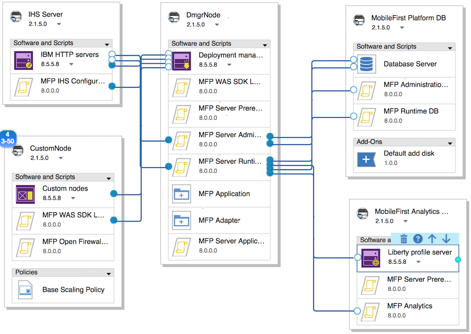

<!-- NLS_CHARSET=UTF-8 -->
## 概述
{: #overview }
{{ site.data.keys.product_full }} 提供了在 IBM PureApplication System 和 IBM PureApplication Service on SoftLayer 上部署和管理 {{ site.data.keys.mf_server }} 与 {{ site.data.keys.product_adj }} 应用程序的功能。

通过将 {{ site.data.keys.product }} 与 IBM PureApplication System 和 IBM PureApplication Service on SoftLayer 结合使用，为开发人员和管理员提供了一个简单而直观的环境，用来开发和测试移动应用程序并将这些移动应用程序部署到云中。该版本的 {{ site.data.keys.mf_system_pattern_full }} 为最新版本的 IBM PureApplication System 和 IBM PureApplication Service on SoftLayer 中包含的 PureApplication“虚拟系统模式”技术提供 {{ site.data.keys.product }} 运行时和工件支持。较早版本的 IBM PureApplication System 支持经典虚拟系统模式。

#### 跳至：
{: #jump-to }
* [安装 {{ site.data.keys.mf_system_pattern }}](#installing-mobilefirst-system-pattern)
* [{{ site.data.keys.mf_system_pattern }} 的令牌许可要求](#token-licensing-requirements-for-mobilefirst-system-pattern)
* [在单节点 WebSphere Application Server Liberty Profile 服务器上部署 {{ site.data.keys.mf_server }}](#deploying-mobilefirst-server-on-a-single-node-websphere-application-server-liberty-profile-server)
* [在多节点 WebSphere Application Server Liberty Profile 服务器上部署 {{ site.data.keys.mf_server }}](#deploying-mobilefirst-server-on-a-multiple-node-websphere-application-server-liberty-profile-server)
* [在单节点 WebSphere Application Server Full Profile 服务器上部署 {{ site.data.keys.mf_server }}](#deploying-mobilefirst-server-on-a-single-node-websphere-application-server-full-profile-server)
* [在多节点 WebSphere Application Server Full Profile 服务器上部署 {{ site.data.keys.mf_server }}](#deploying-mobilefirst-server-on-a-multiple-node-websphere-application-server-full-profile-server)
* [在 WebSphere Application Server Network Deployment 服务器集群上部署 {{ site.data.keys.mf_server }}](#deploying-mobilefirst-server-on-clusters-of-websphere-application-server-network-deployment-servers)
* [在单节点 WebSphere Application Server Liberty Profile 服务器上部署 {{ site.data.keys.mf_app_center }}](#deploying-mobilefirst-application-center-on-a-single-node-websphere-application-server-liberty-profile-server)
* [在单节点 WebSphere Application Server Full Profile 服务器上部署 {{ site.data.keys.mf_app_center }}](#deploying-mobilefirst-application-center-on-a-single-node-websphere-application-server-full-profile-server)
* [通过外部 LDAP 存储库配置 {{ site.data.keys.product_adj }} 管理安全性](#configuring-mobilefirst-administration-security-with-an-external-ldap-repository)
* [使用 {{ site.data.keys.mf_system_pattern }} 配置外部数据库](#configuring-an-external-database-with-a-mobilefirst-system-pattern)
* [部署和配置 {{ site.data.keys.mf_analytics }}](#deploying-and-configuring-mobilefirst-analytics)
* [{{ site.data.keys.mf_system_pattern }} 的预定义模板](#predefined-templates-for-mobilefirst-system-pattern)
* [{{ site.data.keys.mf_server }} 的脚本包](#script-packages-for-mobilefirst-server)
* [升级 {{ site.data.keys.mf_system_pattern }}](#upgrading-mobilefirst-system-pattern)

### 关键优势
{: #key-benefits }
{{ site.data.keys.mf_system_pattern }} 具有以下优势：

* 通过使用预定义的模板，您可以采用简单的方式来为最典型的 {{ site.data.keys.mf_server }} 部署拓扑构建模式。拓扑示例包括：  
    * IBM WebSphere Application Server Liberty Profile 单节点
    * IBM WebSphere Application Server Liberty Profile 多节点
    * IBM WebSphere Application Server Full Profile 单节点
    * IBM WebSphere Application Server Full Profile 多节点
    * WebSphere Application Server Network Deployment 服务器集群
    * {{ site.data.keys.mf_app_center }} 部署拓扑示例如下：
        * IBM WebSphere Application Server Liberty Profile 单节点
        * IBM WebSphere Application Server Full Profile 单节点
* 脚本包充当构建块，构成扩展部署拓扑，例如自动在模式中包含分析服务器和灵活的数据库虚拟机部署选项。可通过包含 WebSphere Application Server 和 DB2 模式类型来获取 WebSphere Application Server 和 DB2 脚本包。
* 通过运行时部署脚本包中的可选 JNDI 属性，可以对部署拓扑进行细颗粒度调整。此外，使用 IBM WebSphere Application Server Full Profile 构建的部署拓扑现在支持访问 WebSphere Application Server 管理控制台，使您能够完全控制应用程序服务器的配置。

### 重要限制
{: #important-restrictions }
根据您所使用的模式模板，请不要更改某些组件属性。如果更改了其中任何组件属性，那么基于这些模板的模式部署将会失败。

#### {{ site.data.keys.product }}（Application Center Liberty 单节点）
{: #mobilefirst-foundation-application-center-liberty-single-node }
请不要更改 Liberty Profile 服务器中以下属性的值：

* WebSphere 产品安装目录
* 配置数据位置
* Liberty Profile 服务器名称
* 在“安装 IBM Java SDK”下，仅选择 Java SDK V7.0 或 Java SDK V7.1
* 选择“安装其他功能部件”，并取消选中 IBM WebSphere eXtreme Scale。

#### {{ site.data.keys.product }}（Application Center WebSphere Application Server 单节点）
{: #mobilefirst-foundation-application-center-websphere-application-server-single-node }
请不要更改 Liberty Profile 服务器中以下属性的值：

* WebSphere 产品安装目录
* 配置数据位置
* 单元名称
* 节点名
* 概要文件名称
* 在“安装 IBM Java SDK”下，仅选择 Java SDK V7.0 或 Java SDK V7.1
* 选择“安装其他功能部件”，并取消选中 IBM WebSphere eXtreme Scale。

#### {{ site.data.keys.product }}（Liberty 单节点）
{: #mobilefirst-foundation-liberty-single-node }
请不要更改 Liberty Profile 服务器中以下属性的值：

* WebSphere 产品安装目录
* 配置数据位置
* Liberty Profile 服务器名称
* 在“安装 IBM Java SDK”下，仅选择 Java SDK V7.0 或 Java SDK V7.1
* 选择“安装其他功能部件”，并取消选中 IBM WebSphere eXtreme Scale。

#### {{ site.data.keys.product }}（Liberty 服务器场）
{: #mobilefirst-foundation-liberty-server-farm }
请不要更改 Liberty Profile 服务器中以下属性的值：

* WebSphere 产品安装目录
* 配置数据位置
* Liberty Profile 服务器名称
* 在“安装 IBM Java SDK”下，仅选择 Java SDK V7.0 或 Java SDK V7.1
* 选择“安装其他功能部件”，并取消选中 IBM WebSphere eXtreme Scale。

#### {{ site.data.keys.product }}（WebSphere Application Server 单节点）模板
{: #mobilefirst-foundation-websphere-application-server-single-node-template }
在 MobileFirst Platform Server 节点的**独立服务器组件**中，请不要解锁或更改以下任何属性的值：

* 单元名称
* 节点名
* 概要文件名称
* 如果更改了其中任何属性，那么模式部署将失败。

#### {{ site.data.keys.product }}（WebSphere Application Server 服务器场）模板
{: #mobilefirst-foundation-websphere-application-server-server-farm-template }
在 MobileFirst Platform Server 节点的**独立服务器组件**中，请不要解锁或更改以下任何属性的值：

* 单元名称
* 节点名
* 概要文件名称
* 如果更改了其中任何属性，那么模式部署将失败。

#### {{ site.data.keys.product }} (WebSphere Application Server Network Deployment) 模板
{: #mobilefirst-foundation-websphere-application-server-network-deployment-template }
在 **DmgrNode 节点**的 **Deployment Manager 组件**中或在 **CustomNode 节点**的**定制节点组件**中，请不要解锁或更改以下任何属性的值：

* 单元名称
* 节点名
* 概要文件名称

如果更改了其中任何属性，那么模式部署将失败。

### 限制
{: #limitations }
存在以下限制：

* 不支持动态缩放 WebSphere Application Server Liberty Profile 服务器场和 WebSphere Application Server Full Profile 服务器场。服务器场节点的数量可以通过在模式中设置缩放策略来指定，但无法在运行时期间进行更改。
* 低于 V7.0 的版本中支持的 {{ site.data.keys.v63_to_80prerebrand_product_full }} System Pattern Extension for {{ site.data.keys.mf_studio }} 和 Ant 命令行界面在当前版本的 {{ site.data.keys.mf_system_pattern }} 中不可用。
* {{ site.data.keys.mf_system_pattern }} 取决于 WebSphere Application Server Patterns，后者存在自己的限制。有关更多信息，请参阅 [WebSphere Application Server Patterns 的限制](http://ibm.biz/knowctr#SSAJ7T_1.0.0/com.ibm.websphere.waspatt20base.doc/ae/rins_patternsB_restrictions.html)。
* 由于“虚拟系统模式”的卸载过程有一些限制，因此您必须在删除模式类型之后手动删除脚本包。在 IBM PureApplication System 中，转至**目录 → 脚本包**以删除**组件**部分中列出的脚本包。
* MobileFirst (WebSphere Application Server Network Deployment) 模式模板不支持令牌许可。如果希望使用此模式，必须使用永久许可。所有其他模式均支持令牌许可。

### 组成
{: #composition }
{{ site.data.keys.mf_system_pattern }} 由以下模式组成：

* IBM WebSphere Application Server Network Deployment Patterns 2.2.0.0。
* [PureApplication Service] WebSphere 8558 for Mobile IM 存储库，支持 WebSphere Application Server Network Deployment Patterns 运行。请联系 IBM PureApplication System 的管理员，以确认已安装 WebSphere 8558 IM 存储库。
* IBM DB2 with BLU Acceleration Pattern 1.2.4.0。
* {{ site.data.keys.mf_system_pattern }}.

### 组件
{: #components }
除了 IBM WebSphere Application Server Pattern 和 IBM DB2 with BLU Acceleration Pattern 提供的所有组件外，{{ site.data.keys.mf_system_pattern }} 还提供以下脚本包：

* MFP 管理数据库
* MFP 运行时数据库
* MFP Server 必备软件
* MFP Server 管理
* MFP Server 运行时部署
* MFP Server 应用程序适配器部署
* MFP IHS 配置
* MFP 分析
* 针对 WAS 的 MFP 开放式防火墙端口
* MFP WAS SDK 级别
* MFP Server Application Center

### 使用不同产品版本创建的模式类型与工件之间的兼容性
{: #compatibility-between-pattern-types-and-artifacts-created-with-different-product-versions }
如果使用 MobileFirst Studio V6.3.0 或更低版本来开发应用程序，那么可以将相关的运行时、应用程序和适配器工件上载到与 {{ site.data.keys.v63_to_80prerebrand_product_full }} V7.0.0 和更高版本相关联的模式中。

与 {{ site.data.keys.v63_to_80prerebrand_product_full }} V6.3.0 或更低版本相关联的模式类型与使用 MobileFirst Studio V7.0.0 和更高版本所创建的运行时、应用程序和适配器工件不兼容。

对于 V6.0.0 和更早版本，只有相同版本的服务器、**.war** 文件、应用程序（**.wlapp** 文件）和适配器兼容。

## 安装 {{ site.data.keys.mf_system_pattern }}
{: #installing-mobilefirst-system-pattern }
您可以查找 **{{ site.data.keys.mf_system_pattern_file }}** 文件。确保在开始此过程之前已抽取该文件。

1. 使用有权创建新模式类型的帐户登录到 IBM PureApplication System。
2. 转至**目录 → 模式类型**。
3. 上载 {{ site.data.keys.mf_system_pattern }} **.tgz** 文件：
    * 在工具栏上，单击 **+**。这样会打开“安装模式类型”窗口。
    * 在“本地”选项卡中，单击**浏览**，选择 {{ site.data.keys.mf_system_pattern }} **.tgz** 文件，然后等待上载过程完成。模式类型显示在列表中并标记为未启用。

4. 在模式类型列表中，单击上载的模式类型。此时会显示该模式类型的详细信息。
5. 在“许可协议”行中，单击**许可证**。这将显示“许可证”窗口，其中声明了许可协议条款。
6. 要接受许可证，请单击**接受**。现在，模式类型的详细信息显示已接受许可证。

7. 在“状态”行中，单击**启用**。现在，该模式类型列示为“已启用”。
8. 为 PureApplication Service 所必需：成功启用模式类型后，请转至**目录 → 脚本包**，然后选择名称类似于“MFP \*\*\*”的脚本包。在详细信息页面右侧，接受**许可协议**字段中的许可证。针对“组件”部分中列出的全部 11 个脚本包重复此过程。

## {{ site.data.keys.mf_system_pattern }} 的令牌许可要求
{: #token-licensing-requirements-for-mobilefirst-system-pattern }
如果使用令牌许可对 {{ site.data.keys.product }} 授予许可，那么必须安装 IBM Rational License Key Server，并使用您的许可证进行配置，然后再部署 {{ site.data.keys.mf_system_pattern_full }}。

> **要点：**{{ site.data.keys.product }} (WAS ND) 模式模板不支持令牌许可。基于 {{ site.data.keys.product }} (WAS ND) 模式模板部署模式时，必须使用永久许可。所有其他模式模板均支持令牌许可。IBM Rational License Key Server 必须位于 PureApplication System 外部。{{ site.data.keys.system_pattern }} 不支持针对 IBM Rational License Key Server 的 PureApplication System 共享服务。

此外，您必须了解有关 Rational License Key Server 的以下信息，才能将许可证密钥服务器信息添加到模式属性中：

* Rational License Key Server 的标准主机名或 IP 地址
* 许可证管理器守护程序 (**lmgrd**) 端口
* 供应商守护程序 (**ibmratl**) 端口

如果在 Rational License Key Server 与 PureApplication System 之间存在防火墙，请确保在防火墙中已打开两个守护程序端口。如果无法连接许可证密钥服务器，或者没有足够的可用许可证令牌，那么部署 {{ site.data.keys.system_pattern }} 将会失败。

有关安装和配置 Rational License Key Server 的详细信息，请参阅 [IBM 支持 - Rational 许可起始页面](http://www.ibm.com/software/rational/support/licensing/)。

## 在单节点 WebSphere Application Server Liberty Profile 服务器上部署 {{ site.data.keys.mf_server }}
{: #deploying-mobilefirst-server-on-a-single-node-websphere-application-server-liberty-profile-server }
使用预定义的模板在单节点 WebSphere Application Server Liberty Profile 服务器上部署 {{ site.data.keys.mf_server }}。

此过程包括将某些工件（例如，所需的应用程序和适配器）上载到 IBM PureApplication System。开始之前，请确保工件可以上载。


**令牌许可要求：**如果使用令牌许可对 {{ site.data.keys.product }} 授予许可，请在继续之前查看 [{{ site.data.keys.mf_system_pattern }} 的令牌许可要求](#token-licensing-requirements-for-mobilefirst-system-pattern)中概括的要求。如果无法连接许可证密钥服务器，或者没有足够的可用许可证令牌，那么部署此模式将会失败。

模板中脚本包的部分参数已配置为建议值，因此在本部分中未提及这些参数。
请参阅 [{{ site.data.keys.mf_server }} 的脚本包](#script-packages-for-mobilefirst-server)中有关脚本包的所有参数的更多信息进行调整。

有关该过程中使用的预定义模板的组合和配置选项的更多信息，请参阅 [{{ site.data.keys.product }}（Liberty 单节点）模板](#mobilefirst-foundation-liberty-single-node-template)。

1. 通过预定义的模板来创建模式：
    * 在 IBM PureApplication System 仪表板中，单击**模式 → 虚拟系统模式**。这样会打开“虚拟系统模式”页面。
    * 在**虚拟系统模式**页面上，单击**新建**，然后在弹出窗口中，从预定义模板列表中选择 **MobileFirst Platform（Liberty 单节点）**。如果名称因其长度而只有部分可见，那么通过查看**更多信息**选项卡中的描述，可确认您已选择正确的模板。
    * 在**名称**字段中，提供该模式的名称。
    * 在**版本**字段中，指定该模式的版本号。
    * 单击**开始构建**。
2. 为 AIX 所必需：在 Power 上运行的 IBM PureApplication System 中，“MobileFirst Platform 数据库”节点需要使用特定于 AIX 的附加组件“缺省 AIX 添加磁盘”来替换模板中的“缺省添加磁盘”组件以支持 jfs2 文件系统：
    * 在“模式构建器”中，选择 **MobileFirst Platform 数据库**节点。
    * 单击**添加组件附加组件**按钮（将鼠标指针悬停在 **MobileFirst Platform 数据库**节点上时，即可在组件框上方看到该按钮）。
    * 从**添加附加组件**列表中，选择**缺省 AIX 添加磁盘**。该组件将添加成为“MobileFirst Platform 数据库”节点的最底部组件。
    * 选择**缺省 AIX 添加磁盘**组件并指定以下属性：

        * **DISK_SIZE_GB：**要扩展到数据库服务器的存储器大小（以 GB 计）。示例值：**10**。
        * **FILESYSTEM_TYPE：**AIX 中支持的文件系统。缺省值：**jfs2**。
        * **MOUNT_POINT：**与“MobileFirst Platform 数据库”节点中“数据库服务器”组件中的**实例所有者的安装点**属性保持一致。示例值：**/dbinst**。
        * **VOLUME_GROUP：**示例值：**group1**。请联系您的 IBM PureApplication System 管理员，以获取正确的值。
    * 在“MobileFirst Platform 数据库”节点中，选择**缺省添加磁盘**组件，然后单击垃圾箱图标以将其删除。
    * 保存该模式。
3. 可选：配置 {{ site.data.keys.mf_server }} 管理。如果您希望稍后在步骤 9中的模式部署配置阶段指定具有 {{ site.data.keys.mf_server }} 管理特权的用户凭证，那么可以跳过此步骤。要现在指定该用户凭证，请完成以下步骤：


    > **注：**如果想要使用 LDAP 服务器配置管理安全性，那么需要提供其他 LDAP 信息。有关更多信息，请参阅[通过外部 LDAP 存储库配置 {{ site.data.keys.product_adj }} 管理安全性](#configuring-mobilefirst-administration-security-with-an-external-ldap-repository)。
    * 在 MobileFirst Platform Server 节点中，单击 **MFP Server 管理**组件。选定组件的属性将显示在画布旁边。
    * 在 **admin_user** 和 **admin_password** 字段旁，单击“删除”按钮以清除其模式级别参数设置。
    * 在 **admin_user** 和 **admin\_password** 字段中，指定管理用户名和密码。
    * 如果使用令牌许可对 {{ site.data.keys.product }} 授予许可，请填写以下字段。如果不使用令牌许可，请将这些字段留空。

    **ACTIVATE\_TOKEN\_LICENSE**：选择该字段可通过令牌许可来对该模式授予许可。  
    **LICENSE\_SERVER\_HOSTNAME**：输入 Rational License Key Server 的标准主机名或 IP 地址。  
    **LMGRD\_PORT**：输入许可证管理器守护程序 (**lmrgd**) 用于侦听连接的端口号。缺省许可证管理器守护程序端口为 27000。
  
    **IBMRATL\_PORT**：输入供应商守护程序 (**ibmratl**) 用于侦听连接的端口号。缺省供应商守护程序端口通常为 27001。  

    这样会在模式部署期间创建 {{ site.data.keys.mf_server }} 的缺省管理帐户。

4. 可选：配置 {{ site.data.keys.mf_server }} 运行时部署。如果您希望稍后在步骤 9中的模式部署配置阶段指定运行时的上下文根名称，那么可以跳过此步骤。要现在指定上下文根名称，请完成以下步骤：
    * 在 MobileFirst Platform Server 节点中，单击 **MFP Server 运行时部署**组件。选定组件的属性将显示在画布旁边。
    * 在 **runtime\_contextRoot** 字段旁，单击**删除**按钮以清除其模式级别参数设置。
    * 在 **runtime\_contextRoot** 字段中，指定运行时上下文根名称。请注意，上下文根名称必须以正斜杠 (/) 开头，例如，`/HelloWorld`。

5. 上载应用程序和适配器工件：

    > **要点：**指定应用程序和适配器的目标路径时，请确保所有应用程序和适配器都放在同一个目录中。例如，如果一个目标路径为 **/opt/tmp/deploy/HelloWorld-common.json**，那么所有其他目标路径都应当为 `/opt/tmp/deploy/*`。    * 在 MobileFirst Platform Server 节点中，单击 **MFP Server 应用程序**或 **MFP Server 适配器**组件。选定组件的属性将显示在画布旁边。
    * 在**其他文件**字段中，单击**浏览**按钮以找到并上载应用程序或适配器工件。
    * 在**目标路径**字段中，指定用于存储工件的完整路径（包括文件名）；例如，**/opt/tmp/deploy/HelloWorld-common.json**。
    * 如果不需要将任何应用程序或适配器部署到模式中，请单击其中的 **X** 按钮以移除相关组件。
要部署空的 {{ site.data.keys.mf_console }} 而不安装任何应用程序或适配器，请单击其中的 X 按钮以移除“MFP Server 应用程序适配器部署”组件。

6. 可选：添加更多应用程序或适配器工件以进行部署：
    * 从**资产**工具栏中，展开**软件组件**，然后将**其他文件**组件拖放到画布中的 MobileFirst Platform Server 节点上。将其重命名为 **{{ site.data.keys.product_adj }} App\_X** 或 **{{ site.data.keys.product_adj }} Adatper\_X**（其中，**X** 表示用于区分的唯一编号）。
    * 将鼠标指针悬停在新添加的应用程序或适配器组件上，然后单击**上移**和**下移**按钮来调整其在节点中的顺序。
确保将其置于“MFP 运行时部署”组件之后，但在“MFP Server 应用程序适配器部署”组件之前。

    * 单击新添加的应用程序或适配器组件。
选定组件的属性将显示在画布旁边。请参考步骤 6 中的分步来上载应用程序或适配器工件并指定其目标路径。
    * 重复步骤 7 来添加更多应用程序和适配器以进行部署。

7. 可选：配置 {{ site.data.keys.mf_server }} 的应用程序和适配器部署。如果您希望稍后在步骤 9中的模式部署配置阶段指定具有部署特权的用户凭证，那么可以跳过此步骤。如果您在步骤 3 中已指定缺省管理用户凭证，那么现在可以指定部署者用户（必须与管理用户凭证一致）：
    * 在 MobileFirst Platform Server 节点中，选择 **MFP Server 应用程序适配器部署**组件。选定组件的属性将显示在画布旁边。
    * 查找名为 **deployer_user** 和 **deployer_password** 的参数，然后单击其旁边的“删除”按钮以清除模式级别参数设置。
    * 在 **deployer\_user** 和 **deployer\_password** 字段中，指定用户名和密码。

8. 配置和启动模式部署：
    * 在 IBM PureApplication System 仪表板中，单击**模式 → 虚拟系统模式**。
    * 在“**虚拟系统模式**”页面中，使用**搜索**字段查找您创建的模式，然后选择该模式。
    * 在显示该模式详细信息的面板上方的工具栏中，单击“部署”按钮。
    * 在“部署模式”窗口中的“配置”面板中，从**环境概要文件**列表中选择适当的环境概要文件，并提供其他 IBM PureApplication System 环境参数。请咨询您的 IBM PureApplication System 管理员获取正确信息。
    * 在中间列中，单击**模式属性**，以显示诸如用户名和密码之类的属性。


        在所提供的字段中提供以下信息：

        > **注：**对模式级别参数的缺省值进行相应的更改，即使已配置外部 LDAP 服务器也是如此。如果使用 LDAP 服务器配置管理安全性，那么需要提供其他 LDAP 信息。有关更多信息，请参阅[通过外部 LDAP 存储库配置 {{ site.data.keys.product_adj }} 管理安全性](#configuring-mobilefirst-administration-security-with-an-external-ldap-repository)。
        
        **admin\_user**  
        如果在步骤 3 中进行了配置，那么将不显示该选项。请创建缺省 {{ site.data.keys.mf_server }} 管理员帐户。缺省值：demo。
        
        **admin\_password**  
        如果在步骤 3 中进行了配置，那么将不显示该选项。这是缺省管理员帐户密码。缺省值：demo。
        
        **ACTIVATE\_TOKEN\_LICENSE**  
        如果在步骤 3 中进行了配置，那么将不显示该选项。选择该字段可通过令牌许可对模式授予许可。如果使用永久许可证，请将该字段留空。
        
        **LICENSE\_SERVER\_HOSTNAME**  
        如果在步骤 3 中进行了配置，那么将不显示该选项。如果使用令牌许可对 {{ site.data.keys.product }} 授予许可，请输入 Rational License Key Server 的标准主机名或 IP 地址。否则，将该字段留空。
        
        **LMGRD\_PORT**   
        如果在步骤 3 中进行了配置，那么将不显示该选项。如果使用令牌许可对 {{ site.data.keys.product }} 授予许可，请输入许可证管理器守护程序 (lmrgd) 用于侦听连接的端口号。否则，将该字段留空。缺省许可证管理器守护程序端口为 27000。


        **IBMRATL\_PORT**  
        如果在步骤 3 中进行了配置，那么将不显示该选项。如果使用令牌许可对 {{ site.data.keys.product }} 授予许可，请输入供应商守护程序 (ibmratl) 用于侦听连接的端口号。否则，将该字段留空。缺省供应商守护程序端口通常为 27001。

        **runtime\_contextRoot**  
        如果在步骤 5 中进行了配置，那么将不显示该选项。这是 {{ site.data.keys.mf_server }} 运行时的上下文根名称。此名称必须以“/”开头。
        
        **deployer\_user**  
        如果在步骤 8 中进行了配置，那么将不显示该选项。这是具有部署特权的帐户的用户名。如果未配置外部 LDAP 服务器，您必须输入创建管理服务的缺省管理用户时所指定的相同值，因为在此情况下，应用程序和适配器部署的唯一授权用户是缺省管理用户。
        
        **deployer\_password**  
        如果在步骤 8 中进行了配置，那么将不显示该选项。这是具有部署特权的用户的用户密码。
        
        **MFP Vms 密码（root 用户）**  
        {{ site.data.keys.mf_server }} 和 {{ site.data.keys.product }} 数据库节点的 root 用户密码。缺省值：passw0rd。
        
        **MFP 数据库密码（实例所有者）**  
        “MobileFirst Platform 数据库”节点的实例所有者密码。缺省值：**passw0rd**。    
    * 单击**快速部署**以启动模式部署。几秒钟之后，将显示一条消息，指示该模式已开始启动。您可以单击消息中提供的 URL 以跟踪模式部署状态，或者转至**模式 → 虚拟系统实例**以打开“虚拟系统实例”页面并在其中搜索模式。

    在使用令牌许可对 {{ site.data.keys.product }} 授予许可时，如果没有足够的可用许可证令牌，或者输入的许可证密钥服务器 IP 地址和端口不正确，那么模式将无法部署。

9. 访问 {{ site.data.keys.mf_console }}：
    * 单击**模式 → 虚拟系统实例**以打开“虚拟系统实例”页面并在其中搜索模式。确保其处于“正在运行”状态。
    * 在显示所选实例详细信息的面板中，选择模式名称并展开**虚拟机透视图**选项。
    * 查找名称类似于 **MobileFirst\_Platform\_Server** 的 {{ site.data.keys.mf_server }} VM，并记录其公共 IP 地址：将在后面步骤中需要此信息。
    * 在浏览器中，通过编写以下某种格式的 URL 来打开 {{ site.data.keys.mf_console }}：
        * `http://{MFP Server VM Public IP}:9080/mfpconsole`
        * `https://{MFP Server VM Public IP}:9443/mfpconsole`
    * 使用步骤 3 或步骤 9 中指定的管理用户和密码登录到控制台。

## 在多节点 WebSphere Application Server Liberty Profile 服务器上部署 {{ site.data.keys.mf_server }}
{: #deploying-mobilefirst-server-on-a-multiple-node-websphere-application-server-liberty-profile-server }
使用预定义的模板在多节点 WebSphere Application Server Liberty Profile 服务器上部署 {{ site.data.keys.mf_server }}。

此过程包括将某些工件（例如，所需的应用程序和适配器）上载到 IBM PureApplication System。开始之前，请确保工件可以上载。


**令牌许可要求：**如果使用令牌许可对 {{ site.data.keys.product }} 授予许可，请在继续之前查看 [{{ site.data.keys.mf_system_pattern }} 的令牌许可要求](#token-licensing-requirements-for-mobilefirst-system-pattern)中概括的要求。如果无法连接许可证密钥服务器，或者没有足够的可用许可证令牌，那么部署此模式将会失败。

模板中脚本包的部分参数已配置为建议值，因此在本部分中未提及这些参数。
请参阅 [{{ site.data.keys.mf_server }} 的脚本包](#script-packages-for-mobilefirst-server)中有关脚本包的所有参数的更多信息进行调整。

有关该过程中使用的预定义模板的组合和配置选项的更多信息，请参阅 [{{ site.data.keys.product }}（Liberty 服务器场）模板](#mobilefirst-foundation-liberty-server-farm-template)。

1. 通过预定义的模板来创建模式：
    * 在 IBM PureApplication System 仪表板中，单击**模式 → 虚拟系统模式**。这样会打开“**虚拟系统模式**”页面。
    * 在**虚拟系统模式**页面上，单击**新建**，然后在弹出窗口中，从预定义模板列表中选择 **MobileFirst Platform（Liberty 服务器场）**。如果名称因其长度而只有部分可见，那么通过查看**更多信息**选项卡中的描述，可确认您已选择正确的模板。
    * 在**名称**字段中，提供该模式的名称。
    * 在**版本**字段中，指定该模式的版本号。
    * 单击**开始构建**。
2. 为 AIX 所必需：在 Power 上运行的 IBM PureApplication System 中，“MobileFirst Platform 数据库”节点需要使用特定于 AIX 的附加组件“缺省 AIX 添加磁盘”来替换模板中的“缺省添加磁盘”组件以支持 **jfs2** 文件系统：
    * 在“模式构建器”中，选择 **MobileFirst Platform 数据库**节点。
    * 单击**添加组件附加组件**按钮（将鼠标指针悬停在 **MobileFirst Platform 数据库**节点上时，即可在组件框上方看到该按钮）。
    * 从**添加附加组件**列表中，选择**缺省 AIX 添加磁盘**。该组件将添加成为“MobileFirst Platform 数据库”节点的最底部组件。
    * 选择**缺省 AIX 添加磁盘**组件并指定以下属性：

        * **DISK_SIZE_GB：**要扩展到数据库服务器的存储器大小（以 GB 计）。示例值：**10**。
        * **FILESYSTEM_TYPE：**AIX 中支持的文件系统。缺省值：**jfs2**。
        * **MOUNT_POINT：**与“MobileFirst Platform 数据库”节点中“数据库服务器”组件中的**实例所有者的安装点**属性保持一致。示例值：**/dbinst**。
        * **VOLUME_GROUP：**示例值：**group1**。请联系您的 IBM PureApplication System 管理员，以获取正确的值。
    * 在“MobileFirst Platform 数据库”节点中，选择**缺省添加磁盘**组件，然后单击垃圾箱图标以将其删除。
    * 保存该模式。
3. 可选：配置 {{ site.data.keys.mf_server }} 管理。如果您希望稍后在步骤 9中的模式部署配置阶段指定具有 {{ site.data.keys.mf_server }} 管理特权的用户凭证，那么可以跳过此步骤。要现在指定该用户凭证，请完成以下步骤：


    > **注：**如果想要使用 LDAP 服务器配置管理安全性，那么需要提供其他 LDAP 信息。有关更多信息，请参阅[通过外部 LDAP 存储库配置 {{ site.data.keys.product_adj }} 管理安全性](#configuring-mobilefirst-administration-security-with-an-external-ldap-repository)。
    * 在 MobileFirst Platform Server 节点中，单击 **MFP Server 管理**组件。选定组件的属性将显示在画布旁边。
    * 在 **admin_user** 和 **admin_password** 字段旁，单击“删除”按钮以清除其模式级别参数设置。
    * 在 **admin_user** 和 **admin\_password** 字段中，指定管理用户名和密码。
    * 如果使用令牌许可对 {{ site.data.keys.product }} 授予许可，请填写以下字段。如果不使用令牌许可，请将这些字段留空。

    **ACTIVATE\_TOKEN\_LICENSE**：选择该字段可通过令牌许可来对该模式授予许可。  
    **LICENSE\_SERVER\_HOSTNAME**：输入 Rational License Key Server 的标准主机名或 IP 地址。  
    **LMGRD\_PORT**：输入许可证管理器守护程序 (**lmrgd**) 用于侦听连接的端口号。缺省许可证管理器守护程序端口为 27000。
  
    **IBMRATL\_PORT**：输入供应商守护程序 (**ibmratl**) 用于侦听连接的端口号。缺省供应商守护程序端口通常为 27001。  

    这样会在模式部署期间创建 {{ site.data.keys.mf_server }} 的缺省管理帐户。
    
4. 可选：配置 {{ site.data.keys.mf_server }} 运行时部署。如果您希望后续在步骤 10 中的模式部署配置阶段为运行时指定上下文根名称，那么可以跳过此步骤。要现在指定上下文根名称，请完成以下步骤：
    * 在 MobileFirst Platform Server 节点中，单击 **MFP Server 运行时部署**组件。选定组件的属性将显示在画布旁边。
    * 在 **runtime\_contextRoot** 字段旁，单击**删除**按钮以清除其模式级别参数设置。
    * 在 **runtime\_contextRoot** 字段中，指定运行时上下文根名称。请注意，上下文根名称必须以正斜杠 (/) 开头，例如，`/HelloWorld`。

5. 上载应用程序和适配器工件：

    > **要点：**指定应用程序和适配器的目标路径时，请确保所有应用程序和适配器都放在同一个目录中。例如，如果一个目标路径为 **/opt/tmp/deploy/HelloWorld-common.json**，那么所有其他目标路径都应当为 `/opt/tmp/deploy/*`。    * 在 MobileFirst Platform Server 节点中，单击 **MFP Server 应用程序**或 **MFP Server 适配器**组件。选定组件的属性将显示在画布旁边。
    * 在**其他文件**字段中，单击**浏览**按钮以找到并上载应用程序或适配器工件。
    * 在**目标路径**字段中，指定用于存储工件的完整路径（包括文件名）；例如，**/opt/tmp/deploy/HelloWorld-common.json**。
    * 如果不需要将任何应用程序或适配器部署到模式中，请单击其中的 **X** 按钮以移除相关组件。
要部署空的 {{ site.data.keys.mf_console }} 而不安装任何应用程序或适配器，请单击其中的 X 按钮以移除“MFP Server 应用程序适配器部署”组件。 

6. 可选：添加更多应用程序或适配器工件以进行部署：
    * 从**资产**工具栏中，展开**软件组件**，然后将**其他文件**组件拖放到画布中的 MobileFirst Platform Server 节点上。将其重命名为 **{{ site.data.keys.product_adj }} App\_X** 或 **{{ site.data.keys.product_adj }} Adatper\_X**（其中，**X** 表示用于区分的唯一编号）。
    * 将鼠标指针悬停在新添加的应用程序或适配器组件上，然后单击**上移**和**下移**按钮来调整其在节点中的顺序。确保将其置于“MFP 运行时部署”组件之后，但在“MFP Server 应用程序适配器部署”组件之前。

    * 单击新添加的应用程序或适配器组件。选定组件的属性将显示在画布旁边。请参考步骤 6 中的分步来上载应用程序或适配器工件并指定其目标路径。
    * 重复步骤 7 来添加更多应用程序和适配器以进行部署。

7. 可选：配置 {{ site.data.keys.mf_server }} 的应用程序和适配器部署。如果您希望稍后在步骤 9中的模式部署配置阶段指定具有部署特权的用户凭证，那么可以跳过此步骤。如果您在步骤 3 中已指定缺省管理用户凭证，那么现在可以指定部署者用户（必须与管理用户凭证一致）：
    * 在 MobileFirst Platform Server 节点中，选择 **MFP Server 应用程序适配器部署**组件。选定组件的属性将显示在画布旁边。
    * 查找名为 **deployer_user** 和 **deployer_password** 的参数，然后单击其旁边的“删除”按钮以清除模式级别参数设置。
    * 在 **deployer\_user** 和 **deployer\_password** 字段中，指定用户名和密码。

8. 配置基本缩放策略：

    * 在 MobileFirst Platform Server 节点中，选择**基本缩放策略**组件。选定组件的属性将显示在画布旁边。
    * 在**实例数**字段中，指定要在模式部署期间实例化的服务器节点的数目。在预定义模板中，缺省值为 2。
由于此发行版中不支持动态缩放，因此请不要在其余属性字段中指定值。

9. 配置和启动模式部署：
    * 在 IBM PureApplication System 仪表板中，单击**模式 → 虚拟系统模式**。
    * 在“**虚拟系统模式**”页面中，使用**搜索**字段查找您创建的模式，然后选择该模式。
    * 在显示该模式详细信息的面板上方的工具栏中，单击“部署”按钮。
    * 在“部署模式”窗口中的“配置”面板中，从**环境概要文件**列表中选择适当的环境概要文件，并提供其他 IBM PureApplication System 环境参数。请咨询您的 IBM PureApplication System 管理员获取正确信息。
    * 在中间列中，单击**模式属性**，以显示诸如用户名和密码之类的属性。


        在所提供的字段中提供以下信息：

        > **注：**对模式级别参数的缺省值进行相应的更改，即使已配置外部 LDAP 服务器也是如此。如果使用 LDAP 服务器配置管理安全性，那么需要提供其他 LDAP 信息。有关更多信息，请参阅[通过外部 LDAP 存储库配置 {{ site.data.keys.product_adj }} 管理安全性](#configuring-mobilefirst-administration-security-with-an-external-ldap-repository)。
        
        **admin\_user**  
        如果在步骤 3 中进行了配置，那么将不显示该选项。请创建缺省 {{ site.data.keys.mf_server }} 管理员帐户。缺省值：demo。
        
        **admin\_password**  
        如果在步骤 3 中进行了配置，那么将不显示该选项。这是缺省管理员帐户密码。缺省值：demo。
        
        **ACTIVATE\_TOKEN\_LICENSE**  
        如果在步骤 3 中进行了配置，那么将不显示该选项。选择该字段可通过令牌许可对模式授予许可。如果使用永久许可证，请将该字段留空。
        
        **LICENSE\_SERVER\_HOSTNAME**  
        如果在步骤 3 中进行了配置，那么将不显示该选项。如果使用令牌许可对 {{ site.data.keys.product }} 授予许可，请输入 Rational License Key Server 的标准主机名或 IP 地址。否则，将该字段留空。
        
        **LMGRD\_PORT**   
        如果在步骤 3 中进行了配置，那么将不显示该选项。如果使用令牌许可对 {{ site.data.keys.product }} 授予许可，请输入许可证管理器守护程序 (lmrgd) 用于侦听连接的端口号。否则，将该字段留空。缺省许可证管理器守护程序端口为 27000。


        **IBMRATL\_PORT**  
        如果在步骤 3 中进行了配置，那么将不显示该选项。如果使用令牌许可对 {{ site.data.keys.product }} 授予许可，请输入供应商守护程序 (ibmratl) 用于侦听连接的端口号。否则，将该字段留空。缺省供应商守护程序端口通常为 27001。

        **runtime\_contextRoot**  
        如果在步骤 5 中进行了配置，那么将不显示该选项。这是 {{ site.data.keys.mf_server }} 运行时的上下文根名称。此名称必须以“/”开头。
        
        **deployer\_user**  
        如果在步骤 8 中进行了配置，那么将不显示该选项。这是具有部署特权的帐户的用户名。如果未配置外部 LDAP 服务器，您必须输入创建管理服务的缺省管理用户时所指定的相同值，因为在此情况下，应用程序和适配器部署的唯一授权用户是缺省管理用户。
        
        **deployer\_password**  
        如果在步骤 8 中进行了配置，那么将不显示该选项。这是具有部署特权的用户的用户密码。
        
        **MFP Vms 密码（root 用户）**  
        {{ site.data.keys.mf_server }} 和 {{ site.data.keys.product }} 数据库节点的 root 用户密码。缺省值：passw0rd。
        
        **MFP 数据库密码（实例所有者）**  
        “MobileFirst Platform 数据库”节点的实例所有者密码。缺省值：**passw0rd**。    
    * 单击**快速部署**以启动模式部署。几秒钟之后，将显示一条消息，指示该模式已开始启动。您可以单击消息中提供的 URL 以跟踪模式部署状态，或者转至**模式 → 虚拟系统实例**以打开“虚拟系统实例”页面并在其中搜索模式。

    在使用令牌许可对 {{ site.data.keys.product }} 授予许可时，如果没有足够的可用许可证令牌，或者输入的许可证密钥服务器 IP 地址和端口不正确，那么模式将无法部署。
    
10. 访问 {{ site.data.keys.mf_console }}：
    * 单击**模式 → 虚拟系统实例**以打开“虚拟系统实例”页面并在其中搜索模式。确保其处于“正在运行”状态。
    * 在显示所选实例详细信息的面板中，选择模式名称并展开**虚拟机透视图**选项。
    * 查找名称类似于 **IHS\_Server.*** 的 IHS 服务器 VM，并记录其公共 IP 地址：将在后面步骤中需要此信息。
    * 在浏览器中，通过编写以下某种格式的 URL 来打开 {{ site.data.keys.mf_console }}：
        * `http://{IHS Server VM Public IP}/mfpconsole`
        * `https://{IHS Server VM Public IP}/mfpconsole`
    * 使用在步骤 3 或步骤 10 中指定的管理用户标识和密码登录到控制台。

## 在单节点 WebSphere Application Server Full Profile 服务器上部署 {{ site.data.keys.mf_server }}
{: #deploying-mobilefirst-server-on-a-single-node-websphere-application-server-full-profile-server }
使用预定义的模板将单节点 {{ site.data.keys.mf_server }} 部署到 WebSphere Application Server Full Profile 服务器。

此过程包括将某些工件（例如，所需的应用程序和适配器）上载到 IBM PureApplication System。开始之前，请确保工件可以上载。


**令牌许可要求：**如果使用令牌许可对 {{ site.data.keys.product }} 授予许可，请在继续之前查看 [{{ site.data.keys.mf_system_pattern }} 的令牌许可要求](#token-licensing-requirements-for-mobilefirst-system-pattern)中概括的要求。如果无法连接许可证密钥服务器，或者没有足够的可用许可证令牌，那么部署此模式将会失败。

模板中脚本包的部分参数已配置为建议值，因此在本部分中未提及这些参数。
请参阅 [{{ site.data.keys.mf_server }} 的脚本包](#script-packages-for-mobilefirst-server)中有关脚本包的所有参数的更多信息进行调整。

有关该过程中使用的预定义模板的组合和配置选项的更多信息，请参阅 [{{ site.data.keys.product }}（WAS 单节点）模板](#mobilefirst-foundation-was-single-node-template)。

1. 通过预定义的模板来创建模式：
    * 在 IBM PureApplication System 仪表板中，单击**模式 → 虚拟系统模式**。这样会打开“**虚拟系统模式**”页面。
    * 在**虚拟系统模式**页面上，单击**新建**，然后在弹出窗口中，从预定义模板列表中选择 **MobileFirst Platform（WAS 单节点）**。如果名称因其长度而只有部分可见，那么通过查看**更多信息**选项卡中的描述，可确认您已选择正确的模板。
    * 在**名称**字段中，提供该模式的名称。
    * 在**版本**字段中，指定该模式的版本号。
    * 单击**开始构建**。
2. 为 AIX 所必需：在 Power 上运行的 IBM PureApplication System 中，“MobileFirst Platform 数据库”节点需要使用特定于 AIX 的附加组件“缺省 AIX 添加磁盘”来替换模板中的“缺省添加磁盘”组件以支持 **jfs2** 文件系统：
    * 在“模式构建器”中，选择 **MobileFirst Platform 数据库**节点。
    * 单击**添加组件附加组件**按钮（将鼠标指针悬停在 **MobileFirst Platform 数据库**节点上时，即可在组件框上方看到该按钮）。
    * 从**添加附加组件**列表中，选择**缺省 AIX 添加磁盘**。该组件将添加成为“MobileFirst Platform 数据库”节点的最底部组件。
    * 选择**缺省 AIX 添加磁盘**组件并指定以下属性：

        * **DISK_SIZE_GB：**要扩展到数据库服务器的存储器大小（以 GB 计）。示例值：**10**。
        * **FILESYSTEM_TYPE：**AIX 中支持的文件系统。缺省值：**jfs2**。
        * **MOUNT_POINT：**与“MobileFirst Platform 数据库”节点中“数据库服务器”组件中的**实例所有者的安装点**属性保持一致。示例值：**/dbinst**。
        * **VOLUME_GROUP：**示例值：**group1**。请联系您的 IBM PureApplication System 管理员，以获取正确的值。
    * 在“MobileFirst Platform 数据库”节点中，选择**缺省添加磁盘**组件，然后单击垃圾箱图标以将其删除。
    * 保存该模式。
3. 可选：配置 {{ site.data.keys.mf_server }} 管理。如果您希望稍后在步骤 9中的模式部署配置阶段指定具有 {{ site.data.keys.mf_server }} 管理特权的用户凭证，那么可以跳过此步骤。要现在指定该用户凭证，请完成以下步骤：


    > **注：**如果想要使用 LDAP 服务器配置管理安全性，那么需要提供其他 LDAP 信息。有关更多信息，请参阅[通过外部 LDAP 存储库配置 {{ site.data.keys.product_adj }} 管理安全性](#configuring-mobilefirst-administration-security-with-an-external-ldap-repository)。
    * 在 MobileFirst Platform Server 节点中，单击 **MFP Server 管理**组件。选定组件的属性将显示在画布旁边。
    * 在 **admin_user** 和 **admin_password** 字段旁，单击“删除”按钮以清除其模式级别参数设置。
    * 在 **admin_user** 和 **admin\_password** 字段中，指定管理用户名和密码。
    * 如果使用令牌许可对 {{ site.data.keys.product }} 授予许可，请填写以下字段。如果不使用令牌许可，请将这些字段留空。

    **ACTIVATE\_TOKEN\_LICENSE**：选择该字段可通过令牌许可来对该模式授予许可。  
    **LICENSE\_SERVER\_HOSTNAME**：输入 Rational License Key Server 的标准主机名或 IP 地址。  
    **LMGRD\_PORT**：输入许可证管理器守护程序 (**lmrgd**) 用于侦听连接的端口号。缺省许可证管理器守护程序端口为 27000。
  
    **IBMRATL\_PORT**：输入供应商守护程序 (**ibmratl**) 用于侦听连接的端口号。缺省供应商守护程序端口通常为 27001。  

    这样会在模式部署期间创建 {{ site.data.keys.mf_server }} 的缺省管理帐户。

4. 可选：配置 {{ site.data.keys.mf_server }} 运行时部署。如果您希望稍后在步骤 9中的模式部署配置阶段指定运行时的上下文根名称，那么可以跳过此步骤。要现在指定上下文根名称，请完成以下步骤：
    * 在 MobileFirst Platform Server 节点中，单击 **MFP Server 运行时部署**组件。选定组件的属性将显示在画布旁边。
    * 在 **runtime\_contextRoot** 字段旁，单击**删除**按钮以清除其模式级别参数设置。
    * 在 **runtime\_contextRoot** 字段中，指定运行时上下文根名称。请注意，上下文根名称必须以正斜杠 (/) 开头，例如，`/HelloWorld`。

5. 上载应用程序和适配器工件：

    > **要点：**指定应用程序和适配器的目标路径时，请确保所有应用程序和适配器都放在同一个目录中。例如，如果一个目标路径为 **/opt/tmp/deploy/HelloWorld-common.json**，那么所有其他目标路径都应当为 `/opt/tmp/deploy/*`。    * 在 MobileFirst Platform Server 节点中，单击 **MFP Server 应用程序**或 **MFP Server 适配器**组件。选定组件的属性将显示在画布旁边。
    * 在**其他文件**字段中，单击**浏览**按钮以找到并上载应用程序或适配器工件。
    * 在**目标路径**字段中，指定用于存储工件的完整路径（包括文件名）；例如，**/opt/tmp/deploy/HelloWorld-common.json**。
    * 如果不需要将任何应用程序或适配器部署到模式中，请单击其中的 **X** 按钮以移除相关组件。
要部署空的 {{ site.data.keys.mf_console }} 而不安装任何应用程序或适配器，请单击其中的 X 按钮以移除“MFP Server 应用程序适配器部署”组件。 

6. 可选：添加更多应用程序或适配器工件以进行部署：
    * 从**资产**工具栏中，展开**软件组件**，然后将**其他文件**组件拖放到画布中的 MobileFirst Platform Server 节点上。将其重命名为 **{{ site.data.keys.product_adj }} App\_X** 或 **{{ site.data.keys.product_adj }} Adatper\_X**（其中，**X** 表示用于区分的唯一编号）。
    * 将鼠标指针悬停在新添加的应用程序或适配器组件上，然后单击**上移**和**下移**按钮来调整其在节点中的顺序。
确保将其置于“MFP 运行时部署”组件之后，但在“MFP Server 应用程序适配器部署”组件之前。

    * 单击新添加的应用程序或适配器组件。
选定组件的属性将显示在画布旁边。请参考步骤 6 中的分步来上载应用程序或适配器工件并指定其目标路径。
    * 重复步骤 7 来添加更多应用程序和适配器以进行部署。

7. 可选：配置 {{ site.data.keys.mf_server }} 的应用程序和适配器部署。如果您希望稍后在步骤 9中的模式部署配置阶段指定具有部署特权的用户凭证，那么可以跳过此步骤。如果您在步骤 3 中已指定缺省管理用户凭证，那么现在可以指定部署者用户（必须与管理用户凭证一致）：
    * 在 MobileFirst Platform Server 节点中，选择 **MFP Server 应用程序适配器部署**组件。选定组件的属性将显示在画布旁边。
    * 查找名为 **deployer_user** 和 **deployer_password** 的参数，然后单击其旁边的“删除”按钮以清除模式级别参数设置。
    * 在 **deployer\_user** 和 **deployer\_password** 字段中，指定用户名和密码。

8. 配置基本缩放策略：

    * 在 IBM PureApplication System 仪表板中，单击**模式 → 虚拟系统模式**。
    * 在**虚拟系统模式**页面上，使用“搜索”字段查找您创建的模式，然后选择该模式。
    * 在显示该模式详细信息的面板上方的工具栏中，单击**部署**按钮。
    * 通过咨询您的 IBM PureApplication System 管理员，在**部署模式**窗口中的**配置**面板中，选择正确的**环境概要文件**和其他 IBM PureApplication System 环境参数。
    * 在中间列中，单击**模式属性**以设置诸如用户名和密码之类的属性。


        在所提供的字段中提供以下信息：
        
        > **注：**对模式级别参数的缺省值进行相应的更改，即使已配置外部 LDAP 服务器也是如此。如果使用 LDAP 服务器配置管理安全性，那么需要提供其他 LDAP 信息。有关更多信息，请参阅[通过外部 LDAP 存储库配置 {{ site.data.keys.product_adj }} 管理安全性](#configuring-mobilefirst-administration-security-with-an-external-ldap-repository)。
        **WebSphere 管理用户名**  
        WebSphere 管理控制台登录的管理用户标识。缺省值：virtuser。

        **WebSphere 管理密码**  
        WebSphere 管理控制台登录的管理用户密码。缺省值：passw0rd。
        
        **admin\_user**  
        如果在步骤 3 中进行了配置，那么将不显示该选项。请创建缺省 {{ site.data.keys.mf_server }} 管理员帐户。缺省值：demo。
        
        **admin\_password**  
        如果在步骤 3 中进行了配置，那么将不显示该选项。这是缺省管理员帐户密码。缺省值：demo。
        
        **ACTIVATE\_TOKEN\_LICENSE**  
        如果在步骤 3 中进行了配置，那么将不显示该选项。选择该字段可通过令牌许可对模式授予许可。如果使用永久许可证，请将该字段留空。
        
        **LICENSE\_SERVER\_HOSTNAME**  
        如果在步骤 3 中进行了配置，那么将不显示该选项。如果使用令牌许可对 {{ site.data.keys.product }} 授予许可，请输入 Rational License Key Server 的标准主机名或 IP 地址。否则，将该字段留空。
        
        **LMGRD\_PORT**   
        如果在步骤 3 中进行了配置，那么将不显示该选项。如果使用令牌许可对 {{ site.data.keys.product }} 授予许可，请输入许可证管理器守护程序 (lmrgd) 用于侦听连接的端口号。否则，将该字段留空。缺省许可证管理器守护程序端口为 27000。


        **IBMRATL\_PORT**  
        如果在步骤 3 中进行了配置，那么将不显示该选项。如果使用令牌许可对 {{ site.data.keys.product }} 授予许可，请输入供应商守护程序 (ibmratl) 用于侦听连接的端口号。否则，将该字段留空。缺省供应商守护程序端口通常为 27001。

        **runtime\_contextRoot**  
        如果在步骤 5 中进行了配置，那么将不显示该选项。这是 {{ site.data.keys.mf_server }} 运行时的上下文根名称。此名称必须以“/”开头。
        
        **deployer\_user**  
        如果在步骤 8 中进行了配置，那么将不显示该选项。这是具有部署特权的帐户的用户名。如果未配置外部 LDAP 服务器，您必须输入创建管理服务的缺省管理用户时所指定的相同值，因为在此情况下，应用程序和适配器部署的唯一授权用户是缺省管理用户。
        
        **deployer\_password**  
        如果在步骤 8 中进行了配置，那么将不显示该选项。这是具有部署特权的用户的用户密码。
        
        **MFP Vms 密码（root 用户）**  
        {{ site.data.keys.mf_server }} 和 {{ site.data.keys.product }} 数据库节点的 root 用户密码。缺省值：passw0rd。
        
        **MFP 数据库密码（实例所有者）**  
        “MobileFirst Platform 数据库”节点的实例所有者密码。缺省值：**passw0rd**。

        **重要限制：**  
        在设置这些属性时，请不要更改 {{ site.data.keys.mf_server }} 部分中的以下属性：
        
        * 单元名称
        * 节点名
        * 概要文件名称

        如果更改了其中任何属性，那么模式部署将会失败。

    * 单击**快速部署**以启动模式部署。几秒钟之后，将显示一条消息，指示该模式已开始启动。您可以单击消息中提供的 URL 以跟踪模式部署状态，或者转至**模式 → 虚拟系统实例**以打开**虚拟系统实例**页面并在其中搜索模式。

9. 访问 {{ site.data.keys.mf_console }}：
    * 单击**模式 → 虚拟系统实例**以打开“虚拟系统实例”页面并在其中搜索模式。确保其处于“正在运行”状态。
    * 在显示所选实例详细信息的面板中，选择模式名称并展开**虚拟机透视图**选项。
    * 查找名称类似于 **MobileFirst\_Platform\_Server** 的 {{ site.data.keys.mf_server }} VM，并记录其公共 IP 地址：将在后面步骤中需要此信息。
    * 在浏览器中，通过编写以下某种格式的 URL 来打开 {{ site.data.keys.mf_console }}：
        * `http://{MFP Server VM Public IP}:9080/mfpconsole`
        * `https://{MFP Server VM Public IP}:9443/mfpconsole`
    * 使用步骤 3 或步骤 9 中指定的管理用户和密码登录到控制台。

## 在多节点 WebSphere Application Server Full Profile 服务器上部署 {{ site.data.keys.mf_server }}
{: #deploying-mobilefirst-server-on-a-multiple-node-websphere-application-server-full-profile-server }
使用预定义的模板在多节点 WebSphere Application Server Full Profile 服务器上部署 {{ site.data.keys.mf_server }}。

此过程包括将某些工件（例如，所需的应用程序和适配器）上载到 IBM PureApplication System。开始之前，请确保工件可以上载。


**令牌许可要求：**如果使用令牌许可对 {{ site.data.keys.product }} 授予许可，请在继续之前查看 [{{ site.data.keys.mf_system_pattern }} 的令牌许可要求](#token-licensing-requirements-for-mobilefirst-system-pattern)中概括的要求。如果无法连接许可证密钥服务器，或者没有足够的可用许可证令牌，那么部署此模式将会失败。

模板中脚本包的部分参数已配置为建议值，因此在本部分中未提及这些参数。
请参阅 [{{ site.data.keys.mf_server }} 的脚本包](#script-packages-for-mobilefirst-server)中有关脚本包的所有参数的更多信息进行调整。

有关该过程中使用的预定义模板的组合和配置选项的更多信息，请参阅 [{{ site.data.keys.product }}（WAS 服务器场）模板](#mobilefirst-foundation-was-server-farm-template)。

1. 通过预定义的模板来创建模式：
    * 在 IBM PureApplication System 仪表板中，单击**模式 → 虚拟系统模式**。这样会打开“虚拟系统模式”页面。
    * 在**虚拟系统模式**页面上，单击**新建**，然后在弹出窗口中，从预定义模板列表中选择 **MobileFirst Platform（WAS 服务器场）**。如果名称因其长度而只有部分可见，那么通过查看**更多信息**选项卡中的描述，可确认您已选择正确的模板。
    * 在**名称**字段中，提供该模式的名称。
    * 在**版本**字段中，指定该模式的版本号。
    * 单击**开始构建**。
2. 为 AIX 所必需：在 Power 上运行的 IBM PureApplication System 中，“MobileFirst Platform 数据库”节点需要使用特定于 AIX 的附加组件“缺省 AIX 添加磁盘”来替换模板中的“缺省添加磁盘”组件以支持 jfs2 文件系统：
    * 在“模式构建器”中，选择 **MobileFirst Platform 数据库**节点。
    * 单击**添加组件附加组件**按钮（将鼠标指针悬停在 **MobileFirst Platform 数据库**节点上时，即可在组件框上方看到该按钮）。
    * 从**添加附加组件**列表中，选择**缺省 AIX 添加磁盘**。该组件将添加成为“MobileFirst Platform 数据库”节点的最底部组件。
    * 选择**缺省 AIX 添加磁盘**组件并指定以下属性：

        * **DISK_SIZE_GB：**要扩展到数据库服务器的存储器大小（以 GB 计）。示例值：**10**。
        * **FILESYSTEM_TYPE：**AIX 中支持的文件系统。缺省值：**jfs2**。
        * **MOUNT_POINT：**与“MobileFirst Platform 数据库”节点中“数据库服务器”组件中的**实例所有者的安装点**属性保持一致。示例值：**/dbinst**。
        * **VOLUME_GROUP：**示例值：**group1**。请联系您的 IBM PureApplication System 管理员，以获取正确的值。
    * 在“MobileFirst Platform 数据库”节点中，选择**缺省添加磁盘**组件，然后单击垃圾箱图标以将其删除。
    * 保存该模式。
3. 可选：配置 {{ site.data.keys.mf_server }} 管理。如果您希望稍后在步骤 9中的模式部署配置阶段指定具有 {{ site.data.keys.mf_server }} 管理特权的用户凭证，那么可以跳过此步骤。要现在指定该用户凭证，请完成以下步骤：


    > **注：**如果想要使用 LDAP 服务器配置管理安全性，那么需要提供其他 LDAP 信息。有关更多信息，请参阅[通过外部 LDAP 存储库配置 {{ site.data.keys.product_adj }} 管理安全性](#configuring-mobilefirst-administration-security-with-an-external-ldap-repository)。
    * 在 MobileFirst Platform Server 节点中，单击 **MFP Server 管理**组件。选定组件的属性将显示在画布旁边。
    * 在 **admin_user** 和 **admin_password** 字段旁，单击“删除”按钮以清除其模式级别参数设置。
    * 在 **admin_user** 和 **admin\_password** 字段中，指定管理用户名和密码。
    * 如果使用令牌许可对 {{ site.data.keys.product }} 授予许可，请填写以下字段。如果不使用令牌许可，请将这些字段留空。

    **ACTIVATE\_TOKEN\_LICENSE**：选择该字段可通过令牌许可来对该模式授予许可。  
    **LICENSE\_SERVER\_HOSTNAME**：输入 Rational License Key Server 的标准主机名或 IP 地址。  
    **LMGRD\_PORT**：输入许可证管理器守护程序 (**lmrgd**) 用于侦听连接的端口号。缺省许可证管理器守护程序端口为 27000。
  
    **IBMRATL\_PORT**：输入供应商守护程序 (**ibmratl**) 用于侦听连接的端口号。缺省供应商守护程序端口通常为 27001。  

    这样会在模式部署期间创建 {{ site.data.keys.mf_server }} 的缺省管理帐户。

4. 可选：配置 {{ site.data.keys.mf_server }} 运行时部署。如果您希望后续在步骤 10 中的模式部署配置阶段为运行时指定上下文根名称，那么可以跳过此步骤。要现在指定上下文根名称，请完成以下步骤：
    * 在 MobileFirst Platform Server 节点中，单击 **MFP Server 运行时部署**组件。选定组件的属性将显示在画布旁边。
    * 在 **runtime\_contextRoot** 字段旁，单击**删除**按钮以清除其模式级别参数设置。
    * 在 **runtime\_contextRoot** 字段中，指定运行时上下文根名称。请注意，上下文根名称必须以正斜杠 (/) 开头，例如，`/HelloWorld`。

5. 上载应用程序和适配器工件：

    > **要点：**指定应用程序和适配器的目标路径时，请确保所有应用程序和适配器都放在同一个目录中。例如，如果一个目标路径为 **/opt/tmp/deploy/HelloWorld-common.json**，那么所有其他目标路径都应当为 `/opt/tmp/deploy/*`。    * 在 MobileFirst Platform Server 节点中，单击 **MFP Server 应用程序**或 **MFP Server 适配器**组件。选定组件的属性将显示在画布旁边。
    * 在**其他文件**字段中，单击**浏览**按钮以找到并上载应用程序或适配器工件。
    * 在**目标路径**字段中，指定用于存储工件的完整路径（包括文件名）；例如，**/opt/tmp/deploy/HelloWorld-common.json**。
    * 如果不需要将任何应用程序或适配器部署到模式中，请单击其中的 **X** 按钮以移除相关组件。
要部署空的 {{ site.data.keys.mf_console }} 而不安装任何应用程序或适配器，请单击其中的 X 按钮以移除“MFP Server 应用程序适配器部署”组件。

6. 可选：添加更多应用程序或适配器工件以进行部署：
    * 从**资产**工具栏中，展开**软件组件**，然后将**其他文件**组件拖放到画布中的 MobileFirst Platform Server 节点上。将其重命名为 **{{ site.data.keys.product_adj }} App\_X** 或 **{{ site.data.keys.product_adj }} Adatper\_X**（其中，**X** 表示用于区分的唯一编号）。
    * 将鼠标指针悬停在新添加的应用程序或适配器组件上，然后单击**上移**和**下移**按钮来调整其在节点中的顺序。
确保将其置于“MFP 运行时部署”组件之后，但在“MFP Server 应用程序适配器部署”组件之前。

    * 单击新添加的应用程序或适配器组件。
选定组件的属性将显示在画布旁边。请参考步骤 6 中的分步来上载应用程序或适配器工件并指定其目标路径。
    * 重复步骤 7 来添加更多应用程序和适配器以进行部署。

7. 可选：配置 {{ site.data.keys.mf_server }} 的应用程序和适配器部署。如果您希望后续在步骤 10 中的模式部署配置阶段指定具有部署特权的用户凭证，那么可以跳过此步骤。如果您在步骤 3 中已指定缺省管理用户凭证，那么现在可以指定部署者用户（必须与管理用户凭证一致）：
    * 在 MobileFirst Platform Server 节点中，选择 **MFP Server 应用程序适配器部署**组件。选定组件的属性将显示在画布旁边。
    * 查找名为 **deployer_user** 和 **deployer_password** 的参数，然后单击其旁边的“删除”按钮以清除模式级别参数设置。
    * 在 **deployer\_user** 和 **deployer\_password** 字段中，指定用户名和密码。

8. 配置基本缩放策略：

    * 在 **{{ site.data.keys.mf_server }}** 节点中，选择**基本缩放策略**组件。选定组件的属性将显示在画布旁边。
    * 在**实例数**字段中，指定要在模式部署期间实例化的服务器节点的数目。在预定义模板中，缺省值为 2。
由于此发行版中不支持动态缩放，因此请不要在其余属性字段中指定值。

9. 配置和启动模式部署：
    * 在 IBM PureApplication System 仪表板中，单击**模式 → 虚拟系统模式**。
    * 在“**虚拟系统模式**”页面中，使用**搜索**字段查找您创建的模式，然后选择该模式。
    * 在显示该模式详细信息的面板上方的工具栏中，单击“部署”按钮。
    * 在“部署模式”窗口中的“配置”面板中，从**环境概要文件**列表中选择适当的环境概要文件，并提供其他 IBM PureApplication System 环境参数。请咨询您的 IBM PureApplication System 管理员获取正确信息。
    * 在中间列中，单击**模式属性**，以显示诸如用户名和密码之类的属性。


        在所提供的字段中提供以下信息：

        > **注：**对模式级别参数的缺省值进行相应的更改，即使已配置外部 LDAP 服务器也是如此。如果使用 LDAP 服务器配置管理安全性，那么需要提供其他 LDAP 信息。有关更多信息，请参阅[通过外部 LDAP 存储库配置 {{ site.data.keys.product_adj }} 管理安全性](#configuring-mobilefirst-administration-security-with-an-external-ldap-repository)。
        
        **runtime_contextRoot_list**  
        {{ site.data.keys.mf_server }} 运行时的上下文根名称（在存在多个运行时的情况下）。使用分号“;”分隔各个运行时上下文根；例如 **HelloMobileFirst;HelloWorld**。

        **要点：****runtime_contextRoot_list** 必须与“MFP Server 运行时部署”节点中指定的上下文根一致；否则 IHS 将无法正确传送包含运行时上下文根的请求。
        
        **WebSphere 管理用户名**  
        WebSphere 管理控制台登录的管理用户标识。缺省值：virtuser。
        
        **WebSphere 管理密码**  
        WebSphere 管理控制台登录的管理用户密码。缺省值：passw0rd。

        **admin\_user**  
        如果在步骤 3 中进行了配置，那么将不显示该选项。请创建缺省 {{ site.data.keys.mf_server }} 管理员帐户。缺省值：demo。
        
        **admin\_password**  
        如果在步骤 3 中进行了配置，那么将不显示该选项。这是缺省管理员帐户密码。缺省值：demo。
        
        **ACTIVATE\_TOKEN\_LICENSE**  
        如果在步骤 3 中进行了配置，那么将不显示该选项。选择该字段可通过令牌许可对模式授予许可。如果使用永久许可证，请将该字段留空。
        
        **LICENSE\_SERVER\_HOSTNAME**  
        如果在步骤 3 中进行了配置，那么将不显示该选项。如果使用令牌许可对 {{ site.data.keys.product }} 授予许可，请输入 Rational License Key Server 的标准主机名或 IP 地址。否则，将该字段留空。
        
        **LMGRD\_PORT**   
        如果在步骤 3 中进行了配置，那么将不显示该选项。如果使用令牌许可对 {{ site.data.keys.product }} 授予许可，请输入许可证管理器守护程序 (lmrgd) 用于侦听连接的端口号。否则，将该字段留空。缺省许可证管理器守护程序端口为 27000。


        **IBMRATL\_PORT**  
        如果在步骤 3 中进行了配置，那么将不显示该选项。如果使用令牌许可对 {{ site.data.keys.product }} 授予许可，请输入供应商守护程序 (ibmratl) 用于侦听连接的端口号。否则，将该字段留空。缺省供应商守护程序端口通常为 27001。

        **runtime\_contextRoot**  
        如果在步骤 5 中进行了配置，那么将不显示该选项。这是 {{ site.data.keys.mf_server }} 运行时的上下文根名称。此名称必须以“/”开头。
        
        **deployer\_user**  
        如果在步骤 8 中进行了配置，那么将不显示该选项。这是具有部署特权的帐户的用户名。如果未配置外部 LDAP 服务器，您必须输入创建管理服务的缺省管理用户时所指定的相同值，因为在此情况下，应用程序和适配器部署的唯一授权用户是缺省管理用户。
        
        **deployer\_password**  
        如果在步骤 8 中进行了配置，那么将不显示该选项。这是具有部署特权的用户的用户密码。
        
        **MFP Vms 密码（root 用户）**  
        {{ site.data.keys.mf_server }} 和 {{ site.data.keys.product }} 数据库节点的 root 用户密码。缺省值：passw0rd。
        
        **MFP 数据库密码（实例所有者）**  
        “MobileFirst Platform 数据库”节点的实例所有者密码。缺省值：**passw0rd**。    
    * 单击**快速部署**以启动模式部署。几秒钟之后，将显示一条消息，指示该模式已开始启动。您可以单击消息中提供的 URL 以跟踪模式部署状态，或者转至**模式 → 虚拟系统实例**以打开“虚拟系统实例”页面并在其中搜索模式。

    在使用令牌许可对 {{ site.data.keys.product }} 授予许可时，如果没有足够的可用许可证令牌，或者输入的许可证密钥服务器 IP 地址和端口不正确，那么模式将无法部署。
    
10. 访问 {{ site.data.keys.mf_console }}：
    * 单击**模式 → 虚拟系统实例**以打开“虚拟系统实例”页面并在其中搜索模式。确保其处于“正在运行”状态。
    * 在显示所选实例详细信息的面板中，选择模式名称并展开**虚拟机透视图**选项。
    * 查找名称类似于 **IHS\_Server.*** 的 IHS 服务器 VM，并记录其公共 IP 地址：将在后面步骤中需要此信息。
    * 在浏览器中，通过编写以下某种格式的 URL 来打开 {{ site.data.keys.mf_console }}：
        * `http://{IHS Server VM Public IP}/mfpconsole`
        * `https://{IHS Server VM Public IP}/mfpconsole`
    * 使用在步骤 3 或步骤 10 中指定的管理用户标识和密码登录到控制台。

## 在 WebSphere Application Server Network Deployment 服务器集群上部署 {{ site.data.keys.mf_server }}
{: #deploying-mobilefirst-server-on-clusters-of-websphere-application-server-network-deployment-servers }
使用预定义的模板在 WebSphere Application Server Network Deployment 服务器集群上部署 {{ site.data.keys.mf_server }}。此 {{ site.data.keys.mf_system_pattern_short }} 模板不支持令牌许可。

此过程包括将某些工件（例如，所需的应用程序和适配器）上载到 IBM PureApplication System。开始之前，请确保工件可以上载。


如果要运行 System Monitoring for WebSphere Application Server 共享服务，{{ site.data.keys.product }} 运行时环境可能在部署模式时无法正确启动。如有可能，请在继续此过程之前停止该共享服务。如果无法停止此共享服务，那么可能需要从 WebSphere Application Server 管理控制台中重新启动 {{ site.data.keys.product }} 运行时以修复问题。有关更多信息，请参阅 [WebSphere Application Server Network Deployment 的 {{ site.data.keys.product }} 运行时同步限制](#mobilefirst-foundation-runtime-synchronization-limitation-with-websphere-application-server-network-deployment)。 

**重要的令牌许可限制：**此模式模板不支持令牌许可。基于 {{ site.data.keys.product }} (WAS ND) 模式模板部署模式时，必须使用永久许可。

模板中脚本包的某些参数已使用建议值进行配置，在本主题中未涵盖。请参阅 [{{ site.data.keys.mf_server }} 的脚本包](#script-packages-for-mobilefirst-server)中有关脚本包的所有参数的更多信息进行调整。

有关该过程中使用的预定义模板的组合和配置选项的更多信息，请参阅 [{{ site.data.keys.product }} (WAS ND) 模板](#mobilefirst-foundation-was-nd-template)。

1. 通过预定义的模板来创建模式：
    * 在 IBM PureApplication System 仪表板中，单击**模式 → 虚拟系统模式**。这样会打开“虚拟系统模式”页面。
    * 在“**虚拟系统模式**”页面上，单击**新建**，然后在弹出窗口中，从预定义模板列表中选择 **MobileFirst Platform (WAS
ND)**。如果名称因其长度而只有部分可见，那么通过查看**更多信息**选项卡中的描述，可确认您已选择正确的模板。
    * 在**名称**字段中，提供该模式的名称。
    * 在**版本**字段中，指定该模式的版本号。
    * 单击**开始构建**。
2. 为 AIX 所必需：在 Power 上运行的 IBM PureApplication System 中，“MobileFirst Platform 数据库”节点需要使用特定于 AIX 的附加组件“缺省 AIX 添加磁盘”来替换模板中的“缺省添加磁盘”组件以支持 jfs2 文件系统：
    * 在“模式构建器”中，选择 **MobileFirst Platform 数据库**节点。
    * 单击**添加组件附加组件**按钮（将鼠标指针悬停在 **MobileFirst Platform 数据库**节点上时，即可在组件框上方看到该按钮）。
    * 从**添加附加组件**列表中，选择**缺省 AIX 添加磁盘**。该组件将添加成为“MobileFirst Platform 数据库”节点的最底部组件。
    * 选择**缺省 AIX 添加磁盘**组件并指定以下属性：

        * **DISK_SIZE_GB：**要扩展到数据库服务器的存储器大小（以 GB 计）。示例值：**10**。
        * **FILESYSTEM_TYPE：**AIX 中支持的文件系统。缺省值：**jfs2**。
        * **MOUNT_POINT：**与“MobileFirst Platform 数据库”节点中“数据库服务器”组件中的**实例所有者的安装点**属性保持一致。示例值：**/dbinst**。
        * **VOLUME_GROUP：**示例值：**group1**。请联系您的 IBM PureApplication System 管理员，以获取正确的值。
    * 在“MobileFirst Platform 数据库”节点中，选择**缺省添加磁盘**组件，然后单击垃圾箱图标以将其删除。
    * 保存该模式。
3. 可选：配置 {{ site.data.keys.mf_server }} 管理。如果您希望稍后在步骤 9中的模式部署配置阶段指定具有 {{ site.data.keys.mf_server }} 管理特权的用户凭证，那么可以跳过此步骤。要现在指定该用户凭证，请完成以下步骤：


    > **注：**如果想要使用 LDAP 服务器配置管理安全性，那么需要提供其他 LDAP 信息。有关更多信息，请参阅[通过外部 LDAP 存储库配置 {{ site.data.keys.product_adj }} 管理安全性](#configuring-mobilefirst-administration-security-with-an-external-ldap-repository)。
    * 在 MobileFirst Platform Server 节点中，单击 **MFP Server 管理**组件。选定组件的属性将显示在画布旁边。
    * 在 **admin_user** 和 **admin_password** 字段旁，单击“删除”按钮以清除其模式级别参数设置。
    * 在 **admin_user** 和 **admin\_password** 字段中，指定管理用户名和密码。
    * 如果使用令牌许可对 {{ site.data.keys.product }} 授予许可，请填写以下字段。如果不使用令牌许可，请将这些字段留空。

    **ACTIVATE\_TOKEN\_LICENSE**：选择该字段可通过令牌许可来对该模式授予许可。  
    **LICENSE\_SERVER\_HOSTNAME**：输入 Rational License Key Server 的标准主机名或 IP 地址。  
    **LMGRD\_PORT**：输入许可证管理器守护程序 (**lmrgd**) 用于侦听连接的端口号。缺省许可证管理器守护程序端口为 27000。
  
    **IBMRATL\_PORT**：输入供应商守护程序 (**ibmratl**) 用于侦听连接的端口号。缺省供应商守护程序端口通常为 27001。  

    这样会在模式部署期间创建 {{ site.data.keys.mf_server }} 的缺省管理帐户。

4. 可选：配置 {{ site.data.keys.mf_server }} 运行时部署。如果您希望后续在步骤 10 中的模式部署配置阶段为运行时指定上下文根名称，那么可以跳过此步骤。要现在指定上下文根名称，请完成以下步骤：
    * 在 MobileFirst Platform Server 节点中，单击 **MFP Server 运行时部署**组件。选定组件的属性将显示在画布旁边。
    * 在 **runtime\_contextRoot** 字段旁，单击**删除**按钮以清除其模式级别参数设置。
    * 在 **runtime\_contextRoot** 字段中，指定运行时上下文根名称。请注意，上下文根名称必须以正斜杠 (/) 开头，例如，`/HelloWorld`。

5. 可选：为 {{ site.data.keys.product_adj }} 管理组件和 {{ site.data.keys.product }} 运行时环境调整 WebSphere Application Server Network Deployment 集群中的应用程序服务器节点的数量。

    缺省情况下，管理组件和运行时环境在其各自的集群中分别具有两个应用程序服务器节点。
    * 在 DmgrNode 节点中，单击 **MFP Server 管理**组件。该组件的属性将显示在画布旁边。
    * 在 **NUMBER\_OF\_CLUSTERMEMBERS** 字段中，为 {{ site.data.keys.product_adj }} 管理组件指定您希望在 WebSphere Application Server Network Deployment 集群中包含的应用程序服务器节点的数量。
    * 在 DmgrNode 节点中，单击 **MFP Server 运行时部署**组件。该组件的属性将显示在画布旁边。
    * 在 **NUMBER\_OF\_CLUSTERMEMBERS** 字段中，为 {{ site.data.keys.product }} 运行时环境指定您希望 WebSphere Application Server Network Deployment 集群中包含的应用程序服务器节点的数量。
    * 在 CustomNode 节点中，单击**基本缩放策略**组件。
    * 根据您在每个组件的 **NUMBER\_OF\_CLUSTERMEMBERS** 字段中输入的应用程序服务器节点总数来调整**实例数**值。**实例数**的最小值是 {{ site.data.keys.product_adj }} 管理组件和 {{ site.data.keys.product }} 运行时环境的服务器节点总数。

    例如，对于管理组件具有两个节点且运行时环境具有两个节点的缺省拓扑，**实例数**的缺省值为 4。如果将管理组件的 **NUMBER\_OF\_CLUSTERMEMBERS** 值更改为 3，并将运行时环境的 NUMBER\_OF\_CLUSTERMEMBERS 值更改为 5，那么“实例数”的最小值为 8。

6. 上载应用程序和适配器工件：

    > **要点：**指定应用程序和适配器的目标路径时，请确保所有应用程序和适配器都放在同一个目录中。例如，如果一个目标路径为 **/opt/tmp/deploy/HelloWorld-common.json**，那么所有其他目标路径都应当为 `/opt/tmp/deploy/*`。    * 在 MobileFirst Platform Server 节点中，单击 **MFP Server 应用程序**或 **MFP Server 适配器**组件。选定组件的属性将显示在画布旁边。
    * 在**其他文件**字段中，单击**浏览**按钮以找到并上载应用程序或适配器工件。
    * 在**目标路径**字段中，指定用于存储工件的完整路径（包括文件名）；例如，**/opt/tmp/deploy/HelloWorld-common.json**。
    * 如果不需要将任何应用程序或适配器部署到模式中，请单击其中的 **X** 按钮以移除相关组件。
要部署空的 {{ site.data.keys.mf_console }} 而不安装任何应用程序或适配器，请单击其中的 X 按钮以移除“MFP Server 应用程序适配器部署”组件。

7. 可选：添加更多应用程序或适配器工件以进行部署：
    * 从**组件**工具栏中，展开**软件组件**，然后将**其他文件**组件拖放到画布中的 MobileFirst Platform Server 节点上。将其重命名为 **{{ site.data.keys.product_adj }} App\_X** 或 **{{ site.data.keys.product_adj }} Adatper\_X**（其中，**X** 表示用于区分的唯一编号）。
    * 将鼠标指针悬停在新添加的应用程序或适配器组件上，然后单击**上移**和**下移**按钮来调整其在节点中的顺序。
确保将其置于“MFP 运行时部署”组件之后，但在“MFP Server 应用程序适配器部署”组件之前。

    * 单击新添加的应用程序或适配器组件。
选定组件的属性将显示在画布旁边。请参考步骤 6 中的分步来上载应用程序或适配器工件并指定其目标路径。
    * 在**其他文件**字段中，单击**浏览**按钮以找到并上载应用程序或适配器工件。
    * 在**目标路径**字段中，指定用于存储工件的完整路径（包含文件名）。例如，**/opt/tmp/deploy/HelloWorld-common.wlapp**。

    如果要添加更多应用程序和适配器以进行部署，请重复此步骤。

8. 可选：配置 {{ site.data.keys.mf_server }} 的应用程序和适配器部署。如果您希望后续在步骤 10 中的模式部署配置阶段指定具有部署特权的用户凭证，那么可以跳过此步骤。如果您在步骤 3 中已指定缺省管理用户凭证，那么现在可以指定部署者用户（必须与管理用户凭证一致）：
    * 在 MobileFirst Platform Server 节点中，选择 **MFP Server 应用程序适配器部署**组件。选定组件的属性将显示在画布旁边。
    * 查找名为 **deployer_user** 和 **deployer_password** 的参数，然后单击其旁边的“删除”按钮以清除模式级别参数设置。
    * 在 **deployer\_user** 和 **deployer\_password** 字段中，指定用户名和密码。

9. 配置基本缩放策略：

    * 在 IBM PureApplication System 仪表板中，单击**模式 → 虚拟系统模式**。
    * 在**虚拟系统模式**页面上，使用“搜索”字段查找您创建的模式，然后选择该模式。
    * 在显示该模式详细信息的面板上方的工具栏中，单击**部署**按钮。
    * 通过咨询您的 IBM PureApplication System 管理员，在**部署模式**窗口中的**配置**面板中，选择正确的**环境概要文件**和其他 IBM PureApplication System 环境参数。
    * 在中间列中，单击**模式属性**以设置诸如用户名和密码之类的属性。


        在所提供的字段中提供以下信息：
        
        > **注：**对模式级别参数的缺省值进行相应的更改，即使已配置外部 LDAP 服务器也是如此。如果使用 LDAP 服务器配置管理安全性，那么需要提供其他 LDAP 信息。有关更多信息，请参阅[通过外部 LDAP 存储库配置 {{ site.data.keys.product_adj }} 管理安全性](#configuring-mobilefirst-administration-security-with-an-external-ldap-repository)。
        **WebSphere 管理用户名**  
        WebSphere 管理控制台登录的管理用户标识。缺省值：virtuser。

        **WebSphere 管理密码**  
        WebSphere 管理控制台登录的管理用户密码。缺省值：passw0rd。
        
        **admin\_user**  
        如果在步骤 3 中进行了配置，那么将不显示该选项。请创建缺省 {{ site.data.keys.mf_server }} 管理员帐户。缺省值：demo。
        
        **admin\_password**  
        如果在步骤 3 中进行了配置，那么将不显示该选项。这是缺省管理员帐户密码。缺省值：demo。
        
        **ACTIVATE\_TOKEN\_LICENSE**  
        如果在步骤 3 中进行了配置，那么将不显示该选项。选择该字段可通过令牌许可对模式授予许可。如果使用永久许可证，请将该字段留空。
        
        **LICENSE\_SERVER\_HOSTNAME**  
        如果在步骤 3 中进行了配置，那么将不显示该选项。如果使用令牌许可对 {{ site.data.keys.product }} 授予许可，请输入 Rational License Key Server 的标准主机名或 IP 地址。否则，将该字段留空。
        
        **LMGRD\_PORT**   
        如果在步骤 3 中进行了配置，那么将不显示该选项。如果使用令牌许可对 {{ site.data.keys.product }} 授予许可，请输入许可证管理器守护程序 (lmrgd) 用于侦听连接的端口号。否则，将该字段留空。缺省许可证管理器守护程序端口为 27000。


        **IBMRATL\_PORT**  
        如果在步骤 3 中进行了配置，那么将不显示该选项。如果使用令牌许可对 {{ site.data.keys.product }} 授予许可，请输入供应商守护程序 (ibmratl) 用于侦听连接的端口号。否则，将该字段留空。缺省供应商守护程序端口通常为 27001。

        **runtime\_contextRoot**  
        如果在步骤 5 中进行了配置，那么将不显示该选项。这是 {{ site.data.keys.mf_server }} 运行时的上下文根名称。此名称必须以“/”开头。
        
        **deployer\_user**  
        如果在步骤 8 中进行了配置，那么将不显示该选项。这是具有部署特权的帐户的用户名。如果未配置外部 LDAP 服务器，您必须输入创建管理服务的缺省管理用户时所指定的相同值，因为在此情况下，应用程序和适配器部署的唯一授权用户是缺省管理用户。
        
        **deployer\_password**  
        如果在步骤 8 中进行了配置，那么将不显示该选项。这是具有部署特权的用户的用户密码。
        
        **MFP Vms 密码（root 用户）**  
        {{ site.data.keys.mf_server }} 和 {{ site.data.keys.product }} 数据库节点的 root 用户密码。缺省值：passw0rd。
        
        **MFP VMs 密码（virtuser 用户）**  
        DmgrNode、CustomNode、IHSNode 和 {{ site.data.keys.product }} 数据库节点的 virtuser 用户的密码。缺省值：passw0rd。
        
        **为 WAS 打开的防火墙端口**  
        在 CustomNode VM 节点中部署的 WebSphere Application Server 节点需要打开的防火墙端口来连接到数据库服务器和 LDAP 服务器（如果已为 LDAP 配置）。如果需要指定多个端口号，请使用分号 (;) 分隔这些端口号。例如，50000;636。缺省值为 50000（DB2 服务器的缺省端口）。

        **重要限制：**  
        在设置这些属性时，请不要更改 {{ site.data.keys.mf_server }} 部分中的以下属性：
        
        * 单元名称
        * 节点名
        * 概要文件名称

        如果更改了其中任何属性，那么模式部署将会失败。

    * 单击**快速部署**以启动模式部署。几秒钟之后，将显示一条消息，指示该模式已开始启动。您可以单击消息中提供的 URL 以跟踪模式部署状态，或者转至**模式 → 虚拟系统实例**以打开**虚拟系统实例**页面并在其中搜索模式。

10. 访问 {{ site.data.keys.mf_console }}：
    * 单击**模式 → 虚拟系统实例**以打开“虚拟系统实例”页面并在其中搜索模式。确保其处于“正在运行”状态。
    * 在显示所选实例详细信息的面板中，选择模式名称并展开**虚拟机透视图**选项。
    * 查找名称类似于 **MobileFirst\_Platform\_Server** 的 {{ site.data.keys.mf_server }} VM，并记录其公共 IP 地址：将在后面步骤中需要此信息。
    * 在浏览器中，通过编写以下某种格式的 URL 来打开 {{ site.data.keys.mf_console }}：
        * `http://{MFP Server VM Public IP}:9080/mfpconsole`
        * `https://{MFP Server VM Public IP}:9443/mfpconsole`
    * 使用步骤 3 或步骤 9 中指定的管理用户和密码登录到控制台。

    如果控制台不显示 {{ site.data.keys.product }} 运行时，请从 WebSphere Application Server 管理控制台中重新启动 {{ site.data.keys.product }} 运行时节点。有关从管理控制台中重新启动运行时节点的指示信息，请参阅[从 WebSphere Application Server 管理控制台中重新启动 {{ site.data.keys.product }} 运行时](#restarting-the-mobilefirst-foundation-runtime-from-the-websphere-application-server-administrative-console)。

### WebSphere Application Server Network Deployment 的 {{ site.data.keys.product }} 运行时同步限制
{: #mobilefirst-foundation-runtime-synchronization-limitation-with-websphere-application-server-network-deployment }
如果基于 {{ site.data.keys.product }} (WAS ND) 模板部署 PureApplication 模式，并运行 System Monitoring for WebSphere Application Server 共享服务，那么 {{ site.data.keys.product }} 运行时环境可能在部署模式时无法正确启动。

基于 {{ site.data.keys.product }} (WAS ND) 模板的 PureApplication 虚拟系统模式会将 {{ site.data.keys.product_adj }} 管理服务和 {{ site.data.keys.product }} 运行时部署到不同的 WebSphere Application Server Network Deployment 集群中。为了使 {{ site.data.keys.product }} 运行时正常运行，它必须在 {{ site.data.keys.product_adj }} 管理服务之后启动。如果首先启动 {{ site.data.keys.product }} 运行时，那么运行时服务将无法检测到 {{ site.data.keys.product_adj }} 管理服务，这可能导致运行时服务中发生错误。

当 PureApplication 模式部署接近完成时，System Monitoring for WebSphere Application Server 共享服务会重新启动从该模式部署的所有 WebSphere Application Server 节点。这些节点将以随机顺序重新启动，因此包含 {{ site.data.keys.product }} 运行时的节点可能会在包含 {{ site.data.keys.product_adj }} 管理服务的节点之前重新启动。

在部署模式之前，必须先停止 System Monitoring for WebSphere Application Server 共享服务。如果无法停止此共享服务，那么可能需要从 WebSphere Application Server 管理控制台中重新启动 {{ site.data.keys.product }} 运行时以修复问题。

### 从 WebSphere Application Server 管理控制台中重新启动 {{ site.data.keys.product }} 运行时
{: #restarting-the-mobilefirst-foundation-runtime-from-the-websphere-application-server-administrative-console }
如果在基于 {{ site.data.keys.product }} (WAS ND) 模板部署 PureApplication System 模式之后 {{ site.data.keys.mf_console }} 为空，那么可能需要从 WebSphere Application Server 管理控制台中重新启动 IBM {{ site.data.keys.product }} 运行时。

仅当基于 {{ site.data.keys.product }} (WAS ND) 模板部署 PureApplication 虚拟系统模式并运行 System Monitoring for WebSphere Application Server 共享服务时，此过程才适用。如果未使用该共享服务或者正在基于另一个模板来部署模式，那么该过程并不适用。

您必须在执行此过程之前部署您的模式。

为了能够正常运行，必须在 {{ site.data.keys.product }} 运行时节点之前启动 {{ site.data.keys.product_adj }} 管理服务节点。如果在部署模式时 System Monitoring for WebSphere Application Server 共享服务正在运行，那么此共享服务会重新启动从该模式部署的所有 WebSphere Application Server 节点。这些节点将以随机顺序重新启动，这意味着可能会在 {{ site.data.keys.product_adj }} 管理服务节点之前启动 {{ site.data.keys.product }} 运行时节点。

1. 确认 System Monitoring for WebSphere Application Server 共享服务已部署且正在运行：
    * 在 PureApplication System 仪表板中，单击“模式”，然后在“模式实例”下单击“共享服务”。

        > **要点：**“共享服务”在**模式**菜单中出现两次，请确保单击**模式实例**下的**共享服务**，而不是“模式”下的“共享服务”。
    * 在“**共享服务实例**”页面上，查找以 **System Monitoring for WebSphere Application Server** 开头的名称。单击该名称以展开其条目
    
        如果您没有看到 **System Monitoring for WebSphere Application Server** 的条目，那么表示未部署 System Monitoring for WebSphere Application Server 共享服务，并且无需继续此过程。
    * 检查该服务的**状态**列。
    
        如果**状态**显示为`已停止`，那么表示 System Monitoring for WebSphere Application Server 共享服务已停止，并且无需继续此过程。  
        如果**状态**显示为`已启动`，那么表示 System Monitoring for WebSphere Application Server 共享服务正在运行。请继续该过程的剩余部分。

2. 确认模式正在运行，并从 PureApplication System 仪表板中访问 {{ site.data.keys.mf_console }}。

    有关如何从 PureApplication System 仪表板中访问 {{ site.data.keys.mf_console }} 的指示信息，请参阅[在 WebSphere Application Server Network Deployment 服务器集群上部署 {{ site.data.keys.mf_server }}](#deploying-mobilefirst-server-on-clusters-of-websphere-application-server-network-deployment-servers) 中的步骤 10。
    
3. 如果控制台显示为空，或者不显示 {{ site.data.keys.product }} 运行时，请从 WebSphere Application Server 管理控制台中重新启动 {{ site.data.keys.product }} 运行时节点。
    * 在 **PureApplication System** 仪表板中，单击**模式 → 虚拟系统实例**。
    * 在“**虚拟系统实例**”页面上，查找您的模式实例并确认其是否正在运行。如果未运行，请启动该模式实例。
    * 单击您的模式实例的名称，然后在详细信息面板中查找**虚拟机透视图**部分。
    * 在“**虚拟机透视图**”部分中，查找其名称以 **DmgrNode** 开头的虚拟机，并记下其公共 IP 地址。
    * 打开位于以下 URL 的 WebSphere Application Server 管理控制台：
    
        ```bash
        https://{DmgrNode VM public IP address}:9043/ibm/console
        ```
    
        使用在部署模式时针对 WebSphere Application Server 管理控制台指定的用户标识和密码。
    * 在 WebSphere Application Server 管理控制台中，展开**应用程序**，然后单击**所有应用程序**。
    * 重新启动 {{ site.data.keys.product }} 运行时：
        * 在应用程序列表中，选择名称以 IBM\_Worklight\_project\_runtime\_MFP 开头的应用程序。
        * 在**操作**列中，选择**停止**。
        * 单击**提交操作**。
        * 等待**状态**列中的应用程序状态显示已停止图标。
        * 在**操作**列中，选择**启动**。
        * 单击 **提交操作**。

        针对列表中的每个 {{ site.data.keys.product }} 运行时应用程序重复此步骤。

4. 再次访问 {{ site.data.keys.mf_console }}，并确认现在已显示您的 {{ site.data.keys.product }} 运行时。

## 在单节点 WebSphere Application Server Liberty Profile 服务器上部署 {{ site.data.keys.mf_app_center }}
{: #deploying-mobilefirst-application-center-on-a-single-node-websphere-application-server-liberty-profile-server }
使用预定义的模板在单节点 WebSphere Application Server Liberty Profile 服务器上部署 {{ site.data.keys.mf_app_center }}。

此过程包括将某些工件（例如，所需的应用程序和适配器）上载到 IBM PureApplication System。开始之前，请确保工件可以上载。


**令牌许可要求：**如果使用令牌许可对 {{ site.data.keys.product }} 授予许可，请在继续之前查看 [{{ site.data.keys.mf_system_pattern }} 的令牌许可要求](#token-licensing-requirements-for-mobilefirst-system-pattern)中概括的要求。如果无法联系许可证密钥服务器，或者没有足够的可用许可证令牌，那么部署此模式将会失败。

模板中脚本包的部分参数已使用建议值进行了配置，但在此处未提及这些参数。请参阅 [{{ site.data.keys.mf_server }} 的脚本包](#script-packages-for-mobilefirst-server)中有关脚本包的所有参数的更多信息进行调整。

有关该过程中使用的预定义模板的组合和配置选项的更多信息，请参阅 [{{ site.data.keys.mf_app_center }}（Liberty 单节点）模板](#mobilefirst-application-center-liberty-single-node-template)。

1. 通过预定义的模板来创建模式：
    * 在 IBM PureApplication System 仪表板中，单击**模式 → 虚拟系统模式**。这样会打开“虚拟系统模式”页面。
    * 在**虚拟系统模式**页面上，单击**新建**，然后在弹出窗口中，从预定义模板列表中选择 **MobileFirst Platform（AppCenter Liberty 单节点）**。如果名称因其长度而只有部分可见，那么通过查看**更多信息**选项卡中的描述，可确认您已选择正确的模板。
    * 在**名称**字段中，提供该模式的名称。
    * 在**版本**字段中，指定该模式的版本号。
    * 单击**开始构建**。
2. 为 AIX 所必需：在 Power 上运行的 IBM PureApplication System 中，“MobileFirst Platform 数据库”节点需要使用特定于 AIX 的附加组件“缺省 AIX 添加磁盘”来替换模板中的“缺省添加磁盘”组件以支持 jfs2 文件系统：
    * 在“模式构建器”中，选择 **MobileFirst Platform 数据库**节点。
    * 单击**添加组件附加组件**按钮（将鼠标指针悬停在 **MobileFirst Platform 数据库**节点上时，即可在组件框上方看到该按钮）。
    * 从**添加附加组件**列表中，选择**缺省 AIX 添加磁盘**。该组件将添加成为“MobileFirst Platform 数据库”节点的最底部组件。
    * 选择**缺省 AIX 添加磁盘**组件并指定以下属性：

        * **DISK_SIZE_GB：**要扩展到数据库服务器的存储器大小（以 GB 计）。示例值：**10**。
        * **FILESYSTEM_TYPE：**AIX 中支持的文件系统。缺省值：**jfs2**。
        * **MOUNT_POINT：**与“MobileFirst Platform 数据库”节点中“数据库服务器”组件中的**实例所有者的安装点**属性保持一致。示例值：**/dbinst**。
        * **VOLUME_GROUP：**示例值：**group1**。请联系您的 IBM PureApplication System 管理员，以获取正确的值。
    * 在“MFP AppCenter 数据库”节点中，选择**缺省添加磁盘**组件，然后单击垃圾箱图标以将其删除。
    * 保存该模式。
3. 可选：配置 **MFP AppCenter Server** 节点中的 **MFP Server Application Center**。
    
    > **注：**如果使用 LDAP 服务器配置管理安全性，那么需要提供其他 LDAP 信息。有关更多信息，请参阅[通过外部 LDAP 存储库配置 {{ site.data.keys.product_adj }} 管理安全性](#configuring-mobilefirst-administration-security-with-an-external-ldap-repository)。
    * 在 **MFP AppCenter Server** 节点中，单击 **MFP Server Application Center** 组件。选定组件的属性将显示在画布旁边。
    * 在 **admin_user** 和 **admin_password** 字段旁，单击“删除”按钮以清除其模式级别参数设置。
    * 在 **admin_user** 和 **admin_password** 字段中，指定管理用户名和密码。
    * 在 **db_user** 和 **db_password** 字段旁，单击**删除**按钮以清除其模式级别参数设置。

    * 在 **db_user** 和 **db_password** 字段中，指定数据库用户名和密码。
    * 在 **db_name**、**db_instance**、**db_ip** 和 **db_port** 字段中，指定数据库用户名、密码、实例名称、IP 和端口号。

    这样会在模式部署期间创建 {{ site.data.keys.mf_server }} 的缺省管理帐户。

4. 配置和启动模式部署：
    * 在 IBM PureApplication System 仪表板中，单击**模式 → 虚拟系统模式**。
    * 在“**虚拟系统模式**”页面中，使用**搜索**字段查找您创建的模式，然后选择该模式。
    * 在显示该模式详细信息的面板上方的工具栏中，单击**部署**按钮。
    * 在**部署模式**窗口中的**配置**面板中，从**环境概要文件**列表中选择适当的环境概要文件，并提供其他 IBM PureApplication System 环境参数。请咨询您的 IBM PureApplication System 管理员获取正确信息。
    * 在中间列中，单击“模式属性”以显示诸如用户名和密码之类的属性。

    在所提供的字段中提供以下信息：

    > **注：**对模式级别参数的缺省值进行相应的更改，即使已配置外部 LDAP 服务器也是如此。如果使用 LDAP 服务器配置管理安全性，那么需要提供其他 LDAP 信息。有关更多信息，请参阅[通过外部 LDAP 存储库配置 {{ site.data.keys.product_adj }} 管理安全性](#configuring-mobilefirst-administration-security-with-an-external-ldap-repository)。
    
    **admin\_user**  
    如果在步骤 3 中进行了配置，那么将不显示该选项。请创建缺省 {{ site.data.keys.mf_server }} 管理员帐户。缺省值：demo。
    
    **admin\_password**  
    如果在步骤 3 中进行了配置，那么将不显示该选项。这是缺省管理员帐户密码。缺省值：demo。
    
    **ACTIVATE\_TOKEN\_LICENSE**  
    如果在步骤 3 中进行了配置，那么将不显示该选项。选择该字段可通过令牌许可对模式授予许可。如果使用永久许可证，请将该字段留空。
    
    **LICENSE\_SERVER\_HOSTNAME**  
    如果在步骤 3 中进行了配置，那么将不显示该选项。如果使用令牌许可对 {{ site.data.keys.product }} 授予许可，请输入 Rational License Key Server 的标准主机名或 IP 地址。否则，将该字段留空。
    
    **LMGRD\_PORT**   
    如果在步骤 3 中进行了配置，那么将不显示该选项。如果使用令牌许可对 {{ site.data.keys.product }} 授予许可，请输入许可证管理器守护程序 (lmrgd) 用于侦听连接的端口号。否则，将该字段留空。缺省许可证管理器守护程序端口为 27000。


    **IBMRATL\_PORT**  
    如果在步骤 3 中进行了配置，那么将不显示该选项。如果使用令牌许可对 {{ site.data.keys.product }} 授予许可，请输入供应商守护程序 (ibmratl) 用于侦听连接的端口号。否则，将该字段留空。缺省供应商守护程序端口通常为 27001。

    **runtime\_contextRoot**  
    如果在步骤 5 中进行了配置，那么将不显示该选项。这是 {{ site.data.keys.mf_server }} 运行时的上下文根名称。此名称必须以“/”开头。
    
    **deployer\_user**  
    如果在步骤 8 中进行了配置，那么将不显示该选项。这是具有部署特权的帐户的用户名。如果未配置外部 LDAP 服务器，您必须输入创建管理服务的缺省管理用户时所指定的相同值，因为在此情况下，应用程序和适配器部署的唯一授权用户是缺省管理用户。
    
    **deployer\_password**  
    如果在步骤 8 中进行了配置，那么将不显示该选项。这是具有部署特权的用户的用户密码。
    
    **MFP Vms 密码（root 用户）**  
    {{ site.data.keys.mf_server }} 和 {{ site.data.keys.product }} 数据库节点的 root 用户密码。缺省值：passw0rd。
    
    **MFP 数据库密码（实例所有者）**  
    “MobileFirst Platform 数据库”节点的实例所有者密码。缺省值：**passw0rd**。    
* 单击**快速部署**以启动模式部署。几秒钟之后，将显示一条消息，指示该模式已开始启动。您可以单击消息中提供的 URL 以跟踪模式部署状态，或者转至**模式 → 虚拟系统实例**以打开“虚拟系统实例”页面并在其中搜索模式。

5. 要访问 {{ site.data.keys.mf_console }}，请执行以下步骤：
    * 单击**模式 → 虚拟系统实例**以打开**虚拟系统实例**页面并在其中搜索模式。
    * 在显示所选实例详细信息的面板中，选择模式名称并展开虚拟机透视图。
    * 查找名称类似于 **MFP\_AppCenter\_Server.** 的 {{ site.data.keys.mf_server }} VM，并记录其公共 IP 地址。
    * 在浏览器中，通过编写以下某种格式的 URL 来打开 {{ site.data.keys.mf_console }}：
        * `http://{MFP Server VM Public IP}:9080/appcenterconsole`
        * `https://{MFP Server VM Public IP}:9443/appcenterconsole`
    * 使用步骤 3 中指定的管理用户和密码登录到控制台。

## 在单节点 WebSphere Application Server Full Profile 服务器上部署 {{ site.data.keys.mf_app_center }}
{: #deploying-mobilefirst-application-center-on-a-single-node-websphere-application-server-full-profile-server }
使用预定义的模板将单节点 {{ site.data.keys.mf_app_center }} 部署到 WebSphere Application Server Full Profile 服务器。

此过程包括将某些工件（例如，所需的应用程序和适配器）上载到 IBM PureApplication System。开始之前，请确保工件可以上载。


**令牌许可要求：**如果使用令牌许可对 {{ site.data.keys.product }} 授予许可，请在继续之前查看 [{{ site.data.keys.mf_system_pattern }} 的令牌许可要求](#token-licensing-requirements-for-mobilefirst-system-pattern)中概括的要求。如果无法连接许可证密钥服务器，或者没有足够的可用许可证令牌，那么部署此模式将会失败。

模板中脚本包的部分参数已配置为建议值，因此在本部分中未提及这些参数。
请参阅 [{{ site.data.keys.mf_server }} 的脚本包](#script-packages-for-mobilefirst-server)中有关脚本包的所有参数的更多信息进行调整。

有关该过程中使用的预定义模板的组合和配置选项的更多信息，请参阅 [{{ site.data.keys.mf_app_center }}（WAS 单节点）模板](#mobilefirst-application-center-was-single-node-template)。

1. 通过预定义的模板来创建模式：
    * 在 **IBM PureApplication System** 仪表板中，单击 **模式 → 虚拟系统模式**。这样会打开“虚拟系统模式”页面。
    * 在**虚拟系统模式**页面上，单击**新建**，然后在弹出窗口中，从预定义模板列表中选择 **MobileFirst Platform（AppCenter Liberty 单节点）**。如果名称因其长度而只有部分可见，那么通过查看“更多信息”选项卡中的描述，可确认您已选择正确的模板。
    * 在**名称**字段中，提供该模式的名称。
    * 在**版本**字段中，指定该模式的版本号。
    * 单击**开始构建**。
2. 为 AIX 所必需：在 Power 上运行的 IBM PureApplication System 中，“MobileFirst Platform 数据库”节点需要使用特定于 AIX 的附加组件“缺省 AIX 添加磁盘”来替换模板中的“缺省添加磁盘”组件以支持 **jfs2** 文件系统：
    * 在“模式构建器”中，选择 **MFP AppCenter 数据库**节点。
    * 单击**添加组件**附加组件按钮（将鼠标指针悬停在 **MFP AppCenter** 数据库节点上时，即可在组件框上方看到该按钮）。
    * 从“添加附加组件”列表中，选择“**缺省 AIX** 添加磁盘”。该组件将添加成为“MobileFirst Platform 数据库”节点的最底部组件。
    * 选择“**缺省 AIX** 添加磁盘”组件并指定以下属性：
        
        **DISK\_SIZE\_GB**  
        要扩展到数据库服务器的存储器大小（以 GB 计）。下面为示例值：10。

        **FILESYSTEM\_TYPE**  
        AIX 中支持的文件系统。下面为缺省值：**jfs2**。

        **MOUNT\_POINT**  
        与“MobileFirst Platform 数据库”节点中“数据库服务器”组件中的**实例所有者的安装点**属性保持一致。
下面为示例值：/dbinst。

        **VOLUME\_GROUP**  
        下面为示例值：**group1**。请联系您的 IBM PureApplication System 管理员，以获取正确的值。
    * 在 **MFP AppCenter 数据库**节点中，选择**缺省添加磁盘**组件，然后单击垃圾箱图标以将其删除。 
    * 保存该模式。

3. 可选：配置 **MFP AppCenter Server** 节点中的 **MFP Server Application Center**。

    > **注：**如果使用 LDAP 服务器配置管理安全性，那么需要提供其他 LDAP 信息。有关更多信息，请参阅[通过外部 LDAP 存储库配置 {{ site.data.keys.product_adj }} 管理安全性](#configuring-mobilefirst-administration-security-with-an-external-ldap-repository)。
    * 在 **MFP AppCenter Server** 节点中，单击 **MFP Server 管理**组件。选定组件的属性将显示在画布旁边。
    * 在 **admin_user** 和 **admin_password** 字段旁，单击“删除”按钮以清除其模式级别参数设置。
    * 在 **admin_user** 和 **admin\_password** 字段中，指定管理用户名和密码。
    * 如果使用令牌许可对 {{ site.data.keys.product }} 授予许可，请填写以下字段。如果不使用令牌许可，请将这些字段留空。

    **ACTIVATE\_TOKEN\_LICENSE**：选择该字段可通过令牌许可来对该模式授予许可。  
    **LICENSE\_SERVER\_HOSTNAME**：输入 Rational License Key Server 的标准主机名或 IP 地址。  
    **LMGRD\_PORT**：输入许可证管理器守护程序 (**lmrgd**) 用于侦听连接的端口号。缺省许可证管理器守护程序端口为 27000。
  
    **IBMRATL\_PORT**：输入供应商守护程序 (**ibmratl**) 用于侦听连接的端口号。缺省供应商守护程序端口通常为 27001。  

    这样会在模式部署期间创建 {{ site.data.keys.mf_server }} 的缺省管理帐户。

4. 配置和启动模式部署：
    * 在 IBM PureApplication System 仪表板中，单击**模式 → 虚拟系统模式**。
    * 在“**虚拟系统模式**”页面中，使用**搜索**字段查找您创建的模式，然后选择该模式。
    * 在显示该模式详细信息的面板上方的工具栏中，单击“部署”按钮。
    * 在“部署模式”窗口中的“配置”面板中，从**环境概要文件**列表中选择适当的环境概要文件，并提供其他 IBM PureApplication System 环境参数。请咨询您的 IBM PureApplication System 管理员获取正确信息。
    * 在中间列中，单击**模式属性**，以显示诸如用户名和密码之类的属性。


        在所提供的字段中提供以下信息：

        > **注：**对模式级别参数的缺省值进行相应的更改，即使已配置外部 LDAP 服务器也是如此。如果使用 LDAP 服务器配置管理安全性，那么需要提供其他 LDAP 信息。有关更多信息，请参阅[通过外部 LDAP 存储库配置 {{ site.data.keys.product_adj }} 管理安全性](#configuring-mobilefirst-administration-security-with-an-external-ldap-repository)。
        
        **admin\_user**  
        如果在步骤 3 中进行了配置，那么将不显示该选项。请创建缺省 {{ site.data.keys.mf_server }} 管理员帐户。缺省值：demo。
        
        **admin\_password**  
        如果在步骤 3 中进行了配置，那么将不显示该选项。这是缺省管理员帐户密码。缺省值：demo。
        
        **ACTIVATE\_TOKEN\_LICENSE**  
        如果在步骤 3 中进行了配置，那么将不显示该选项。选择该字段可通过令牌许可对模式授予许可。如果使用永久许可证，请将该字段留空。
        
        **LICENSE\_SERVER\_HOSTNAME**  
        如果在步骤 3 中进行了配置，那么将不显示该选项。如果使用令牌许可对 {{ site.data.keys.product }} 授予许可，请输入 Rational License Key Server 的标准主机名或 IP 地址。否则，将该字段留空。
        
        **LMGRD\_PORT**   
        如果在步骤 3 中进行了配置，那么将不显示该选项。如果使用令牌许可对 {{ site.data.keys.product }} 授予许可，请输入许可证管理器守护程序 (lmrgd) 用于侦听连接的端口号。否则，将该字段留空。缺省许可证管理器守护程序端口为 27000。


        **IBMRATL\_PORT**  
        如果在步骤 3 中进行了配置，那么将不显示该选项。如果使用令牌许可对 {{ site.data.keys.product }} 授予许可，请输入供应商守护程序 (ibmratl) 用于侦听连接的端口号。否则，将该字段留空。缺省供应商守护程序端口通常为 27001。

        **runtime\_contextRoot**  
        如果在步骤 5 中进行了配置，那么将不显示该选项。这是 {{ site.data.keys.mf_server }} 运行时的上下文根名称。此名称必须以“/”开头。
        
        **deployer\_user**  
        如果在步骤 8 中进行了配置，那么将不显示该选项。这是具有部署特权的帐户的用户名。如果未配置外部 LDAP 服务器，您必须输入创建管理服务的缺省管理用户时所指定的相同值，因为在此情况下，应用程序和适配器部署的唯一授权用户是缺省管理用户。
        
        **deployer\_password**  
        如果在步骤 8 中进行了配置，那么将不显示该选项。这是具有部署特权的用户的用户密码。
        
        **MFP Vms 密码（root 用户）**  
        {{ site.data.keys.mf_server }} 和 {{ site.data.keys.product }} 数据库节点的 root 用户密码。缺省值：passw0rd。
        
        **MFP 数据库密码（实例所有者）**  
        “MobileFirst Platform 数据库”节点的实例所有者密码。缺省值：**passw0rd**。    
    * 单击**快速部署**以启动模式部署。几秒钟之后，将显示一条消息，指示该模式已开始启动。您可以单击消息中提供的 URL 以跟踪模式部署状态，或者转至**模式 → 虚拟系统实例**以打开“虚拟系统实例”页面并在其中搜索模式。

5. 要访问 {{ site.data.keys.mf_console }}，请执行以下步骤：
    * 单击**模式 → 虚拟系统实例**以打开“虚拟系统实例”页面并在其中搜索模式。
    * 在显示所选实例详细信息的面板中，选择模式名称并展开虚拟机透视图。
    * 查找名称类似于 **MFP\_AppCenter\_Server.** 的 {{ site.data.keys.mf_server }} VM，并记录其公共 IP 地址。
    * 在浏览器中，通过编写以下某种格式的 URL 来打开 {{ site.data.keys.mf_console }}：
        * `http://{MFP Server VM Public IP}:9080/appcenterconsole`
        * `https://{MFP Server VM Public IP}:9443/appcenterconsole`
    * 使用步骤 3 中指定的管理用户和密码登录到控制台。

## 通过外部 LDAP 存储库配置 {{ site.data.keys.product_adj }} 管理安全性
{: #configuring-mobilefirst-administration-security-with-an-external-ldap-repository }
可以配置 {{ site.data.keys.product_adj }} 管理安全性，以支持连接到外部 LDAP 存储库。
此配置对于 WebSphere Application Server Liberty Profile 和 WebSphere Application Server Full Profile 是通用的。

此过程涉及到配置 LDAP 参数以连接到外部用户注册表服务器。
在开始之前，请确保 LDAP 服务器正在运行，并咨询您的 LDAP 管理员以获取所需的配置信息。

**要点：**  
启用 LDAP 存储库配置时，不会为 {{ site.data.keys.product_adj }}
管理自动创建缺省用户。您必须指定 LDAP 存储库中存储的管理用户名和密码。
WebSphere Application Server Liberty Profile 和 WebSphere Application Server Full Profile 服务器场需要使用此信息。

如果要在模式中部署的运行时已配置为使用 LDAP 进行应用程序认证，请确保在运行时中配置的 LDAP 服务器与针对 {{ site.data.keys.product_adj }}
管理配置的 LDAP 服务器相同；不支持不同的 LDAP 服务器。另外，LDAP 连接的协议和端口都必须完全相同。例如，如果从运行时到 LDAP 服务器的连接已配置为使用 SSL 协议，并且端口为 636，那么从 {{ site.data.keys.product_adj }}
管理到 LDAP 服务器的连接也必须使用 SSL 协议和端口 636。

1. 通过所需的任何拓扑构建模式。有关更多信息，请参阅以下主题：
    * [在单节点 WebSphere Application Server Liberty Profile 服务器上部署 {{ site.data.keys.mf_server }}](#deploying-mobilefirst-server-on-a-single-node-websphere-application-server-liberty-profile-server)
    * [在多节点 WebSphere Application Server Liberty Profile 服务器上部署 {{ site.data.keys.mf_server }}](#deploying-mobilefirst-server-on-a-multiple-node-websphere-application-server-liberty-profile-server)
    * [在单节点 WebSphere Application Server Full Profile 服务器上部署 {{ site.data.keys.mf_server }}](#deploying-mobilefirst-server-on-a-single-node-websphere-application-server-full-profile-server)
    * [在多节点 WebSphere Application Server Full Profile 服务器上部署 {{ site.data.keys.mf_server }}](#deploying-mobilefirst-server-on-a-multiple-node-websphere-application-server-full-profile-server)
    * [在 WebSphere Application Server Network Deployment 服务器集群上部署 {{ site.data.keys.mf_server }}](#deploying-mobilefirst-server-on-clusters-of-websphere-application-server-network-deployment-servers)
2. 为 AIX 所必需：在 Power 上运行的 IBM PureApplication System 中，“MobileFirst Platform 数据库”节点需要使用特定于 AIX 的附加组件“缺省 AIX 添加磁盘”来替换模板中的“缺省添加磁盘”组件以支持 jfs2 文件系统：
    * 在**模式构建器**中，选择 **MobileFirst Platform 数据库**节点。
    * 单击**添加组件附加组件**按钮（将鼠标指针悬停在 **MobileFirst Platform 数据库**节点上时，即可在组件框上方看到该按钮）。
    * 从**添加附加组件**列表中，选择**缺省 AIX 添加磁盘**。该组件将添加成为“MobileFirst Platform 数据库”节点的最底部组件。
    * 选择“缺省 AIX 添加磁盘”组件并指定以下属性：

        **DISK\_SIZE\_GB**  
        要扩展到数据库服务器的存储器大小（以 GB 计）。示例值：10。
        
        **FILESYSTEM\_TYPE**  
        AIX 中支持的文件系统。缺省值：jfs2。
        
        **MOUNT\_POINT**  
        与 **MobileFirst Platform 数据库**节点的**数据库服务器组件**中的**实例所有者的安装点**属性保持一致。示例值：`/dbinst`。
        
        **VOLUME\_GROUP**  
        示例值：`group1`。请联系您的 IBM PureApplication System 管理员，以获取正确的值。
    * 在“MobileFirst Platform 数据库”节点中，选择“缺省添加磁盘”组件，然后单击垃圾箱图标以将其删除。
    * 保存该模式。

3. 配置 {{ site.data.keys.mf_server }} 管理：
    * 在 IBM PureApplication System 仪表板中，单击 **模式 → 虚拟系统模式**。这样会打开“虚拟系统模式”页面。
    * 在**虚拟系统模式**页面上，使用**搜索**字段来查找和选择您创建的模式，然后单击**打开**以打开**模式构建器**页面。
    * 在 MobileFirst Platform Server 节点中（或者使用 {{ site.data.keys.product }} (WAS ND) 模板时在 DmgrNode 节点中），选择“MFP Server 管理”组件。选定组件的属性将显示在画布旁边。
    * 在所提供的字段中提供以下 LDAP 信息：

    **admin_user**  
    具有 {{ site.data.keys.mf_server }} 管理特权的帐户的用户标识。该值存储在 LDAP 存储库中。如果 {{ site.data.keys.mf_server }} 将部署在 WebSphere Application Server Full Profile 的单节点上，那么无需提供该值。
    
    **admin_password**  
    管理用户密码。该值存储在 LDAP 存储库中。如果 {{ site.data.keys.mf_server }} 将部署在 WebSphere Application Server Full Profile 的单节点上，那么无需提供该值。
    
    **LDAP_TYPE**  
    用户注册表的 LDAP 服务器类型。以下值之一：  
    --- **None**  
    禁用 LDAP 连接。设置此项时，所有其他 LDAP 参数都只会被视为占位符。  
    --- **TivoliDirectoryServer**  
    如果 LDAP 存储库为 IBM Tivoli Directory Server，请选择此项。  
    --- **ActiveDirectory**  
    如果 LDAP 存储库为 Microsoft Active Directory，请选择此项。  
    缺省值：None。
    
    **LDAP_IP**  
    LDAP 服务器 IP 地址。
    
    **LDAP_SSL_PORT**  
    用于安全连接的 LDAP 端口。
    
    **LDAP_PORT**  
    用于非安全连接的 LDAP 端口。
    
    **BASE_DN**  
    基本 DN。
    
    **BIND_DN**  
    绑定 DN。
    
    **BIND_PASSWORD**  
    绑定 DN 密码。
    
    **REQUIRE_SSL**  
    针对到 LDAP 服务器的安全连接，请选择 true。缺省值：false。
    
    **USER_FILTER**  
    在现有用户注册表中搜索用户时应用的 LDAP 用户过滤器。
    
    **GROUP_FILTER**  
    在现有用户注册表中搜索组时应用的 LDAP 组过滤器。
    
    **LDAP\_REPOSITORY\_NAME**  
    LDAP 服务器名称。
    
    **CERT\_FILE\_PATH**  
    已上载的 LDAP 服务器证书的目标路径。
    
    **mfpadmin**  
    {{ site.data.keys.mf_server }} 的管理员角色。以下值之一：
    --- **None**  
        无用户。  
    --- **AllAuthenticatedUsers**  
        已认证的用户  
    --- **Everyone**  
        所有用户。  
        
    缺省值：None。有关安全角色的更多信息，请参阅[配置 {{ site.data.keys.mf_server }} 管理的用户认证](../../../installation-configuration/production/server-configuration/#configuring-user-authentication-for-mobilefirst-server-administration)。
    
    **mfpdeployer**  
    {{ site.data.keys.mf_server }} 的部署者角色。以下值之一：
    --- **None**  
        无用户。  
    --- **AllAuthenticatedUsers**  
        已认证的用户  
    --- **Everyone**  
        所有用户。
    
    缺省值：None。有关安全角色的更多信息，请参阅[配置 {{ site.data.keys.mf_server }} 管理的用户认证](../../../installation-configuration/production/server-configuration/#configuring-user-authentication-for-mobilefirst-server-administration)。
    
    **mfpmonitor**  
    {{ site.data.keys.mf_server }} 的监控者角色。
以下值之一：    
    --- **None**  
        无用户。  
    --- **AllAuthenticatedUsers**  
        已认证的用户     
    --- **Everyone**  
        所有用户。
    
    缺省值：None。有关安全角色的更多信息，请参阅[配置 {{ site.data.keys.mf_server }} 管理的用户认证](../../../installation-configuration/production/server-configuration/#configuring-user-authentication-for-mobilefirst-server-administration)。
    
    **mfpoperator**  
    {{ site.data.keys.mf_server }} 的操作员角色。
以下值之一：
    --- **None**  
        无用户。  
    --- **AllAuthenticatedUsers**  
        已认证的用户  
    --- **Everyone**  
        所有用户。

    缺省值：None。有关安全角色的更多信息，请参阅[配置 {{ site.data.keys.mf_server }} 管理的用户认证](../../../installation-configuration/production/server-configuration/#configuring-user-authentication-for-mobilefirst-server-administration)。

4. 可选：配置 LDAP SSL 连接。仅当在上一步中将 **REQUIRE_SSL** 设置为 true 以使用到 LDAP 服务器的安全连接时，才需要此步骤。
    * 从**资产**工具栏中，展开**软件组件**，然后将**其他文件**组件拖放到画布中的 MobileFirst Platform Server 节点上。例如，将该组件重命名为“MobileFirst LDAP Cert”。
    * 将光标悬停在新添加的组件上，然后单击**上移**和**下移**按钮来调整该组件在节点中的位置。确保将其置于 **MFP Server 必备软件**组件和 **MFP Server 管理**组件之间。
    * 单击 **MobileFirst LDAP Cert** 组件。选定组件的属性将显示在画布旁边。在**其他文件**字段中，单击**浏览**按钮以找到并上载 LDAP 证书工件。

    * 在**目标路径**字段中，指定用于存储工件的完整路径（包含其文件名）；例如，**/opt/tmp/tdscert.der**。
    * 在 MobileFirst Platform Server 节点中（或者使用 {{ site.data.keys.product }} (WebSphere Application Server Network Deployment) 模板时在 DmgrNode 节点中），选择“MFP Server 管理”组件，然后单击 **CERT\_FILE\_PATH** 字段旁的**添加引用**按钮。在弹出窗口中，单击**组件级别参数**选项卡。从“组件”列表中选择 **MobileFirst LDAP Cert**。在**输出**属性列表中，选择 **target\_path**。单击**添加**按钮以刷新**输出值**字段，然后单击**确定**。

5. 配置并启动模式部署。在“部署模式”页面上的“节点”列表中，可以单击 **MobileFirst Server**（或者在使用 {{ site.data.keys.product }} (WAS ND) 模板时单击 **DmgrNode**），然后展开 **MFP Server 管理**来调整 LDAP 配置。有关模式部署的更多信息，根据您在创建模式时选择的拓扑，请参阅以下某个主题中的“配置和启动模式部署”步骤：
    * [在单节点 WebSphere Application Server Liberty Profile 服务器上部署 {{ site.data.keys.mf_server }}](#deploying-mobilefirst-server-on-a-single-node-websphere-application-server-liberty-profile-server)，步骤 8。
    * [在多节点 WebSphere Application Server Liberty Profile 服务器上部署 {{ site.data.keys.mf_server }}](#deploying-mobilefirst-server-on-a-multiple-node-websphere-application-server-liberty-profile-server)，步骤 9。
    * [在单节点 WebSphere Application Server Full Profile 服务器上部署 {{ site.data.keys.mf_server }}](#deploying-mobilefirst-server-on-a-single-node-websphere-application-server-full-profile-server)，步骤 8。
    * [在多节点 WebSphere Application Server Full Profile 服务器上部署 {{ site.data.keys.mf_server }}](#deploying-mobilefirst-server-on-a-multiple-node-websphere-application-server-full-profile-server)，步骤 9。
    * [在 WebSphere Application Server Network Deployment 服务器集群上部署 {{ site.data.keys.mf_server }}](#deploying-mobilefirst-server-on-clusters-of-websphere-application-server-network-deployment-servers)，从步骤 9 开始。

6. 访问 {{ site.data.keys.mf_console }}。在整个 LDAP 配置中，使用管理员用户名和密码登录到 {{ site.data.keys.mf_console }}。有关更多信息，根据您在创建模式时选择的拓扑，请参阅以下某个主题中的“访问 {{ site.data.keys.mf_console }}：”步骤。
    * [在单节点 WebSphere Application Server Liberty Profile 服务器上部署 {{ site.data.keys.mf_server }}](#deploying-mobilefirst-server-on-a-single-node-websphere-application-server-liberty-profile-server)，步骤 9。
    * [在多节点 WebSphere Application Server Liberty Profile 服务器上部署 {{ site.data.keys.mf_server }}](#deploying-mobilefirst-server-on-a-multiple-node-websphere-application-server-liberty-profile-server)，步骤 10。
    * [在单节点 WebSphere Application Server Full Profile 服务器上部署 {{ site.data.keys.mf_server }}](#deploying-mobilefirst-server-on-a-single-node-websphere-application-server-full-profile-server)，步骤 9。
    * [在多节点 WebSphere Application Server Full Profile 服务器上部署 {{ site.data.keys.mf_server }}](#deploying-mobilefirst-server-on-a-multiple-node-websphere-application-server-full-profile-server)，步骤 10。
    * [在 WebSphere Application Server Network Deployment 服务器集群上部署 {{ site.data.keys.mf_server }}](#deploying-mobilefirst-server-on-clusters-of-websphere-application-server-network-deployment-servers)，从步骤 10 开始。

## 使用 {{ site.data.keys.mf_system_pattern }} 配置外部数据库
{: #configuring-an-external-database-with-a-mobilefirst-system-pattern }
可以配置 {{ site.data.keys.mf_system_pattern }} 以支持连接到外部数据库。IBM DB2 是唯一受支持的外部数据库。该配置对所有受支持的模式通用。

**在开始之前**
此过程包括配置外部数据库参数以连接到外部数据库。在开始之前，请确保完成以下任务：

* 在已安装的 IBM DB2 上配置外部数据库实例。
* 记录数据库实例名称、数据库用户名、数据库密码、数据库主机名或 IP，以及数据库实例端口。

1. 通过所需的任何拓扑构建模式。有关更多信息，请参阅以下主题：[在单节点 WebSphere Application Server Liberty Profile 服务器上部署 {{ site.data.keys.mf_server }}](#deploying-mobilefirst-server-on-a-single-node-websphere-application-server-liberty-profile-server)
    * [在多节点 WebSphere Application Server Liberty Profile 服务器上部署 {{ site.data.keys.mf_server }}](#deploying-mobilefirst-server-on-a-multiple-node-websphere-application-server-liberty-profile-server)
    * [在单节点 WebSphere Application Server Full Profile 服务器上部署 {{ site.data.keys.mf_server }}](#deploying-mobilefirst-server-on-a-single-node-websphere-application-server-full-profile-server)
    * [在多节点 WebSphere Application Server Full Profile 服务器上部署 {{ site.data.keys.mf_server }}](#deploying-mobilefirst-server-on-a-multiple-node-websphere-application-server-full-profile-server)
    * [在 WebSphere Application Server Network Deployment 服务器集群上部署 {{ site.data.keys.mf_server }}](#deploying-mobilefirst-server-on-clusters-of-websphere-application-server-network-deployment-servers)

2. 选择 **MobileFirst Platform 数据库**，然后单击**移除组件**。
3. 配置 {{ site.data.keys.mf_server }} 管理：
    * 在 IBM PureApplication System 仪表板中，单击**模式 → 虚拟系统模式**。这样会打开“**虚拟系统模式**”页面。
    * 在**虚拟系统模式**页面上，使用**搜索**字段来查找和选择您创建的模式，然后单击**打开**以打开**模式构建器**页面。
    * 在 MobileFirst Platform Server 节点中（或者使用 {{ site.data.keys.product }} (WAS ND) 模板时在 DmgrNode 节点中），选择 **MFP Server 管理**组件。选定组件的属性将显示在画布旁边。
    * 选中选项 **USE\_EXTERNAL\_DATABASE** 并配置以下参数：

        **db_instance**  
        外部数据库实例名称。
        
        **db_user**  
        外部数据库用户名。
        
        **db_name**  
        外部数据库名称。
        
        **db_password**  
        外部数据库密码。
        
        **db_ip**  
        外部数据库 IP。
        
        **db_port**  
        外部数据库端口号。
        
        > **注：**如果要使用 {{ site.data.keys.product }} (WAS ND) 模式模板，还需要将属性**为 WAS 打开的防火墙端口**配置为外部数据库的端口号。
    * 在 MobileFirst Platform Server 节点中（或者使用 {{ site.data.keys.product }} (WASND) 模板时在 DmgrNode 节点中），选择 **MFP Server 运行时部署**组件。选定组件的属性将显示在画布旁边。
    * 在 **USE\_EXTERNAL\_DATABASE** 下，配置以下参数：

        **rtdb_instance**  
        外部数据库实例名称。
        
        **rtdb_user**  
        外部运行时数据库用户名。
        
        **rtdb_name**  
        将创建的外部运行时数据库名称。
        
        **rtdb_password**
        外部运行时数据库密码。

## 部署和配置 {{ site.data.keys.mf_analytics }}
{: #deploying-and-configuring-mobilefirst-analytics }
可以在 WebSphere Application Server Liberty Profile 和 WebSphere Application Server Full Profile 上部署和配置 {{ site.data.keys.mf_analytics }} 以在模式中启用分析功能。

在开始之前，  
如果计划使用 LDAP 存储库来保护分析控制台，请确保 LDAP 服务器正在运行，并咨询您的 LDAP 管理员以获取所需的配置信息。


> **要点：**在“分析”组件中启用 LDAP 存储库配置时，将不会为 {{ site.data.keys.mf_analytics }} 创建缺省管理用户。您必须提供 LDAP 存储库中存储的管理用户名和密码值。
必须使用这些值才能保护分析控制台。
1. 通过所需的拓扑构建模式。
有关更多信息，请参阅以下主题：
    * [在单节点 WebSphere Application Server Liberty Profile 服务器上部署 {{ site.data.keys.mf_server }}](#deploying-mobilefirst-server-on-a-single-node-websphere-application-server-liberty-profile-server)
    * [在多节点 WebSphere Application Server Liberty Profile 服务器上部署 {{ site.data.keys.mf_server }}](#deploying-mobilefirst-server-on-a-multiple-node-websphere-application-server-liberty-profile-server)
    * [在单节点 WebSphere Application Server Full Profile 服务器上部署 {{ site.data.keys.mf_server }}](#deploying-mobilefirst-server-on-a-single-node-websphere-application-server-full-profile-server)
    * [在多节点 WebSphere Application Server Full Profile 服务器上部署 {{ site.data.keys.mf_server }}](#deploying-mobilefirst-server-on-a-multiple-node-websphere-application-server-full-profile-server)
    * [在 WebSphere Application Server Network Deployment 服务器集群上部署 {{ site.data.keys.mf_server }}](#deploying-mobilefirst-server-on-clusters-of-websphere-application-server-network-deployment-servers)

2. 添加并配置 {{ site.data.keys.mf_analytics }}：
    * 在 IBM PureApplication System 仪表板中，单击**模式 → 虚拟系统模式**。这样会打开“**虚拟系统模式**”页面。
    * 在**虚拟系统模式**页面上，使用**搜索**字段来查找和选择您创建的模式，然后单击**打开**以打开**模式构建器**页面。
    * 从**资产**列表中，展开**软件组件**，然后将以下某个组件拖放到画布上：

        **Liberty Profile 服务器**  
        如果要在 WebSphere Application Server Liberty Profile 上部署 {{ site.data.keys.mf_analytics }}，请选择该组件。
        
        **独立服务器**  
        如果要在 WebSphere Application Server Full Profile 上部署 {{ site.data.keys.mf_analytics }}，请选择该组件。

        这样会创建名为“OS Node”的新节点。请将其重命名为“{{ site.data.keys.mf_analytics }}”。
    * 根据要将“分析”部署到的应用程序服务器的类型，请执行以下配置更改：

        * 如果要将 {{ site.data.keys.mf_analytics }} 部署至 WebSphere Application Server Liberty Profile，请单击 {{ site.data.keys.mf_analytics }} 节点中的 **Liberty Profile 服务器**。选定组件的属性将显示在画布旁边。在**配置数据位置**字段中，输入路径 **/opt/IBM/WebSphere/Liberty** 并指定管理用户名和密码。
对于其他参数，请使用缺省值。
        * 如果要将 {{ site.data.keys.mf_analytics }} 部署至 WebSphere Application Server Full Profile，请单击 {{ site.data.keys.mf_analytics }} 节点中的**独立服务器**。选定组件的属性将显示在画布旁边。在**配置数据位置**字段中，输入路径 **/opt/IBM/WebSphere/AppServer/Profiles**、将概要文件名称更改为 **AppSrv01**，然后指定管理用户名和密码。对于其他参数，请使用缺省值。
    
        > **要点：**将在 WebSphere Application Server 用户存储库中创建 WebSphere Application Server 管理用户。如果要为分析服务器配置 LDAP，请避免用户名与 WebSphere Application Server 管理用户发生冲突。例如，如果 LDAP 服务器通过其配置来引入“user1”，那么请勿将“user1”设置为 WebSphere Application Server 管理用户名。    * 从“组件”列表中，展开**脚本**，然后将 **MFP Server 必备软件**组件和 MFP WAS SDK 级别组件拖放到画布上的 {{ site.data.keys.mf_analytics }} 节点中。
    * 从“组件”列表中，展开**脚本**，然后将 **MFP 分析**组件拖放到画布上的 {{ site.data.keys.mf_analytics }} 节点中。确保将“MFP 分析”组件放到“Liberty Profile 服务器”组件（或“独立服务器”组件）后面。

    * 在所提供的字段中提供以下 {{ site.data.keys.mf_analytics }} 信息：
        
        LDAP 参数与 MFP Server 管理参数完全相同。有关更多信息，请参阅 3 中的“配置 MFP Server 管理”步骤：
        
        > **要点：**对于 {{ site.data.keys.mf_analytics }} 中的 LDAP SSL 连接配置，请确保在[使用外部 LDAP 存储库配置 {{ site.data.keys.product_adj }} 管理安全性](#configuring-mobilefirst-administration-security-with-an-external-ldap-repository)中的步骤 4b 中，必须将拖放到 {{ site.data.keys.mf_analytics }} 节点中的 {{ site.data.keys.product_adj }} LDAP Cert 组件移动到 Liberty Profile 服务器（或独立服务器）与 MFP 分析脚本包之间。
        
   #### WAS_ROOT
    * 如果要在 WebSphere Application Server Liberty Profile 上安装 {{ site.data.keys.mf_analytics }}，请为“分析”定 Liberty Profile 的安装目录：
        * 单击 **WAS_ROOT** 字段旁的**添加引用**按钮，并在弹出窗口中单击**组件级别参数**选项卡。
        * 在**组件**字段中，选择 **Liberty Profile 服务器**（如果 {{ site.data.keys.mf_server }} 也部署在 WebSphere Application Server Liberty Profile 上，该服务器可能称为 **Liberty profile server\_1**）。
        * 在**输出属性**字段中，选择 **install_directory**。
单击**添加**按钮以刷新“输出值”字段，然后单击**确定**。
    * 如果在 WebSphere Application Server Full Profile 上安装 {{ site.data.keys.mf_analytics }}，请为“分析”指定 WebSphere Application Server Full Profile 的安装目录。
        * 单击 WAS_ROOT 字段旁的**添加引用**按钮，在弹出窗口中单击**组件级别参数**选项卡。
        * 在**组件**字段中，选择**独立服务器**（如果 {{ site.data.keys.mf_server }} 也部署在 WebSphere Application Server Full Profile 上，该服务器可能称为 **Standalone server\_1**）
        * 在**输出属性**字段中，选择 **install_directory**。
单击**添加**按钮以刷新“输出值”字段，然后单击**确定**。
        
   #### HEAP\_MIN\_SIZE
   
    仅适用于 WebSphere Application Server Full Profile。

    生成的分析数据量与处理分析数据所需的内存量直接成正比。通过设置该值，可将 WebSphere Application Server Full Profile 的最小堆大小设置为较大值。确保 {{ site.data.keys.mf_analytics }} 节点的 Core OS 组件中指定的**内存大小**值大于 **HEAP\_MIN\_SIZE**。请考虑将值设置为等于 **HEAP\_MAX\_SIZE**。
    
    缺省值：4096 MB。

   #### HEAP\_MAX\_SIZE
    仅适用于 WebSphere Application Server Full Profile。

    生成的分析数据量与处理分析数据所需的内存量直接成正比。通过设置该值，可将 WebSphere Application Server Full Profile 的最大堆大小设置为较大值。确保 {{ site.data.keys.mf_analytics }} 节点的 Core OS 组件中指定的**内存大小**值大于 **HEAP\_MAX\_SIZE**。请考虑将值设置为等于 **HEAP\_MIN\_SIZE**。

    缺省值：4096 MB。
    
   #### WAS\_admin\_user
    * 仅适用于 WebSphere Application Server Full Profile。  
    用于分析服务器的 WebSphere Application Server Full Profile 管理用户标识。
        * 单击 **WAS\_admin\_user** 字段旁的**添加引用**按钮，在弹出窗口中单击**组件级别参数**选项卡。
        * 在**组件**字段中，选择**独立服务器**（如果 {{ site.data.keys.mf_server }} 也部署在 WebSphere Application Server Full Profile 上，该服务器可能称为 **Standalone server_1**）
        * 在**输出属性**字段中，选择 **was\_admin**。单击**添加**按钮以刷新**输出值**字段，然后单击**确定**。
    
    对于 Liberty Profile，可以使用缺省值。
    
   #### WAS\_admin\_password
    仅适用于 WebSphere Application Server Full Profile。

    用于分析服务器的 WebSphere Application Server Full Profile 管理用户标识。
    * 单击 **WAS\_admin\_password** 字段旁的**添加引用**按钮，在弹出窗口中单击**组件级别参数**选项卡。
    * 在**组件**字段中，选择**独立服务器**（如果 {{ site.data.keys.mf_server }} 也部署在 WebSphere Application Server Full Profile 上，该服务器可能称为 **Standalone server_1**）
    * 在**输出**属性字段中，选择 **was\_admin\_password**。单击**添加**按钮以刷新**输出值**字段，然后单击**确定**。
    
    对于 Liberty Profile，可以使用缺省值。

   #### admin_user
    * 如果未启用 LDAP 存储库，请创建缺省管理用户以保护 {{ site.data.keys.mf_analytics_console }}。
    * 如果启用了 LDAP 存储库，请指定具有 {{ site.data.keys.mf_analytics }} 管理特权的用户名。
该值存储在 LDAP 存储库中。

   #### admin_password
    * 如果未启用 LDAP 存储库，请指定缺省管理用户的密码以保护 {{ site.data.keys.mf_analytics_console }}。
    * 如果启用了 LDAP 存储库，请指定管理用户密码。该值存储在 LDAP 存储库中。
    
    可选：启用 LDAP 存储库以保护 {{ site.data.keys.mf_analytics_console }}。{{ site.data.keys.mf_analytics }} 中的 LDAP 参数与 {{ site.data.keys.mf_server }} 管理中的相应参数完全相同。有关更多信息，请参阅[通过外部 LDAP 存储库配置 {{ site.data.keys.product_adj }} 管理安全性](#configuring-mobilefirst-administration-security-with-an-external-ldap-repository)中的“配置 MFP Server 管理”（步骤 3）。

3. 针对 {{ site.data.keys.mf_analytics }} 连接配置 {{ site.data.keys.mf_server }} 运行时部署：
    * 在 MobileFirst Platform Server 节点中（或者使用 {{ site.data.keys.product }} (WASND) 模板时在 DmgrNode 节点中），选择 **MFP Server 运行时部署**组件。
    * 根据使用的应用程序服务器类型，在 {{ site.data.keys.mf_analytics }} 节点中拖动从“MFP Server 运行时部署”组件到“Liberty Profile 服务器”组件或“独立服务器”组件的链接。这样会打开“配置数据依赖关系”弹出窗口。
    * 配置数据依赖关系：
        * 在“配置数据依赖关系”窗口中，单击每个条目旁的 **X** 按钮以清除任何现有的推荐数据依赖关系条目。
        * 在 **MFP Server 运行时部署**组件下选择 **analytics_ip**，在 **Liberty Profile 服务器**或**独立服务器**下选择 **IP**。
        * 单击**添加**按钮以添加新的数据依赖关系。
        * 单击**确定**以保存更改。

            
            
            这会构建从“MFP Server 运行时部署”组件到“Liberty Profile 服务器”组件（或“独立服务器”组件）的链接。
    * 在 {{ site.data.keys.mf_analytics }} 节点中拖动从“MFP Server 运行时部署”组件到“MFP 分析”组件的另一个链接。这样会打开“配置数据依赖关系”弹出窗口。
    * 配置数据依赖关系：
        * 在“配置数据依赖关系”窗口中，单击每个条目旁的 **X** 按钮以清除所有推荐的数据依赖关系条目。

        * 在 **MFP Server 运行时部署**组件下选择 **analytics\_admin\_user**，在 **MFP 分析**下选择 **admin_user**。
        * 单击**添加**按钮以添加新的数据依赖关系。
        * 重复该过程以配置从 **analytics\_admin\_password** 到 **admin_password** 的数据依赖关系。
        * 单击**确定**以保存更改。
            
            
            
    下图显示了添加到 {{ site.data.keys.product }} WAS ND 模式的 {{ site.data.keys.mf_analytics }} 节点的示例：

    

4. 配置并启动模式部署。

    在“部署模式”页面上，可以通过在中间列中的“节点”列表下单击 {{ site.data.keys.mf_analytics }} 组件，然后展开“MFP 分析”来调整 {{ site.data.keys.mf_analytics }} 配置设置。

    有关模式部署的更多信息，根据您在创建模式时选择的拓扑，请参阅以下主题中的“配置和启动模式部署”步骤：
    * [在单节点 WebSphere Application Server Liberty Profile 服务器上部署 {{ site.data.keys.mf_server }}](#deploying-mobilefirst-server-on-a-single-node-websphere-application-server-liberty-profile-server)，步骤 8。
    * [在多节点 WebSphere Application Server Liberty Profile 服务器上部署 {{ site.data.keys.mf_server }}](#deploying-mobilefirst-server-on-a-multiple-node-websphere-application-server-liberty-profile-server)，步骤 9。
    * [在单节点 WebSphere Application Server Full Profile 服务器上部署 {{ site.data.keys.mf_server }}](#deploying-mobilefirst-server-on-a-single-node-websphere-application-server-full-profile-server)，步骤 8。
    * [在多节点 WebSphere Application Server Full Profile 服务器上部署 {{ site.data.keys.mf_server }}](#deploying-mobilefirst-server-on-a-multiple-node-websphere-application-server-full-profile-server)，步骤 9。
    * [在 WebSphere Application Server Network Deployment 服务器集群上部署 {{ site.data.keys.mf_server }}](#deploying-mobilefirst-server-on-clusters-of-websphere-application-server-network-deployment-servers)，从步骤 9 开始。

5. 通过 {{ site.data.keys.mf_console }} 访问 {{ site.data.keys.mf_analytics }}。

    有关更多信息，根据您在创建模式时选择的拓扑，请参阅以下某个主题中的“访问 {{ site.data.keys.mf_console }}：”步骤：
    * [在单节点 WebSphere Application Server Liberty Profile 服务器上部署 {{ site.data.keys.mf_server }}](#deploying-mobilefirst-server-on-a-single-node-websphere-application-server-liberty-profile-server)，步骤 9。
    * [在多节点 WebSphere Application Server Liberty Profile 服务器上部署 {{ site.data.keys.mf_server }}](#deploying-mobilefirst-server-on-a-multiple-node-websphere-application-server-liberty-profile-server)，步骤 10。
    * [在单节点 WebSphere Application Server Full Profile 服务器上部署 {{ site.data.keys.mf_server }}](#deploying-mobilefirst-server-on-a-single-node-websphere-application-server-full-profile-server)，步骤 9。
    * [在多节点 WebSphere Application Server Full Profile 服务器上部署 {{ site.data.keys.mf_server }}](#deploying-mobilefirst-server-on-a-multiple-node-websphere-application-server-full-profile-server)，步骤 10。
    * [在 WebSphere Application Server Network Deployment 服务器集群上部署 {{ site.data.keys.mf_server }}](#deploying-mobilefirst-server-on-clusters-of-websphere-application-server-network-deployment-servers)，从步骤 10 开始。    
    
## {{ site.data.keys.mf_system_pattern }} 的预定义模板
{: #predefined-templates-for-mobilefirst-system-pattern }
{{ site.data.keys.mf_system_pattern }} 包含一些预定义模板，这些模板可用于构建最典型部署拓扑的模式。
  
以下模板可用：

#### 跳至：
{: #jump-to-1 }
* [{{ site.data.keys.product }}（Liberty 单节点）模板](#mobilefirst-foundation-liberty-single-node-template)
* [{{ site.data.keys.product }}（Liberty 服务器场）模板](#mobilefirst-foundation-liberty-server-farm-template)
* [{{ site.data.keys.product }}（WAS 单节点）模板](#mobilefirst-foundation-was-single-node-template)
* [{{ site.data.keys.product }}（WAS 服务器场）模板](#mobilefirst-foundation-was-server-farm-template)
* [{{ site.data.keys.product }} (WAS ND) 模板](#mobilefirst-foundation-was-nd-template)
* [{{ site.data.keys.mf_app_center }}（Liberty 单节点）模板](#mobilefirst-application-center-liberty-single-node-template)
* [{{ site.data.keys.mf_app_center }}（WAS 单节点）模板](#mobilefirst-application-center-was-single-node-template)

### {{ site.data.keys.product }}（Liberty 单节点）模板
{: #mobilefirst-foundation-liberty-single-node-template }
下图显示了“MobileFirst Platform（Liberty 单节点）”模板的组成。


{{ site.data.keys.product }}（Liberty 单节点）模板由以下节点和组件组成：

| 节点 | 组件       | 
|------|------------|
| MobileFirst Platform Server | **Liberty Profile 服务器**<br/>WebSphere  Application Server Liberty Profile 服务器安装。<br/><br/>**MFP Server 必备软件**<br/>{{ site.data.keys.mf_server }} 安装（包括 SSL 和 Ant）的必备软件。<br/><br/>**MFP Server 管理**<br/>{{ site.data.keys.mf_server }} 管理 Web 应用程序，包括 {{ site.data.keys.mf_console }}。<br/>**MFP Server 运行时部署**<br/>运行时上下文根配置。<br/><br/>**MFP Server Application**<br/>要添加到部署的 {{ site.data.keys.product_adj }} 应用程序。<br/><br/>**MFP Server 适配器**<br/>. 要添加到部署的适配器。<br/><br/>**MFP Server 应用程序适配器部署**<br/>应用程序和适配器到 {{ site.data.keys.mf_server }}的部署。 | 
| MobileFirst Platform 数据库 | **数据库服务器**<br/>DB2 数据库服务器安装。<br/><br/>**MFP 管理数据库**<br/>MobileFirst 管理数据库模式安装。<br/><br/>**MFP 运行时数据库**<br/>{{ site.data.keys.product }} 运行时数据库模式安装。<br/><br/>**缺省添加磁盘**<br/>磁盘大小配置。
 | 

### {{ site.data.keys.product }}（Liberty 服务器场）模板
{: #mobilefirst-foundation-liberty-server-farm-template }
下图显示了“MobileFirst Platform（Liberty 服务器场）”模板的组成。


{{ site.data.keys.product }}（Liberty 服务器场）模板由以下节点和组件组成：

| 节点 | 组件       | 
|------|------------|
| IHS 服务器 | **IBM  HTTP Server**<br/>IBM HTTP Server 安装。<br/><br/>**MFP IHS 配置**<br/>IBM HTTP Server 的自动配置。 | 
| MobileFirst Platform Server | **Liberty Profile 服务器**<br/>WebSphere Application Server Liberty Profile 服务器安装。<br/><br/>**MFP Server 必备软件**<br/>{{ site.data.keys.mf_server }} 安装（包括 SSL 和 Ant）的必备软件。<br/><br/>**MFP Server 管理**<br/>{{ site.data.keys.mf_server }} 管理 Web 应用程序（包括 {{ site.data.keys.mf_console }}）。<br/><br/>**MFP Server 运行时部署**<br/>运行时上下文根配置。<br/><br/>**MFP Server Application**<br/>要添加到部署的 {{ site.data.keys.product_adj }} 应用程序。<br/><br/>**MFP Server 适配器**<br/>要添加到部署的适配器。<br/><br/>**MFP Server 应用程序适配器部署**<br/>应用程序和适配器到 {{ site.data.keys.mf_server }}的部署。<br/><br/>**基本缩放策略**<br/>VM 缩放策略：VM 数。 | 
| MobileFirst Platform 数据库 | **数据库服务器**<br/>DB2 数据库服务器安装。<br/><br/>**MFP 管理数据库**<br/>{{ site.data.keys.product_adj }} 管理数据库模式安装。<br/><br/>**MFP 运行时数据库**<br/>{{ site.data.keys.product }} 运行时数据库模式安装。<br/><br/>**缺省添加磁盘**<br/>磁盘大小配置。
 | 

### {{ site.data.keys.product }}（WAS 单节点）模板
{: #mobilefirst-foundation-was-single-node-template }
下图显示了“MobileFirst Platform（WAS 单节点）”模板的组成。


{{ site.data.keys.product }}（WAS 单节点）模板由以下节点和组件组成：

| 节点 | 组件       | 
|------|------------|
| MobileFirst Platform Server | **独立服务器**<br/>WebSphere Application Server Full Profile 服务器安装。<br/><br/>限制：<br/>请勿更改以下组件属性的值：
{::nomarkdown}<ul><li>单元名称</li><li>节点名</li><li>概要文件名称</li></ul>{:/}如果更改其中任何属性，那么基于此模板的模式部署将失败。<br/><br/>**MFP Server 必备软件**<br/>{{ site.data.keys.mf_server }} 安装（包括 SSL 和 Ant）的必备软件。<br/><br/>**MFP Server 管理**<br/>{{ site.data.keys.mf_server }} 管理 Web 应用程序，包括<br/><br/>**MFP Server 运行时部署**<br/>运行时上下文根配置。{{ site.data.keys.mf_console }}.<br/><br/>**{{ site.data.keys.product_adj }} 应用程序**<br/>要添加到部署的 {{ site.data.keys.product_adj }} 应用程序。<br/><br/>**{{ site.data.keys.product_adj }} 适配器**<br/>要添加到部署的 {{ site.data.keys.product_adj }} 适配器。<br/><br/>**MFP Server 应用程序适配器部署**<br/>应用程序和适配器到 {{ site.data.keys.mf_server }}的部署。 | 
| MobileFirst Platform 数据库 | **数据库服务器**<br/>DB2 数据库服务器安装。<br/><br/>**MFP 管理数据库**<br/>{{ site.data.keys.product_adj }} 管理数据库模式安装。<br/><br/>**MFP 运行时数据库**<br/>{{ site.data.keys.product }} 运行时数据库模式安装。<br/><br/>**缺省添加磁盘**<br/>磁盘大小配置。
 | 

### {{ site.data.keys.product }}（WAS 服务器场）模板
{: #mobilefirst-foundation-was-server-farm-template }
下图显示了“MobileFirst Platform（WAS 服务器场）”模板的组成。


{{ site.data.keys.product }}（WAS 服务器场）模板由以下节点和组件组成：

| 节点 | 组件       | 
|------|------------|
| IHS 服务器 | **IBM  HTTP Server**<br/>IBM HTTP Server 安装。<br/><br/>**MFP IHS 配置**<br/>IBM HTTP Server 的自动配置。 | 
| MobileFirst Platform Server | **独立服务器**<br/>WebSphere Application Server Full Profile 服务器安装。<br/><br/>限制：请勿更改以下组件属性的值：{::nomarkdown}<ul><li>单元名称</li><li>节点名</li><li>概要文件名称</li></ul>{:/}如果更改其中任何属性，那么基于此模板的模式部署将失败。<br/><br/>**MFP Server 必备软件**<br/>{{ site.data.keys.mf_server }} 安装（包括 SSL 和 Ant）的必备软件。<br/><br/>**MFP Server 管理**<br/>{{ site.data.keys.mf_server }} 管理 Web 应用程序（包括 {{ site.data.keys.mf_console }}）。<br/><br/>**MFP Server 运行时部署**<br/>运行时上下文根配置。<br/><br/>**{{ site.data.keys.product_adj }} 应用程序**<br/>要添加到部署的 {{ site.data.keys.product_adj }} 应用程序。<br/><br/>**{{ site.data.keys.product_adj }} 适配器**要添加到部署的适配器。<br/><br/>**MFP Server 应用程序适配器部署**<br/>应用程序和适配器到 {{ site.data.keys.mf_server }}的部署。<br/><br/>**基本缩放策略**<br/>VM 缩放策略：VM 数。 | 
| MobileFirst Platform 数据库 | **数据库服务器**<br/>DB2 数据库服务器安装。<br/><br/>**MFP 管理数据库**<br/>{{ site.data.keys.product_adj }} 管理数据库模式安装。<br/><br/>**MFP 运行时数据库**<br/>{{ site.data.keys.product }} 运行时数据库模式安装。<br/><br/>**缺省添加磁盘**<br/>磁盘大小配置。
 | 

### {{ site.data.keys.product }} (WAS ND) 模板
{: #mobilefirst-foundation-was-nd-template }
下图显示了“MobileFirst Platform (WAS ND)”模板的组成。


{{ site.data.keys.product }} (WAS ND) 模板由以下节点和组件组成：

| 节点 | 组件       | 
|------|------------|
| IHS 服务器 | **IBM  HTTP Server**<br/>IBM HTTP Server 安装。<br/><br/>**MFP IHS 配置**<br/>IBM HTTP Server 的自动配置。 | 
| DmgrNode | **Deployment Manager**<br/>WebSphere Application Server Deployment Manager 安装。<br/><br/>限制：请勿更改以下组件属性的值：{::nomarkdown}<ul><li>单元名称</li><li>节点名</li><li>概要文件名称</li></ul>{:/}如果更改其中任何属性，那么基于此模板的模式部署将失败。<br/><br/>**MFP Server 必备软件**<br/>{{ site.data.keys.mf_server }} 安装（包括 SSL 和 Ant）的必备软件。<br/><br/>**MFP Server 管理**<br/>{{ site.data.keys.mf_server }} 管理 Web 应用程序（包括 {{ site.data.keys.mf_console }}）。<br/><br/>**MFP 运行时**<br/>运行时 WAR 文件。<br/><br/>**MFP Server 运行时部署**<br/>运行时上下文根配置。<br/><br/>**MFP 应用程序**<br/>要添加到部署的 {{ site.data.keys.product_adj }} 应用程序。<br/><br/>**MFP 适配器**<br/>要添加到部署的适配器。<br/><br/>**MFP Server 应用程序适配器部署**<br/>应用程序和适配器到 {{ site.data.keys.mf_server }}的部署。 | 
| MobileFirst Platform 数据库 | **数据库服务器**<br/>DB2 数据库服务器安装。<br/><br/>**MFP 管理数据库**<br/>{{ site.data.keys.product_adj }} 管理数据库模式安装。<br/><br/>**MFP 运行时数据库**<br/>{{ site.data.keys.product }} 运行时数据库模式安装。<br/><br/>**缺省添加磁盘**<br/>磁盘大小配置。
 | 
| CustomNode | **定制节点**<br/>WebSphere Application Server Network Deployment 服务器集群中的单元和节点的详细信息。<br/><br/>限制：请勿更改以下组件属性的值：{::nomarkdown}<ul><li>单元名称</li><li>节点名</li><li>概要文件名称</li></ul>{:/}如果更改其中任何属性，那么基于此模板的模式部署将失败。<br/><br/>**针对 WAS 的 MFP 开放式防火墙端口**<br/>必须打开才能启用到数据库服务器和 LDAP 服务器的连接的端口。<br/><br/>**基本缩放策略**<br/>所选拓扑所需的虚拟机实例数量。 | 

### {{ site.data.keys.mf_app_center }}（Liberty 单节点）模板
{: #mobilefirst-application-center-liberty-single-node-template }
下图显示了“MobileFirst Platform Application Center（Liberty 单节点）”模板的组成。


{{ site.data.keys.mf_app_center }}（Liberty 单节点）模板由以下节点和组件组成：

| 节点 | 组件       |
|------|------------|
| MFP AppCenter 数据库 | **数据库服务器**<br/>DB2 数据库服务器安装。<br/><br/>**缺省添加磁盘**<br/>磁盘大小配置。
 | 
| MFP AppCenter 服务器 | **Liberty Profile 服务器**<br/>WebSphere Application Server Liberty Profile 服务器安装。<br/><br/>**MFP Server 必备软件**<br/>{{ site.data.keys.mf_server }} 安装（包括 SSL 和 Ant）的必备软件。<br/><br/>**MFP Server Application Center**<br/>此脚本包将在 WebSphere Application Server Full Profile 或 WebSphere Application Server Liberty Profile 服务器中设置 {{ site.data.keys.mf_app_center }} 服务器。 | 

### {{ site.data.keys.mf_app_center }}（WAS 单节点）模板
{: #mobilefirst-application-center-was-single-node-template }
下图显示了“MobileFirst Platform Application Center（WAS 单节点）”模板的组成。


{{ site.data.keys.mf_app_center }}（WAS 单节点）模板由以下节点和组件组成：

| 节点 | 组件       | 
|------|------------|
| MFP AppCenter 数据库 | **数据库服务器**<br/>DB2 数据库服务器安装。<br/><br/>**缺省添加磁盘**<br/>磁盘大小配置。
 | 
| MFP AppCenter 服务器 | **独立服务器**<br/>WebSphere Application Server Full Profile 服务器安装。<br/><br/>限制：请勿更改以下组件属性的值：{::nomarkdown}<ul><li>单元名称</li><li>节点名</li><li>概要文件名称</li></ul>{:/}如果更改其中任何属性，那么基于此模板的模式部署将失败。<br/><br/>**MFP WAS SDK 级别**<br/>此脚本的用途是将所需 SDK 级别设置为 WAS Profile 的缺省 SDK<br/><br/>**MFP Server 必备软件**<br/>{{ site.data.keys.mf_server }} 安装（包括 SSL 和 Ant）的必备软件。<br/><br/>**MFP Server Application Center**<br/>此脚本包将在 WebSphere Application Server Full Profile 或 WebSphere Application Server Liberty Profile 服务器中设置 {{ site.data.keys.mf_app_center }} 服务器。 | 


## {{ site.data.keys.mf_server }} 的脚本包
{: #script-packages-for-mobilefirst-server }
{{ site.data.keys.mf_system_pattern }}提供脚本包，可作为构建块来组成各种模式拓扑。  
以下部分列出并描述了每个脚本包的参数。

#### 跳至：
{: #jump-to-2 }
* [MFP 管理数据库](#mfp-administration-db)
* [MFP 分析](#mfp-analytics)
* [MFP IHS 配置](#mfp-ihs-configuration)
* [针对 WAS 的 MFP 开放式防火墙端口](#mfp-open-firewall-ports-for-was)
* [MFP WAS SDK 级别](#mfp-was-sdk-level)
* [MFP 运行时数据库](#mfp-runtime-db)
* [MFP Server 管理](#mfp-server-administration)
* [MFP Server 应用程序适配器部署](#mfp-server-application-adapter-deployment)
* [MFP Server Application Center](#mfp-server-application-center)
* [MFP Server 必备软件](#mfp-server-prerequisite)
* [MFP Server 运行时部署](#mfp-server-runtime-deployment)

### MFP 管理数据库
{: #mfp-administration-db }
此脚本包将在 DB2 数据库中设置管理数据库模式。它必须与数据库服务器 (DB2) 软件组件一起使用。

| 参数 | 描述 | 
|-----------|-------------|
| db_user   | 必需。用于创建“管理”数据库的用户名。可将其映射到“数据库服务器”组件的“实例名称”。缺省值：db2inst1。 |
| db_name	| 必需。用于创建“管理”数据库的数据库名称。
缺省值：WLADM。 |
| db_password |	必需。用于创建“管理”数据库的用户密码。
可将其映射到“数据库服务器”组件的“实例所有者密码”。
缺省值：passw0rd（作为模式级别参数）。 |
| other\_db\_args | 必需。用于创建管理数据库的四个参数：SQL type、Codeset、Territory 和 Collate。缺省值：DB2 UTF-8 US SYSTEM。 |

### MFP 分析
{: #mfp-analytics }
此脚本包将在 WebSphere Application Server Full Profile 或 WebSphere Application Server Liberty Profile 服务器中设置 {{ site.data.keys.mf_analytics_server }}，与外部 TDS 或 AD 服务器建立连接并将“分析”管理安全性角色映射到该服务器。它必须与 WebSphere Application Server Liberty Profile 服务器或 WebSphere Application Server Full Profile（显示名称：独立服务器）软件组件一起使用。它必须在 Liberty Profile 或独立服务器软件组件之后安装。

| 参数 | 描述 | 
|-----------|-------------|
| WAS_ROOT  | 必需。{::nomarkdown}<ul><li>如果在 WebSphere Application Server Liberty Profile 上已安装“分析”，请为“分析”指定 WebSphere Application Server Liberty Profile 的安装目录。</li><li>如果在 WebSphere Application Server Full Profile 上已安装“分析”，请为“分析”指定 WebSphere Application Server Full Profile 的安装目录。</li></ul>{:/} | 
| HEAP\_MIN\_SIZE | 仅限 WebSphere Application Server Full Profile。<br/><br/>根据生成的“分析”数据量，需要更多内存才能处理更多数据。通过设置该值，可将 WebSphere Application Server Full Profile 的最小堆大小设置为较大值。确保 {{ site.data.keys.mf_analytics }} 的 Core OS 组件中指定的内存大小大于该值。
建议设置为与 HEAP_MAX_SIZE 相同的值。<br/><br/>缺省值：4096 (MB)。 | 
| HEAP\_MAX\_SIZE	| 仅限 WebSphere Application Server Full Profile。<br/><br/>根据生成的“分析”数据量，需要更多内存才能处理更多数据。通过设置该值，可将 WebSphere Application Server Full Profile 的最大堆大小设置为较大值。确保 {{ site.data.keys.mf_analytics }} 的 Core OS 组件中指定的内存大小大于该值。
建议设置为与 HEAP_MIN_SIZE 相同的值。<br/><br/>缺省值：4096 (MB)。 | 
| WAS\_admin\_user | 仅限 WebSphere Application Server Full Profile。<br/><br/>分析服务器的 WebSphere Application Server Full Profile 管理用户。对于 WebSphere Application Server Liberty Profile，请将缺省值保留不变。 | 
| WAS\_admin\_password | 仅限 WebSphere Application Server Full Profile。<br/><br/>分析服务器的 WebSphere Application ServerFull Profile 管理用户密码。对于 WebSphere Application Server Liberty Profile，请将缺省值保留不变。 | 
| admin_user | 必需。{::nomarkdown}<ul><li>如果未启用 LDAP 存储库，请创建缺省管理用户以保护 {{ site.data.keys.mf_analytics_console }}。</li><li>如果启用了 LDAP 存储库，请指定具有 {{ site.data.keys.mf_analytics }} 管理特权的用户名。该值存储在 LDAP 存储库中。</li></ul> |
| admin_password | 必需。<ul><li>如果未启用 LDAP 存储库，请指定缺省管理用户的密码以保护 {{ site.data.keys.mf_analytics_console }}。</li><li>如果启用了 LDAP 存储库，请指定管理用户密码。
该值存储在 LDAP 存储库中。</li></ul>{:/} | 
| LDAP_TYPE | （LDAP 参数）必需。用户注册表的 LDAP 服务器类型：<br/><br/>无<br/>禁用 LDAP 连接。设置此项时，所有其他 LDAP 参数都只会被视为占位符。<br/><br/>TivoliDirectoryServer<br/>如果 LDAP 存储库为 IBM Tivoli Directory Server，请选择此项。<br/><br/>ActiveDirectory<br/>如果 LDAP 存储库为 Microsoft Active Directory，请选择此项。<br/><br/>缺省值：None。 | 
| LDAP_IP | （LDAP 参数）。LDAP 服务器 IP 地址。 | 
| LDAP\_SSL\_PORT | （LDAP 参数）用于安全连接的 LDAP 端口。 | 
| LDAP_PORT | （LDAP 参数）用于非安全连接的 LDAP 端口。 | 
| BASE_DN | （LDAP 参数）基本 DN。 | 
| BIND_DN | （LDAP 参数）绑定 DN。 | 
| BIND_PASSWORD | （LDAP 参数）绑定 DN 密码。 | 
| REQUIRE_SSL | （LDAP 参数）对于到 LDAP 服务器的安全连接，该参数设置为 true。{::nomarkdown}<ul><li>如果该参数设置为 true，那么将使用 LDAP_SSL_PORT，并且需要使用 CERT_FILE_PATH 来查找 LDAP 服务器的证书文件。</li><li>如果该参数设置为 false，那么将使用 LDAP_PORT。</li></ul>{:/}缺省值：false。 | 
| USER_FILTER | （LDAP 参数）用于在现有用户注册表中搜索用户的 LDAP 用户过滤器。 | 
| GROUP_FILTER | （LDAP 参数）用于在现有用户注册表中搜索组的 LDAP 组过滤器。 | 
| LDAP\_REPOSITORY\_NAME | （LDAP 参数）LDAP 服务器名称。 | 
| CERT\_FILE\_PATH | （LDAP 参数）已上载 LDAP 服务器证书的目标路径。当 REQUIRE_SSL 设置为 true 时，它是必需的。 | 
| mfpadmin | （LDAP 参数）{{ site.data.keys.mf_server }} 的管理员角色：<br/><br/>无<br/>无用户。<br/><br/>所有已认证的用户<br/>已认证的用户<br/><br/>所有用户<br/>所有用户。<br/><br/>缺省值：None。 | 
| mfpdeployer | （LDAP 参数）{{ site.data.keys.mf_server }} 的部署者角色：<br/><br/>无<br/>无用户。<br/><br/>所有已认证的用户<br/>已认证的用户<br/><br/>所有用户<br/>所有用户。<br/><br/>缺省值：None。 | 
| mfpmonitor | （LDAP 参数）{{ site.data.keys.mf_server }} 的监控者角色：<br/><br/>无<br/>无用户。<br/><br/>所有已认证的用户<br/>已认证的用户<br/><br/>所有用户<br/>所有用户。<br/><br/>缺省值：None。 | 
| mfpoperator | （LDAP 参数）{{ site.data.keys.mf_server }} 的操作员角色：<br/><br/>无<br/>无用户。<br/><br/>所有已认证的用户<br/>已认证的用户<br/><br/>所有用户<br/>所有用户。<br/><br/>缺省值：None。 | 

### MFP IHS 配置
{: #mfp-ihs-configuration }
此脚本包将配置 IBM HTTP Server，使其作为多个 {{ site.data.keys.mf_server }} 实例的负载均衡器运行。它必须与 IBM HTTP Server 软件组件一起使用。它必须在 IBM HTTP Server 软件组件之后安装。

| 参数 | 描述 | 
|-----------|-------------|
| WAS_ROOT | 必需。MobileFirst Platform Server 节点中 WebSphere Application Server Liberty Profile 或 WebSphere Application Server Full Profile 的安装目录，或者 DmgrNode 节点中 Deployment Manager 的安装目录。在模式模板中，它映射到 Liberty Profile 服务器、独立服务器或 Deployment Manager 的输出属性 `install_directory`。 | 
| profile_name | 可选。包含 WebSphere Application Server 运行时环境的文件的概要文件名称。<br/><br/>在模式模板中，它映射到 Deployment Manager 的输出属性 **dmgr\_profile\_name** 或独立服务器的 sa_profile_name。 | 
| runtime\_contextRoot\_list | 必需。运行时上下文根列表，其允许 IHS 传送具有匹配上下文根的请求。
使用分号 (;) 分隔运行时上下文根。例如，HelloMobileFirst;HelloWorld<br/><br/>要点：它必须与“MFP Server 运行时部署”中指定的上下文根一致。否则，IHS 将无法正确传送包含运行时上下文根的请求。
 | 
| http_port | 必需。打开 IHS 服务器节点中的防火墙端口，以允许从 IHS 服务器到 {{ site.data.keys.mf_server }} 的 HTTP 传输。
必须为 9080。 | 
| https_port | 必需。打开 IHS 服务器节点中的防火墙端口，以允许从 IHS 服务器到 {{ site.data.keys.mf_server }} 的 HTTPS 传输。
必须为 9443。 | 
| server_hostname | 必需。IBM HTTP Server 的主机名。它映射到模式模板中 IBM HTTP Server 的 host 输出属性。 | 

### 针对 WAS 的 MFP 开放式防火墙端口
{: #mfp-open-firewall-ports-for-was }
此脚本包仅适用于 {{ site.data.keys.product_adj }} (WAS ND) 模式模板 (WebSphere Application Server Network Deployment) 中的定制节点。其目的是打开托管 {{ site.data.keys.product_adj }} 管理服务和运行时的定制节点的必需防火墙端口。与定义部分 WebSphere Application Server 预定义端口一样，您需要指定其他端口才能连接到 DB2 服务器和 LDAP 服务器。

| 参数 | 描述 | 
|-----------|-------------|
| WAS_ROOT | 必需。CustomNode 节点中 WebSphere Application Server Network Deployment 定制节点的安装目录。在模式模板中，它映射到定制节点服务器的输出属性 install_directory。 |
| profile_name | 必需。包含 WebSphere Application Server 运行时环境的文件的概要文件名称。在模式模板中，它映射到定制节点的输出属性 cn_profile_name。 | 
| WAS\_admin\_user | 必需。它映射到模式模板中定制节点的 was_admin 输出属性。 | 
| Ports	| 必需。为连接到 DB2 服务器和 LDAP 服务器而需要打开的其他端口（可选）。端口值可使用分号分隔；例如，“50000;636”<br/><br/>缺省值：50000。 | 

### MFP WAS SDK 级别
{: #mfp-was-sdk-level }
仅当模式模板中提供 WAS Profile (WebSphere Application Server Network Deployment) 时，此脚本包才适用。

| 参数 | 描述 | 
|-----------|-------------|
| WAS_ROOT | MobileFirst Platform Server 节点中 WebSphere Application Server Liberty Profile 或 WebSphere Application Server Full Profile 的安装目录，或者 DmgrNode 节点中 Deployment Manager 的安装目录。在模式模板中，它映射到 Liberty Profile 服务器、独立服务器或 Deployment Manager 的输出属性 **install_directory**。 |
| profile_name | 包含 WebSphere Application Server 运行时环境的文件的概要文件名称。在模式模板中，它映射到 Deployment Manager 的输出属性 **dmgr\_profile\_name** 或独立服务器的 **sa\_profile\_name**。 | 
| SDK_name | 需要为此 WebSphere 安装启用的 SDK 的名称 | 

### MFP 运行时数据库
{: #mfp-runtime-db }
此脚本包将在 DB2 数据库中设置运行时数据库模式。

| 参数 | 描述 | 
|-----------|-------------|
| db_user | 必需。用于创建运行时数据库的用户名。可将其映射到“数据库服务器”组件的“实例名称”。缺省值：db2inst1。 | 
| db_name | 必需。用于创建运行时数据库的数据库名称。缺省值：WLRTIME。 | 
| db_password | 必需。用于创建运行时数据库的用户密码。可将其映射到“数据库服务器”组件的“实例所有者密码”。
缺省值：passw0rd（作为模式级别参数）。 | 
| other\_db\_args |	必需。用于创建运行时数据库的四个参数：SQL type、Codeset、Territory 和 Collate。缺省值：DB2 UTF-8 US SYSTEM。 | 

### MFP Server 管理
{: #mfp-server-administration }
此脚本包将在 WebSphere Application Server Full Profile 或 WebSphere Application Server Liberty Profile 服务器中设置 {{ site.data.keys.product_adj }} 管理组件（包括 {{ site.data.keys.mf_console }}），与外部 TDS 或 AD 服务器建立连接并将管理安全性角色映射到该服务器。

此脚本包必须与 WebSphere Application Server Liberty Profile 服务器软件组件或 WebSphere Application Server Full Profile 软件组件（显示名称：独立服务器）一起使用，并且必须在“MFP Server 必备软件”之后且在 {{ site.data.keys.mf_server }} VM 节点中的任何其他 MFP * 脚本包之前进行安装。

| 参数 | 描述 |
|-----------|-------------|
| WAS_ROOT | 必需。MobileFirst Platform Server 节点中 WebSphere Application Server Liberty Profile 或 WebSphere Application Server Full Profile 的安装目录，或者 DmgrNode 节点中 Deployment Manager 的安装目录。在模式模板中，它映射到 Liberty Profile 服务器、独立服务器或 Deployment Manager 的输出属性 `install_directory`。 | 
| profile_name | 可选。包含 WebSphere Application Server 运行时环境的文件的概要文件名称。在模式模板中，它映射到 Deployment Manager 的输出属性 dmgr_profile_name 或独立服务器的 sa_profile_name。 | 
| NUMBER\_OF\_CLUSTERMEMBERS | 可选。仅适用于 {{ site.data.keys.product }} (WAS ND) 模式模板。它将为集群指定集群成员数以部署 MFP 管理服务。
缺省值：2。 | 
| db_user | 必需。已创建“管理”数据库的用户名。
它映射到模式模板中“MFP 管理数据库”脚本包的 db_user 输出属性。 | 
| db_name | 必需。“管理”数据库的名称。它映射到模式模板中“MFP 管理数据库”脚本包的 `db_name` 输出属性。 | 
| db_password |	必需。已创建“管理”数据库的用户的密码。
它映射到模式模板中“MFP 管理数据库”脚本包的 db_password 输出属性。| 
| db_ip | 安装“管理”数据库的数据库服务器的 IP 地址。
它映射到模式模板中“数据库服务器”软件组件的 IP 输出属性。 | 
| db_port |  安装“管理”数据库的数据库服务器的端口号。
它映射到模式模板中“数据库服务器”软件组件的 instancePort 输出属性。 | 
| admin_user | 具有 {{ site.data.keys.mf_server }} 管理特权的用户名。
{::nomarkdown}<ul><li>当 LDAP_TYPE 为 None 时，将创建缺省管理用户。</li><li>在 LDAP_TYPE 设置为 TivoliDirectoryServer 或 ActiveDirectory 并根据您的 LDAP 服务器配置来指定其他 LDAP 参数后，应从配置的 LDAP 用户存储库中获取 admin_user 值。如果 {{ site.data.keys.mf_server }} 将部署在 WebSphere Application Server Full Profile 的单节点上，那么无需提供该值。</li></ul> | 
| admin_password | 管理用户的密码。<ul><li>当 LDAP_TYPE 为 None 时，将创建缺省管理用户密码。</li><li>如果配置了外部 LDAP 服务器，那么将从 LDAP 存储库中获取用户密码。
如果 {{ site.data.keys.mf_server }} 将部署在 WebSphere Application Server Full Profile 的单节点上，那么无需提供该值。</li></ul> | 
| install_console | 是否要将 {{ site.data.keys.mf_console }} 部署到 MobileFirst Platform Server 节点上。缺省值：选中。（复选框） |
| WAS\_admin\_user | 可选。如果在 WebSphere Application Server Full Profile 上部署 {{ site.data.keys.mf_server }}，那么它映射到模式模板中的独立服务器的 was_admin 输出属性。如果在 WebSphere Application Server Network Deployment 上部署 {{ site.data.keys.mf_server }}，那么它映射到模式模板中 Deployment Manager 的 was_admin 输出属性。 | 
| WAS\_admin\_password | 可选。如果在 WebSphere Application Server Full Profile 上部署 {{ site.data.keys.mf_server }}，那么它映射到模式模板中独立服务器的 was\_admin\_password 输出属性。如果在 WebSphere Application Server Network Deployment 上部署 {{ site.data.keys.mf_server }}，那么它映射到模式模板中 Deployment Manager 的 was\_admin\_password 输出属性。 | 
| server_hostname | 必需。{{ site.data.keys.mf_server }} 或 Deployment Manager 的主机名。映射到 Liberty Profile 服务器、独立服务器或 Deployment Manager 的 host 输出属性。 | 
| server\_farm\_mode | 必需。是否要以服务器场方式部署 {{ site.data.keys.mf_server }}。对于服务器场拓扑，必须选中该项；对于独立拓扑，必须清除该项。
缺省值：根据模式模板中定义的拓扑来设置。
 | 
| webserver_ip | 可选。在模式模板中部署 IBM HTTP Server 时，该参数会映射到 IBM HTTP Server 的 IP 输出属性。 | 
| LDAP_TYPE | （LDAP 参数）必需。用户注册表的 LDAP 服务器类型。以下值之一：<ul>None - 禁用 LDAP 连接。选择该值后，所有其他 LDAP 参数都只会被视为占位符。</li><li>TivoliDirectoryServer：如果 LDAP 存储库为 IBM Tivoli Directory Server，请选择该值。</li><li>ActiveDirectory：如果 LDAP 存储库为 Microsoft Active Directory，请选择该值。</li></ul>{:/}缺省值：None。 | 
| LDAP_IP | （LDAP 参数）LDAP 服务器 IP 地址。 | 
| LDAP_SSL_PORT | （LDAP 参数）用于安全连接的 LDAP 端口。 | 
| LDAP_PORT | （LDAP 参数）用于非安全连接的 LDAP 端口。 | 
| BASE_DN | （LDAP 参数）基本 DN。 | 
| BIND_DN | （LDAP 参数）绑定 DN。 | 
| BIND_PASSWORD | （LDAP 参数）绑定 DN 密码。 | 
| REQUIRE_SSL | （LDAP 参数）对于到 LDAP 服务器的安全连接，该参数设置为 true。{::nomarkdown}<ul><li>如果该参数设置为 true，那么将使用 LDAP\_SSL\_PORT，并且需要使用 CERT\_FILE\_PATH 来查找 LDAP 服务器的证书文件。</li><li>如果该参数设置为 false，那么将使用 LDAP_PORT。</li></ul>{:/}缺省值：false。 | 
| USER_FILTER | （LDAP 参数）用于在现有用户注册表中搜索用户的用户过滤器。 | 
| GROUP_FILTER | （LDAP 参数）用于在现有用户注册表中搜索组的 LDAP 组过滤器。 | 
| LDAP\_REPOSITORY\_NAME | （LDAP 参数）LDAP 服务器名称。 | 
| CERT\_FILE\_PATH | （LDAP 参数）已上载 LDAP 服务器证书的目标路径。当 REQUIRE_SSL 设置为 true 时，它是必需的。 | 
| mfpadmin | {{ site.data.keys.mf_server }} 的管理员角色。以下值之一：<br/><br/>无<br/>无用户。<br/><br/>所有已认证的用户<br/>已认证的用户<br/><br/>所有用户<br/>所有用户。<br/><br/>缺省值：None。 | 
| mfpdeployer | （LDAP 参数）{{ site.data.keys.mf_server }} 的部署者角色：<br/><br/>无<br/>无用户。<br/><br/>所有已认证的用户<br/>已认证的用户<br/><br/>所有用户<br/>所有用户。<br/><br/>缺省值：None。 | 
| mfpmonitor | （LDAP 参数）{{ site.data.keys.mf_server }} 的监控者角色：<br/><br/>无<br/>无用户。<br/><br/>所有已认证的用户<br/>已认证的用户<br/><br/>所有用户<br/>所有用户。<br/><br/>缺省值：None。 | 
| mfpoperator | （LDAP 参数）{{ site.data.keys.mf_server }} 的操作员角色：<br/><br/>无<br/>无用户。<br/><br/>所有已认证的用户<br/>已认证的用户<br/><br/>所有用户<br/>所有用户。<br/><br/>缺省值：None。 | 

### MFP Server 应用程序适配器部署
{: #mfp-server-application-adapter-deployment }
此脚本包将应用程序和适配器部署到 {{ site.data.keys.mf_server }}。它必须在对应的“MFP Server 运行时部署”脚本包（用于安装应用程序和适配器将部署到的运行时）之后安装。

| 参数 | 描述 | 
|-----------|-------------|
| artifact_dir | 必需。用于部署的应用程序和适配器的安装路径。它映射到模式模板中 {{ site.data.keys.product_adj }} 应用程序组件的 target_path 输出属性。 | 
| admin_context | 必需。必须为 mfpadmin。 | 
| runtime_context | 必需。与“MFP Server 运行时部署”组件中指定的运行时上下文根一致。
它映射到“MFP Server 运行时部署”组件的 runtime_contextRoot 输出属性。 | 
| deployer_user | 必需。具有应用程序和适配器部署特权的用户帐户。
在模式模板中设置为模式级别参数。
 | 
| deployer_password | 必需。具有应用程序和适配器部署特权的用户密码。在模式模板中设置为模式级别参数。
 | 
| webserver_ip | 可选。在模式模板中部署 IBM HTTP
Server 时，它会映射到“MFP Server 管理”的相同输出属性。 | 

### MFP Server Application Center
{: #mfp-server-application-center }
此脚本包将在 WebSphere Application Server Full Profile 或 WebSphere Application Server Liberty Profile 服务器中设置 {{ site.data.keys.mf_app_center }} 服务器。它必须与 WebSphere Application Server Liberty Profile 服务器和“MFP Server 必备软件”一起使用，或者与 WebSphere Application Server Full Profile（独立服务器）、“MFP WAS SDK 级别”和“MFP Server 必备软件”一起使用。它必须在 Liberty Profile 或独立服务器软件组件之后安装。

| 参数 | 描述 | 
|-----------|-------------|
| WAS_ROOT | 必需。MobileFirst Platform Server 节点中 WebSphere Application Server Liberty Profile 或 WebSphere Application Server Full Profile 的安装目录。在模式模板中，它映射到 Liberty Profile 服务器或独立服务器的输出属性 `install_directory`。 | 
| profile_name | 包含 WebSphere Application Server 运行时环境的文件的概要文件名称。在模式模板中，它映射到独立服务器的输出属性 sa_profile_name。 | 
| db_instance | 数据库实例的名称。它映射到模式模板中“数据库服务器”软件组件的 instancePort 输出属性。 | 
| db_user | 已创建“管理”数据库的用户名。
它映射到模式模板中“MFP 管理数据库”脚本包的 db_user 输出属性。 | 
| db_name | “管理”数据库的名称。它映射到模式模板中“MFP 管理数据库”脚本包的 `db_name` 输出属性。 |
| db_password | 已创建“管理”数据库的用户的密码。
它映射到模式模板中“MFP 管理数据库”脚本包的 db_password 输出属性。 | 
| db_ip | 安装“管理”数据库的数据库服务器的 IP 地址。
它映射到模式模板中“数据库服务器”软件组件的 IP 输出属性。 | 
| db_port | 安装“管理”数据库的数据库服务器的端口号。
它映射到模式模板中“数据库服务器”软件组件的 instancePort 输出属性。|
| admin_user | 具有 {{ site.data.keys.mf_server }} 管理特权的用户名。
<br/><br/>在模式模板中，它与“MFP Server 管理”脚本包中的同名参数（作为模式级别参数）关联，以确保它们设置为相同值 | 
| admin_password | 管理员用户密码。<br/><br/>在模式模板中，它与“MFP Server 管理”脚本包中的同名参数（作为模式级别参数）关联，以确保它们设置为相同值 | 
| WAS\_admin\_user | 对于 WebSphere Application Server，这是必需参数。对于 WebSphere Application Server Liberty，这是可选参数。如果在 WebSphere Application Server Full Profile 上部署 {{ site.data.keys.mf_server }}，那么它映射到模式模板中的独立服务器的 was_admin 输出属性。<br/><br/>如果在 WebSphere Application Server Network Deployment 上部署 {{ site.data.keys.mf_server }}，那么它映射到模式模板中 Deployment Manager 的 was_admin 输出属性。 | 
| WAS\_admin\_password | 对于 WebSphere Application Server，这是必需参数。对于 WebSphere Application Server Liberty，这是可选参数。如果在 WebSphere Application Server Full Profile 上部署 {{ site.data.keys.mf_server }}，那么它映射到模式模板中独立服务器的 was\_admin\_password 输出属性。 |
| server_hostname | {{ site.data.keys.mf_server }} 的主机名。它映射到 Liberty Profile 服务器或独立服务器的 host 输出属性。 |
| LDAP_TYPE | （LDAP 参数）必需。用户注册表的 LDAP 服务器类型：<br/><br/>无<br/>禁用 LDAP 连接。设置此项时，所有其他 LDAP 参数都只会被视为占位符。<br/><br/>TivoliDirectoryServer<br/>如果 LDAP 存储库为 IBM Tivoli Directory Server，请选择此项。<br/><br/>ActiveDirectory<br/>如果 LDAP 存储库为 Microsoft Active Directory，请选择此项。<br/><br/>缺省值：None。 | 
| LDAP_IP | （LDAP 参数）。LDAP 服务器 IP 地址。 | 
| LDAP\_SSL\_PORT | （LDAP 参数）用于安全连接的 LDAP 端口。 | 
| LDAP_PORT | （LDAP 参数）用于非安全连接的 LDAP 端口。 | 
| BASE_DN | （LDAP 参数）基本 DN。 | 
| BIND_DN | （LDAP 参数）绑定 DN。 | 
| BIND_PASSWORD | （LDAP 参数）绑定 DN 密码。 | 
| REQUIRE_SSL | （LDAP 参数）对于到 LDAP 服务器的安全连接，该参数设置为 true。{::nomarkdown}<ul><li>如果该参数设置为 true，那么将使用 LDAP_SSL_PORT，并且需要使用 CERT_FILE_PATH 来查找 LDAP 服务器的证书文件。</li><li>如果该参数设置为 false，那么将使用 LDAP_PORT。</li></ul>缺省值：false。 | 
| USER_FILTER | （LDAP 参数）用于在现有用户注册表中搜索用户的 LDAP 用户过滤器。 | 
| GROUP_FILTER | （LDAP 参数）用于在现有用户注册表中搜索组的 LDAP 组过滤器。 | 
| LDAP\_REPOSITORY\_NAME | （LDAP 参数）LDAP 服务器名称。 | 
| CERT\_FILE\_PATH | （LDAP 参数）已上载 LDAP 服务器证书的目标路径。当 REQUIRE_SSL 设置为 true 时，它是必需的。 | 
| appcenteradmin | {{ site.data.keys.mf_app_center }} 的管理员角色。请使用以下值之一：
<ul><li>无</li><li>无用户</li><li>所有已认证的用户</li>已认证的用户</li><li>所有用户</li><li>所有用户</li></ul>{:/}缺省值：无 | 

### MFP Server 必备软件
{: #mfp-server-prerequisite }
此脚本包中包含安装 {{ site.data.keys.mf_server }}（包括 DB2 JDBC 驱动程序和 Apache Ant）所需的所有必备软件。此脚本包必须与 WebSphere Application Server Liberty Profile 服务器软件组件或 WebSphere Application Server Full Profile 软件组件（显示名称：独立服务器）一起使用，并且必须在服务器软件组件之后但在 MobileFirst Platform Server 节点中的任何其他 MFP* 脚本包之前进行安装。

| 参数 | 描述 |
|-----------|-------------|
| 无 | 此脚本包不含任何参数。 | 

### MFP Server 运行时部署
{: #mfp-server-runtime-deployment }
此脚本包将在安装有 {{ site.data.keys.mf_console }} 的 WebSphere Application Server Full Profile 或 WebSphere Application Server Liberty Profile 服务器中安装 {{ site.data.keys.product }} 运行时。此脚本包还会与 {{ site.data.keys.mf_analytics_server }} 建立连接。它必须在“MFP Server 管理”脚本包之后安装。

| 参数 | 描述 |
|-----------|-------------|
| WAS_ROOT | 必需。MobileFirst Platform Server 节点中 WebSphere Application Server Liberty Profile 或 WebSphere Application Server Full Profile 的安装目录，或者 DmgrNode 节点中 Deployment Manager 的安装目录。在模式模板中，它映射到 Liberty Profile 服务器或独立服务器的输出属性 install_directory。 | 
| profile_name | 可选。包含 WebSphere Application Server 运行时环境的文件的概要文件名称。在模式模板中，它映射到 Deployment Manager 的输出属性 dmgr\_profile\_name 或独立服务器的 sa\_profile\_name。 |
| NUMBER\_OF\_CLUSTERMEMBERS | 可选。仅适用于 {{ site.data.keys.product }} (WAS ND) 模式模板。它将为集群指定集群成员数以部署 MFP 运行时。缺省值：2。 | 
| db_ip | 安装“运行时”（以及可选的“报告”）数据库的数据库服务器的 IP 地址。它映射到模式模板中“数据库服务器”软件组件的 IP 输出属性。 |
| db_port | 安装“运行时”（以及可选的“报告”）数据库的数据库服务器的端口号。
它映射到模式模板中“数据库服务器”软件组件的 instancePort 输出属性。 |
| admin_user | 必需。具有 {{ site.data.keys.mf_server }} 管理特权的用户名。
在模式模板中，它与“MFP Server 管理”脚本包中的同名参数（作为模式级别参数）关联，以确保它们设置为相同值 | 
| admin_password | 必需。管理员用户密码。在模式模板中，它与“MFP Server 管理”脚本包中的同名参数（作为模式级别参数）关联，以确保它们设置为相同值 | 
| runtime_path | 必需。运行时 WAR 文件的安装路径。示例：它可以映射到模式模板中 MFP Server 运行时的 target_path 输出属性。 | 
| runtime_contextRoot | 必需。运行时上下文根。必须以正斜杠 (/) 开头，例如，“/HelloWorld”。在模式模板中，该参数设置为模式级别参数。 | 
| rtdb_name | 必需。运行时数据库的名称。它映射到模式模板中“MFP 运行时数据库”脚本包的 `db_name` 输出属性。 | 
| rtdb_user | 必需。已创建运行时数据库的用户。它映射到模式模板中“MFP 运行时数据库”脚本包的 `db_user` 输出属性。 |
| rtdb_password | 必需。已创建运行时数据库的用户的密码。
它映射到模式模板中“MFP 运行时数据库”脚本包的 `db_password` 输出属性。 |
| rptdb_name | 可选。报告数据库的名称。它映射到模式模板中“MFP 报告数据库”脚本包的 `db_name` 输出属性。如果您不希望连接到报告数据库，请将该参数留空。 |
| rptdb_user | 可选。已创建报告数据库的用户。它映射到模式模板中“MFP 报告数据库”脚本包的 `db_user` 输出属性。 | 
| rptdb_password | 可选。已创建报告数据库的用户的密码。它映射到模式模板中“MFP 报告数据库”脚本包的 `db_password` 输出属性。\ 
| was\_admin\_user	| 可选。如果在 WebSphere Application Server Full Profile 上部署 {{ site.data.keys.mf_server }}，那么它映射到模式模板中的独立服务器的 was_admin 输出属性。如果在 WebSphere Application Server Network Deployment 上部署 {{ site.data.keys.mf_server }}，那么它映射到模式模板中 Deployment Manager 的 was_admin 输出属性。 |
| was_admin_password | 可选。如果在 WebSphere Application Server Full Profile 上部署 {{ site.data.keys.mf_server }}，那么它映射到模式模板中的独立服务器的 was_admin_password 输出属性。如果在 WebSphere Application Server Network Deployment 上部署 {{ site.data.keys.mf_server }}，那么它映射到模式模板中 Deployment Manager 的 was_admin_password 输出属性。 | 
| server_farm_mode | 必需。它映射到“MFP Server 管理”的相同属性。
 | 
| server_hostname | 必需。{{ site.data.keys.mf_server }} 的主机名。它映射到 Liberty Profile 服务器、独立服务器或 Deployment Manager 的 host 输出属性。 |
| analytics_ip | 可选。支持“MFP Server 运行时”中的“分析”功能的 {{ site.data.keys.mf_analytics }} 节点 IP 地址。 |
| analytics_admin_user | 可选。{{ site.data.keys.mf_analytics_server }} 的管理员名称。 | 
| analytics_admin_password | 可选。{{ site.data.keys.mf_analytics_server }} 的管理员密码。 | 

## 升级 {{ site.data.keys.mf_system_pattern }}
{: #upgrading-mobilefirst-system-pattern }
要升级 {{ site.data.keys.mf_system_pattern }}，请上载包含最新更新的 **.tgz** 文件。

1. 使用能够上载新系统插件的帐户登录到 IBM PureApplication System。
2. 从 IBM PureApplication System 控制台中，浏览到**目录 → 系统插件**。
3. 上载包含更新的 {{ site.data.keys.mf_system_pattern }} **.tgz** 文件。

4. 启用您已上载的插件。
5. 重新部署该模式。

