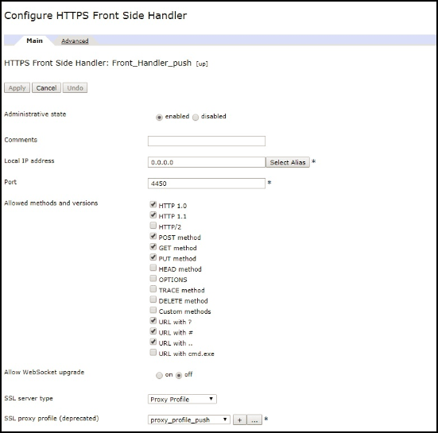

<!-- NLS_CHARSET=UTF-8 -->
## 概述
{: #overview }
通知是移动设备的一项功能，用于接收从服务器“推送”的消息。  
不管应用程序当前是在前台还是在后台运行，都会收到通知。  

{{ site.data.keys.product_full }} 提供了一整套 API 方法，可用于将推送通知或 SMS 通知发送到 iOS、Android、Windows 8.1 Universal、Windows 10 UWP 和 Cordova（iOS 或 Android）应用程序。 通知从 {{ site.data.keys.mf_server }} 发送到供应商（Apple、Google、Microsoft 或 SMS Gateways）基础结构，然后从该处发送到相关设备。 统一通知机制使与用户和设备通信的整个过程对开发人员完全透明。

#### 设备支持
{: #device-support }
以下平台上的 {{ site.data.keys.product }} 中支持推送通知和 SMS 通知：

* iOS 8.x 或更高版本
* Android 4.x 或更高版本
* Windows 8.1 或 Windows 10

#### 跳转至：
{: #jump-to }
* [推送通知](#push-notifications)
* [SMS 通知](#sms-notifications)
* [代理设置](#proxy-settings)
* [后续教程](#tutorials-to-follow-next)

## 推送通知
{: #push-notifications }
通知可以采取多种形式：

* **警报（iOS、Android 或 Windows）** - 弹出式文本消息
* **声音（iOS、Android 或 Windows）** - 收到通知时播放的声音文件
* **角标 (iOS) 或磁贴 (Windows)** - 允许短文本或图像的图形表示
* **条幅 (iOS) 或 Toast (Windows)** - 隐藏在设备显示屏顶部的弹出式文本消息
* **交互式（iOS 8 及更高版本）** - 位于已接收通知的条幅内的操作按钮
* **静默（iOS 8 及更高版本）** - 在不打扰用户的情况下发送通知

### 推送通知类型
{: #push-notification-types }
#### 标记通知
{: #tag-notifications }
标记通知是只将预订了特定标记的所有设备作为目标的通知消息。  

基于标记的通知允许根据主题区域或主题对通知进行细分。 通知接收方可以选择仅接收关于所关注主题的通知。 因此，基于标记的通知提供了一种对接收方进行细分的方法。 通过此功能，您可以定义标记并按标记发送或接收消息。 消息的目标对象只包括已预订某标记的设备。

#### 广播通知
{: #broadcast-notifications }
广播通知是标记推送通知的一种形式，其将所有预订设备作为目标，任何支持推送的 {{ site.data.keys.product_adj }} 应用程序在缺省情况下都可通过预订保留的 `Push.all` 标记（为每个设备自动创建）来启用此类通知。 可通过取消对保留的 `Push.all` 标记的预订来禁用广播通知。

#### 单点广播通知
{:# unicast-notifications }
单点广播通知或用户认证的通知都由 OAuth 提供保护。 这些通知消息将特定设备或用户标识作为目标。 用户预订中的用户标识可以来自底层安全上下文。

#### 交互式通知
{: #interactive-notifications }
通过使用交互式通知，在通知到达时，用户可以在不打开应用程序的情况下执行相应操作。 在交互式通知到达时，设备会显示操作按钮以及通知消息。 目前，在装有 iOS V8 及更高版本的设备上支持交互式通知。 如果将交互式通知发送到装有 iOS V8 之前版本的 iOS 设备，那么将不会显示通知操作。

> 了解如何处理[交互式通知](handling-push-notifications/interactive)。

#### 静默通知
{: #silent-notifications }
静默通知是既不显示警报也不打扰用户的通知。 当静默通知到达时，应用程序处理代码将在后台运行，而不是将应用程序转到前台。 目前，在装有 iOS V7 及更高版本的设备上支持静默通知。 如果将静默通知发送到装有 iOS V7 之前版本的设备，那么当应用程序在后台运行时，将忽略该通知。 如果应用程序在前台运行，那么将调用通知回调方法。

> 了解如何处理[静默通知](handling-push-notifications/silent)。

**注：**单点广播通知的有效内容中不包含任何标记。 通过在 POST 消息 API 的目标块中分别指定多个设备标识或用户标识，通知消息可以将多个设备或用户作为目标。

## SMS 通知
{: #sms-notifications }
要开始接收 SMS 通知，应用程序必须先注册 SMS 通知预订。 要预订 SMS 通知，用户需要提供一个移动电话号码并批准通知预订。 在收到用户批准时，会向 {{ site.data.keys.mf_server }}发送一个预订请求。 从 {{ site.data.keys.mf_console }} 中检索通知时，将通过预配置的 SMS 网关来处理和发送该通知。

要配置网关，请参阅[发送通知](sending-notifications)教程。

## 代理设置
{: #proxy-settings }
可使用代理设置来设置用于将通知发送到 APNS 和 FCM 的可选代理。可以使用 **push.apns.proxy.*** 和 **push.gcm.proxy.*** 配置属性来设置代理。 有关更多信息，请参阅 [{{ site.data.keys.mf_server }} 推送服务的 JNDI 属性列表](../installation-configuration/production/server-configuration/#list-of-jndi-properties-for-mobilefirst-server-push-service)。

> **注：**WNS 不支持任何代理。

### 使用 WebSphere DataPower 作为推送通知端点
{: #proxy-settings-datapower }

您可以设置 DataPower 以接受来自 MobileFirst Server 的通知请求，并将其重定向至 FCM、SMS 和 WNS。

请注意，APN 不受支持。

#### 配置 MobileFirst Server
{: #proxy-settings-datapower-1 }

在 `server.xml` 中，配置以下 JNDI 属性：
```
<jndiEntry jndiName="imfpush/mfp.push.dp.endpoint" value = '"https://host"' />
<jndiEntry jndiName="imfpush/mfp.push.dp.gcm.port" value = '"port"' />
<jndiEntry jndiName="imfpush/mfp.push.dp.wns.port" value = '"port"' />
```

其中 `host` 是 DataPower 的主机名，`port` 是为 HTTPS 前端处理程序配置的用于处理 FCM 和 WNS 的端口号。

对于 SMS，配置设置将在 REST API 调用过程中提供。无需提供 JNDI 属性。

#### 配置 DataPower
{: #proxy-settings-datapower-2 }

1. 登录至 DataPower 设备。
2. 浏览至**服务** > **多协议网关** > **新建多协议网关**。
3. 提供用于标识配置的名称。
4. 选择 XML 管理器，将“多协议网关策略”作为缺省设置，将“URL 重写策略”设置为“无”。
5. 选中**静态后端**单选按钮，并针对**设置缺省后端 URL** 选择以下任一选项：
	- 对于 FCM：`https://gcm-http.googleapis.com`
	- 对于 SMS：`http://<samplegateway>/gateway`
	- 对于 WNS：`https://hk2.notify.windows.com`
6. 选择“响应类型”和“请求类型”作为传递。

#### 生成证书
{: #proxy-settings-datapower-3 }

要生成证书，请选择以下任一选项：

- 对于 FCM：
	1. 从命令行中发出 `Openssl` 以获取 FCM 证书。
	2. 运行以下命令：
		```
		openssl s_client -connect gcm-http.googleapis.com:443
		```
	3. 复制从 -----BEGIN CERTIFICATE----- 到 -----END CERTIFICATE----- 之间的内容，并将其保存在扩展名为 `.pem` 的文件中。

- 对于 SMS，无需任何证书。
- 对于 WNS：
	1. 在命令行中使用 `Openssl` 以获取 WNS 证书。
	2. 运行以下命令：
		```
		openssl s_client -connect https://hk2.notify.windows.com:443
		```
	3. 复制从 -----BEGIN CERTIFICATE----- 到 -----END CERTIFICATE----- 之间的内容，并将其保存在扩展名为 `.pem` 的文件中。

#### 后端设置
{: #proxy-settings-datapower-4 }


- 对于 FCM 和 WNS：

	1. 创建加密证书：

		a. 浏览至**对象** > **加密配置**，然后单击**加密证书**。

		b. 提供用于标识加密证书的名称。

		c. 单击**上传**以上传所生成的 FCM 证书。

		d. 将**密码别名**设置为“无”。

		e. 单击**生成密钥**。
		

	2. 创建加密验证凭证：

		a. 浏览至**对象** > **加密配置**，然后单击**加密验证凭证**。

		b. 提供唯一名称。

		c. 对于“证书”，选择在先前步骤 1 中创建的“加密证书”。

		d. 对于**证书验证方式**，选择“完全匹配证书”或直接颁发者。

		e. 单击**应用**。
		

	3. 创建加密验证凭证：

		a. 浏览至**对象** > **加密配置**，然后单击**加密概要文件**。

		b. 单击**添加**。

		c. 提供唯一名称。

		d. 对于**验证凭证**，从下拉菜单中选择先前步骤 2 中创建的验证凭证，将“标识凭证”设置为**无**。

		e. 单击**应用**。
		

	4. 创建 SSL 代理概要文件：

		a. 浏览至**对象** > **加密配置** > **SSL 代理概要文件**。

		b. 选择以下任一选项：

		- 对于 SMS，将 **SSL 代理概要文件**设置为“无”。
		- 对于含安全后端 URL (HTTPS) 的 FCM 和 WNS，完成以下步骤：
			1.	单击**添加**。

			2.	提供稍后用于标识 SSL 代理概要文件的名称。

			3.	从下拉列表中为 **SSL 方向**选择**正向**。

			4.	对于“正向（客户机）加密概要文件”，选择步骤 3 中创建的加密概要文件。

			5.	单击**应用**。
			

	5. 在“多协议网关”窗口上的**后端设置**下，为**代理概要文件**选择 **SSL 客户机类型**，并选择步骤 4 中创建的 SSL 代理概要文件。
	 

- 对于 SMS，无需后端设置。

#### 前端设置
{: #proxy-settings-datapower-5 }

- 对于 FCM、WNS 和 SMS：


	1. 创建密钥证书对，使用公用名称 (CN) 值作为 DataPower 的主机名：

		a. 浏览至**管理** > **杂项**，单击**加密工具**。

		b. 输入 Datapower 的主机名作为公用名称 (CN) 的值。

		c. 如果计划稍后导出专用密钥，请选择**导出专用密钥**，单击**生成密钥**。
		

	2. 创建加密标识凭证：

		a. 浏览至**对象** > **加密配置**，单击**加密标识凭证**。

		b. 单击**添加**。

		c. 提供唯一名称。

		d. 对于“加密密钥和证书”，从列表框中选择在先前步骤 1 中生成的密钥和证书。

		e. 单击**应用**。
		

	3. 创建加密概要文件：

		a. 浏览至**对象** > **加密配置**，然后单击**加密概要文件**。

		b. 单击**添加**。

		c. 提供唯一名称。

		d. 对于“标识凭证”，从列表框中选择在先前步骤 2 中创建的标识凭证。将“验证凭证”设置为“无”。

		e. 单击**应用**。
		

	4. 创建 SSL 代理概要文件：

		a. 浏览至**对象** > **加密配置** > **SSL 代理概要文件**。

		b. 单击**添加**。

		c. 提供唯一名称。

		d. 在列表框中为“SSL 方向”选择**逆向**。

		e. 对于“逆向（服务器）加密概要文件”，选择在先前步骤 3 中创建的加密概要文件。  

		f. 单击**应用**。
		

	5. 创建 HTTPS 前端处理程序：

		a. 浏览至**对象** > **协议处理程序** > **HTTPS 前端处理程序**。

		b. 单击**添加**。

		c. 提供唯一名称。

		d. 对于**本地 IP 地址**，请选择正确的别名，或者保留其缺省值 (0.0.0.0)。

		e. 提供可用端口。

		f. 对于**允许的方法和版本**，选择 HTTP 1.0、HTTP 1.1、POST 方法、GET 方法、含 ? 的 URL、含 # 的 URL、含 . 的 URL。

		g. 选择**代理概要文件**作为 SSL 服务器类型。

		h. 对于 SSL 代理概要文件（不推荐），请选择在先前步骤 4 中创建的 SSL 代理概要文件。

		i. 单击**应用**。
		

	6. 在“配置多协议网关”页面上的**前端设置**下，为 HTTPS 前端处理程序选择在步骤 5 中创建的**前端协议**，然后单击**应用**。

	

	在“前端设置”中供 DataPower 使用的证书为自签名证书。除非此证书已添加到 Mobilefirst 使用的 JRE 密钥库，否则与 DataPower 的连接将失败。

	要将自签名证书添加到 JRE 密钥库，请按照以下文档中的指示信息执行：[IBM Worklight Server 和自签名证书](https://www.ibm.com/support/knowledgecenter/SSZH4A_5.0.5/com.ibm.worklight.help.doc/admin/t_ibm_worklight_server_and_self-signed_certificates.html)。


## 后续教程
{: #tutorials-to-follow-next }
对服务器端和客户端进行下列必要设置，以便能够发送和接收推送通知：
