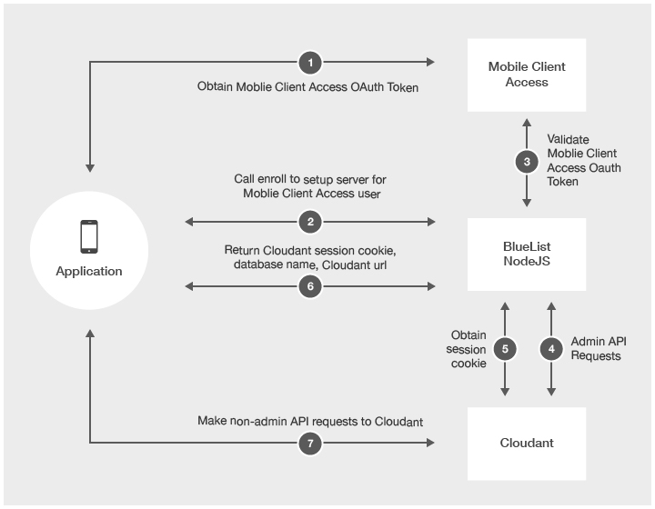

<!-- NLS_CHARSET=UTF-8 -->
## 概述
{: #overview }
您可以将移动应用程序的数据存储在 Cloudant 数据库中。Cloudant 是一种高级的非关系型数据库，能够处理多种数据类型，如 JSON、全文本和地理空间数据。SDK 可用于 Java™、Objective-C 和 Swift。

> 在 {{ site.data.keys.product_full }} V8.0 中已停用 CloudantToolkit 和 IMFData 框架。

* 对于 iOS，使用 [CDTDatastore](https://github.com/cloudant/CDTDatastore) SDK 替代 CloudantToolkit 和 IMFData 框架。
* 对于 Android，使用 [Cloudant Sync Android SDK](https://github.com/cloudant/sync-android) 替代 CloudantToolkit 和 IMFData 框架。依靠 Cloudant Sync，可以将数据持久存储在本地，并使用远程数据存储器复制数据。

如果希望直接访问远程存储器，请在应用程序中使用 REST 调用并参考 [Cloudant API 参考](https://docs.cloudant.com/api.html)。

### Cloudant 与 JSONStore
{: #cloudant-versus-jsonstore }
您可以考虑在以下场景中使用 JSONStore 代替 Cloudant：

* 必须以符合 FIPS 140-2 的方式将数据存储在移动设备上时，
* 当需要在设备和企业之间同步数据时，
* 在开发混合应用程序时，

有关 JSONStore 的更多信息，请参阅 [JSONStore](../../application-development/jsonstore)。

#### 跳至：
{: #jump-to }
* [集成 {{ site.data.keys.product_adj }} 和 Cloudant 安全性](#integrating-mobilefirst-and-cloudant-security)
* [创建数据库](#creating-databases)
* [加密设备上的数据](#encrypting-data-on-the-device)
* [设置用户许可权](#setting-user-permissions)
* [数据建模](#modeling-data)
* [执行 CRUD 操作](#performing-crud-operations)
* [创建索引](#creating-indexes)
* [查询数据](#querying-data)
* [支持脱机存储和同步](#supporting-offline-storage-and-synchronization)

## 集成 {{ site.data.keys.product_adj }} 和 Cloudant 安全性
{: #integrating-mobilefirst-and-cloudant-security }
### 适配器样本
{: #adapter-sample }
要下载样本，请参阅“样本：[mfp-bluelist-on-premises](https://github.com/MobileFirst-Platform-Developer-Center/BlueList-On-Premise)”。

要了解 Bluelist 样本随附的适配器，您必须了解 [Cloudant 安全性](https://cloudant.com/for-developers/faq/auth/)和 [{{ site.data.keys.product_adj }} 安全框架](../../authentication-and-security)。

Bluelist 适配器样本具有两个主要功能：

* 将 {{ site.data.keys.product_adj }} OAuth 令牌交换成 Cloudant 会话 cookie
* 从 Bluelist 样本中对 Cloudant 执行所需的管理请求。

该样本演示了如何在安全的服务器上执行需要管理访问权的 API 请求。尽管可以将管理凭证放在移动设备上，但更好的做法是限制从移动设备进行访问。

Bluelist 样本将 {{ site.data.keys.product_adj }} 安全性与 Cloudant 安全性集成。适配器样本将 {{ site.data.keys.product_adj }} 身份映射到 Cloudant 身份。移动设备接收 Cloudant 会话 cookie，以执行非管理 API 请求。样本使用 Couch 安全模型。

### 注册 REST 端点
{: #enroll-rest-endpoint }
下图说明由 Bluelist 适配器样本 **/enroll** 端点执行的集成。



1. 移动设备从 {{ site.data.keys.mf_server }} 获取 {{ site.data.keys.product_adj }} OAuth 令牌。
2. 移动设备调用适配器上的 **/enroll** 端点。
3. 适配器样本使用 {{ site.data.keys.mf_server }} 验证 {{ site.data.keys.product_adj }} OAuth 令牌。
4. 如果有效，请对 Cloudant 执行管理 API 请求。该样本检查 **_users** 数据库中是否存在现有 Cloudant 用户。
    * 如果该用户存在，那么在 **_users** 数据库中查找 Cloudant 用户凭证。
    * 如果新用户通过了验证，请使用 Cloudant 管理凭证，创建新的 Cloudant 用户，并将其存储在 **_users** 数据库中。
    * 为用户生成唯一数据库名称并使用该名称在 Cloudant 上创建远程数据库。
    * 为 Cloudant 用户授予读取/写入新创建的数据库的许可权。
    * 为 Bluelist 应用程序创建所需索引。
5. 请求新的 Cloudant 会话 cookie。
6. 适配器样本会将 Cloudant 会话 cookie、远程数据库名称和 Cloudant URL 返回到移动设备。
7. 移动设备直接向 Cloudant 发出请求，直至会话 cookie 到期为止。

### 会话 cookie REST 端点
{: #sessioncookie-rest-endpoint }
如果会话 cookie 已到期，那么移动设备可以与 **/sessioncookie** 端点交换 Cloudant 会话 cookie 的有效 {{ site.data.keys.product_adj }} OAuth 令牌。

## 创建数据库
{: #creating-databases }
### 访问本地数据存储
{: #accessing-local-data-stores }
您可使用本地数据存储将数据存储到客户机设备上以供快速访问（即使在脱机时也不例外）。  
要创建 Store 对象以访问本地数据库，请提供数据存储的名称。

> **要点：**数据库名称必须采用小写形式。

#### iOS
{: #ios }
##### BEFORE（使用 IMFData/CloudantToolkit）：
{: #before-with-imdata-cloudanttoolkit }

**Objective-C**  

```objc
//Get reference to data manager
IMFDataManager *manager = [IMFDataManager sharedInstance];
NSString *name = @"automobiledb";
NSError *error = nil;
```
**Swift**

```swift
//Create local store
CDTStore *store = [manager localStore:name error:&error];
let manager = IMFDataManager.sharedInstance()
let name = "automobiledb"

var store:CDTStore?
do {
store = try manager.localStore(name)
} catch let error as NSError {
// Handle error
}
```

##### AFTER（使用 Cloudant Sync）：
{: #after-with-cloudant-sync }

**Objective-C**  

```objc
// Get reference to datastore manager
CDTDatastoreManager *datastoreManager = existingDatastoreManager;
NSString *name = @"automobiledb";
NSError *error = nil;

//Create datastore
CDTDatastore *datastore = [datastoreManager datastoreNamed:name error:&error];
```

**Swift**

```swift
// Get reference to datastore manager
let datastoreManager:CDTDatastoreManager = existingDatastoreManager
let name:String  = "automobiledb"

//Create local store
var datastore:CDTDatastore?
do{
    datastore = try datastoreManager.datastoreNamed(name)
}catch let error as NSError{
    // Handle error
}
```

#### Android
{: #android }
##### BEFORE（使用 IMFData/CloudantToolkit）：
{: before-with-imfdata-cloudanttoolkit }

```java
// Get reference to DataManager
DataManager manager = DataManager.getInstance();

// Create local store
String name = "automobiledb";

Task<Store> storeTask = manager.localStore(name);
storeTask.continueWith(new Continuation<Store, Void>() {
    @Override
    public Void then(Task<Store> task) throws Exception {
        if(task.isFaulted()){
            // Handle error
        }else{
            // Do something with Store
            Store store = task.getResult();
        }
        return null;
    }
});
```

##### AFTER（使用 Cloudant Sync）：
{: #after-with-cloudant-sync }
```java
// Create DatastoreManager
       File path = context.getDir("databasedir", Context.MODE_PRIVATE);
       DatastoreManager manager = new DatastoreManager(path.getAbsolutePath());

       // Create a Datastore
       String name = "automobiledb";
       Datastore datastore = manager.openDatastore(name);
```

### 创建远程数据存储
{: #creating-remote-data-stores }
要在远程数据存储中保存数据，请提供数据存储名称。

#### iOS
{: #ios }
##### BEFORE（使用 IMFData/CloudantToolkit）：
{: #before-with-imfdata-cloudanttoolkit }

**Objective-c**

```objc
// Get reference to data manager
IMFDataManager *manager = [IMFDataManager sharedInstance];
NSString *name = @"automobiledb";

// Create remote store
[manager remoteStore:name completionHandler:^(CDTStore *createdStore, NSError *error) {
    if(error){
        // Handle error
    }else{
        CDTStore *store = createdStore;
        NSLog(@"Successfully created store: %@", store.name);
    }
}];
```

**Swift**

```swift
let manager = IMFDataManager.sharedInstance()
let name = "automobiledb"

manager.remoteStore(name, completionHandler: { (createdStore:CDTStore!, error:NSError!) -> Void in
    if nil != error {
        //Handle error
    } else {
        let store:CDTStore = createdStore
        print("Successfully created store: \(store.name)")
    }
})
```

##### AFTER（使用 Cloudant Sync）：
{: #after-with-cloudant-sync }
**Objective-c**

```objc
```

**Swift**

```swift
```

#### Android
{: #android }
##### BEFORE（使用 IMFData/CloudantToolkit）：
{: #before-with-imfdata-cloudanttoolkit }

```java
```

##### AFTER（使用 Cloudant Sync）：
{: #after-with-cloudant-sync }
```java
```

## 加密设备上的数据
{: #encrypting-data-on-the-device }
要支持对移动设备上的本地数据存储进行加密，必须更新应用程序以包含加密功能并创建加密的数据存储。

### 加密 iOS 设备上的数据
{: #encrypting-data-on-ios-devices }
1. 使用 CocoaPods 获取加密功能。
   * 打开 Podfile 并添加以下行：
        
   ##### Before（使用 IMFData/CloudantToolkit）：
   {: #before-with-imfdata-cloudanttoolkit }    
   ```xml
   pod 'IMFDataLocal/SQLCipher'
   ```
        
   ##### After（使用 Cloudant Sync）：
   {: after-with-cloudant-sync }
   ```xml
   pod 'CDTDatastore/SQLCipher'
   ```        
        
   有关更多信息，请参阅 [CDTDatastore 加密文档](https://github.com/cloudant/CDTDatastore/blob/master/doc/encryption.md)。
    
   * 运行以下命令将依赖关系添加到应用程序。

     ```bash
     pod install
     ```

2. 要使用 Swift 应用程序内的加密功能，请将以下导入添加到应用程序的关联桥接头： 
    
   ##### Before（使用 IMFData/CloudantToolkit）：
   {: #before-with-imfdata-cloudanttoolkit}
   ```objc
   #import <CloudantSync.h>
   #import <CloudantSyncEncryption.h>
   #import <CloudantToolkit/CloudantToolkit.h>
   #import <IMFData/IMFData.h>
   ```
    
   ##### After（使用 Cloudant Sync）：
   {: #after-with-cloudant-sync }
   ```objc
   #import <CloudantSync.h>
   #import <CloudantSyncEncryption.h>
   ```
        
3. 初始化本地存储器来通过密钥提供者进行加密。

   > **警告：**如果创建数据库后更改了密码，那么会因为无法解密现有数据库而发生错误。数据库已加密后，即无法更改密码。必须删除数据库才能更改密码。

   ##### BEFORE（使用 IMFData/CloudantToolkit）：
   {: #before-with-imfdata-cloudanttoolkit }
   **Objective-C**
    
   ```objc
   //Get reference to data manager
   IMFDataManager *manager = [IMFDataManager sharedInstance];
   NSString *name = @"automobiledb";
   NSError *error = nil;

   // Initalize a key provider
   id<CDTEncryptionKeyProvider> keyProvider = [CDTEncryptionKeychainProvider providerWithPassword: @"passw0rd" forIdentifier: @"identifier"];

   //Initialize local store
   CDTStore *localStore = [manager localStore: name withEncryptionKeyProvider: keyProvider error: &error];
   ```
    
   **Swift**
    
   ```swift
   let manager = IMFDataManager.sharedInstance()
   let name = "automobiledb"

   let keyProvider = CDTEncryptionKeychainProvider(password: "passw0rd", forIdentifier: "identifier")
   var store:CDTStore?
   do {
store = try manager.localStore(name, withEncryptionKeyProvider: keyProvider)
   } catch let error as NSError {
        // Handle error
}
```
    
   ##### AFTER（使用 Cloudant Sync）：
   {: #after-with-cloudant-sync }
   **Objective-C**

   ```objc
   // Get reference to datastore manager
   CDTDatastoreManager *datastoreManager = existingDatastoreManager;
   NSString *name = @"automobiledb";
   NSError *error = nil;

   // Create KeyProvider
   id<CDTEncryptionKeyProvider> keyProvider = [CDTEncryptionKeychainProvider providerWithPassword: @"passw0rd" forIdentifier: @"identifier"];

   //Create local store
   CDTDatastore *datastore = [datastoreManager datastoreNamed:name withEncryptionKeyProvider:keyProvider error:&error];
   ```

   **Swift**
    
   ```swift
   // Get reference to datastore manager
   let datastoreManager:CDTDatastoreManager = existingDatastoreManager
   let name:String  = "automobiledb"

   //Create local store
   var datastore:CDTDatastore?
   let keyProvider = CDTEncryptionKeychainProvider(password: "passw0rd", forIdentifier: "identifier")
   do{
        datastore = try datastoreManager.datastoreNamed(name, withEncryptionKeyProvider: keyProvider)
   }catch let error as NSError{
        // Handle error
   }
   ```
    
4. 使用加密的本地存储器复制数据时，必须使用密钥提供者来初始化 CDTPullReplication 和 CDTPushReplication 方法。

   ##### BEFORE（使用 IMFData/CloudantToolkit）：   
   {: #before-with-imfdata-cloudanttoolkit }
   **Objective-C**
    
   ```objc
   //Get reference to data manager
   IMFDataManager *manager = [IMFDataManager sharedInstance];
   NSString *databaseName = @"automobiledb";

   // Initalize a key provider
   id<CDTEncryptionKeyProvider> keyProvider = [CDTEncryptionKeychainProvider providerWithPassword:@"password" forIdentifier:@"identifier"];

   // pull replication
   CDTPullReplication *pull = [manager pullReplicationForStore: databaseName withEncryptionKeyProvider: keyProvider];

   // push replication
   CDTPushReplication *push = [manager pushReplicationForStore: databaseName withEncryptionKeyProvider: keyProvider];
   ```
    
   **Swift**
    
   ```swift
   //Get reference to data manager
   let manager = IMFDataManager.sharedInstance()
   let databaseName = "automobiledb"

   // Initalize a key provider
   let keyProvider = CDTEncryptionKeychainProvider(password: "password", forIdentifier: "identifier")

   // pull replication
   let pull:CDTPullReplication = manager.pullReplicationForStore(databaseName, withEncryptionKeyProvider: keyProvider)

   // push replication
   let push:CDTPushReplication = manager.pushReplicationForStore(databaseName, withEncryptionKeyProvider: keyProvider)
   ```
    
   ##### AFTER（使用 Cloudant Sync）：
   {: #after-with-cloudant-sync }
   使用加密数据库进行复制与使用未加密数据库进行复制的过程一样。

### 加密 Android 设备上的数据
{: #encrypting-data-on-android-devices }
要加密 Android 设备上的数据，请通过在应用程序中包含正确的库来获取加密功能。然后，可以初始化本地存储器来加密和复制数据。

1. 将 Cloudant Toolkit 库添加为 build.gradle 文件中的依赖关系：

   ##### BEFORE（使用 IMFData/CloudantToolkit）：
   {: #before-with-imfdata-cloudanttoolkit }
   ```xml
   repositories {
   mavenCentral()
   }

   dependencies {
compile 'com.ibm.mobile.services:cloudant-toolkit-local:1.0.0'
   }
   ```
    
   ##### AFTER（使用 Cloudant Sync）：
   {: #after-with-cloudant-sync }
    ```xml
    repositories {
        mavenLocal()
        maven { url "http://cloudant.github.io/cloudant-sync-eap/repository/" }
        mavenCentral()
    }

    dependencies {
compile group: 'com.cloudant', name: 'cloudant-sync-datastore-core', version:'0.13.2'
compile group: 'com.cloudant', name: 'cloudant-sync-datastore-android', version:'0.13.2'
compile group: 'com.cloudant', name: 'cloudant-sync-datastore-android-encryption', version:'0.13.2'
    }
    ```
    
2. 下载 [SQLCipher for Android v3.2](https://www.zetetic.net/sqlcipher/open-source/) **.jar** 和 **.so** 二进制文件，并将其包含在应用程序结构中相应文件夹内的应用程序中：
    * 添加库。将共享库文件和 SQLCipher 归档添加到 Android 应用程序目录下的 **jniLibs** 文件夹中。
    * 将所需的 ICU 压缩文件添加到应用程序的 assets 文件夹中。
    * 将 **sqlcipher.jar** 添加为文件依赖关系。从 Android Studio 中的应用程序文件夹菜单的**打开模块设置**下，选择**依赖关系**选项卡。
3. 初始化本地存储器来通过密钥提供者进行加密。
    
   > **警告：**如果创建数据库后更改了密码，那么会因为无法解密现有数据库而发生错误。数据库加密后，即无法更改密码。必须删除数据库才能更改密码。

   ##### BEFORE（使用 IMFData/CloudantToolkit）：
   {: #before-with-imfdata-cloudanttoolkit }
   ```java
   // Get reference to DataManager
   DataManager manager = DataManager.getInstance();

   // Initalize a key provider
   KeyProvider keyProvider = new AndroidKeyProvider(getContext(),"password","identifier");

   // Create local store
   String databaseName = "automobiledb";
   Task<Store> storeTask = manager.localStore(databaseName, keyProvider);
   storeTask.continueWith(new Continuation<Store, Void >() {
        @Override
        public Void then(Task<Store> task) throws Exception {
            if (task.isFaulted()) {
// Handle error
    } else {
        // Do something with Store
                Store store = task.getResult();
            }
            return null;
         }
   });
   ```
    
   ##### AFTER（使用 Cloudant Sync）：
   {: #after-with-cloudant-sync }   
   ```java
   // Load SQLCipher libs
   SQLiteDatabase.loadLibs(context);

   // Create DatastoreManager
   File path = context.getDir("databasedir", Context.MODE_PRIVATE);
   DatastoreManager manager = new DatastoreManager(path.getAbsolutePath());

   // Create encrypted local store
   String name = "automobiledb";

   KeyProvider keyProvider = new AndroidKeyProvider(context,"passw0rd","identifier");
   Datastore datastore = manager.openDatastore(name, keyProvider);
   ```

4. 使用加密的本地存储器复制数据时，必须将 KeyProvider 对象传递到 `pullReplicationForStore()` 或 `pushReplicationForStore()` 方法。

   ##### BEFORE（使用 IMFData/CloudantToolkit）：
   {: #before-with-imfdata-cloudanttoolkit }
   ```java
   //Get reference to data manager
   DataManager manager = DataManager.getInstance();
   String databaseName = "automobiledb";

   // Initalize a key provider
   KeyProvider keyProvider = new AndroidKeyProvider(getContext(),"password","identifier");

   // pull replication
   Task<PushReplication> pullTask = manager.pullReplicationForStore(databaseName, keyProvider);

   // push replication
   Task<PushReplication> pushTask = manager.pushReplicationForStore(databaseName, keyProvider);
   ```

   ##### AFTER（使用 Cloudant Sync）：
   {: #after-with-cloudant-sync }
   使用加密数据库进行复制与使用未加密数据库进行复制的过程一样。

## 设置用户许可权
{: #setting-user-permissions }
您可设置用户对远程数据库的许可权。

##### BEFORE（使用 IMFData/CloudantToolkit）：
{: #before-with-imfdata-cloudanttoolkit }
**Objective-C**

```objc
// Get reference to data manager
IMFDataManager *manager = [IMFDataManager sharedInstance];

// Set permissions for current user on a store
[manager setCurrentUserPermissions: DB_ACCESS_GROUP_MEMBERS forStoreName: @"automobiledb" completionHander:^(BOOL success, NSError *error) {
    if(error){
        // Handle error
    }else{
        // setting permissions was successful
    }
}];
```

**Swift**

```swift
// Get reference to data manager
let manager = IMFDataManager.sharedInstance()

// Set permissions for current user on a store
manager.setCurrentUserPermissions(DB_ACCESS_GROUP_MEMBERS, forStoreName: "automobiledb") { (success:Bool, error:NSError!) -> Void in
    if nil != error {
        // Handle error
    } else {
        // setting permissions was successful
    }
}
```

**Java**

```java
Task<Boolean> permissionsTask = manager.setCurrentUserPermissions(DataManager.DB_ACCESS_GROUP_MEMBERS, "automobiledb");

permissionsTask.continueWith(new Continuation<Boolean, Object>() {
@Override
    public Object then(Task<Boolean> task) throws Exception {
        if(task.isFaulted()){
            // Handle error
        }else{
           // setting permissions was successful
        }
        return null;
    }
});
```

##### AFTER（使用 Cloudant Sync）：
{: #after-with-cloudant-sync }
无法从移动设备设置用户许可权。必须使用 Cloudant 仪表板或服务器端代码设置许可权。有关如何将 {{ site.data.keys.product_adj }} OAuth 令牌与 Cloudant 安全性集成的样本，请参阅 [Bluelist 样本](https://github.ibm.com/MFPSamples/BlueList-On-Premise)。

## 数据建模
{: #modeling-data }
Cloudant 将数据存储为 JSON 文档。要将数据存储为应用程序中的对象，请使用包含的数据对象映射器类，用于将本机对象映射为底层 JSON 文档格式。

* iOS：Cloudant 将数据存储为 JSON 文档。CloudantToolkit 框架提供了对象映射器，能够在本机对象与 JSON 文档之间进行映射。CDTDatastore API 未提供此功能。以下部分中的片段说明了如何使用 CDTDatastore 对象完成相同操作。
* Android：AndroidCloudant 将数据存储为 JSON 文档。CloudantToolkit API 提供了对象映射器，能够在本机对象与 JSON 文档之间进行映射。Cloudant Sync 未提供此功能。以下部分中的片段说明了如何使用 DocumentRevision 对象完成相同操作。

## 执行 CRUD 操作
{: #performing-crud-operations }
您可修改数据存储的内容。

* 有关`创建`、`检索`、`更新`和`删除` (CRUD) 操作的更多详细信息，请参阅 [CDTDatastore CRUD 文档](https://github.com/cloudant/CDTDatastore/blob/master/doc/crud.md)。
* 有关在远程存储器上执行`创建`、`检索`、`更新`和`删除` (CRUD) 操作的信息，请参阅 [Cloudant 文档 API](https://docs.cloudant.com/document.html)。

### 创建数据
{: #creating-data }
##### BEFORE
{: #before }

**Objective-C**

```objc
// Use an existing store
CDTStore *store = existingStore;

// Create your Automobile to save
Automobile *automobile = [[Automobile alloc] initWithMake:@"Toyota" model:@"Corolla" year: 2006];

[store save:automobile completionHandler:^(id savedObject, NSError *error) {
if (error) {
// save was not successful, handler received an error
    } else {
        // use the result
        Automobile *savedAutomobile = savedObject;
        NSLog(@"saved revision: %@", savedAutomobile);
    }
}];
```

**Swift**

```swift
// Use an existing store
let store:CDTStore = existingStore

// Create your object to save
let automobile = Automobile(make: "Toyota", model: "Corolla", year: 2006)

store.save(automobile, completionHandler: { (savedObject:AnyObject!, error:NSError!) -> Void in
   if nil != error {
       //Save was not successful, handler received an error
   } else {
       // Use the result
       print("Saved revision: \(savedObject)")
   }
})
```

**Java**

```java
// Use an existing store
Store store = existingStore;

// Create your object to save
Automobile automobile = new Automobile("Toyota", "Corolla", 2006);

// Save automobile to store
Task<Object> saveTask = store.save(automobile); 
saveTask.continueWith(new Continuation<Object, Void>() {
    @Override
    public Void then(Task<Object> task) throws Exception {
        if (task.isFaulted()) {
// save was not successful, task.getError() contains the error
        } else {
            // use the result
            Automobile savedAutomobile = (Automobile) task.getResult();
        }
        return null;
    }
});
```

##### AFTER
{: #after }
```objc
// Use an existing store
CDTDatastore *datastore = existingDatastore;

// Create document body
CDTMutableDocumentRevision * revision = [CDTMutableDocumentRevision revision];
revision.body = @{@"@datatype" : @"Automobile", @"make" :@"Toyota", @"model": @"Corolla", @"year" : @2006};

NSError *error = nil;
CDTDocumentRevision *createdRevision = [datastore createDocumentFromRevision:revision error:&error];

if (error) {
// save was not successful, handler received an error
} else {
    // use the result
    NSLog(@"Revision: %@", createdRevision);
}
```

**Swift**

```swift
// Use an existing store
let datastore:CDTDatastore = existingDatastore

// Create document body
let revision = CDTMutableDocumentRevision()
revision.setBody(["make":"Toyota","model":"Corolla","year":2006])

var createdRevision:CDTDocumentRevision?
do{
    createdRevision = try datastore.createDocumentFromRevision(revision)
    NSLog("Revision: \(createdRevision)");
}catch let error as NSError{
    // Handle error
}
```

**Java**

```java
// Use an existing store
Datastore datastore = existingStore;

// Create document body
Map<String, Object> body = new HashMap<String, Object>();
body.put("@datatype", "Automobile");
body.put("make", "Toyota");
body.put("model", "Corolla");
body.put("year", 2006);

// Create revision and set body
MutableDocumentRevision revision  = new MutableDocumentRevision();
revision.body = DocumentBodyFactory.create(body);

// Save revision to store
DocumentRevision savedRevision = datastore.createDocumentFromRevision(revision);
```

### 读取数据
{: #reading-data }
##### BEFORE
{: #before }

**Objective-C**

```objc
CDTStore *store = existingStore;
NSString *automobileId = existingAutomobileId;

// Fetch Autombile from Store
[store fetchById:automobileId completionHandler:^(id object, NSError *error) {
    if (error) {
// fetch was not successful, handler received an error
    } else {
        // use the result
        Automobile *savedAutomobile = object;
        NSLog(@"fetched automobile: %@", savedAutomobile);
    }
}];
```

**Swift**

```swift
// Using an existing store and Automobile
let store:CDTStore = existingStore
let automobileId:String = existingAutomobileId

// Fetch Autombile from Store
store.fetchById(automobileId, completionHandler: { (object:AnyObject!, error:NSError!) -> Void in
    if nil != error {
        // Fetch was not successful, handler received an error
    } else {
        // Use the result
        let savedAutomobile:Automobile = object as! Automobile
        print("Fetched automobile: \(savedAutomobile)")
    }
})
```

**Java**

```java
// Use an existing store and documentId
Store store = existingStore;
String automobileId = existingAutomobileId;

// Fetch the automobile from the store
Task<Object> fetchTask = store.fetchById(automobileId);
fetchTask.continueWith(new Continuation<Object, Void>() {
    @Override
    public Void then(Task<Object> task) throws Exception {
        if (task.isFaulted()) {
// fetch was not successful, task.getError() contains the error
        } else {
            // use the result 
            Automobile fetchedAutomobile = (Automobile) task.getResult();
        }
        return null;
    }
});
```

##### AFTER
{: #after }
**Objective-C**

```objc
// Use an existing store and documentId
CDTDatastore *datastore = existingDatastore;
NSString *documentId = existingDocumentId;

// Fetch the CDTDocumentRevision from the store
NSError *error = nil;
CDTDocumentRevision *fetchedRevision = [datastore getDocumentWithId:documentId error:&error];

if (error) {
// fetch was not successful, handler received an error
} else {
    // use the result
    NSLog(@"Revision: %@", fetchedRevision);
}
```

**Swift**

```swift
// Use an existing store and documentId
let datastore:CDTDatastore = existingDatastore
let documentId:String = existingDocumentId

var fetchedRevision:CDTDocumentRevision?
do{
    fetchedRevision = try datastore.getDocumentWithId(documentId)
    NSLog("Revision: \(fetchedRevision)");
}catch let error as NSError{
    // Handle error
}
```

**Java**

```java
// Use an existing store and documentId
Datastore datastore = existingStore;
String documentId = existingDocumentId;

// Fetch the revision from the store
DocumentRevision fetchedRevision = datastore.getDocument(documentId);
```

### 更新数据
{: #updating-data }
##### BEFORE
{: #before }

**Objective-C**

```objc
// Use an existing store and Automobile
CDTStore *store = existingStore;
Automobile *automobile = existingAutomobile;

// Update some of the values in the Automobile
automobile.year = 2015;

// Save Autombile to the store
[store save:automobile completionHandler:^(id savedObject, NSError *error) {
    if (error) {
// sasve was not successful, handler received an error
    } else {
        // use the result
        Automobile *savedAutomobile = savedObject;
        NSLog(@"saved automobile: %@", savedAutomobile);
    }
}];
```

**Swift**

```swift
// Use an existing store and Automobile
let store:CDTStore = existingStore
let automobile:Automobile = existingAutomobile

// Update some of the values in the Automobile
automobile.year = 2015

// Save Autombile to the store
store.save(automobile, completionHandler: { (savedObject:AnyObject!, error:NSError!) -> Void in
    if nil != error {
        // Update was not successful, handler received an error
    } else {
        // Use the result
        let savedAutomobile:Automobile = savedObject as! Automobile
        print("Updated automobile: \(savedAutomobile)")
    }
})
```

**Java**

```java
// Use an existing store and Automobile
Store store = existingStore;
Automobile automobile = existingAutomobile;

// Update some of the values in the Automobile
automobile.setYear(2015);

// Save automobile to store
Task<Object> saveTask = store.save(automobile);
saveTask.continueWith(new Continuation<Object, Void>() {
    @Override
    public Void then(Task<Object> task) throws Exception {
        if (task.isFaulted()) {
// save was not successful, task.getError() contains the error
        } else {
            // use the result
            Automobile savedAutomobile = (Automobile) task.getResult();
        }
        return null;
    }
});
```

##### AFTER
{: #after }
**Objective-C**

```objc
// Use an existing store and document
CDTDatastore *datastore = existingDatastore;
CDTMutableDocumentRevision *documentRevision = [existingDocumentRevision mutableCopy];

// Update some of the values in the revision
[documentRevision.body setValue:@2015 forKey:@"year"];

NSError *error = nil;
CDTDocumentRevision *updatedRevision = [datastore updateDocumentFromRevision:documentRevision error:&error];
if (error) {
    // save was not successful, handler received an error
} else {
    // use the result
    NSLog(@"Revision: %@", updatedRevision);
}
```

**Swift**

```swift
// Use an existing store and document
let datastore:CDTDatastore = existingDatastore
let documentRevision:CDTMutableDocumentRevision = existingDocumentRevision.mutableCopy()

// Update some of the values in the revision
documentRevision.body()["year"] = 2015

var updatedRevision:CDTDocumentRevision?
do{
    updatedRevision = try datastore.updateDocumentFromRevision(documentRevision)
    NSLog("Revision: \(updatedRevision)");
}catch let error as NSError{
    // Handle error
}
```

**Java**

```java
// Use an existing store and documentId
// Use an existing store
Datastore datastore = existingStore;

// Make a MutableDocumentRevision from the existing revision
MutableDocumentRevision revision = existingRevision.mutableCopy();

// Update some of the values in the revision
Map<String, Object> body = revision.getBody().asMap();
body.put("year", 2015);
revision.body = DocumentBodyFactory.create(body);

// Save revision to store
DocumentRevision savedRevision = datastore.updateDocumentFromRevision(revision);
```

### 删除数据
{: #deleting-data }
要删除对象，请将要删除的对象传递到存储器。

##### BEFORE
{: #before }
**Objective-C**

```objc
// Using an existing store and Automobile
CDTStore *store = existingStore;
Automobile *automobile = existingAutomobile;

// Delete the Automobile object from the store
[store delete:automobile completionHandler:^(NSString *deletedObjectId, NSString *deletedRevisionId, NSError *error) {
    if (error) {
// delete was not successful, handler received an error
    } else {
        // use the result
        NSLog(@"deleted Automobile doc-%@-rev-%@", deletedObjectId, deletedRevisionId);
    }
}];
```

**Swift**

```swift
// Using an existing store and Automobile
let store:CDTStore = existingStore
let automobile:Automobile = existingAutomobile

// Delete the Automobile object
store.delete(automobile, completionHandler: { (deletedObjectId:String!, deletedRevisionId:String!, error:NSError!) -> Void in
    if nil != error {
        // delete was not successful, handler received an error
    } else {
        // use the result
        print("deleted document doc-\(deletedObjectId)-rev-\(deletedRevisionId)")
    }
})
```

**Java**

```java
// Use an existing store and automobile
Store store = existingStore;
Automobile automobile = existingAutomobile;

// Delete the automobile from the store
Task<String> deleteTask = store.delete(automobile);
deleteTask.continueWith(new Continuation<String, Void>() {
    @Override
    public Void then(Task<String> task) throws Exception {
        if (task.isFaulted()) {
// delete was not successful, task.getError() contains the error
        } else {
            // use the result
            String deletedAutomobileId = task.getResult();
        }
        return null;
    }
});
```

##### AFTER
{: #after }
**Objective-C**

```objc
// Use an existing store and revision
CDTDatastore *datastore = existingDatastore;
CDTDocumentRevision *documentRevision = existingDocumentRevision;

// Delete the CDTDocumentRevision from the store
NSError *error = nil;
CDTDocumentRevision *deletedRevision = [datastore deleteDocumentFromRevision:documentRevision error:&error];
if (error) {
    // delete was not successful, handler received an error
} else {
    // use the result
    NSLog(@"deleted document: %@", deletedRevision);
}
```

**Swift**

```swift
// Use an existing store and revision
let datastore:CDTDatastore = existingDatastore
let documentRevision:CDTDocumentRevision = existingDocumentRevision

var deletedRevision:CDTDocumentRevision?
do{
    deletedRevision = try datastore.deleteDocumentFromRevision(documentRevision)
    NSLog("Revision: \(deletedRevision)");
}catch let error as NSError{
    // Handle error
}
```

**Java**

```java
// Use an existing store and revision
Datastore datastore = existingStore;
BasicDocumentRevision documentRevision = (BasicDocumentRevision) existingDocumentRevision;

// Delete revision from store
DocumentRevision deletedRevision = datastore.deleteDocumentFromRevision(documentRevision);
```

## 创建索引
{: #creating-indexes }
要执行查询，必须创建索引。

* iOS：有关更多详细信息，请参阅 [CDTDatastore 查询文档](https://github.com/cloudant/CDTDatastore/blob/master/doc/query.md)。要了解针对远程存储器的查询操作，请参阅 [Cloudant 查询 API](https://docs.cloudant.com/cloudant_query.html)。
* Android：有关更多详细信息，请参阅 [Cloudant Sync 查询文档](https://github.com/cloudant/sync-android/blob/master/doc/query.md)。要了解针对远程存储器的 CRUD 操作，请参阅 [Cloudant 查询 API](https://docs.cloudant.com/cloudant_query.html)。

1. 创建包含数据类型的索引。在数据存储上设置了对象映射器的情况下，创建包含数据类型的索引很有用。

   ##### BEFORE
   {: #before }
   **Objective-C**
    
   ```objc
   // Use an existing data store
   CDTStore *store = existingStore;

   // The data type to use for the Automobile class
   NSString *dataType = [store.mapper dataTypeForClassName:NSStringFromClass([Automobile class])];

   // Create the index
   [store createIndexWithDataType:dataType fields:@[@"year", @"make"] completionHandler:^(NSError *error) {
       if(error){
            // Handle error
        }else{
            // Continue application flow
        }
   }];
   ```
    
   **Swift**
    
   ```swift
   // A store that has been previously created.
   let store:CDTStore = existingStore

// The data type to use for the Automobile class
   let dataType:String = store.mapper.dataTypeForClassName(NSStringFromClass(Automobile.classForCoder()))

   // Create the index
   store.createIndexWithDataType(dataType, fields: ["year","make"]) { (error:NSError!) -> Void in
        if nil != error {
            // Handle error
        } else {
            // Continue application flow
        }
   }
   ```
    
   **Java**
    
   ```java
   // Use an existing data store
   Store store = existingStore;

   // The data type to use for the Automobile class
   String dataType = store.getMapper().getDataTypeForClassName(Automobile.class.getCanonicalName());

   // The fields to index.
List<IndexField> indexFields = new ArrayList<IndexField>();
   indexFields.add(new IndexField("year"));
   indexFields.add(new IndexField("make"));

   // Create the index
   Task<Void> indexTask = store.createIndexWithDataType(dataType, indexFields);
   indexTask.continueWith(new Continuation<Void, Void>() {
        @Override
        public Void then(Task<Void> task) throws Exception {
            if(task.isFaulted()){
                // Handle error
            }else{
                // Continue application flow
            }
            return null;
        }
   });
   ```
    
   ##### AFTER
   {: #after }
   **Objective-C**
    
   ```objc
   // A store that has been previously created.
   CDTDatastore *datastore = existingDatastore;
   
NSString *indexName = [datastore ensureIndexed:@[@"@datatype", @"year", @"make"] withName:@"automobileindex"];
   if(!indexName){
        // Handle error
   }
   ```
    
   **Swift**
    
   ```swift
   // A store that has been previously created.
   let datastore:CDTDatastore = existingDatastore
   
// Create the index
   let indexName:String? = datastore.ensureIndexed(["@datatype","year","make"], withName: "automobileindex")
   if(indexName == nil){
        // Handle error
   }
   ```
    
   **Java**
    
   ```java
   // Use an existing store
   Datastore datastore = existingStore;

   // Create an IndexManager
   IndexManager indexManager = new IndexManager(datastore);

   // The fields to index.
List<Object> indexFields = new ArrayList<Object>();
   indexFields.add("@datatype");
   indexFields.add("year");
   indexFields.add("make");

   // Create the index
   indexManager.ensureIndexed(indexFields, "automobile_index");
   ```
    
2. 删除索引。

   ##### BEFORE
   {: #before }
   **Objective-C**

   ```objc
   // Use an existing data store
   CDTStore *store = existingStore;
   NSString *indexName = existingIndexName;

   // Delete the index
   [store deleteIndexWithName:indexName completionHandler:^(NSError *error) {
        if(error){
            // Handle error
        }else{
            // Continue application flow
        }
   }];
   ```

   **Swift**

   ```swift
   // Use an existing store
   let store:CDTStore = existingStore

   // The data type to use for the Automobile class
   let dataType:String = store.mapper.dataTypeForClassName(NSStringFromClass(Automobile.classForCoder()))

   // Delete the index
   store.deleteIndexWithDataType(dataType, completionHandler: { (error:NSError!) -> Void in
        if nil != error {
            // Handle error
        } else {
            // Continue application flow
        }
   })
   ```

   **Java**

   ```java
   // Use an existing data store
   Store store = existingStore;
   String indexName = existingIndexName;

   // Delete the index
   Task<Void> indexTask = store.deleteIndex(indexName);
   indexTask.continueWith(new Continuation<Void, Void>() {
        @Override
        public Void then(Task<Void> task) throws Exception {
            if(task.isFaulted()){
                // Handle error
            }else{
                // Continue application flow
            }
            return null;
        }
   });
   ```

   ##### AFTER
   {: #after }
   **Objective-C**

   ```objc
   // Use an existing store
   CDTDatastore *datastore = existingDatastore;
   NSString *indexName = existingIndexName;

   // Delete the index
   BOOL success = [datastore deleteIndexNamed:indexName];
   if(!success){
        // Handle error
   }
   ```

   **Swift**

   ```swift
   // A store that has been previously created.
   let datastore:CDTDatastore = existingDatastore
   let indexName:String = existingIndexName

   // Delete the index
   let success:Bool = datastore.deleteIndexNamed(indexName)
   if(!success){
        // Handle error
   }
   ```

   **Java**
   
   ```java
   // Use an existing store
   Datastore datastore = existingStore;
   String indexName = existingIndexName;
   IndexManager indexManager = existingIndexManager;

   // Delete the index
   indexManager.deleteIndexNamed(indexName);
   ```

## 查询数据
{: #querying-data }
创建索引后，可以在数据库中查询数据。

* iOS：有关更多详细信息，请参阅 [CDTDatastore 查询文档](https://github.com/cloudant/CDTDatastore/blob/master/doc/query.md)。
* Android：有关更多详细信息，请参阅 [Cloudant Sync 查询文档](https://github.com/cloudant/sync-android/blob/master/doc/query.md)。
* 要了解针对远程存储器的查询操作，请参阅 [Cloudant 查询 API](https://docs.cloudant.com/cloudant_query.html)。

#### iOS
{: #ios }
##### BEFORE（使用 IMFData/CloudantToolkit）：
{: #before-with-imfdata-cloudanttoolkit }

**Objective-C**

```objc
// Use an existing store
CDTStore *store = existingStore;

NSPredicate *queryPredicate = [NSPredicate predicateWithFormat:@"(year = 2006)"];
CDTCloudantQuery *query = [[CDTCloudantQuery alloc] initDataType:[store.mapper dataTypeForClassName:NSStringFromClass([Automobile class])] withPredicate:queryPredicate];

[store performQuery:query completionHandler:^(NSArray *results, NSError *error) {
if(error){
        // Handle error
    }else{
        // Use result of query.  Result will be Automobile objects.
}
}];
```

**Swift**

```swift
// Use an existing store
let store:CDTStore = existingStore

let queryPredicate:NSPredicate = NSPredicate(format:"(year = 2006)")
let query:CDTCloudantQuery = CDTCloudantQuery(dataType: "Automobile", withPredicate: queryPredicate)

store.performQuery(query, completionHandler: { (results:[AnyObject]!, error:NSError!) -> Void in
    if nil != error {
        // Handle error
    } else {
        // Use result of query.  Result will be Automobile objects.
}
})
```

##### AFTER（使用 Cloudant Sync）：
{: #after-with-cloudant-sync }
**Objective-C**

```objc
// Use an existing store
CDTDatastore *datastore = existingDatastore;

CDTQResultSet *results = [datastore find:@{@"@datatype" : @"Automobile", @"year" : @2006}];
if(results){
    // Use results
}
```

```swift
// Use an existing store
let datastore:CDTDatastore = existingDatastore

let results:CDTQResultSet? = datastore.find(["@datatype" : "Automobile", "year" : 2006])
if(results == nil){
    // Handle error
}
```

#### Android
{: #android }
要针对对象运行查询，请使用针对数据类型的查询过滤器来创建 Cloudant 查询。针对 Store 对象运行查询。

##### BEFORE（使用 IMFData/CloudantToolkit）：
{: #before-with-imfdata-cloudanttoolkit }
```java
// Use an existing store
Store store = existingStore;

// Create data type predicate
Map<String, Object> dataTypeEqualityOpMap = new HashMap<String, Object>();
dataTypeEqualityOpMap.put("$eq", "Automobile");

Map<String, Object> dataTypeSelectorMap = new HashMap<String, Object>();
dataTypeSelectorMap.put("@datatype", dataTypeEqualityOpMap);

// Create year predicate
Map<String, Object> yearEqualityOpMap = new HashMap<String, Object>();
yearEqualityOpMap.put("$eq", 2006);

Map<String, Object> yearSelectorMap = new HashMap<String, Object>();
yearSelectorMap.put("year", yearEqualityOpMap);

// Add predicates to AND compound predicate
List<Map<String, Object>> andPredicates = new ArrayList<Map<String, Object>>();
andPredicates.add(dataTypeSelectorMap);
andPredicates.add(yearSelectorMap);

Map<String, Object> andOpMap = new HashMap<String, Object>();
andOpMap.put("$and", andPredicates);

Map<String, Object> cloudantQueryMap = new HashMap<String, Object>();
cloudantQueryMap.put("selector", andOpMap);

// Create a Cloudant Query Object
CloudantQuery query = new CloudantQuery(cloudantQueryMap);

// Run the Cloudant Query against a Store
Task<List> queryTask = store.performQuery(query);
queryTask.continueWith(new Continuation<List, Object>() {
    @Override
    public Object then(Task<List> task) throws Exception {
        if(task.isFaulted()){
            // Handle Error
        }else{
            List queryResult = task.getResult();
            // Use queryResult to do something
        }
        return null;
    }
});
```

##### AFTER（使用 Cloudant Sync）：
{: #after-with-cloudant-sync }
```java
// Use an existing store
Datastore datastore = existingStore;
IndexManager indexManager = existingIndexManager;

// Create data type predicate
Map<String, Object> dataTypeEqualityOpMap = new HashMap<String, Object>();
dataTypeEqualityOpMap.put("$eq", "Automobile");

Map<String, Object> dataTypeSelectorMap = new HashMap<String, Object>();
dataTypeSelectorMap.put("@datatype", dataTypeEqualityOpMap);

// Create year predicate
Map<String, Object> yearEqualityOpMap = new HashMap<String, Object>();
yearEqualityOpMap.put("$eq", 2006);

Map<String, Object> yearSelectorMap = new HashMap<String, Object>();
yearSelectorMap.put("year", yearEqualityOpMap);

// Add predicates to AND compound predicate
List<Map<String, Object>> andPredicates = new ArrayList<Map<String, Object>>();
andPredicates.add(dataTypeSelectorMap);
andPredicates.add(yearSelectorMap);

Map<String, Object> selectorMap = new HashMap<String, Object>();
selectorMap.put("$and", andPredicates);

// Run the query against a Store
QueryResult result = indexManager.find(selectorMap);
```

## 支持脱机存储和同步
{: #supporting-offline-storage-and-synchronization }
您可以将移动设备上的数据与远程数据库实例进行同步。可以将远程数据库中的更新拉到移动设备上的本地数据库，或将本地数据库更新推送到远程数据库。

* iOS：有关更多详细信息，请参阅 [CDTDatastore 复制文档](https://github.com/cloudant/CDTDatastore/blob/master/doc/replication.md)。
* Android：有关更多详细信息，请参阅 [Cloudant Sync 重复文档](https://github.com/cloudant/sync-android/blob/master/doc/replication.md)。要了解针对远程存储器的 CRUD 操作，请参阅 [Cloudant 复制 API](https://docs.cloudant.com/replication.html)。

### 运行拉取复制
{: #running-pull-replication }
##### BEFORE
{: #before }

**Objective-C**

```objc
// store is an existing CDTStore object created using IMFDataManager remoteStore
__block NSError *replicationError;
CDTPullReplication *pull = [manager pullReplicationForStore: store.name];
CDTReplicator *replicator = [manager.replicatorFactory oneWay:pull error:&replicationError];
if(replicationError){
    // Handle error
}else{
    // replicator creation was successful
}

[replicator startWithError:&replicationError];
if(replicationError){
    // Handle error
}else{
    // replicator start was successful
}

// (optionally) monitor replication via polling
while (replicator.isActive) {
    [NSThread sleepForTimeInterval:1.0f];
    NSLog(@"replicator state : %@", [CDTReplicator stringForReplicatorState:replicator.state]);
}
```

**Swift**

```swift
// Use an existing store
let store:CDTStore = existingStore

do {
// store is an existing CDTStore object created using IMFDataManager remoteStore
    let pull:CDTPullReplication = manager.pullReplicationForStore(store.name)
    let replicator:CDTReplicator = try manager.replicatorFactory.oneWay(pull)
    
    // start replication
    try replicator.start()
    
    // (optionally) monitor replication via polling
    while replicator.isActive() {
        NSThread.sleepForTimeInterval(1.0)
print("replicator state : \(CDTReplicator.stringForReplicatorState(replicator.state))")
}

} catch let error as NSError {
// Handle error
}
```

**Java**

```java
// Use an existing store
Store store = existingStore;

// create a pull replication task
// name is the database name of the store being replicated
Task<PullReplication> pullTask = manager.pullReplicationForStore(store.getName());
pullTask.continueWith(new Continuation<PullReplication, Object>() {
    @Override
    public Object then(Task<PullReplication> task) throws Exception {
        if(task.isFaulted()){
            // Handle error
        }else{
            // Start the replication
            PullReplication pull = task.getResult();
            Replicator replicator = ReplicatorFactory.oneway(pull);
            replicator.start();
        }
        return null;
    } 
});
```

##### AFTER
{: #after }
**Objective-C**

```objc
// Use an existing datastore
NSURL *remoteStoreUrl = existingRemoteStoreUrl;
CDTDatastoreManager *datastoreManager = existingDatastoreManager;
CDTDatastore *datastore = existingDatastore;

// Create pull replication objects
__block NSError *replicationError;
CDTReplicatorFactory *replicatorFactory = [[CDTReplicatorFactory alloc]initWithDatastoreManager:datastoreManager];
CDTPullReplication *pull = [CDTPullReplication replicationWithSource:remoteStoreUrl target:datastore];
CDTReplicator *replicator = [replicatorFactory oneWay:pull error:&error];
if(replicationError){
    // Handle error
}else{
    // replicator creation was successful
}

[replicator startWithError:&replicationError];
if(replicationError){
    // Handle error
}else{
    // replicator start was successful
}

// (optionally) monitor replication via polling
while (replicator.isActive) {
    [NSThread sleepForTimeInterval:1.0f];
    NSLog(@"replicator state : %@", [CDTReplicator stringForReplicatorState:replicator.state]);
}
```

**Swift**

```swift
let remoteStoreUrl:NSURL = existingRemoteStoreUrl
let datastoreManager:CDTDatastoreManager = existingDatastoreManager
let datastore:CDTDatastore = existingDatastore


do {
// store is an existing CDTStore object created using IMFDataManager remoteStore
    let replicatorFactory = CDTReplicatorFactory(datastoreManager: datastoreManager)
    let pull:CDTPullReplication = CDTPullReplication(source: remoteStoreUrl, target: datastore)
    let replicator:CDTReplicator = try replicatorFactory.oneWay(pull)
    
    // start replication
    try replicator.start()

    // (optionally) monitor replication via polling
    while replicator.isActive() {
        NSThread.sleepForTimeInterval(1.0)
print("replicator state : \(CDTReplicator.stringForReplicatorState(replicator.state))")
}

} catch let error as NSError {
// Handle error
}
```

**Java**

```java
// Use an opened Datastore to replicate to
Datastore datastore = existingDatastore;
URI uri = existingURI;

// Create a replicator that replicates changes from the remote
final Replicator replicator = ReplicatorBuilder.pull().from(uri).to(datastore).build();

// Register event listener
replicator.getEventBus().register(new Object() {

    @Subscribe
    public void complete(ReplicationCompleted event) {

        // Handle ReplicationCompleted event
    }

    @Subscribe
    public void error(ReplicationErrored event) {

        // Handle ReplicationErrored event
    }
});

// Start replication
replicator.start();
```

### 运行推送复制
{: #running-push-replication }
##### BEFORE
{: #before }

**Objective-C**

```objc
/ store is an existing CDTStore object created using IMFDataManager localStore
__block NSError *replicationError;
CDTPushReplication *push = [manager pushReplicationForStore: store.name];
CDTReplicator *replicator = [manager.replicatorFactory oneWay:push error:&replicationError];
if(replicationError){
    // Handle error
}else{
    // replicator creation was successful
}

[replicator startWithError:&replicationError];
if(replicationError){
    // Handle error
}else{
    // replicator start was successful
}

// (optionally) monitor replication via polling
while (replicator.isActive) {
    [NSThread sleepForTimeInterval:1.0f];
    NSLog(@"replicator state : %@", [CDTReplicator stringForReplicatorState:replicator.state]);
}
```

**Swift**

```swift
// Use an existing store
let store:CDTStore = existingStore

do {
// store is an existing CDTStore object created using IMFDataManager localStore
    let push:CDTPushReplication = manager.pushReplicationForStore(store.name)
    let replicator:CDTReplicator = try manager.replicatorFactory.oneWay(push)
    
    // Start replication
    try replicator.start()

    // (optionally) monitor replication via polling
    while replicator.isActive() {
        NSThread.sleepForTimeInterval(1.0)
print("replicator state : \(CDTReplicator.stringForReplicatorState(replicator.state))")
}
} catch let error as NSError {
// Handle error
}
```

**Java**

```java
// Use an existing store
Store store = existingStore;

// create a push replication task
// name is the database name of the store being replicated
Task<PushReplication> pushTask = manager.pushReplicationForStore(store.getName());
pushTask.continueWith(new Continuation<PushReplication, Object>() {
    @Override
    public Object then(Task<PushReplication> task) throws Exception {
        if(task.isFaulted()){
            // Handle error
        }else{
            // Start the replication
            PushReplication push = task.getResult();
            Replicator replicator = ReplicatorFactory.oneway(push);
            replicator.start();
        }
        return null;
    }
});
```

##### AFTER
{: #after }
**Objective-C**

```objc
// Use an existing datastore
NSURL *remoteStoreUrl = existingRemoteStoreUrl;
CDTDatastoreManager *datastoreManager = existingDatastoreManager;
CDTDatastore *datastore = existingDatastore;

// Create push replication objects
__block NSError *replicationError;
CDTReplicatorFactory *replicatorFactory = [[CDTReplicatorFactory alloc]initWithDatastoreManager:datastoreManager];
CDTPushReplication *push = [CDTPushReplication replicationWithSource:datastore target:remoteStoreUrl];
CDTReplicator *replicator = [replicatorFactory oneWay:push error:&error];
if(replicationError){
    // Handle error
}else{
    // replicator creation was successful
}

[replicator startWithError:&replicationError];
if(replicationError){
    // Handle error
}else{
    // replicator start was successful
}

// (optionally) monitor replication via polling
while (replicator.isActive) {
    [NSThread sleepForTimeInterval:1.0f];
    NSLog(@"replicator state : %@", [CDTReplicator stringForReplicatorState:replicator.state]);
}
```

**Swift**

```swift
let remoteStoreUrl:NSURL = existingRemoteStoreUrl
let datastoreManager:CDTDatastoreManager = existingDatastoreManager
let datastore:CDTDatastore = existingDatastore


do {
// store is an existing CDTStore object created using IMFDataManager remoteStore
    let replicatorFactory = CDTReplicatorFactory(datastoreManager: datastoreManager)
    let push:CDTPushReplication = CDTPushReplication(source: datastore, target: remoteStoreUrl)
    let replicator:CDTReplicator = try replicatorFactory.oneWay(push)
    
    // start replication
    try replicator.start()
    
    // (optionally) monitor replication via polling
    while replicator.isActive() {
        NSThread.sleepForTimeInterval(1.0)
print("replicator state : \(CDTReplicator.stringForReplicatorState(replicator.state))")
    }
    
} catch let error as NSError {
    // Handle error
}
```

**Java**

```java
// Use an opened Datastore to replicate from
Datastore datastore = existingStore;
URI uri = existingURI;

// Create a replicator that replicates changes from the local
// database to the remote datastore.
final Replicator replicator = ReplicatorBuilder.push().from(datastore).to(uri).build();

// Register event listener
replicator.getEventBus().register(new Object() {

    @Subscribe
    public void complete(ReplicationCompleted event) {

        // Handle ReplicationCompleted event
    }

    @Subscribe
    public void error(ReplicationErrored event) {

        // Handle ReplicationErrored event
    }
});

// Start replication
replicator.start();
```
